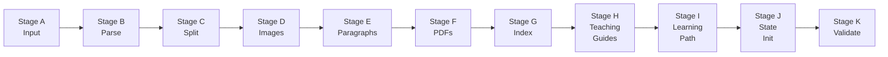

# Course Factory

<p align="center">
  <em>Turn any Markdown textbook into a persistent AI tutoring agent</em>
</p>

<p align="center">
  
  
  
  
  
</p>

> **中文读者：** See [README_CN.md](README_CN.md).

---

## What Is This?

Course Factory is an **AI Agent-powered pipeline** that transforms raw Markdown textbooks (with images and PDFs) into fully structured, self-contained **mastery-learning course directories**. Feed it a textbook; get back a persistent AI tutor that follows Bloom's 2 Sigma methodology — 1-on-1 tutoring with mastery learning, mistake tracking, and spaced repetition.

**In one sentence: Drop in a textbook, get out a tireless AI private tutor.**

---

## Architecture

### Dual-Agent Design

```
┌──────────────────────────────────────┐
│      Upper Agent (Orchestrator)      │
│  · Reads pipeline stage definitions  │
│  · Orchestrates A→K execution        │
│  · Reviews sub-Agent output          │
│  · Quality gate decisions            │
└──────────────┬───────────────────────┘
               │ Dispatch / Review
               ▼
┌──────────────────────────────────────┐
│      Lower Agent (Generator)         │
│  · Stage H: parallel .teaching.md    │
│  · 3 chapters per batch, parallel    │
│  · Content-only (structure via       │
│    deterministic scripts)            │
└──────────────────────────────────────┘
```

### A→K Pipeline



| Stage | Action | Deterministic | AI Role |
|-------|--------|:---:|---------|
| **A** | Copy template, substitute variables, configure model | ✅ | None |
| **B** | Parse chapter headings from textbook | — | Confirm structure |
| **C** | Split textbook into per-chapter files | ✅ | None |
| **D** | Rename images, normalize references | ✅ | None |
| **E** | Add `[XXXX]` paragraph IDs, generate `unit-manifest.json` | ✅ | None |
| **F** | Move PDFs to `textbook/pdf/` | ✅ | None |
| **G** | Generate `textbook/index.md` with routing tables | ✅ | None |
| **H** | Generate `.teaching.md` guides | — | **Core AI stage** |
| **I** | Generate `learning-path/` from manifest | ✅ | None |
| **J** | Initialize state files and runtime | ✅ | None |
| **K** | Run 7 validators, generate diagnostics | ✅ | None |

### Core Design Principles

**Deterministic scripts over prompt engineering.** Critical artifacts (unit-manifest.json, course-map.md, chapter-XX.md, index.md) are generated by Python scripts, deterministically, from parsed textbook structure. AI is reserved for genuinely creative tasks — writing teaching guides and diagnostic questions.

**Multi-layer constraints over trusting AI.** Three defense layers:
- **PreToolUse Hooks** — validate file structure on every write
- **Stage quality gates** — run validators after each stage, up to 3 retries
- **Final diagnostics** — comprehensive report after Stage K (secret scanning, broken image detection, validator summary)

---

## Generated Course Structure

```
course-root/
├── CLAUDE.md                     # Teaching contract (non-bypassable rules)
├── course-rules.md               # 15-step teaching read order
├── agent-persona.md              # Tutor persona
├── mastery-loop.md               # 10-step mastery loop definition
│
├── textbook/
│   ├── index.md                  # Paragraph routing table (script-generated)
│   └── chapters/
│       ├── 01-chapter-title.md   # With [XXXX] paragraph IDs
│       └── images/               # Normalized as chXX-YY-ZZZ.ext
│
├── knowledge/teaching-guides/
│   └── chapter-01/
│       ├── 01-01.teaching.md     # Knowledge point layers, question boundaries
│       └── ...
│
├── learning-path/
│   ├── unit-manifest.json        # Source of truth (script-generated)
│   ├── course-map.md
│   └── chapter-01.md
│
├── practice/
│   ├── task-generation-rules.md  # Question constitution
│   └── daily-diagnostics.md
│
├── progress/
│   ├── learning-state.json       # Structured state
│   └── mastery-state.json        # Mastery data
│
├── review/
│   ├── mistakes.md               # Error collection
│   └── concept-cards.md          # Spaced repetition
│
├── logs/
│   └── learning-events.jsonl
│
└── .course/
    └── runtime.py                # 35KB deterministic state machine
```

---

## Key Features

### 1. Bloom's 2 Sigma Mastery Loop

10-step tutoring cycle: Diagnose → Set goal → Teach → Practice → Grade → Analyze errors → Remediate → Re-test → Mastery check → Advance.

6 mastery levels: Unstarted → Recognize → Recall → Apply → Master (≥90%) → Synthesize.

### 2. Source Isolation

Every question is traceable to a specific textbook paragraph `[XXXX]`. No external knowledge, no web search, no model training data contamination. The teaching agent's knowledge boundary is explicitly constrained to the textbook.

### 3. Full Traceability

Each knowledge point, question, and progress update maps to a `[XXXX]` paragraph ID. Teaching guides contain exact paragraph range references. If the AI teaches incorrectly or asks off-topic questions, you can trace to the exact source paragraph.

### 4. Deterministic Scripts + Parallel AI

Stage H uses batch-parallel generation: 3 chapters per batch, each chapter in an independent sub-Agent. ~3× faster than serial generation. Upper Agent reviews all output against a 5-item hard checklist (unit splitting, knowledge hierarchy, question boundaries, learning experience, source fidelity).

### 5. Industrial-Grade Quality Gates

- **On write**: 5 PreToolUse hooks validate structure, paragraph numbering, manifest consistency
- **On stage complete**: Quality gates with up to 3 retries
- **On finish**: Full diagnostic report (secret scanning, broken images, weak references)

Validators check specific, concrete things — e.g., learning objectives use actionable verbs (`explain | derive | demonstrate`), not vague ones (`understand | grasp | appreciate`).

---

## Quick Start

```bash
git clone https://github.com/Suerzong/fac.git
cd fac
cp .claude/settings.example.json .claude/settings.local.json

# Start course generation
claude /init-course "path/to/your/textbook/materials"
```

The skill guides you through mode selection, model configuration, variable inference, and automated A→K pipeline execution.

### Validation Commands

```bash
python scripts/validate_learning_path_bundle.py <course_dir>
python scripts/validate_teaching_guides_bundle.py <course_dir>
python scripts/validate_course_quality.py <course_dir>
python scripts/build_pipeline_diagnostics.py <course_dir>
python -m pytest tests/
```

---

## Project Structure

```
fac/
├── README.md / README_CN.md      # Docs
├── LICENSE                       # MIT
├── guide.md                      # Full architecture reference (62KB)
├── init-course.md                # 12 course variables + init checklist
├── pipeline/                     # Stage A→K definitions (11 files, ~55KB)
├── scripts/                      # Python scripts (16 files, ~148KB)
├── .claude/
│   ├── skills/init-course/       # Claude Code Skill (22KB)
│   ├── commands/init-course.md   # Command entry (38-step execution rules)
│   ├── hooks/                    # 6 PreToolUse validation hooks (~50KB)
│   └── settings.example.json     # Hook config template
├── 模板course/                   # Course template skeleton (~30 files)
│   └── .course/runtime.py        # Teaching state machine (35KB)
└── tests/                        # Unit tests (11 test cases)
```

---

## Key Engineering Decisions

**Why dual agents?** One agent doing both planning and generation tends to skip validation steps. Separating orchestration from content generation ensures consistent quality and auditable output.

**Why Python scripts for manifest, not AI?** `unit-manifest.json` is the course skeleton — format errors cascade to every downstream stage. Deterministic scripts ensure it's always structurally correct, regardless of LLM output variance.

**Why parallel batches in Stage H?** Stage H dominates total pipeline time (10-30 `.teaching.md` files per chapter). 3-chapter parallel batches reduce total time by ~3× versus serial execution.

**Why zero key leakage?** `write_local_claude_settings.py` reads model config from environment variables and writes to `settings.local.json` (gitignored). Keys are never echoed to terminal, logs, or progress files.

---

## Known Limitations

| Limitation | Mitigation |
|------------|------------|
| Markdown-only input | Add PDF/Word → Markdown preprocessing |
| Claude Code-dependent pipeline | Abstract as standalone Python orchestrator |
| Single course at a time | Batch course build queue |
| Chinese-optimized paragraph parsing | Extend English textbook structure support |

---

## License

MIT License — see [LICENSE](LICENSE)

---

## Acknowledgments

- [Anthropic](https://anthropic.com) — Claude Code platform (Skill, Hook, Command mechanisms)
- Benjamin Bloom — 2 Sigma educational theory
