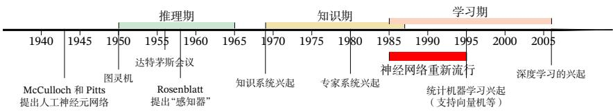
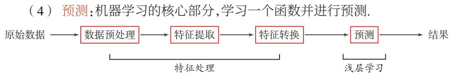
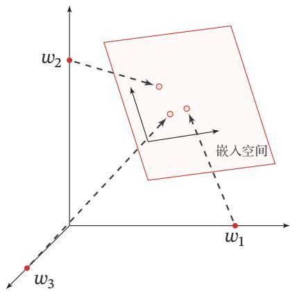
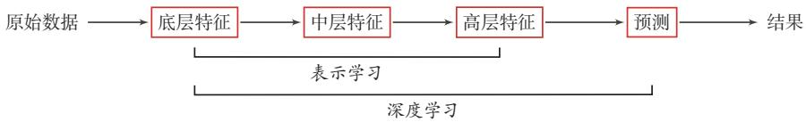
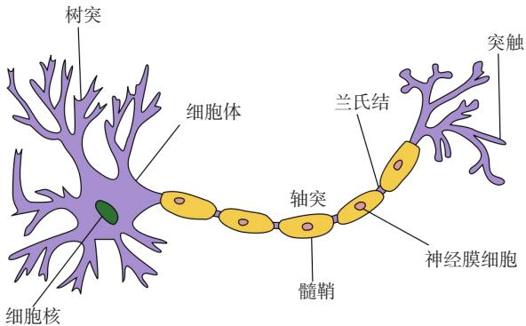
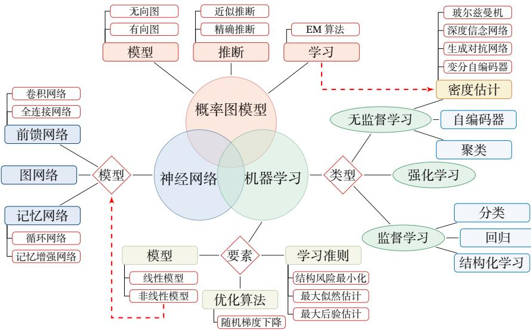

## 第1章 绪论

[¶0001] 一个人在不接触对方的情况下，通过一种特殊的方式，和对方进行一系列的问答．如果在相当长时间内，他无法根据这些问题判断对方是人还是计算机，那么就可以认为这个计算机是智能的．

[¶0002] —阿兰·图灵（Alan Turing）

[¶0003] 《Computing Machinery and Intelligence 》

[¶0004] 深度学习（Deep Learning）是近年来发展十分迅速的研究领域，并且在人工智能的很多子领域都取得了巨大的成功．从根源来讲，深度学习是机器学习的一个分支，是指一类问题以及解决这类问题的方法

[¶0005] 首先，深度学习问题是一个机器学习问题，指从有限样例中通过算法总结出一般性的规律，并可以应用到新的未知数据上．比如，我们可以从一些历史病例的集合中总结出症状和疾病之间的规律．这样当有新的病人时，我们可以利用总结出来的规律，来判断这个病人得了什么疾病

[¶0006] 其次，深度学习采用的模型一般比较复杂，指样本的原始输入到输出目标之间的数据流经过多个线性或非线性的组件（component）．因为每个组件都会对信息进行加工，并进而影响后续的组件，所以当我们最后得到输出结果时，我们并不清楚其中每个组件的贡献是多少．这个问题叫作贡献度分配问题（CreditAssignment Problem，CAP）[Minsky, 1961]．在深度学习中，贡献度分配问题是一个很关键的问题，这关系到如何学习每个组件中的参数

[¶0007] 贡献度分配问题也经常翻译为信用分配问题或功劳分配问题

[¶0008] 目前，一种可以比较好解决贡献度分配问题的模型是人工神经网络（Artifi-cial Neural Network，ANN）．人工神经网络，也简称神经网络，是一种受人脑神经系统的工作方式启发而构造的数学模型．和目前计算机的结构不同，人脑神经系统是一个由生物神经元组成的高度复杂网络，是一个并行的非线性信息处理系统．人脑神经系统可以将声音、视觉等信号经过多层的编码，从最原始的低层特征不断加工、抽象，最终得到原始信号的语义表示．和人脑神经网络类似，人工神经网络是由人工神经元以及神经元之间的连接构成，其中有两类特殊的神经元：一类用来接收外部的信息，另一类用来输出信息．这样，神经网络可以看作信息从输入到输出的信息处理系统．如果我们把神经网络看作由一组参数控制的复杂函数，并用来处理一些模式识别任务（比如语音识别、人脸识别等），神经网络的参数可以通过机器学习的方式来从数据中学习．因为神经网络模型一般比较复杂，从输入到输出的信息传递路径一般比较长，所以复杂神经网络的学习可以看成是一种深度的机器学习，即深度学习

[¶0009] 神经网络和深度学习并不等价．深度学习可以采用神经网络模型，也可以采用其他模型（比如深度信念网络是一种概率图模型）．但是，由于神经网络模型可以比较容易地解决贡献度分配问题，因此神经网络模型成为深度学习中主要采用的模型．虽然深度学习一开始用来解决机器学习中的表示学习问题，但是由于其强大的能力，深度学习越来越多地用来解决一些通用人工智能问题，比如推理、决策等

[¶0010] 表示学习参见第1.3节

[¶0011] 在本书中，我们主要介绍有关神经网络和深度学习的基本概念、相关模型、学习方法以及在计算机视觉、自然语言处理等领域的应用．在本章中，我们先介绍人工智能的基础知识，然后再介绍神经网络和深度学习的基本概念

## 1.1 人工智能

[¶0012] 智能（Intelligence）是现代生活中很常见的一个词，比如智能手机、智能家居、智能驾驶等．在不同使用场合中，智能的含义也不太一样．比如“智能手机”中的“智能”一般是指由计算机控制并具有某种智能行为．这里的“计算机控制”+“智能行为”隐含了对人工智能的简单定义

[¶0013] 简单地讲，人工智能（Artificial Intelligence，AI）就是让机器具有人类的智能，这也是人们长期追求的目标．这里关于什么是“智能”并没有一个很明确的定义，但一般认为智能（或特指人类智能）是知识和智力的总和，都和大脑的思维活动有关．人类大脑是经过了上亿年的进化才形成了如此复杂的结构，但我们至今仍然没有完全了解其工作机理．虽然随着神经科学、认知心理学等学科的发展，人们对大脑的结构有了一定程度的了解，但对大脑的智能究竟是怎么产生的还知道得很少．我们并不理解大脑的运作原理，以及如何产生意识、情感、记忆等功能．因此，通过“复制”人脑来实现人工智能在目前阶段是不切实际的

[¶0014] “智能”可以理解为“智力”和“能力”．前者是智能的基础，后者是指获取和运用知识求解的能力

[¶0015] 1950年，阿兰·图灵（Alan Turing）发表了一篇有着重要影响力的论文《Computing Machinery and Intelligence》，讨论了创造一种“智能机器”的可能性．由于“智能”一词比较难以定义，他提出了著名的图灵测试：“一个人在不接触对方的情况下，通过一种特殊的方式和对方进行一系列的问答．如果在相当长时https://nndl.github.io/

[¶0016] 间内，他无法根据这些问题判断对方是人还是计算机，那么就可以认为这个计算机是智能的”．图灵测试是促使人工智能从哲学探讨到科学研究的一个重要因素，引导了人工智能的很多研究方向．因为要使得计算机能通过图灵测试，计算机就必须具备理解语言、学习、记忆、推理、决策等能力．这样，人工智能就延伸出了很多不同的子学科，比如机器感知（计算机视觉、语音信息处理）、学习（模式识别、机器学习、强化学习）、语言（自然语言处理）、记忆（知识表示）、决策（规划、数据挖掘）等．所有这些研究领域都可以看成是人工智能的研究范畴

[¶0017] 人工智能是计算机科学的一个分支，主要研究、开发用于模拟、延伸和扩展人类智能的理论、方法、技术及应用系统等．和很多其他学科不同，人工智能这个学科的诞生有着明确的标志性事件，就是1956年的达特茅斯（Dartmouth）会议．在这次会议上，“人工智能”被提出并作为本研究领域的名称．同时，人工智能研究的使命也得以确定．John McCarthy提出了人工智能的定义：人工智能就是要让机器的行为看起来就像是人所表现出的智能行为一样

[¶0018] 目前，人工智能的主要领域大体上可以分为以下几个方面：

[¶0019] John McCarthy （19-27～2011），人工智能学科奠基人之一，1971年图灵奖得主

[¶0020] （1） 感知：模拟人的感知能力，对外部刺激信息（视觉和语音等）进行感知和加工．主要研究领域包括语音信息处理和计算机视觉等

[¶0021] （2） 学习：模拟人的学习能力，主要研究如何从样例或从与环境的交互中进行学习．主要研究领域包括监督学习、无监督学习和强化学习等

[¶0022] （3） 认知：模拟人的认知能力，主要研究领域包括知识表示、自然语言理解、推理、规划、决策等

## 1.1.1 人工智能的发展历史

[¶0023] 人工智能从诞生至今，经历了一次又一次的繁荣与低谷，其发展历程大体上可以分为“推理期”“知识期”和“学习期”[周志华, 2016]

## 1.1.1.1 推理期

[¶0024] 1956年达特茅斯会议之后，研究者对人工智能的热情高涨，之后的十几年是人工智能的黄金时期．大部分早期研究者都通过人类的经验，基于逻辑或者事实归纳出来一些规则，然后通过编写程序来让计算机完成一个任务．这个时期中，研究者开发了一系列的智能系统，比如几何定理证明器、语言翻译器等．这些初步的研究成果也使得研究者对开发出具有人类智能的机器过于乐观，低估了实现人工智能的难度．有些研究者甚至认为：“二十年内，机器将能完成人能做到的一切工作”，“在三到八年的时间里可以研发出一台具有人类平均智能的机器”．但随着研究的深入，研究者意识到这些推理规则过于简单，对项目难度评估

[¶0025] 人工智能低谷，也叫人工智能冬天（AI Win-ter），指人工智能史上研究资金及学术界研究兴趣都大幅减少的时期．人工智能领域经历过好几次低谷期．每次狂热高潮之后，紧接着是失望、批评以及研究资金断绝，然后在几十年后又重燃研究兴趣．1974～1980 年及1987～1993 年是两个主要的低谷时期，其他还有几个较小的低谷

[¶0026] 不足，原来的乐观预期受到严重打击．人工智能的研究开始陷入低谷，很多人工智能项目的研究经费也被消减

## 1.1.1.2 知识期

[¶0027] 到了20世纪70年代，研究者意识到知识对于人工智能系统的重要性．特别是对于一些复杂的任务，需要专家来构建知识库．在这一时期，出现了各种各样的专家系统（Expert System），并在特定的专业领域取得了很多成果．专家系统可以简单理解为“知识库+推理机”，是一类具有专门知识和经验的计算机智能程序系统．专家系统一般采用知识表示和知识推理等技术来完成通常由领域专家才能解决的复杂问题，因此专家系统也被称为基于知识的系统．一个专家系统必须具备三要素：1）领域专家级知识；2）模拟专家思维；3）达到专家级的水平在这一时期，Prolog（Programming in Logic）语言是主要的开发工具，用来建造专家系统、智能知识库以及处理自然语言理解等

## 1.1.1.3 学习期

[¶0028] Prolog是一种基于逻辑学理论而创建的逻辑编程语言，最初被运用于自然语言、逻辑推理等研究领域

[¶0029] 对于人类的很多智能行为（比如语言理解、图像理解等），我们很难知道其中的原理，也无法描述这些智能行为背后的“知识”．因此，我们也很难通过知识和推理的方式来实现这些行为的智能系统．为了解决这类问题，研究者开始将研究重点转向让计算机从数据中自己学习．事实上，“学习”本身也是一种智能行为．从人工智能的萌芽时期开始，就有一些研究者尝试让机器来自动学习，即机器学习（Machine Learning，ML）．机器学习的主要目的是设计和分析一些学习算法，让计算机可以从数据（经验）中自动分析并获得规律，之后利用学习到的规律对未知数据进行预测，从而帮助人们完成一些特定任务，提高开发效率．机器学习的研究内容也十分广泛，涉及线性代数、概率论、统计学、数学优化、计算复杂性等多门学科．在人工智能领域，机器学习从一开始就是一个重要的研究方向．但直到1980年后，机器学习因其在很多领域的出色表现，才逐渐成为热门学科

[¶0030] 图1.1给出了人工智能发展史上的重要事件

[¶0031]
  
图1.1 人工智能发展史

[¶0032] 在发展了60多年后，人工智能虽然可以在某些方面超越人类，但想让机器真正通过图灵测试，具备真正意义上的人类智能，这个目标看上去仍然遥遥无期

## 1.1.2 人工智能的流派

[¶0033] 目前我们对人类智能的机理依然知之甚少，还没有一个通用的理论来指导如何构建一个人工智能系统．不同的研究者都有各自的理解，因此在人工智能的研究过程中产生了很多不同的流派．比如一些研究者认为人工智能应该通过研究人类智能的机理来构建一个仿生的模拟系统，而另外一些研究者则认为可以使用其他方法来实现人类的某种智能行为．一个著名的例子是让机器具有飞行能力不需要模拟鸟的飞行方式，而是应该研究空气动力学

[¶0034] 尽管人工智能的流派非常多，但主流的方法大体上可以归结为以下两种：

[¶0035] （1） 符号主义（Symbolism），又称逻辑主义、心理学派或计算机学派，是指通过分析人类智能的功能，然后用计算机来实现这些功能的一类方法．符号主义有两个基本假设：a）信息可以用符号来表示；b）符号可以通过显式的规则（比如逻辑运算）来操作．人类的认知过程可以看作符号操作过程．在人工智能的推理期和知识期，符号主义的方法比较盛行，并取得了大量的成果

[¶0036] （2） 连接主义（Connectionism），又称仿生学派或生理学派，是认知科学领域中的一类信息处理的方法和理论．在认知科学领域，人类的认知过程可以看作一种信息处理过程．连接主义认为人类的认知过程是由大量简单神经元构成的神经网络中的信息处理过程，而不是符号运算．因此，连接主义模型的主要结构是由大量简单的信息处理单元组成的互联网络，具有非线性、分布式、并行化、局部性计算以及自适应性等特性

[¶0037] 符号主义方法的一个优点是可解释性，而这也正是连接主义方法的弊端．深度学习的主要模型神经网络就是一种连接主义模型．随着深度学习的发展，越来越多的研究者开始关注如何融合符号主义和连接主义，建立一种高效并且具有可解释性的模型

[¶0038] 关于人工智能的流派并没有严格的划分定义，也不严格对立

## 1.2 机器学习

[¶0039] 有很多文献将人工智能流派分为符号主义、连接主义和行为主义三 种，其 中行 为 主 义（Actionism）主要从生物进化的角度考虑，主张从和外界环境的互动中获取智能

[¶0040] 机器学习（Machine Learning，ML）是指从有限的观测数据中学习（或“猜测”）出具有一般性的规律，并利用这些规律对未知数据进行预测的方法．机器学习是人工智能的一个重要分支，并逐渐成为推动人工智能发展的关键因素

[¶0041] 传统的机器学习主要关注如何学习一个预测模型．一般需要首先将数据表示为一组特征（Feature），特征的表示形式可以是连续的数值、离散的符号或其他形式．然后将这些特征输入到预测模型，并输出预测结果．这类机器学习可以看作浅层学习（Shallow Learning）．浅层学习的一个重要特点是不涉及特征学习，其特征主要靠人工经验或特征转换方法来抽取

[¶0042] 机器学习的详细介绍参见第2章

[¶0043] 当我们用机器学习来解决实际任务时，会面对多种多样的数据形式，比如声音、图像、文本等．不同数据的特征构造方式差异很大．对于图像这类数据，我们可以很自然地将其表示为一个连续的向量．而对于文本数据，因为其一般由离散符号组成，并且每个符号在计算机内部都表示为无意义的编码，所以通常很难找到合适的表示方式．因此，在实际任务中使用机器学习模型一般会包含以下几个步骤（如图1.2所示）：

[¶0044] 将图像数据表示为向量的方法有很多种，比如直接将一幅图像的所有像素值（灰度值或RGB值）组成一个连续向量

[¶0045] （1） 数据预处理：对数据的原始形式进行初步的数据清理（比如去掉一些有缺失特征的样本，或去掉一些冗余的数据特征等）和加工（对数值特征进行缩放和归一化等），并构建成可用于训练机器学习模型的数据集

[¶0046] （2） 特征提取：从数据的原始特征中提取一些对特定机器学习任务有用的高质量特征．比如在图像分类中提取边缘、尺度不变特征变换（Scale InvariantFeature Transform，SIFT）特征，在文本分类中去除停用词等

[¶0047] （3） 特征转换：对特征进行进一步的加工，比如降维和升维．降维包括特征抽取（Feature Extraction）和特征选择（Feature Selection）两种途径．常用的特征转换方法有主成分分析（Principal Components Analysis，PCA）、线性判别分析（Linear Discriminant Analysis，LDA）等

[¶0048]
  
图1.2 传统机器学习的数据处理流程

[¶0049] 上述流程中，每步特征处理以及预测一般都是分开进行的．传统的机器学习模型主要关注最后一步，即构建预测函数．但是实际操作过程中，不同预测模型的性能相差不多，而前三步中的特征处理对最终系统的准确性有着十分关键的作用．特征处理一般都需要人工干预完成，利用人类的经验来选取好的特征，并最终提高机器学习系统的性能．因此，很多的机器学习问题变成了特征工程（Feature Engineering）问题．开发一个机器学习系统的主要工作量都消耗在了预处理、特征提取以及特征转换上

## 1.3 表示学习

[¶0050] 为了提高机器学习系统的准确率，我们就需要将输入信息转换为有效的特征，或者更一般性地称为表示（Representation）．如果有一种算法可以自动地学习出有效的特征，并提高最终机器学习模型的性能，那么这种学习就可以叫作表示学习（Representation Learning）https://nndl.github.io/

[¶0051] 语义鸿沟 表示学习的关键是解决语义鸿沟（Semantic Gap）问题．语义鸿沟问题是指输入数据的底层特征和高层语义信息之间的不一致性和差异性．比如给定一些关于“车”的图片，由于图片中每辆车的颜色和形状等属性都不尽相同，因此不同图片在像素级别上的表示（即底层特征）差异性也会非常大．但是我们理解这些图片是建立在比较抽象的高层语义概念上的．如果一个预测模型直接建立在底层特征之上，会导致对预测模型的能力要求过高．如果可以有一个好的表示在某种程度上能够反映出数据的高层语义特征，那么我们就能相对容易地构建后续的机器学习模型

[¶0052] 在表示学习中，有两个核心问题：一是“什么是一个好的表示”；二是“如何学习到好的表示”

## 1.3.1 局部表示和分布式表示

[¶0053] “好的表示”是一个非常主观的概念，没有一个明确的标准．但一般而言，一个好的表示具有以下几个优点：

[¶0054] （1） 一个好的表示应该具有很强的表示能力，即同样大小的向量可以表示更多信息

[¶0055] （2） 一个好的表示应该使后续的学习任务变得简单，即需要包含更高层的语义信息

[¶0056] （3） 一个好的表示应该具有一般性，是任务或领域独立的．虽然目前的大部分表示学习方法还是基于某个任务来学习，但我们期望其学到的表示可以比较容易地迁移到其他任务上

[¶0057] 在机器学习中，我们经常使用两种方式来表示特征：局部表示（Local Rep-resentation）和分布式表示（Distributed Representation）

[¶0058] 以颜色表示为例，我们可以用很多词来形容不同的颜色1，除了基本的“红”“蓝”“绿”“白”“黑”等之外，还有很多以地区或物品命名的，比如“中国红”“天蓝色”“咖啡色”“琥珀色”等．如果要在计算机中表示颜色，一般有两种表示方法

[¶0059] 一种表示颜色的方法是以不同名字来命名不同的颜色，这种表示方式叫作局部表示，也称为离散表示或符号表示．局部表示通常可以表示为one-hot向量的形式．假设所有颜色的名字构成一个词表??，词表大小为|??|．我们可以用一个|??|维的one-hot向量来表示每一种颜色．在第??种颜色对应的one-hot向量中，第??维的值为1，其他都为0

[¶0060] 局部表示有两个优点：1）这种离散的表示方式具有很好的解释性，有利于人工归纳和总结特征，并通过特征组合进行高效的特征工程；2）通过多种特征组合得到的表示向量通常是稀疏的二值向量，当用于线性模型时计算效率非常高．但局部表示有两个不足之处：1）one-hot向量的维数很高，且不能扩展．如果有一种新的颜色，我们就需要增加一维来表示；2）不同颜色之间的相似度都为0，即我们无法知道“红色”和“中国红”的相似度要高于“红色”和“黑色”的相似度．

[¶0061] 另一种表示颜色的方法是用RGB值来表示颜色，不同颜色对应到R、G、B三维空间中一个点，这种表示方式叫作分布式表示．分布式表示通常可以表示为低维的稠密向量

[¶0062] 和局部表示相比，分布式表示的表示能力要强很多，分布式表示的向量维度一般都比较低．我们只需要用一个三维的稠密向量就可以表示所有颜色．并且，分布式表示也很容易表示新的颜色名．此外，不同颜色之间的相似度也很容易计算．

[¶0063] 将分 布 式 表 示叫 作分散式表示可能更容易理解，即一种颜色的语义分散到语义空间中的不同基向量上

[¶0064] 表1.1列出了4种颜色的局部表示和分布式表示

[¶0065] 表1.1 局部表示和分布式表示示例
<table><tr><td>颜色</td><td>局部表示</td><td>分布式表示</td></tr><tr><td>琥珀色</td><td>[1,0,0,0]T</td><td>[1.00,0.75,0.00]</td></tr><tr><td>天蓝色</td><td>[0,1,0,0]T</td><td>[0.00,0.5,1.00]T</td></tr><tr><td>中国红</td><td>[0,0,1,0]T</td><td>[0.67, 0.22, 0.12]T</td></tr><tr><td>咖啡色</td><td>[0,0,0,1]T</td><td>[0.44, 0.31 0.22]T</td></tr></table>

[¶0066] 我们可以使用神经网络来将高维的局部表示空间ℝ|??| 映射到一个非常低维的分布式表示空间 $\mathbb { R } ^ { D } , D \ll | \mathcal { V } |$ ．在这个低维空间中，每个特征不再是坐标轴上的点，而是分散在整个低维空间中．在机器学习中，这个过程也称为嵌入（Em-bedding）．嵌入通常指将一个度量空间中的一些对象映射到另一个低维的度量空间中，并尽可能保持不同对象之间的拓扑关系．比如自然语言中词的分布式表示，也经常叫作词嵌入

[¶0067] 图1.3展示了一个3维one-hot向量空间和一个2维嵌入空间的对比．图中有三个样本 $w _ { 1 } , w _ { 2 }$ 和 $w _ { 3 }$ ．在one-hot向量空间中，每个样本都位于坐标轴上，每个坐标轴上一个样本．而在低维的嵌入空间中，每个样本都不在坐标轴上，样本之间可以计算相似度

[¶0068]
  
图 1.3 one-hot向量空间与嵌入空间

## 1.3.2 表示学习

[¶0069] 要学习到一种好的高层语义表示（一般为分布式表示），通常需要从底层特征开始，经过多步非线性转换才能得到．深层结构的优点是可以增加特征的重用性，从而指数级地增加表示能力．因此，表示学习的关键是构建具有一定深度的多层次特征表示 [Bengio et al., 2013]

[¶0070] 连续多次的线性转换等价于一次线性转换

[¶0071] 在传统的机器学习中，也有很多有关特征学习的方法，比如主成分分析、线性判别分析、独立成分分析等．但是，传统的特征学习一般是通过人为地设计一些准则，然后根据这些准则来选取有效的特征．特征的学习是和最终预测模型的学习分开进行的，因此学习到的特征不一定可以提升最终模型的性能

[¶0072] 参见第2.6.1节

## 1.4 深度学习

[¶0073] 为了学习一种好的表示，需要构建具有一定“深度”的模型，并通过学习算法来让模型自动学习出好的特征表示（从底层特征，到中层特征，再到高层特征），从而最终提升预测模型的准确率．所谓“深度”是指原始数据进行非线性特征转换的次数．如果把一个表示学习系统看作一个有向图结构，深度也可以看作从输入节点到输出节点所经过的最长路径的长度

[¶0074] 这样我们就需要一种学习方法可以从数据中学习一个“深度模型”，这就是深度学习（Deep Learning，DL）．深度学习是机器学习的一个子问题，其主要目的是从数据中自动学习到有效的特征表示

[¶0075] 图1.4给出了深度学习的数据处理流程．通过多层的特征转换，把原始数据变成更高层次、更抽象的表示．这些学习到的表示可以替代人工设计的特征，从而避免“特征工程”

[¶0076] 深度学习虽然早期主要用来进行表示学习，但后来越来越多地用来处理更加复杂的推理、决策等问题

[¶0077]
  
图1.4 深度学习的数据处理流程

[¶0078] 深度学习是将原始的数据特征通过多步的特征转换得到一种特征表示，并进一步输入到预测函数得到最终结果．和“浅层学习”不同，深度学习需要解决的关键问题是贡献度分配问题（Credit Assignment Problem，CAP）[Minsky,1961]，即一个系统中不同的组件（component）或其参数对最终系统输出结果的贡献或影响．以下围棋为例，每当下完一盘棋，最后的结果要么赢要么输．我们会思考哪几步棋导致了最后的胜利，或者又是哪几步棋导致了最后的败局．如何判断每一步棋的贡献就是贡献度分配问题，这是一个非常困难的问题．从某种意义上讲，深度学习可以看作一种强化学习（Reinforcement Learning，RL），每个内部组件并不能直接得到监督信息，需要通过整个模型的最终监督信息（奖励）得到，并且有一定的延时性

[¶0079] 目前，深度学习采用的模型主要是神经网络模型，其主要原因是神经网络模型可以使用误差反向传播算法，从而可以比较好地解决贡献度分配问题．只要是超过一层的神经网络都会存在贡献度分配问题，因此可以将超过一层的神经网络都看作深度学习模型．随着深度学习的快速发展，模型深度也从早期的5 ∼ 10层增加到目前的数百层．随着模型深度的不断增加，其特征表示的能力也越来越强，从而使后续的预测更加容易

## 1.4.1 端到端学习

[¶0080] 在一些复杂任务中，传统机器学习方法需要将一个任务的输入和输出之间人为地切割成很多子模块（或多个阶段），每个子模块分开学习．比如一个自然语言理解任务，一般需要分词、词性标注、句法分析、语义分析、语义推理等步骤这种学习方式有两个问题：一是每一个模块都需要单独优化，并且其优化目标和任务总体目标并不能保证一致；二是错误传播，即前一步的错误会对后续的模型造成很大的影响．这样就增加了机器学习方法在实际应用中的难度

[¶0081] 端到端学习（End-to-End Learning），也称端到端训练，是指在学习过程中不进行分模块或分阶段训练，直接优化任务的总体目标．在端到端学习中，一般不需要明确地给出不同模块或阶段的功能，中间过程不需要人为干预．端到端学习的训练数据为“输入-输出”对的形式，无须提供其他额外信息．因此，端到端学习和深度学习一样，都是要解决贡献度分配问题．目前，大部分采用神经网络模型的深度学习也可以看作一种端到端的学习

## 1.5 神经网络

[¶0082] 随着神经科学、认知科学的发展，我们逐渐知道人类的智能行为都和大脑活动有关．人类大脑是一个可以产生意识、思想和情感的器官．受到人脑神经系统的启发，早期的神经科学家构造了一种模仿人脑神经系统的数学模型，称为人工神经网络，简称神经网络．在机器学习领域，神经网络是指由很多人工神经元构成的网络结构模型，这些人工神经元之间的连接强度是可学习的参数

## 1.5.1 人脑神经网络

[¶0083] 人类大脑是人体最复杂的器官，由神经元、神经胶质细胞、神经干细胞和血管组成．其中，神经元（Neuron），也叫神经细胞（Nerve Cell），是携带和传输信息的细胞，是人脑神经系统中最基本的单元．人脑神经系统是一个非常复杂的组织，包含近860亿个神经元[Azevedo et al.,2009]，每个神经元有上千个突触和其他神经元相连接．这些神经元和它们之间的连接形成巨大的复杂网络，其中神经连接的总长度可达数千公里．我们人造的复杂网络，比如全球的计算机网络，和大脑神经网络相比要“简单”得多

[¶0084] 早在1904年，生物学家就已经发现了神经元的结构．典型的神经元结构大致可分为细胞体和细胞突起

[¶0085] （1） 细胞体（Soma）中的神经细胞膜上有各种受体和离子通道，胞膜的受体可与相应的化学物质神经递质结合，引起离子通透性及膜内外电位差发生改变，产生相应的生理活动：兴奋或抑制

[¶0086] （2） 细胞突起是由细胞体延伸出来的细长部分，又可分为树突和轴突

[¶0087] a) 树突（Dendrite）可以接收刺激并将兴奋传入细胞体．每个神经元可以有一或多个树突

[¶0088] b) 轴突（Axon）可以把自身的兴奋状态从胞体传送到另一个神经元或其他组织．每个神经元只有一个轴突

[¶0089] 神经元可以接收其他神经元的信息，也可以发送信息给其他神经元．神经元之间没有物理连接，两个“连接”的神经元之间留有20纳米左右的缝隙，并靠突触（Synapse）进行互联来传递信息，形成一个神经网络，即神经系统．突触可以理解为神经元之间的连接“接口”，将一个神经元的兴奋状态传到另一个神经元一个神经元可被视为一种只有两种状态的细胞：兴奋和抑制．神经元的状态取决于从其他的神经细胞收到的输入信号量，以及突触的强度（抑制或加强）．当信号量总和超过了某个阈值时，细胞体就会兴奋，产生电脉冲．电脉冲沿着轴突并通过突触传递到其他神经元．图1.5给出了一种典型的神经元结构

[¶0090]
  
图1.5 典型神经元结构1

[¶0091] 我们知道，一个人的智力不完全由遗传决定，大部分来自于生活经验．也就是说人脑神经网络是一个具有学习能力的系统．那么人脑神经网络是如何学习的呢？在人脑神经网络中，每个神经元本身并不重要，重要的是神经元如何组成网络．不同神经元之间的突触有强有弱，其强度是可以通过学习（训练）来不断改变的，具有一定的可塑性．不同的连接形成了不同的记忆印痕．1949年，加拿大心理学家 Donald Hebb 在《行为的组织》（The Organization of Behavior）一书中提出突触可塑性的基本原理，“当神经元 A的一个轴突和神经元B很近，足以对它产生影响，并且持续地、重复地参与了对神经元B的兴奋，那么在这两个神经元或其中之一会发生某种生长过程或新陈代谢变化，以致神经元A作为能使神经元B兴奋的细胞之一，它的效能加强了．”这个机制称为赫布理论（HebbianTheory）或赫布规则（Hebbian Rule，或 Hebb’s Rule）．如果两个神经元总是相关联地受到刺激，它们之间的突触强度增加．这样的学习方法被称为赫布型学习（Hebbian learning）．Hebb认为人脑有两种记忆：长期记忆和短期记忆．短期记忆持续时间不超过一分钟．如果一个经验重复足够的次数，此经验就可储存在长期记忆中．短期记忆转化为长期记忆的过程就称为凝固作用．人脑中的海马区为大脑结构凝固作用的核心区域

[¶0092] Donald Hebb（1904～1985），加 拿 大 神 经心理学家，认知心理生理学的开创者

## 1.5.2 人工神经网络

[¶0093] 人工神经网络是为模拟人脑神经网络而设计的一种计算模型，它从结构、实现机理和功能上模拟人脑神经网络．人工神经网络与生物神经元类似，由多个节点（人工神经元）互相连接而成，可以用来对数据之间的复杂关系进行建模．不同节点之间的连接被赋予了不同的权重，每个权重代表了一个节点对另一个节点的影响大小．每个节点代表一种特定函数，来自其他节点的信息经过其相应的权重综合计算，输入到一个激活函数中并得到一个新的活性值（兴奋或抑制）从系统观点看，人工神经元网络是由大量神经元通过极其丰富和完善的连接而构成的自适应非线性动态系统

[¶0094] 虽然我们可以比较容易地构造一个人工神经网络，但是如何让人工神经网络具有学习能力并不是一件容易的事情．早期的神经网络模型并不具备学习能力．首个可学习的人工神经网络是赫布网络，采用一种基于赫布规则的无监督学习方法．感知器是最早的具有机器学习思想的神经网络，但其学习方法无法扩展到多层的神经网络上．直到1980年左右，反向传播算法才有效地解决了多层神经网络的学习问题，并成为最为流行的神经网络学习算法

[¶0095] 人工神经网络诞生之初并不是用来解决机器学习问题．由于人工神经网络可以用作一个通用的函数逼近器（一个两层的神经网络可以逼近任意的函数），因此我们可以将人工神经网络看作一个可学习的函数，并将其应用到机器学习中．理论上，只要有足够的训练数据和神经元数量，人工神经网络就可以学到很多复杂的函数．我们可以把一个人工神经网络塑造复杂函数的能力称为网络容量（Network Capacity），这与可以被储存在网络中的信息的复杂度以及数量相关

## 1.5.3 神经网络的发展历史

[¶0096] 神经网络的发展大致经过五个阶段

[¶0097] 第一阶段：模型提出 第一阶段为1943年～1969年，是神经网络发展的第一个高潮期．在此期间，科学家们提出了许多神经元模型和学习规则

[¶0098] 1943 年，心理学家 Warren McCulloch 和数学家 Walter Pitts 最早提出了一种基于简单逻辑运算的人工神经网络，这种神经网络模型称为MP模型，至此开启了人工神经网络研究的序幕．1948年，Alan Turing提出了一种“B型图灵机”．“B型图灵机”可以基于Hebbian法则来进行学习．1951年，McCulloch和 Pitts 的学生 Marvin Minsky 建造了第一台神经网络机 SNARC． [Rosenblatt,1958]提出了一种可以模拟人类感知能力的神经网络模型，称为感知器（Percep-tron），并提出了一种接近于人类学习过程（迭代、试错）的学习算法

[¶0099] 在这一时期，神经网络以其独特的结构和处理信息的方法，在许多实际应用领域（自动控制、模式识别等）中取得了显著的成效

[¶0100] 第二阶段：冰河期 第二阶段为1969年～1983年，是神经网络发展的第一个低谷期．在此期间，神经网络的研究处于长年停滞及低潮状态

[¶0101] 1969年，Marvin Minsky出版《感知器》一书，指出了神经网络的两个关键缺陷：一是感知器无法处理“异或”回路问题；二是当时的计算机无法支持处理大

[¶0102] 在本书中，人工神经网络主要是作为一种映射函数，即机器学习中的模型

[¶0103] Marvin Minsky（1927～2016），人工智能领域最重要的领导者和创新者之一，麻省理工学院人工智能实验室的创始人之一．因其在人工智能领域的贡献，于1969年获得图灵奖

[¶0104] 型神经网络所需要的计算能力．这些论断使得人们对以感知器为代表的神经网络产生质疑，并导致神经网络的研究进入了十多年的“冰河期”

[¶0105] 但在这一时期，依然有不少学者提出了很多有用的模型或算法．1974年，哈佛大学的 Paul Werbos 发明反向传播算法（BackPropagation，BP）[Werbos,1974]，但当时未受到应有的重视．1980年，福岛邦彦提出了一种带卷积和子采样操作的多层神经网络：新知机（Neocognitron）[Fukushima, 1980]．新知机的提出是受到了动物初级视皮层简单细胞和复杂细胞的感受野的启发．但新知机并没有采用反向传播算法，而是采用了无监督学习的方式来训练，因此也没有引起足够的重视

[¶0106] 第三阶段：反向传播算法引起的复兴 第三阶段为1983年～1995年，是神经网络发展的第二个高潮期．这个时期中，反向传播算法重新激发了人们对神经网络的兴趣．

[¶0107] 1983 年，物理学家 John Hopfield 提出了一种用于联想记忆（AssociativeMemory）的神经网络，称为Hopfield网络．Hopfield网络在旅行商问题上取得了当时最好结果，并引起了轰动．1984年，Geoffrey Hinton提出一种随机化版本的 Hopfield 网络，即玻尔兹曼机（Boltzmann Machine）

[¶0108] 真正引起神经网络第二次研究高潮的是反向传播算法．20世纪80年代中期，一种连接主义模型开始流行，即分布式并行处理（Parallel Distributed Pro-cessing，PDP）模型 [McClelland et al., 1986]．反向传播算法也逐渐成为 PDP 模型的主要学习算法．这时，神经网络才又开始引起人们的注意，并重新成为新的研究热点．随后，[LeCun et al.,1989]将反向传播算法引入了卷积神经网络，并在手写体数字识别上取得了很大的成功[LeCun et al., 1998]．反向传播算法是迄今最为成功的神经网络学习算法．目前在深度学习中主要使用的自动微分可以看作反向传播算法的一种扩展

[¶0109] 然而，梯度消失问题（Vanishing Gradient Problem）阻碍神经网络的进一步发展，特别是循环神经网络．为了解决这个问题，[Schmidhuber, 1992]采用两步来训练一个多层的循环神经网络：1）通过无监督学习的方式来逐层训练每一层循环神经网络，即预测下一个输入；2）通过反向传播算法进行精调

[¶0110] 第四阶段：流行度降低 第四阶段为1995年～2006年，在此期间，支持向量机和其他更简单的方法（例如线性分类器）在机器学习领域的流行度逐渐超过了神经网络．

[¶0111] 虽然神经网络可以很容易地增加层数、神经元数量，从而构建复杂的网络，但其计算复杂性也会随之增长．当时的计算机性能和数据规模不足以支持训练大规模神经网络．在20世纪90年代中期，统计学习理论和以支持向量机为代表的机器学习模型开始兴起．相比之下，神经网络的理论基础不清晰、优化困难、可https://nndl.github.io/

[¶0112] 解释性差等缺点更加凸显，因此神经网络的研究又一次陷入低潮

[¶0113] 第五阶段：深度学习的崛起 第五阶段为从2006年开始至今，在这一时期研究者逐渐掌握了训练深层神经网络的方法，使得神经网络重新崛起

[¶0114] [Hinton et al., 2006]通过逐层预训练来学习一个深度信念网络，并将其权重作为一个多层前馈神经网络的初始化权重，再用反向传播算法进行精调．这种“预训练+精调”的方式可以有效地解决深度神经网络难以训练的问题．随着深度神经网络在语音识别 [Hinton et al., 2012] 和图像分类 [Krizhevsky et al.,2012]等任务上的巨大成功，以神经网络为基础的深度学习迅速崛起．近年来，随着大规模并行计算以及GPU设备的普及，计算机的计算能力得以大幅提高．此外，可供机器学习的数据规模也越来越大．在强大的计算能力和海量的数据规模支持下，计算机已经可以端到端地训练一个大规模神经网络，不再需要借助预训练的方式．各大科技公司都投入巨资研究深度学习，神经网络迎来第三次高潮

## 1.6 本书的知识体系

[¶0115] 本书主要对神经网络和深度学习所涉及的知识提出一个较全面的基础性介绍．本书的知识体系如图1.6所示，可以分为三大块：机器学习、神经网络和概率图模型．

[¶0116]
  
图1.6 本书的知识体系

[¶0117] 本书的知识体系在各章节中的安排如下：

[¶0118] 机器学习 机器学习可以分为监督学习、无监督学习和强化学习．第2章对机器学习进行概述，使读者能够了解机器学习的基本概念以及三要素：模型、学习准https://nndl.github.io/

[¶0119] 则和优化算法，并以线性回归为例来讲述不同学习算法之间的关联．第3章主要介绍一些基本的线性模型．这两章都以监督学习为主进行介绍．第9章介绍了一些无监督学习方法，包括无监督特征学习和概率密度估计．第10章中介绍了一些和模型无关的机器学习方法．第14章介绍了深度强化学习的知识

[¶0120] 神经网络 神经网络作为一类非线性的机器学习模型，可以更好地实现输入和输出之间的映射．第4章到第6章分别讲述三种主要的神经网络模型：前馈神经网络、卷积神经网络和循环神经网络．第6章也简单介绍了一种更一般性的网络：图网络．第7章介绍神经网络的优化与正则化方法．第8章介绍神经网络中的注意力机制和外部记忆

[¶0121] 虽然这里将神经网络结构大体上分为三种类型，但是大多数网络都是复合型结构，即一个神经网络中包括多种网络结构

[¶0122] 概率图模型 概率图模型为机器学习提供了一个更加便捷的描述框架．第11章介绍了概率图模型的基本概念，包括模型表示、学习和推断．目前深度学习和概率图模型的融合已经十分流行．第12章介绍了两种概率图模型：玻尔兹曼机和深度信念网络．第13章和第15章分别介绍两种概率生成模型：深度生成模型和序列生成模型

[¶0123] 由于深度学习涉及非常多的研究领域，因此很多知识无法进行追根溯源并深入介绍．每章最后一节都提供了一些参考文献，读者可根据需要通过深入阅读来了解这些知识．此外，本书的附录中介绍了一些深度学习涉及的数学知识，包括线性代数、微积分、数学优化、概率论和信息论等

## 1.7 常用的深度学习框架

[¶0124] 在深度学习中，一般通过误差反向传播算法来进行参数学习．采用手工方式来计算梯度再写代码实现的方式会非常低效，并且容易出错．此外，深度学习模型需要的计算机资源比较多，一般需要在CPU和GPU之间不断进行切换，开发难度也比较大．因此，一些支持自动梯度计算、无缝CPU和GPU切换等功能的深度学习框架就应运而生．比较有代表性的框架包括：Theano、Caffe、TensorFlow、Pytorch、飞桨（PaddlePaddle）、Chainer 和 MXNet 等1

[¶0125] （1） $\mathrm { T h e a n o } ^ { 2 }$ ：由蒙特利尔大学的Python工具包，用来高效地定义、优化和计算张量数据的数学表达式．Theano可以透明地使用GPU和高效的符号微分．

[¶0126] （2） $\mathrm { C a f f e ^ { 3 } }$ ：由加州大学伯克利分校开发的针对卷积神经网络的计算框架，

[¶0127] 自 动 梯 度 计 算 参 见第4.5节

[¶0128] Theano项目目前已停止维护

[¶0129] 主要用于计算机视觉．Caffe用C++和Python实现，但可以通过配置文件来实现所要的网络结构，不需要编码

[¶0130] （3） TensorFlow1：由Google公司开发的深度学习框架，可以在任意具备CPU或者GPU的设备上运行．TensorFlow的计算过程使用数据流图来表示TensorFlow的名字来源于其计算过程中的操作对象为多维数组，即张量（Ten-sor）．TensorFlow 1.0版本采用静态计算图，2.0版本之后也支持动态计算图

[¶0131] （4） PyTorch2：由 Facebook、NVIDIA、Twitter 等公司开发维护的深度学习框架，其前身为Lua语言的Torch3．PyTorch也是基于动态计算图的框架，在需要动态改变神经网络结构的任务中有着明显的优势

[¶0132] （5） 飞桨（PaddlePaddle）4：由百度开发的一个高效和可扩展的深度学习框架，同时支持动态图和静态图．飞桨提供强大的深度学习并行技术，可以同时支持稠密参数和稀疏参数场景的超大规模深度学习并行训练，支持千亿规模参数和数百个节点的高效并行训练

[¶0133] （6） MindSpore5：由华为开发的一种适用于端边云场景的新型深度学习训练/推理框架．MindSpore为Ascend AI处理器提供原生支持，以及软硬件协同优化．

[¶0134] （7） Chainer6：一个最早采用动态计算图的深度学习框架，其核心开发团队为来自日本的一家机器学习创业公司 Preferred Networks．和 Tensorflow、Theano、Caffe等框架使用的静态计算图相比，动态计算图可以在运行时动态地构建计算图，因此非常适合进行一些复杂的决策或推理任务

[¶0135] （8） MXNet7：由亚马逊、华盛顿大学和卡内基·梅隆大学等开发维护的深度学习框架．MXNet支持混合使用符号和命令式编程来最大化效率和生产率，并可以有效地扩展到多个GPU和多台机器

[¶0136] 在这些基础框架之上，还有一些建立在这些框架之上的高度模块化的神经网络库，使得构建一个神经网络模型就像搭积木一样容易．其中比较有名的模块化神经网络框架有：1）基于 TensorFlow 和 Theano 的 Keras8；2）基于 Theano的Lasagne9；3）面向图结构数据的DGL10

## 1.8 总结和深入阅读

[¶0137] 要理解深度学习的意义或重要性，就得从机器学习或者是人工智能的更广的视角来分析．在传统机器学习中，除了模型和学习算法外，特征或表示也是影响最终学习效果的重要因素，甚至在很多的任务上比算法更重要．因此，要开发一个实际的机器学习系统，人们往往需要花费大量的精力去尝试设计不同的特征以及特征组合，来提高最终的系统能力，这就是所谓的特征工程问题

[¶0138] 如何自动学习有效的数据表示成为机器学习中的关键问题．早期的表示学习方法，比如特征抽取和特征选择，都是人工引入一些主观假设来进行学习的这种表示学习不是端到端的学习方式，得到的表示不一定对后续的机器学习任务有效．而深度学习是将表示学习和预测模型的学习进行端到端的学习，中间不需要人工干预．深度学习所要解决的问题是贡献度分配问题，而神经网络恰好是解决这个问题的有效模型．套用马克思的一句名言，“金银天然不是货币，但货币天然是金银”，我们可以说，神经网络天然不是深度学习，但深度学习天然是神经网络

[¶0139] 目前，深度学习主要以神经网络模型为基础，研究如何设计模型结构，如何有效地学习模型的参数，如何优化模型性能以及在不同任务上的应用等．[Ben-gio et al.,2013]给出了一个很好的表示学习综述．若希望全面了解人工神经网络和深度学习的知识，可以参考《Deep Learning》[Goodfellow et al., 2016] 以及文献 [Bengio, 2009]．关于神经网络的历史可以参考文献 [Anderson et al., 2000]斯坦福大学的CS231n1 和CS224n2是两门非常好的深度学习入门课程，分别从计算机视觉和自然语言处理两个角度来讲授深度学习的基础知识和最新进展

[¶0140] 深度学习的研究进展非常迅速．因此，最新的文献一般会发表在学术会议上．和深度学习相关的学术会议主要有：

[¶0141] （1） 国际表示学习会议3（International Conference on Learning Repre-sentations，ICLR）：主要聚焦于深度学习

[¶0142] （2） 神经信息处理系统年会4（Annual Conference on Neural Informa-tion Processing Systems，NeurIPS）：交叉学科会议，但偏重于机器学习．主要包括神经信息处理、统计方法、学习理论以及应用等

[¶0143] （3） 国际机器学习会议5（International Conference on Machine Learn-ing，ICML）：机器学习顶级会议，深度学习作为近年来的热点，也占据了 ICML

[¶0144] 的很大比例

[¶0145] （4） 国际人工智能联合会议1（International Joint Conference on Artifi-cial Intelligence，IJCAI）：人工智能领域最顶尖的综合性会议．历史悠久，从1969年开始举办

[¶0146] （5） 美国人工智能协会年会2（AAAI Conference on Artificial Intelligence，AAAI）：人工智能领域的顶级会议，每年二月份左右召开,地点一般在北美

[¶0147] 另外，人工智能的很多子领域也都有非常好的专业学术会议．在计算机视觉领域，有计算机视觉与模式识别大会（IEEE Conference on Computer Visionand Pattern Recognition，CVPR）和国际计算机视觉会议（International Com-ference on Computer Vision，ICCV）．在自然语言处理领域，有计算语言学年会（Annual Meeting of the Association for Computational Linguistics，ACL）和自然语言处理实证方法大会（Conference on Empirical Methods in NaturalLanguage Processing，EMNLP）等

## 参考文献

[¶0148] 周志华, 2016. 机器学习[M]. 北京: 清华大学出版社.

[¶0149] Anderson J A, Rosenfeld E, 2000. Talking nets: An oral history of neural networks[M]. MIT Press.

[¶0150] Azevedo F A, Carvalho L R, Grinberg L T, et al., 2009. Equal numbers of neuronal and nonneuronal cells make the human brain an isometrically scaled-up primate brain[J]. Journal of Comparative Neurology, 513(5):532-541.

[¶0151] Bengio Y, 2009. Learning deep architectures for AI[J]. Foundations and trends in Machine Learning, 2(1):1-127.

[¶0152] Bengio Y, Courville A, Vincent P, 2013. Representation learning: A review and new perspectives[J]. IEEE transactions on pattern analysis and machine intelligence, 35(8):1798-1828.

[¶0153] Fukushima K, 1980. Neocognitron: A self-organizing neural network model for a mechanism of pattern recognition unaffected by shift in position[J]. Biological cybernetics, 36(4):193-202.

[¶0154] Goodfellow I J, Bengio Y, Courville A C, 2016. Deep learning[M/OL]. MIT Press. http://www. deeplearningbook.org/.

[¶0155] Hinton G, Deng L, Yu D, et al., 2012. Deep neural networks for acoustic modeling in speech recognition: The shared views of four research groups[J]. IEEE Signal Processing Magazine, 29(6): 82-97.

[¶0156] Hinton G E, Salakhutdinov R R, 2006. Reducing the dimensionality of data with neural networks [J]. Science, 313(5786):504-507.

[¶0157] Krizhevsky A, Sutskever I, Hinton G E, 2012. ImageNet classification with deep convolutional neural networks[C]//Advances in Neural Information Processing Systems 25. 1106-1114.

[¶0158] LeCun Y, Boser B, Denker J S, et al., 1989. Backpropagation applied to handwritten zip code recognition[J]. Neural computation, 1(4):541-551.

[¶0159] LeCun Y, Bottou L, Bengio Y, et al., 1998. Gradient-based learning applied to document recognition [J]. Proceedings of the IEEE, 86(11):2278-2324.

[¶0160] McClelland J L, Rumelhart D E, Group P R, 1986. Parallel distributed processing: Explorations in the microstructure of cognition. volume i: foundations & volume ii: Psychological and biological models[M]. MIT Press.

[¶0161] Minsky M, 1961. Steps toward artificial intelligence[J]. Proceedings of the IRE, 49(1):8-30.

[¶0162] Rosenblatt F, 1958. The perceptron: a probabilistic model for information storage and organization in the brain.[J]. Psychological review, 65(6):386.

[¶0163] Schmidhuber J, 1992. Learning complex, extended sequences using the principle of history compression[J]. Neural Computation, 4(2):234-242.

[¶0164] Werbos P, 1974. Beyond regression: New tools for prediction and analysis in the behavioral sciences [D]. Harvard University.
