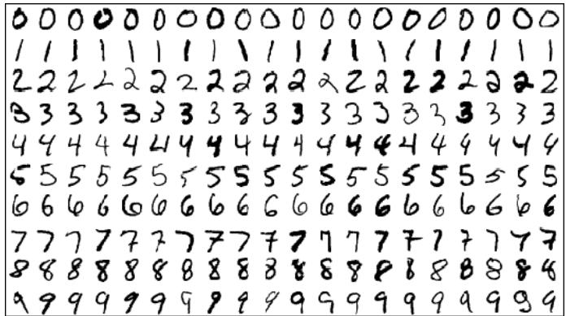
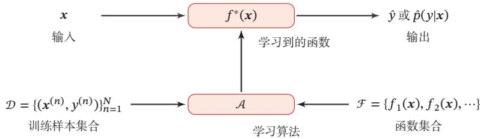
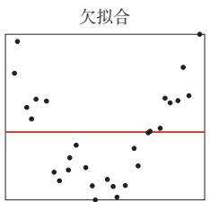
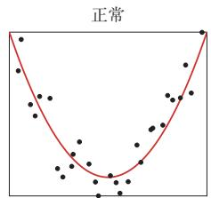
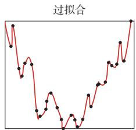
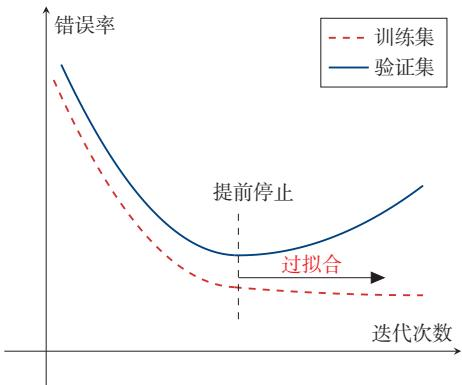
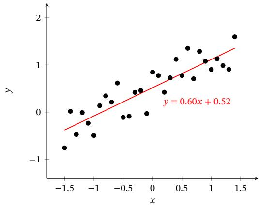
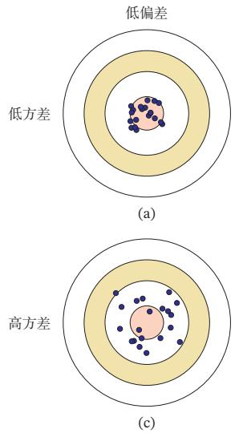
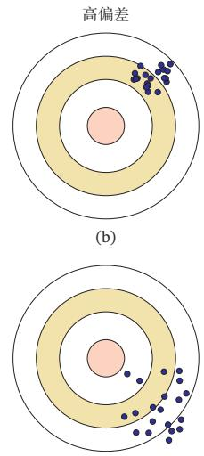
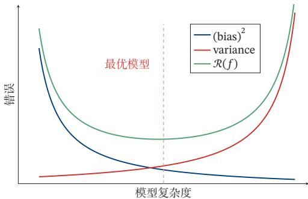

# 第2章 机器学习概述

[¶0001] 机器学习是对能通过经验自动改进的计算机算法的研究

[¶0002] —汤姆·米切尔（Tom Mitchell）[Mitchell, 1997]

[¶0003] 通俗地讲，机器学习（Machine Learning，ML）就是让计算机从数据中进行自动学习，得到某种知识（或规律）．作为一门学科，机器学习通常指一类问题以及解决这类问题的方法，即如何从观测数据（样本）中寻找规律，并利用学习到的规律（模型）对未知或无法观测的数据进行预测

[¶0004] 在早期的工程领域，机器学习也经常称为模式识别（Pattern Recognition，PR），但模式识别更偏向于具体的应用任务，比如光学字符识别、语音识别、人脸识别等．这些任务的特点是，对于我们人类而言，这些任务很容易完成，但我们不知道自己是如何做到的，因此也很难人工设计一个计算机程序来完成这些任务一个可行的方法是设计一个算法可以让计算机自己从有标注的样本上学习其中的规律，并用来完成各种识别任务．随着机器学习技术的应用越来越广，现在机器学习的概念逐渐替代模式识别，成为这一类问题及其解决方法的统称

[¶0005] 以手写体数字识别为例，我们需要让计算机能自动识别手写的数字．比如图2.1中的例子，将 识别为数字5，将 识别为数字6．手写数字识别是一个经典的机器学习任务，对人来说很简单，但对计算机来说却十分困难．我们很难总结每个数字的手写体特征，或者区分不同数字的规则，因此设计一套识别算法是一项几乎不可能的任务．在现实生活中，很多问题都类似于手写体数字识别这类问题，比如物体识别、语音识别等．对于这类问题，我们不知道如何设计一个计算机程序来解决，即使可以通过一些启发式规则来实现，其过程也是极其复杂的．因此，人们开始尝试采用另一种思路，即让计算机“看”大量的样本，并从中学习到一些经验，然后用这些经验来识别新的样本．要识别手写体数字，首先通过人工标注大量的手写体数字图像（即每张图像都通过人工标记了它是什么数字），这些图像作为训练数据，然后通过学习算法自动生成一套模型，并依靠它来识别新的手写体数字．这个过程和人类学习过程也比较类似，我们教小孩子识别数字也是这样的过程．这种通过数据来学习的方法就称为机器学习的方法

[¶0006]
  
图 2.1 手写体数字识别示例（图片来源：[LeCun et al., 1998]）

[¶0007] 本章先介绍机器学习的基本概念和基本要素，并较详细地描述一个简单的机器学习例子— 线性回归

## 2.1 基本概念

[¶0008] 首先我们以一个生活中的例子来介绍机器学习中的一些基本概念：样本、特征、标签、模型、学习算法等．假设我们要到市场上购买芒果，但是之前毫无挑选芒果的经验，那么如何通过学习来获取这些知识？

[¶0009] 首先，我们从市场上随机选取一些芒果，列出每个芒果的特征（Feature），包括颜色、大小、形状、产地、品牌，以及我们需要预测的标签（Label）．标签可以是连续值（比如关于芒果的甜度、水分以及成熟度的综合打分），也可以是离散值（比如“好”“坏”两类标签）．这里，每个芒果的标签可以通过直接品尝来获得，也可以通过请一些经验丰富的专家来进行标记

[¶0010] 特征也可以称为属性（Attribute）

[¶0011] 我们可以将一个标记好特征以及标签的芒果看作一个样本（Sample），也经常称为示例（Instance）

[¶0012] 一组样本构成的集合称为数据集（Data Set）．一般将数据集分为两部分：训练集和测试集．训练集（Training Set）中的样本是用来训练模型的，也叫训练样本（Training Sample），而测试集（Test Set）中的样本是用来检验模型好坏的，也叫测试样本（Test Sample）

[¶0013] 我们通常用一个??维向量 $\pmb { x } = [ x _ { 1 } , x _ { 2 } , \cdots , x _ { D } ] ^ { \intercal }$ 表示一个芒果的所有特征构成的向量，称为特征向量（Feature Vector），其中每一维表示一个特征．而芒果的标签通常用标量??来表示

[¶0014] 在很多领域，数据集也经常称为语料库（Cor-pus）

[¶0015] 并不是所有的样本特征都是数值型，需要通过转换表示为特征向量，参见第2.6节

[¶0016] 假设训练集??由??个样本组成，其中每个样本都是独立同分布的（Identi-cally and Independently Distributed，IID），即独立地从相同的数据分布中抽取的，记为

[¶0017]
$$
{ \mathcal D } = \{ ( { \pmb x } ^ { ( 1 ) } , y ^ { ( 1 ) } ) , ( { \pmb x } ^ { ( 2 ) } , y ^ { ( 2 ) } ) , \cdots , ( { \pmb x } ^ { ( N ) } , y ^ { ( N ) } ) \} .\tag{2.1}
$$

[¶0018] 给定训练集??，我们希望让计算机从一个函数集合 ${ \mathcal { F } } = \{ f _ { 1 } ( { \pmb x } ) , f _ { 2 } ( { \pmb x } ) , \cdots \}$ 中自动寻找一个“最优”的函数 $f ^ { * } ( x )$ 来近似每个样本的特征向量??和标签 $y$ 之间的真实映射关系．对于一个样本??，我们可以通过函数 $f ^ { * } ( x )$ 来预测其标签的值

[¶0019]
$$
{ \hat { y } } = f ^ { * } ( x ) ,\tag{2.2}
$$

[¶0020] 或标签的条件概率

[¶0021]
$$
{ \hat { p } } ( y | \mathbf { x } ) = f _ { y } ^ { * } ( \mathbf { x } ) .\tag{2.3}
$$

[¶0022] 如何寻找这个“最优”的函数 $f ^ { * } ( x )$ 是机器学习的关键，一般需要通过学习算法（Learning Algorithm）?? 来完成．这个寻找过程通常称为学习（Learning）或训练（Training）过程

[¶0023] 在 有 些 文 献 中， 学习算法也叫作学习器（Learner）

[¶0024] 这样，下次从市场上买芒果（测试样本）时，可以根据芒果的特征，使用学习到的函数 $f ^ { * } ( x )$ 来预测芒果的好坏．为了评价的公正性，我们还是独立同分布地抽取一组芒果作为测试集 $\mathcal { D } ^ { \prime }$ ，并在测试集中所有芒果上进行测试，计算预测结果的准确率

[¶0025] 第2.7节中会介绍更多的评价方法

[¶0026]
$$
A c c ( f ^ { * } ( x ) ) = \frac { 1 } { | \mathcal { D } ^ { \prime } | } \sum _ { ( x , y ) \in \mathcal { D } ^ { \prime } } I \bigl ( f ^ { * } ( x ) = y \bigr ) ,\tag{2.4}
$$

[¶0027] 其中??(⋅)为指示函数， $| \mathcal { D ^ { \prime } } |$ 为测试集大小

[¶0028] 图2.2给出了机器学习的基本流程．对一个预测任务，输入特征向量为 $_ x$ ，输出标签为 $y$ ，我们选择一个函数集合 $\mathcal { F }$ ，通过学习算法??和一组训练样本??，从 $\mathcal { F }$ 中学习到函数 $f ^ { * } ( x )$ ．这样对新的输入??，就可以用函数 $f ^ { * } ( x )$ 进行预测

[¶0029]
  
图2.2 机器学习系统示例

## 2.2 机器学习的三个基本要素

[¶0030] 机器学习是从有限的观测数据中学习（或“猜测”）出具有一般性的规律，并可以将总结出来的规律推广应用到未观测样本上．机器学习方法可以粗略地分为三个基本要素：模型、学习准则、优化算法

## 2.2.1 模型

[¶0031] 对于一个机器学习任务，首先要确定其输入空间??和输出空间??．不同机器学习任务的主要区别在于输出空间不同．在二分类问题中 $\mathcal { Y } = \{ + 1 , - 1 \}$ ，在??分类问题中 $\mathcal { Y } = \{ 1 , 2 , \cdots , C \}$ ，而在回归问题中 $\mathcal { Y } = \mathbb { R }$

[¶0032] 这里，输入空间默认为样本的特征空间

[¶0033] 输入空间??和输出空间?? 构成了一个样本空间．对于样本空间中的样本$( \boldsymbol { x } , \boldsymbol { y } ) \in \mathcal { X } \times \mathcal { Y }$ ，假定??和??之间的关系可以通过一个未知的真实映射函数 $y =$ $g ( \pmb { x } )$ 或真实条件概率分布 $p _ { r } ( y | \pmb { x } )$ 来描述．机器学习的目标是找到一个模型来近似真实映射函数 $g ( \pmb { x } )$ 或真实条件概率分布 $p _ { r } ( y | \pmb { x } )$

[¶0034] 映射函数 $g : \mathcal { X }  \mathcal { Y } .$

[¶0035] 由于我们不知道真实的映射函数 $g ( \pmb { x } )$ 或条件概率分布 $p _ { r } ( y | \pmb { x } )$ 的具体形式，因而只能根据经验来假设一个函数集合 $\mathcal { F }$ ，称为假设空间（Hypothesis Space），然后通过观测其在训练集??上的特性，从中选择一个理想的假设（Hypothesis）$f ^ { * } \in { \mathcal { F } }$

[¶0036] 假设空间ℱ通常为一个参数化的函数族

[¶0037]
$$
\mathcal { F } = \{ f ( \pmb { x } ; \theta ) | \theta \in \mathbb { R } ^ { D } \} ,\tag{2.5}
$$

[¶0038] 其中 $f ( \pmb { x } ; \theta )$ 是参数为??的函数，也称为模型（Model），??为参数的数量

[¶0039] 常见的假设空间可以分为线性和非线性两种，对应的模型??也分别称为线 性模型和非线性模型

## 2.2.1.1 线性模型

[¶0040] 线性模型的假设空间为一个参数化的线性函数族，即

[¶0041]
$$
f ( \pmb { x } ; \pmb { \theta } ) = \pmb { w } ^ { \top } \pmb { x } + b ,
$$

[¶0042] 对于分类问题，一般为广义线性函数，参见公式(3.3)．

[¶0043] (2.6)

[¶0044] 其中参数??包含了权重向量??和偏置??

## 2.2.1.2 非线性模型

[¶0045] 广义的非线性模型可以写为多个非线性基函数 $\phi ( { \pmb x } )$ 的线性组合

[¶0046]
$$
f (  { \mathbf { x } } ;  { \boldsymbol { \theta } } ) =  { \mathbf { w } } ^ { \top } \boldsymbol { \phi } (  { \mathbf { x } } ) + b ,\tag{2.7}
$$

[¶0047] https://nndl.github.io/

[¶0048] 其中 ${ \boldsymbol { \phi } } ( { \pmb x } ) = [ \phi _ { 1 } ( { \pmb x } ) , \phi _ { 2 } ( { \pmb x } ) , \cdots , \phi _ { K } ( { \pmb x } ) ] ^ { \top }$ 为??个非线性基函数组成的向量，参数??包含了权重向量??和偏置??

[¶0049] 如果 $\phi ( { \pmb x } )$ 本身为可学习的基函数，比如

[¶0050]
$$
\begin{array} { r } { \phi _ { k } ( { \pmb x } ) = h ( \pmb w _ { k } ^ { \top } \phi ^ { \prime } ( { \pmb x } ) + b _ { k } ) , \forall 1 \leq k \leq K , } \end{array}\tag{2.8}
$$

[¶0051] 其中 $h ( \cdot )$ 为非线性函数， $\phi ^ { \prime } ( { \pmb x } )$ 为另一组基函数， ${ \pmb w } _ { k }$ 和 $b _ { k }$ 为可学习的参数，则$f ( \pmb { x } ; \theta )$ 就等价于神经网络模型

## 2.2.2 学习准则

[¶0052] 令训练集 $\mathcal { D } = \{ ( \boldsymbol { x } ^ { ( n ) } , y ^ { ( n ) } ) \} _ { n = 1 } ^ { N }$ 是由 ?? 个独立同分布的（Independent andIdentically Distributed，IID）样本组成，即每个样本 $( { \pmb x } , { \boldsymbol y } ) \in \mathcal { X } \times { \boldsymbol y }$ 是从?? 和??的联合空间中按照某个未知分布 $p _ { r } ( { \boldsymbol x } , { \boldsymbol y } )$ 独立地随机产生的．这里要求样本分布$p _ { r } ( { \boldsymbol x } , { \boldsymbol y } )$ 必须是固定的（虽然可以是未知的），不会随时间而变化．如果 $p _ { r } ( { \boldsymbol x } , { \boldsymbol y } )$ 本身可变的话，就无法通过这些数据进行学习

[¶0053] 一个好的模型 $f ( { \boldsymbol { \mathbf { \mathit { x } } } } , { \boldsymbol { \theta } } ^ { * } )$ 应该在所有 $( x , y )$ 的可能取值上都与真实映射函数$y = g ( \pmb { x } )$ 一致，即

[¶0054]
$$
| f ( x , \theta ^ { * } ) - y | < \epsilon , \qquad \forall ( x , y ) \in \mathcal { X } \times \mathcal { Y } ,\tag{2.9}
$$

[¶0055] 或与真实条件概率分布 $p _ { r } ( y | \pmb { x } )$ 一致，即

[¶0056]
$$
| f _ { y } ( x , \theta ^ { * } ) - p _ { r } ( y | x ) | < \epsilon , \qquad \forall ( x , y ) \in \mathcal { X } \times \mathcal { Y } ,\tag{2.10}
$$

[¶0057] 这里两个分布相似性的定义不太严谨，更好的方式为KL散度或交叉熵

[¶0058] 其中 $\epsilon$ 是一个很小的正数， $f _ { y } ( x , \theta ^ { * } )$ 为模型预测的条件概率分布中??对应的概率

[¶0059] 模型 $f ( \pmb { x } ; \theta )$ 的好坏可以通过期望风险（Expected Risk）ℛ(??)来衡量，其定义为

[¶0060] 期 望 风 险也 经 常 称为期望错误（ExpectedError）

[¶0061]
$$
\begin{array} { r } { \mathcal { R } ( \theta ) = \mathbb { E } _ { ( \boldsymbol { x } , \boldsymbol { y } ) \sim p _ { r } ( \boldsymbol { x } , \boldsymbol { y } ) } [ \mathcal { L } \big ( \boldsymbol { y } , f ( \boldsymbol { x } ; \boldsymbol { \theta } ) \big ) ] , } \end{array}\tag{2.11}
$$

[¶0062] 其中 $p _ { r } ( { \boldsymbol x } , { \boldsymbol y } )$ 为真实的数据分布， $\mathcal { L } \big ( y , f ( \pmb { x } ; \theta ) \big )$ 为损失函数，用来量化两个变量之间的差异

## 2.2.2.1 损失函数

[¶0063] 损失函数是一个非负实数函数，用来量化模型预测和真实标签之间的差异下面介绍几种常用的损失函数

[¶0064] 0-1损失函数 最直观的损失函数是模型在训练集上的错误率，即0-1损失函数（0-1 Loss Function）：

[¶0065]
$$
\begin{array} { r l } & { \mathcal { L } \big ( y , f ( \boldsymbol { x } ; \boldsymbol { \theta } ) \big ) = \left\{ \begin{array} { l l } { 0 } & { \mathrm { i f } y = f ( \boldsymbol { x } ; \boldsymbol { \theta } ) } \\ { 1 } & { \mathrm { i f } y \ne f ( \boldsymbol { x } ; \boldsymbol { \theta } ) } \end{array} \right. } \\ & { \quad \quad \quad = I \big ( y \ne f ( \boldsymbol { x } ; \boldsymbol { \theta } ) \big ) , } \end{array}\tag{2.12}
$$

[¶0066] (2.13)

[¶0067] 其中??(⋅)是指示函数

[¶0068] 虽然0-1损失函数能够客观地评价模型的好坏，但其缺点是数学性质不是很好：不连续且导数为0，难以优化．因此经常用连续可微的损失函数替代

[¶0069] 平方损失函数 平方损失函数（Quadratic Loss Function）经常用在预测标签 ??为实数值的任务中，定义为

[¶0070]
$$
\mathcal { L } \big ( y , f ( \boldsymbol { x } ; \boldsymbol { \theta } ) \big ) = \frac { 1 } { 2 } \Big ( y - f ( \boldsymbol { x } ; \boldsymbol { \theta } ) \Big ) ^ { 2 } .\tag{2.14}
$$

[¶0071] 平方损失函数一般不适用于分类问题

[¶0072] 参见习题2-1

[¶0073] 交叉熵损失函数 交叉熵损失函数（Cross-Entropy Loss Function）一般用于分类问题．假设样本的标签 $y \in \{ 1 , \cdots , C \}$ 为离散的类别，模型 $f ( \pmb { x } ; \theta ) \in [ 0 , 1 ] ^ { C }$ 的输出为类别标签的条件概率分布，即

[¶0074]
$$
p ( y = c | \mathbf { x } ; \theta ) = f _ { c } ( \mathbf { x } ; \theta ) ,\tag{2.15}
$$

[¶0075] 并满足

[¶0076] $f _ { c } ( \pmb { x } ; \theta )$ 表 示 $f (  { \boldsymbol { x } } ;  { \boldsymbol { \theta } } )$ 的输出向量的第??维

[¶0077]
$$
f _ { c } ( \pmb { x } ; \theta ) \in [ 0 , 1 ] , \qquad \sum _ { c = 1 } ^ { C } f _ { c } ( \pmb { x } ; \theta ) = 1 .\tag{2.16}
$$

[¶0078] 我们可以用一个??维的one-hot向量 $_ y$ 来表示样本标签．假设样本的标签为??，那么标签向量??只有第??维的值为1，其余元素的值都为0．标签向量??可以看作样本标签的真实条件概率分布 $p _ { r } ( \pmb { y } | \pmb { x } )$ ，即第??维（记为 $y _ { c } , 1 \leq c \leq C \ )$ 是类别为??的真实条件概率．假设样本的类别为??，那么它属于第??类的概率为1，属于其他类的概率为0

[¶0079] 对于两个概率分布，一般可以用交叉熵来衡量它们的差异．标签的真实分布$_ y$ 和模型预测分布 $f ( \pmb { x } ; \theta )$ 之间的交叉熵为

[¶0080] 交叉熵参见第E.3.1节

[¶0081]
$$
\mathcal { L } ( \mathbf { y } , f ( \mathbf { x } ; \boldsymbol { \theta } ) ) = - \mathbf { y } ^ { \intercal } \log f ( \mathbf { x } ; \boldsymbol { \theta } )\tag{2.17}
$$

[¶0082]
$$
{ \bf \Psi } = - \sum _ { c = 1 } ^ { C } y _ { c } \log f _ { c } ( { \bf x } ; \boldsymbol { \theta } ) .\tag{2.18}
$$

[¶0083] https://nndl.github.io/

[¶0084] 比如对于三分类问题，一个样本的标签向量为 $\mathbf { y } = [ 0 , 0 , 1 ] ^ { \scriptscriptstyle \top }$ ，模型预测的标签分布为 $f ( \pmb { x } ; \theta ) = [ 0 . 3 , 0 . 3 , 0 . 4 ] ^ { \top }$ ，则它们的交叉熵为 $- ( 0 \times \log ( 0 . 3 ) + 0 \times$ $\log ( 0 . 3 ) + 1 \times \log ( 0 . 4 ) \big ) = - \log ( 0 . 4 )$

[¶0085] 因为 $_ y$ 为 one-hot 向量，公式 (2.18) 也可以写为

[¶0086]
$$
\mathcal { L } \big ( y , f ( \mathbf { x } ; \boldsymbol { \theta } ) \big ) = - \log f _ { y } ( \mathbf { x } ; \boldsymbol { \theta } ) ,\tag{2.19}
$$

[¶0087] 其中 $f _ { y } ( { \pmb x } ; { \boldsymbol \theta } )$ 可以看作真实类别??的似然函数．因此，交叉熵损失函数也就是负对数似然函数（Negative Log-Likelihood）

[¶0088] Hinge 损失函数 对于二分类问题，假设 ?? 的取值为 {−1, +1}， $f ( \pmb { x } ; \theta ) \in \mathbb { R }$ Hinge 损失函数（Hinge Loss Function）为

[¶0089] 参见第3.5.3节

[¶0090]
$$
\mathcal { L } \big ( y , f ( \pmb { x } ; \theta ) \big ) = \operatorname* { m a x } \big ( 0 , 1 - y f ( \pmb { x } ; \theta ) \big )\tag{2.20}
$$

[¶0091]
$$
\triangleq [ 1 - y f ( \pmb { x } ; \theta ) ] _ { + } ,\tag{2.21}
$$

[¶0092] 其中 $[ x ] _ { + } = \operatorname* { m a x } ( 0 , x )$

## 2.2.2.2 风险最小化准则

[¶0093] 一个好的模型 $f ( \pmb { x } ; \theta )$ 应当有一个比较小的期望错误，但由于不知道真实的数据分布和映射函数，实际上无法计算其期望风险ℛ(??)．给定一个训练集 $\mathcal { D } =$ $\{ ( \pmb { x } ^ { ( n ) } , y ^ { ( n ) } ) \} _ { n = 1 } ^ { N }$ ，我们可以计算的是经验风险（Empirical Risk），即在训练集上的平均损失：

[¶0094] 经 验 风 险 也 称 为经验错误（Empirical Er-ror）

[¶0095]
$$
\mathcal { R } _ { \mathcal { D } } ^ { e m p } ( \theta ) = \frac { 1 } { N } \sum _ { n = 1 } ^ { N } \mathcal { L } ( y ^ { ( n ) } , f ( \pmb { x } ^ { ( n ) } ; \theta ) ) .\tag{2.22}
$$

[¶0096] 因此，一个切实可行的学习准则是找到一组参数 $\theta ^ { * }$ 使得经验风险最小，即

[¶0097]
$$
\theta ^ { * } = \arg \operatorname* { m i n } _ { \theta } \mathcal { R } _ { \mathcal { D } } ^ { e m p } ( \theta ) ,\tag{2.23}
$$

[¶0098] 这就是经验风险最小化（Empirical Risk Minimization，ERM）准则

[¶0099] 过拟合 根据大数定理可知，当训练集大小|??|趋向于无穷大时，经验风险就趋向于期望风险．然而通常情况下，我们无法获取无限的训练样本，并且训练样本往往是真实数据的一个很小的子集或者包含一定的噪声数据，不能很好地反映全部数据的真实分布．经验风险最小化原则很容易导致模型在训练集上错误率很低，但是在未知数据上错误率很高．这就是所谓的过拟合（Overfitting）

[¶0100] 如何选择训练样本个数 可 以 参 考PAC学 习理论，参见第2.8.1节

[¶0101] 定义 2.1–过拟合： 给定一个假设空间 $\mathcal { F }$ ，一个假设??属于 $\mathcal { F }$ ，如果存在其他的假设 $f ^ { \prime }$ 也属于 $\mathcal { F }$ ,使得在训练集上 $f$ 的损失比 $f ^ { \prime }$ 的损失小，但在整个样本空间上 $f ^ { \prime }$ 的损失比 $f$ 的损失小，那么就说假设 $f$ 过度拟合训练数据[Mitchell, 1997]

[¶0102] 过拟合问题往往是由于训练数据少和噪声以及模型能力强等原因造成的为了解决过拟合问题，一般在经验风险最小化的基础上再引入参数的正则化（Regularization）来限制模型能力，使其不要过度地最小化经验风险．这种准则就是结构风险最小化（Structure Risk Minimization，SRM）准则：

[¶0103] 更多的正则化方法参见第7.7节

[¶0104]
$$
\theta ^ { * } = \arg \operatorname* { m i n } _ { \theta } \mathcal { R } _ { \mathcal { D } } ^ { s t r u c t } ( \theta )\tag{2.24}
$$

[¶0105]
$$
= \arg \operatorname* { m i n } _ { \boldsymbol { \theta } } \mathcal { R } _ { \mathcal { D } } ^ { e m p } ( \boldsymbol { \theta } ) + \frac { 1 } { 2 } \lambda \vert \vert \boldsymbol { \theta } \vert \vert ^ { 2 }\tag{2.25}
$$

[¶0106]
$$
= \underset { \theta } { \arg \operatorname* { m i n } } \frac { 1 } { N } \sum _ { n = 1 } ^ { N } \mathcal { L } ( y ^ { ( n ) } , f ( x ^ { ( n ) } ; \theta ) ) + \frac { 1 } { 2 } \lambda \| \theta \| ^ { 2 } ,\tag{2.26}
$$

[¶0107] 其中 $\lvert \lvert \theta \rvert \rvert$ 是 $\ell _ { 2 }$ 范数的正则化项，用来减少参数空间，避免过拟合；??用来控制正则化的强度

[¶0108] 正则化项也可以使用其他函数，比如 $\ell _ { 1 }$ 范数 $\ell _ { 1 }$ 范数的引入通常会使得参数有一定稀疏性，因此在很多算法中也经常使用．从贝叶斯学习的角度来讲，正则化是引入了参数的先验分布，使其不完全依赖训练数据

[¶0109] $\ell _ { 1 }$ 范数的稀疏性参见第7.7.1节

[¶0110] 正则化的贝叶斯解释参见第2.3.1.4节

[¶0111] 和过拟合相反的一个概念是欠拟合（Underfitting），即模型不能很好地拟合训练数据，在训练集上的错误率比较高．欠拟合一般是由于模型能力不足造成的．图2.3给出了欠拟合和过拟合的示例

[¶0112]

[¶0113]

[¶0114]
  
图2.3 欠拟合和过拟合示例

[¶0115] 总之，机器学习中的学习准则并不仅仅是拟合训练集上的数据，同时也要使得泛化错误最低．给定一个训练集，机器学习的目标是从假设空间中找到一个泛化错误较低的“理想”模型，以便更好地对未知的样本进行预测，特别是不在训练集中出现的样本．因此，我们可以将机器学习看作一个从有限、高维、有噪声的数据上得到更一般性规律的泛化问题

## 2.2.3 优化算法

[¶0116] 在确定了训练集??、假设空间ℱ 以及学习准则后，如何找到最优的模型$f ( { \pmb x } , { \pmb \theta } ^ { * } )$ 就成了一个最优化（Optimization）问题．机器学习的训练过程其实就是最优化问题的求解过程

[¶0117] 参数与超参数 在机器学习中，优化又可以分为参数优化和超参数优化．模型??(??; ??)中的??称为模型的参数，可以通过优化算法进行学习．除了可学习的参数??之外，还有一类参数是用来定义模型结构或优化策略的，这类参数叫作超参数（Hyper-Parameter）

[¶0118] 在贝叶斯方法中，超参数可以理解为参数的参数，即控制模型参数分布的参数

[¶0119] 常见的超参数包括：聚类算法中的类别个数、梯度下降法中的步长、正则化项的系数、神经网络的层数、支持向量机中的核函数等．超参数的选取一般都是组合优化问题，很难通过优化算法来自动学习．因此，超参数优化是机器学习的一个经验性很强的技术，通常是按照人的经验设定，或者通过搜索的方法对一组超参数组合进行不断试错调整

[¶0120] 超 参 数 的 优 化 参 见第7.6节

## 2.2.3.1 梯度下降法

[¶0121] 为了充分利用凸优化中一些高效、成熟的优化方法，比如共轭梯度、拟牛顿法等，很多机器学习方法都倾向于选择合适的模型和损失函数，以构造一个凸函数作为优化目标．但也有很多模型（比如神经网络）的优化目标是非凸的，只能退而求其次找到局部最优解

[¶0122] 在机器学习中，最简单、常用的优化算法就是梯度下降法，即首先初始化参数 $\theta _ { 0 }$ ，然后按下面的迭代公式来计算训练集??上风险函数的最小值：

[¶0123]
$$
\theta _ { t + 1 } = \theta _ { t } - \alpha \frac { \partial \mathcal { R } _ { \mathcal { D } } ( \theta ) } { \partial \theta }\tag{2.27}
$$

[¶0124]
$$
= \theta _ { t } - \alpha \frac { 1 } { N } \sum _ { n = 1 } ^ { N } \frac { \partial \mathcal { L } \Big ( y ^ { ( n ) } , f ( { x ^ { ( n ) } } ; \theta ) \Big ) } { \partial \theta } ,\tag{2.28}
$$

[¶0125] 其中 $\theta _ { t }$ 为第??次迭代时的参数值，??为搜索步长．在机器学习中，??一般称为学习率（Learning Rate）

## 2.2.3.2 提前停止

[¶0126] 针对梯度下降的优化算法，除了加正则化项之外，还可以通过提前停止来防止过拟合

[¶0127] 在梯度下降训练的过程中，由于过拟合的原因，在训练样本上收敛的参数，并不一定在测试集上最优．因此，除了训练集和测试集之外，有时也会使用一个验证集（Validation Set）来进行模型选择，测试模型在验证集上是否最优在每次迭代时，把新得到的模型 ??(??; ??) 在验证集上进行测试，并计算错误率如果在验证集上的错误率不再下降，就停止迭代．这种策略叫提前停止（EarlyStop）．如果没有验证集，可以在训练集上划分出一个小比例的子集作为验证集图2.4给出了提前停止的示例

[¶0128]
  
图2.4 提前停止的示例

## 2.2.3.3 随机梯度下降法

[¶0129] 在公式(2.27)的梯度下降法中，目标函数是整个训练集上的风险函数，这种方式称为批量梯度下降法（Batch Gradient Descent，BGD）．批量梯度下降法在每次迭代时需要计算每个样本上损失函数的梯度并求和．当训练集中的样本数量??很大时，空间复杂度比较高，每次迭代的计算开销也很大

[¶0130] 在机器学习中，我们假设每个样本都是独立同分布地从真实数据分布中随机抽取出来的，真正的优化目标是期望风险最小．批量梯度下降法相当于是从真实数据分布中采集??个样本，并由它们计算出来的经验风险的梯度来近似期望风险的梯度．为了减少每次迭代的计算复杂度，我们也可以在每次迭代时只采集一个样本，计算这个样本损失函数的梯度并更新参数，即随机梯度下降法（Stochastic Gradient Descent，SGD）．当经过足够次数的迭代时，随机梯度下降也可以收敛到局部最优解 [Nemirovski et al., 2009]

[¶0131] 随机梯度下降法也叫作增量梯度下降法

[¶0132] 随机梯度下降法的训练过程如算法2.1所示

[¶0133] 算法2.1 随机梯度下降法  
输入: 训练集?? = {(??(??), ??(??))}?? ，验证集??，学习率??  
1 随机初始化??;  
2 repeat  
3 对训练集??中的样本随机排序;  
4 for ?? = 1 ⋯ ?? do  
5 从训练集 ?? 中选取样本 (??(??), ??(??));  
??ℒ(??; ??(??), ??(??))  
6 ?? ← ?? − ?? ???? // 更新参数  
7 end  
8 until 模型??(??; ??)在验证集?? 上的错误率不再下降;  
输出: ??

[¶0134] 批量梯度下降和随机梯度下降之间的区别在于，每次迭代的优化目标是对所有样本的平均损失函数还是对单个样本的损失函数．由于随机梯度下降实现简单，收敛速度也非常快，因此使用非常广泛．随机梯度下降相当于在批量梯度下降的梯度上引入了随机噪声．在非凸优化问题中，随机梯度下降更容易逃离局部最优点

## 2.2.3.4 小批量梯度下降法

[¶0135] 随机梯度下降法的一个缺点是无法充分利用计算机的并行计算能力．小批量梯度下降法（Mini-Batch Gradient Descent）是批量梯度下降和随机梯度下降的折中．每次迭代时，我们随机选取一小部分训练样本来计算梯度并更新参数，这样既可以兼顾随机梯度下降法的优点，也可以提高训练效率

[¶0136] 第??次迭代时，随机选取一个包含??个样本的子集 $\mathcal { S } _ { t }$ ，计算这个子集上每个样本损失函数的梯度并进行平均，然后再进行参数更新：

[¶0137]
$$
\theta _ { t + 1 } \gets \theta _ { t } - \alpha \frac { 1 } { K } \sum _ { ( \boldsymbol { x } , \boldsymbol { y } ) \in \mathcal { S } _ { t } } \frac { \partial \mathcal { L } \big ( \boldsymbol { y } , f ( \boldsymbol { x } ; \boldsymbol { \theta } ) \big ) } { \partial \boldsymbol { \theta } } .
$$

[¶0138] ??通常不会设置很大，一般在 1 ∼ 100 之间在实际应用中为了提高计算效率，通常设置为 2 的幂 2??

[¶0139] (2.29)

[¶0140] 在实际应用中，小批量随机梯度下降法有收敛快、计算开销小的优点，因此逐渐成为大规模的机器学习中的主要优化算法[Bottou,2010]

## 2.3 机器学习的简单示例— 线性回归

[¶0141] 在本节中，我们通过一个简单的模型（线性回归）来具体了解机器学习的一般过程，以及不同学习准则（经验风险最小化、结构风险最小化、最大似然估计、最大后验估计）之间的关系

[¶0142] 线性回归（Linear Regression）是机器学习和统计学中最基础和最广泛应用的模型，是一种对自变量和因变量之间关系进行建模的回归分析．自变量数量为1时称为简单回归，自变量数量大于1时称为多元回归

[¶0143] 从机器学习的角度来看，自变量就是样本的特征向量 $\boldsymbol { x } \in \mathbb { R } ^ { D }$ （每一维对应一个自变量），因变量是标签??，这里 $y \in \mathbb R$ 是连续值（实数或连续整数）．假设空间是一组参数化的线性函数

[¶0144]
$$
f ( \mathbf { x } ; \mathbf { } w , b ) = \mathbf { } w ^ { \top } x + b ,\tag{2.30}
$$

[¶0145] 其中权重向量 $\pmb { w } \in \mathbb { R } ^ { D }$ 和偏置 $b \in \mathbb { R }$ 都是可学习的参数，函数 $f ( \pmb { x } ; \pmb { w } , b ) \in$ ℝ也称为线性模型

[¶0146] 为简单起见，我们将公式(2.30)写为

[¶0147]
$$
\begin{array} { r } { f ( \pmb { x } ; \hat { \pmb { w } } ) = \hat { \pmb { w } } ^ { \top } \hat { \pmb { x } } , } \end{array}\tag{2.31}
$$

[¶0148] 其中??̂和??̂分别称为增广权重向量和增广特征向量：

[¶0149]
$$
\hat { \pmb { x } } = \pmb { x } \oplus 1 \triangleq \left[ \begin{array} { c } { \ } \\ { \pmb { x } } \\ { \ } \\ { \ddots } \\ { \ } \end{array} \right] = \left[ \begin{array} { c } { \ x _ { 1 } } \\ { \vdots } \\ { \ x _ { D } } \\ { \phantom { \hat { x } } } \\ { 1 } \end{array} \right] ,\tag{2.32}
$$

[¶0150]
$$
\hat { w } = w \oplus b \triangleq [ \begin{array} { c }  [ \begin{array} { c } { w _ { 1 } } \\ { w } \\ { [ w ] } \end{array} ] = [ \begin{array} { c } { w _ { 1 } } \\ { \vdots } \\ { w _ { D } } \\ { b } \end{array} ] , \end{array}\tag{2.33}
$$

[¶0151] 其中⊕定义为两个向量的拼接操作

[¶0152] 不失一般性，在本章后面的描述中我们采用简化的表示方法，直接用??和??分别表示增广权重向量和增广特征向量．这样，线性回归的模型简写为$f ( \pmb { x } ; \pmb { w } ) = \pmb { w } ^ { \top } \pmb { x }$

## 2.3.1 参数学习

[¶0153] 给定一组包含??个训练样本的训练集 $\mathcal { D } = \{ ( \boldsymbol { x } ^ { ( n ) } , y ^ { ( n ) } ) \} _ { n = 1 } ^ { N }$ ，我们希望能够学习一个最优的线性回归的模型参数??

[¶0154] 我们介绍四种不同的参数估计方法：经验风险最小化、结构风险最小化、最大似然估计、最大后验估计

## 2.3.1.1 经验风险最小化

[¶0155] 由于线性回归的标签??和模型输出都为连续的实数值，因此平方损失函数非常合适衡量真实标签和预测标签之间的差异

[¶0156] 平 方 损 失 函 数 参 见第2.2.2.1节

[¶0157] 根据经验风险最小化准则，训练集??上的经验风险定义为

[¶0158]
$$
\begin{array} { l } { \displaystyle \mathcal { R } ( \pmb { w } ) = \sum _ { n = 1 } ^ { N } \mathcal { L } ( y ^ { ( n ) } , f ( \pmb { x } ^ { ( n ) } ; \pmb { w } ) ) } \\ { \displaystyle \qquad = \frac { 1 } { 2 } \sum _ { n = 1 } ^ { N } \Big ( y ^ { ( n ) } - \pmb { w } ^ { \top } \pmb { x } ^ { ( n ) } \Big ) ^ { 2 } } \\ { \displaystyle \qquad = \frac { 1 } { 2 } \| \pmb { y } - \pmb { X } ^ { \top } \pmb { w } \| ^ { 2 } , } \end{array}\tag{2.34}
$$

[¶0159] 为了简化起见，这里的风险函数省略了 $\frac { 1 } { N }$

[¶0160] (2.35)

[¶0161] (2.36)

[¶0162] https://nndl.github.io/

[¶0163] 其中 $\mathbf { y } = [ y ^ { ( 1 ) } , \cdots , y ^ { ( N ) } ] ^ { \intercal } \in \mathbb { R } ^ { N }$ 是由所有样本的真实标签组成的列向量，而$\pmb { X } \in \mathbb { R } ^ { ( D + 1 ) \times N }$ 是由所有样本的输入特征 $\pmb { x } ^ { ( 1 ) } , \cdots , \pmb { x } ^ { ( N ) }$ 组成的矩阵：

[¶0164]
$$
X = \left[ \begin{array} { c c c c } { x _ { 1 } ^ { ( 1 ) } } & { x _ { 1 } ^ { ( 2 ) } } & { \cdots } & { x _ { 1 } ^ { ( N ) } } \\ { \vdots } & { \vdots } & { \ddots } & { \vdots } \\ { x _ { D } ^ { ( 1 ) } } & { x _ { D } ^ { ( 2 ) } } & { \cdots } & { x _ { D } ^ { ( N ) } } \\ { 1 } & { 1 } & { \cdots } & { 1 } \end{array} \right] .\tag{2.37}
$$

[¶0165] 风险函数 $\mathcal { R } ( \boldsymbol { w } )$ 是关于??的凸函数，其对??的偏导数为

[¶0166] 参见习题2-2

[¶0167]
$$
\begin{array} { r } { \frac { \partial \mathcal { R } ( \pmb { w } ) } { \partial \pmb { w } } = \frac { 1 } { 2 } \frac { \partial \| \pmb { y } - \pmb { X } ^ { \top } \pmb { w } \| ^ { 2 } } { \partial \pmb { w } } } \\ { = - \pmb { X } ( \pmb { y } - \pmb { X } ^ { \top } \pmb { w } ) , } \end{array}\tag{2.38}
$$

[¶0168] (2.39)

[¶0169] 令 $\begin{array} { r } { \frac { \partial } { \partial { \boldsymbol w } } \mathcal { R } ( { \boldsymbol w } ) = 0 } \end{array}$ ，得到最优的参数 $\pmb { w } ^ { * }$ 为

[¶0170] $( X X ^ { \top } ) ^ { - 1 } X$ 也 称 为 $X ^ { \top }$ 的伪逆矩阵

[¶0171]
$$
\pmb { w } ^ { \ast } = ( \pmb { X } \pmb { X } ^ { \top } ) ^ { - 1 } \pmb { X } \pmb { y }\tag{2.40}
$$

[¶0172]
$$
{ \bf \Phi } = \Big ( \sum _ { n = 1 } ^ { N } { \pmb x } ^ { ( n ) } \big ( { \pmb x } ^ { ( n ) } \big ) ^ { \top } \Big ) ^ { - 1 } \Big ( \sum _ { n = 1 } ^ { N } { \pmb x } ^ { ( n ) } y ^ { ( n ) } \Big ) .\tag{2.41}
$$

[¶0173] 这种求解线性回归参数的方法也叫最小二乘法（Least Square Method，LSM）图2.5给出了用最小二乘法来进行线性回归参数学习的示例

[¶0174] 在古代汉语中“平方”称为“二乘”．

[¶0175]
  
图2.5 用最小二乘法来进行线性回归参数学习的示例

[¶0176] 在最小二乘法中， $\pmb { X } \pmb { X } ^ { \top } \in \mathbb { R } ^ { ( D + 1 ) \times ( D + 1 ) }$ 必须存在逆矩阵，即 $X X ^ { \top }$ 是满秩的$\left( \mathrm { \ r a n k } ( \mathbf { X } X ^ { \mathsf { T } } ) = D + 1 \right)$ ）．也就是说，??中的行向量之间是线性不相关的，即每一个特征都和其他特征不相关．一种常见的 $X X ^ { \top }$ 不可逆情况是样本数量??小于特征数量 $( D + 1 )$ ， $X X ^ { \top }$ 的秩为??．这时会存在很多解 $\pmb { w } ^ { * }$ ，可以使得 $\mathcal { R } ( \boldsymbol { w } ^ { * } ) = 0$

[¶0177] 当 $X X ^ { \top }$ 不可逆时，可以通过下面两种方法来估计参数：1）先使用主成分分析等方法来预处理数据，消除不同特征之间的相关性，然后再使用最小二乘法来估计参数；2）使用梯度下降法来估计参数．先初始化 ${ \pmb w } = 0$ ，然后通过下面公式进行迭代：

[¶0178]
$$
\begin{array} { r } { \pmb { w }  \pmb { w } + \alpha \pmb { X } ( \mathbf { y } - \pmb { X } ^ { \top } \pmb { w } ) , } \end{array}\tag{2.42}
$$

[¶0179] 其中 $\alpha$ 是学习率．这种利用梯度下降法来求解的方法也称为最小均方（LeastMean Squares，LMS）算法

## 2.3.1.2 结构风险最小化

[¶0180] 最小二乘法的基本要求是各个特征之间要互相独立，保证 $X X ^ { \top }$ 可逆．但即使 $X X ^ { \top }$ 可逆，如果特征之间有较大的多重共线性（Multicollinearity），也会使得$X X ^ { \top }$ 的逆在数值上无法准确计算．数据集?? 上一些小的扰动就会导致 $( \pmb { X } \pmb { X } ^ { \top } ) ^ { - 1 }$ 发生大的改变，进而使得最小二乘法的计算变得很不稳定．为了解决这个问题，[Hoerl et al., 1970] 提出了岭回归（Ridge Regression），给 $X X ^ { \top }$ 的对角线元素都加上一个常数??使得 $( \pmb { X } \pmb { X } ^ { \top } + \lambda I )$ 满秩，即其行列式不为0．最优的参数 $\pmb { w } ^ { * }$ 为

[¶0181] 共 线 性（Collinearity）是指一个特征可以通过其他特征的线性组合来较准确地预测

[¶0182]
$$
\begin{array} { r } { \pmb { w } ^ { \ast } = ( \pmb { X } \pmb { X } ^ { \top } + \lambda I ) ^ { - 1 } \pmb { X } \pmb { y } , } \end{array}\tag{2.43}
$$

[¶0183] 其中 $\lambda > 0$ 为预先设置的超参数，??为单位矩阵

[¶0184] 岭回归的解 $\pmb { w } ^ { * }$ 可以看作结构风险最小化准则下的最小二乘法估计，其目标函数可以写为

[¶0185]
$$
\mathcal { R } ( \pmb { w } ) = \frac { 1 } { 2 } \| \pmb { y } - \pmb { X } ^ { \top } \pmb { w } \| ^ { 2 } + \frac { 1 } { 2 } \lambda \| \pmb { w } \| ^ { 2 } ,\tag{2.44}
$$

[¶0186] 参见习题2-4

[¶0187] 其中 $\lambda > 0$ 为正则化系数

## 2.3.1.3 最大似然估计

[¶0188] 机器学习任务可以分为两类：一类是样本的特征向量??和标签??之间存在未知的函数关系 $y \ = \ h ( { \pmb x } )$ ，另一类是条件概率 $p ( y | \pmb { x } )$ 服从某个未知分布第2.3.1.1节中介绍的最小二乘法是属于第一类，直接建模??和标签 $y$ 之间的函数关系．此外，线性回归还可以从建模条件概率 $p ( y | \pmb { x } )$ 的角度来进行参数估计

[¶0189] 假设标签??为一个随机变量，并由函数 $f ( \pmb { x } ; \pmb { w } ) = \pmb { w } ^ { \top } \pmb { x }$ 加上一个随机噪声 $\epsilon$ 决定，即

[¶0190] 这里把??看作确定值的参数

[¶0191]
$$
y = f ( { \pmb x } ; { \pmb w } ) + \epsilon ,\tag{2.45}
$$

[¶0192]
$$
{ \mathbf { \Psi } } = { \pmb { w } } ^ { \top } { \pmb { x } } + { \epsilon } ,\tag{2.46}
$$

[¶0193] 其中??服从均值为0、方差为 $\sigma ^ { 2 }$ 的高斯分布．这样，??服从均值为 $\pmb { w } ^ { \top } \pmb { x }$ 、方差为 $\sigma ^ { 2 }$ 的高斯分布：

[¶0194]
$$
p ( y | \mathbf x ; \pmb w , \sigma ) = \mathcal N ( y ; \pmb w ^ { \intercal } \mathbf x , \sigma ^ { 2 } )\tag{2.47}
$$

[¶0195]
$$
{ \bf \Gamma } = \frac { 1 } { \sqrt { 2 \pi } \sigma } \exp \Big ( - \frac { ( y - { \bf w } ^ { \top } { \bf x } ) ^ { 2 } } { 2 \sigma ^ { 2 } } \Big ) .\tag{2.48}
$$

[¶0196] 参数??在训练集??上的似然函数（Likelihood）为

[¶0197] 似然函数是关于统计模型的参数的函数

[¶0198]
$$
p ( \mathbf { y } | X ; \pmb { w } , \sigma ) = \prod _ { n = 1 } ^ { N } p ( y ^ { ( n ) } | \pmb { x } ^ { ( n ) } ; \pmb { w } , \sigma )\tag{2.49}
$$

[¶0199]
$$
= \prod _ { n = 1 } ^ { N } \mathcal { N } ( y ^ { ( n ) } ; { \pmb w } ^ { \top } { \pmb x } ^ { ( n ) } , \sigma ^ { 2 } ) ,\tag{2.50}
$$

[¶0200] 其中 $\pmb { y } = [ y ^ { ( 1 ) } , \cdots , y ^ { ( N ) } ]$ T 为所有样本标签组成的向量， $\pmb { X } = [ \pmb { x } ^ { ( 1 ) } , \cdots , \pmb { x } ^ { ( N ) } ]$ 为所有样本特征向量组成的矩阵

[¶0201] 似 然 $p ( x | w )$ 和 概 率$p ( x | w )$ 之间的区别在于：概率 $p ( x | w )$ 是 描述固定参数??时随机变量??的分布情况，而似然 $p ( x | w )$ 则是描述已知随机变量??时不同的参数??对其分布的影响

[¶0202] 为了方便计算，对似然函数取对数得到对数似然函数（Log Likelihood）：

[¶0203]
$$
\log p ( \pmb { y } | \pmb { X } ; \pmb { w } , \sigma ) = \sum _ { n = 1 } ^ { N } \log \mathcal { N } ( \pmb { y } ^ { ( n ) } ; \pmb { w } ^ { \top } \pmb { x } ^ { ( n ) } , \sigma ^ { 2 } ) .\tag{2.51}
$$

[¶0204] 最大似然估计（Maximum Likelihood Estimation，MLE）是指找到一组参数??使得似然函数 $p ( \mathbf { \boldsymbol { y } } | \mathbf { \boldsymbol { X } } ; \mathbf { \boldsymbol { w } } , \sigma )$ 最大，等价于对数似然函数 $\log p ( \mathbf { y } | \mathbf { \boldsymbol { X } } ; \mathbf { \boldsymbol { w } } , \sigma )$ 最大

[¶0205]
$$
\mathfrak { P } \frac { \partial \log p ( \mathbf { y } | \mathbf { \boldsymbol { X } } ; \boldsymbol { w } , \sigma ) } { \partial \boldsymbol { w } } = 0 , \hbar \sharp \underline { { \vec { \mathbf { z } } \vec { \mathbf { z } } } } | |
$$

[¶0206] 参见习题2-5

[¶0207]
$$
\pmb { w } ^ { M L } = ( \pmb { X } \pmb { X } ^ { \top } ) ^ { - 1 } \pmb { X } \pmb { y } .\tag{2.52}
$$

[¶0208] 可以看出，最大似然估计的解和最小二乘法的解相同

[¶0209] 最 小 二 乘 法 参 见 公式(2.40)

## 2.3.1.4 最大后验估计

[¶0210] 最大似然估计的一个缺点是当训练数据比较少时会发生过拟合，估计的参数可能不准确．为了避免过拟合，我们可以给参数加上一些先验知识

[¶0211] 假设参数??为一个随机向量，并服从一个先验分布 $p ( \pmb { w } ; \nu )$ ．为简单起见，一般令 $p ( \pmb { w } ; \nu )$ 为各向同性的高斯分布：

[¶0212]
$$
p ( \pmb { w } ; \nu ) = \mathcal { N } ( \pmb { w } ; \mathbf { 0 } , \nu ^ { 2 } I ) ,\tag{2.53}
$$

[¶0213] 其中 $\nu ^ { 2 }$ 为每一维上的方差

[¶0214] 根据贝叶斯公式，参数??的后验分布（Posterior Distribution）为

[¶0215] 贝 叶 斯 公 式 参 见 公式(D.32)

[¶0216]
$$
p ( \pmb { w } | \pmb { X } , \pmb { y } ; \nu , \sigma ) = \frac { p ( \pmb { w } , \pmb { y } | \pmb { X } ; \nu , \sigma ) } { \sum _ { \pmb { w } } p ( \pmb { w } , \pmb { y } | \pmb { X } ; \nu , \sigma ) }\tag{2.54}
$$

[¶0217] 分 母 为 和??无 关 的常量

[¶0218]
$$
\propto p ( { \bf y } | X , { \pmb w } ; \sigma ) p ( { \pmb w } ; \nu ) ,\tag{2.55}
$$

[¶0219] 其中 $p ( \mathbf { y } | \mathbf { X } , \pmb { w } ; \sigma )$ 为??的似然函数， $p ( \pmb { w } ; \nu )$ 为??的先验

[¶0220] 似然函数的定义参见公式(2.49)

[¶0221] 这种估计参数??的后验概率分布的方法称为贝叶斯估计（Bayesian Esti-mation），是一种统计推断问题．采用贝叶斯估计的线性回归也称为贝叶斯线性回归（Bayesian Linear Regression）

[¶0222] 统 计 推 断 参 见第11.3节

[¶0223] 贝叶斯估计是一种参数的区间估计，即参数在一个区间上的分布．如果我们希望得到一个最优的参数值（即点估计），可以使用最大后验估计．最大后验估计（Maximum A Posteriori Estimation，MAP）是指最优参数为后验分布$p ( \boldsymbol { w } | \boldsymbol { X } , \boldsymbol { y } ; \nu , \sigma )$ 中概率密度最高的参数：

[¶0224]
$$
\pmb { w } ^ { M A P } = \underset { \pmb { w } } { \arg \operatorname* { m a x } } p ( \pmb { y } | \pmb { X } , \pmb { w } ; \sigma ) p ( \pmb { w } ; \nu ) ,\tag{2.56}
$$

[¶0225] 令似然函数 $p ( \mathbf { y } | \mathbf { X } , \pmb { w } ; \sigma )$ 为公式(2.50)中定义的高斯密度函数，则后验分布$p ( \boldsymbol { w } | \boldsymbol { X } , \boldsymbol { y } ; \nu , \sigma )$ 的对数为

[¶0226]
$$
\log p ( { \pmb w } | { \pmb X } , { \pmb y } ; { \nu } , { \sigma } ) \propto \log p ( { \pmb y } | { \pmb X } , { \pmb w } ; { \sigma } ) + \log p ( { \pmb w } ; { \nu } )\tag{2.57}
$$

[¶0227]
$$
\propto - \frac { 1 } { 2 \sigma ^ { 2 } } \sum _ { n = 1 } ^ { N } \left( y ^ { ( n ) } - \pmb { w } ^ { \top } \pmb { x } ^ { ( n ) } \right) ^ { 2 } - \frac { 1 } { 2 \nu ^ { 2 } } \pmb { w } ^ { \top } \pmb { w } ,\tag{2.58}
$$

[¶0228]
$$
\mathbf { \Sigma } = - \frac { 1 } { 2 \sigma ^ { 2 } } \| \mathbf { y } - \mathbf { X } ^ { \top } \pmb { w } \| ^ { 2 } - \frac { 1 } { 2 \nu ^ { 2 } } \pmb { w } ^ { \top } \pmb { w } .\tag{2.59}
$$

[¶0229] 可以看出，最大后验概率等价于平方损失的结构风险最小化，其中正则化系数$\lambda = \sigma ^ { 2 } / \nu ^ { 2 }$

[¶0230] 最大似然估计和贝叶斯估计可以分别看作频率学派和贝叶斯学派对需要估计的参数??的不同解释．当 $\nu \to \infty$ 时，先验分布 $p ( \pmb { w } ; \nu )$ 退化为均匀分布，称为无信息先验（Non-Informative Prior），最大后验估计退化为最大似然估计

## 2.4 偏差-方差分解

[¶0231] 为了避免过拟合，我们经常会在模型的拟合能力和复杂度之间进行权衡．拟合能力强的模型一般复杂度会比较高，容易导致过拟合．相反，如果限制模型的复杂度，降低其拟合能力，又可能会导致欠拟合．因此，如何在模型的拟合能力和https://nndl.github.io/

[¶0232] 复杂度之间取得一个较好的平衡，对一个机器学习算法来讲十分重要．偏差-方差分解（Bias-Variance Decomposition）为我们提供了一个很好的分析和指导工具

[¶0233] 本节介绍的偏差-方差分解以回归问题为例，但其结论同样适用于分类问题

[¶0234] 以回归问题为例，假设样本的真实分布为 $p _ { r } ( { \boldsymbol x } , { \boldsymbol y } )$ ，并采用平方损失函数，模型 $f ( x )$ 的期望错误为

[¶0235] 为简单起见，省略了模型 $f ( { \boldsymbol { x } } , { \boldsymbol { \theta } } )$ 的参数??

[¶0236]
$$
\begin{array} { r } { \mathcal { R } ( f ) = \mathbb { E } _ { ( x , y ) \sim p _ { r } ( x , y ) } \Big [ \big ( y - f ( x ) \big ) ^ { 2 } \Big ] . } \end{array}\tag{2.60}
$$

[¶0237] 那么最优的模型为

[¶0238] 参见习题2-8

[¶0239]
$$
f ^ { * } ( x ) = \mathbb { E } _ { y \sim p _ { r } ( y | x ) } \big [ y \big ] .\tag{2.61}
$$

[¶0240] 其中 $p _ { r } ( y | \pmb { x } )$ 为样本的真实条件分布， $f ^ { * } ( x )$ 为使用平方损失作为优化目标的最优模型，其损失为

[¶0241]
$$
\begin{array} { r } { \epsilon = \mathbb { E } _ { ( { \pmb x } , { \pmb y } ) \sim p _ { r } ( { \pmb x } , { \pmb y } ) } \Big [ \big ( { \pmb y } - { \pmb f } ^ { * } ( { \pmb x } ) \big ) ^ { 2 } \Big ] . } \end{array}\tag{2.62}
$$

[¶0242] 损失 $\epsilon$ 通常是由于样本分布以及噪声引起的，无法通过优化模型来减少

[¶0243] 期望错误可以分解为

[¶0244]
$$
\mathcal { R } ( f ) = \mathbb { E } _ { ( x , y ) \sim p _ { r } ( x , y ) } \biggl [ \Bigl ( y - f ^ { * } ( x ) + f ^ { * } ( x ) - f ( x ) \Bigr ) ^ { 2 } \biggr ]\tag{2.63}
$$

[¶0245]
$$
= \mathbb { E } _ { { \pmb x } \sim p _ { r } ( { \pmb x } ) } \bigg [ \Big ( f ( { \pmb x } ) - f ^ { * } ( { \pmb x } ) \Big ) ^ { 2 } \bigg ] + \epsilon ,\tag{2.64}
$$

[¶0246] 根 据 公 式(2.61)可 知，$\mathbb { E } _ { { \pmb x } } \mathbb { E } _ { { \pmb y } } [ { \pmb y } - { \pmb f } ^ { * } ( { \pmb x } ) ] = 0 .$

[¶0247] 其中第一项是当前模型和最优模型之间的差距，是机器学习算法可以优化的真实目标

[¶0248] 在实际训练一个模型 $f ( x )$ 时，训练集??是从真实分布 $p _ { r } ( { \boldsymbol x } , { \boldsymbol y } )$ 上独立同分布地采样出来的有限样本集合．不同的训练集会得到不同的模型 令 $f _ { \mathcal { D } } ( \pmb { x } )$ 表示在训练集??上学习到的模型，一个机器学习算法（包括模型以及优化算法）的能力可以用不同训练集上的模型的平均性能来评价

[¶0249] 对于单个样本??，不同训练集??得到模型 $f _ { \mathcal { D } } ( \pmb { x } )$ 和最优模型 $f ^ { * } ( x )$ 的期望差距为

[¶0250]
$$
\begin{array} { r l } & { \mathbb { E } _ { \mathcal { D } } \bigg [ \Big ( f _ { \mathcal { D } } ( \boldsymbol { x } ) - f ^ { * } ( \boldsymbol { x } ) \Big ) ^ { 2 } \bigg ] } \\ & { \quad = \mathbb { E } _ { \mathcal { D } } \bigg [ \Big ( f _ { \mathcal { D } } ( \boldsymbol { x } ) - \mathbb { E } _ { \mathcal { D } } \big [ f _ { \mathcal { D } } ( \boldsymbol { x } ) \big ] + \mathbb { E } _ { \mathcal { D } } \big [ f _ { \mathcal { D } } ( \boldsymbol { x } ) \big ] - f ^ { * } ( \boldsymbol { x } ) \Big ) ^ { 2 } \bigg ] } \\ & { \quad = \underbrace { \Big ( \mathbb { E } _ { \mathcal { D } } \big [ f _ { \mathcal { D } } ( \boldsymbol { x } ) \big ] - f ^ { * } ( \boldsymbol { x } ) \Big ) ^ { 2 } } _ { \mathrm { ( b i a s . x ) ^ { 2 } } } + \underbrace { \mathbb { E } _ { \mathcal { D } } \Big [ \Big ( f _ { \mathcal { D } } ( \boldsymbol { x } ) - \mathbb { E } _ { \mathcal { D } } \big [ f _ { \mathcal { D } } ( \boldsymbol { x } ) \big ] \Big ) ^ { 2 } \Big ] } _ { \mathrm { v a r i a n c e . x } } , } \end{array}\tag{2.65}
$$

[¶0251] (2.66)

[¶0252] 参见习题2-10

[¶0253] (d)

[¶0254] 其中第一项为偏差（Bias），是指一个模型在不同训练集上的平均性能和最优模型的差异，可以用来衡量一个模型的拟合能力．第二项是方差（Variance），是指一个模型在不同训练集上的差异，可以用来衡量一个模型是否容易过拟合

[¶0255] 用 $\mathbb { E } _ { \mathcal { D } } \big [ \big ( f _ { \mathcal { D } } ( \pmb { x } ) - f ^ { * } ( \pmb { x } ) \big ) ^ { 2 } \big ]$ 来代替公式(2.64)中的 $\left( f ( { \pmb x } ) - f ^ { * } ( { \pmb x } ) \right) ^ { 2 }$ ，期望错误可以进一步写为

[¶0256]
$$
\begin{array} { r } { \mathcal { R } ( f ) = \mathbb { E } _ { \pmb { x } \sim p _ { r } ( \pmb { x } ) } \Big [ \mathbb { E } _ { \mathcal { D } } \big [ \big ( f _ { \mathcal { D } } ( \pmb { x } ) - f ^ { * } ( \pmb { x } ) \big ) ^ { 2 } \big ] \Big ] + \epsilon , } \end{array}\tag{2.67}
$$

[¶0257]
$$
= \left( { \mathrm { b i a s } } \right) ^ { 2 } + { \mathrm { v a r i a n c e } } + \epsilon .\tag{2.68}
$$

[¶0258] 其中

[¶0259]
$$
\mathrm { ( b i a s ) } ^ { 2 } = \mathbb { E } _ { \boldsymbol { x } } \bigg [ \Big ( \mathbb { E } _ { \mathcal { D } } \big [ f _ { \mathcal { D } } ( \boldsymbol { x } ) \big ] - f ^ { * } ( \boldsymbol { x } ) \Big ) ^ { 2 } \bigg ] ,\tag{2.69}
$$

[¶0260]
$$
\begin{array} { r } { \mathrm { v a r i a n c e } = \mathbb { E } _ { \pmb { x } } \bigg [ \mathbb { E } _ { \mathcal { D } } \bigg [ \big ( f _ { \mathcal { D } } ( \pmb { x } ) - \mathbb { E } _ { \mathcal { D } } \big [ f _ { \mathcal { D } } ( \pmb { x } ) \big ] \big ) ^ { 2 } \bigg ] \bigg ] . } \end{array}\tag{2.70}
$$

[¶0261] 最小化期望错误等价于最小化偏差和方差之和

[¶0262] 图2.6给出了机器学习模型的四种偏差和方差组合情况．每个图的中心点为最优模型 $f ^ { * } ( x )$ ，蓝点为不同训练集??上得到的模型 $f _ { \mathcal { D } } ( \boldsymbol { x } )$ ．图2.6a给出了一种理想情况，方差和偏差都比较低．图2.6b为高偏差低方差的情况，表示模型的泛化能力很好，但拟合能力不足．图2.6c为低偏差高方差的情况，表示模型的拟合能力很好，但泛化能力比较差．当训练数据比较少时会导致过拟合．图2.6d为高偏差高方差的情况，是一种最差的情况

[¶0263] 参见习题2-9

[¶0264]

[¶0265]
  
图2.6 机器学习模型的四种偏差和方差组合情况

[¶0266] 方差一般会随着训练样本的增加而减少．当样本比较多时，方差比较少，这时可以选择能力强的模型来减少偏差．然而在很多机器学习任务上，训练集往往都比较有限，最优的偏差和最优的方差就无法兼顾

[¶0267] 随着模型复杂度的增加，模型的拟合能力变强，偏差减少而方差增大，从而导致过拟合．以结构风险最小化为例，我们可以调整正则化系数??来控制模型的复杂度．当??变大时，模型复杂度会降低，可以有效地减少方差，避免过拟合，但偏差会上升．当??过大时，总的期望错误反而会上升．因此，一个好的正则化系数??需要在偏差和方差之间取得比较好的平衡．图2.7给出了机器学习模型的期望错误、偏差和方差随复杂度的变化情况，其中红色虚线表示最优模型．最优模型并不一定是偏差曲线和方差曲线的交点

[¶0268]
  
图2.7 机器学习模型的期望错误、偏差和方差随复杂度的变化情况

[¶0269] 偏差和方差分解给机器学习模型提供了一种分析途径，但在实际操作中难以直接衡量．一般来说，当一个模型在训练集上的错误率比较高时，说明模型的拟合能力不够，偏差比较高．这种情况可以通过增加数据特征、提高模型复杂度、减小正则化系数等操作来改进．当模型在训练集上的错误率比较低，但验证集上的错误率比较高时，说明模型过拟合，方差比较高．这种情况可以通过降低模型复杂度、加大正则化系数、引入先验等方法来缓解．此外，还有一种有效降低方差的方法为集成模型，即通过多个高方差模型的平均来降低方差

[¶0270] 集成模型可以降低方 差 的 原 理 参 见第10.1节

## 2.5 机器学习算法的类型

[¶0271] 机器学习算法可以按照不同的标准来进行分类．比如按函数 $f ( \pmb { x } ; \theta )$ 的不同，机器学习算法可以分为线性模型和非线性模型；按照学习准则的不同，机器学习算法也可以分为统计方法和非统计方法

[¶0272] 但一般来说，我们会按照训练样本提供的信息以及反馈方式的不同，将机器学习算法分为以下几类：

[¶0273] 监督学习 如果机器学习的目标是建模样本的特征??和标签??之间的关系：?? =??(??; ??) 或 $p ( \boldsymbol { y } | \boldsymbol { x } ; \boldsymbol { \theta } )$ ，并且训练集中每个样本都有标签，那么这类机器学习称为监督学习（Supervised Learning）．根据标签类型的不同，监督学习又可以分为回归问题、分类问题和结构化学习问题

[¶0274] （1） 回归（Regression）问题中的标签??是连续值（实数或连续整数），$f ( \pmb { x } ; \theta )$ 的输出也是连续值

[¶0275] （2） 分类（Classification）问题中的标签??是离散的类别（符号）．在分类问题中，学习到的模型也称为分类器（Classifier）．分类问题根据其类别数量又可分为二分类（Binary Classification）和多分类（Multi-class Classification）问题

[¶0276] （3） 结构化学习（Structured Learning）问题是一种特殊的分类问题．在结构化学习中，标签??通常是结构化的对象，比如序列、树或图等．由于结构化学习的输出空间比较大，因此我们一般定义一个联合特征空间，将??, ??映射为该空间中的联合特征向量 $\phi ( { \pmb x } , { \pmb y } )$ ，预测模型可以写为

[¶0277] 一 种 基 于 感 知 器 的结 构 化 学 习 参 见第3.4.4节

[¶0278]
$$
\hat { \pmb { y } } = \underset { \pmb { y } \in \mathrm { G e n } ( x ) } { \arg \operatorname* { m a x } } f \Bigl ( \phi ( \pmb { x } , \pmb { y } ) ; \theta \Bigr ) ,\tag{2.71}
$$

[¶0279] 其中Gen(??)表示输入??的所有可能的输出目标集合．计算arg max的过程也称为解码（Decoding）过程，一般通过动态规划的方法来计算

[¶0280] 无监督学习 无监督学习（Unsupervised Learning，UL）是指从不包含目标标签的训练样本中自动学习到一些有价值的信息．典型的无监督学习问题有聚类、密度估计、特征学习、降维等

[¶0281] 强化学习 强化学习（Reinforcement Learning，RL）是一类通过交互来学习的机器学习算法．在强化学习中，智能体根据环境的状态做出一个动作，并得到即时或延时的奖励．智能体在和环境的交互中不断学习并调整策略，以取得最大化的期望总回报

[¶0282] 监督学习需要每个样本都有标签，而无监督学习则不需要标签．一般而言，监督学习通常需要大量的有标签数据集，这些数据集一般都需要由人工进行标注，成本很高．因此，也出现了很多弱监督学习（Weakly Supervised Learning）和半监督学习（Semi-Supervised Learning，SSL）的方法，希望从大规模的无标注数据中充分挖掘有用的信息，降低对标注样本数量的要求．强化学习和监督学习的不同在于，强化学习不需要显式地以“输入/输出对”的方式给出训练样本，是一种在线的学习机制

[¶0283] 表2.1给出了三种机器学习类型的比较

[¶0284] 表2.1 三种机器学习类型的比较
<table><tr><td></td><td>监督学习</td><td>无监督学习</td><td>强化学习</td></tr><tr><td>训练样本</td><td>训练集  $\{ ( \pmb { x } ^ { ( n ) } , y ^ { ( n ) } ) \} _ { n = 1 } ^ { N }$ </td><td>训练集  $\{ x ^ { n } \} _ { n = 1 } ^ { N }$ </td><td>智能体和环境交互的 轨迹t和累积奖励  $G _ { \tau }$ </td></tr><tr><td></td><td>优化目标y=f(x)或p(y|x)</td><td>p(x)或带隐变量z期望总回报 的  $p ( { \boldsymbol { x } } | { \boldsymbol { z } } )$ </td><td> $\mathbb { E } _ { \tau } [ G _ { \tau } ]$ </td></tr><tr><td>学习准则</td><td>期望风险最小化 最大似然估计</td><td>最大似然估计 最小重构错误</td><td>策略评估 策略改进</td></tr></table>

## 2.6 数据的特征表示

[¶0285] 在实际应用中，数据的类型多种多样，比如文本、音频、图像、视频等．不同类型的数据，其原始特征（Raw Feature）的空间也不相同．比如一张灰度图像（像素数量为??）的特征空间为 $[ 0 , 2 5 5 ] ^ { D }$ ，一个自然语言句子（长度为??）的特征空间为 $| \mathcal { V } | ^ { L }$ ，其中??为词表集合．而很多机器学习算法要求输入的样本特征是数学上可计算的，因此在机器学习之前我们需要将这些不同类型的数据转换为向量表示

[¶0286] 也有一些机器学习算法（比如决策树）不需要向量形式的特征

[¶0287] 图像特征 在手写体数字识别任务中，样本??为待识别的图像．为了识别??是什么数字，我们可以从图像中抽取一些特征．如果图像是一张大小为?? × ??的图像，其特征向量可以简单地表示为?? × ??维的向量，每一维的值为图像中对应像素的灰度值．为了提高模型准确率，也会经常加入一个额外的特征，比如直方图、宽高比、笔画数、纹理特征、边缘特征等．假设我们总共抽取了??个特征，这些特征可以表示为一个向量 $\boldsymbol { x } \in \mathbb { R } ^ { D }$

[¶0288] 文本特征 在文本情感分类任务中，样本??为自然语言文本，类别 $y \in \{ + 1 , - 1 \}$ 分别表示正面或负面的评价．为了将样本??从文本形式转为向量形式，一种简单的方式是使用词袋（Bag-of-Words，BoW）模型．假设训练集合中的词都来自一个词表??，大小为|??|，则每个样本可以表示为一个|??|维的向量 $\boldsymbol { x } \in \mathbb { R } ^ { | \mathcal { V } | }$ ．向量??中第??维的值表示词表中的第??个词是否在??中出现．如果出现，值为1，否则为0

[¶0289] 词 袋 模 型 在 信 息 检索 中 也 叫 作向 量 空间 模 型（Vector SpaceModel，VSM）

[¶0290] 比如两个文本“我 喜欢 读书”和“我 讨厌 读书”中共有“我”“喜欢”“讨厌”“读书”四个词，它们的BoW表示分别为

[¶0291]
$$
\begin{array} { r } { \pmb { x } _ { 1 } = [ 1 1 0 1 ] ^ { \intercal } , } \\ { \pmb { x } _ { 2 } = [ 1 0 1 1 ] ^ { \intercal } . } \end{array}
$$

[¶0292] 单独一个单词的BoW表示为 one-hot 向量

[¶0293] 词袋模型将文本看作词的集合，不考虑词序信息，不能精确地表示文本信息．一种改进方式是使用N元特征（N-Gram Feature），即每??个连续词构成一个基本单元，然后再用词袋模型进行表示．以最简单的二元特征（即两个词的组合特征）为例，上面的两个文本中共有“\$我”“我喜欢”“我讨厌”“喜欢读书”“讨厌读书”“读书 $\# ^ { \prime \prime }$ 六个特征单元，它们的二元特征BoW表示分别为

[¶0294] \$和#分别表示文本的开始和结束

[¶0295] 参见习题2-11

[¶0296]
$$
\begin{array} { r } { \pmb { x } _ { 1 } = [ 1 1 0 1 0 1 ] ^ { \top } , } \\ { \pmb { x } _ { 2 } = [ 1 0 1 0 1 1 ] ^ { \top } . } \end{array}
$$

[¶0297] 随着??的增长，N元特征的数量会指数上升，上限为 $| \mathcal { V } | ^ { N }$ ．因此，在实际应用中，文本特征维数通常在十万或百万级别以上

[¶0298] 表示学习 如果直接用数据的原始特征来进行预测，对机器学习模型的能力要求比较高．这些原始特征可能存在以下几种不足：1）特征比较单一，需要进行（非线性的）组合才能发挥其作用；2）特征之间冗余度比较高；3）并不是所有的特征都对预测有用；4）很多特征通常是易变的；5）特征中往往存在一些噪声

[¶0299] 为了提高机器学习算法的能力，我们需要抽取有效、稳定的特征．传统的特征提取是通过人工方式进行的，需要大量的人工和专家知识．一个成功的机器学习系统通常需要尝试大量的特征，称为特征工程（Feature Engineering）．但即使这样，人工设计的特征在很多任务上也不能满足需要．因此，如何让机器自动地学习出有效的特征也成为机器学习中的一项重要研究内容，称为特征学习（Feature Learning），也叫表示学习（Representation Learning）．特征学习在一定程度上也可以减少模型复杂性、缩短训练时间、提高模型泛化能力、避免过拟合等

[¶0300] 表示学习可以看作一个特殊的机器学习任务，即有自己的模型、学习准则和优化方法

## 2.6.1 传统的特征学习

[¶0301] 传统的特征学习一般是通过人为地设计一些准则，然后根据这些准则来选取有效的特征，具体又可以分为两种：特征选择和特征抽取

## 2.6.1.1 特征选择

[¶0302] 特征选择（Feature Selection）是选取原始特征集合的一个有效子集，使得基于这个特征子集训练出来的模型准确率最高．简单地说，特征选择就是保留有用特征，移除冗余或无关的特征

[¶0303] 子集搜索 一种直接的特征选择方法为子集搜索（Subset Search）．假设原始特征数为??，则共有 $2 ^ { D }$ 个候选子集．特征选择的目标是选择一个最优的候选子集最暴力的做法是测试每个特征子集，看机器学习模型哪个子集上的准确率最高但是这种方式效率太低．常用的方法是采用贪心的策略：由空集合开始，每一轮https://nndl.github.io/

[¶0304] 添加该轮最优的特征，称为前向搜索（Forward Search）；或者从原始特征集合开始，每次删除最无用的特征，称为反向搜索（Backward Search）

[¶0305] 子集搜索方法可以分为过滤式方法和包裹式方法

[¶0306] （1）过滤式方法（Filter Method）是不依赖具体机器学习模型的特征选择方法．每次增加最有信息量的特征，或删除最没有信息量的特征[Hall, 1999]．特征的信息量可以通过信息增益（Information Gain）来衡量，即引入特征后条件分布 $p _ { \theta } ( y | \boldsymbol { x } )$ 的不确定性（熵）的减少程度

[¶0307] （2）包裹式方法（Wrapper Method）是使用后续机器学习模型的准确率作为评价来选择一个特征子集的方法．每次增加对后续机器学习模型最有用的特征，或删除对后续机器学习任务最无用的特征．这种方法是将机器学习模型包裹到特征选择过程的内部

[¶0308] $\ell _ { 1 }$ 正则化 此外，我们还可以通过 $\ell _ { 1 }$ 正则化来实现特征选择．由于 $\ell _ { 1 }$ 正则化会导致稀疏特征，因此间接实现了特征选择

## 2.6.1.2 特征抽取

[¶0309] 特征抽取（Feature Extraction）是构造一个新的特征空间，并将原始特征投影在新的空间中得到新的表示．以线性投影为例，令 $\boldsymbol { x } \in \mathbb { R } ^ { D }$ 为原始特征向量，$\pmb { x } ^ { \prime } \in \mathbb { R } ^ { K }$ 为经过线性投影后得到的在新空间中的特征向量，有

[¶0310]
$$
\displaystyle \boldsymbol { x } ^ { \prime } = \boldsymbol { W } \boldsymbol { x } ,\tag{2.72}
$$

[¶0311] 其中 $\pmb { W } \in \mathbb { R } ^ { K \times D }$ 为映射矩阵

[¶0312] 特征抽取又可以分为监督和无监督的方法．监督的特征学习的目标是抽取对一个特定的预测任务最有用的特征，比如线性判别分析（Linear DiscriminantAnalysis，LDA）．而无监督的特征学习和具体任务无关，其目标通常是减少冗余信息和噪声，比如主成分分析（Principal Component Analysis，PCA）和自编码器（Auto-Encoder，AE）

[¶0313] 表2.2列出了一些传统的特征选择和特征抽取方法

[¶0314] 主 成 分 分 析 参 见第9.1.1节．自编码器参见第9.1.3节

[¶0315] 表2.2 传统的特征选择和特征抽取方法
<table><tr><td></td><td>监督学习</td><td>无监督学习</td></tr><tr><td>特征选择</td><td>标签相关的子集搜索、  $\ell _ { 1 }$  正则化、决策树</td><td>标签无关的子集搜索</td></tr><tr><td>特征抽取</td><td>线性判别分析</td><td>主成分分析、独立成分分 析、流形学习、自编码器</td></tr></table>

[¶0316] 特征选择和特征抽取的优点是可以用较少的特征来表示原始特征中的大部分相关信息，去掉噪声信息，并进而提高计算效率和减小维度灾难（Curse ofDimensionality）．对于很多没有正则化的模型，特征选择和特征抽取非常必要经过特征选择或特征抽取后，特征的数量一般会减少，因此特征选择和特征抽取也经常称为维数约减或降维（Dimension Reduction）

[¶0317] 正则化参见第7.7节

## 2.6.2 深度学习方法

[¶0318] 传统的特征抽取一般是和预测模型的学习分离的．我们会先通过主成分分析或线性判别分析等方法抽取出有效的特征，然后再基于这些特征来训练一个具体的机器学习模型

[¶0319] 如果我们将特征的表示学习和机器学习的预测学习有机地统一到一个模型中，建立一个端到端的学习算法，就可以有效地避免它们之间准则的不一致性这种表示学习方法称为深度学习（Deep Learning，DL）．深度学习方法的难点是如何评价表示学习对最终系统输出结果的贡献或影响，即贡献度分配问题．目前比较有效的模型是神经网络，即将最后的输出层作为预测学习，其他层作为表示学习

[¶0320] 参见第1.3节

## 2.7 评价指标

[¶0321] 为了衡量一个机器学习模型的好坏，需要给定一个测试集，用模型对测试集中的每一个样本进行预测，并根据预测结果计算评价分数

[¶0322] 对于分类问题，常见的评价标准有准确率、精确率、召回率和F值等．给定测试集 $\mathcal { T } = \{ ( \boldsymbol { x } ^ { ( 1 ) } , \boldsymbol { y } ^ { ( 1 ) } ) , \cdots , ( \boldsymbol { x } ^ { ( N ) } , \boldsymbol { y } ^ { ( N ) } ) \}$ ，假设标签 $y ^ { ( n ) } \in \{ 1 , \cdots , C \}$ ，用学习好的模型 $f ( \boldsymbol { x } ; \boldsymbol { \theta } ^ { * } )$ 对测试集中的每一个样本进行预测，结果为 $\{ \hat { y } ^ { ( 1 ) } , \cdots , \hat { y } ^ { ( N ) } \}$

[¶0323] 准确率 最常用的评价指标为准确率（Accuracy）：

[¶0324]
$$
\mathcal { A } = \frac { 1 } { N } \sum _ { n = 1 } ^ { N } I ( y ^ { ( n ) } = \hat { y } ^ { ( n ) } ) ,\tag{2.73}
$$

[¶0325] 由于中文的模糊性，关于准确率和下文提到的精确率的定义在有些文献中刚好相反，具体含义需要根据上下文进行判断

[¶0326] 其中??(⋅)为指示函数

[¶0327] 错误率 和准确率相对应的就是错误率（Error Rate）：

[¶0328]
$$
\mathcal { E } = 1 - \mathcal { A }\tag{2.74}
$$

[¶0329]
$$
= { \frac { 1 } { N } } \sum _ { n = 1 } ^ { N } I ( y ^ { ( n ) } \neq { \hat { y } } ^ { ( n ) } ) .\tag{2.75}
$$

[¶0330] https://nndl.github.io/

[¶0331] 精确率和召回率 准确率是所有类别整体性能的平均，如果希望对每个类都进行性能估计，就需要计算精确率（Precision）和召回率（Recall）．精确率和召回率是广泛用于信息检索和统计学分类领域的两个度量值，在机器学习的评价中也被大量使用

[¶0332] 对于类别??来说，模型在测试集上的结果可以分为以下四种情况：

[¶0333] （1） 真正例（True Positive，TP）：一个样本的真实类别为??并且模型正确地预测为类别??．这类样本数量记为

[¶0334]
$$
T P _ { c } = \sum _ { n = 1 } ^ { N } I ( y ^ { ( n ) } = \hat { y } ^ { ( n ) } = c ) .\tag{2.76}
$$

[¶0335] （2） 假负例（False Negative，FN）：一个样本的真实类别为 $c ,$ ，模型错误地预测为其他类．这类样本数量记为

[¶0336]
$$
F N _ { c } = \sum _ { n = 1 } ^ { N } I ( y ^ { ( n ) } = c \wedge \hat { y } ^ { ( n ) } \neq c ) .\tag{2.77}
$$

[¶0337] （3） 假正例（False Positive，FP）：一个样本的真实类别为其他类，模型错误地预测为类别??．这类样本数量记为

[¶0338]
$$
F P _ { c } = \sum _ { n = 1 } ^ { N } I ( y ^ { ( n ) } \neq c \land \hat { y } ^ { ( n ) } = c ) .\tag{2.78}
$$

[¶0339] （4） 真负例（True Negative，TN）：一个样本的真实类别为其他类，模型也预测为其他类．这类样本数量记为 $T N _ { c } .$ ．对于类别??来说，这种情况一般不需要关注．

[¶0340] 这四种情况的关系可以用如表2.3所示的混淆矩阵（Confusion Matrix）来表示．

[¶0341] 表2.3 类别??的预测结果的混淆矩阵
<table><tr><td rowspan=2 colspan=2></td><td rowspan=1 colspan=2>预测类别</td></tr><tr><td rowspan=1 colspan=1> $\hat { y } = c$ </td><td rowspan=1 colspan=1> $\hat { y } \neq c$ </td></tr><tr><td rowspan=2 colspan=1>真实类别</td><td rowspan=1 colspan=1> $y = c$ </td><td rowspan=1 colspan=1> $T P _ { c }$ </td><td rowspan=1 colspan=1> $F N _ { c }$ </td></tr><tr><td rowspan=1 colspan=1> $y \neq c$ </td><td rowspan=1 colspan=1> $F P _ { c }$ </td><td rowspan=1 colspan=1> $T N _ { c }$ </td></tr></table>

[¶0342] 根据上面的定义，我们可以进一步定义查准率、查全率和F值

[¶0343] 精确率（Precision），也叫精度或查准率，类别??的查准率是所有预测为类别??的样本中预测正确的比例：

[¶0344]
$$
\mathcal { P } _ { c } = \frac { T P _ { c } } { T P _ { c } + F P _ { c } } .\tag{2.79}
$$

[¶0345] https://nndl.github.io/

[¶0346] 召回率（Recall），也叫查全率，类别??的查全率是所有真实标签为类别??的样本中预测正确的比例：

[¶0347]
$$
\mathcal { R } _ { c } = \frac { T P _ { c } } { T P _ { c } + F N _ { c } } .\tag{2.80}
$$

[¶0348] F值（F Measure）是一个综合指标，为精确率和召回率的调和平均：

[¶0349]
$$
\mathcal { F } _ { c } = \frac { { \left( 1 + \beta ^ { 2 } \right) \times \mathcal { P } _ { c } \times \mathcal { R } _ { c } } } { \beta ^ { 2 } \times \mathcal { P } _ { c } + \mathcal { R } _ { c } } ,\tag{2.81}
$$

[¶0350] 其中 $\beta$ 用于平衡精确率和召回率的重要性，一般取值为1 $\beta = 1$ 时的F值称为F1值，是精确率和召回率的调和平均

[¶0351] 宏平均和微平均 为了计算分类算法在所有类别上的总体精确率、召回率和F1值，经常使用两种平均方法，分别称为宏平均（Macro Average）和微平均（Mi-cro Average）[Yang, 1999]

[¶0352] 宏平均是每一类的性能指标的算术平均值：

[¶0353]
$$
\mathcal { P } _ { m a c r o } = \frac { 1 } { C } \sum _ { c = 1 } ^ { C } \mathcal { P } _ { c } ,\tag{2.82}
$$

[¶0354]
$$
\mathcal { R } _ { m a c r o } = \frac { 1 } { C } \sum _ { c = 1 } ^ { C } \mathcal { R } _ { c } ,\tag{2.83}
$$

[¶0355]
$$
\mathcal { F } 1 _ { m a c r o } = \frac { 2 \times \mathcal { P } _ { m a c r o } \times R _ { m a c r o } } { P _ { m a c r o } + R _ { m a c r o } } .\tag{2.84}
$$

[¶0356] 值得注意的是，在有些文献上F1值的宏平均为 $\begin{array} { r } { \mathcal { F } 1 _ { m a c r o } = \frac { 1 } { C } \sum _ { c = 1 } ^ { C } \mathcal { F } 1 _ { c } } \end{array}$

[¶0357] 微平均是每一个样本的性能指标的算术平均值．对于单个样本而言，它的精确率和召回率是相同的（要么都是1，要么都是0）．因此精确率的微平均和召回率的微平均是相同的．同理，F1值的微平均指标是相同的．当不同类别的样本数量不均衡时，使用宏平均会比微平均更合理些．宏平均会更关注小类别上的评价指标．

[¶0358] 在实际应用中，我们也可以通过调整分类模型的阈值来进行更全面的评价，比如 AUC（Area Under Curve）、ROC（Receiver Operating Characteristic）曲线、PR（Precision-Recall）曲线等．此外，很多任务还有自己专门的评价方式，比如TopN准确率

[¶0359] 关于更详细的模型评价指标，可以参考《机器学习》[周志华, 2016]的第2章

[¶0360] 交叉验证 交叉验证（Cross-Validation）是一种比较好的衡量机器学习模型的统计分析方法，可以有效避免划分训练集和测试集时的随机性对评价结果造成的影响．我们可以把原始数据集平均分为??组不重复的子集，每次选?? − 1组子集作为训练集，剩下的一组子集作为验证集．这样可以进行??次试验并得到??个模型，将这??个模型在各自验证集上的错误率的平均作为分类器的评价

[¶0361] ??一般大于3

## 2.8 理论和定理

[¶0362] 在机器学习中，有一些非常有名的理论或定理，对理解机器学习的内在特性非常有帮助

## 2.8.1 PAC学习理论

[¶0363] 当使用机器学习方法来解决某个特定问题时，通常靠经验或者多次试验来选择合适的模型、训练样本数量以及学习算法收敛的速度等．但是经验判断或多次试验往往成本比较高，也不太可靠，因此希望有一套理论能够分析问题难度、计算模型能力，为学习算法提供理论保证，并指导机器学习模型和学习算法的设计．这就是计算学习理论．计算学习理论（Computational Learning The-ory）是机器学习的理论基础，其中最基础的理论就是可能近似正确（ProbablyApproximately Correct，PAC）学习理论

[¶0364] 机器学习中一个很关键的问题是期望错误和经验错误之间的差异，称为泛化错误（Generalization Error）．泛化错误可以衡量一个机器学习模型??是否可以很好地泛化到未知数据

[¶0365] 泛化错误在有些文献中也指期望错误，指在未知样本上的错误

[¶0366]
$$
\mathcal { G _ { D } } ( f ) = \mathcal { R } ( f ) - \mathcal { R } _ { \mathcal { D } } ^ { e m p } ( f ) .\tag{2.85}
$$

[¶0367] 根据大数定律，当训练集大小|??|趋向于无穷大时，泛化错误趋向于0，即经验风险趋近于期望风险

[¶0368]
$$
\operatorname* { l i m } _ { | \mathcal { D } |  \infty } \mathcal { R } ( f ) - \mathcal { R } _ { \mathcal { D } } ^ { e m p } ( f ) = 0 .\tag{2.86}
$$

[¶0369] 由于我们不知道真实的数据分布 $p ( { \pmb x } , { \pmb y } )$ ，也不知道真实的目标函数 $g ( \pmb { x } )$ 因此期望从有限的训练样本上学习到一个期望错误为0的函数 $f ( x )$ 是不切实际的．因此，需要降低对学习算法能力的期望，只要求学习算法可以以一定的概率学习到一个近似正确的假设，即PAC 学习（PAC Learning）．一个PAC 可学习（PAC-Learnable）的算法是指该学习算法能够在多项式时间内从合理数量的训练数据中学习到一个近似正确的 $f ( x )$

[¶0370] PAC学习可以分为两部分：

[¶0371] （1） 近似正确（Approximately Correct）：一个假设 $f \in \mathcal F$ 是“近似正确”的，是指其在泛化错误 $\mathcal { G } _ { \mathcal { D } } ( f )$ 小于一个界限??．??一般为0到 $\frac { 1 } { 2 }$ 之间的数， $0 < \epsilon <$ ${ \frac { 1 } { 2 } } .$ ．如果 $\mathcal { G } _ { \mathcal { D } } ( f )$ 比较大，说明模型不能用来做正确的“预测”

[¶0372] （2） 可能（Probably）：一个学习算法??有“可能”以1 − ??的概率学习到这样一个“近似正确”的假设．??一般为0到 $\frac { 1 } { 2 }$ 之间的数， $\begin{array} { r } { 0 < \delta < \frac { 1 } { 2 } } \end{array}$ https://nndl.github.io/

[¶0373] PAC学习可以下面公式描述：

[¶0374]
$$
\begin{array} { r } { P \bigg ( ( \mathcal { R } ( f ) - \mathcal { R } _ { \mathcal { D } } ^ { e m p } ( f ) ) \leq \epsilon \bigg ) \geq 1 - \delta , } \end{array}\tag{2.87}
$$

[¶0375] 其中 $\epsilon , \delta$ 是和样本数量??以及假设空间ℱ相关的变量．如果固定 $\epsilon , \delta$ ，可以反过来计算出需要的样本数量

[¶0376]
$$
N ( \epsilon , \delta ) \geq \frac { 1 } { 2 \epsilon ^ { 2 } } ( \log | \mathcal { F } | + \log \frac { 2 } { \delta } ) ,\tag{2.88}
$$

[¶0377] 其中 $| \mathcal F |$ 为假设空间的大小．从上面公式可以看出，模型越复杂，即假设空间ℱ越大，模型的泛化能力越差．要达到相同的泛化能力，越复杂的模型需要的样本数量越多．为了提高模型的泛化能力，通常需要正则化（Regularization）来限制模型复杂度

[¶0378] PAC学习理论也可以帮助分析一个机器学习方法在什么条件下可以学习到一个近似正确的分类器．从公式(2.88)可以看出，如果希望模型的假设空间越大，泛化错误越小，其需要的样本数量越多

## 2.8.2 没有免费午餐定理

[¶0379] 没有免费午餐定理（No Free Lunch Theorem，NFL）是由 Wolpert 和 Mac-erday在最优化理论中提出的．没有免费午餐定理证明：对于基于迭代的最优化算法，不存在某种算法对所有问题（有限的搜索空间内）都有效．如果一个算法对某些问题有效，那么它一定在另外一些问题上比纯随机搜索算法更差．也就是说，不能脱离具体问题来谈论算法的优劣，任何算法都有局限性．必须要“具体问题具体分析”

[¶0380] 没有免费午餐定理对于机器学习算法也同样适用．不存在一种机器学习算法适合于任何领域或任务．如果有人宣称自己的模型在所有问题上都好于其他模型，那么他肯定是在吹牛

## 2.8.3 奥卡姆剃刀原理

[¶0381] 奥卡姆剃刀（Occam’s Razor）原理是由14世纪逻辑学家William of Occam提出的一个解决问题的法则：“如无必要，勿增实体”．奥卡姆剃刀的思想和机器学习中的正则化思想十分类似：简单的模型泛化能力更好．如果有两个性能相近的模型，我们应该选择更简单的模型．因此，在机器学习的学习准则上，我们经常会引入参数正则化来限制模型能力，避免过拟合

[¶0382] 奥卡姆剃刀的一种形式化是最小描述长度（Minimum Description Length，MDL）原则，即对一个数据集??，最好的模型 $f \in \mathcal F$ 会使得数据集的压缩效果最好，即编码长度最小

[¶0383] 正则化参见第7.7节

[¶0384] 最小描述长度也可以通过贝叶斯学习的观点来解释[MacKay, 2003]．模型??在数据集??上的对数后验概率为

[¶0385]
$$
\operatorname* { m a x } _ { f } \log p ( f | \mathcal D ) = \operatorname* { m a x } _ { f } \log p ( \mathcal D | f ) + \log p ( f )\tag{2.89}
$$

[¶0386]
$$
= \operatorname* { m i n } _ { f } - \log p ( \mathcal { D } | f ) - \log p ( f ) ,\tag{2.90}
$$

[¶0387] 其中 − log ??(??) 和 $- \log p ( \mathcal { D } | f )$ 可以分别看作模型??的编码长度和在该模型下数据集??的编码长度．也就是说，我们不但要使得模型 $f$ 可以编码数据集??，也要使得模型??尽可能简单

## 2.8.4 丑小鸭定理

[¶0388] 丑小鸭定理（Ugly Duckling Theorem）是1969年由渡边慧提出的[Watan-abe, 1969]．“丑小鸭与白天鹅之间的区别和两只白天鹅之间的区别一样大”．这个定理初看好像不符合常识，但是仔细思考后是非常有道理的．因为世界上不存在相似性的客观标准，一切相似性的标准都是主观的．如果从体型大小或外貌的角度来看，丑小鸭和白天鹅的区别大于两只白天鹅的区别；但是如果从基因的角度来看，丑小鸭与它父母的差别要小于它父母和其他白天鹅之间的差别

[¶0389] 这里的“丑小鸭”是指白天鹅的幼雏，而不是“丑陋的小鸭子”渡边慧（1910～1993），美籍日本学者，理论物理学家，也是模式识别的最早研究者之一

## 2.8.5 归纳偏置

[¶0390] 在机器学习中，很多学习算法经常会对学习的问题做一些假设，这些假设就称为归纳偏置（Inductive Bias）[Mitchell, 1997]．比如在最近邻分类器中，我们会假设在特征空间中，一个小的局部区域中的大部分样本同属一类．在朴素贝叶斯分类器中，我们会假设每个特征的条件概率是互相独立的

[¶0391] 归纳偏置在贝叶斯学习中也经常称为先验（Prior）

## 2.9 总结和深入阅读

[¶0392] 本章简单地介绍了机器学习的基础知识，并为后面介绍的神经网络进行一些简单的铺垫．机器学习算法虽然种类繁多，但其中三个基本的要素为：模型、学习准则、优化算法．大部分的机器学习算法都可以看作这三个基本要素的不同组合．相同的模型也可以有不同的学习算法．比如线性分类模型有感知器、Logistic回归和支持向量机，它们之间的差异在于使用了不同的学习准则和优化算法

[¶0393] 如果需要快速全面地了解机器学习的基本概念和体系，可以阅读《PatternClassification》[Duda et al., 2001]、《Machine Learning: a Probabilistic Perspec-https://nndl.github.io/

[¶0394] tive》[Murphy, 2012]、《机器学习》[周志华, 2016] 和《统计学习方法》[李航, 2019]

[¶0395] 目前机器学习中最主流的一类方法是统计学习方法，将机器学习问题看作统计推断问题，并且又可以进一步分为频率学派和贝叶斯学派．频率学派将模型参数??看作固定常数；而贝叶斯学派将参数??看作随机变量，并且存在某种先验分布．想进一步深入了解统计学习的知识，可以阅读《Pattern Recognition andMachine Learning》[Bishop, 2007] 和《The Elements of Statistical Learning:Data Mining, Inference, and Prediction》[Hastie et al., 2009]．关于统计学习理论的知识可以参考《Statistical Learning Theory》[Vapnik, 1998]

[¶0396] 此外，机器学习中一个重要内容是表示学习．[Bengio et al., 2013]系统地给出了关于表示学习的全面综述．传统的表示学习方法，即特征选择和特征抽取，可以参考《机器学习》[周志华,2016]中的第10章和第11章

## 习题

[¶0397] 习题2-1 分析为什么平方损失函数不适用于分类问题

[¶0398] 习题2-2 在线性回归中，如果我们给每个样本 $( \mathbf { x } ^ { ( n ) } , y ^ { ( n ) } )$ 赋予一个权重 $r ^ { ( n ) }$ ，经验风险函数为

[¶0399]
$$
\mathcal { R } ( \pmb { w } ) = \frac { 1 } { 2 } \sum _ { n = 1 } ^ { N } r ^ { ( n ) } \Big ( y ^ { ( n ) } - \pmb { w } ^ { \top } \pmb { x } ^ { ( n ) } \Big ) ^ { 2 } ,\tag{2.91}
$$

[¶0400] 计算其最优参数 $\pmb { w } ^ { * }$ ，并分析权重 $r ^ { ( n ) }$ 的作用

[¶0401] 习题2-3 证明在线性回归中，如果样本数量??小于特征数量 $D + 1$ ，则 $X X ^ { \top }$ 的秩最大为??

[¶0402] 习题2-4 在线性回归中，验证岭回归的解为结构风险最小化准则下的最小二乘法估计，见公式(2.44)

[¶0403] 习题2-5 在线性回归中，若假设标签 $y \sim \mathcal { N } ( \pmb { w } ^ { \intercal } \pmb { x } , \beta )$ ，并用最大似然估计来优化参数，验证最优参数为公式(2.52)的解

[¶0404] 习题2-6 假设有??个样本 $x ^ { ( 1 ) } , x ^ { ( 2 ) } , \cdots , x ^ { ( N ) }$ 服从正态分布 ${ \mathcal { N } } ( \mu , \sigma ^ { 2 } )$ ，其中 $\mu$ 未知．1）使用最大似然估计来求解最优参数 $\mu ^ { M L } ; 2 )$ ）若参数 $\mu$ 为随机变量，并服从正态分布 $\mathcal { N } ( \mu _ { 0 } , \sigma _ { 0 } ^ { 2 } )$ ，使用最大后验估计来求解最优参数 $\mu ^ { M A P }$

[¶0405] 习题2-7 在习题2-6中，证明当 $N \to \infty$ 时，最大后验估计趋向于最大似然估计习题 2-8 验证公式 (2.61)

[¶0406] 习题2-9 试分析什么因素会导致模型出现图2.6所示的高偏差和高方差情况

[¶0407] 习题 2-10 验证公式 (2.66)

[¶0408] 习题2-11 分别用一元、二元和三元特征的词袋模型表示文本“我打了张三”和“张三打了我”，并分析不同模型的优缺点

[¶0409] 习题2-12 对于一个三分类问题，数据集的真实标签和模型的预测标签如下：

[¶0410]
<table><tr><td>真实标签112223333</td><td></td><td></td><td></td><td></td><td></td><td></td><td></td><td></td><td></td></tr><tr><td>预测标签122233312</td><td></td><td></td><td></td><td></td><td></td><td></td><td></td><td></td><td></td></tr></table>

[¶0411] 分别计算模型的精确率、召回率、F1值以及它们的宏平均和微平均

## 参考文献

[¶0412] 李航, 2019. 统计学习方法[M]. 2版. 北京: 清华大学出版社.

[¶0413] 周志华, 2016. 机器学习[M]. 北京: 清华大学出版社.

[¶0414] Bengio Y, Courville A, Vincent P, 2013. Representation learning: A review and new perspectives[J]. IEEE transactions on pattern analysis and machine intelligence, 35(8):1798-1828.

[¶0415] Bishop C M, 2007. Pattern recognition and machine learning[M]. 5th edition. Springer.

[¶0416] Blum A, Hopcroft J, Kannan R, 2016. Foundations of data science[J]. Vorabversion eines Lehrbuchs.

[¶0417] Bottou L, 2010. Large-scale machine learning with stochastic gradient descent[M]//Proceedings of COMPSTAT. Springer: 177-186.

[¶0418] Duda R O, Hart P E, Stork D G, 2001. Pattern classification[M]. 2nd edition. Wiley.

[¶0419] Hall M A, 1999. Correlation-based feature selection for machine learning[D]. University of Waikato Hamilton.

[¶0420] Hastie T, Tibshirani R, Friedman J H, 2009. The elements of statistical learning: data mining, inference, and prediction[M]. 2nd edition. Springer.

[¶0421] Hoerl A E, Kennard R W, 1970. Ridge regression: Biased estimation for nonorthogonal problems [J]. Technometrics, 12(1):55-67.

[¶0422] LeCun Y, Cortes C, Burges C J, 1998. MNIST handwritten digit database[EB/OL]. http://yann.lecun. com/exdb/mnist.

[¶0423] MacKay D J C, 2003. Information theory, inference, and learning algorithms[M]. Cambridge University Press.

[¶0424] Mitchell T M, 1997. Machine learning[M]. McGraw-Hill.

[¶0425] Murphy K P, 2012. Machine learning - a probabilistic perspective[M]. MIT Press.

[¶0426] Nemirovski A, Juditsky A, Lan G, et al., 2009. Robust stochastic approximation approach to stochastic programming[J]. SIAM Journal on optimization, 19(4):1574-1609.

[¶0427] Vapnik V, 1998. Statistical learning theory[M]. New York: Wiley.

[¶0428] Watanabe S, 1969. Knowing and guessing: A quantitative study of inference and information[M]. Wiley.

[¶0429] Yang Y, 1999. An evaluation of statistical approaches to text categorization[J]. Information retrieval, 1(1-2):69-90.
