## 第3章 线性模型

[¶0001] 正确的判断来自于经验，而经验来自于错误的判断——弗雷德里克·布鲁克斯（Frederick P. Brooks）1999年图灵奖获得者

[¶0002] 线性模型（Linear Model）是机器学习中应用最广泛的模型，指通过样本特征的线性组合来进行预测的模型．给定一个??维样本 $\pmb { x } = [ x _ { 1 } , \cdots , x _ { D } ] ^ { \intercal }$ ，其线性组合函数为

[¶0003]
$$
f ( \pmb { x } ; \pmb { w } ) = w _ { 1 } x _ { 1 } + w _ { 2 } x _ { 2 } + \cdots + w _ { D } x _ { D } + b\tag{3.1}
$$

[¶0004]
$$
= { \pmb w } ^ { \top } { \pmb x } + b ,\tag{3.2}
$$

[¶0005] 为 简 单 起 见， 这 里我们用 $f ( x ; { \pmb w } )$ 来表示$f ( \boldsymbol { x } ; \boldsymbol { w } , \boldsymbol { b } )$

[¶0006] 其中 $\pmb { w } = [ w _ { 1 } , \cdots , w _ { D } ] ^ { \intercal }$ 为??维的权重向量，??为偏置．上一章中介绍的线性回归就是典型的线性模型，直接用 $f ( { \pmb x } ; { \pmb w } )$ 来预测输出目标 $y = f ( \pmb { x } ; \pmb { w } )$

[¶0007] 在分类问题中，由于输出目标??是一些离散的标签，而 $f ( \pmb { x } ; \pmb { w } )$ 的值域为实数，因此无法直接用 $f ( { \pmb x } ; { \pmb w } )$ 来进行预测，需要引入一个非线性的决策函数（Decision Function） $g ( \cdot )$ 来预测输出目标

[¶0008]
$$
y = g \big ( f ( \pmb { x } ; \pmb { w } ) \big ) ,\tag{3.3}
$$

[¶0009] 其中 $f ( \pmb { x } ; \pmb { w } )$ 也称为判别函数（Discriminant Function）

[¶0010] 对于二分类问题， $g ( \cdot )$ 可以是符号函数（Sign Function），定义为

[¶0011]
$$
g \big ( f ( \pmb { x } ; \pmb { w } ) \big ) = \mathrm { s g n } \big ( f ( \pmb { x } ; \pmb { w } ) \big )\tag{3.4}
$$

[¶0012]
$$
\triangleq \left\{ \begin{array} { l l } { + 1 } & { \quad \mathrm { i f } \quad f (  { \boldsymbol { { x } } } ;  { \boldsymbol { { w } } } ) > 0 , } \\ { - 1 } & { \quad \mathrm { i f } \quad f (  { \boldsymbol { { x } } } ;  { \boldsymbol { { w } } } ) < 0 . } \end{array} \right.\tag{3.5}
$$

[¶0013] 当 $f ( \pmb { x } ; \pmb { w } ) = 0$ 时不进行预测．公式(3.5)定义了一个典型的二分类问题的决策函数，其结构如图3.1所示

[¶0014]
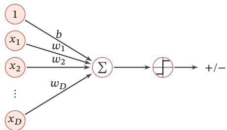  
图3.1 二分类的线性模型

[¶0015] 在本章，我们主要介绍四种不同线性分类模型：Logistic回归、Softmax回归、感知器和支持向量机，这些模型的区别主要在于使用了不同的损失函数

## 3.1 线性判别函数和决策边界

[¶0016] 从公式(3.3)可知，一个线性分类模型（Linear Classification Model）或线性分类器（Linear Classifier），是由一个（或多个）线性的判别函数 $f ( x ; { \pmb w } ) =$ $\pmb { w } ^ { \top } \pmb { x } + b$ 和非线性的决策函数 $g ( \cdot )$ 组成．我们首先考虑二分类的情况，然后再扩展到多分类的情况

## 3.1.1 二分类

[¶0017] 二分类（Binary Classification）问题的类别标签 ?? 只有两种取值，通常可以设为 {+1, −1} 或 {0, 1}．在二分类问题中，常用正例（Positive Sample）和负例（Negative Sample）来分别表示属于类别+1和−1的样本

[¶0018] 在二分类问题中，我们只需要一个线性判别函数 $f ( \pmb { x } ; \pmb { w } ) = \pmb { w } ^ { \top } \pmb { x } + b .$ ．特征空间 $\mathbb { R } ^ { D }$ 中所有满足 $f ( { \pmb x } ; { \pmb w } ) = 0$ 的点组成一个分割超平面（Hyperplane），称为决策边界（Decision Boundary）或决策平面（Decision Surface）．决策边界将特征空间一分为二，划分成两个区域，每个区域对应一个类别

[¶0019] 所谓“线性分类模型”就是指其决策边界是线性超平面．在特征空间中，决策平面与权重向量??正交．特征空间中每个样本点到决策平面的有向距离（Signed Distance）为

[¶0020]
$$
\gamma = \frac { f ( \pmb { x } ; \pmb { w } ) } { | | \pmb { w } | | } .\tag{3.6}
$$

[¶0021] 参见习题3-2超平面就是三维空间中的平面在更高维空间的推广．??维空间中的 超 平 面 是?? − 1维的．在二维空间中，决策边界为一个直线；在三维空间中，决策边界为一个平面；在高维空间中，决策边界为一个超平面

[¶0022] $\gamma$ 也可以看作点??在??方向上的投影

[¶0023] 图3.2给出了一个二分类问题的线性决策边界示例，其中样本特征向量 $x =$ $[ x _ { 1 } , x _ { 2 } ]$ ，权重向量 $\boldsymbol { w } = [ w _ { 1 } , w _ { 2 } ]$

[¶0024]
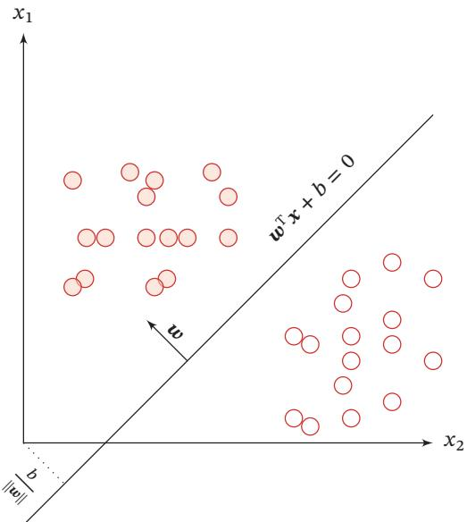  
图3.2 二分类的决策边界示例

[¶0025] 给定??个样本的训练集 $\mathcal { D } = \{ ( \boldsymbol { x } ^ { ( n ) } , y ^ { ( n ) } ) \} _ { n = 1 } ^ { N }$ ，其中 $y ^ { ( n ) } \in \{ + 1 , - 1 \}$ ，线性模型试图学习到参数 $\pmb { w } ^ { * }$ ，使得对于每个样本 $( \mathbf { x } ^ { ( n ) } , y ^ { ( n ) } )$ 尽量满足

[¶0026]
$$
\begin{array} { r l } { f ( { \pmb x } ^ { ( n ) } ; { \pmb w } ^ { * } ) > 0 \quad } & { \mathrm { i f } \quad y ^ { ( n ) } = 1 , } \\ { f ( { \pmb x } ^ { ( n ) } ; { \pmb w } ^ { * } ) < 0 \quad } & { \mathrm { i f } \quad y ^ { ( n ) } = - 1 . } \end{array}\tag{3.7}
$$

[¶0027] 上面两个公式也可以合并，即参数 $\pmb { w } ^ { * }$ 尽量满足

[¶0028]
$$
y ^ { ( n ) } f ( x ^ { ( n ) } ; w ^ { \ast } ) > 0 , \qquad \forall n \in [ 1 , N ] .\tag{3.8}
$$

[¶0029] 定义3.1–两类线性可分：对于训练集 $\mathcal { D } = \left\{ ( \boldsymbol { x } ^ { ( n ) } , y ^ { ( n ) } ) \right\} _ { n = 1 } ^ { N }$ ，如果存在权重向量 $\pmb { w } ^ { * }$ ，对所有样本都满足 $y f ( x ; w ^ { * } ) > 0$ ，那么训练集?? 是线性可分的

[¶0030] 为了学习参数??，我们需要定义合适的损失函数以及优化方法．对于二分类问题，最直接的损失函数为0-1损失函数，即

[¶0031]
$$
\mathcal { L } _ { 0 1 } \big ( y , f ( \pmb { x } ; \pmb { w } ) \big ) = I \big ( y f ( \pmb { x } ; \pmb { w } ) < 0 \big ) ,\tag{3.9}
$$

[¶0032] 其中 $I ( \cdot )$ 为指示函数．但0-1损失函数的数学性质不好，其关于??的导数为0，从而导致无法优化??

## 3.1.2 多分类

[¶0033] 多分类（Multi-class Classification）问题是指分类的类别数 ?? 大于 2．多分类一般需要多个线性判别函数，但设计这些判别函数有很多种方式

[¶0034] 假设一个多分类问题的类别为 $\{ 1 , 2 , \cdots , C \}$ ，常用的方式有以下三种：

[¶0035] （1）“一对其余”方式：把多分类问题转换为??个“一对其余”的二分类问题．这种方式共需要??个判别函数，其中第??个判别函数 $f _ { c }$ 是将类别??的样本和不属于类别??的样本分开

[¶0036] （2）“一对一”方式：把多分类问题转换为 $C ( C - 1 ) / 2$ 个“一对一”的二分类问题．这种方式共需要 $C ( C - 1 ) / 2$ 个判别函数，其中第(??, ??)个判别函数是把类别??和类别??的样本分开

[¶0037]
$$
1 \leq i < j \leq C
$$

[¶0038] （3） “argmax”方式：这是一种改进的“一对其余”方式，共需要??个判别函数

[¶0039]
$$
f _ { c } ( \pmb { x } ; \pmb { w } _ { c } ) = \pmb { w } _ { c } ^ { \top } \pmb { x } + b _ { c } , \qquad c \in \{ 1 , \cdots , C \}\tag{3.10}
$$

[¶0040] 对于样本??，如果存在一个类别??，相对于所有的其他类别 $\tilde { c } ( \tilde { c } \neq c )$ 有 $f _ { c } ( { \pmb x } ; { \pmb w } _ { c } ) >$ $f _ { \tilde { c } } ( { \pmb x } , { \pmb w } _ { \tilde { c } } )$ ，那么??属于类别??．“argmax”方式的预测函数定义为

[¶0041]
$$
y = \underset { c = 1 } { \arg \operatorname* { m a x } } f _ { c } ( \pmb { x } ; \pmb { w } _ { c } ) .\tag{3.11}
$$

[¶0042] 参见习题3-3

[¶0043] “一对其余”方式和“一对一”方式都存在一个缺陷：特征空间中会存在一些难以确定类别的区域，而“argmax”方式很好地解决了这个问题．图3.3给出了用这三种方式进行多分类的示例，其中红色直线表示判别函数 $f ( \cdot ) = 0$ 的直线，不同颜色的区域表示预测的三个类别的区域 $( \omega _ { 1 } , \omega _ { 2 }$ 和 $\omega _ { 3 }$ ）和难以确定类别的区域 $\big ( \begin{array} { c } { { \scriptscriptstyle { \bf \cdots } } } \\ { { \bf \zeta } } \end{array} \big )$ ．在“argmax”方式中，相邻两类 ?? 和 ?? 的决策边界实际上是由$f _ { i } ( { \pmb x } ; { \pmb w } _ { i } ) - f _ { j } ( { \pmb x } ; { \pmb w } _ { j } ) = 0$ 决定，其法向量为 $\mathbf { } w _ { i } - \mathbf { \gamma } w _ { j }$

[¶0044]
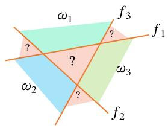  
(a)“一对其余”方式

[¶0045]
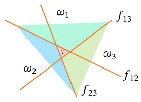  
(b)“一对一”方式  
图3.3 多分类问题的三种方式

[¶0046]
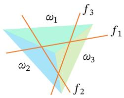  
(c)“argmax”方式

[¶0047] 定义3.2–多类线性可分：对于训练集 $\mathcal { D } = \left\{ ( \boldsymbol { x } ^ { ( n ) } , y ^ { ( n ) } ) \right\} _ { n = 1 } ^ { N }$ ，如果存在??个权重向量 $\pmb { w } _ { 1 } ^ { * } , \cdots , \pmb { w } _ { C } ^ { * }$ ，使得第 $c ( 1 \leq c \leq C )$ 类的所有样本都满足 $f _ { c } ( \pmb { x } ; \pmb { w } _ { c } ^ { * } ) >$ $f _ { \widetilde { c } } ( \pmb { x } , \pmb { w } _ { \widetilde { c } } ^ { * } ) , \forall \widetilde { c } \neq c$ ，那么训练集?? 是线性可分的

[¶0048] 从上面定义可知，如果数据集是多类线性可分的，那么一定存在一个“argmax”方式的线性分类器可以将它们正确分开

[¶0049] 参见习题3-4

## 3.2 Logistic 回归

[¶0050] Logistic 回归（Logistic Regression，LR）是一种常用的处理二分类问题的线性模型．在本节中，我们采用 $y \in \{ 0 , 1 \}$ 以符合Logistic回归的描述习惯

[¶0051] 为了解决连续的线性函数不适合进行分类的问题，我们引入非线性函数 $g$ ∶$\mathbb { R } ^ { D } \to ( 0 , 1 )$ 来预测类别标签的后验概率 $p ( y = 1 | x )$

[¶0052]
$$
p ( y = 1 | \pmb { x } ) = g ( f ( \pmb { x } ; \pmb { w } ) ) ,\tag{3.12}
$$

[¶0053] 其中 $g ( \cdot )$ 通常称为激活函数（Activation Function），其作用是把线性函数的值域从实数区间“挤压”到了(0, 1)之间，可以用来表示概率．在统计文献中， $g ( \cdot )$ 的逆函数 $g ^ { - 1 } ( \cdot )$ 也称为联系函数（Link Function）

[¶0054] 在Logistic回归中，我们使用Logistic函数来作为激活函数．标签 $y = 1$ 的后验概率为

[¶0055]
$$
p ( y = 1 | \boldsymbol { x } ) = \sigma ( \boldsymbol { w } ^ { \top } \boldsymbol { x } )\tag{3.13}
$$

[¶0056]
$$
\triangleq \frac { 1 } { 1 + \exp ( - { \pmb w } ^ { \top } { \pmb x } ) } ,\tag{3.14}
$$

[¶0057] 为简单起见，这里 $\pmb { x } = [ x _ { 1 } , \cdots , x _ { D }$ , 1]T 和 $\pmb { w } = [ w _ { 1 } , \cdots , w _ { D } , b ] ^ { \intercal }$ 分别为 $D + 1$ 维的增广特征向量和增广权重向量

[¶0058] 标签?? = 0的后验概率为

[¶0059]
$$
p ( y = 0 | \pmb { x } ) = 1 - p ( y = 1 | \pmb { x } )\tag{3.15}
$$

[¶0060]
$$
{ \bf \tau } = \frac { \exp ( - { \pmb w } ^ { \top } { \pmb x } ) } { 1 + \exp ( - { \pmb w } ^ { \top } { \pmb x } ) } .\tag{3.16}
$$

[¶0061] 将公式(3.14)进行变换后得到

[¶0062]
$$
\pmb { w } ^ { \top } \pmb { x } = \log \frac { p ( y = 1 | \pmb { x } ) } { 1 - p ( y = 1 | \pmb { x } ) }\tag{3.17}
$$

[¶0063] https://nndl.github.io/

[¶0064]
$$
= \log { \frac { p ( y = 1 | x ) } { p ( y = 0 | x ) } } ,\tag{3.18}
$$

[¶0065] 其中 $\frac { p ( y = 1 | \pmb { x } ) } { p ( y = 0 | \pmb { x } ) }$ 为样本??为正反例后验概率的比值，称为几率（Odds），几率的对数称为对数几率（Log Odds，或Logit）．公式(3.17)中等号的左边是线性函数，这样Logistic回归可以看作预测值为“标签的对数几率”的线性回归模型．因此，Logistic 回归也称为对数几率回归（Logit Regression）

[¶0066] 图3.4给出了使用线性回归和Logistic回归来解决一维数据的二分类问题的示例．

[¶0067]
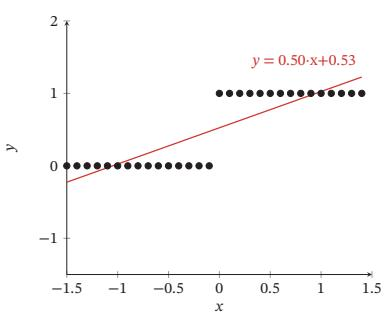  
(a)线性回归

[¶0068]
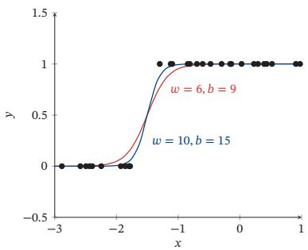  
(b) Logistic 回归  
图3.4 一维数据的二分类问题示例

## 3.2.1 参数学习

[¶0069] Logistic回归采用交叉熵作为损失函数，并使用梯度下降法来对参数进行优化．

[¶0070] 给定??个训练样本 $\{ ( \pmb { x } ^ { ( n ) } , y ^ { ( n ) } ) \} _ { n = 1 } ^ { N }$ ，用Logistic回归模型对每个样本 $\pmb { x } ^ { ( n ) }$ 进行预测，输出其标签为1的后验概率，记为 ${ \hat { y } } ^ { ( n ) }$

[¶0071]
$$
\hat { y } ^ { ( n ) } = \sigma ( \pmb { w } ^ { \top } \pmb { x } ^ { ( n ) } ) , \qquad 1 \leq n \leq N .\tag{3.19}
$$

[¶0072] 由于 $y ^ { ( n ) } \in \{ 0 , 1 \}$ ，样本 $( \mathbf { x } ^ { ( n ) } , y ^ { ( n ) } )$ 的真实条件概率可以表示为

[¶0073]
$$
p _ { r } ( y ^ { ( n ) } = 1 | \mathbf { x } ^ { ( n ) } ) = y ^ { ( n ) } ,\tag{3.20}
$$

[¶0074]
$$
p _ { r } ( y ^ { ( n ) } = 0 | x ^ { ( n ) } ) = 1 - y ^ { ( n ) } .\tag{3.21}
$$

[¶0075] 使用交叉熵损失函数，其风险函数为

[¶0076] 为简单起见，这里忽略了正则化项

[¶0077]
$$
\mathcal R ( \pmb w ) = - \frac { 1 } { N } \sum _ { n = 1 } ^ { N } \left( p _ { r } ( y ^ { ( n ) } = 1 | \pmb x ^ { ( n ) } ) \log \hat { y } ^ { ( n ) } + p _ { r } ( y ^ { ( n ) } = 0 | \pmb x ^ { ( n ) } ) \log ( 1 - \hat { y } ^ { ( n ) } ) \right)\tag{3.22}
$$

[¶0078]
$$
= - \frac { 1 } { N } \sum _ { n = 1 } ^ { N } \bigg ( y ^ { ( n ) } \log \hat { y } ^ { ( n ) } + ( 1 - y ^ { ( n ) } ) \log ( 1 - \hat { y } ^ { ( n ) } ) \bigg ) .\tag{3.23}
$$

[¶0079] 风险函数ℛ(??)关于参数??的偏导数为

[¶0080]
$$
\frac { \partial \mathcal { R } ( w ) } { \partial w } = - \frac { 1 } { N } \sum _ { n = 1 } ^ { N } \left( y ^ { ( n ) } \frac { \hat { y } ^ { ( n ) } ( 1 - \hat { y } ^ { ( n ) } ) } { \hat { y } ^ { ( n ) } } x ^ { ( n ) } - ( 1 - y ^ { ( n ) } ) \frac { \hat { y } ^ { ( n ) } ( 1 - \hat { y } ^ { ( n ) } ) } { 1 - \hat { y } ^ { ( n ) } } x ^ { ( n ) } \right)\tag{3.24}
$$

[¶0081]
$$
= - { \frac { 1 } { N } } \sum _ { n = 1 } ^ { N } \left( y ^ { ( n ) } ( 1 - { \hat { y } } ^ { ( n ) } ) { \pmb x } ^ { ( n ) } - ( 1 - y ^ { ( n ) } ) { \hat { y } } ^ { ( n ) } { \pmb x } ^ { ( n ) } \right)\tag{3.25}
$$

[¶0082] ??̂ 为 Logistic 函 数，因 此 有 $\begin{array} { r } { \frac { \partial \hat { y } } { \partial { \pmb w } ^ { \top } x } = } \end{array}$ $\hat { y } ^ { ( n ) } ( 1 - \hat { y } ^ { ( n ) } )$ ．参见第B.4.2.1节

[¶0083]
$$
\mathbf { \Psi } = - \frac { 1 } { N } \sum _ { n = 1 } ^ { N } \mathbf { \Psi } x ^ { ( n ) } \big ( y ^ { ( n ) } - \hat { y } ^ { ( n ) } \big ) .\tag{3.26}
$$

[¶0084] 采用梯度下降法，Logistic回归的训练过程为：初始化 $\pmb { w } _ { 0 } \gets 0$ ，然后通过下式来迭代更新参数：

[¶0085]
$$
{ \pmb w } _ { t + 1 }  { \pmb w } _ { t } + \alpha \frac { 1 } { N } \sum _ { n = 1 } ^ { N } { \pmb x } ^ { ( n ) } \bigg ( y ^ { ( n ) } - \hat { y } _ { { \pmb w } _ { t } } ^ { ( n ) } \bigg ) ,\tag{3.27}
$$

[¶0086] 其中 $\alpha$ 是学习率， $\hat { y } _ { \pmb { w } _ { t } } ^ { ( n ) }$ 是当参数为 ${ \pmb w } _ { t }$ 时，Logistic回归模型的输出

[¶0087] 从公式(3.23)可知，风险函数ℛ(??)是关于参数??的连续可导的凸函数．因此除了梯度下降法之外，Logistic回归还可以用高阶的优化方法（比如牛顿法）来进行优化

## 3.3 Softmax 回归

[¶0088] Softmax 回归（Softmax Regression），也称为多项（Multinomial）或多类（Multi-Class）的 Logistic 回归，是 Logistic 回归在多分类问题上的推广

[¶0089] 对于多类问题，类别标签 $y \in \{ 1 , 2 , \cdots , C \}$ 可以有??个取值．给定一个样本??，Softmax回归预测的属于类别??的条件概率为

[¶0090] Softmax回归也可以看作一种条件最大熵模型，参见第11.1.5.1节

[¶0091]
$$
p ( y = c | \mathbf { x } ) = \mathrm { s o f t m a x } ( \pmb { w } _ { c } ^ { \top } \pmb { x } )\tag{3.28}
$$

[¶0092] Softmax 函 数 参 见第B.4.2.2节

[¶0093]
$$
= \frac { \exp ( { \pmb w } _ { c } ^ { \top } { \pmb x } ) } { \sum _ { c ^ { \prime } = 1 } ^ { C } \exp ( { \pmb w } _ { c ^ { \prime } } ^ { \top } { \pmb x } ) } ,\tag{3.29}
$$

[¶0094] 其中 ${ \pmb w } _ { c }$ 是第 $c$ 类的权重向量

[¶0095] Softmax回归的决策函数可以表示为

[¶0096]
$$
\begin{array} { c } { { \hat { y } = \underset { c = 1 } { \operatorname { \arg m a x } } p ( y = c | \pmb { x } ) } } \\ { { \frac { C } { \tau = 1 } } \underset { c = 1 } { \operatorname { \arg m a x } } \pmb { w } _ { c } ^ { \top } \pmb { x } . }  \end{array}\tag{3.30}
$$

[¶0097] (3.31)

[¶0098] https://nndl.github.io/

[¶0099] 与 Logistic 回归的关系 当类别数?? = 2时，Softmax回归的决策函数为

[¶0100]
$$
\hat { y } = \arg \operatorname* { m a x } _ { y \in \{ 0 , 1 \} } w _ { y } ^ { \top } { x }\tag{3.32}
$$

[¶0101]
$$
{ \bf \tau } = { \cal I } \Big ( { \pmb w } _ { 1 } ^ { \top } { \pmb x } - { \pmb w } _ { 0 } ^ { \top } { \pmb x } > 0 \Big )\tag{3.33}
$$

[¶0102]
$$
\mathbf { \sigma } = I \Big ( ( \mathbf { \otimes } \mathbf { ( } \mathbf { w } _ { 1 } - \mathbf { w } _ { 0 } ) ^ { \top } \mathbf { x } > 0 \Big ) ,\tag{3.34}
$$

[¶0103] 其中??(⋅)是指示函数．对比公式(3.5)中的二分类决策函数，可以发现二分类中的权重向量 $\mathbf { w } = \mathbf { w } _ { 1 } - \mathbf { w } _ { 0 }$

[¶0104] 向量表示 公式(3.29)用向量形式可以写为

[¶0105]
$$
\hat { y } = \operatorname { s o f t m a x } ( W ^ { \intercal } x )\tag{3.35}
$$

[¶0106]
$$
= \frac { \exp ( W ^ { \top } x ) } { \mathbf { 1 } _ { C } ^ { \top } \exp \left( W ^ { \top } x \right) } ,\tag{3.36}
$$

[¶0107] 其中 $\pmb { W } = [ \pmb { w } _ { 1 } , \cdots , \pmb { w } _ { C } ]$ 是由??个类的权重向量组成的矩阵， ${ \bf 1 } _ { C }$ 为??维的全1向量， $\hat { \pmb { y } } \in \mathbb { R } ^ { C }$ 为所有类别的预测条件概率组成的向量，第 $c$ 维的值是第??类的预测条件概率

## 3.3.1 参数学习

[¶0108] 给定??个训练样本 $\{ ( \pmb { x } ^ { ( n ) } , y ^ { ( n ) } ) \} _ { n = 1 } ^ { N }$ ，Softmax回归使用交叉熵损失函数来学习最优的参数矩阵??

[¶0109] 为了方便起见，我们用??维的one-hot向量 $y \in \{ 0 , 1 \} ^ { C }$ 来表示类别标签．对于类别??，其向量表示为

[¶0110]
$$
\pmb { y } = [ I ( 1 = c ) , I ( 2 = c ) , \cdots , I ( C = c ) ] ^ { \top } ,\tag{3.37}
$$

[¶0111] 其中??(⋅)是指示函数

[¶0112] 采用交叉熵损失函数，Softmax回归模型的风险函数为

[¶0113] 为简单起见，这里忽略了正则化项

[¶0114]
$$
\begin{array} { r } { \mathcal { R } ( \pmb { W } ) = - \displaystyle \frac { 1 } { N } \sum _ { n = 1 } ^ { N } \sum _ { c = 1 } ^ { C } \pmb { y } _ { c } ^ { ( n ) } \log \hat { \pmb { y } } _ { c } ^ { ( n ) } } \\ { = - \displaystyle \frac { 1 } { N } \sum _ { n = 1 } ^ { N } ( \pmb { y } ^ { ( n ) } ) ^ { \top } \log \hat { \pmb { y } } ^ { ( n ) } , } \end{array}\tag{3.38}
$$

[¶0115] (3.39)

[¶0116] 其中 $\hat { \mathbf { y } } ^ { ( n ) } = \operatorname { s o f t m a x } ( \mathbf { W } ^ { \top } \mathbf { x } ^ { ( n ) } )$ 为样本 $\pmb { x } ^ { ( n ) }$ 在每个类别的后验概率

[¶0117] 风险函数ℛ(?? )关于?? 的梯度为

[¶0118]
$$
\frac { \partial \mathcal { R } ( W ) } { \partial W } = - \frac { 1 } { N } \sum _ { n = 1 } ^ { N } x ^ { ( n ) } \left( y ^ { ( n ) } - \hat { y } ^ { ( n ) } \right) ^ { \top } .\tag{3.40}
$$

[¶0119] https://nndl.github.io/

[¶0120] 证明. 计算公式(3.40)中的梯度，关键在于计算每个样本的损失函数 ${ \mathcal { L } } ^ { ( n ) } ( W ) =$ $- ( \mathbf { y } ^ { ( n ) } ) ^ { \top } \log \hat { \mathbf { y } } ^ { ( n ) }$ 关于参数?? 的梯度，其中需要用到的两个导数公式为

[¶0121] （1） 若 $y = \operatorname { s o f t m a x } ( z )$ ，则 $\begin{array} { r } { \frac { \partial \mathbf { y } } { \partial z } = \mathrm { d i a g } \left( \mathbf { y } \right) - \mathbf { y } \mathbf { y } ^ { \top } . } \end{array}$

[¶0122] Softmax函数的导数 参见第B.4.2.2节

[¶0123] （2） 若 $\begin{array} { r } { z = W ^ { \top } \pmb { x } = [ \pmb { w } _ { 1 } ^ { \top } \pmb { x } , \pmb { w } _ { 2 } ^ { \top } \pmb { x } , \cdots , \pmb { w } _ { C } ^ { \top } \pmb { x } ] ^ { \top } } \end{array}$ ，则 $\frac { \partial z } { \partial w _ { c } }$ 为第??列为??，其余为0的矩阵．

[¶0124]
$$
\frac { \partial \boldsymbol { z } } { \partial \boldsymbol { w } _ { c } } = [ \frac { \partial \boldsymbol { w } _ { 1 } ^ { \intercal } \boldsymbol { x } } { \partial \boldsymbol { w } _ { c } } , \frac { \partial \boldsymbol { w } _ { 2 } ^ { \intercal } \boldsymbol { x } } { \partial \boldsymbol { w } _ { c } } , \cdots , \frac { \partial \boldsymbol { w } _ { C } ^ { \intercal } \boldsymbol { x } } { \partial \boldsymbol { w } _ { c } } ]\tag{3.41}
$$

[¶0125]
$$
\mathbf { \Phi } = [ \mathbf { 0 } , \mathbf { 0 } , \cdots , x , \cdots , \mathbf { 0 } ]\tag{3.42}
$$

[¶0126]
$$
\triangleq \mathbb { M } _ { c } ( { \pmb x } ) .\tag{3.43}
$$

[¶0127] 根据链式法则， $\mathcal { L } ^ { ( n ) } ( \pmb { W } ) = - ( \pmb { y } ^ { ( n ) } ) ^ { \top } \log \hat { \pmb { y } } ^ { ( n ) }$ 关于 ${ \pmb w } _ { c }$ 的偏导数为

[¶0128]
$$
\frac { \partial \mathcal { L } ^ { ( n ) } ( W ) } { \partial w _ { c } } = - \frac { \partial \left( ( \mathbf { y } ^ { ( n ) } ) ^ { \intercal } \log \hat { \mathbf { y } } ^ { ( n ) } \right) } { \partial w _ { c } }\tag{3.44}
$$

[¶0129]
$$
= - \frac { \partial \pmb { z } ^ { ( n ) } } { \partial \pmb { w } _ { c } } \frac { \partial \hat { \pmb { y } } ^ { ( n ) } } { \partial \pmb { z } ^ { ( n ) } } \frac { \partial \log \hat { \pmb { y } } ^ { ( n ) } } { \partial \hat { \pmb { y } } ^ { ( n ) } } \pmb { y } ^ { ( n ) }\tag{3.45}
$$

[¶0130]
$$
= - \mathbb { M } _ { c } ( { \pmb x } ^ { ( n ) } ) \left( \mathrm { d i a g } \left( \hat { \pmb y } ^ { ( n ) } \right) - \hat { \pmb y } ^ { ( n ) } ( \hat { \pmb y } ^ { ( n ) } ) ^ { \top } \right) \left( \mathrm { d i a g } ( \hat { \pmb y } ^ { ( n ) } ) \right) ^ { - 1 } { \pmb y } ^ { ( n ) }\tag{3.46}
$$

[¶0131]
$$
\begin{array} { r l } { \mathbf { \Psi } } & { { } = - \mathbb { M } _ { c } ( \mathbf { x } ^ { ( n ) } ) \left( \pmb { I } - \hat { \mathbf { y } } ^ { ( n ) } \mathbf { 1 } _ { C } ^ { \top } \right) \mathbf { y } ^ { ( n ) } } \end{array}
$$

[¶0132] $\begin{array} { r } { y ^ { \top } \mathrm { d i a g } ( y ) ^ { - 1 } = \mathbf { 1 } _ { C } ^ { \top } } \end{array}$ 为全1的行向量

[¶0133] (3.47)

[¶0134]
$$
\mathbf { \Psi } = - \mathbb { M } _ { c } ( \mathbf { x } ^ { ( n ) } ) \big ( \mathbf { y } ^ { ( n ) } - \hat { \mathbf { y } } ^ { ( n ) } \mathbf { 1 } _ { C } ^ { \top } \mathbf { y } ^ { ( n ) } \big )\tag{3.48}
$$

[¶0135]
$$
\mathbf { \partial } = - \mathbb { M } _ { c } ( \mathbf { \vec { x } } ^ { ( n ) } ) \big ( \mathbf { y } ^ { ( n ) } - \hat { \mathbf { y } } ^ { ( n ) } \big )
$$

[¶0136] ??为one-hot向量，所以$\mathbf { 1 } _ { C } ^ { \intercal } \mathbf { y } = 1$

[¶0137] (3.49)

[¶0138]
$$
= - \pmb { x } ^ { ( n ) } \left[ \pmb { y } ^ { ( n ) } - \pmb { \hat { y } } ^ { ( n ) } \right] _ { c } .\tag{3.50}
$$

[¶0139] 公式(3.50)也可以表示为非向量形式，即

[¶0140]
$$
\frac { \partial \mathcal { L } ^ { ( n ) } ( W ) } { \partial w _ { c } } = - \pmb { x } ^ { ( n ) } \left( I ( y ^ { ( n ) } = c ) - \hat { y } _ { c } ^ { ( n ) } \right) ,\tag{3.51}
$$

[¶0141] 其中??(⋅)是指示函数

[¶0142] 根据公式(3.50)可以得到

[¶0143]
$$
\frac { \partial \mathcal { L } ^ { ( n ) } ( W ) } { \partial W } = - \pmb { x } ^ { ( n ) } \big ( \pmb { y } ^ { ( n ) } - \pmb { \hat { y } } ^ { ( n ) } \big ) ^ { \top } .\tag{3.52}
$$

[¶0144] 采用梯度下降法，Softmax回归的训练过程为：初始化 $W _ { 0 } \gets 0$ ，然后通过下式进行迭代更新：

[¶0145]
$$
W _ { t + 1 } \gets W _ { t } + \alpha \left( \frac { 1 } { N } \sum _ { n = 1 } ^ { N } \pmb { x } ^ { ( n ) } \left( \pmb { y } ^ { ( n ) } - \hat { \pmb { y } } _ { W _ { t } } ^ { ( n ) } \right) ^ { \top } \right) ,\tag{3.53}
$$

[¶0146] 其中 $\alpha$ 是学习率， $\hat { \mathbf { y } } _ { W _ { t } } ^ { ( n ) }$ 是当参数为 $\mathbf { } \mathbf { } W _ { t }$ 时，Softmax回归模型的输出https://nndl.github.io/

[¶0147]


[¶0148] 要注意的是，Softmax回归中使用的??个权重向量是冗余的，即对所有的权重向量都减去一个同样的向量??，不改变其输出结果．因此，Softmax回归往往需要使用正则化来约束其参数．此外，我们还可以利用这个特性来避免计算Softmax函数时在数值计算上溢出问题

## 3.4 感知器

[¶0149] 感知器（Perceptron）由 Frank Roseblatt 于 1957 年提出，是一种广泛使用的线性分类器．感知器可谓是最简单的人工神经网络，只有一个神经元

[¶0150] Frank Rosenblatt

[¶0151] 感知器是对生物神经元的简单数学模拟，有与生物神经元相对应的部件，如权重（突触）、偏置（阈值）及激活函数（细胞体），输出为+1或−1

[¶0152] （1928～1971），美国心理学家，人工智能领域开拓者

[¶0153] 感知器是一种简单的两类线性分类模型，其分类准则与公式(3.5)相同，即

[¶0154]
$$
\begin{array} { r } { \hat { y } = \operatorname { s g n } ( { \pmb w } ^ { \top } { \pmb x } ) . } \end{array}\tag{3.54}
$$

[¶0155] 最早发明的感知器是一台机器而不是一种算法，后来才被实现为IBM 704机器上可运行的程序

## 3.4.1 参数学习

[¶0156] 感知器学习算法也是一个经典的线性分类器的参数学习算法

[¶0157] 给定??个样本的训练集： $\{ ( \pmb { x } ^ { ( n ) } , y ^ { ( n ) } ) \} _ { n = 1 } ^ { N }$ ，其中 $y ^ { ( n ) } \in \{ + 1 , - 1 \}$ ，感知器学习算法试图找到一组参数 $\pmb { w } ^ { * }$ ，使得对于每个样本 $( \mathbf { x } ^ { ( n ) } , y ^ { ( n ) } )$ 有

[¶0158]
$$
y ^ { ( n ) } { \pmb w } ^ { * ^ { \top } } { \pmb x } ^ { ( n ) } > 0 , \qquad \forall n \in \{ 1 , \cdots , N \} .\tag{3.55}
$$

[¶0159] 感知器的学习算法是一种错误驱动的在线学习算法[Rosenblatt, 1958]．先初始化一个权重向量?? ← 0（通常是全零向量），然后每次分错一个样本 $( x , y )$ 时，即 $y \pmb { w } ^ { \top } \pmb { x } < 0$ ，就用这个样本来更新权重

[¶0160]
$$
{ \pmb w } \gets { \pmb w } + y { \pmb x } .\tag{3.56}
$$

[¶0161] 具体的感知器参数学习策略如算法3.1所示

[¶0162] 根据感知器的学习策略，可以反推出感知器的损失函数为

[¶0163]
$$
\begin{array} { r } { \mathcal { L } ( \pmb { w } ; \pmb { x } , y ) = \operatorname* { m a x } ( 0 , - y \pmb { w } ^ { \top } \pmb { x } ) . } \end{array}\tag{3.57}
$$

[¶0164] 采用随机梯度下降，其每次更新的梯度为

[¶0165]
$$
\begin{array} { r } { \frac { \partial \mathcal { L } ( \boldsymbol { w } ; \boldsymbol { x } , \boldsymbol { y } ) } { \partial \boldsymbol { w } } = \left\{ \begin{array} { l l } { 0 \quad } & { \mathrm { i f } \quad y \boldsymbol { w ^ { \intercal } } \boldsymbol { x } > 0 , } \\ { - y \boldsymbol { x } \quad } & { \mathrm { i f } \quad y \boldsymbol { w ^ { \intercal } } \boldsymbol { x } < 0 . } \end{array} \right. } \end{array}\tag{3.58}
$$

[¶0166]
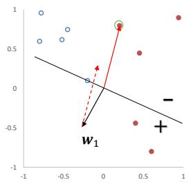

[¶0167]
```markdown

[¶0168] Q
。
0.5 0.5
.
??2

[¶0169]
+
-0.5 · -0.5
??1
.
-1 -1
-1 -0.5 0 0.5 -1 -0.5 0 0.5
1
. ·
? 。
0.5 0.5
。 ??4
0 0
-0.5 ??3 -0.5 +
-1 -1
-0.5 0 0.5 -0.5 0.5
```

[¶0170] 算法3.1 两类感知器的参数学习算法  
输入:训练集 $\mathcal { D } = \{ ( \boldsymbol { x } ^ { ( n ) } , y ^ { ( n ) } ) \} _ { n = 1 } ^ { N }$ ，最大迭代次数??  
1 初始化： $\pmb { w } _ { 0 } \gets 0 , k \gets 0 , t \gets 0$   
2 repeat  
3 对训练集??中的样本随机排序;  
4 for ?? = 1 ⋯ ?? do  
5 选取一个样本 $( \mathbf { x } ^ { ( n ) } , y ^ { ( n ) } ) ;$   
6 if ${ \pmb w } _ { k } ^ { \top } ( y ^ { ( n ) } { \pmb x } ^ { ( n ) } ) \le 0$ then  
7 ${ \pmb w } _ { k + 1 }  { \pmb w } _ { k } + y ^ { ( n ) } { \pmb x } ^ { ( n ) }$   
8 $k \gets k + 1 ;$   
9 end  
10 ?? ← ?? + 1;  
11 if ?? = ?? then break; // 达到最大迭代次数  
12 end  
13 until $t = T ;$   
输出: ${ \pmb w } _ { k }$

[¶0171] 图3.5给出了感知器参数学习的更新过程，其中红色实心点为正例，蓝色空心点为负例．黑色箭头表示当前的权重向量，红色虚线箭头表示权重的更新方向．

[¶0172]
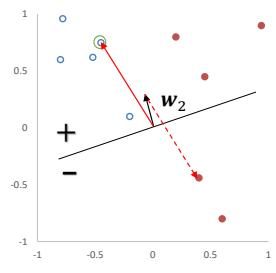

[¶0173]
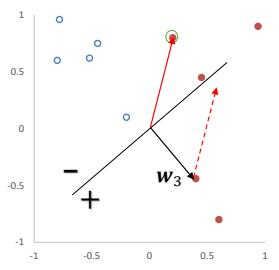

[¶0174]
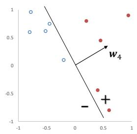  
图3.5 感知器参数学习的更新过程

## 3.4.2 感知器的收敛性

[¶0175] [Novikoff,1963]证明对于两类问题，如果训练集是线性可分的，那么感知器算法可以在有限次迭代后收敛．然而，如果训练集不是线性可分的，那么这个算法则不能确保会收敛

[¶0176] 参见定义3.1

[¶0177] 当数据集是两类线性可分时，对于训练集 $\mathcal { D } = \left\{ ( \boldsymbol { x } ^ { ( n ) } , y ^ { ( n ) } ) \right\} _ { n = 1 } ^ { N }$ ，其中 $\pmb { x } ^ { ( n ) }$ 为样本的增广特征向量， $y ^ { ( n ) } \in \{ - 1 , 1 \}$ ，那么存在一个正的常数 $\gamma ( \gamma > 0 )$ 和权重向量 $\pmb { w } ^ { * }$ ，并且 $\lVert \mathbf { \boldsymbol { w } } ^ { * } \rVert = 1$ ，对所有??都满足 $( { \pmb w } ^ { * } ) ^ { \top } ( y ^ { ( n ) } { \pmb x } ^ { ( n ) } ) \ge \gamma .$ ．我们可以证明如下定理

[¶0178] 定理3.1–感知器收敛性：给定训练集 $\mathcal { D } = \left\{ ( \mathbf { x } ^ { ( n ) } , y ^ { ( n ) } ) \right\} _ { n = 1 } ^ { N }$ ，令??是训练集中最大的特征向量的模，即

[¶0179]
$$
R = \operatorname* { m a x } _ { n } \| x ^ { ( n ) } \| .
$$

[¶0180] 如果训练集??线性可分，两类感知器的参数学习算法3.1的权重更新次数不超过 $\frac { R ^ { 2 } } { \gamma ^ { 2 } }$

[¶0181] 证明. 感知器的权重向量的更新方式为

[¶0182]
$$
\begin{array} { r } { \pmb { w } _ { k } = \pmb { w } _ { k - 1 } + y ^ { ( k ) } \pmb { x } ^ { ( k ) } , } \end{array}\tag{3.59}
$$

[¶0183] 其中 $\mathbf x ^ { ( k ) } , y ^ { ( k ) }$ 表示第??个错误分类的样本

[¶0184] 因为初始权重向量为0，在第??次更新时感知器的权重向量为

[¶0185]
$$
{ \pmb w } _ { K } = \sum _ { k = 1 } ^ { K } y ^ { ( k ) } { \pmb x } ^ { ( k ) } .\tag{3.60}
$$

[¶0186] 分别计算 $\| \pmb { w } _ { K } \| ^ { 2 }$ 的上下界：

[¶0187] （1） $\| \pmb { w } _ { K } \| ^ { 2 }$ 的上界为

[¶0188]
$$
\| \pmb { w } _ { K } \| ^ { 2 } = \| \pmb { w } _ { K - 1 } + y ^ { ( K ) } \pmb { x } ^ { ( K ) } \| ^ { 2 }\tag{3.61}
$$

[¶0189]
$$
= \| \pmb { w } _ { K - 1 } \| ^ { 2 } + \| y ^ { ( K ) } \pmb { x } ^ { ( K ) } \| ^ { 2 } + 2 y ^ { ( K ) } \pmb { w } _ { K - 1 } ^ { \top } \pmb { x } ^ { ( K ) }\tag{3.62}
$$

[¶0190]
$$
y _ { k } { w _ { K - 1 } ^ { \mathsf { T } } } { x ^ { ( K ) } } \le 0 .
$$

[¶0191]
$$
\leq \| \pmb { w } _ { K - 1 } \| ^ { 2 } + R ^ { 2 }\tag{3.63}
$$

[¶0192]
$$
\leq \| \pmb { w } _ { K - 2 } \| ^ { 2 } + 2 R ^ { 2 }\tag{3.64}
$$

[¶0193]
$$
\leq K R ^ { 2 } .\tag{3.65}
$$

[¶0194] （2） $\| \pmb { w } _ { K } \| ^ { 2 }$ 的下界为

[¶0195]
$$
\| \pmb { w } _ { K } \| ^ { 2 } = \sqrt { \| \pmb { w } ^ { * } \| ^ { 2 } \cdot \| \pmb { w } _ { K } \| ^ { 2 } }
$$

[¶0196]
$$
\geq \Vert \pmb { w } ^ { \ast ^ { \intercal } } \pmb { w } _ { K } \Vert ^ { 2 }\tag{3.66}
$$

[¶0197]
$$
= \| \mathbf { \boldsymbol { w } } ^ { * } \sum _ { k = 1 } ^ { K } ( \gamma ^ { ( k ) } \mathbf { \boldsymbol { x } } ^ { ( k ) } ) \| ^ { 2 }\tag{3.67}
$$

[¶0198] $\| \pmb { w } ^ { * } \| = 1$ ．两个向量内积的平方一定小于等于这两个向量的模的乘积

[¶0199] (3.68)

[¶0200]
$$
= \| \sum _ { k = 1 } ^ { K } { \pmb w } ^ { * } ^ { \mathsf { T } } ( y ^ { ( k ) } { \pmb x } ^ { ( k ) } ) \| ^ { 2 }\tag{3.69}
$$

[¶0201]
$$
{ \boldsymbol w ^ { * } } ^ { \top } ( y ^ { ( n ) } x ^ { ( n ) } ) { \ge } \gamma , \forall n .
$$

[¶0202]
$$
\geq K ^ { 2 } \gamma ^ { 2 } .\tag{3.70}
$$

[¶0203] 由公式 (3.65) 和公式 (3.70)，得到

[¶0204]
$$
K ^ { 2 } \gamma ^ { 2 } \leq \lvert \lvert \pmb { w } _ { K } \rvert \rvert ^ { 2 } \leq K R ^ { 2 } .\tag{3.71}
$$

[¶0205] 取最左和最右的两项，进一步得到， $K ^ { 2 } \gamma ^ { 2 } \le K R ^ { 2 }$ ．然后两边都除??，最终得到$K \leq \frac { R ^ { 2 } } { \gamma ^ { 2 } }$ ．因此，在线性可分的条件下，算法3.1会在 $\frac { R ^ { 2 } } { \gamma ^ { 2 } }$ 步内收敛 □

[¶0206] 虽然感知器在线性可分的数据上可以保证收敛，但其存在以下不足：

[¶0207] （1） 在数据集线性可分时，感知器虽然可以找到一个超平面把两类数据分开，但并不能保证其泛化能力

[¶0208] （2） 感知器对样本顺序比较敏感．每次迭代的顺序不一致时，找到的分割超平面也往往不一致

[¶0209] （3） 如果训练集不是线性可分的，就永远不会收敛

## 3.4.3 参数平均感知器

[¶0210] 根据定理3.1，如果训练数据是线性可分的，那么感知器可以找到一个判别函数来分割不同类的数据．如果间隔??越大，收敛越快．但是感知器并不能保证找到的判别函数是最优的（比如泛化能力高），这样可能导致过拟合

[¶0211] 感知器学习到的权重向量和训练样本的顺序相关．在迭代次序上排在后面的错误样本比前面的错误样本，对最终的权重向量影响更大．比如有1 000个训练样本，在迭代100个样本后，感知器已经学习到一个很好的权重向量．在接下来的899个样本上都预测正确，也没有更新权重向量．但是，在最后第1 000个样本时预测错误，并更新了权重．这次更新可能反而使得权重向量变差

[¶0212] 为了提高感知器的鲁棒性和泛化能力，我们可以将在感知器学习过程中的所有?? 个权重向量保存起来，并赋予每个权重向量 ${ \pmb w } _ { k }$ 一个置信系数 $c _ { k } \ ( 1 \ \leq$

[¶0213] ?? 为感知器在训练中权 重 向 量 的 总 更 新次数

[¶0214] $k \leq K )$ ．最终的分类结果通过这??个不同权重的感知器投票决定，这个模型也称为投票感知器（Voted Perceptron）[Freund et al., 1999]

[¶0215] 令 $\tau _ { k }$ 为第??次更新权重 ${ \pmb w } _ { k }$ 时的迭代次数（即训练过的样本数量）， $\tau _ { k + 1 }$ 为下次权重更新时的迭代次数，则权重 ${ \pmb w } _ { k }$ 的置信系数 $c _ { k }$ 设置为从 $\tau _ { k }$ 到 $\tau _ { k + 1 }$ 之间间隔的迭代次数，即 $c _ { k } = \tau _ { k + 1 } - \tau _ { k }$ ．置信系数 $c _ { k }$ 越大，说明权重 ${ \pmb w } _ { k }$ 在之后的训练过程中正确分类样本的数量越多，越值得信赖

[¶0216] 这样，投票感知器的形式为

[¶0217]
$$
\hat { y } = \mathrm { s g n } \Big ( \sum _ { k = 1 } ^ { K } c _ { k } \mathrm { s g n } ( { \pmb w } _ { k } ^ { \top } { \pmb x } ) \Big ) ,
$$

[¶0218] 投票感知器是一种集成模型，参见第10.1节

[¶0219] (3.72)

[¶0220] 其中sgn(⋅)为符号函数

[¶0221] 投票感知器虽然提高了感知器的泛化能力，但是需要保存?? 个权重向量在实际操作中会带来额外的开销．因此，人们经常会使用一个简化的版本，通过使用“参数平均”的策略来减少投票感知器的参数数量，也叫作平均感知器（Averaged Perceptron）[Collins, 2002]．平均感知器的形式为

[¶0222]
$$
\hat { y } = \mathrm { s g n } \Big ( \frac { 1 } { T } \sum _ { k = 1 } ^ { K } c _ { k } ( \boldsymbol { w } _ { k } ^ { \top } \boldsymbol { x } ) \Big )\tag{3.73}
$$

[¶0223]
$$
= \operatorname { s g n } \Big ( \frac { 1 } { T } ( \sum _ { k = 1 } ^ { K } c _ { k } { \pmb w } _ { k } ) ^ { \top } { \pmb x } \Big )\tag{3.74}
$$

[¶0224]
$$
\mathbf { \Psi } = \operatorname { s g n } \Big ( ( \frac { 1 } { T } \sum _ { t = 1 } ^ { T } \pmb { w } _ { t } ) ^ { \top } \pmb { x } \Big )\tag{3.75}
$$

[¶0225]
$$
{ \bf \omega } = \mathrm { s g n } ( \bar { \bf w } ^ { \mathrm { \scriptscriptstyle T } } { \bf x } ) ,\tag{3.76}
$$

[¶0226] 其中??为迭代总回合数，??̄ 为??次迭代的平均权重向量．这个方法非常简单，只需要在算法3.1中增加一个??̄，并且在每次迭代时都更新 $\bar { \pmb { w } }$ ：

[¶0227]
$$
\bar { \mathbf { w } } \gets \bar { \mathbf { w } } + \mathbf { w } _ { t } .\tag{3.77}
$$

[¶0228] 但这个方法需要在处理每一个样本时都要更新??̄．因为??̄ 和 ${ \pmb w } _ { t }$ 都是稠密向量，所以更新操作比较费时．为了提高迭代速度，有很多改进的方法，让这个更新只需要在错误预测发生时才进行更新

[¶0229] 算法3.2给出了一个改进的平均感知器算法的训练过程[Daumé III,2012]

[¶0230] 参见习题3-7

[¶0231] 算法 3.2 一种改进的平均感知器参数学习算法  
输入:训练集 $\{ ( \pmb { x } ^ { ( n ) } , y ^ { ( n ) } ) \} _ { n = 1 } ^ { N }$ ，最大迭代次数??  
1 初始化： $\pmb { w } \gets 0 , \pmb { u } \gets 0 , t \gets 0$   
2 repeat  
3 对训练集??中的样本随机排序;  
4 for ?? = 1 ⋯ ?? do  
5 选取一个样本 $( \mathbf { x } ^ { ( n ) } , y ^ { ( n ) } ) ;$   
6 计算预测类别 $\hat { y } _ { t }$ ;  
7 if $\hat { y } _ { t }$ ≠ $y _ { t }$ then  
8 $\mathbf { \pmb { w } } \gets \mathbf { \pmb { w } } + y ^ { ( n ) } \mathbf { \pmb { x } } ^ { ( n ) } ;$   
9 $\pmb { u }  \pmb { u } + t y ^ { ( n ) } \pmb { x } ^ { ( n ) } ,$   
10 end  
11 ?? ← ?? + 1;  
12 if ?? = ?? then break; // 达到最大迭代次数  
13 end  
14 until ?? = ??;  
15 $\begin{array} { r } { \bar { \pmb { w } } = \pmb { w } _ { T } - \frac { 1 } { T } \pmb { u } } \end{array}$   
输出: ??̄

## 3.4.4 扩展到多分类

[¶0232] 原始的感知器是一种二分类模型，但也可以很容易地扩展到多分类问题，甚至是更一般的结构化学习问题[Collins, 2002]

[¶0233] 之前介绍的分类模型中，分类函数都是在输入??的特征空间上．为了使得感知器可以处理更复杂的输出，我们引入一个构建在输入输出联合空间上的特征函数 $\phi ( { \pmb x } , { \pmb y } )$ ，将样本对 $( { \pmb x } , { \pmb y } )$ 映射到一个特征向量空间

[¶0234] 在联合特征空间中，我们可以建立一个广义的感知器模型，

[¶0235]
$$
\hat { \pmb { y } } = \arg \operatorname* { m a x } _ { \pmb { y } \in \mathrm { G e n } ( x ) } \pmb { w } ^ { \top } \phi ( \pmb { x } , \pmb { y } ) ,\tag{3.78}
$$

[¶0236] 通 过 引 入 特 征 函 数??(??, ??)，感知器不但可以用于多分类问题，也可以用于结构化学习问题，比如输出是序列形式

[¶0237] 其中??为权重向量，Gen(??)表示输入??所有的输出目标集合

[¶0238] 广义感知器模型一般用来处理结构化学习问题．当用广义感知器模型来处理??分类问题时， $y \in \{ 0 , 1 \} ^ { C }$ 为类别的one-hot向量表示．在??分类问题中，一种常用的特征函数 $\phi ( { \pmb x } , { \pmb y } )$ 是??和??的外积，即

[¶0239] 外 积 的 定 义 参 见 公式(A.28)

[¶0240]
$$
\begin{array} { r } { \phi ( x , y ) = \mathrm { v e c } ( x y ^ { \top } ) \in \mathbb R ^ { ( D \times C ) } , } \end{array}\tag{3.79}
$$

[¶0241] 其中vec(⋅)是向量化算子， $\phi ( { \pmb x } , { \pmb y } )$ 为(?? × ??)维的向量

[¶0242] 给定样本 $( { \pmb x } , { \pmb y } )$ ，若 $\boldsymbol { x } \in \mathbb { R } ^ { D }$ ，??为第??维为1的one-hot向量，则

[¶0243]
$$
\phi ( \pmb { x } , \pmb { y } ) = [ \begin{array} { c } { \vdots } \\ { 0 } \\ { \pmb { x _ { 1 } } } \\ { \vdots } \\ { \vdots } \\ { \frac { \kappa _ { D } } { 0 } } \\ { 0 } \\ { \vdots } \end{array} ]  \tilde { \mathcal { B } } ( c - 1 ) \times D + 1 \widetilde { \mathcal { 1 } } \qquad ( 3 . 8 0 )
$$

[¶0244] 广义感知器算法的训练过程如算法3.3所示

[¶0245] 算法 3.3 广义感知器参数学习算法  
输入:训练集 $\because \{ ( \pmb { x } ^ { ( n ) } , \pmb { y } ^ { ( n ) } ) \} _ { n = 1 } ^ { N }$ ，最大迭代次数??  
1 初始化： $\pmb { w } _ { 0 } \gets 0 , k \gets 0 , t \gets 0$ ;  
2 repeat  
3 对训练集??中的样本随机排序;  
4 for ?? = 1 ⋯ ?? do  
5 选取一个样本 $( \mathbf { x } ^ { ( n ) } , \mathbf { y } ^ { ( n ) } )$   
6 用公式(3.78)计算预测类别 $\hat { \mathbf { y } } ^ { ( n ) }$   
7 if $\hat { \mathbf { y } } ^ { ( n ) } \neq \mathbf { y } ^ { ( n ) }$ then  
8 $\pmb { w } _ { k + 1 }  \pmb { w } _ { k } + \big ( \phi ( \pmb { x } ^ { ( n ) } , \pmb { y } ^ { ( n ) } ) - \phi ( \pmb { x } ^ { ( n ) } , \pmb { \hat { y } } ^ { ( n ) } ) \big ) ;$   
9 ?? = ?? + 1 ;  
10 end  
11 ?? = ?? + 1 ;  
12 if ?? = ?? then break; // 达到最大迭代次数  
13 end  
14 until $t = T ;$   
输出: ${ \pmb w } _ { k }$

## 3.4.4.1 广义感知器的收敛性

[¶0246] 广义感知器在满足广义线性可分条件时，也能够保证在有限步骤内收敛．广义线性可分条件的定义如下：

[¶0247] 定义 3.3–广义线性可分： 对于训练集 $\mathcal { D } = \left\{ ( \mathbf { x } ^ { ( n ) } , \mathbf { y } ^ { ( n ) } ) \right\} _ { n = 1 } ^ { N }$ ，如果存在一个正的常数 $\gamma ( \gamma > 0 )$ 和权重向量 $\pmb { w } ^ { * }$ ，并且 $\| \pmb { w } ^ { * } \| = 1$ ，对所有??都满足$\langle { \pmb w } ^ { * } , \phi ( { \pmb x } ^ { ( n ) } , { \pmb y } ^ { ( n ) } ) \rangle - \langle { \pmb w } ^ { * } , \phi ( { \pmb x } ^ { ( n ) } , { \pmb y } ) \rangle \geq \gamma , { \pmb y } \neq { \pmb y } ^ { ( n ) } ( \phi ( { \pmb x } ^ { ( n ) } , { \pmb y } ^ { ( n ) } ) \in \mathbb { R } ^ { D }$ 为样本 $\mathbf { x } ^ { ( n ) } , \mathbf { y } ^ { ( n ) }$ 的联合特征向量），那么训练集??在联合特征向量空间中是线性可分的

[¶0248] 广义线性可分是多类线性可分的扩展，参见定义3.2

[¶0249] 广义感知器的收敛性定义如下：

[¶0250] 定理 3.2–广义感知器收敛性：如果训练集 $\mathcal { D } = \left\{ ( \mathbf { x } ^ { ( n ) } , \mathbf { y } ^ { ( n ) } ) \right\} _ { n = 1 } ^ { N }$ 是广义线性可分的，并令??是所有样本中真实标签和错误标签在特征空间 $\phi ( { \pmb x } , { \pmb y } )$ 最远的距离，即

[¶0251]
$$
R = \operatorname* { m a x } _ { n } \operatorname* { m a x } _ { z \neq y ^ { ( n ) } } | | \phi ( \pmb { x } ^ { ( n ) } , \pmb { y } ^ { ( n ) } ) - \phi ( \pmb { x } ^ { ( n ) } , z ) | | ,\tag{3.81}
$$

[¶0252] 那么广义感知器参数学习算法3.3的权重更新次数不超过 $\frac { R ^ { 2 } } { \gamma ^ { 2 } }$

[¶0253] [Collins, 2002]给出了广义感知器在广义线性可分的收敛性证明，具体推导 过程和两类感知器比较类似

[¶0254] 参见习题3-8

## 3.5 支持向量机

[¶0255] 支持向量机（Support Vector Machine，SVM）是一个经典的二分类算法，其找到的分割超平面具有更好的鲁棒性，因此广泛使用在很多任务上，并表现出了很强优势

[¶0256] 给定一个二分类器数据集 $\mathcal { D } = \{ ( \boldsymbol { x } ^ { ( n ) } , y ^ { ( n ) } ) \} _ { n = 1 } ^ { N }$ ，其中 $y _ { n } \in \{ + 1 , - 1 \}$ ，如果两类样本是线性可分的，即存在一个超平面

[¶0257] 本节中不使用增广的特征向量和特征权重

[¶0258]
$$
\pmb { w } ^ { \top } \pmb { x } + b = 0\tag{3.82}
$$

[¶0259] 将两类样本分开，那么对于每个样本都有 $y ^ { ( n ) } ( { \pmb w } ^ { \top } { \pmb x } ^ { ( n ) } + b ) > 0 .$

[¶0260] 数据集??中每个样本 $\pmb { x } ^ { ( n ) }$ 到分割超平面的距离为：

[¶0261]
$$
\gamma ^ { ( n ) } = \frac { | \pmb { w } ^ { \top } \pmb { x } ^ { ( n ) } + b | } { | | \pmb { w } | | } = \frac { y ^ { ( n ) } ( \pmb { w } ^ { \top } \pmb { x } ^ { ( n ) } + b ) } { | | \pmb { w } | | } .\tag{3.83}
$$

[¶0262] 我们定义间隔（Margin）??为整个数据集??中所有样本到分割超平面的最短距离：

[¶0263]
$$
\gamma = \operatorname* { m i n } _ { n } \gamma ^ { ( n ) } .\tag{3.84}
$$

[¶0264] 如果间隔 $\gamma$ 越大，其分割超平面对两个数据集的划分越稳定，不容易受噪声等因素影响．支持向量机的目标是寻找一个超平面 $( \boldsymbol { w } ^ { * } , b ^ { * } )$ 使得 $\gamma$ 最大，即

[¶0265]
$$
\begin{array} { r l } { \underset { \pmb { w } , b } { \operatorname* { m a x } } } & { \quad \gamma } \\ { \mathrm { s . t . } } & { \quad \frac { y ^ { ( n ) } ( \pmb { w } ^ { \top } \pmb { x } ^ { ( n ) } + b ) } { \| \pmb { w } \| } \geq \gamma , \forall n \in \{ 1 , \cdots , N \} . } \end{array}\tag{3.85}
$$

[¶0266] 由于同时缩放?? → ????和?? → ????不会改变样本 $\pmb { x } ^ { ( n ) }$ 到分割超平面的距离，我们可以限制 $\| \pmb { w } \| \cdot \gamma = 1$ ，则公式(3.85)等价于

[¶0267] 间隔为 $\begin{array} { r } { \gamma = \frac { 1 } { \| \pmb { w } \| } . } \end{array}$

[¶0268]
$$
\begin{array} { r l } { \underset { \pmb { w } , \boldsymbol { b } } { \operatorname* { m a x } } } & { \quad \frac { 1 } { \| \pmb { w } \| ^ { 2 } } } \\ { \mathrm { s . t . } } & { \quad y ^ { ( n ) } ( \pmb { w } ^ { \top } \pmb { x } ^ { ( n ) } + b ) \geq 1 , \forall n \in \{ 1 , \cdots , N \} . } \end{array}\tag{3.86}
$$

[¶0269] 数据集中所有满足 $y ^ { ( n ) } ( \pmb { w } ^ { \top } \pmb { x } ^ { ( n ) } + b ) = 1$ 的样本点，都称为支持向量（Sup-port Vector）

[¶0270] 对于一个线性可分的数据集，其分割超平面有很多个，但是间隔最大的超平面是唯一的．图3.6给定了支持向量机的最大间隔分割超平面的示例，其中轮廓线加粗的样本点为支持向量

[¶0271]
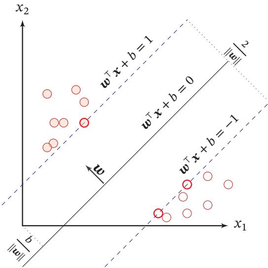  
图3.6 支持向量机示例

## 3.5.1 参数学习

[¶0272] 为了找到最大间隔分割超平面，将公式(3.86)的目标函数写为凸优化问题

[¶0273]
$$
\begin{array} { l } { \underset { w , b } { \operatorname* { m i n } } \quad \quad \frac { 1 } { 2 } \| w \| ^ { 2 } } \\ { \mathrm { s . t . } \quad \quad 1 - y ^ { ( n ) } ( w ^ { \top } x ^ { ( n ) } + b ) \leq 0 , \quad \quad \forall n \in \{ 1 , \cdots , N \} . } \end{array}\tag{3.87}
$$

[¶0274] 使用拉格朗日乘数法，公式(3.87)的拉格朗日函数为

[¶0275] 参见第C.3节．

[¶0276]
$$
\Lambda ( \pmb { w } , b , \lambda ) = \frac { 1 } { 2 } \| \pmb { w } \| ^ { 2 } + \sum _ { n = 1 } ^ { N } \lambda _ { n } \Big ( 1 - y ^ { ( n ) } ( \pmb { w } ^ { \top } \pmb { x } ^ { ( n ) } + b ) \Big ) ,\tag{3.88}
$$

[¶0277] 其中 $\lambda _ { 1 } \ge 0 , \cdots , \lambda _ { N } \ge 0$ 为拉格朗日乘数．计算 $\Lambda ( w , b , \lambda )$ 关于??和??的导数，并令其等于0，得到

[¶0278]
$$
{ \pmb w } = \sum _ { n = 1 } ^ { N } \lambda _ { n } y ^ { ( n ) } { \pmb x } ^ { ( n ) } ,\tag{3.89}
$$

[¶0279]
$$
0 = \sum _ { n = 1 } ^ { N } \lambda _ { n } y ^ { ( n ) } .\tag{3.90}
$$

[¶0280] 将公式(3.89)代入公式(3.88)，并利用公式(3.90)，得到拉格朗日对偶函数

[¶0281]
$$
\Gamma ( \lambda ) = - \frac { 1 } { 2 } \sum _ { n = 1 } ^ { N } \sum _ { m = 1 } ^ { N } \lambda _ { m } \lambda _ { n } y ^ { ( m ) } y ^ { ( n ) } ( { \pmb x } ^ { ( m ) } ) ^ { \top } { \pmb x } ^ { ( n ) } + \sum _ { n = 1 } ^ { N } \lambda _ { n } .\tag{3.91}
$$

[¶0282] 支持向量机的主优化问题为凸优化问题，满足强对偶性，即主优化问题可以通过最大化对偶函数 $\mathrm { m a x } _ { \lambda \ge 0 } \Gamma ( \lambda )$ 来求解．对偶函数Γ(??)是一个凹函数，因此最大化对偶函数是一个凸优化问题，可以通过多种凸优化方法来进行求解，得到拉格朗日乘数的最优值 $\lambda ^ { * }$ ．但由于其约束条件的数量为训练样本数量，一般的优化方法代价比较高，因此在实践中通常采用比较高效的优化方法，比如序列最小优化（Sequential Minimal Optimization，SMO）算法 [Platt, 1998] 等

[¶0283] 根据KKT条件中的互补松弛条件，最优解满足 $\lambda _ { n } ^ { * } \big ( 1 - y ^ { ( n ) } ( { \pmb w } ^ { * } { \mathbf { } } ^ { \top } { \pmb x } ^ { ( n ) } + b ^ { * } ) \big ) =$ 0．如果样本 $\pmb { x } ^ { ( n ) }$ 不在约束边界上， $\lambda _ { n } ^ { * } = 0$ ，其约束失效；如果样本 $\pmb { x } ^ { ( n ) }$ 在约束边界上， $\lambda _ { n } ^ { * } \geq 0$ ．这些在约束边界上的样本点称为支持向量（Support Vector），即离决策平面距离最近的点

[¶0284] 参见公式(C.26)

[¶0285] 在计算出 $\lambda ^ { * }$ 后，根据公式(3.89)计算出最优权重 $\pmb { w } ^ { * }$ ，最优偏置 $b ^ { * }$ 可以通过任选一个支持向量 $( \tilde { x } , \tilde { y } )$ 计算得到：

[¶0286]
$$
b ^ { * } = \tilde { y } - \pmb { w } ^ { * ^ { \intercal } } \tilde { \pmb { x } } .\tag{3.92}
$$

[¶0287] 最优参数的支持向量机的决策函数为

[¶0288]
$$
\begin{array} { r l } { f ( \pmb { x } ) = \mathrm { s g n } ( \pmb { w ^ { * } } ^ { \top } \pmb { x } + b ^ { * } ) } & { } \\ { \quad } & { = \mathrm { s g n } \left( \displaystyle \sum _ { n = 1 } ^ { N } \lambda _ { n } ^ { * } y ^ { ( n ) } ( \pmb { x } ^ { ( n ) } ) ^ { \top } \pmb { x } + b ^ { * } \right) . } \end{array}\tag{3.93}
$$

[¶0289] (3.94)

[¶0290] 支持向量机的决策函数只依赖于 $\lambda _ { n } ^ { * } > 0$ 的样本点，即支持向量

[¶0291] 支持向量机的目标函数可以通过SMO等优化方法得到全局最优解，因此比其他分类器的学习效率更高．此外，支持向量机的决策函数只依赖于支持向量，与训练样本总数无关，分类速度比较快

## 3.5.2 核函数

[¶0292] 支持向量机还有一个重要的优点是可以使用核函数（Kernel Function）隐式地将样本从原始特征空间映射到更高维的空间，并解决原始特征空间中的线性不可分问题．比如在一个变换后的特征空间 $\phi$ 中，支持向量机的决策函数为

[¶0293]
$$
f ( \pmb { x } ) = \mathrm { s g n } ( \pmb { w } ^ { * } ^ { \top } \phi ( \pmb { x } ) + b ^ { * } )\tag{3.95}
$$

[¶0294]
$$
= \operatorname { s g n } \left( \sum _ { n = 1 } ^ { N } \lambda _ { n } ^ { * } y ^ { ( n ) } k ( { \pmb x } ^ { ( n ) } , { \pmb x } ) + b ^ { * } \right) ,\tag{3.96}
$$

[¶0295] 其中 $k ( \pmb { x } , \pmb { z } ) = \phi ( \pmb { x } ) ^ { \top } \phi ( \pmb { z } )$ 为核函数．通常我们不需要显式地给出 $\phi ( { \pmb x } )$ 的具体形式，可以通过核技巧（Kernel Trick）来构造．比如以 $\ b { x } , \ b { z } \in \mathbb { R } ^ { 2 }$ 为例，我们可以构造一个核函数：

[¶0296]
$$
k ( \pmb { x } , \pmb { z } ) = ( 1 + \pmb { x } ^ { \top } \pmb { z } ) ^ { 2 } = \phi ( \pmb { x } ) ^ { \top } \phi ( \pmb { z } ) ,\tag{3.97}
$$

[¶0297] 参见习题3-10

[¶0298] 来隐式地计算 $x , z$ 在特征空间 $\phi$ 中的内积，其中

[¶0299]
$$
\phi ( \pmb { x } ) = [ 1 , \sqrt { 2 } x _ { 1 } , \sqrt { 2 } x _ { 2 } , \sqrt { 2 } x _ { 1 } x _ { 2 } , x _ { 1 } ^ { 2 } , x _ { 2 } ^ { 2 } ] ^ { \top } .\tag{3.98}
$$

## 3.5.3 软间隔

[¶0300] 在支持向量机的优化问题中，约束条件比较严格．如果训练集中的样本在特征空间中不是线性可分的，就无法找到最优解．为了能够容忍部分不满足约束的样本，我们可以引入松弛变量（Slack Variable） $\xi$ ，将优化问题变为

[¶0301]
$$
\operatorname* { m i n } _ { \pmb { w } , b } \qquad \frac { 1 } { 2 } \| \pmb { w } \| ^ { 2 } + C \sum _ { n = 1 } ^ { N } \xi _ { n }\tag{3.99}
$$

[¶0302]
$$
\begin{array} { r l } { \mathrm { s . t . } \quad } & { 1 - y ^ { ( n ) } ( \pmb { w } ^ { \top } \pmb { x } ^ { ( n ) } + b ) - \xi _ { n } \leq 0 , \qquad \forall n \in \{ 1 , \cdots , N \} } \\ & { \xi _ { n } \geq 0 , \qquad \forall n \in \{ 1 , \cdots , N \} } \end{array}
$$

[¶0303] 其中参数 $C > 0$ 用来控制间隔和松弛变量惩罚的平衡．引入松弛变量的间隔称为软间隔（Soft Margin）．公式(3.99)也可以表示为经验风险+正则化项的形式：

[¶0304]
$$
\operatorname* { m i n } _ { w , b } \qquad \sum _ { n = 1 } ^ { N } \operatorname* { m a x } \Big ( 0 , 1 - y ^ { ( n ) } ( { \pmb w } ^ { \top } { \pmb x } ^ { ( n ) } + b ) \Big ) + \frac { 1 } { 2 C } \| { \pmb w } \| ^ { 2 } ,\tag{3.100}
$$

[¶0305] 其中可以把 $\operatorname* { m a x } \Big ( 0 , 1 - y ^ { ( n ) } ( { \pmb w } ^ { \top } { \pmb x } ^ { ( n ) } + b ) \Big )$ 看作损失函数，称为Hinge损失函数（Hinge Loss Function），把 $\frac { 1 } { 2 C } | | \pmb { w } | | ^ { 2 }$ 看作正则化项， $\frac { 1 } { C }$ 是正则化系数

[¶0306] 参见公式(2.20)

[¶0307] 软间隔支持向量机的参数学习和原始支持向量机类似，其最终决策函数也只和支持向量有关，即满足 $1 - y ^ { ( n ) } ( { \pmb w } ^ { \top } { \pmb x } ^ { ( n ) } + b ) - \xi _ { n } = 0$ 的样本

[¶0308] 参见习题3-11

## 3.6 损失函数对比

[¶0309] 本章介绍了三种二分类模型：Logistic回归、感知器和支持向量机．虽然它们的决策函数相同，但由于使用了不同的损失函数以及相应的优化方法，导致它们在实际任务上的表现存在一定的差异

[¶0310] 为了比较这些损失函数，我们统一定义类别标签 $y \in \{ + 1 , - 1 \}$ ，并定义$f ( \pmb { x } ; \pmb { w } ) = \pmb { w } ^ { \top } \pmb { x } + b$ ．这样对于样本 $( x , y )$ ，若 $y f ( { \pmb x } ; { \pmb w } ) > 0$ ，则分类正确；若$y f ( { \pmb x } ; { \pmb w } ) < 0$ ，则分类错误．这样，为了方便比较这些模型，我们可以将它们的损失函数都表述为定义在 $y f ( \pmb { x } ; \pmb { w } )$ 上的函数

[¶0311] Logistic回归的损失函数可以改写为

[¶0312]
$$
\begin{array} { r } { \mathcal { L } _ { L R } = - I ( y = 1 ) \log \sigma \big ( f ( x ; \pmb { w } ) \big ) - I ( y = - 1 ) \log \Big ( 1 - \sigma \big ( f ( x ; \pmb { w } ) \big ) \Big ) } \end{array}\tag{3.101}
$$

[¶0313] ??(⋅)为指示函数

[¶0314]
$$
= - I ( y = 1 ) \log \sigma \big ( f ( x ; w ) \big ) - I ( y = - 1 ) \log \sigma \big ( - f ( x ; w ) \big )\tag{3.102}
$$

[¶0315]
$$
1 - \sigma ( x ) = \sigma ( - x ) .
$$

[¶0316]
$$
= - \log { \sigma } \big ( y f ( { \pmb x } ; { \pmb w } ) \big )\tag{3.103}
$$

[¶0317]
$$
y \in \{ + 1 , - 1 \} .
$$

[¶0318]
$$
{ \bf \omega } = \log \big ( 1 + \exp \big ( - y f ( { \pmb x } ; { \pmb w } ) \big ) \big ) .\tag{3.104}
$$

[¶0319] 感知器的损失函数为

[¶0320]
$$
\begin{array} { r } { \mathcal { L } _ { p } = \operatorname* { m a x } \big ( 0 , - y f ( \pmb { x } ; \pmb { w } ) \big ) . } \end{array}\tag{3.105}
$$

[¶0321] 软间隔支持向量机的损失函数为

[¶0322]
$$
\mathcal { L } _ { h i n g e } = \operatorname* { m a x } \big ( 0 , 1 - y f ( \pmb { x } ; \pmb { w } ) \big ) .\tag{3.106}
$$

[¶0323] https://nndl.github.io/

[¶0324] 平方损失可以重写为

[¶0325]
$$
\mathcal { L } _ { s q u a r e d } = \left( y - f ( \pmb { x } ; \pmb { w } ) \right) ^ { 2 }\tag{3.107}
$$

[¶0326]
$$
{ } = 1 - 2 y f ( x ; { \pmb w } ) + ( y f ( { \pmb x } ; { \pmb w } ) ) ^ { 2 }\tag{3.108}
$$

[¶0327]
$$
y ^ { 2 } = 1 .
$$

[¶0328]
$$
{ \bf \omega } = { \left( 1 - y f ( x ; { \pmb w } ) \right) } ^ { 2 } .\tag{3.109}
$$

[¶0329] 图3.7给出了不同损失函数的对比．对于二分类来说，当 $y f ( { \pmb x } ; { \pmb w } ) > 0$ 时，分类器预测正确，并且 $y f ( \pmb { x } ; \pmb { w } )$ 越大，模型的预测越正确；当 $y f ( { \pmb x } ; { \pmb w } ) < 0$ 时，分类器预测错误，并且 $y f ( \pmb { x } ; \pmb { w } )$ 越小，模型的预测越错误．因此，一个好的损失函数应该随着 $y f ( \pmb { x } ; \pmb { w } )$ 的增大而减少．从图3.7中看出，除了平方损失，其他损失函数都比较适合于二分类问题

[¶0330]
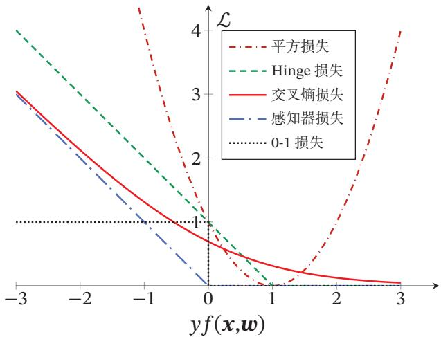  
图3.7 不同损失函数的对比

## 3.7 总结和深入阅读

[¶0331] 和回归问题不同，分类问题中的目标标签??是离散的类别标签，因此分类问题中的决策函数需要输出离散值或是标签的后验概率．线性分类模型一般是一个广义线性函数，即一个或多个线性判别函数加上一个非线性激活函数．所谓“线性”是指决策边界由一个或多个超平面组成

[¶0332] 表3.1给出了几种常见的线性模型的比较．在 Logistic 回归和 Softmax 回归中，??为类别的one-hot向量表示；在感知器和支持向量机中，??为{+1, −1}

[¶0333] 表3.1 几种常见的线性模型对比
<table><tr><td>线性模型</td><td>激活函数</td><td>损失函数</td><td>优化方法</td></tr><tr><td>线性回归</td><td></td><td> $( y - \pmb { w } ^ { \top } \pmb { x } ) ^ { 2 }$ </td><td>最小二乘、梯度下降</td></tr><tr><td>Logistic回归</td><td> $\sigma ( { \pmb w } ^ { \top } { \pmb x } )$ </td><td> $\mathbf { \boldsymbol { y } } \log \sigma ( \mathbf { \boldsymbol { w } } ^ { \top } \mathbf { \boldsymbol { x } } )$ </td><td>梯度下降</td></tr><tr><td>Softmax回归</td><td> $\operatorname { s o f t m a x } ( W ^ { \top } x )$ </td><td> $y \log \operatorname { s o f t m a x } ( W ^ { \intercal } x )$ </td><td>梯度下降</td></tr><tr><td>感知器</td><td> $\operatorname { s g n } ( \pmb { w } ^ { \top } \pmb { x } )$ </td><td> $\operatorname* { m a x } ( 0 , - y \mathbf { { w } } ^ { \top } \mathbf { { x } } )$ </td><td>随机梯度下降</td></tr><tr><td>支持向量机</td><td> $\operatorname { s g n } ( \pmb { w } ^ { \top } \pmb { x } )$ </td><td> $\operatorname* { m a x } ( 0 , 1 - y \pmb { w } ^ { \top } \pmb { x } )$ </td><td>二次规划、SMO等</td></tr></table>

[¶0334] Logistic回归是一种概率模型，其通过使用Logistic函数来将一个实数值映射到[0, 1]之间．事实上，还有很多函数也可以达到此目的，比如正态分布的累积概率密度函数，即 probit 函数．这些知识可以参考《Pattern Recognition andMachine Learning》[Bishop, 2007] 的第 4 章

[¶0335] 感知器作为一种最简单的神经网络，其学习算法也非常直观有效[Rosen-blatt, 1958]．[Freund et al., 1999] 提出了使用核技巧改进感知器学习算法，并用投票感知器来提高泛化能力．[Collins, 2002]将感知器算法扩展到结构化学习，给出了相应的收敛性证明，并且提出一种更加有效并且实用的参数平均化策略

[¶0336] 要深入了解支持向量机以及核方法，可以参考文献《Learning with Kernels: Support Vector Machines, Regularization, Optimization, and Beyond》 [Scholkopf et al., 2001]

## 习题

[¶0337] 习题3-1 证明在两类线性分类中，权重向量??与决策平面正交

[¶0338] 习题3-2 在线性空间中，证明一个点??到平面 $f ( \pmb { x } ; \pmb { w } ) = \pmb { w } ^ { \top } \pmb { x } + b = 0$ 的距离为$\lvert f ( \boldsymbol { x } ; \boldsymbol { w } ) \rvert / \lvert \boldsymbol { w } \rvert \rvert$

[¶0339] 习题3-3 在线性分类中，决策区域是凸的．即若点 $\mathbf { x } _ { 1 }$ 和 $\pmb { x } _ { 2 }$ 被分为类别??，则点$\rho { \pmb x } _ { 1 } + ( 1 - \rho ) { \pmb x } _ { 2 }$ 也会被分为类别??，其中 $\rho \in ( 0 , 1 )$

[¶0340] 习题3-4 给定一个多分类的数据集，证明：1）如果数据集中每个类的样本都和除该类之外的样本是线性可分的，则该数据集一定是线性可分的；2）如果数据集中每两个类的样本是线性可分的，则该数据集不一定是线性可分的

[¶0341] 习题3-5 在Logistic回归中，是否可以用 $\hat { y } = \sigma ( { \pmb w } ^ { \top } { \pmb x } )$ 去逼近正确的标签??，并用平方损失 $( y - \hat { y } ) ^ { 2 }$ 最小化来优化参数 $\pmb { w } \mathrm { ? }$

[¶0342] 习题3-6 在Softmax回归的风险函数（公式(3.39)）中，如果加上正则化项会有什么影响？

[¶0343] 习题3-7 验证平均感知器训练算法3.2中给出的平均权重向量的计算方式和公式(3.77) 等价

[¶0344] 习题3-8 证明定理3.2

[¶0345] 习题3-9 若数据集线性可分，证明支持向量机中将两类样本正确分开的最大间隔分割超平面存在且唯一

[¶0346] 习题 3-10 验证公式 (3.97)

[¶0347] 习题3-11 在软间隔支持向量机中，试给出原始优化问题的对偶问题，并列出其KKT条件

## 参考文献

[¶0348] Bishop C M, 2007. Pattern recognition and machine learning[M]. 5th edition. Springer.

[¶0349] Collins M, 2002. Discriminative training methods for hidden markov models: Theory and experiments with perceptron algorithms[C]//Proceedings of the conference on Empirical methods in natural language processing. 1-8.

[¶0350] Daumé III H, 2012. A course in machine learning[EB/OL]. http://ciml.info/.

[¶0351] Freund Y, Schapire R E, 1999. Large margin classification using the perceptron algorithm[J]. Machine learning, 37(3):277-296.

[¶0352] Novikoff A B, 1963. On convergence proofs for perceptrons[R]. DTIC Document.

[¶0353] Platt J, 1998. Sequential minimal optimization: A fast algorithm for training support vector machines[R]. 21.

[¶0354] Rosenblatt F, 1958. The perceptron: a probabilistic model for information storage and organization in the brain.[J]. Psychological review, 65(6):386.

[¶0355] Scholkopf B, Smola A J, 2001. Learning with kernels: support vector machines, regularization, optimization, and beyond[M]. MIT press.

[¶0356] 第二部分

[¶0357] 基础模型
