## 第4章 前馈神经网络

[¶0001] 神经网络是一种大规模的并行分布式处理器，天然具有存储并使用经验知识的能力．它从两个方面上模拟大脑：（1）网络获取的知识是通过学习来获取的；（2）内部神经元的连接强度，即突触权重，用于储存获取的知识

[¶0002] 西蒙·赫金（Simon Haykin）[Haykin, 1994]

[¶0003] 人工神经网络（Artificial Neural Network，ANN）是指一系列受生物学和神经科学启发的数学模型．这些模型主要是通过对人脑的神经元网络进行抽象，构建人工神经元，并按照一定拓扑结构来建立人工神经元之间的连接，来模拟生物神经网络．在人工智能领域，人工神经网络也常常简称为神经网络（NeuralNetwork，NN）或神经模型（Neural Model）

[¶0004] 神经网络最早是作为一种主要的连接主义模型．20世纪80年代中后期，最流行的一种连接主义模型是分布式并行处理（Parallel Distributed Processing，PDP）模型 [McClelland et al., 1986]，其有 3 个主要特性：1）信息表示是分布式的（非局部的）；2）记忆和知识是存储在单元之间的连接上；3）通过逐渐改变单元之间的连接强度来学习新的知识

[¶0005] 连接主义的神经网络有着多种多样的网络结构以及学习方法，虽然早期模型强调模型的生物学合理性（Biological Plausibility），但后期更关注对某种特定认知能力的模拟，比如物体识别、语言理解等．尤其在引入误差反向传播来改进其学习能力之后，神经网络也越来越多地应用在各种机器学习任务上．随着训练数据的增多以及（并行）计算能力的增强，神经网络在很多机器学习任务上已经取得了很大的突破，特别是在语音、图像等感知信号的处理上，神经网络表现出了卓越的学习能力

[¶0006] 在本章中，我们主要关注采用误差反向传播来进行学习的神经网络，即作为一种机器学习模型的神经网络．从机器学习的角度来看，神经网络一般可以看作一个非线性模型，其基本组成单元为具有非线性激活函数的神经元，通过大量神经元之间的连接，使得神经网络成为一种高度非线性的模型．神经元之间的连接权重就是需要学习的参数，可以在机器学习的框架下通过梯度下降方法来进行学习

[¶0007] 后面我们会介绍一种用来进行记忆存储和检索的神经网络，参见第8.6节

## 4.1 神经元

[¶0008] 人工神经元（Artificial Neuron），简称神经元（Neuron），是构成神经网络的基本单元，其主要是模拟生物神经元的结构和特性，接收一组输入信号并产生输出．

[¶0009] 生物学家在20世纪初就发现了生物神经元的结构．一个生物神经元通常具有多个树突和一条轴突．树突用来接收信息，轴突用来发送信息．当神经元所获得的输入信号的积累超过某个阈值时，它就处于兴奋状态，产生电脉冲．轴突尾端有许多末梢可以给其他神经元的树突产生连接（突触），并将电脉冲信号传递给其他神经元

[¶0010] 1943年，心理学家McCulloch和数学家Pitts根据生物神经元的结构，提出了一种非常简单的神经元模型，MP神经元[McCulloch et al., 1943]．现代神经网络中的神经元和MP神经元的结构并无太多变化．不同的是，MP神经元中的激活函数??为0或1的阶跃函数，而现代神经元中的激活函数通常要求是连续可导的函数．

[¶0011] 假设一个神经元接收??个输入 $x _ { 1 } , x _ { 2 } , \cdots , x _ { D }$ ，令向量 $\pmb { x } = [ x _ { 1 } ; x _ { 2 } ; \cdots ; x _ { D } ]$ 来表示这组输入，并用净输入（Net Input） $z \in$ ℝ表示一个神经元所获得的输入信号??的加权和，

[¶0012]
$$
z = \sum _ { d = 1 } ^ { D } w _ { d } x _ { d } + b\tag{4.1}
$$

[¶0013]
$$
= { \pmb w } ^ { \top } { \pmb x } + b ,\tag{4.2}
$$

[¶0014] 其中 $\pmb { w } = [ w _ { 1 } ; w _ { 2 } ; \cdots ; w _ { D } ] \in \mathbb { R } ^ { D }$ 是??维的权重向量， $b \in \mathbb { R }$ 是偏置

[¶0015] 净输入??在经过一个非线性函数??(⋅)后，得到神经元的活性值（Activation）??，

[¶0016]
$$
a = f ( z ) ,\tag{4.3}
$$

[¶0017] 其中非线性函数 ??(⋅) 称为激活函数（Activation Function）

[¶0018] 图4.1给出了一个典型的神经元结构示例

[¶0019]
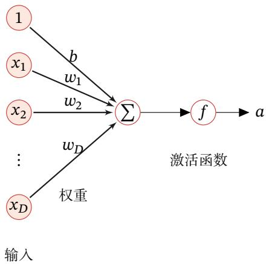  
图4.1 典型的神经元结构

[¶0020] 激活函数 激活函数在神经元中非常重要的．为了增强网络的表示能力和学习能力，激活函数需要具备以下几点性质：

[¶0021] （1） 连续并可导（允许少数点上不可导）的非线性函数．可导的激活函数可以直接利用数值优化的方法来学习网络参数

[¶0022] （2） 激活函数及其导函数要尽可能的简单，有利于提高网络计算效率

[¶0023] （3） 激活函数的导函数的值域要在一个合适的区间内，不能太大也不能太小，否则会影响训练的效率和稳定性

[¶0024] 下面介绍几种在神经网络中常用的激活函数

## 4.1.1 Sigmoid 型函数

[¶0025] Sigmoid 型函数是指一类 S 型曲线函数，为两端饱和函数．常用的 Sigmoid型函数有 Logistic 函数和 Tanh 函数

## 数学小知识 | 饱和

[¶0026] 对于函数??(??)，若 $x \to - \infty$ 时，其导数 $f ^ { \prime } ( x )  0$ ，则称其为左饱和．若 $x \to + \infty$ 时，其导数 $f ^ { \prime } ( x )  0$ ，则称其为右饱和．当同时满足左、右饱和时，就称为两端饱和

[¶0027]

[¶0028] Logistic 函数 Logistic 函数定义为

[¶0029]
$$
\sigma ( x ) = \frac { 1 } { 1 + \exp ( - x ) } .\tag{4.4}
$$

[¶0030] Logistic函数可以看成是一个“挤压”函数，把一个实数域的输入“挤压”到(0, 1)．当输入值在0附近时，Sigmoid型函数近似为线性函数；当输入值靠近两端时，对输入进行抑制．输入越小，越接近于0；输入越大，越接近于1．这样的特点也和生物神经元类似，对一些输入会产生兴奋（输出为1），对另一些输入产生抑制（输出为0）．和感知器使用的阶跃激活函数相比，Logistic函数是连续可导的，其数学性质更好

[¶0031] 因为Logistic函数的性质，使得装备了Logistic激活函数的神经元具有以下两点性质：1）其输出直接可以看作概率分布，使得神经网络可以更好地和统计学习模型进行结合．2）其可以看作一个软性门（Soft Gate），用来控制其他神经元输出信息的数量

[¶0032] Tanh函数 Tanh函数也是一种Sigmoid型函数．其定义为

[¶0033]
$$
\operatorname { t a n h } ( x ) = { \frac { \exp ( x ) - \exp ( - x ) } { \exp ( x ) + \exp ( - x ) } } .\tag{4.5}
$$

[¶0034] Tanh函数可以看作放大并平移的Logistic函数，其值域是(−1, 1)

[¶0035]
$$
\operatorname { t a n h } ( x ) = 2 \sigma ( 2 x ) - 1 .\tag{4.6}
$$

[¶0036] 图4.2给出了 Logistic 函数和 Tanh 函数的形状．Tanh 函数的输出是零中心化的（Zero-Centered），而Logistic函数的输出恒大于0．非零中心化的输出会使得其后一层的神经元的输入发生偏置偏移（Bias Shift），并进一步使得梯度下降的收敛速度变慢

[¶0037]
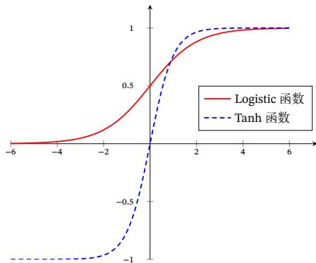  
图 4.2 Logistic 函数和 Tanh 函数

## 4.1.1.1 Hard-Logistic 函数和 Hard-Tanh 函数

[¶0038] Logistic函数和Tanh函数都是Sigmoid型函数，具有饱和性，但是计算开销较大．因为这两个函数都是在中间（0附近）近似线性，两端饱和．因此，这两个函数可以通过分段函数来近似

[¶0039] 参见第7.4节．

[¶0040] 参见习题4-1

[¶0041] 以 Logistic 函数 $\sigma ( x )$ 为例，其导数为 $\sigma ^ { \prime } ( x ) = \sigma ( x ) ( 1 - \sigma ( x ) )$ ．Logistic 函数在 0 附近的一阶泰勒展开（Taylor expansion）为

[¶0042]
$$
\begin{array} { c } { { g _ { l } ( x ) \approx \sigma ( 0 ) + x \times \sigma ^ { \prime } ( 0 ) } } \\ { { { } } } \\ { { = 0 . 2 5 x + 0 . 5 . } } \end{array}\tag{4.7}
$$

[¶0043] (4.8)

[¶0044] 这样 Logistic 函数可以用分段函数 hard-logistic(??) 来近似

[¶0045]
$$
\begin{array} { r l } { \mathrm { h a r d - l o g i s t i c } ( x ) = \left\{ \begin{array} { l l } { 1 } & { g _ { l } ( x ) \geq 1 } \\ { g _ { l } } & { 0 < g _ { l } ( x ) < 1 } \\ { 0 } & { g _ { l } ( x ) \leq 0 } \end{array} \right. } \\ & { = \operatorname* { m a x } \big ( \operatorname* { m i n } ( g _ { l } ( x ) , 1 ) , 0 \big ) } \\ & { = \operatorname* { m a x } \big ( \operatorname* { m i n } ( 0 . 2 5 x + 0 . 5 , 1 ) , 0 \big ) . } \end{array}\tag{4.9}
$$

[¶0046] (4.10)

[¶0047] (4.11)

[¶0048] 同样，Tanh函数在0附近的一阶泰勒展开为

[¶0049]
$$
\begin{array} { c } { { g _ { t } ( x ) \approx \operatorname { t a n h } ( 0 ) + x \times \operatorname { t a n h } ^ { \prime } ( 0 ) } } \\ { { { } } } \\ { { = x , } } \end{array}\tag{4.12}
$$

[¶0050] (4.13)

[¶0051] 这样 Tanh 函数也可以用分段函数 hard-tanh(??) 来近似

[¶0052]
$$
\begin{array} { c } { { \mathrm { h a r d - t a n h } ( x ) = \operatorname* { m a x } \left( \operatorname* { m i n } ( g _ { t } ( x ) , 1 ) , - 1 \right) } } \\ { { = \operatorname* { m a x } \left( \operatorname* { m i n } ( x , 1 ) , - 1 \right) . } } \end{array}\tag{4.14}
$$

[¶0053] (4.15)

[¶0054] 图4.3给出了 Hard-Logistic 函数和 Hard-Tanh 函数的形状

[¶0055]
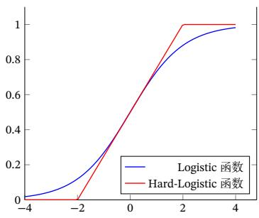  
(a) Hard Logistic 函数

[¶0056]
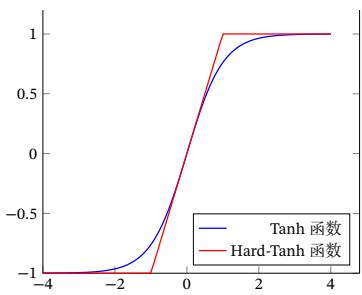  
(b) Hard Tanh 函数

[¶0057] 图 4.3 Hard Sigmoid 型激活函数

## 4.1.2 ReLU 函数

[¶0058] ReLU（Rectified Linear Unit，修正线性单元）[Nair et al., 2010]，也叫Rectifier函数[Glorot et al., 2011]，是目前深度神经网络中经常使用的激活函数ReLU实际上是一个斜坡（ramp）函数，定义为

[¶0059]
$$
\begin{array} { r } { \mathrm { R e L U } ( x ) = \left\{ \begin{array} { l l } { x } & { x \ge 0 } \\ { 0 } & { x < 0 } \end{array} \right. } \\ { = \operatorname* { m a x } ( 0 , x ) . } \end{array}\tag{4.16}
$$

[¶0060] (4.17)

[¶0061] 优点 采用ReLU的神经元只需要进行加、乘和比较的操作，计算上更加高效ReLU 函数也被认为具有生物学合理性（Biological Plausibility），比如单侧抑制、宽兴奋边界（即兴奋程度可以非常高）．在生物神经网络中，同时处于兴奋状态的神经元非常稀疏．人脑中在同一时刻大概只有1% ∼ 4%的神经元处于活跃状态．Sigmoid型激活函数会导致一个非稀疏的神经网络，而ReLU却具有很好的稀疏性，大约50%的神经元会处于激活状态

[¶0062] 在优化方面，相比于Sigmoid型函数的两端饱和，ReLU函数为左饱和函数，且在?? > 0时导数为1，在一定程度上缓解了神经网络的梯度消失问题，加速梯度下降的收敛速度

[¶0063] 参见第4.6.2节

[¶0064] 缺点 ReLU函数的输出是非零中心化的，给后一层的神经网络引入偏置偏移，会影响梯度下降的效率．此外，ReLU神经元在训练时比较容易“死亡”．在训练时，如果参数在一次不恰当的更新后，第一个隐藏层中的某个ReLU神经元在所有的训练数据上都不能被激活，那么这个神经元自身参数的梯度永远都会是0，在以后的训练过程中永远不能被激活．这种现象称为死亡 ReLU 问题（DyingReLU Problem），并且也有可能会发生在其他隐藏层

[¶0065] ReLU神 经 元 指 采 用ReLU作为激活函数的神经元

[¶0066] 参见公式(4.66)参见习题4-3

[¶0067] 在实际使用中，为了避免上述情况，有几种ReLU的变种也会被广泛使用

## 4.1.2.1 带泄露的 ReLU

[¶0068] 带泄露的ReLU（Leaky ReLU）在输入 $x < 0$ 时，保持一个很小的梯度 $\gamma .$ ．这样当神经元非激活时也能有一个非零的梯度可以更新参数，避免永远不能被激活 [Maas et al., 2013]．带泄露的 ReLU 的定义如下：

[¶0069]
$$
\begin{array} { r } { \mathrm { L e a k y R e L U } ( x ) = \left\{ \begin{array} { l l } { x } & { \mathrm { i f } x > 0 } \\ { \gamma x } & { \mathrm { i f } x \leq 0 } \end{array} \right. } \\ { = \operatorname* { m a x } ( 0 , x ) + \gamma \operatorname* { m i n } ( 0 , x ) , } \end{array}\tag{4.18}
$$

[¶0070] (4.19)

[¶0071] 其中 $\gamma$ 是一个很小的常数，比如0.01．当 $\gamma < 1$ 时，带泄露的ReLU也可以写为

[¶0072]
$$
\mathrm { L e a k y R e L U } ( x ) = \operatorname* { m a x } ( x , \gamma x ) ,\tag{4.20}
$$

[¶0073] 相当于是一个比较简单的maxout单元

[¶0074] 参见第4.1.5节

## 4.1.2.2 带参数的 ReLU

[¶0075] 带参数的ReLU（Parametric ReLU，PReLU）引入一个可学习的参数，不同神经元可以有不同的参数[He et al., 2015]．对于第??个神经元，其PReLU的定义为

[¶0076]
$$
\begin{array} { r } { \mathrm { P R e L U } _ { i } ( x ) = \left\{ \begin{array} { l l } { x } & { \mathrm { i f ~ } x > 0 } \\ { } & { } \\ { \gamma _ { i } x } & { \mathrm { i f ~ } x \leq 0 } \end{array} \right. } \\ { = \operatorname* { m a x } ( 0 , x ) + \gamma _ { i } \operatorname* { m i n } ( 0 , x ) , } \end{array}\tag{4.21}
$$

[¶0077] (4.22)

[¶0078] 其中 $\gamma _ { i }$ 为 $x \leq 0$ 时函数的斜率．因此，PReLU是非饱和函数．如果 $\gamma _ { i } = 0$ ，那么PReLU就退化为ReLU．如果 $\gamma _ { i }$ 为一个很小的常数，则PReLU可以看作带泄露的ReLU．PReLU可以允许不同神经元具有不同的参数，也可以一组神经元共享一个参数

## 4.1.2.3 ELU 函数

[¶0079] ELU（Exponential Linear Unit，指数线性单元）[Clevert et al., 2015] 是一个近似的零中心化的非线性函数，其定义为

[¶0080]
$$
\begin{array} { r l } { \mathrm { E L U } ( x ) = \left\{ \begin{array} { l l } { x } & { \mathrm { i f ~ } x > 0 } \\ { \gamma ( \exp ( x ) - 1 ) } & { \mathrm { i f ~ } x \leq 0 } \end{array} \right. } \\ { = \operatorname* { m a x } ( 0 , x ) + \operatorname* { m i n } ( 0 , \gamma ( \exp ( x ) - 1 ) ) , } \end{array}\tag{4.23}
$$

[¶0081] (4.24)

[¶0082] 其中 $\gamma \geq 0$ 是一个超参数，决定 $x \leq 0$ 时的饱和曲线，并调整输出均值在0附近

[¶0083] 参见第7.5.1节

## 4.1.2.4 Softplus 函数

[¶0084] Softplus 函数[Dugas et al., 2001] 可以看作 Rectifier 函数的平滑版本，其定义为

[¶0085]
$$
{ \mathrm { S o f t p l u s } } ( x ) = \log ( 1 + \exp ( x ) ) .\tag{4.25}
$$

[¶0086] Softplus 函数其导数刚好是 Logistic 函数．Softplus 函数虽然也具有单侧抑制、宽兴奋边界的特性，却没有稀疏激活性

[¶0087] 图4.4给出了 ReLU、Leaky ReLU、ELU 以及 Softplus 函数的示例

[¶0088]
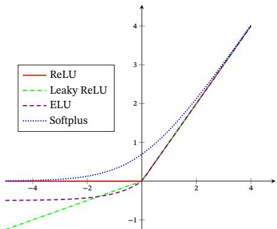  
图 4.4 ReLU、Leaky ReLU、ELU 以及 Softplus 函数

## 4.1.3 Swish 函数

[¶0089] Swish 函数[Ramachandran et al., 2017] 是一种自门控（Self-Gated）激活函数，定义为

[¶0090]
$$
\operatorname { s w i s h } ( x ) = x \sigma ( \beta x ) ,\tag{4.26}
$$

[¶0091] 其中 $\sigma ( \cdot )$ 为 Logistic 函数， $\beta$ 为可学习的参数或一个固定超参数 $\sigma ( \cdot ) \in ( 0 , 1 )$ 可以看作一种软性的门控机制．当 $\sigma ( \beta x )$ 接近于1时，门处于“开”状态，激活函数的输出近似于??本身；当 $\sigma ( \beta x )$ 接近于0时，门的状态为“关”，激活函数的输出近似于0

[¶0092] 图4.5给出了Swish函数的示例

[¶0093]
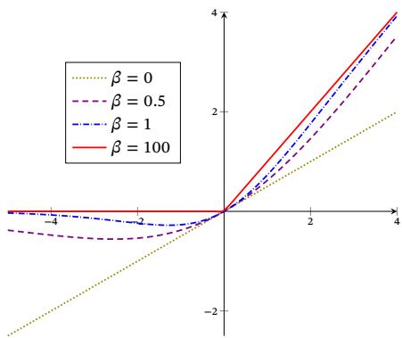  
图 4.5 Swish 函数

[¶0094] 当 $\beta = 0$ 时，Swish函数变成线性函数 $x / 2 .$ ．当 $\beta = 1$ 时，Swish函数在 $x > 0$ 时近似线性，在 $x < 0$ 时近似饱和，同时具有一定的非单调性．当 $\beta \to + \infty$ 时，$\sigma ( \beta x )$ 趋向于离散的0-1函数，Swish函数近似为ReLU函数．因此，Swish函数可https://nndl.github.io/

[¶0095] 以看作线性函数和ReLU函数之间的非线性插值函数，其程度由参数 $\beta$ 控制

## 4.1.4 GELU函数

[¶0096] GELU（Gaussian Error Linear Unit，高斯误差线性单元）[Hendrycks et al.,2016]也是一种通过门控机制来调整其输出值的激活函数，和Swish函数比较类似．

[¶0097]
$$
\mathrm { G E L U } ( x ) = x P ( X \leq x ) ,\tag{4.27}
$$

[¶0098] 其中 $P ( X \leq x )$ 是高斯分布 ${ \mathcal { N } } ( \mu , \sigma ^ { 2 } )$ 的累积分布函数，其中 $\mu , \sigma$ 为超参数，一般设$\mu = 0 , \sigma = 1$ 即可．由于高斯分布的累积分布函数为S型函数，因此GELU函数可以用Tanh函数或Logistic函数来近似，

[¶0099]
$$
\operatorname { G E L U } ( x ) \approx 0 . 5 x { \Big ( } 1 + \operatorname { t a n h } { \big ( } { \sqrt { \frac { 2 } { \pi } } } ( x + 0 . 0 4 4 7 1 5 x ^ { 3 } ) { \big ) } { \Big ) } ,\tag{4.28}
$$

[¶0100]
$$
\begin{array} { r } { \sharp \widehat { \chi } \qquad \mathrm { G E L U } ( x ) \approx x \sigma ( 1 . 7 0 2 x ) . } \end{array}\tag{4.29}
$$

[¶0101] 当使用Logistic函数来近似时，GELU相当于一种特殊的Swish函数

## 4.1.5 Maxout 单元

[¶0102] Maxout 单元[Goodfellow et al., 2013] 也是一种分段线性函数．Sigmoid 型函数、ReLU等激活函数的输入是神经元的净输入??，是一个标量．而Maxout单元的输入是上一层神经元的全部原始输出，是一个向量 $\pmb { x } = [ x _ { 1 } ; x _ { 2 } ; \cdots ; x _ { D } ]$

[¶0103] 这里??为列向量，其元素按分号隔开

[¶0104] 每个Maxout单元有??个权重向量 ${ \pmb w } _ { k } \in \mathbb { R } ^ { D }$ 和偏置 $b _ { k } \left( 1 \leq k \leq K \right)$ ．对于输入??，可以得到??个净输入 $z _ { k } , 1 \le k \le K$

[¶0105]
$$
z _ { k } = \pmb { w } _ { k } ^ { \top } \pmb { x } + b _ { k } ,\tag{4.30}
$$

[¶0106] 其中 $\pmb { w } _ { k } = [ w _ { k , 1 } , \cdots , w _ { k , D } ] ^ { \top }$ 为第??个权重向量

[¶0107] Maxout单元的非线性函数定义为

[¶0108]
$$
\operatorname* { m a x o u t } ( { \pmb x } ) = \operatorname* { m a x } _ { k \in [ 1 , K ] } ( z _ { k } ) .\tag{4.31}
$$

[¶0109] Maxout单元不单是净输入到输出之间的非线性映射，而是整体学习输入到输出之间的非线性映射关系．Maxout激活函数可以看作任意凸函数的分段线性近似，并且在有限的点上是不可微的

[¶0110] 采用Maxout单元的神经网络也叫作Maxout网络

## 4.2 网络结构

[¶0111] 一个生物神经细胞的功能比较简单，而人工神经元只是生物神经细胞的理想化和简单实现，功能更加简单．要想模拟人脑的能力，单一的神经元是远远不够的，需要通过很多神经元一起协作来完成复杂的功能．这样通过一定的连接方式或信息传递方式进行协作的神经元可以看作一个网络，就是神经网络

[¶0112] 到目前为止，研究者已经发明了各种各样的神经网络结构．目前常用的神经网络结构有以下三种：

[¶0113] 虽然这里将神经网络结构大体上分为三种类型，但是大多数网络都是复合型结构，即一个神经网络中包括多种网络结构

## 4.2.1 前馈网络

[¶0114] 前馈网络中各个神经元按接收信息的先后分为不同的组．每一组可以看作一个神经层．每一层中的神经元接收前一层神经元的输出，并输出到下一层神经元．整个网络中的信息是朝一个方向传播，没有反向的信息传播，可以用一个有向无环路图表示．前馈网络包括全连接前馈网络（本章中的第4.3节）和卷积神经网络（第5章）等

[¶0115] 前馈网络可以看作一个函数，通过简单非线性函数的多次复合，实现输入空间到输出空间的复杂映射．这种网络结构简单，易于实现

## 4.2.2 记忆网络

[¶0116] 记忆网络，也称为反馈网络，网络中的神经元不但可以接收其他神经元的信息，也可以接收自己的历史信息．和前馈网络相比，记忆网络中的神经元具有记忆功能，在不同的时刻具有不同的状态．记忆神经网络中的信息传播可以是单向或双向传递，因此可用一个有向循环图或无向图来表示．记忆网络包括循环神经网络（第6章）、Hopfield网络（第8.6.1节）、玻尔兹曼机（第12.1节）、受限玻尔兹曼机（第12.2节）等

[¶0117] 记忆网络可以看作一个程序，具有更强的计算和记忆能力

[¶0118] 为了增强记忆网络的记忆容量，可以引入外部记忆单元和读写机制，用来保存一些网络的中间状态，称为记忆增强神经网络（Memory Augmented NeuralNetwork，MANN）（第8.5节），比如神经图灵机 [Graves et al., 2014] 和记忆网络 [Sukhbaatar et al., 2015] 等

## 4.2.3 图网络

[¶0119] 前馈网络和记忆网络的输入都可以表示为向量或向量序列．但实际应用中很多数据是图结构的数据，比如知识图谱、社交网络、分子（Molecular）网络等https://nndl.github.io/

[¶0120] 前馈网络和记忆网络很难处理图结构的数据

[¶0121] 图网络是定义在图结构数据上的神经网络（第6.8节）．图中每个节点都由一个或一组神经元构成．节点之间的连接可以是有向的，也可以是无向的．每个节点可以收到来自相邻节点或自身的信息

[¶0122] 图网络是前馈网络和记忆网络的泛化，包含很多不同的实现方式，比如图卷积网络（Graph Convolutional Network，GCN）[Kipf et al., 2016]、图注意力网络（Graph Attention Network，GAT）[Veličković et al., 2017]、消息传递神经网络（Message Passing Neural Network，MPNN）[Gilmer et al., 2017] 等

[¶0123] 图4.6给出了前馈网络、记忆网络和图网络的网络结构示例，其中圆形节点表示一个神经元，方形节点表示一组神经元

[¶0124]
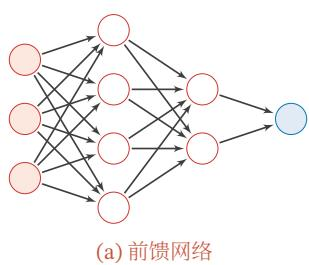

[¶0125]
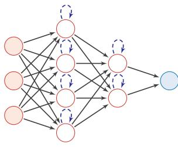  
(b)记忆网络

[¶0126]
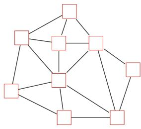  
图4.6 三种不同的网络结构示例  
(c) 图网络

## 4.3 前馈神经网络

[¶0127] 给定一组神经元，我们可以将神经元作为节点来构建一个网络．不同的神经网络模型有着不同网络连接的拓扑结构．一种比较直接的拓扑结构是前馈网络．前馈神经网络（Feedforward Neural Network，FNN）是最早发明的简单人工神经网络．前馈神经网络也经常称为多层感知器（Multi-Layer Perceptron，MLP）．但多层感知器的叫法并不是十分合理，因为前馈神经网络其实是由多层的Logistic回归模型（连续的非线性函数）组成，而不是由多层的感知器（不连续的非线性函数）组成 [Bishop, 2007]

[¶0128] 在前馈神经网络中，各神经元分别属于不同的层．每一层的神经元可以接收前一层神经元的信号，并产生信号输出到下一层．第0层称为输入层，最后一层称为输出层，其他中间层称为隐藏层．整个网络中无反馈，信号从输入层向输出层单向传播，可用一个有向无环图表示

[¶0129] 图4.7给出了前馈神经网络的示例

[¶0130]
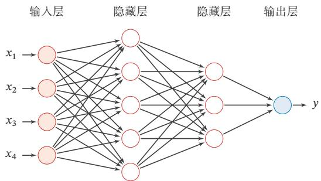  
图4.7 多层前馈神经网络

[¶0131] 表4.1给出了描述前馈神经网络的记号  
表4.1 前馈神经网络的记号
<table><tr><td>记号</td><td>含义</td></tr><tr><td> $L$ </td><td>神经网络的层数</td></tr><tr><td> $M _ { l }$ </td><td>第l层神经元的个数</td></tr><tr><td> $f _ { l } ( \cdot )$ </td><td>第1层神经元的激活函数</td></tr><tr><td> ${ \pmb W } ^ { ( l ) } \in \mathbb { R } ^ { M _ { l } \times M _ { l - 1 } }$ </td><td>第l－1层到第l层的权重矩阵</td></tr><tr><td> $\pmb { b } ^ { ( l ) } \in \mathbb { R } ^ { M _ { l } }$ </td><td>第l-1层到第l层的偏置</td></tr><tr><td> $z ^ { ( l ) } \in \mathbb { R } ^ { M _ { l } }$ </td><td>第l层神经元的净输入（净活性值）</td></tr><tr><td> $\pmb { a } ^ { ( l ) } \in \mathbb { R } ^ { M _ { l } }$ </td><td>第l层神经元的输出（活性值）</td></tr></table>

[¶0132] 层数??一般只考虑隐藏层和输出层

[¶0133] 令 ${ \pmb a } ^ { ( 0 ) } = { \pmb x }$ ，前馈神经网络通过不断迭代下面公式进行信息传播：

[¶0134]
$$
\pmb { z } ^ { ( l ) } = \pmb { W } ^ { ( l ) } \pmb { a } ^ { ( l - 1 ) } + \pmb { b } ^ { ( l ) } ,\tag{4.32}
$$

[¶0135]
$$
\begin{array} { r } { \pmb { a } ^ { ( l ) } = f _ { l } ( \pmb { z } ^ { ( l ) } ) . } \end{array}\tag{4.33}
$$

[¶0136] 首先根据第??−1层神经元的活性值（Activation） $\pmb { a } ^ { ( l - 1 ) }$ 计算出第??层神经元的净活性值（Net Activation） $\boldsymbol { z } ^ { ( l ) }$ ，然后经过一个激活函数得到第??层神经元的活性值．因此，我们也可以把每个神经层看作一个仿射变换（Affine Transformation）和一个非线性变换

[¶0137] 仿 射 变 换 参 见第A.2.2节

[¶0138] 公式(4.32)和公式(4.33)也可以合并写为：

[¶0139]
$$
\pmb { z } ^ { ( l ) } = \pmb { W } ^ { ( l ) } f _ { l - 1 } ( \pmb { z } ^ { ( l - 1 ) } ) + \pmb { b } ^ { ( l ) } ,\tag{4.34}
$$

[¶0140] 或者

[¶0141]
$$
\begin{array} { r } { \pmb { a } ^ { ( l ) } = f _ { l } ( \pmb { W } ^ { ( l ) } \pmb { a } ^ { ( l - 1 ) } + \pmb { b } ^ { ( l ) } ) . } \end{array}
$$

[¶0142] https://nndl.github.io/

[¶0143] (4.35)

[¶0144] 这样，前馈神经网络可以通过逐层的信息传递，得到网络最后的输出 $\pmb { a } ^ { ( L ) }$ 整个网络可以看作一个复合函数 $\phi ( { \pmb x } ; { \pmb W } , { \pmb b } )$ ，将向量??作为第1层的输入 $\mathbf { \pmb { a } } ^ { ( 0 ) }$ ，将第??层的输出 $\pmb { a } ^ { ( L ) }$ 作为整个函数的输出

[¶0145]
$$
\begin{array} { r } { \pmb { x } = \pmb { a } ^ { ( 0 ) }  \pmb { z } ^ { ( 1 ) }  \pmb { a } ^ { ( 1 ) }  \pmb { z } ^ { ( 2 ) }  \cdots  \pmb { a } ^ { ( L - 1 ) }  \pmb { z } ^ { ( L ) }  \pmb { a } ^ { ( L ) } = \phi ( x ; \pmb { W } , \pmb { b } ) , } \end{array}\tag{4.36}
$$

[¶0146] 其中??, ??表示网络中所有层的连接权重和偏置

## 4.3.1 通用近似定理

[¶0147] 前馈神经网络具有很强的拟合能力，常见的连续非线性函数都可以用前馈神经网络来近似

[¶0148] 定理 4.1 – 通用近似定理（Universal Approximation Theorem） $[ \mathbf { C y - }$ benko, 1989; Hornik et al., 1989]： 令 $\phi ( \cdot )$ 是一个非常数、有界、单调递增的连续函数， $\mathcal { I } _ { D }$ 是一个??维的单位超立方体 $[ 0 , 1 ] ^ { D } , C ( \mathcal { I } _ { D } )$ 是定义在 $\mathcal { I } _ { D }$ 上的连续函数集合．对于任意给定的一个函数 $f \in C ( \mathcal { I } _ { D } )$ ，存在一个整数??，和一组实数 $v _ { m } , b _ { m } \in$ ℝ以及实数向量 ${ \pmb w } _ { m } \in \mathbb { R } ^ { D } , m = 1 , \cdots , M$ ，以至于我们可以定义函数

[¶0149]
$$
F ( \pmb { x } ) = \sum _ { m = 1 } ^ { M } v _ { m } \phi ( \pmb { w } _ { m } ^ { \top } \pmb { x } + b _ { m } ) ,\tag{4.37}
$$

[¶0150] 作为函数??的近似实现，即

[¶0151]
$$
| F ( { \pmb x } ) - f ( { \pmb x } ) | < \epsilon , \forall { \pmb x } \in \mathcal { I } _ { D } ,\tag{4.38}
$$

[¶0152] 其中 $\epsilon > 0$ 是一个很小的正数

[¶0153] 通用近似定理在实数空间 $\mathbb { R } ^ { D }$ 中的有界闭集上依然成立

[¶0154] 根据通用近似定理，对于具有线性输出层和至少一个使用“挤压”性质的激活函数的隐藏层组成的前馈神经网络，只要其隐藏层神经元的数量足够，它可以以任意的精度来近似任何一个定义在实数空间 $\mathbb { R } ^ { D }$ 中的有界闭集函数[Funa-hashi et al., 1993; Hornik et al., 1989]．所谓“挤压”性质的函数是指像 Sigmoid函数的有界函数，但神经网络的通用近似性质也被证明对于其他类型的激活函数，比如ReLU，也都是适用的

[¶0155] 定义在实数空间ℝ?? 中的有界闭集上的任意连续函数，也称为Borel可测函数

[¶0156] 参见习题4-6

[¶0157] 通用近似定理只是说明了神经网络的计算能力可以去近似一个给定的连续函数，但并没有给出如何找到这样一个网络，以及是否是最优的．此外，当应用到https://nndl.github.io/

[¶0158] 机器学习时，真实的映射函数并不知道，一般是通过经验风险最小化和正则化来进行参数学习．因为神经网络的强大能力，反而容易在训练集上过拟合

## 4.3.2 应用到机器学习

[¶0159] 根据通用近似定理，神经网络在某种程度上可以作为一个“万能”函数来使用，可以用来进行复杂的特征转换，或逼近一个复杂的条件分布

[¶0160] 在机器学习中，输入样本的特征对分类器的影响很大．以监督学习为例，好的特征可以极大提高分类器的性能．因此，要取得好的分类效果，需要将样本的原始特征向量??转换到更有效的特征向量 $\phi ( { \pmb x } )$ ，这个过程叫作特征抽取

[¶0161] 参见第2.6.1.2节

[¶0162] 多层前馈神经网络可以看作一个非线性复合函数 $\phi$ ∶ ℝ ${ \bf \Lambda } ^ { D }  \mathbb { R } ^ { D ^ { \prime } }$ ，将输入$\boldsymbol { x } \in \mathbb { R } ^ { D }$ 映射到输出 $\phi ( \pmb { x } ) \in \mathbb { R } ^ { D ^ { \prime } }$ ．因此，多层前馈神经网络也可以看成是一种特征转换方法，其输出 $\phi ( { \pmb x } )$ 作为分类器的输入进行分类

[¶0163] 给定一个训练样本 $( x , y )$ ，先利用多层前馈神经网络将??映射到 $\phi ( { \pmb x } )$ ，然后再将 $\phi ( { \pmb x } )$ 输入到分类器 $g ( \cdot )$ ，即

[¶0164]
$$
\hat { y } = g ( \phi ( \pmb { x } ) ; \theta ) ,\tag{4.39}
$$

[¶0165] 其中 $g ( \cdot )$ 为线性或非线性的分类器，??为分类器 $g ( \cdot )$ 的参数， $\hat { , y }$ 为分类器的输出

[¶0166] 特别地，如果分类器 $g ( \cdot )$ 为Logistic回归分类器或Softmax回归分类器，那么 $g ( \cdot )$ 也可以看成是网络的最后一层，即神经网络直接输出不同类别的条件概率 $p ( y | \pmb { x } )$ ：

[¶0167] 对于二分类问题 $y \in \{ 0 , 1 \}$ ，并采用 Logistic 回归，那么 Logistic 回归分类器可以看成神经网络的最后一层．也就是说，网络的最后一层只用一个神经元，并且其激活函数为Logistic函数．网络的输出可以直接作为类别 $y = 1$ 的条件概率，

[¶0168] 反 之，Logistic 回 归 或Softmax回 归 也 可 以看作只有一层的神经网络  
Logistic 回 归 参 见  
第3.2节

[¶0169]
$$
p ( y = 1 | \pmb { x } ) = a ^ { ( L ) } ,\tag{4.40}
$$

[¶0170] 其中 $a ^ { ( L ) } \in \mathbb { R }$ 为第??层神经元的活性值

[¶0171] 对于多分类问题 $y \in \{ 1 , \cdots , C \}$ ，如果使用Softmax回归分类器，相当于网络最后一层设置??个神经元，其激活函数为Softmax函数．网络最后一层（第??层）的输出可以作为每个类的条件概率，即

[¶0172]
$$
\hat { \pmb { y } } = \mathrm { s o f t m a x } ( \pmb { z } ^ { ( L ) } ) ,\tag{4.41}
$$

[¶0173] 其中 $z ^ { ( L ) } \in \mathbb { R } ^ { C }$ 为第??层神经元的净输入； $\hat { \pmb { y } } \in \mathbb { R } ^ { C }$ 为第??层神经元的活性值，每一维分别表示不同类别标签的预测条件概率

## 4.3.3 参数学习

[¶0174] 如果采用交叉熵损失函数，对于样本 $( x , y )$ ，其损失函数为

[¶0175]
$$
\mathcal { L } ( \mathbf { y } , \hat { \mathbf { y } } ) = - \mathbf { y } ^ { \intercal } \log \hat { \mathbf { y } } ,\tag{4.42}
$$

[¶0176] 其中 $y \in \{ 0 , 1 \} ^ { C }$ 为标签??对应的one-hot向量表示

[¶0177] 给定训练集为 $\mathcal { D } = \{ ( \boldsymbol { x } ^ { ( n ) } , y ^ { ( n ) } ) \} _ { n = 1 } ^ { N }$ ，将每个样本 $\pmb { x } ^ { ( n ) }$ 输入给前馈神经网络，得到网络输出为 $\hat { \mathbf { y } } ^ { ( n ) }$ ，其在数据集??上的结构化风险函数为

[¶0178]
$$
\mathcal { R } ( W , b ) = \frac { 1 } { N } \sum _ { n = 1 } ^ { N } \mathcal { L } ( \boldsymbol { y } ^ { ( n ) } , \hat { \boldsymbol { y } } ^ { ( n ) } ) + \frac { 1 } { 2 } \lambda \| \boldsymbol { W } \| _ { F } ^ { 2 } ,\tag{4.43}
$$

[¶0179] 其中 $\mathbf { \Delta } _ { W }$ 和 $\pmb { b }$ 分别表示网络中所有的权重矩阵和偏置向量； $\| \mathbf { W } \| _ { F } ^ { 2 }$ 是正则化项，用来防止过拟合； $\lambda > 0$ 为超参数．??越大， $\mathbf { \Delta } _ { W }$ 越接近于0．这里的 $\lVert \mathbf { \boldsymbol { W } } \rVert$ ‖2 一般使用Frobenius 范数：

[¶0180] 注意这里的正则化项只包含权重参数??，而不包含偏置??

[¶0181]
$$
| | W | | _ { F } ^ { 2 } = \sum _ { l = 1 } ^ { L } \sum _ { i = 1 } ^ { M _ { l } } \sum _ { j = 1 } ^ { M _ { l - 1 } } ( w _ { i j } ^ { ( l ) } ) ^ { 2 } .\tag{4.44}
$$

[¶0182] 有了学习准则和训练样本，网络参数可以通过梯度下降法来进行学习．在梯度下降方法的每次迭代中，第??层的参数 $\mathbf { \delta } _ { W } ( l )$ 和 $\mathbf { \delta } _ { \mathbf { \pmb { b } } } ( l )$ 参数更新方式为

[¶0183]
$$
\boldsymbol { W } ^ { ( l ) } \gets \boldsymbol { W } ^ { ( l ) } - \alpha \frac { \partial \mathcal { R } ( \boldsymbol { W } , \boldsymbol { b } ) } { \partial \boldsymbol { W } ^ { ( l ) } }\tag{4.45}
$$

[¶0184]
$$
= W ^ { ( l ) } - \alpha \left( \frac { 1 } { N } \sum _ { n = 1 } ^ { N } ( \frac { \partial \mathcal { L } ( y ^ { ( n ) } , \hat { y } ^ { ( n ) } ) } { \partial W ^ { ( l ) } } ) + \lambda W ^ { ( l ) } \right) ,\tag{4.46}
$$

[¶0185]
$$
\pmb { b } ^ { ( l ) } \gets \pmb { b } ^ { ( l ) } - \alpha \frac { \partial \mathcal { R } ( \pmb { W } , \pmb { b } ) } { \partial \pmb { b } ^ { ( l ) } }\tag{4.47}
$$

[¶0186]
$$
= \boldsymbol { b } ^ { ( l ) } - \alpha \left( \frac { 1 } { N } \sum _ { n = 1 } ^ { N } \frac { \partial \mathcal { L } ( \boldsymbol { y } ^ { ( n ) } , \hat { \boldsymbol { y } } ^ { ( n ) } ) } { \partial \boldsymbol { b } ^ { ( l ) } } \right) ,\tag{4.48}
$$

[¶0187] 其中 $\alpha$ 为学习率

[¶0188] 梯度下降法需要计算损失函数对参数的偏导数，如果通过链式法则逐一对每个参数进行求偏导比较低效．在神经网络的训练中经常使用反向传播算法来高效地计算梯度

## 反向传播算法

[¶0189] 假设采用随机梯度下降进行神经网络参数学习，给定一个样本 $( { \pmb x } , { \pmb y } )$ ，将其输入到神经网络模型中，得到网络输出为 ${ \hat { \mathbf { y } } } .$ ．假设损失函数为 $\mathcal { L } ( y , \hat { y } )$ ，要进行参数学习就需要计算损失函数关于每个参数的导数

[¶0190] 不失一般性，对第??层中的参数 $\mathbf { \mathbf { \mathbf { W } } } ^ { ( l ) }$ 和 $\mathbf { \delta } _ { \mathbf { \pmb { b } } } ( l )$ 计算偏导数．因为 $\frac { \partial \mathcal { L } ( y , \hat { y } ) } { \partial W ^ { ( l ) } }$ 的计算涉及向量对矩阵的微分，十分繁琐，因此我们先计算 $\mathcal { L } ( y , \hat { y } )$ 关于参数矩阵中每个元素的偏导数 $\frac { \partial \mathcal { L } ( y , \hat { y } ) } { \partial w _ { i j } ^ { ( l ) } }$ ．根据链式法则，

[¶0191] 这里使用向量或矩阵来表示多变量函数的偏导数，并使用分母布局表示，参见第B.3节参见公式(B.18)

[¶0192]
$$
\frac { \partial \mathcal { L } ( \mathbf { y } , \hat { \mathbf { y } } ) } { \partial w _ { i j } ^ { ( l ) } } = \frac { \partial z ^ { ( l ) } } { \partial w _ { i j } ^ { ( l ) } } \frac { \partial \mathcal { L } ( \mathbf { y } , \hat { \mathbf { y } } ) } { \partial z ^ { ( l ) } } ,\tag{4.49}
$$

[¶0193]
$$
\frac { \partial \mathcal { L } ( \mathbf { y } , \hat { \mathbf { y } } ) } { \partial \pmb { b } ^ { ( l ) } } = \frac { \partial \pmb { z } ^ { ( l ) } } { \partial \pmb { b } ^ { ( l ) } } \frac { \partial \mathcal { L } ( \mathbf { y } , \hat { \mathbf { y } } ) } { \partial \pmb { z } ^ { ( l ) } } .\tag{4.50}
$$

[¶0194] 公式(4.49)和公式(4.50)中的第二项都是目标函数关于第??层的神经元 $\boldsymbol { z } ^ { ( l ) }$ 的偏导数，称为误差项，可以一次计算得到．这样我们只需要计算三个偏导数，分别为 $\frac { \partial \pmb { z } ^ { ( l ) } } { \partial w _ { i j } ^ { ( l ) } } , \frac { \partial \pmb { z } ^ { ( l ) } } { \partial \pmb { b } ^ { ( l ) } }$ 和 $\frac { \partial \mathcal { L } ( \mathbf { y } , \hat { \mathbf { y } } ) } { \partial \pmb { z } ^ { ( l ) } }$

[¶0195] 下面分别来计算这三个偏导数

[¶0196] （1）计算偏导数 $\frac { \partial { z } ^ { ( l ) } } { \partial w _ { i j } ^ { ( l ) } }$ 因 $\pmb { z } ^ { ( l ) } = \pmb { W } ^ { ( l ) } \pmb { a } ^ { ( l - 1 ) } + \pmb { b } ^ { ( l ) }$ ，偏导数

[¶0197]
$$
\frac { \partial \pmb { z } ^ { ( l ) } } { \partial w _ { i j } ^ { ( l ) } } = \left[ \frac { \partial z _ { 1 } ^ { ( l ) } } { \partial w _ { i j } ^ { ( l ) } } , \cdots , \frac { \partial z _ { i } ^ { ( l ) } } { \partial w _ { i j } ^ { ( l ) } } , \cdots , \frac { \partial z _ { M _ { l } } ^ { ( l ) } } { \partial w _ { i j } ^ { ( l ) } } \right]
$$

[¶0198] 这 里 的 矩 阵 微 分 采用分 母 布 局，即 一 个列向量关于标量的偏导数为行向量，参见第B.3节

[¶0199] (4.51)

[¶0200]
$$
\mathbf { \tau } = \Bigg [ 0 , \cdots , \frac { \partial ( \mathbf { w } _ { i \colon } ^ { ( l ) } \pmb { a } ^ { ( l - 1 ) } + b _ { i } ^ { ( l ) } ) } { \partial \ b { w } _ { i j } ^ { ( l ) } } , \cdots , 0 \Bigg ]\tag{4.52}
$$

[¶0201]
$$
\mathbf { \Phi } = \left[ 0 , \cdots , a _ { j } ^ { ( l - 1 ) } , \cdots , 0 \right]\tag{4.53}
$$

[¶0202]
$$
\begin{array} { r l } { \triangleq \mathbb { I } _ { i } ( a _ { j } ^ { ( l - 1 ) } ) } & { { } \in \mathbb { R } ^ { 1 \times M _ { l } } , } \end{array}\tag{4.54}
$$

[¶0203] 其中 $\pmb { w } _ { i : } ^ { ( l ) }$ 为权重矩阵 $\mathbf { \Delta } _ { \mathbf { } W } ( l )$ 的第??行， $\mathbb { I } _ { i } ( a _ { j } ^ { ( l - 1 ) } )$ 表示第??个元素为 $a _ { j } ^ { ( l - 1 ) }$ ，其余为0的行向量

[¶0204] （2）计算偏导数 $\frac { \partial z ^ { ( l ) } } { \partial b ^ { ( l ) } }$ 因为 $\boldsymbol { z } ^ { ( l ) }$ 和 $\mathbf { \delta } _ { \mathbf { \pmb { b } } } ( l )$ 的函数关系为 $\pmb { z } ^ { ( l ) } = \pmb { W } ^ { ( l ) } \pmb { a } ^ { ( l - 1 ) } +$ $\mathbf { \delta } _ { \mathbf { \pmb { b } } } ( l )$ ，因此偏导数

[¶0205]
$$
\frac { \partial \pmb { z } ^ { ( l ) } } { \partial \pmb { b } ^ { ( l ) } } = \pmb { I } _ { M _ { l } } \quad \in \mathbb { R } ^ { M _ { l } \times M _ { l } } ,\tag{4.55}
$$

[¶0206] 为 $M _ { l } \times M _ { l }$ 的单位矩阵

[¶0207] （3）计算偏导数 $\frac { \partial \mathcal { L } ( y , \hat { y } ) } { \partial z ^ { ( l ) } }$ 偏导数 $\frac { \partial \mathcal { L } ( \mathbf { y } , \hat { \mathbf { y } } ) } { \partial \pmb { z } ^ { ( l ) } }$ 表示第??层神经元对最终损失的影响，也反映了最终损失对第??层神经元的敏感程度，因此一般称为第??层神经元的误差项，用 $\delta ^ { ( l ) }$ 来表示

[¶0208]
$$
\begin{array} { r l } { \delta ^ { ( l ) } \triangleq \frac { \partial \mathcal { L } ( \mathbf { y } , \hat { \mathbf { y } } ) } { \partial \pmb { z } ^ { ( l ) } } } & { { } \in \mathbb { R } ^ { M _ { l } } . } \end{array}\tag{4.56}
$$

[¶0209] https://nndl.github.io/

[¶0210] 误差项 $\delta ^ { ( l ) }$ 也间接反映了不同神经元对网络能力的贡献程度，从而比较好地解决了贡献度分配问题（Credit Assignment Problem，CAP）

[¶0211] 根据 $\pmb { z } ^ { ( l + 1 ) } = \pmb { W } ^ { ( l + 1 ) } \pmb { a } ^ { ( l ) } + \pmb { b } ^ { ( l + 1 ) }$ ，有

[¶0212]
$$
\frac { \partial \pmb { z } ^ { ( l + 1 ) } } { \partial \pmb { a } ^ { ( l ) } } = ( \pmb { W } ^ { ( l + 1 ) } ) ^ { \top } \quad \in \mathbb { R } ^ { M _ { l } \times M _ { l + 1 } } .\tag{4.57}
$$

[¶0213] 根据 ${ \pmb a } ^ { ( l ) } = f _ { l } ( { \pmb z } ^ { ( l ) } )$ ，其中??(⋅)为按位计算的函数，因此有

[¶0214]
$$
\begin{array} { r l } { \displaystyle \frac { \partial \pmb { a } ^ { ( l ) } } { \partial \pmb { z } ^ { ( l ) } } = \frac { \partial f _ { l } ( \pmb { z } ^ { ( l ) } ) } { \partial \pmb { z } ^ { ( l ) } } } & { } \\ { = \mathrm { d i a g } ( f _ { l } ^ { \prime } ( \pmb { z } ^ { ( l ) } ) ) } & { \in \mathbb { R } ^ { M _ { l } \times M _ { l } } . } \end{array}\tag{4.58}
$$

[¶0215] (4.59)

[¶0216] 因此，根据链式法则，第??层的误差项为

[¶0217]
$$
\delta ^ { ( l ) } \triangleq \frac { \partial \mathcal { L } (  { \mathbf { y } } , \hat {  { \mathbf { y } } } ) } { \partial  { \mathbf { z } } ^ { ( l ) } }\tag{4.60}
$$

[¶0218]
$$
\mathbf { \Sigma } = \left( \frac { \partial \mathbf { a } ^ { ( l ) } } { \partial \mathbf { z } ^ { ( l ) } } \right) \cdot \left( \frac { \partial \mathbf { z } ^ { ( l + 1 ) } } { \partial \mathbf { a } ^ { ( l ) } } \right) \cdot \left( \frac { \partial \mathcal { L } ( \mathbf { y } , \hat { \mathbf { y } } ) } { \partial \mathbf { z } ^ { ( l + 1 ) } } \right)\tag{4.61}
$$

[¶0219]
$$
 = \scriptstyle \left( \mathrm { d i a g } ( f _ { l } ^ { \prime } ( z ^ { ( l ) } ) ) \right) \left( \left( W ^ { ( l + 1 ) } \right) ^ { \mathsf { T } } \right) \cdot \left( { \delta ^ { ( l + 1 ) } } \right)\tag{4.62}
$$

[¶0220]
$$
\begin{array} { r l } { \mathrm { ~  ~ \sigma ~ } = f _ { l } ^ { \prime } ( \mathsf { z } ^ { ( l ) } ) \odot \left( ( W ^ { ( l + 1 ) } ) ^ { \top } \delta ^ { ( l + 1 ) } \right) } & { { } \in \mathbb { R } ^ { M _ { l } } , } \end{array}\tag{4.63}
$$

[¶0221] 其中⊙是向量的Hadamard积运算符，表示每个元素相乘

[¶0222] Hadamard 积 参 见第A.2.3节

[¶0223] 从公式(4.63)可以看出，第??层的误差项可以通过第?? + 1层的误差项计算得到，这就是误差的反向传播（BackPropagation，BP）．反向传播算法的含义是：第??层的一个神经元的误差项（或敏感性）是所有与该神经元相连的第?? + 1层的神经元的误差项的权重和．然后，再乘上该神经元激活函数的梯度

[¶0224] 在计算出上面三个偏导数之后，公式(4.49)可以写为

[¶0225]
$$
\frac { \partial \mathcal { L } ( \mathbf { y } , \hat { \mathbf { y } } ) } { \partial w _ { i j } ^ { ( l ) } } = \mathbb { I } _ { i } ( a _ { j } ^ { ( l - 1 ) } ) \delta ^ { ( l ) }\tag{4.64}
$$

[¶0226]
$$
= \big [ 0 , \cdots , a _ { j } ^ { ( l - 1 ) } , \cdots , 0 \big ] \big [ \delta _ { 1 } ^ { ( l ) } , \cdots , \delta _ { i } ^ { ( l ) } , \cdots , \delta _ { M _ { l } } ^ { ( l ) } \big ] ^ { \intercal }\tag{4.65}
$$

[¶0227]
$$
= \delta _ { i } ^ { ( l ) } a _ { j } ^ { ( l - 1 ) } ,\tag{4.66}
$$

[¶0228] 其中 $\delta _ { i } ^ { ( l ) } a _ { j } ^ { ( l - 1 ) }$ 相当于向量 $\delta ^ { ( l ) }$ 和向量 $\pmb { a } ^ { ( l - 1 ) }$ 的外积的第??, ??个元素．上式可以进一步写为

[¶0229] 外积参见公式(A.28)

[¶0230]
$$
\left[ \frac { \partial \mathcal { L } ( \pmb { y } , \hat { \pmb { y } } ) } { \partial \pmb { W } ^ { ( l ) } } \right] _ { i j } = \left[ \delta ^ { ( l ) } ( \pmb { a } ^ { ( l - 1 ) } ) ^ { \top } \right] _ { i j } .\tag{4.67}
$$

[¶0231] 因此， $\mathcal { L } ( y , \hat { y } )$ 关于第??层权重 $\mathbf { \delta } _ { W } ( l )$ 的梯度为

[¶0232]
$$
\frac { \partial \mathcal { L } ( \pmb { y } , \hat { \pmb { y } } ) } { \partial \pmb { W } ^ { ( l ) } } = \delta ^ { ( l ) } ( \pmb { a } ^ { ( l - 1 ) } ) ^ { \top } \quad \in \mathbb { R } ^ { M _ { l } \times M _ { l - 1 } } .\tag{4.68}
$$

[¶0233] https://nndl.github.io/

[¶0234] 同理， $\mathcal { L } ( y , \hat { y } )$ 关于第??层偏置 $\mathbf { \delta } _ { \mathbf { \pmb { b } } } ( l )$ 的梯度为

[¶0235]
$$
\begin{array} { r l } { \frac { \partial \mathcal { L } ( \mathbf { y } , \hat { \mathbf { y } } ) } { \partial \pmb { b } ^ { ( l ) } } = \delta ^ { ( l ) } } & { { } \in \mathbb { R } ^ { M _ { l } } . } \end{array}\tag{4.69}
$$

[¶0236] 在计算出每一层的误差项之后，我们就可以得到每一层参数的梯度．因此，使用误差反向传播算法的前馈神经网络训练过程可以分为以下三步：

[¶0237] （1） 前馈计算每一层的净输入 $\boldsymbol { z } ^ { ( l ) }$ 和激活值 $\mathbf { \pmb { a } } ^ { ( l ) }$ ，直到最后一层；

[¶0238] （2） 反向传播计算每一层的误差项 $\delta ^ { ( l ) }$

[¶0239] （3） 计算每一层参数的偏导数，并更新参数

[¶0240] 算法4.1给出使用反向传播算法的随机梯度下降训练过程

[¶0241] 算法4.1 使用反向传播算法的随机梯度下降训练过程  
输入:训练集 $\mathcal { D } = \{ ( \boldsymbol { x } ^ { ( n ) } , y ^ { ( n ) } ) \} _ { n = 1 } ^ { N }$ ,验证集??,学习率??,正则化系数??,网络层  
数??,神经元数量 $M _ { l } , 1 \le l \le L$   
1 随机初始化??, ??;  
2 repeat  
3 对训练集??中的样本随机重排序;  
4 for ?? = 1 ⋯ ?? do  
5 从训练集??中选取样本 $( \mathbf { x } ^ { ( n ) } , y ^ { ( n ) } ) ;$   
6 前馈计算每一层的净输入 $\boldsymbol { z } ^ { ( l ) }$ 和激活值 $\mathbf { \pmb { a } } ^ { ( l ) }$ ，直到最后一层;  
7 反向传播计算每一层的误差 $\delta ^ { ( l ) }$ ; // 公式 (4.63)  
// 计算每一层参数的导数  
8 ∀??, $\begin{array} { r } { \frac { \partial \mathcal { L } ( y ^ { ( n ) } , \hat { y } ^ { ( n ) } ) } { \partial W ^ { ( l ) } } = \delta ^ { ( l ) } ( \pmb { a } ^ { ( l - 1 ) } ) ^ { \top } ; } \end{array}$ // 公式 (4.68)  
9 ∀??, $\begin{array} { r } { \frac { \partial \mathcal { L } ( y ^ { ( n ) } , \hat { y } ^ { ( n ) } ) } { \partial b ^ { ( l ) } } = \delta ^ { ( l ) } ; } \end{array}$ // 公式 (4.69)  
// 更新参数  
10 $\mathbf { } \mathbf { } W ^ { ( l ) } \gets \mathbf { } W ^ { ( l ) } - \alpha ( \delta ^ { ( l ) } ( \pmb { a } ^ { ( l - 1 ) } ) ^ { \top } + \lambda W ^ { ( l ) } ) ;$   
11 $\pmb { b } ^ { ( l ) } \gets \pmb { b } ^ { ( l ) } - \alpha \delta ^ { ( l ) } ;$   
12 end  
13 until神经网络模型在验证集??上的错误率不再下降;  
输出: ??, ??

## 4.5 自动梯度计算

[¶0242] 神经网络的参数主要通过梯度下降来进行优化．当确定了风险函数以及网络结构后，我们就可以手动用链式法则来计算风险函数对每个参数的梯度，并用代码进行实现．但是手动求导并转换为计算机程序的过程非常琐碎并容易出错，导致实现神经网络变得十分低效．实际上，参数的梯度可以让计算机来自动计算．目前，主流的深度学习框架都包含了自动梯度计算的功能，即我们可以只考虑网络结构并用代码实现，其梯度可以自动进行计算，无须人工干预，这样可以大幅提高开发效率

[¶0243] 自动计算梯度的方法可以分为以下三类：数值微分、符号微分和自动微分

## 4.5.1 数值微分

[¶0244] 数值微分（Numerical Differentiation）是用数值方法来计算函数 $f ( x )$ 的导数．函数 $f ( x )$ 的点??的导数定义为

[¶0245]
$$
f ^ { \prime } ( x ) = \operatorname* { l i m } _ { \Delta x \to 0 } { \frac { f ( x + \Delta x ) - f ( x ) } { \Delta x } } .\tag{4.70}
$$

[¶0246] 要计算函数 $f ( x )$ 在点??的导数，可以对??加上一个很少的非零的扰动 $\Delta x$ 通过上述定义来直接计算函数 $f ( x )$ 的梯度．数值微分方法非常容易实现，但找到一个合适的扰动 $\Delta x$ 却十分困难．如果 $\Delta x$ 过小，会引起数值计算问题，比如舍入误差；如果 $\Delta x$ 过大，会增加截断误差，使得导数计算不准确．因此，数值微分的实用性比较差

[¶0247] 在实际应用，经常使用下面公式来计算梯度，可以减少截断误差

[¶0248] 舍 入 误 差（Round-offError）是指数值计算中由于数字舍入造成的近似值和精确值之间的差异，比如用浮点数来表示实数

[¶0249]
$$
f ^ { \prime } ( x ) = \operatorname* { l i m } _ { \Delta x \to 0 } { \frac { f ( x + \Delta x ) - f ( x - \Delta x ) } { 2 \Delta x } } .\tag{4.71}
$$

[¶0250] 截断误差（TruncationError）是数学模型的理 论 解 与 数 值 计 算问题的精确解之间的误差

[¶0251] 数值微分的另外一个问题是计算复杂度．假设参数数量为??，则每个参数都需要单独施加扰动，并计算梯度．假设每次正向传播的计算复杂度为 $O ( N )$ ，则计算数值微分的总体时间复杂度为 $O ( N ^ { 2 } )$ )

## 4.5.2 符号微分

[¶0252] 符号微分（Symbolic Differentiation）是一种基于符号计算的自动求导方法．符号计算也叫代数计算，是指用计算机来处理带有变量的数学表达式．这里的变量被看作符号（Symbols），一般不需要代入具体的值．符号计算的输入和输出都是数学表达式，一般包括对数学表达式的化简、因式分解、微分、积分、解代数方程、求解常微分方程等运算

[¶0253] 和符号计算相对应的概念是数值计算，即将数值代入数学表示中进行计算

[¶0254] 比如数学表达式的化简：

[¶0255]
$$
\widehat { \mp } \widehat { \sf { H } } \widehat { \sf { 1 } } \big > \big < - \boldsymbol { x } + 2 \boldsymbol { x } + 1\tag{4.72}
$$

[¶0256]
$$
\begin{array}{c} { \widehat { \ddag } } { \widehat { \big | } } { \ddot { \big | } } { \big | } \mathrel { \mathop { \left| \begin{array} { l } { \end{array} } ; 4 x + 1 . \right.} \end{array}  }\tag{4.73}
$$

[¶0257] 符号计算一般来讲是对输入的表达式，通过迭代或递归使用一些事先定义的规则进行转换．当转换结果不能再继续使用变换规则时，便停止计算

[¶0258] 符号微分可以在编译时就计算梯度的数学表示，并进一步利用符号计算方法进行优化．此外，符号计算的一个优点是符号计算和平台无关，可以在CPU或GPU上运行．符号微分也有一些不足之处：1）编译时间较长，特别是对于循环，需要很长时间进行编译；2）为了进行符号微分，一般需要设计一种专门的语言来表示数学表达式，并且要对变量（符号）进行预先声明；3）很难对程序进行调试

## 4.5.3 自动微分

[¶0259] 自动微分（Automatic Differentiation，AD）是一种可以对一个（程序）函数进行计算导数的方法．符号微分的处理对象是数学表达式，而自动微分的处理对象是一个函数或一段程序

[¶0260] 自动微分的基本原理是所有的数值计算可以分解为一些基本操作，包含+, −, ×, /和一些初等函数exp,log,sin,cos等，然后利用链式法则来自动计算一个复合函数的梯度

[¶0261] 自动微分可以直接在原始程序代码进行微分，因此自动微分成为目前大多数深度学习框架的首选

[¶0262] 为简单起见，这里以一个神经网络中常见的复合函数的例子来说明自动微分的过程．令复合函数??(??; ??, ??)为

[¶0263]
$$
f ( x ; w , b ) = \frac { 1 } { \exp \big ( - ( w x + b ) \big ) + 1 } ,\tag{4.74}
$$

[¶0264] 其中??为输入标量，??和??分别为权重和偏置参数

[¶0265] 首先，我们将复合函数 $f ( x ; w , b )$ 分解为一系列的基本操作，并构成一个计算图（Computational Graph）．计算图是数学运算的图形化表示．计算图中的每个非叶子节点表示一个基本操作，每个叶子节点为一个输入变量或常量．图4.8给出了当 $x = 1 , w = 0 , b = 0$ 时复合函数 $f ( x ; w , b )$ 的计算图，其中连边上的红色数字表示前向计算时复合函数中每个变量的实际取值

[¶0266]
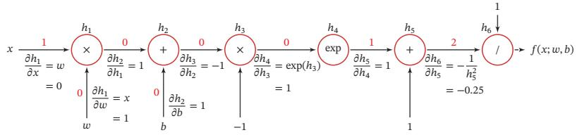  
图 4.8 复合函数 ??(??; ??, ??) 的计算图

[¶0267] 从计算图上可以看出，复合函数 $f ( x ; w , b )$ 由6个基本函数 $h _ { i } , 1 \leq i \leq 6$ 组成．如表4.2所示，每个基本函数的导数都十分简单，可以通过规则来实现https://nndl.github.io/

[¶0268] 表4.2 复合函数 $f ( x ; w , b )$ 的6个基本函数及其导数

[¶0269]
$$
h _ { 1 } = x \times w
$$

[¶0270]
$$
\frac { \partial h _ { 1 } } { \partial w } = x
$$

[¶0271]
$$
\frac { \partial h _ { 1 } } { \partial x } = w
$$

[¶0272]
$$
h _ { 2 } = h _ { 1 } + b
$$

[¶0273]
$$
\frac { \partial h _ { 2 } } { \partial h _ { 1 } } = 1
$$

[¶0274]
$$
\frac { \partial h _ { 2 } } { \partial b } = 1
$$

[¶0275]
$$
h _ { 3 } = h _ { 2 } \times - 1
$$

[¶0276]
$$
\frac { \partial h _ { 3 } } { \partial h _ { 2 } } = - 1
$$

[¶0277]
$$
h _ { 4 } = \exp ( h _ { 3 } )
$$

[¶0278]
$$
\frac { \partial h _ { 4 } } { \partial h _ { 3 } } = \exp ( h _ { 3 } )
$$

[¶0279]
$$
h _ { 5 } = h _ { 4 } + 1
$$

[¶0280]
$$
\frac { \partial h _ { 5 } } { \partial h _ { 4 } } = 1
$$

[¶0281]
$$
h _ { 6 } = 1 / h _ { 5 }
$$

[¶0282]
$$
\frac { \partial h _ { 6 } } { \partial h _ { 5 } } = - \frac { 1 } { h _ { 5 } ^ { 2 } }
$$

[¶0283] 整个复合函数 $f ( x ; w , b )$ 关于参数??和??的导数可以通过计算图上的节点$f ( x ; w , b )$ 与参数??和??之间路径上所有的导数连乘来得到，即

[¶0284]
$$
\frac { \partial f ( x ; w , b ) } { \partial w } = \frac { \partial f ( x ; w , b ) } { \partial h _ { 6 } } \frac { \partial h _ { 6 } } { \partial h _ { 5 } } \frac { \partial h _ { 5 } } { \partial h _ { 4 } } \frac { \partial h _ { 4 } } { \partial h _ { 3 } } \frac { \partial h _ { 3 } } { \partial h _ { 2 } } \frac { \partial h _ { 2 } } { \partial h _ { 1 } } \frac { \partial h _ { 1 } } { \partial w } ,\tag{4.75}
$$

[¶0285]
$$
\frac { \partial f ( x ; w , b ) } { \partial b } = \frac { \partial f ( x ; w , b ) } { \partial h _ { 6 } } \frac { \partial h _ { 6 } } { \partial h _ { 5 } } \frac { \partial h _ { 5 } } { \partial h _ { 4 } } \frac { \partial h _ { 4 } } { \partial h _ { 3 } } \frac { \partial h _ { 3 } } { \partial h _ { 2 } } \frac { \partial h _ { 2 } } { \partial b } .\tag{4.76}
$$

[¶0286] 以 $\frac { \partial f ( x ; w , b ) } { \partial w }$ 为例，当 $x = 1 , w = 0 , b = 0$ 时，可以得到

[¶0287]
$$
\frac { \partial f ( x ; w , b ) } { \partial w } \vert _ { x = 1 , w = 0 , b = 0 } = \frac { \partial f ( x ; w , b ) } { \partial h _ { 6 } } \frac { \partial h _ { 6 } } { \partial h _ { 5 } } \frac { \partial h _ { 5 } } { \partial h _ { 4 } } \frac { \partial h _ { 4 } } { \partial h _ { 3 } } \frac { \partial h _ { 3 } } { \partial h _ { 2 } } \frac { \partial h _ { 2 } } { \partial h _ { 1 } } \frac { \partial h _ { 1 } } { \partial w }\tag{4.77}
$$

[¶0288]
$$
= 1 \times - 0 . 2 5 \times 1 \times 1 \times - 1 \times 1 \times 1\tag{4.78}
$$

[¶0289]
$$
= 0 . 2 5 .\tag{4.79}
$$

[¶0290] 如果函数和参数之间有多条路径，可以将这多条路径上的导数再进行相加，得到最终的梯度

[¶0291] 按照计算导数的顺序，自动微分可以分为两种模式：前向模式和反向模式前向模式 前向模式是按计算图中计算方向的相同方向来递归地计算梯度．以$\frac { \partial f ( x ; w , b ) } { \partial w }$ 为例，当 $x = 1 , w = 0 , b = 0$ 时，前向模式的累积计算顺序如下：

[¶0292]
$$
\frac { \partial h _ { 1 } } { \partial w } = x = 1 ,\tag{4.80}
$$

[¶0293]
$$
\frac { \partial h _ { 2 } } { \partial w } = \frac { \partial h _ { 2 } } { \partial h _ { 1 } } \frac { \partial h _ { 1 } } { \partial w } = 1 \times 1 = 1 ,\tag{4.81}
$$

[¶0294]
$$
\frac { \partial h _ { 3 } } { \partial w } = \frac { \partial h _ { 3 } } { \partial h _ { 2 } } \frac { \partial h _ { 2 } } { \partial w } = - 1 \times 1 ,\tag{4.82}
$$

[¶0295] https://nndl.github.io/

[¶0296]
$$
\frac { \partial h _ { 6 } } { \partial w } = \frac { \partial h _ { 6 } } { \partial h _ { 5 } } \frac { \partial h _ { 5 } } { \partial w } = - 0 . 2 5 \times - 1 = 0 . 2 5 ,\tag{4.83}
$$

[¶0297]
$$
\frac { \partial f ( x ; w , b ) } { \partial w } = \frac { \partial f ( x ; w , b ) } { \partial h _ { 6 } } \frac { \partial h _ { 6 } } { \partial w } = 1 \times 0 . 2 5 = 0 . 2 5 .\tag{4.84}
$$

[¶0298] 反向模式 反向模式是按计算图中计算方向的相反方向来递归地计算梯度．以$\frac { \partial f ( x ; w , b ) } { \partial w }$ 为例，当 $x = 1 , w = 0 , b = 0$ 时，反向模式的累积计算顺序如下：

[¶0299]
$$
\frac { \partial f ( x ; w , b ) } { \partial h _ { 6 } } = 1 ,\tag{4.85}
$$

[¶0300]
$$
\frac { \partial f ( x ; w , b ) } { \partial h _ { 5 } } = \frac { \partial f ( x ; w , b ) } { \partial h _ { 6 } } \frac { \partial h _ { 6 } } { \partial h _ { 5 } } = 1 \times - 0 . 2 5 ,\tag{4.86}
$$

[¶0301]
$$
\frac { \partial f ( x ; w , b ) } { \partial h _ { 4 } } = \frac { \partial f ( x ; w , b ) } { \partial h _ { 5 } } \frac { \partial h _ { 5 } } { \partial h _ { 4 } } = - 0 . 2 5 \times 1 = - 0 . 2 5 ,\tag{4.87}
$$

[¶0302] (4.88)

[¶0303]
$$
\frac { \partial f ( x ; w , b ) } { \partial w } = \frac { \partial f ( x ; w , b ) } { \partial h _ { 1 } } \frac { \partial h _ { 1 } } { \partial w } = 0 . 2 5 \times 1 = 0 . 2 5 .\tag{4.89}
$$

[¶0304] 前向模式和反向模式可以看作应用链式法则的两种梯度累积方式．从反向模式的计算顺序可以看出，反向模式和反向传播的计算梯度的方式相同

[¶0305] 对于一般的函数形式 $f : \mathbb { R } ^ { N } \to \mathbb { R } ^ { M }$ ，前向模式需要对每一个输入变量都进行一遍遍历，共需要??遍．而反向模式需要对每一个输出都进行一个遍历，共需要??遍．当 $N > M$ 时，反向模式更高效．在前馈神经网络的参数学习中，风险函数为 $f : \mathbb { R } ^ { N } $ ℝ，输出为标量，因此采用反向模式为最有效的计算方式，只需要一遍计算

[¶0306] 静态计算图和动态计算图 计算图按构建方式可以分为静态计算图（Static Com-putational Graph）和动态计算图（Dynamic Computational Graph）．静态计算图是在编译时构建计算图，计算图构建好之后在程序运行时不能改变，而动态计算图是在程序运行时动态构建．两种构建方式各有优缺点．静态计算图在构建时可以进行优化，并行能力强，但灵活性比较差．动态计算图则不容易优化，当不同输入的网络结构不一致时，难以并行计算，但是灵活性比较高

[¶0307] 在 目 前 深 度 学 习 框架 里，Theano 和 Ten-sorflow采 用 的 是 静态 计 算 图，而 DyNet、Chainer 和 PyTorch 采用 的 是 动 态 计 算 图Tensorflow 2.0 也支持了动态计算图

[¶0308] 符号微分和自动微分 符号微分和自动微分都利用计算图和链式法则来自动求解导数．符号微分在编译阶段先构造一个复合函数的计算图，通过符号计算得到导数的表达式，还可以对导数表达式进行优化，在程序运行阶段才代入变量的具体数值来计算导数．而自动微分则无须事先编译，在程序运行阶段边计算边记录计算图，计算图上的局部梯度都直接代入数值进行计算，然后用前向或反向模式来计算最终的梯度

[¶0309] 图4.9给出了符号微分与自动微分的对比

[¶0310]
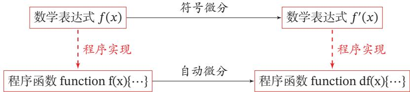  
图4.9 符号微分与自动微分对比

## 4.6 优化问题

[¶0311] 神经网络的参数学习比线性模型要更加困难，主要原因有两点：1）非凸优化问题和2）梯度消失问题

## 4.6.1 非凸优化问题

[¶0312] 神经网络的优化问题是一个非凸优化问题．以一个最简单的1-1-1结构的两层神经网络为例，

[¶0313]
$$
y = \sigma ( w _ { 2 } \sigma ( w _ { 1 } x ) ) ,\tag{4.90}
$$

[¶0314] 其中 $w _ { 1 }$ 和 $w _ { 2 }$ 为网络参数，??(⋅) 为 Logistic 函数

[¶0315] 给定一个输入样本(1, 1)，分别使用两种损失函数，第一种损失函数为平方误差损失： $\mathcal { L } ( w _ { 1 } , w _ { 2 } ) = ( 1 - y ) ^ { 2 }$ ，第二种损失函数为交叉熵损失 $\mathcal { L } ( w _ { 1 } , w _ { 2 } ) =$ log ??．当 $x = 1 , y = 1$ 时，其平方误差和交叉熵损失函数分别为： $\mathcal { L } ( w _ { 1 } , w _ { 2 } ) =$ $( 1 - y ) ^ { 2 }$ 和 $\mathcal { L } ( w _ { 1 } , w _ { 2 } ) = \log y$ ．损失函数与参数 $w _ { 1 }$ 和 $w _ { 2 }$ 的关系如图4.10所示，可以看出两种损失函数都是关于参数的非凸函数

[¶0316]
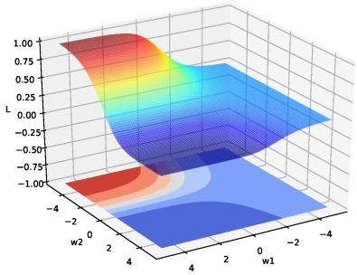  
(a)平方误差损失

[¶0317]
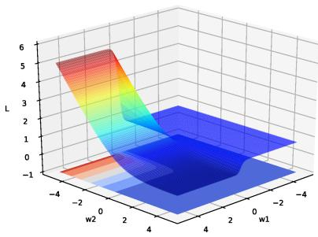  
(b)交叉熵损失  
图4.10 神经网络 $y = \sigma ( w _ { 2 } \sigma ( w _ { 1 } x ) )$ )的损失函数

## 4.6.2 梯度消失问题

[¶0318] 在神经网络中误差反向传播的迭代公式为

[¶0319]
$$
\begin{array} { r } { \delta ^ { ( l ) } = f _ { l } ^ { \prime } ( z ^ { ( l ) } ) \odot \left( W ^ { ( l + 1 ) } \right) ^ { \top } \delta ^ { ( l + 1 ) } . } \end{array}\tag{4.91}
$$

[¶0320] 误差从输出层反向传播时，在每一层都要乘以该层的激活函数的导数．当我们使用 Sigmoid 型函数：Logistic 函数 ??(??) 或 Tanh 函数时，其导数为

[¶0321]
$$
\sigma ^ { \prime } ( x ) = \sigma ( x ) \bigl ( 1 - \sigma ( x ) \bigr ) \in [ 0 , 0 . 2 5 ] ,\tag{4.92}
$$

[¶0322]
$$
\operatorname { t a n h } ^ { \prime } ( x ) = 1 - { \big ( } \operatorname { t a n h } ( x ) { \big ) } ^ { 2 } \in [ 0 , 1 ] .\tag{4.93}
$$

[¶0323] Sigmoid型函数的导数的值域都小于或等于1，如图4.11所示

[¶0324]
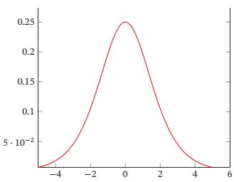  
(a) Logistic 函数的导数

[¶0325]
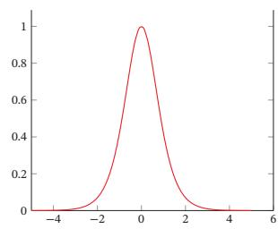  
(b) Tanh 函数的导数  
图 4.11 Sigmoid 型函数的导数

[¶0326] 由于Sigmoid型函数的饱和性，饱和区的导数更是接近于0．这样，误差经过每一层传递都会不断衰减．当网络层数很深时，梯度就会不停衰减，甚至消失，使得整个网络很难训练．这就是所谓的梯度消失问题（Vanishing GradientProblem），也称为梯度弥散问题

[¶0327] 在深度神经网络中，减轻梯度消失问题的方法有很多种．一种简单有效的方式是使用导数比较大的激活函数，比如ReLU等

[¶0328] 梯度消失问题在过去的二三十年里一直没有得到有效解决，是阻碍神经网络发展的重要原因之一

[¶0329] 更多的优化方法参见第7.1节

## 4.7 总结和深入阅读

[¶0330] 神经网络是一种典型的分布式并行处理模型，通过大量神经元之间的交互来处理信息，每一个神经元都发送兴奋和抑制的信息到其他神经元[McClellandet al., 1986]．和感知器不同，神经网络中的激活函数一般为连续可导函数．在一个神经网络中选择合适的激活函数十分重要．[Ramachandran et al., 2017] 设计了不同形式的函数组合方式，并通过强化学习来搜索合适的激活函数，在多个任务上发现Swish函数具有更好的性能

[¶0331] 表4.3给出了常见激活函数及其导数

[¶0332] 表4.3 常见激活函数及其导数
<table><tr><td>激活函数</td><td>函数</td><td>导数</td></tr><tr><td>Logistic函数</td><td> $\begin{array} { r } { f ( x ) = \frac { 1 } { 1 + \exp ( - x ) } } \end{array}$ </td><td> $f ^ { \prime } ( x ) = f ( x ) { \bigl ( } 1 - f ( x ) { \bigr ) }$ </td></tr><tr><td>Tanh函数</td><td> $\begin{array} { r } { f ( x ) = \frac { \exp ( x ) - \exp ( - x ) } { \exp ( x ) + \exp ( - x ) } } \end{array}$ </td><td> $f ^ { \prime } ( x ) = 1 - f ( x ) ^ { 2 }$ </td></tr><tr><td>ReLU函数</td><td> $f ( x ) = \operatorname* { m a x } ( 0 , x )$ </td><td> $f ^ { \prime } ( x ) = I ( x > 0 )$ </td></tr><tr><td>ELU函数</td><td> $f ( x ) = \operatorname* { m a x } ( 0 , x ) +$   $\operatorname* { m i n } { \Big ( } 0 , \gamma { \big ( } \exp ( x ) - 1 { \big ) } { \Big ) }$ </td><td> $f ^ { \prime } ( x ) = I ( x > 0 ) + I ( x \leq 0 ) \cdot \gamma \exp ( x )$ </td></tr><tr><td>SoftPlus函数</td><td> $f ( x ) = \log \left( 1 + \exp ( x ) \right)$ </td><td> $\begin{array} { r } { f ^ { \prime } ( x ) = \frac { 1 } { 1 + \exp ( - x ) } } \end{array}$ </td></tr></table>

[¶0333] 本章介绍的前馈神经网络是一种类型最简单的网络，相邻两层的神经元之间为全连接关系，也称为全连接神经网络（Fully Connected Neural Network，FCNN）或多层感知器．前馈神经网络作为一种机器学习方法在很多模式识别和机器学习的教材中都有介绍，比如《Pattern Recognition and Machine Learn-ing》[Bishop, 2007] 和《Pattern Classification》[Duda et al., 2001] 等

[¶0334] 前馈神经网络作为一种能力很强的非线性模型，其能力可以由通用近似定理来保证．关于通用近似定理的详细介绍可以参考[Haykin,2009]

[¶0335] 前馈神经网络在20世纪80年代后期就已被广泛使用，但是大部分都采用两层网络结构（即一个隐藏层和一个输出层），神经元的激活函数基本上都是Sigmoid型函数，并且使用的损失函数也大多数是平方损失．虽然当时前馈神经网络的参数学习依然有很多难点，但其作为一种连接主义的典型模型，标志人工智能从高度符号化的知识期向低符号化的学习期开始转变

[¶0336] TensorFlow游乐场1 提供了一个非常好的神经网络训练过程可视化系统

## 习题

[¶0337] 习题4-1 对于一个神经元 $\sigma ( { \pmb w } ^ { \top } { \pmb x } + b )$ ，并使用梯度下降优化参数??时，如果输入??恒大于0，其收敛速度会比零均值化的输入更慢

[¶0338] 习题4-2 试设计一个前馈神经网络来解决XOR问题，要求该前馈神经网络具有两个隐藏神经元和一个输出神经元，并使用ReLU作为激活函数

[¶0339] 习题4-3 试举例说明“死亡ReLU问题”，并提出解决方法

[¶0340] 习题4-4 计算Swish函数和GELU函数的导数

[¶0341] 参见第4.1.3节

[¶0342] 习题4-5 如果限制一个神经网络的总神经元数量（不考虑输入层）为?? + 1，输入层大小为 $M _ { 0 }$ ，输出层大小为1，隐藏层的层数为??，每个隐藏层的神经元数量为 $\frac { N } { L }$ ，试分析参数数量和隐藏层层数??的关系

[¶0343] 习题4-6 证明通用近似定理对于具有线性输出层和至少一个使用ReLU激活函数的隐藏层组成的前馈神经网络，也都是适用的

[¶0344] 习题4-7 为什么在神经网络模型的结构化风险函数中不对偏置??进行正则化？

[¶0345] 习题4-8 为什么在用反向传播算法进行参数学习时要采用随机参数初始化的方式而不是直接令 $\boldsymbol { W } = 0 , \boldsymbol { b } = 0 ?$

[¶0346] 习题4-9 梯度消失问题是否可以通过增加学习率来缓解？

## 参考文献

[¶0347] Bishop C M, 2007. Pattern recognition and machine learning[M]. 5th edition. Springer.

[¶0348] Clevert D A, Unterthiner T, Hochreiter S, 2015. Fast and accurate deep network learning by exponential linear units (elus)[J]. arXiv preprint arXiv:1511.07289.

[¶0349] Cybenko G, 1989. Approximations by superpositions of a sigmoidal function[J]. Mathematics of Control, Signals and Systems, 2:183-192.

[¶0350] Duda R O, Hart P E, Stork D G, 2001. Pattern classification[M]. 2nd edition. Wiley.

[¶0351] Dugas C, Bengio Y, Bélisle F, et al., 2001. Incorporating second-order functional knowledge for better option pricing[J]. Advances in Neural Information Processing Systems:472-478.

[¶0352] Funahashi K i, Nakamura Y, 1993. Approximation of dynamical systems by continuous time recurrent neural networks[J]. Neural networks, 6(6):801-806.

[¶0353] Gilmer J, Schoenholz S S, Riley P F, et al., 2017. Neural message passing for quantum chemistry[J]. arXiv preprint arXiv:1704.01212.

[¶0354] Glorot X, Bordes A, Bengio Y, 2011. Deep sparse rectifier neural networks[C]//Proceedings of International Conference on Artificial Intelligence and Statistics. 315-323.

[¶0355] Goodfellow I J, Warde-Farley D, Mirza M, et al., 2013. Maxout networks[C]//Proceedings of the International Conference on Machine Learning. 1319-1327.

[¶0356] Graves A, Wayne G, Danihelka I, 2014. Neural turing machines[J]. arXiv preprint arXiv:1410.5401.

[¶0357] Haykin S, 1994. Neural networks: A comprehensive foundation: Macmillan college publishing company[M]. New York.

[¶0358] Haykin S, 2009. Neural networks and learning machines[M]. 3rd edition. Pearson.

[¶0359] He K, Zhang X, Ren S, et al., 2015. Delving deep into rectifiers: Surpassing human-level performance on imagenet classification[C]//Proceedings of the IEEE International Conference on Computer Vision. 1026-1034.

[¶0360] Hendrycks D, Gimpel K, 2016. Gaussian error linear units (GELUs)[J]. arXiv preprint arXiv:1606.08415.

[¶0361] Hornik K, Stinchcombe M, White H, 1989. Multilayer feedforward networks are universal approximators[J]. Neural networks, 2(5):359-366.

[¶0362] Kipf T N, Welling M, 2016. Semi-supervised classification with graph convolutional networks[J]. arXiv preprint arXiv:1609.02907.

[¶0363] Maas A L, Hannun A Y, Ng A Y, 2013. Rectifier nonlinearities improve neural network acoustic models[C]//Proceedings of the International Conference on Machine Learning.

[¶0364] McClelland J L, Rumelhart D E, Group P R, 1986. Parallel distributed processing: Explorations in the microstructure of cognition. volume i: foundations & volume ii: Psychological and biological models[M]. MIT Press.

[¶0365] McCulloch W S, Pitts W, 1943. A logical calculus of the ideas immanent in nervous activity[J]. The bulletin of mathematical biophysics, 5(4):115-133.

[¶0366] Nair V, Hinton G E, 2010. Rectified linear units improve restricted boltzmann machines[C]// Proceedings of the International Conference on Machine Learning. 807-814.

[¶0367] Ramachandran P, Zoph B, Le Q V, 2017. Searching for activation functions[J]. arXiv preprint arXiv:1710.05941.

[¶0368] Sukhbaatar S, Weston J, Fergus R, et al., 2015. End-to-end memory networks[C]//Advances in Neural Information Processing Systems. 2431-2439.

[¶0369] Veličković P, Cucurull G, Casanova A, et al., 2017. Graph attention networks[J]. arXiv preprint arXiv:1710.10903.
