# 第5章 卷积神经网络

[¶0001] 一切都应该尽可能地简单，但不能过于简单

[¶0002] —艾伯特·爱因斯坦（Albert Einstein）

[¶0003] 卷积神经网络（Convolutional Neural Network，CNN 或 ConvNet）是一种具有局部连接、权重共享等特性的深层前馈神经网络

[¶0004] 卷积神经网络最早主要是用来处理图像信息．在用全连接前馈网络来处理图像时，会存在以下两个问题：

[¶0005] （1） 参数太多：如果输入图像大小为 $1 0 0 \times 1 0 0 \times 3$ （即图像高度为100，宽度为100以及RGB 3个颜色通道），在全连接前馈网络中，第一个隐藏层的每个神经元到输入层都有 $1 0 0 \times 1 0 0 \times 3 = 3 0 0 0 0$ 个互相独立的连接，每个连接都对应一个权重参数．随着隐藏层神经元数量的增多，参数的规模也会急剧增加．这会导致整个神经网络的训练效率非常低，也很容易出现过拟合

[¶0006] （2） 局部不变性特征：自然图像中的物体都具有局部不变性特征，比如尺度缩放、平移、旋转等操作不影响其语义信息．而全连接前馈网络很难提取这些局部不变性特征，一般需要进行数据增强来提高性能

[¶0007] 卷积神经网络是受生物学上感受野机制的启发而提出的．感受野（Recep-tive Field）机制主要是指听觉、视觉等神经系统中一些神经元的特性，即神经元只接受其所支配的刺激区域内的信号．在视觉神经系统中，视觉皮层中的神经细胞的输出依赖于视网膜上的光感受器．视网膜上的光感受器受刺激兴奋时，将神经冲动信号传到视觉皮层，但不是所有视觉皮层中的神经元都会接受这些信号一个神经元的感受野是指视网膜上的特定区域，只有这个区域内的刺激才能够激活该神经元

[¶0008] 目前的卷积神经网络一般是由卷积层、汇聚层和全连接层交叉堆叠而成的前馈神经网络．卷积神经网络有三个结构上的特性：局部连接、权重共享以及汇

[¶0009] 全连接层一般在卷积网络的最顶层

[¶0010] 聚．这些特性使得卷积神经网络具有一定程度上的平移、缩放和旋转不变性．和前馈神经网络相比，卷积神经网络的参数更少

[¶0011] 卷积神经网络主要使用在图像和视频分析的各种任务（比如图像分类、人脸识别、物体识别、图像分割等）上，其准确率一般也远远超出了其他的神经网络模型．近年来卷积神经网络也广泛地应用到自然语言处理、推荐系统等领域

## 5.1 卷积

## 5.1.1 卷积的定义

[¶0012] 卷积（Convolution），也叫褶积，是分析数学中一种重要的运算．在信号处理或图像处理中，经常使用一维或二维卷积

## 5.1.1.1 一维卷积

[¶0013] 这里我们只考虑离散序列的情况

[¶0014] 一维卷积经常用在信号处理中，用于计算信号的延迟累积．假设一个信号发生器每个时刻 $t ^ { \frac { 1 } { r ^ { 2 } } }$ 生一个信号 $x _ { t }$ ，其信息的衰减率为 $w _ { k }$ ，即在?? − 1个时间步长后，信息为原来的 $w _ { k }$ 倍．假设 $w _ { 1 } = 1 , w _ { 2 } = 1 / 2 , w _ { 3 } = 1 / 4$ ，那么在时刻??收到的信号 $y _ { t }$ 为当前时刻产生的信息和以前时刻延迟信息的叠加，

[¶0015]
$$
y _ { t } = 1 \times x _ { t } + 1 / 2 \times x _ { t - 1 } + 1 / 4 \times x _ { t - 2 }\tag{5.1}
$$

[¶0016]
$$
= w _ { 1 } \times x _ { t } + w _ { 2 } \times x _ { t - 1 } + w _ { 3 } \times x _ { t - 2 }\tag{5.2}
$$

[¶0017]
$$
= \sum _ { k = 1 } ^ { 3 } w _ { k } x _ { t - k + 1 } .\tag{5.3}
$$

[¶0018] 我们把 $w _ { 1 } , w _ { 2 } , \cdots$ 称为滤波器（Filter）或卷积核（Convolution Kernel）．假设滤波器长度为 $K$ ，它和一个信号序列 $x _ { 1 } , x _ { 2 } , \cdots$ 的卷积为

[¶0019]
$$
y _ { t } = \sum _ { k = 1 } ^ { K } w _ { k } x _ { t - k + 1 } .\tag{5.4}
$$

[¶0020] 为了简单起见，这里假设卷积的输出 $y _ { t }$ 的下标??从??开始

[¶0021] 信号序列 $_ x$ 和滤波器 $\pmb { w }$ 的卷积定义为

[¶0022]
$$
y = { \pmb w } * { \pmb x } ,\tag{5.5}
$$

[¶0023] 其中∗表示卷积运算．一般情况下滤波器的长度??远小于信号序列??的长度

[¶0024] 我们可以设计不同的滤波器来提取信号序列的不同特征．比如，当令滤波器${ \pmb w } = [ 1 / K , \cdots , 1 / K ]$ 时，卷积相当于信号序列的简单移动平均（窗口大小为??）；https://nndl.github.io/

[¶0025] 移动平均（Moving Av-erage，MA）是在分析时间序列数据时的一种简单平滑技术，能有效地消除数据中的随机波动

[¶0026] 当令滤波器 $\pmb { w } = \left[ 1 , - 2 , 1 \right]$ 时，可以近似实现对信号序列的二阶微分，即

[¶0027]
$$
x ^ { \prime \prime } ( t ) = x ( t + 1 ) + x ( t - 1 ) - 2 x ( t ) .\tag{5.6}
$$

[¶0028] 图5.1给出了两个滤波器的一维卷积示例．可以看出，两个滤波器分别提取了输入序列的不同特征．滤波器 $\pmb { w } = \left[ 1 / 3 , 1 / 3 , 1 / 3 \right]$ 可以检测信号序列中的低频信息，而滤波器 $\pmb { w } = \left[ 1 , - 2 , 1 \right]$ 可以检测信号序列中的高频信息

[¶0029]
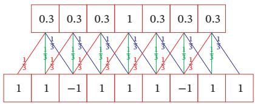  
(a) 滤波器 [1/3, 1/3, 1/3]

[¶0030]
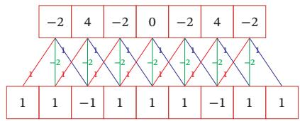  
图5.1 一维卷积示例  
(b) 滤波器 [1, −2, 1]

[¶0031] 这里将 $x ( t ) = x _ { t }$ 看作关于时间??的函数．参见习题5-1

[¶0032] 这里的高频和低频指信号变化的强烈程度

[¶0033] 下层为输入信号序列，上层为卷积结果．连接边上的数字为滤波器中的权重

[¶0034] 左图的卷积结果为近似值

## 5.1.1.2 二维卷积

[¶0035] 卷积也经常用在图像处理中．因为图像为一个二维结构，所以需要将一维卷积进行扩展．给定一个图像 $\pmb { X } \in \mathbb { R } ^ { M \times N }$ 和一个滤波器 $\pmb { W } \in \mathbb { R } ^ { U \times V }$ ，一般$U < < M , V < < N$ ，其卷积为

[¶0036]
$$
y _ { i j } = \sum _ { u = 1 } ^ { U } \sum _ { v = 1 } ^ { V } w _ { u v } x _ { i - u + 1 , j - v + 1 } .\tag{5.7}
$$

[¶0037] 为了简单起见，这里假设卷积的输出 $y _ { i j }$ 的下标(??, ??)从(??, ?? )开始

[¶0038] 输入信息??和滤波器?? 的二维卷积定义为

[¶0039]
$$
Y = W * X ,\tag{5.8}
$$

[¶0040] 其中∗表示二维卷积运算．图5.2给出了二维卷积示例

[¶0041]
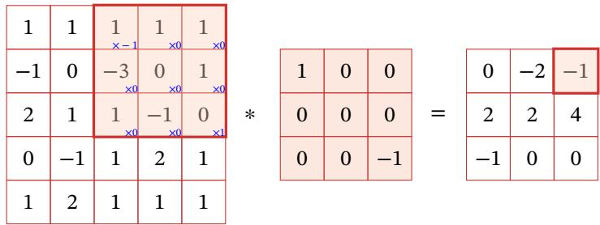  
图5.2 二维卷积示例

[¶0042] 根据卷积定义，左图的计算需要进行卷积核翻转．

[¶0043] 在图像处理中常用的均值滤波（Mean Filter）就是一种二维卷积，将当前位置的像素值设为滤波器窗口中所有像素的平均值，即 $\begin{array} { r } { w _ { u v } = \frac { 1 } { U V } } \end{array}$

[¶0044] 在图像处理中，卷积经常作为特征提取的有效方法．一幅图像在经过卷积操作后得到结果称为特征映射（Feature Map）．图5.3给出在图像处理中几种常用的滤波器，以及其对应的特征映射．图中最上面的滤波器是常用的高斯滤波器，可以用来对图像进行平滑去噪；中间和最下面的滤波器可以用来提取边缘特征

[¶0045]
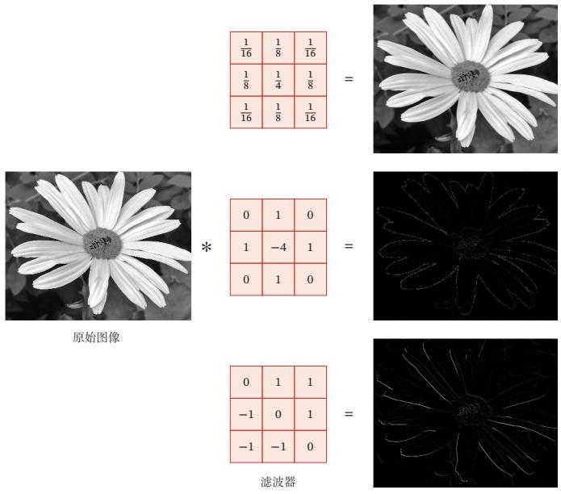  
图5.3 图像处理中几种常用的滤波器示例

## 5.1.2 互相关

[¶0046] 在机器学习和图像处理领域，卷积的主要功能是在一个图像（或某种特征）上滑动一个卷积核（即滤波器），通过卷积操作得到一组新的特征．在计算卷积的过程中，需要进行卷积核翻转．在具体实现上，一般会以互相关操作来代替卷积，从而会减少一些不必要的操作或开销．互相关（Cross-Correlation）是一个衡量两个序列相关性的函数，通常是用滑动窗口的点积计算来实现．给定一个图像 $\pmb { X } \in \mathbb { R } ^ { M \times N }$ 和卷积核 $\pmb { W } \in \mathbb { R } ^ { U \times V }$ ，它们的互相关为

[¶0047]
$$
y _ { i j } = \sum _ { u = 1 } ^ { U } \sum _ { v = 1 } ^ { V } w _ { u v } x _ { i + u - 1 , j + v - 1 } .\tag{5.9}
$$

[¶0048] 和公式(5.7)对比可知，互相关和卷积的区别仅仅在于卷积核是否进行翻转．因此互相关也可以称为不翻转卷积

[¶0049] 翻转指从两个维度（从上到下、从左到右）颠倒次序，即旋转180度

[¶0050] 互相关和卷积的区别也可以理解为图像是否进行翻转

[¶0051] 公式(5.9)可以表述为

[¶0052]
$$
Y = W \otimes X\tag{5.10}
$$

[¶0053]
$$
= \operatorname { r o t 1 8 0 } ( \mathbf { W } ) * X ,\tag{5.11}
$$

[¶0054] 其中 $\otimes$ 表示互相关运算，rot180(⋅)表示旋转180度， $\pmb { Y } \in \mathbb { R } ^ { M - U + 1 , N - V + 1 }$ 为输出矩阵．

[¶0055] 在神经网络中使用卷积是为了进行特征抽取，卷积核是否进行翻转和其特征抽取的能力无关．特别是当卷积核是可学习的参数时，卷积和互相关在能力上是等价的．因此，为了实现上（或描述上）的方便起见，我们用互相关来代替卷积．事实上，很多深度学习工具中卷积操作其实都是互相关操作

[¶0056] 在本书之后描述中，除非特别声明，卷积一般指“互相关”．卷积符号用⊗来表示，即不翻转卷积．真正的卷积用∗来表示

## 5.1.3 卷积的变种

[¶0057] 在卷积的标准定义基础上，还可以引入卷积核的滑动步长和零填充来增加卷积的多样性，可以更灵活地进行特征抽取

[¶0058] 步长（Stride）是指卷积核在滑动时的时间间隔．图5.4a给出了步长为2的卷积示例

[¶0059] 步长也可以小于1，即微步卷积，参见第5.5.1节

[¶0060] 零填充（Zero Padding）是在输入向量两端进行补零．图5.4b给出了输入的两端各补一个零后的卷积示例

[¶0061]
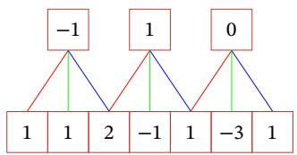  
(a) 步长 ?? = 2

[¶0062]
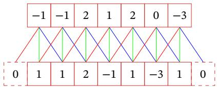  
(b) 零填充?? = 1  
图5.4 卷积的步长和零填充（滤波器为[−1, 0, 1]）

[¶0063] 假设卷积层的输入神经元个数为??，卷积大小为??，步长为??，在输入两端各填补?? 个0（zero padding），那么该卷积层的神经元数量为 $( M - K + 2 P ) / S + 1$ 一般常用的卷积有以下三类：

[¶0064] （1） 窄卷积（Narrow Convolution）：步长 ?? = 1，两端不补零 $P = 0$ ，卷积后输出长度为?? − ?? + 1

[¶0065] （2） 宽卷积（Wide Convolution）：步长 ?? = 1，两端补零 $P = K - 1$ ，卷积后输出长度 $M + K - 1$

[¶0066] （3） 等宽卷积（Equal-Width Convolution）：步长 $S = 1$ ，两端补零 $P =$ (?? − 1)/2，卷积后输出长度??．图5.4b就是一个等宽卷积示例

[¶0067] 通常可以通过选择合适的卷积大小以及步长 来 使 得(?? − ?? +2??)/?? + 1为整数

[¶0068] 在早期的文献中，卷积一般默认为窄卷积；而目前的文献中，卷积一般默认为等宽卷积更多的卷积变种参见第5.5节

## 5.1.4 卷积的数学性质

[¶0069] 卷积有很多很好的数学性质．在本节中，我们介绍一些二维卷积的数学性质，这些数学性质同样可以适用到一维卷积的情况

## 5.1.4.1 交换性

[¶0070] 如果不限制两个卷积信号的长度，真正的翻转卷积是具有交换性的，即 $x *$ $y = y * x .$ ．对于互相关的“卷积”，也同样具有一定的“交换性”

[¶0071] 我们先介绍宽卷积（Wide Convolution）的定义．给定一个二维图像 $\boldsymbol { X } \in$ ℝ $M { \times } N$ 和一个二维卷积核 $\pmb { W } \in \mathbb { R } ^ { U \times V }$ ，对图像??进行零填充，两端各补 $U - 1$ 和?? − 1个零，得到全填充（Full Padding）的图像 $\tilde { \pmb { X } } \in \mathbb { R } ^ { ( M + 2 U - 2 ) \times ( N + 2 V - 2 ) }$ ．图像??和卷积核 $\mathbf { \Delta } _ { W }$ 的宽卷积定义为

[¶0072]
$$
W \tilde { \otimes } X \triangleq W \otimes \tilde { X } ,\tag{5.12}
$$

[¶0073] 其中 $\tilde { \otimes }$ 表示宽卷积运算

[¶0074] 当输入信息和卷积核有固定长度时，它们的宽卷积依然具有交换性，即

[¶0075] 参见习题5-2

[¶0076]
$$
\mathrm { r o t 1 8 0 } ( W ) \tilde { \otimes } X = \mathrm { r o t 1 8 0 } ( X ) \tilde { \otimes } W ,\tag{5.13}
$$

[¶0077] 其中 rot180(⋅) 表示旋转 180 度

## 5.1.4.2 导数

[¶0078] 假设 $\begin{array} { r } { Y = W \otimes X , \sharp \sharp \sharp X \in \mathbb { R } ^ { M \times N } , W \in \mathbb { R } ^ { U \times V } , Y \in \mathbb { R } ^ { ( M - U + 1 ) \times ( N - V + 1 ) } } \end{array}$ 函数 $f ( \mathbf { Y } ) \in \mathbb { R }$ 为一个标量函数，则

[¶0079]
$$
\frac { \partial f ( \pmb { Y } ) } { \partial w _ { u v } } = \sum _ { i = 1 } ^ { M - U + 1 } \sum _ { j = 1 } ^ { N - V + 1 } \frac { \partial y _ { i j } } { \partial w _ { u v } } \frac { \partial f ( \pmb { Y } ) } { \partial y _ { i j } }\tag{5.14}
$$

[¶0080]
$$
= \sum _ { i = 1 } ^ { M - U + 1 } \sum _ { j = 1 } ^ { N - V + 1 } x _ { i + u - 1 , j + v - 1 } { \frac { \partial f ( Y ) } { \partial y _ { i j } } }\tag{5.15}
$$

[¶0081]
$$
y _ { i j } = \sum _ { u , v } w _ { u v } x _ { i + u - 1 , j + v - 1 } .
$$

[¶0082]
$$
= \sum _ { i = 1 } ^ { M - U + 1 } \sum _ { j = 1 } ^ { N - V + 1 } \frac { \partial f ( \pmb { Y } ) } { \partial y _ { i j } } x _ { u + i - 1 , v + j - 1 } .\tag{5.16}
$$

[¶0083] 从公式(5.16)可以看出，??(?? )关于 $\mathbf { \Delta } _ { W }$ 的偏导数为??和 $\frac { \partial f ( \boldsymbol { Y } ) } { \partial \boldsymbol { Y } }$ 的卷积

[¶0084]
$$
\frac { \partial f ( \boldsymbol { Y } ) } { \partial W } = \frac { \partial f ( \boldsymbol { Y } ) } { \partial \boldsymbol { Y } } \otimes \boldsymbol { X } .\tag{5.17}
$$

[¶0085] 同理得到，

[¶0086]
$$
\frac { \partial f ( \pmb { Y } ) } { \partial x _ { s t } } = \sum _ { i = 1 } ^ { M - U + 1 } \sum _ { j = 1 } ^ { N - V + 1 } \frac { \partial y _ { i j } } { \partial x _ { s t } } \frac { \partial f ( \pmb { Y } ) } { \partial y _ { i j } }\tag{5.18}
$$

[¶0087] https://nndl.github.io/

[¶0088]
$$
= \sum _ { i = 1 } ^ { M - U + 1 } \sum _ { j = 1 } ^ { N - V + 1 } w _ { s - i + 1 , t - j + 1 } \frac { \partial f ( \boldsymbol { Y } ) } { \partial y _ { i j } } ,\tag{5.19}
$$

[¶0089] 其中当 $( s - i + 1 ) < 1$ ，或 $( s - i + 1 ) > U$ ，或 $( t - j + 1 ) < 1$ ，或 $( t - j + 1 ) > V$ 时， $w _ { s - i + 1 , t - j + 1 } = 0$ ．即相当于对?? 进行了 $P = ( M - U , N - V )$ 的零填充

[¶0090] 从公式(5.19)可以看出，??(?? )关于??的偏导数为??和 $\frac { \partial f ( \boldsymbol { Y } ) } { \partial \boldsymbol { Y } }$ 的宽卷积．公式(5.19)中的卷积是真正的卷积而不是互相关，为了一致性，我们用互相关的“卷积”，即

[¶0091]
$$
\frac { \partial f ( \boldsymbol { Y } ) } { \partial \boldsymbol { X } } = \mathrm { r o t } 1 8 0 ( \frac { \partial f ( \boldsymbol { Y } ) } { \partial \boldsymbol { Y } } ) \tilde { \otimes } \boldsymbol { W }
$$

[¶0092]
$$
= \mathrm { r o t 1 8 0 } ( { \bf W } ) \tilde { \otimes } \frac { \partial f ( { \cal Y } ) } { \partial { \cal Y } } ,\tag{5.20}
$$

[¶0093] (5.21)

[¶0094] 其中 rot180(⋅) 表示旋转 180 度

## 5.2 卷积神经网络

[¶0095] 卷积神经网络一般由卷积层、汇聚层和全连接层构成

## 5.2.1 用卷积来代替全连接

[¶0096] 在全连接前馈神经网络中，如果第??层有 $M _ { l }$ 个神经元，第?? − 1层有 $M _ { l - 1 }$ 个神经元，连接边有 $M _ { l } \times M _ { l - 1 }$ 个，也就是权重矩阵有 $M _ { l } \times M _ { l - 1 }$ 个参数．当 $M _ { l }$ 和$M _ { l - 1 }$ 都很大时，权重矩阵的参数非常多，训练的效率会非常低

[¶0097] 如果采用卷积来代替全连接，第??层的净输入 $\boldsymbol { z } ^ { ( l ) }$ 为第?? − 1层活性值 $\pmb { a } ^ { ( l - 1 ) }$ 和卷积核 $\pmb { w } ^ { ( l ) } \in \mathbb { R } ^ { K }$ 的卷积，即

[¶0098]
$$
\begin{array} { r } { \pmb { z } ^ { ( l ) } = \pmb { w } ^ { ( l ) } \otimes \pmb { a } ^ { ( l - 1 ) } + b ^ { ( l ) } , } \end{array}\tag{5.22}
$$

[¶0099] 其中卷积核 $\pmb { w } ^ { ( l ) } \in \mathbb { R } ^ { K }$ 为可学习的权重向量， $b ^ { ( l ) } \in \mathbb { R }$ 为可学习的偏置

[¶0100] 根据卷积的定义，卷积层有两个很重要的性质：

[¶0101] 局部连接 在卷积层（假设是第??层）中的每一个神经元都只和前一层（第?? − 1层）中某个局部窗口内的神经元相连，构成一个局部连接网络．如图5.5b所示，卷积层和前一层之间的连接数大大减少，由原来的 $M _ { l } \times M _ { l - 1 }$ 个连接变为 $M _ { l } \times K$ 个连接，??为卷积核大小

[¶0102] 权重共享 从公式(5.22)可以看出，作为参数的卷积核 $\mathbf { \pmb { w } } ^ { ( l ) }$ 对于第??层的所有的神经元都是相同的．如图5.5b中，所有的同颜色连接上的权重是相同的．权重共享可以理解为一个卷积核只捕捉输入数据中的一种特定的局部特征．因此，如果要提取多种特征就需要使用多个不同的卷积核

[¶0103]
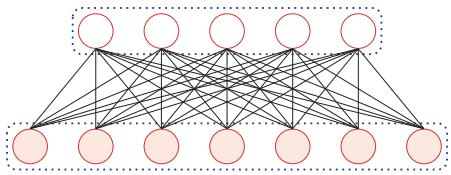  
(a)全连接层

[¶0104]
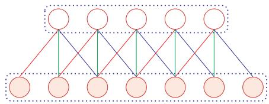  
(b) 卷积层  
图5.5 全连接层和卷积层对比

[¶0105] 由于局部连接和权重共享，卷积层的参数只有一个??维的权重 $\mathbf { \pmb { w } } ^ { ( l ) }$ 和1维的偏置 $b ^ { ( l ) }$ ，共?? + 1个参数．参数个数和神经元的数量无关．此外，第??层的神经元个数不是任意选择的，而是满足 $M _ { l } = M _ { l - 1 } - K + 1$

[¶0106] 默 认 步 长 为1，无 零填充

## 5.2.2 卷积层

[¶0107] 卷积层的作用是提取一个局部区域的特征，不同的卷积核相当于不同的特征提取器．上一节中描述的卷积层的神经元和全连接网络一样都是一维结构．由于卷积网络主要应用在图像处理上，而图像为二维结构，因此为了更充分地利用图像的局部信息，通常将神经元组织为三维结构的神经层，其大小为高度??×宽度??×深度??，由??个?? × ??大小的特征映射构成

[¶0108] 特征映射（Feature Map）为一幅图像（或其他特征映射）在经过卷积提取到的特征，每个特征映射可以作为一类抽取的图像特征．为了提高卷积网络的表示能力，可以在每一层使用多个不同的特征映射，以更好地表示图像的特征

[¶0109] 在输入层，特征映射就是图像本身．如果是灰度图像，就是有一个特征映射，输入层的深度?? = 1；如果是彩色图像，分别有RGB三个颜色通道的特征映射，输入层的深度?? = 3

[¶0110] 不失一般性，假设一个卷积层的结构如下：

[¶0111] （1） 输入特征映射组：?? ∈ ℝ??×??×?? 为三维张量（Tensor），其中每个切片（Slice）矩阵 $X ^ { d } \in \mathbb { R } ^ { M \times N }$ 为一个输入特征映射， $1 \leq d \leq D$ ；

[¶0112] （2） 输出特征映射组： $\mathcal { Y } \in \mathbb { R } ^ { M ^ { \prime } \times N ^ { \prime } \times P }$ 为三维张量，其中每个切片矩阵$Y ^ { p } \in \mathbb { R } ^ { M ^ { \prime } \times N ^ { \prime } }$ 为一个输出特征映射， $1 \leq p \leq P$ ；

[¶0113] （3） 卷积核： $\mathcal { W } \in \mathbb { R } ^ { U \times V \times P \times D }$ 为四维张量，其中每个切片矩阵 $W ^ { p , d } \in$ ℝ $U { \times } V$ 为一个二维卷积核， $1 \leq p \leq P , 1 \leq d \leq D$

[¶0114] 图5.6给出卷积层的三维结构表示

[¶0115]
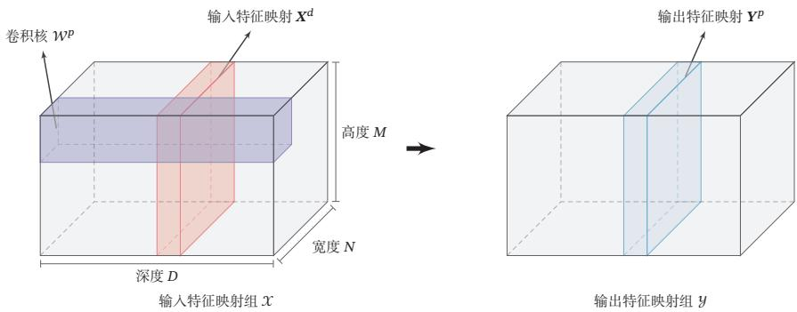  
图5.6 卷积层的三维结构表示

[¶0116] 为了计算输出特征映射 $\mathbf { Y } ^ { p }$ ，用卷积核 $W ^ { p , 1 } , W ^ { p , 2 } , \cdots , W ^ { p , D }$ 分别对输入特征映射 $X ^ { 1 } , X ^ { 2 } , \cdots , X ^ { D }$ 进行卷积，然后将卷积结果相加，并加上一个标量偏置 $b ^ { p }$ 得到卷积层的净输入 $z ^ { p }$ ，再经过非线性激活函数后得到输出特征映射 $\mathbf { Y } ^ { p }$

[¶0117]
$$
\begin{array} { l } { { \displaystyle { \pmb { Z } } ^ { p } = { \pmb { W } } ^ { p } \otimes { \pmb X } + b ^ { p } = \sum _ { d = 1 } ^ { D } { \pmb W } ^ { p , d } \otimes { \pmb X } ^ { d } + b ^ { p } , } } \\ { { \displaystyle { \pmb Y } ^ { p } = f ( { \pmb Z } ^ { p } ) . } } \end{array}\tag{5.23}
$$

[¶0118] 这里净输入是指没有经过非线性激活函数的净活性值（Net Acti-vation）

[¶0119] (5.24)

[¶0120] 其中 $W ^ { p } \in \mathbb { R } ^ { U \times V \times D }$ 为三维卷积核， $f ( \cdot )$ 为非线性激活函数，一般用ReLU函数

[¶0121] 整个计算过程如图5.7所示．如果希望卷积层输出 $P$ 个特征映射，可以将上述计算过程重复??次，得到??个输出特征映射 $\mathbf { \Delta } _ { Y ^ { 1 } , Y ^ { 2 } , \cdots , Y ^ { P } }$

[¶0122]
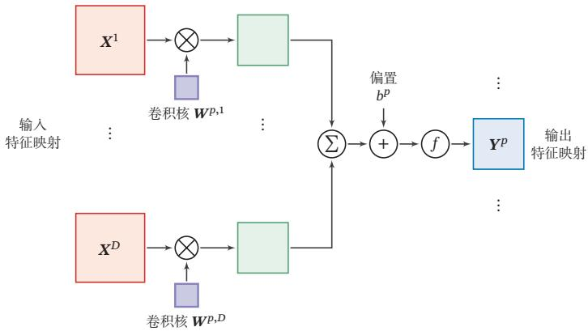  
图5.7 卷积层中从输入特征映射组??到输出特征映射 $Y ^ { p }$ 的计算示例

[¶0123] 在输入为 $\mathcal { X } \in \mathbb { R } ^ { M \times N \times D }$ ，输出为 $\mathcal { Y } \in \mathbb { R } ^ { M ^ { \prime } \times N ^ { \prime } \times P }$ 的卷积层中，每一个输出特征映射都需要??个卷积核以及一个偏置．假设每个卷积核的大小为 $U \times V$ ，那么共需要 $P \times D \times ( U \times V ) + P$ 个参数

## 5.2.3 汇聚层

[¶0124] 汇聚层（Pooling Layer）也叫子采样层（Subsampling Layer），其作用是进行特征选择，降低特征数量，从而减少参数数量

[¶0125] 卷积层虽然可以显著减少网络中连接的数量，但特征映射组中的神经元个数并没有显著减少．如果后面接一个分类器，分类器的输入维数依然很高，很容易出现过拟合．为了解决这个问题，可以在卷积层之后加上一个汇聚层，从而降低特征维数，避免过拟合

[¶0126] 减少特征维数也可以通过增加卷积步长来实现

[¶0127] 假设汇聚层的输入特征映射组为 $\mathcal { X } \in \mathbb { R } ^ { M \times N \times D }$ ，对于其中每一个特征映射$\pmb { X } ^ { d } \in \mathbb { R } ^ { M \times N } , 1 \leq d \leq D$ ，将其划分为很多区域 $R _ { m , n } ^ { d } , 1 \leq m \leq M ^ { \prime } , 1 \leq n \leq N ^ { \prime }$ 这些区域可以重叠，也可以不重叠．汇聚（Pooling）是指对每个区域进行下采样（Down Sampling）得到一个值，作为这个区域的概括

[¶0128] 常用的汇聚函数有两种：

[¶0129] （1） 最大汇聚（Maximum Pooling或Max Pooling）：对于一个区域 $R _ { m , n } ^ { d }$ 选择这个区域内所有神经元的最大活性值作为这个区域的表示，即

[¶0130]
$$
y _ { m , n } ^ { d } = \operatorname* { m a x } _ { i \in R _ { m , n } ^ { d } } x _ { i } ,\tag{5.25}
$$

[¶0131] 其中 $x _ { i }$ 为区域 $R _ { k } ^ { d }$ 内每个神经元的活性值

[¶0132] （2） 平均汇聚（Mean Pooling）：一般是取区域内所有神经元活性值的平均值，即

[¶0133]
$$
y _ { m , n } ^ { d } = \frac { 1 } { | R _ { m , n } ^ { d } | } \sum _ { i \in R _ { m , n } ^ { d } } x _ { i } .\tag{5.26}
$$

[¶0134] 对每一个输入特征映射 $X ^ { d }$ 的 $M ^ { \prime } \times N ^ { \prime }$ 个区域进行子采样，得到汇聚层的输出特征映射 $\pmb { Y } ^ { d } = \{ y _ { m , n } ^ { d } \} , 1 \leq m \leq M ^ { \prime } , 1 \leq n \leq N ^ { \prime }$

[¶0135] 图5.8给出了采样最大汇聚进行子采样操作的示例．可以看出，汇聚层不但可以有效地减少神经元的数量，还可以使得网络对一些小的局部形态改变保持不变性，并拥有更大的感受野

[¶0136] 目前主流的卷积网络中，汇聚层仅包含下采样操作．但在早期的一些卷积网络（比如LeNet-5）中，有时也会在汇聚层使用非线性激活函数，比如

[¶0137]
$$
\begin{array} { r } { { Y } ^ { \prime d } = f \left( \boldsymbol { w } ^ { d } { Y } ^ { d } + \boldsymbol { b } ^ { d } \right) , } \end{array}\tag{5.27}
$$

[¶0138] https://nndl.github.io/

[¶0139]
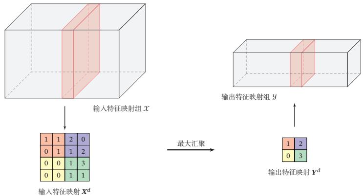  
图5.8 汇聚层中最大汇聚过程示例

[¶0140] 其中 $\pmb { Y } ^ { \prime d }$ 为汇聚层的输出， $f ( \cdot )$ 为非线性激活函数， $w ^ { d }$ 和 $b ^ { d }$ 为可学习的标量权重和偏置

[¶0141] 典型的汇聚层是将每个特征映射划分为 $2 \times 2$ 大小的不重叠区域，然后使用最大汇聚的方式进行下采样．汇聚层也可以看作一个特殊的卷积层，卷积核大小为 $K \times K$ ，步长为 $S \times S$ ，卷积核为max函数或mean函数．过大的采样区域会急剧减少神经元的数量，也会造成过多的信息损失

## 5.2.4 卷积网络的整体结构

[¶0142] 一个典型的卷积网络是由卷积层、汇聚层、全连接层交叉堆叠而成．目前常用的卷积网络整体结构如图5.9所示．一个卷积块为连续??个卷积层和??个汇聚层（??通常设置为2 ∼ 5，??为0或1）．一个卷积网络中可以堆叠??个连续的卷积块，然后在后面接着??个全连接层（??的取值区间比较大，比如1 ∼ 100或者更大；?? 一般为0 ∼ 2）

[¶0143]
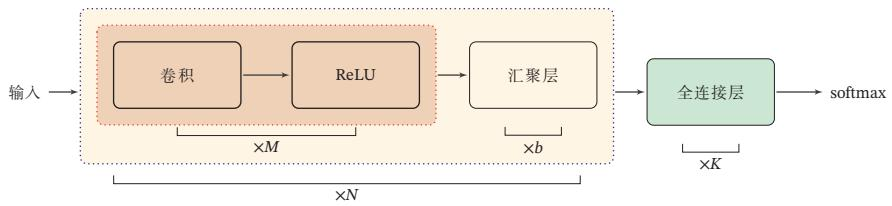  
图5.9 常用的卷积网络整体结构

[¶0144] 目前，卷积网络的整体结构趋向于使用更小的卷积核（比如1 × 1和3 × 3）以及更深的结构（比如层数大于50）．此外，由于卷积的操作性越来越灵活（比如不同的步长），汇聚层的作用也变得越来越小，因此目前比较流行的卷积网络中，汇聚层的比例正在逐渐降低，趋向于全卷积网络

## 5.3 参数学习

[¶0145] 在卷积网络中，参数为卷积核中权重以及偏置．和全连接前馈网络类似，卷积网络也可以通过误差反向传播算法来进行参数学习

[¶0146] 在全连接前馈神经网络中，梯度主要通过每一层的误差项??进行反向传播，并进一步计算每层参数的梯度

[¶0147] 参见公式(4.63)

[¶0148] 在卷积神经网络中，主要有两种不同功能的神经层：卷积层和汇聚层．而参数为卷积核以及偏置，因此只需要计算卷积层中参数的梯度

[¶0149] 这里假设汇聚层中没有参数

[¶0150] 不失一般性，对第??层为卷积层，第?? − 1层的输入特征映射为 $\mathcal { X } ^ { ( l - 1 ) } \in$ $\mathbb { R } ^ { M \times N \times D }$ ，通过卷积计算得到第??层的特征映射净输入 $\mathcal { Z } ^ { ( l ) } \in \mathbb { R } ^ { M ^ { \prime } \times N ^ { \prime } \times P }$ ．第??层的第 $p ( 1 \leq p \leq P )$ 个特征映射净输入

[¶0151] 参见公式(5.23)

[¶0152]
$$
\pmb { Z } ^ { ( l , p ) } = \sum _ { d = 1 } ^ { D } \pmb { W } ^ { ( l , p , d ) } \otimes \pmb { X } ^ { ( l - 1 , d ) } + b ^ { ( l , p ) } ,\tag{5.28}
$$

[¶0153] 其中 $W ^ { ( l , p , d ) }$ 和 $b ^ { ( l , p ) }$ 为卷积核以及偏置．第??层中共有 $P \times D$ 个卷积核和??个偏置，可以分别使用链式法则来计算其梯度

[¶0154] 根据公式(5.17)和公式(5.28)，损失函数ℒ关于第??层的卷积核 $W ^ { ( l , p , d ) }$ 的偏导数为

[¶0155] 参见公式(5.17)

[¶0156]
$$
\frac { \partial \mathcal { L } } { \partial W ^ { ( l , p , d ) } } = \frac { \partial \mathcal { L } } { \partial Z ^ { ( l , p ) } } \otimes X ^ { ( l - 1 , d ) }\tag{5.29}
$$

[¶0157]
$$
= \delta ^ { ( l , p ) } \otimes X ^ { ( l - 1 , d ) } ,\tag{5.30}
$$

[¶0158] 其中 $\begin{array} { r } { \delta ^ { ( l , p ) } = \frac { \partial \mathcal { L } } { \partial Z ^ { ( l , p ) } } } \end{array}$ 为损失函数关于第??层的第 $p$ 个特征映射净输入 $\pmb { Z } ^ { ( l , p ) }$ 的偏导数．

[¶0159] 同理可得，损失函数关于第??层的第??个偏置 $b ^ { ( l , p ) }$ 的偏导数为

[¶0160]
$$
\frac { \partial \mathcal { L } } { \partial b ^ { ( l , p ) } } = \sum _ { i , j } [ \delta ^ { ( l , p ) } ] _ { i , j } .\tag{5.31}
$$

[¶0161] 在卷积网络中，每层参数的梯度依赖其所在层的误差项 $\delta ^ { ( l , p ) }$

## 5.3.1 卷积神经网络的反向传播算法

[¶0162] 卷积层和汇聚层中误差项的计算有所不同，因此我们分别计算其误差项

[¶0163] 汇聚层 当第?? + 1层为汇聚层时，因为汇聚层是下采样操作，?? + 1层的每个神经元的误差项??对应于第??层的相应特征映射的一个区域．??层的第??个特征映射中的每个神经元都有一条边和?? + 1层的第 $p$ 个特征映射中的一个神经元相连．根https://nndl.github.io/

[¶0164] 据链式法则，第??层的一个特征映射的误差项 $\delta ^ { ( l , p ) }$ ，只需要将?? + 1层对应特征映射的误差项 $\delta ^ { ( l + 1 , p ) }$ 进行上采样操作（和第??层的大小一样），再和??层特征映射的激活值偏导数逐元素相乘，就得到了 $\delta ^ { ( l , p ) }$

[¶0165] 第??层的第 $p$ 个特征映射的误差项 $\delta ^ { ( l , p ) }$ 的具体推导过程如下：

[¶0166]
$$
\delta ^ { ( l , p ) } \triangleq \frac { \partial \mathcal { L } } { \partial Z ^ { ( l , p ) } }\tag{5.32}
$$

[¶0167]
$$
= \frac { \partial \mathbf { X } ^ { ( l , p ) } } { \partial \pmb { Z } ^ { ( l , p ) } } \frac { \partial \pmb { Z } ^ { ( l + 1 , p ) } } { \partial \pmb { X } ^ { ( l , p ) } } \frac { \partial \mathcal { L } } { \partial \pmb { Z } ^ { ( l + 1 , p ) } }\tag{5.33}
$$

[¶0168]
$$
= f _ { l } ^ { \prime } ( Z ^ { ( l , p ) } ) \odot \operatorname* { u p } ( \delta ^ { ( l + 1 , p ) } ) ,\tag{5.34}
$$

[¶0169] 其中 $f _ { l } ^ { \prime } ( \cdot )$ 为第??层使用的激活函数导数，up为上采样函数（up sampling），与汇聚层中使用的下采样操作刚好相反．如果下采样是最大汇聚，误差项 $\delta ^ { ( l + 1 , p ) }$ 中每个值会直接传递到前一层对应区域中的最大值所对应的神经元，该区域中其他神经元的误差项都设为0．如果下采样是平均汇聚，误差项 $\delta ^ { ( l + 1 , p ) }$ 中每个值会被平均分配到前一层对应区域中的所有神经元上

[¶0170] 卷积并非真正的矩阵乘积，因此这里计算的偏导数并非真正的矩阵偏导数，我们可以把??, ?? 都看作向量

[¶0171] 卷积层 当?? + 1层为卷积层时，假设特征映射净输入 $\mathcal { Z } ^ { ( l + 1 ) } \in \mathbb { R } ^ { M ^ { \prime } \times N ^ { \prime } \times P }$ ，其中第 $p ( 1 \leq p \leq P )$ 个特征映射净输入

[¶0172] 参见公式(5.23)

[¶0173]
$$
\pmb { Z } ^ { ( l + 1 , p ) } = \sum _ { d = 1 } ^ { D } \pmb { W } ^ { ( l + 1 , p , d ) } \otimes \pmb { X } ^ { ( l , d ) } + b ^ { ( l + 1 , p ) } ,\tag{5.35}
$$

[¶0174] 其中 $W ^ { ( l + 1 , p , d ) }$ 和 $b ^ { ( l + 1 , p ) }$ 为第 $l + 1$ 层的卷积核以及偏置．第?? + 1层中共有 $P \times D$ 个卷积核和 $P$ 个偏置

[¶0175] 第??层的第??个特征映射的误差项 $\delta ^ { ( l , d ) }$ 的具体推导过程如下：

[¶0176]
$$
\delta ^ { ( l , d ) } \triangleq \frac { \partial \mathcal { L } } { \partial Z ^ { ( l , d ) } }\tag{5.36}
$$

[¶0177]
$$
= \frac { \partial { X } ^ { ( l , d ) } } { \partial { Z } ^ { ( l , d ) } } \frac { \partial { \mathcal { L } } } { \partial { X } ^ { ( l , d ) } }\tag{5.37}
$$

[¶0178]
$$
= f _ { l } ^ { \prime } ( \pmb { Z } ^ { ( l , d ) } ) \odot \sum _ { P = 1 } ^ { P } \left( \mathrm { r o t } 1 8 0 ( \pmb { W } ^ { ( l + 1 , p , d ) } ) \tilde { \otimes } \frac { \partial \mathcal { L } } { \partial \pmb { Z } ^ { ( l + 1 , p ) } } \right)\tag{5.38}
$$

[¶0179] 根据公式 (5.21)

[¶0180]
$$
= f _ { l } ^ { \prime } ( \pmb { Z } ^ { ( l , d ) } ) \odot \sum _ { P = 1 } ^ { P } \left( \mathrm { r o t 1 8 0 } ( \pmb { W } ^ { ( l + 1 , p , d ) } ) \tilde { \otimes } \delta ^ { ( l + 1 , p ) } \right) ,\tag{5.39}
$$

[¶0181] 参见习题5-7

[¶0182] 其中 $\tilde { \otimes }$ 为宽卷积

## 5.4 几种典型的卷积神经网络

[¶0183] 本节介绍几种广泛使用的典型深层卷积神经网络https://nndl.github.io/

## 5.4.1 LeNet-5

[¶0184] LeNet-5[LeCun et al., 1998] 虽然提出的时间比较早，但它是一个非常成功的神经网络模型．基于LeNet-5的手写数字识别系统在20世纪90年代被美国很多银行使用，用来识别支票上面的手写数字．LeNet-5的网络结构如图5.10所示

[¶0185]
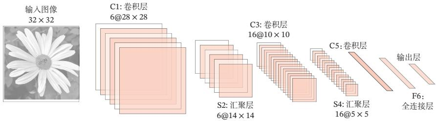  
图 5.10 LeNet-5 网络结构（图片根据 [LeCun et al., 1998] 绘制）

[¶0186] LeNet-5共有7层，接受输入图像大小为 $3 2 \times 3 2 = 1 0 2 4$ ，输出对应10个类别的得分．LeNet-5中的每一层结构如下：

[¶0187] （1） C1层是卷积层，使用6个 $5 { \times } 5$ 的卷积核，得到6组大小为 $2 8 \times 2 8 = 7 8 4$ 的特征映射．因此，C1层的神经元数量为 $6 \times 7 8 4 = 4 7 0 4$ ，可训练参数数量为$6 \times 2 5 + 6 = 1 5 6$ ，连接数为 $1 5 6 \times 7 8 4 = 1 2 2 3 0 4$ （包括偏置在内，下同）

[¶0188] （2） S2层为汇聚层，采样窗口为2 × 2，使用平均汇聚，并使用一个如公式(5.27)的非线性函数．神经元个数为 $6 \times 1 4 \times 1 4 = 1 1 7 6$ ，可训练参数数量为$6 \times ( 1 + 1 ) = 1 2$ ，连接数为 $6 \times 1 9 6 \times ( 4 + 1 ) = 5 8 8 0$

[¶0189] （3） C3层为卷积层．LeNet-5中用一个连接表来定义输入和输出特征映射之间的依赖关系，如图5.11所示，共使用60个5 × 5的卷积核，得到16组大小为 $1 0 \times 1 0$ 的特征映射．神经元数量为 $1 6 \times 1 0 0 = 1 6 0 0$ ，可训练参数数量为$( 6 0 \times 2 5 ) + 1 6 = 1 5 1 6$ ，连接数为 $1 0 0 \times 1 5 1 6 = 1 5 1 6 0 0 .$

[¶0190] 连接表参见公式(5.40)如 果 不 使 用 连 接 表，则需要96个5 × 5的卷积核

[¶0191] （4） S4层是一个汇聚层，采样窗口为2 × 2，得到16个5 × 5大小的特征映射，可训练参数数量为 $1 6 \times 2 = 3 2$ ，连接数为 $1 6 \times 2 5 \times ( 4 + 1 ) = 2 0 0 0$

[¶0192] （5） C5层是一个卷积层，使用 $1 2 0 \times 1 6 = 1 9 2 0$ 个5 × 5的卷积核，得到120组大小为 $1 \times 1$ 的特征映射．C5层的神经元数量为120，可训练参数数量为$1 9 2 0 \times 2 5 + 1 2 0 = 4 8 1 2 0$ ，连接数为 $1 2 0 \times { \left( 1 6 \times 2 5 + 1 \right) } = 4 8 1 2 0 .$

[¶0193] （6） F6层是一个全连接层，有84个神经元，可训练参数数量为 $8 4 \times ( 1 2 0 +$ $1 ) = 1 0 1 6 4$ ．连接数和可训练参数个数相同，为10 164

[¶0194] （7） 输出层：输出层由10个径向基函数（Radial Basis Function，RBF）组成．这里不再详述

[¶0195] 连接表 从公式(5.23)可以看出，卷积层的每一个输出特征映射都依赖于所有输入特征映射，相当于卷积层的输入和输出特征映射之间是全连接的关系．实际上，这种全连接关系不是必须的．我们可以让每一个输出特征映射都依赖于少数几个输入特征映射．定义一个连接表（Link Table）??来描述输入和输出特征映射之间的连接关系．在LeNet-5中，连接表的基本设定如图5.11所示．C3层的第0-5个特征映射依赖于S2层的特征映射组的每3个连续子集，第6-11个特征映射依赖于S2层的特征映射组的每4个连续子集，第12-14个特征映射依赖于S2层的特征映射的每4个不连续子集，第15个特征映射依赖于S2层的所有特征映射

[¶0196]
<table><tr><td></td><td>0</td><td></td><td>2</td><td>3</td><td>4</td><td>5</td><td>6</td><td>7</td><td>8</td><td>9</td><td>10</td><td>11</td><td>12</td><td>13</td><td>14</td><td>15</td></tr><tr><td>0</td><td>X</td><td></td><td></td><td></td><td>XX</td><td></td><td>X</td><td></td><td></td><td>X</td><td>X</td><td>X</td><td>X</td><td></td><td>X</td><td>X</td></tr><tr><td>1</td><td>X</td><td>X</td><td></td><td></td><td></td><td></td><td>XX</td><td>X</td><td></td><td></td><td></td><td>XX</td><td>X</td><td>X</td><td></td><td>X</td></tr><tr><td>2</td><td>X</td><td>X</td><td>X</td><td></td><td></td><td></td><td>X</td><td>X</td><td>X</td><td></td><td></td><td>X</td><td></td><td>X</td><td>X</td><td>X</td></tr><tr><td>3</td><td></td><td>X</td><td>X</td><td>X</td><td></td><td></td><td>X</td><td>X</td><td>X</td><td>X</td><td></td><td></td><td>X</td><td></td><td>X</td><td>X</td></tr><tr><td>4</td><td></td><td></td><td>XXX</td><td></td><td></td><td></td><td></td><td></td><td>XxXX</td><td></td><td></td><td></td><td>xX</td><td></td><td></td><td>X</td></tr><tr><td>5</td><td></td><td></td><td></td><td></td><td>XXX</td><td></td><td></td><td></td><td>XXXX</td><td></td><td></td><td></td><td></td><td></td><td>XXX</td><td></td></tr></table>

[¶0197] 图 5.11 LeNet-5 中 C3 层的连接表（图片来源：[LeCun et al., 1998]）

[¶0198] 如果第 $p$ 个输出特征映射依赖于第??个输入特征映射，则 $T _ { p , d } = 1$ ，否则为0 $\mathbf { Y } ^ { p }$ 为

[¶0199]
$$
Y ^ { p } = f \left( \sum _ { d , \tiny { d } } W ^ { p , d } \otimes X ^ { d } + b ^ { p } \right) ,\tag{5.40}
$$

[¶0200] 其中??为 $P \times D$ 大小的连接表．假设连接表??的非零个数为??，每个卷积核的大小为 $U \times V$ ，那么共需要 $K \times U \times V + P$ 参数

## 5.4.2 AlexNet

[¶0201] AlexNet[Krizhevsky et al., 2012] 是第一个现代深度卷积网络模型，其首次使用了很多现代深度卷积网络的技术方法，比如使用GPU进行并行训练，采用了ReLU作为非线性激活函数，使用Dropout防止过拟合，使用数据增强来提高模型准确率等．AlexNet赢得了2012年ImageNet图像分类竞赛的冠军

[¶0202] AlexNet的结构如图5.12所示，包括5个卷积层、3个汇聚层和3个全连接层（其中最后一层是使用Softmax函数的输出层）．因为网络规模超出了当时的单个GPU的内存限制，AlexNet将网络拆为两半，分别放在两个GPU上，GPU间只在某些层（比如第3层）进行通信

[¶0203]
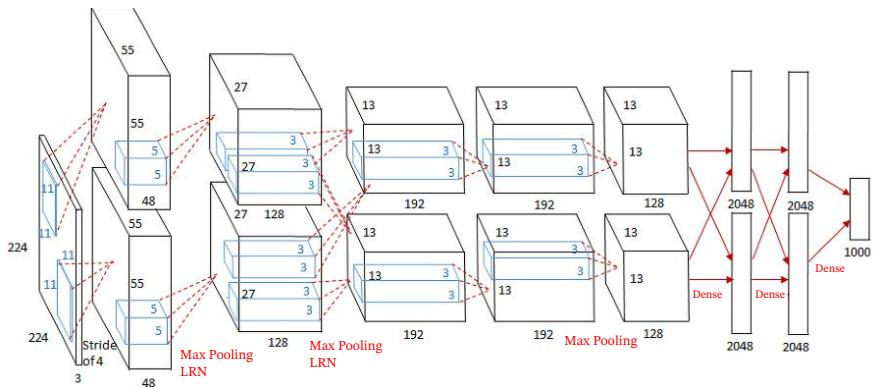  
图 5.12 AlexNet 网络结构1

[¶0204] AlexNet的输入为 $2 2 4 \times 2 2 4 \times 3$ 的图像，输出为1 000个类别的条件概率，具体结构如下：

[¶0205] 这里的卷积核使用四维张量来描述

[¶0206] （1） 第一个卷积层，使用两个大小为 $1 1 \times 1 1 \times 3 \times 4 8$ 的卷积核，步长 $S = 4$ 零填充?? = 3，得到两个大小为 $5 5 \times 5 5 \times 4 8$ 的特征映射组

[¶0207] （2） 第一个汇聚层，使用大小为 $3 \times 3$ 的最大汇聚操作，步长?? = 2，得到两个 $2 7 \times 2 7 \times 4 8$ 的特征映射组

[¶0208] （3） 第二个卷积层，使用两个大小为 $5 \times 5 \times 4 8 \times 1 2 8$ 的卷积核，步长 $S = 1$ 零填充?? = 2，得到两个大小为 $2 7 \times 2 7 \times 1 2 8$ 的特征映射组

[¶0209] （4） 第二个汇聚层，使用大小为 $3 \times 3$ 的最大汇聚操作，步长 $S = 2$ ，得到两个大小为 $1 3 \times 1 3 \times 1 2 8$ 的特征映射组

[¶0210] （5） 第三个卷积层为两个路径的融合，使用一个大小为 $3 \times 3 \times 2 5 6 \times 3 8 4$ 的卷积核，步长 $S = 1$ ，零填充?? = 1，得到两个大小为 $1 3 \times 1 3 \times 1 9 2$ 的特征映射组．

[¶0211] （6） 第四个卷积层，使用两个大小为 $3 \times 3 \times 1 9 2 \times 1 9 2$ 的卷积核，步长$S = 1$ ，零填充 $P = 1$ ，得到两个大小为 $1 3 \times 1 3 \times 1 9 2$ 的特征映射组

[¶0212] （7） 第五个卷积层，使用两个大小为 $3 \times 3 \times 1 9 2 \times 1 2 8$ 的卷积核，步长$S = 1$ ，零填充 $P = 1$ ，得到两个大小为 $1 3 \times 1 3 \times 1 2 8$ 的特征映射组

[¶0213] （8） 第三个汇聚层，使用大小为 $3 \times 3$ 的最大汇聚操作，步长?? = 2，得到两个大小为 $6 \times 6 \times 1 2 8$ 的特征映射组

[¶0214] （9） 三个全连接层，神经元数量分别为4 096、4 096和1 000

[¶0215] 此外，AlexNet还在前两个汇聚层之后进行了局部响应归一化（Local Re-sponse Normalization，LRN）以增强模型的泛化能力

[¶0216] 清晰图见 https://nndl.github.io/ v/cnn-googlenet

## 5.4.3 Inception 网络

[¶0217] 在卷积网络中，如何设置卷积层的卷积核大小是一个十分关键的问题．在Inception网络中，一个卷积层包含多个不同大小的卷积操作，称为Inception模块．Inception网络是由有多个Inception模块和少量的汇聚层堆叠而成

[¶0218] Inception 模块同时使用 $1 \times 1 . 3 \times 3 . 5 \times 5$ 等不同大小的卷积核，并将得到的特征映射在深度上拼接（堆叠）起来作为输出特征映射

[¶0219] 图5.13给出了v1版本的Inception模块结构，采用了4组平行的特征抽取方式，分别为 $1 \times 1 . 3 \times 3 . 5 \times 5$ 的卷积和3 × 3的最大汇聚．同时，为了提高计算效率，减少参数数量，Inception模块在进行 $3 \times 3 . 5 \times 5$ 的卷积之前、3 × 3的最大汇聚之后，进行一次1 × 1的卷积来减少特征映射的深度．如果输入特征映射之间存在冗余信息，1 × 1的卷积相当于先进行一次特征抽取

[¶0220]
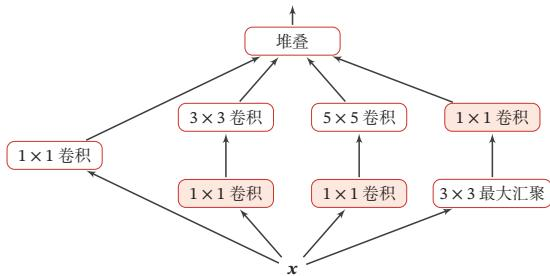  
图 5.13 Inception v1 的模块结构

[¶0221] Inception网络有多个版本，其中最早的Inception v1版本就是非常著名的GoogLeNet [Szegedy et al., 2015]．GoogLeNet 赢得了 2014 年 ImageNet 图像分类竞赛的冠军

[¶0222] GoogLeNet 由 9 个 Inception v1 模块和 5 个汇聚层以及其他一些卷积层和全连接层构成，总共为22层网络，如图5.14所示

[¶0223]
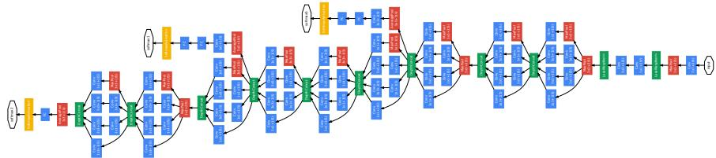  
图 5.14 GoogLeNet 网络结构（图片来源：[Szegedy et al., 2015]）

[¶0224] 为了解决梯度消失问题，GoogLeNet在网络中间层引入两个辅助分类器来加强监督信息

[¶0225] Inception网络有多个改进版本，其中比较有代表性的有Inception v3网络[Szegedy et al., 2016]．Inception v3 网络用多层的小卷积核来替换大的卷积核，https://nndl.github.io/

[¶0226]

[¶0227] Inception模 块 受 到 了模型“Network in Net-work”[Lin et al., 2013]的启发

[¶0228] 以减少计算量和参数量，并保持感受野不变．具体包括：1）使用两层 $3 \times 3$ 的卷积来替换v1中的 $5 \times 5$ 的卷积；2）使用连续的 $K \times 1$ 和 $1 \times K$ 来替换 $K \times K$ 的卷积此外，Inception v3网络同时也引入了标签平滑以及批量归一化等优化方法进行训练

## 5.4.4 残差网络

[¶0229] 残差网络（Residual Network，ResNet）通过给非线性的卷积层增加直连边（Shortcut Connection）（也称为残差连接（Residual Connection））的方式来提高信息的传播效率

[¶0230] 残差网络的思想并不局限于卷积神经网络

[¶0231] 假设在一个深度网络中，我们期望一个非线性单元（可以为一层或多层的卷积层） $f ( \pmb { x } ; \theta )$ 去逼近一个目标函数为 $h ( \boldsymbol { x } )$ ．如果将目标函数拆分成两部分：恒等函数（Identity Function）?? 和残差函数（Residue Function）ℎ(??) − ??

[¶0232]
$$
\begin{array} { r } { h ( \pmb { x } ) = \underbrace { \pmb { x } } _ { \mp \equiv \mp \mp \operatorname * { l i m } \mp \pmb { \operatorname* { N } } } + \underbrace { \left( h ( \pmb { x } ) - \pmb { x } \right) } _ { \mp \mp \pmb { \operatorname* { N } } } . } \end{array}\tag{5.41}
$$

[¶0233] 为了简便起见，这里假 设输入??与 $h ( x )$ 的维 度一致

[¶0234] 根据通用近似定理，一个由神经网络构成的非线性单元有足够的能力来近似逼近原始目标函数或残差函数，但实际中后者更容易学习[He et al., 2016]．因此，原来的优化问题可以转换为：让非线性单元 $f ( \pmb { x } ; \theta )$ 去近似残差函数 $h ( { \boldsymbol { x } } ) - { \boldsymbol { x } }$ ，并用 $f ( \pmb { x } ; \boldsymbol { \theta } ) + \pmb { x }$ 去逼近 $h ( { \boldsymbol { x } } )$

[¶0235] 图5.15给出了一个典型的残差单元示例．残差单元由多个级联的（等宽）卷积层和一个跨层的直连边组成，再经过ReLU激活后得到输出

[¶0236]
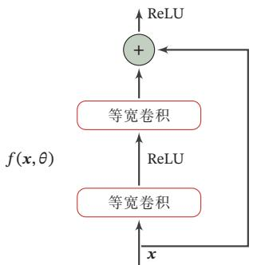  
图5.15 一个简单的残差单元结构

[¶0237] 残差网络就是将很多个残差单元串联起来构成的一个非常深的网络．和残差网络类似的还有 Highway Network[Srivastava et al., 2015]

## 5.5 其他卷积方式

[¶0238] 在第5.1.3节中介绍了一些卷积的变种，可以通过步长和零填充来进行不同的卷积操作．本节介绍一些其他的卷积方式

## 5.5.1 转置卷积

[¶0239] 我们一般可以通过卷积操作来实现高维特征到低维特征的转换．比如在一维卷积中，一个5维的输入特征，经过一个大小为3的卷积核，其输出为3维特征如果设置步长大于1，可以进一步降低输出特征的维数．但在一些任务中，我们需要将低维特征映射到高维特征，并且依然希望通过卷积操作来实现

[¶0240] 假设有一个高维向量为 $\boldsymbol { x } \in \mathbb { R } ^ { d }$ 和一个低维向量为 $z \in \mathbb { R } ^ { p } , p < d .$ ．如果用仿射变换（Affine Transformation）来实现高维到低维的映射，

[¶0241]
$$
z = W x ,\tag{5.42}
$$

[¶0242] 不失一般性，这里忽略了平移项

[¶0243] 其中 $\pmb { W } \in \mathbb { R } ^ { p \times d }$ 为转换矩阵．我们可以很容易地通过转置?? 来实现低维到高维的反向映射，即

[¶0244]
$$
\pmb { x } = \pmb { W } ^ { \top } z .\tag{5.43}
$$

[¶0245] 需要说明的是，公式(5.42)和公式(5.43)并不是逆运算，两个映射只是形式上的转置关系

[¶0246] 在全连接网络中，忽略激活函数，前向计算和反向传播就是一种转置关系比如前向计算时，第?? + 1层的净输入为 $\pmb { z } ^ { ( l + 1 ) } = \pmb { W } ^ { ( l + 1 ) } \pmb { z } ^ { ( l ) }$ ，反向传播时，第??层的误差项为 $\delta ^ { ( l ) } = ( W ^ { ( l + 1 ) } ) ^ { \top } \delta ^ { ( l + 1 ) }$

[¶0247] 参见公式(4.63)

[¶0248] 卷积操作也可以写为仿射变换的形式．假设一个5维向量??，经过大小为3的卷积核 $\pmb { w } = [ w _ { 1 } , w _ { 2 } , w _ { 3 } ] ^ { \top }$ 进行卷积，得到3维向量 $z .$ ．卷积操作可以写为

[¶0249]
$$
z = w \otimes x\tag{5.44}
$$

[¶0250]
$$
\begin{array} { r l } & { = \left[ \begin{array} { l l l l l } { w _ { 1 } } & { w _ { 2 } } & { w _ { 3 } } & { 0 } & { 0 } \\ { 0 } & { w _ { 1 } } & { w _ { 2 } } & { w _ { 3 } } & { 0 } \\ { 0 } & { 0 } & { w _ { 1 } } & { w _ { 2 } } & { w _ { 3 } } \end{array} \right] x } \\ & { = c x , } \end{array}\tag{5.45}
$$

[¶0251] 参见习题5-5

[¶0252] (5.46)

[¶0253] 其中??是一个稀疏矩阵，其非零元素来自于卷积核??中的元素

[¶0254] 如果要实现3维向量 $z$ 到5维向量??的映射，可以通过仿射矩阵的转置来实现，即

[¶0255]
$$
\begin{array} { r l } { x = C ^ { \top } z } \\ & { } \\ & { = \left[ \begin{array} { l l l } { w _ { 1 } } & { 0 } & { 0 } \\ { w _ { 2 } } & { w _ { 1 } } & { 0 } \\ { w _ { 3 } } & { w _ { 2 } } & { w _ { 1 } } \\ { 0 } & { w _ { 3 } } & { w _ { 2 } } \\ { 0 } & { 0 } & { 0 } & { w _ { 3 } } \end{array} \right] z } \\ & { = \Gamma \mathrm { o t } 1 8 0 ( w ) \tilde { \otimes } z , } \end{array}\tag{5.47}
$$

[¶0256] (5.48)

[¶0257] (5.49)

[¶0258] 其中 rot180(⋅) 表示旋转 180 度

[¶0259] 从公式(5.45)和公式(5.48)可以看出，从仿射变换的角度来看两个卷积操作$z = \pmb { w } \otimes \pmb { x }$ 和 $\pmb { x } = \mathrm { r o t 1 } 8 0 ( \pmb { w } ) \tilde { \otimes } z$ 也是形式上的转置关系．因此，我们将低维特征映射到高维特征的卷积操作称为转置卷积（Transposed Convolution）[Dumoulinet al., 2016]，也称为反卷积（Deconvolution）[Zeiler et al., 2011]

[¶0260] 在卷积网络中，卷积层的前向计算和反向传播也是一种转置关系

[¶0261] 将 转 置 卷 积 称 为反卷 积（Deconvolution）并不太恰当，它不是指卷积的逆运算  
参见习题5-7

[¶0262] 对一个??维的向量 $z ,$ ，和大小为??的卷积核，如果希望通过卷积操作来映射到更高维的向量，只需要对向量 $z$ 进行两端补零 $P = K - 1$ ，然后进行卷积，可以得到 $M + K - 1$ 维的向量

[¶0263] 即宽卷积

[¶0264] 转置卷积同样适用于二维卷积．图5.16给出了一个步长 $S \ = \ 1$ ，无零填充$P = 0$ 的二维卷积和其对应的转置卷积

[¶0265]
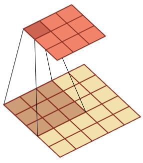  
(a) 卷积，?? = 1, ?? = 0

[¶0266]
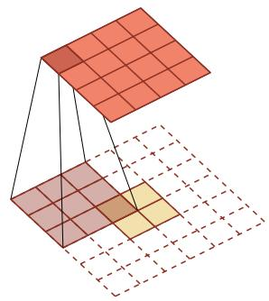  
(b) 转置卷积，?? = 1, ?? = 2  
图5.16 步长?? = 1，无零填充?? = 0的二维卷积和其对应的转置卷积

[¶0267] 微步卷积 我们可以通过增加卷积操作的步长?? > 1来实现对输入特征的下采样操作，大幅降低特征维数．同样，我们也可以通过减少转置卷积的步长 $S < 1$ 来实现上采样操作，大幅提高特征维数．步长?? < 1的转置卷积也称为微步卷积（Fractionally-Strided Convolution）[Long et al., 2015]．为了实现微步卷积，我们可以在输入特征之间插入0来间接地使得步长变小

[¶0268] 如果卷积操作的步长为 $S > 1$ ，希望其对应的转置卷积的步长为 $\frac { 1 } { S }$ ，需要在输入特征之间插入?? − 1个0来使得其移动的速度变慢

[¶0269] 以一维转置卷积为例，对一个??维的向量??，和大小为??的卷积核，通过对向量 $z$ 进行两端补零 $P = K - 1$ ，并且在每两个向量元素之间插入??个0，然后进行步长为1的卷积，可以得到 $\left( D + 1 \right) \times \left( M - 1 \right) + K$ 维的向量

[¶0270] 图5.17给出了一个步长 $S = 2$ ，无零填充?? = 0的二维卷积和其对应的转置卷积．

[¶0271]
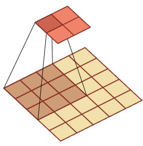  
(a) 卷积，?? = 2, ?? = 0

[¶0272]
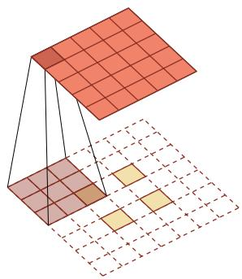  
转置卷积的动图见 https://nndl.github.io/ v/cnn-conv-more

[¶0273]
  
(b) 转置卷积，?? = 1, ?? = 2, ?? = 1  
图5.17 步长?? = 2，无零填充?? = 0的二维卷积和其对应的转置卷积

## 5.5.2 空洞卷积

[¶0274] 对于一个卷积层，如果希望增加输出单元的感受野，一般可以通过三种方式实现：1）增加卷积核的大小；2）增加层数，比如两层 $3 \times 3$ 的卷积可以近似一层$5 \times 5$ 卷积的效果；3）在卷积之前进行汇聚操作．前两种方式会增加参数数量，而第三种方式会丢失一些信息

[¶0275] 空洞卷积（Atrous Convolution）是一种不增加参数数量，同时增加输出单元感受野的一种方法，也称为膨胀卷积（Dilated Convolution）[Chen et al.,2018; Yu et al., 2015]

[¶0276] Atrous一词来源于法语à trous，意为“空洞，多孔”

[¶0277] 空洞卷积通过给卷积核插入“空洞”来变相地增加其大小．如果在卷积核的

[¶0278] 每两个元素之间插入?? − 1个空洞，卷积核的有效大小为

[¶0279]
$$
K ^ { \prime } = K + ( K - 1 ) \times ( D - 1 ) ,\tag{5.50}
$$

[¶0280] 其中??称为膨胀率（Dilation Rate）．当?? = 1时卷积核为普通的卷积核

[¶0281] 图5.18给出了空洞卷积的示例

[¶0282]
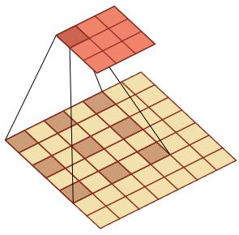  
(a) 膨胀率?? = 2

[¶0283]
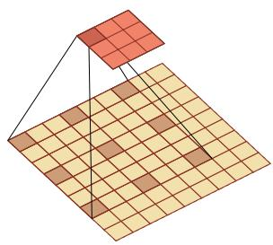  
(b) 膨胀率?? = 3  
图5.18 空洞卷积

[¶0284] 空洞卷积的动图见 https://nndl.github.io/ v/cnn-conv-more

[¶0285]

## 5.6 总结和深入阅读

[¶0286] 卷积神经网络是受生物学上感受野机制启发而提出的．1959年，[Hubelet al., 1959]发现在猫的初级视觉皮层中存在两种细胞：简单细胞和复杂细胞这两种细胞承担不同层次的视觉感知功能 [Hubel et al., 1962]．简单细胞的感受野是狭长型的，每个简单细胞只对感受野中特定角度（orientation）的光带敏感，而复杂细胞对于感受野中以特定方向（direction）移动的某种角度（ori-entation）的光带敏感．受此启发，福岛邦彦（Kunihiko Fukushima）提出了一种带卷积和子采样操作的多层神经网络：新知机（Neocognitron）[Fukushima,1980]．但当时还没有反向传播算法，新知机采用了无监督学习的方式来训练[LeCun et al.,1989]将反向传播算法引入了卷积神经网络，并在手写体数字识别上取得了很大的成功 [LeCun et al., 1998]

[¶0287] David Hubel和TorstenWiesel也 因 此 方 面 的贡献，于1981年获得诺贝尔生理学或医学奖

[¶0288] AlexNet[Krizhevsky et al., 2012] 是第一个现代深度卷积网络模型，可以说是深度学习技术在图像分类上真正突破的开端．AlexNet不用预训练和逐层训练，首次使用了很多现代深度网络的技术，比如使用GPU进行并行训练，采用了ReLU作为非线性激活函数，使用Dropout防止过拟合，使用数据增强来提高模型准确率等．这些技术极大地推动了端到端的深度学习模型的发展

[¶0289] 在 AlexNet 之后，出现了很多优秀的卷积网络，比如 VGG 网络 [Simonyanet al., 2014]、Inception v1、v2、v4 网络 [Szegedy et al., 2015, 2016, 2017]、残差网络 [He et al., 2016] 等

[¶0290] 目前，卷积神经网络已经成为计算机视觉领域的主流模型．通过引入跨层的直连边，可以训练上百层乃至上千层的卷积网络．随着网络层数的增加，卷积层越来越多地使用1× 1和3× 3大小的小卷积核，也出现了一些不规则的卷积操作，比如空洞卷积 [Chen et al., 2018; Yu et al., 2015]、可变形卷积 [Dai et al., 2017]等．网络结构也逐渐趋向于全卷积网络（Fully Convolutional Network，FCN）[Long et al., 2015]，减少汇聚层和全连接层的作用

[¶0291] 各种卷积操作的可视化示例可以参考[Dumoulin et al., 2016]

## 习题

[¶0292] 习题5-1 1）证明公式(5.6)可以近似为离散信号序列??(??)关于??的二阶微分；2）对于二维卷积，设计一种滤波器来近似实现对二维输入信号的二阶微分

[¶0293] 习题5-2 证明宽卷积具有交换性，即公式(5.13)

[¶0294] 习题5-3 分析卷积神经网络中用1 × 1的卷积核的作用

[¶0295] 习题5-4 对于一个输入为 $1 0 0 \times 1 0 0 \times 2 5 6$ 的特征映射组，使用3 × 3的卷积核，输出为 $1 0 0 \times 1 0 0 \times 2 5 6$ 的特征映射组的卷积层，求其时间和空间复杂度．如果引入一个1 × 1卷积核，先得到 $1 0 0 \times 1 0 0 \times 6 4$ 的特征映射，再进行3 × 3的卷积，得到$1 0 0 \times 1 0 0 \times 2 5 6$ 的特征映射组，求其时间和空间复杂度

[¶0296] 习题5-5 对于一个二维卷积，输入为3 × 3，卷积核大小为2 × 2，试将卷积操作重写为仿射变换的形式

[¶0297] 参见公式(5.45)

[¶0298] 习题5-6 计算函数 $y = \operatorname* { m a x } ( x _ { 1 } , \cdots , x _ { D } )$ 和函数 $y = \arg \operatorname* { m a x } ( x _ { 1 } , \cdots , x _ { D } )$ 的梯度习题5-7 忽略激活函数，分析卷积网络中卷积层的前向计算和反向传播（公式(5.39)）是一种转置关系

[¶0299] 习题5-8 在空洞卷积中，当卷积核大小为??，膨胀率为??时，如何设置零填充??的值以使得卷积为等宽卷积

## 参考文献

[¶0300] Chen L C, Papandreou G, Kokkinos I, et al., 2018. Deeplab: Semantic image segmentation with deep convolutional nets, atrous convolution, and fully connected CRFs[J]. IEEE transactions on pattern analysis and machine intelligence, 40(4):834-848.

[¶0301] Dai J, Qi H, Xiong Y, et al., 2017. Deformable convolutional networks[J]. CoRR, abs/1703.06211, 1 (2):3.

[¶0302] https://nndl.github.io/

[¶0303] Dumoulin V, Visin F, 2016. A guide to convolution arithmetic for deep learning[J]. ArXiv e-prints.

[¶0304] Fukushima K, 1980. Neocognitron: A self-organizing neural network model for a mechanism of pattern recognition unaffected by shift in position[J]. Biological cybernetics, 36(4):193-202.

[¶0305] He K, Zhang X, Ren S, et al., 2016. Deep residual learning for image recognition[C]//Proceedings of the IEEE conference on computer vision and pattern recognition. 770-778.

[¶0306] Hubel D H, Wiesel T N, 1959. Receptive fields of single neurones in the cat’s striate cortex[J]. The Journal of physiology, 148(3):574-591.

[¶0307] Hubel D H, Wiesel T N, 1962. Receptive fields, binocular interaction and functional architecture in the cat’s visual cortex[J]. The Journal of physiology, 160(1):106-154.

[¶0308] Krizhevsky A, Sutskever I, Hinton G E, 2012. ImageNet classification with deep convolutional neural networks[C]//Advances in Neural Information Processing Systems 25. 1106-1114.

[¶0309] LeCun Y, Boser B, Denker J S, et al., 1989. Backpropagation applied to handwritten zip code recognition[J]. Neural computation, 1(4):541-551.

[¶0310] LeCun Y, Bottou L, Bengio Y, et al., 1998. Gradient-based learning applied to document recognition [J]. Proceedings of the IEEE, 86(11):2278-2324.

[¶0311] Lin M, Chen Q, Yan S, 2013. Network in network[J]. arXiv preprint arXiv:1312.4400.

[¶0312] Long J, Shelhamer E, Darrell T, 2015. Fully convolutional networks for semantic segmentation[C]// Proceedings of the IEEE conference on computer vision and pattern recognition. 3431-3440.

[¶0313] Simonyan K, Zisserman A, 2014. Very deep convolutional networks for large-scale image recognition[J]. arXiv preprint arXiv:1409.1556.

[¶0314] Srivastava R K, Greff K, Schmidhuber J, 2015. Highway networks[J]. arXiv preprint arXiv:1505.00387.

[¶0315] Szegedy C, Liu W, Jia Y, et al., 2015. Going deeper with convolutions[C]//Proceedings of the IEEE Conference on Computer Vision and Pattern Recognition. 1-9.

[¶0316] Szegedy C, Vanhoucke V, Ioffe S, et al., 2016. Rethinking the inception architecture for computer vision[C]//Proceedings of the IEEE Conference on Computer Vision and Pattern Recognition. 2818-2826.

[¶0317] Szegedy C, Ioffe S, Vanhoucke V, et al., 2017. Inception-v4, inception-resnet and the impact of residual connections on learning.[C]//AAAI. 4278-4284.

[¶0318] Yu F, Koltun V, 2015. Multi-scale context aggregation by dilated convolutions[J]. arXiv preprint arXiv:1511.07122.

[¶0319] Zeiler M D, Taylor G W, Fergus R, 2011. Adaptive deconvolutional networks for mid and high level feature learning[C]//Proceedings of the IEEE International Conference on Computer Vision. IEEE: 2018-2025.
