## 第6章 循环神经网络

[¶0001] 经验是智慧之父，记忆是智慧之母

[¶0002] 谚语

[¶0003] 在前馈神经网络中，信息的传递是单向的，这种限制虽然使得网络变得更容易学习，但在一定程度上也减弱了神经网络模型的能力．在生物神经网络中，神经元之间的连接关系要复杂得多．前馈神经网络可以看作一个复杂的函数，每次输入都是独立的，即网络的输出只依赖于当前的输入．但是在很多现实任务中，网络的输出不仅和当前时刻的输入相关，也和其过去一段时间的输出相关．比如一个有限状态自动机，其下一个时刻的状态（输出）不仅仅和当前输入相关，也和当前状态（上一个时刻的输出）相关．此外，前馈网络难以处理时序数据，比如视频、语音、文本等．时序数据的长度一般是不固定的，而前馈神经网络要求输入和输出的维数都是固定的，不能任意改变．因此，当处理这一类和时序数据相关的问题时，就需要一种能力更强的模型

[¶0004] 循环神经网络（Recurrent Neural Network，RNN）是一类具有短期记忆能力的神经网络．在循环神经网络中，神经元不但可以接受其他神经元的信息，也可以接受自身的信息，形成具有环路的网络结构．和前馈神经网络相比，循环神经网络更加符合生物神经网络的结构．循环神经网络已经被广泛应用在语音识别、语言模型以及自然语言生成等任务上．循环神经网络的参数学习可以通过随时间反向传播算法[Werbos,1990]来学习．随时间反向传播算法即按照时间的逆序将错误信息一步步地往前传递．当输入序列比较长时，会存在梯度爆炸和消失问题 [Bengio et al., 1994; Hochreiter et al., 1997, 2001]，也称为长程依赖问题．为了解决这个问题，人们对循环神经网络进行了很多的改进，其中最有效的改进方式引入门控机制（Gating Mechanism）

[¶0005] 此外，循环神经网络可以很容易地扩展到两种更广义的记忆网络模型：递归神经网络和图网络

## 6.1 给网络增加记忆能力

[¶0006] 为了处理这些时序数据并利用其历史信息，我们需要让网络具有短期记忆能力．而前馈网络是一种静态网络，不具备这种记忆能力

[¶0007] 一般来讲，我们可以通过以下三种方法来给网络增加短期记忆能力

## 6.1.1 延时神经网络

[¶0008] 此外，还有一种增加记忆能力的方法是引入外部记忆单元，参见第8.5节

[¶0009] 一种简单的利用历史信息的方法是建立一个额外的延时单元，用来存储网络的历史信息（可以包括输入、输出、隐状态等）．比较有代表性的模型是延时神经网络（Time Delay Neural Network，TDNN）[Lang et al., 1990; Waibel et al.,1989]

[¶0010] 延时神经网络是在前馈网络中的非输出层都添加一个延时器，记录神经元的最近几次活性值．在第t个时刻，第??层神经元的活性值依赖于第?? − 1层神经元的最近??个时刻的活性值，即

[¶0011] 延时神经网络在时间维度上共享权值，以降低参数数量．因此对于序列输入来讲，延时神经网络就相当于卷积神经网络

[¶0012]
$$
\pmb { h } _ { t } ^ { ( l ) } = f \Big ( \pmb { h } _ { t } ^ { ( l - 1 ) } , \pmb { h } _ { t - 1 } ^ { ( l - 1 ) } , \cdots , \pmb { h } _ { t - K } ^ { ( l - 1 ) } \Big ) ,\tag{6.1}
$$

[¶0013] 其中 ${ \pmb h } _ { t } ^ { ( l ) } \in \mathbb { R } ^ { M _ { l } }$ 表示第??层神经元在时刻??的活性值， $M _ { l }$ 为第??层神经元的数量通过延时器，前馈网络就具有了短期记忆的能力

## 6.1.2 有外部输入的非线性自回归模型

[¶0014] 自回归模型（AutoRegressive Model，AR）是统计学上常用的一类时间序列模型，用一个变量 $\boldsymbol { y } _ { t }$ 的历史信息来预测自己

[¶0015]
$$
{ \mathbf { y } } _ { t } = w _ { 0 } + \sum _ { k = 1 } ^ { K } w _ { k } { \mathbf { y } } _ { t - k } + \epsilon _ { t } ,\tag{6.2}
$$

[¶0016] 其中??为超参数， $w _ { 0 } , \cdots , w _ { K }$ 为可学习参数， $\epsilon _ { t } \sim \mathcal { N } ( 0 , \sigma ^ { 2 } )$ 为第??个时刻的噪声，方差 $\sigma ^ { 2 }$ 和时间无关

[¶0017] 有外部输入的非线性自回归模型（Nonlinear AutoRegressive with Exoge-nous Inputs Model，NARX）[Leontaritis et al., 1985] 是自回归模型的扩展，在每个时刻??都有一个外部输入 $\mathbf { \boldsymbol { x } } _ { t }$ ，产生一个输出 $\boldsymbol { y } _ { t }$ ．NARX通过一个延时器记录最近 $K _ { x }$ 次的外部输入和最近 $K _ { y }$ 次的输出，第t个时刻的输出 ${ \bf y } _ { t }$ 为

[¶0018]
$$
\begin{array} { r } { { \pmb y } _ { t } = f ( { \pmb x } _ { t } , { \pmb x } _ { t - 1 } , \cdots , { \pmb x } _ { t - K _ { x } } , { \pmb y } _ { t - 1 } , { \pmb y } _ { t - 2 } , \cdots , { \pmb y } _ { t - K _ { y } } ) , } \end{array}\tag{6.3}
$$

[¶0019] 其中 $f ( \cdot )$ 表示非线性函数，可以是一个前馈网络， $K _ { x }$ 和 $K _ { y }$ 为超参数https://nndl.github.io/

## 6.1.3 循环神经网络

[¶0020] 循环神经网络（Recurrent Neural Network，RNN）通过使用带自反馈的神经元，能够处理任意长度的时序数据

[¶0021] 给定一个输入序列 $\pmb { x } _ { 1 : T } = ( \pmb { x } _ { 1 } , \pmb { x } _ { 2 } , \dots , \pmb { x } _ { t } , \dots , \pmb { x } _ { T } )$ ，循环神经网络通过下面公式更新带反馈边的隐藏层的活性值 $\pmb { h } _ { t }$ ：

[¶0022]
$$
\pmb { h } _ { t } = f ( \pmb { h } _ { t - 1 } , \pmb { x } _ { t } ) ,\tag{6.4}
$$

[¶0023] RNN也 经 常 被 翻 译为递 归 神 经 网 络．这里 为 了 区 别 与 另外 一 种递 归 神 经 网络 （Recursive NeuralNetwork，RecNN），我们称为循环神经网络

[¶0024] 其中 $\pmb { h } _ { 0 } = 0 , f ( \cdot )$ 为一个非线性函数，可以是一个前馈网络

[¶0025] 图6.1给出了循环神经网络的示例，其中“延时器”为一个虚拟单元，记录神经元的最近一次（或几次）活性值

[¶0026]
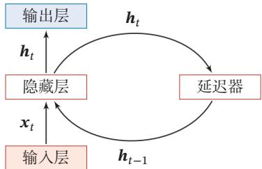  
图6.1 循环神经网络

[¶0027] 从数学上讲，公式(6.4)可以看成一个动力系统．因此，隐藏层的活性值 $\pmb { h } _ { t }$ 在很多文献上也称为状态（State）或隐状态（Hidden State）

[¶0028] 由于循环神经网络具有短期记忆能力，相当于存储装置，因此其计算能力十分强大．理论上，循环神经网络可以近似任意的非线性动力系统（参见第6.2.1节）．前馈神经网络可以模拟任何连续函数，而循环神经网络可以模拟任何程序

## 6.2 简单循环网络

[¶0029] 简单循环网络（Simple Recurrent Network，SRN）[Elman, 1990] 是一个非常简单的循环神经网络，只有一个隐藏层的神经网络．在一个两层的前馈神经网络中，连接存在相邻的层与层之间，隐藏层的节点之间是无连接的．而简单循环网络增加了从隐藏层到隐藏层的反馈连接

[¶0030] 令向量 $\pmb { x } _ { t } \in \mathbb { R } ^ { M }$ 表示在时刻??时网络的输入， $\boldsymbol { h } _ { t } \in \mathbb { R } ^ { D }$ 表示隐藏层状态（即隐藏层神经元活性值），则 $\pmb { h } _ { t }$ 不仅和当前时刻的输入 $\mathbf { \boldsymbol { x } } _ { t }$ 相关，也和上一个时刻的隐藏层状态 $\pmb { h } _ { t - 1 }$ 相关．简单循环网络在时刻??的更新公式为

[¶0031]
$$
z _ { t } = U pmb { h } _ { t - 1 } + W \pmb { x } _ { t } + \pmb { b } ,\tag{6.5}
$$

[¶0032] 动力系统（DynamicalSystem）是一个数学上的概念，指系统状态按照一定的规律随时间变化的系统．具体地讲，动力系统是使用一个函数来描述一个给定空间（如某个物理系统的状态空间）中所有点随时间的变化情况生活中很多现象（比如钟摆晃动、台球轨迹等）都可以动力系统来描述

[¶0033]
$$
\pmb { h } _ { t } = f ( \pmb { z } _ { t } ) ,\tag{6.6}
$$

[¶0034] 其中 $\boldsymbol { z } _ { t }$ 为隐藏层的净输入， $\pmb { U } \in \mathbb { R } ^ { D \times D }$ 为状态-状态权重矩阵， ${ \pmb W } \in \mathbb { R } ^ { D \times M }$ 为状态-输入权重矩阵， $\pmb { b } \in \mathbb { R } ^ { D }$ 为偏置向量， $f ( \cdot )$ 是非线性激活函数，通常为Logistic函数或Tanh函数．公式(6.5)和公式(6.6)也经常直接写为

[¶0035]
$$
\pmb { h } _ { t } = f ( \pmb { U } \pmb { h } _ { t - 1 } + \pmb { W } \pmb { x } _ { t } + \pmb { b } ) .\tag{6.7}
$$

[¶0036] 如果我们把每个时刻的状态都看作前馈神经网络的一层，循环神经网络可以看作在时间维度上权值共享的神经网络．图6.2给出了按时间展开的循环神经网络．

[¶0037]
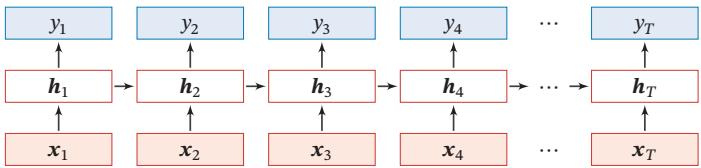  
图6.2 按时间展开的循环神经网络

## 6.2.1 循环神经网络的计算能力

[¶0038] 我们先定义一个完全连接的循环神经网络，其输入为 $\mathbf { \boldsymbol { x } } _ { t }$ ，输出为 ${ \bf y } _ { t }$ ，

[¶0039]
$$
\pmb { h } _ { t } = f ( \pmb { U } \pmb { h } _ { t - 1 } + \pmb { W } \pmb { x } _ { t } + \pmb { b } ) ,\tag{6.8}
$$

[¶0040]
$$
\mathbf { } y _ { t } = V \mathbf { } h _ { t } ,\tag{6.9}
$$

[¶0041] 其中??为隐状态， $f ( \cdot )$ 为非线性激活函数，??、??、??和?? 为网络参数

## 6.2.1.1 循环神经网络的通用近似定理

[¶0042] 循环神经网络的拟合能力也十分强大．一个完全连接的循环网络是任何非线性动力系统的近似器

[¶0043] 定理 6.1–循环神经网络的通用近似定理 [Haykin, 2009]：如果一个完全连接的循环神经网络有足够数量的sigmoid型隐藏神经元，它可以以任意的准确率去近似任何一个非线性动力系统

[¶0044]
$$
\begin{array} { r } { \pmb { s } _ { t } = \pmb { g } ( \pmb { s } _ { t - 1 } , \pmb { x } _ { t } ) , } \end{array}\tag{6.10}
$$

[¶0045]
$$
\mathbf { } y _ { t } = o ( \pmb { s } _ { t } ) ,\tag{6.11}
$$

[¶0046] 其中 $\pmb { s } _ { t }$ 为每个时刻的隐状态， $\mathbf { \boldsymbol { x } } _ { t }$ 是外部输入， $g ( \cdot )$ 是可测的状态转换函数，$o ( \cdot )$ 是连续输出函数，并且对状态空间的紧致性没有限制

[¶0047] 证明.（1）根据通用近似定理，两层的前馈神经网络可以近似任意有界闭集上的任意连续函数．因此，动力系统的两个函数可以用两层的全连接前馈网络近似

[¶0048] 通 用 近 似 定 理 参 见第4.3.1节

[¶0049] 首先，非线性动力系统的状态转换函数 ${ \pmb s } _ { t } = { \bf g } ( { \pmb s } _ { t - 1 } , { \pmb x } _ { t } )$ 可以由一个两层的神经网络 $\pmb { s } _ { t } = \pmb { C } f ( \pmb { A } \pmb { s } _ { t - 1 } + \pmb { B } \pmb { x } _ { t } + \pmb { b } )$ 来近似，可以分解为

[¶0050]
$$
\pmb { s } _ { t } ^ { \prime } = f ( \pmb { A } \pmb { s } _ { t - 1 } + \pmb { B } \pmb { x } _ { t } + \pmb { b } )\tag{6.12}
$$

[¶0051]
$$
= f ( \boldsymbol { A } \boldsymbol { C } \boldsymbol { s } _ { t - 1 } ^ { \prime } + \boldsymbol { B } \boldsymbol { x } _ { t } + \boldsymbol { b } ) ,\tag{6.13}
$$

[¶0052]
$$
\mathbf { } s _ { t } = C s _ { t } ^ { \prime } ,\tag{6.14}
$$

[¶0053] 其中 ${ \mathbf { } } A , B , C$ 为权重矩阵，??为偏置向量

[¶0054] 同理，非线性动力系统的输出函数 $\mathbf { y } _ { t } = o ( \mathbf { s } _ { t } ) = o ( g ( \mathbf { s } _ { t - 1 } , \pmb { x } _ { t } ) )$ 也可以用一个两层的前馈神经网络近似

[¶0055] 本 证 明 参 考 文 献[Schäfer et al., 2006]

[¶0056]
$$
\mathbf { y } _ { t } ^ { \prime } = f ( A ^ { \prime } \pmb { s } _ { t - 1 } + B ^ { \prime } \pmb { x } _ { t } + \pmb { b } ^ { \prime } )\tag{6.15}
$$

[¶0057]
$$
= f ( \boldsymbol { A } ^ { \prime } \boldsymbol { C } \boldsymbol { s } _ { t - 1 } ^ { \prime } + \boldsymbol { B } ^ { \prime } \boldsymbol { x } _ { t } + \boldsymbol { b } ^ { \prime } ) ,\tag{6.16}
$$

[¶0058]
$$
\mathbf { y } _ { t } = \pmb { D } \mathbf { y } _ { t } ^ { \prime } ,\tag{6.17}
$$

[¶0059] 其中 $A ^ { \prime } , B ^ { \prime } , D$ 为权重矩阵， $\pmb { b } ^ { \prime }$ 为偏置向量

[¶0060] （2）公式 (6.13) 和公式 (6.16) 可以合并为

[¶0061]
$$
\left[ \begin{array} { l } { s _ { t } ^ { \prime } } \\ { \mathbf { \bar { \mathbf { y } } } _ { t } ^ { \prime } } \end{array} \right] = f \left( \left[ \begin{array} { l l } { A C } & { 0 } \\ { A ^ { \prime } C } & { 0 } \end{array} \right] \left[ \begin{array} { l } { s _ { t - 1 } ^ { \prime } } \\ { \mathbf { \bar { y } } _ { t - 1 } ^ { \prime } } \end{array} \right] + \left[ \begin{array} { l } { B } \\ { B ^ { \prime } } \end{array} \right] x _ { t } + \left[ \begin{array} { l } { b } \\ { b ^ { \prime } } \end{array} \right] \right) .\tag{6.18}
$$

[¶0062] 公式(6.17)可以改写为

[¶0063]
$$
\begin{array} { r } { \boldsymbol { y } _ { t } = \left[ 0 \quad D \right] \left[ \begin{array} { l } { \boldsymbol { s } _ { t } ^ { \prime } } \\ { } \\ { \boldsymbol { y } _ { t } ^ { \prime } } \end{array} \right] . } \end{array}\tag{6.19}
$$

[¶0064] 令 $\pmb { h } _ { t } = [ \pmb { s } _ { t } ^ { \prime } ; \pmb { y } _ { t } ^ { \prime } ]$ ，则非线性动力系统可以由下面的全连接循环神经网络来近似．

[¶0065]
$$
\pmb { h } _ { t } = f ( \pmb { U } \pmb { h } _ { t - 1 } + \pmb { W } \pmb { x } _ { t } + \pmb { b } ) ,\tag{6.20}
$$

[¶0066]
$$
\mathbf { } y _ { t } = V \mathbf { } h _ { t } ,\tag{6.21}
$$

[¶0067]
$$
\sharp \sharp \pmb { U } = \left[ \begin{array} { l l } { \pmb { A } \pmb { C } } & { 0 } \\ { \pmb { A } ^ { \prime } \pmb { C } } & { 0 } \end{array} \right] , \boldsymbol { W } = \left[ \begin{array} { l } { \pmb { B } } \\ { \pmb { B } ^ { \prime } } \\ { \pmb { B } ^ { \prime } } \end{array} \right] , \boldsymbol { b } = \left[ \begin{array} { l } { \boldsymbol { b } } \\ { \pmb { b } ^ { \prime } } \\ { \pmb { b } ^ { \prime } } \end{array} \right] , \boldsymbol { V } = \left[ 0 \quad \boldsymbol { D } \right] .
$$

## 6.2.1.2 图灵完备

[¶0068] 图灵完备（Turing Completeness）是指一种数据操作规则，比如一种计算机编程语言，可以实现图灵机（Turing Machine）的所有功能，解决所有的可计算问题．目前主流的编程语言（比如C++、Java、Python等）都是图灵完备的

[¶0069] 图灵机是一种抽象的信息处理装置，可以用来解决所有的可计算问题，参见第8.5.2节

[¶0070] 定理 6.2 – 图灵完备 [Siegelmann et al., 1991]： 所有的图灵机都可以被一个由使用Sigmoid型激活函数的神经元构成的全连接循环网络来进行模拟．

[¶0071] 因此，一个完全连接的循环神经网络可以近似解决所有的可计算问题

## 6.3 应用到机器学习

[¶0072] 循环神经网络可以应用到很多不同类型的机器学习任务．根据这些任务的特点可以分为以下几种模式：序列到类别模式、同步的序列到序列模式、异步的序列到序列模式

[¶0073] 下面我们分别来看下这几种应用模式

## 6.3.1 序列到类别模式

[¶0074] 序列到类别模式主要用于序列数据的分类问题：输入为序列，输出为类别比如在文本分类中，输入数据为单词的序列，输出为该文本的类别

[¶0075] 假设一个样本 ${ \pmb x } _ { 1 : T } = ( { \pmb x } _ { 1 } , \cdots , { \pmb x } _ { T } )$ 为一个长度为??的序列，输出为一个类别$y \in \{ 1 , \cdots , C \}$ ．我们可以将样本??按不同时刻输入到循环神经网络中，并得到不同时刻的隐藏状态 $\pmb { h } _ { 1 } , \cdots , \pmb { h } _ { T }$ ．我们可以将 ${ \pmb h } _ { T }$ 看作整个序列的最终表示（或特征），并输入给分类器 $g ( \cdot )$ 进行分类（如图6.3a所示），即

[¶0076]
$$
\hat { y } = g ( \pmb { h } _ { T } ) ,\tag{6.22}
$$

[¶0077] 其中 $g ( \cdot )$ 可以是简单的线性分类器（比如Logistic回归）或复杂的分类器（比如多层前馈神经网络）

[¶0078] 除了将最后时刻的状态作为整个序列的表示之外，我们还可以对整个序列的所有状态进行平均，并用这个平均状态来作为整个序列的表示（如图6.3b所示），即

[¶0079]
$$
\hat { y } = g \Big ( \frac { 1 } { T } \sum _ { t = 1 } ^ { T } \pmb { h } _ { t } \Big ) .\tag{6.23}
$$

[¶0080] https://nndl.github.io/

[¶0081]
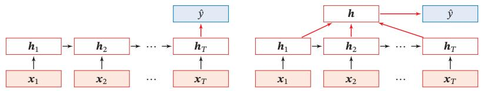

[¶0082] (a)正常模式

[¶0083] (b)按时间进行平均采样模式

[¶0084] 图6.3 序列到类别模式

## 6.3.2 同步的序列到序列模式

[¶0085] 同步的序列到序列模式主要用于序列标注（Sequence Labeling）任务，即每一时刻都有输入和输出，输入序列和输出序列的长度相同．比如在词性标注（Part-of-Speech Tagging）中，每一个单词都需要标注其对应的词性标签

[¶0086] 在同步的序列到序列模式（如图6.4所示）中，输入为一个长度为??的序列${ \pmb x } _ { 1 : T } = ( { \pmb x } _ { 1 } , \cdots , { \pmb x } _ { T } )$ ，输出为序列 $y _ { 1 : T } = ( y _ { 1 } , \cdots , y _ { T } )$ ．样本??按不同时刻输入到循环神经网络中，并得到不同时刻的隐状态 $\pmb { h } _ { 1 } , \cdots , \pmb { h } _ { T }$ ．每个时刻的隐状态 $\pmb { h } _ { t }$ 代表了当前时刻和历史的信息，并输入给分类器 $g ( \cdot )$ 得到当前时刻的标签 $\hat { y } _ { t }$ ，即

[¶0087]
$$
\hat { y } _ { t } = g ( \pmb { h } _ { t } ) , \qquad \forall t \in [ 1 , T ] .\tag{6.24}
$$

[¶0088]
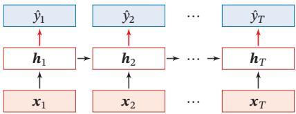  
图6.4 同步的序列到序列模式

## 6.3.3 异步的序列到序列模式

[¶0089] 异步的序列到序列模式也称为编码器-解码器（Encoder-Decoder）模型，即输入序列和输出序列不需要有严格的对应关系，也不需要保持相同的长度．比如在机器翻译中，输入为源语言的单词序列，输出为目标语言的单词序列

[¶0090] 参见第15.6节

[¶0091] 在异步的序列到序列模式中，输入为长度为??的序列 ${ \pmb x } _ { 1 : T } = ( { \pmb x } _ { 1 } , \cdots , { \pmb x } _ { T } )$ ，输出为长度为??的序列 $y _ { 1 : M } = ( y _ { 1 } , \cdots , y _ { M } )$ ．异步的序列到序列模式一般通过先编码后解码的方式来实现．先将样本??按不同时刻输入到一个循环神经网络（编码器）中，并得到其编码 ${ \pmb h } _ { T }$ ．然后再使用另一个循环神经网络（解码器），得到输出序列 $\hat { y } _ { 1 : M }$ ．为了建立输出序列之间的依赖关系，在解码器中通常使用非线性的自回归模型．令 $f _ { 1 } ( \cdot )$ 和 $f _ { 2 } ( \cdot )$ 分别为用作编码器和解码器的循环神经网络，则编码https://nndl.github.io/

[¶0092] 器-解码器模型可以写为

[¶0093]
$$
\pmb { h } _ { t } = f _ { 1 } ( \pmb { h } _ { t - 1 } , \pmb { x } _ { t } ) ,
$$

[¶0094]
$$
\forall t \in [ 1 , T ]\tag{6.25}
$$

[¶0095]
$$
\begin{array} { r } { \pmb { h } _ { T + t } = f _ { 2 } ( \pmb { h } _ { T + t - 1 } , \hat { \bf y } _ { t - 1 } ) , } \end{array}
$$

[¶0096]
$$
\forall t \in [ 1 , M ]\tag{6.26}
$$

[¶0097]
$$
\hat { y } _ { t } = g ( \pmb { h } _ { T + t } ) ,
$$

[¶0098]
$$
\forall t \in [ 1 , M ]\tag{6.27}
$$

[¶0099] 其中??(⋅)为分类器， $\hat { \mathbf { y } } _ { t }$ 为预测输出 $\hat { y } _ { t }$ 的向量表示．在解码器通常采用自回归模型，每个时刻的输入为上一时刻的预测结果 $\hat { y } _ { t - 1 }$

[¶0100] 自 回 归 模 型 参 见第6.1.2节

[¶0101] 图6.5给出了异步的序列到序列模式示例，其中⟨??????⟩表示输入序列的结束，虚线表示将上一个时刻的输出作为下一个时刻的输入

[¶0102] 异 步 的 序 列 到 序 列模式可以进一步参见第15.6.1节．

[¶0103]
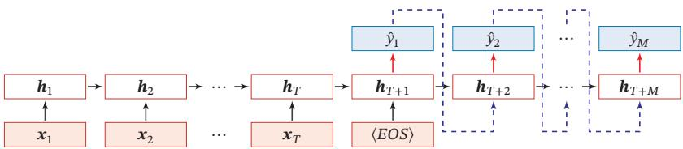  
图6.5 异步的序列到序列模式

## 6.4 参数学习

[¶0104] 循环神经网络的参数可以通过梯度下降方法来进行学习

[¶0105] 以随机梯度下降为例，给定一个训练样本 $( { \pmb x } , { \pmb y } )$ ，其中 ${ \pmb x } _ { 1 : T } = ( { \pmb x } _ { 1 } , \cdots , { \pmb x } _ { T } )$ 为长度是??的输入序列， $y _ { 1 : T } = ( y _ { 1 } , \cdots , y _ { T } )$ 是长度为??的标签序列．即在每个时刻??，都有一个监督信息 $y _ { t }$ ，我们定义时刻??的损失函数为

[¶0106] 不失一般性，这里我们以同步的序列到序列模式为例来介绍循环神经网络的参数学习

[¶0107]
$$
\mathcal { L } _ { t } = \mathcal { L } ( y _ { t } , g ( \pmb { h } _ { t } ) ) ,\tag{6.28}
$$

[¶0108] 其中 ${ \bf g } ( { \pmb h } _ { t } )$ 为第??时刻的输出，ℒ为可微分的损失函数，比如交叉熵．那么整个序列的损失函数为

[¶0109]
$$
\mathcal { L } = \sum _ { t = 1 } ^ { T } \mathcal { L } _ { t } .\tag{6.29}
$$

[¶0110] 整个序列的损失函数ℒ关于参数??的梯度为

[¶0111]
$$
\frac { \partial \mathcal { L } } { \partial \boldsymbol { U } } = \sum _ { t = 1 } ^ { T } \frac { \partial \mathcal { L } _ { t } } { \partial \boldsymbol { U } } ,\tag{6.30}
$$

[¶0112] 即每个时刻损失 $\mathcal { L } _ { t }$ 对参数??的偏导数之和

[¶0113] 循环神经网络中存在一个递归调用的函数??(⋅)，因此其计算参数梯度的方式和前馈神经网络不太相同．在循环神经网络中主要有两种计算梯度的方式：随时间反向传播（BPTT）算法和实时循环学习（RTRL）算法

## 6.4.1 随时间反向传播算法

[¶0114] 随时间反向传播（BackPropagation Through Time，BPTT）算法的主要思想是通过类似前馈神经网络的误差反向传播算法[Werbos,1990]来计算梯度

[¶0115] BPTT算法将循环神经网络看作一个展开的多层前馈网络，其中“每一层”对应循环网络中的“每个时刻”（见图6.2）．这样，循环神经网络就可以按照前馈网络中的反向传播算法计算参数梯度．在“展开”的前馈网络中，所有层的参数是共享的，因此参数的真实梯度是所有“展开层”的参数梯度之和

[¶0116] 计算偏导数 $\frac { \partial \mathcal { L } _ { t } } { \partial U }$ 先来计算公式(6.30)中第??时刻损失对参数??的偏导数 $\frac { \partial \mathcal { L } _ { t } } { \partial U }$

[¶0117] 因为参数?? 和隐藏层在每个时刻 $k ( 1 \leq k \leq t )$ 的净输入 $z _ { k } = U \pmb { h } _ { k - 1 } +$ ${ \pmb W } { \pmb x } _ { k } + { \pmb b }$ 有关，因此第??时刻的损失函数 $\mathcal { L } _ { t }$ 关于参数 $u _ { i j }$ 的梯度为：

[¶0118]
$$
\frac { \partial \mathcal { L } _ { t } } { \partial u _ { i j } } = \sum _ { k = 1 } ^ { t } \frac { \partial ^ { + } z _ { k } } { \partial u _ { i j } } \frac { \partial \mathcal { L } _ { t } } { \partial z _ { k } } ,\tag{6.31}
$$

[¶0119] 链 式 法 则 参 见 公式(B.18)

[¶0120] 其中 $\frac { { \partial ^ { + } } z _ { k } } { { \partial { u _ { i j } } } }$ 表示“直接”偏导数，即公式 $z _ { k } = U h _ { k - 1 } + W x _ { k } + b$ 中保持 $\pmb { h } _ { k - 1 }$ 不变，对 $u _ { i j }$ 进行求偏导数，得到

[¶0121]
$$
\frac { \partial ^ { + } z _ { k } } { \partial u _ { i j } } = \left[ 0 , \cdots , \left( \pmb { h } _ { k - 1 } \right) _ { j } \cdots , 0 \right]\tag{6.32}
$$

[¶0122]
$$
\triangleq \mathbb { I } _ { i } ( [ \pmb { h } _ { k - 1 } ] _ { j } ) ,\tag{6.33}
$$

[¶0123] 其中 $[ \pmb { h } _ { k - 1 } ] _ { j }$ 为第?? − 1时刻隐状态的第 $j$ 维； $\mathbb { I } _ { i } ( x )$ 除了第??个元素的值为??外，其余都为0的行向量

[¶0124] 定义误差项 $\begin{array} { r } { \delta _ { t , k } = \frac { \partial \mathcal { L } _ { t } } { \partial z _ { k } } } \end{array}$ 为第??时刻的损失对第??时刻隐藏神经层的净输入 $z _ { k }$ 的导数，则当 $1 \leq k < t$ ??时

[¶0125]
$$
\delta _ { t , k } = \frac { \partial \mathcal { L } _ { t } } { \partial z _ { k } }\tag{6.34}
$$

[¶0126]
$$
= \frac { \partial \pmb { h } _ { k } } { \partial \pmb { z } _ { k } } \frac { \partial \pmb { z } _ { k + 1 } } { \partial \pmb { h } _ { k } } \frac { \partial \pmb { \mathcal { L } } _ { t } } { \partial \pmb { z } _ { k + 1 } }\tag{6.35}
$$

[¶0127]
$$
= \mathrm { d i a g } ( f ^ { \prime } ( z _ { k } ) ) U ^ { \top } \delta _ { t , k + 1 } .\tag{6.36}
$$

[¶0128] 将公式 (6.36) 和公式 (6.33) 代入公式 (6.31) 得到

[¶0129]
$$
\frac { \partial \mathcal { L } _ { t } } { \partial u _ { i j } } = \sum _ { k = 1 } ^ { t } [ \delta _ { t , k } ] _ { i } [ \pmb { h } _ { k - 1 } ] _ { j } .\tag{6.37}
$$

[¶0130] 将上式写成矩阵形式为

[¶0131]
$$
\frac { \partial \mathcal { L } _ { t } } { \partial U } = \sum _ { k = 1 } ^ { t } \delta _ { t , k } \pmb { h } _ { k - 1 } ^ { \top } .\tag{6.38}
$$

[¶0132] 图6.6给出了误差项随时间进行反向传播算法的示例

[¶0133]
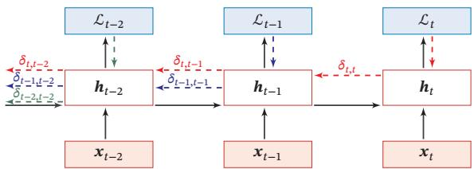  
图6.6 误差项随时间反向传播算法示例

[¶0134] 参数梯度 将公式(6.38)代入到公式(6.30)，得到整个序列的损失函数ℒ关于参数??的梯度

[¶0135]
$$
\frac { \partial \mathcal { L } } { \partial U } = \sum _ { t = 1 } ^ { T } \sum _ { k = 1 } ^ { t } \delta _ { t , k } \pmb { h } _ { k - 1 } ^ { \top } .\tag{6.39}
$$

[¶0136] 同理可得，ℒ关于权重?? 和偏置??的梯度为

[¶0137]
$$
\frac { \partial \mathcal { L } } { \partial W } = \sum _ { t = 1 } ^ { T } \sum _ { k = 1 } ^ { t } \delta _ { t , k } \pmb { x } _ { k } ^ { \top } ,\tag{6.40}
$$

[¶0138]
$$
\frac { \partial \mathcal { L } } { \partial \pmb { b } } = \sum _ { t = 1 } ^ { T } \sum _ { k = 1 } ^ { t } \delta _ { t , k } .\tag{6.41}
$$

[¶0139] 计算复杂度 在BPTT算法中，参数的梯度需要在一个完整的“前向”计算和“反向”计算后才能得到并进行参数更新

## 6.4.2 实时循环学习算法

[¶0140] 与反向传播的 BPTT 算法不同的是，实时循环学习（Real-Time RecurrentLearning，RTRL）是通过前向传播的方式来计算梯度 [Williams et al., 1995]

[¶0141] 假设循环神经网络中第?? + 1时刻的状态 $\pmb { h } _ { t + 1 }$ 为

[¶0142] 梯度前向传播可以参考自动微分中的前向模式，参见第4.5.3节

[¶0143]
$$
\pmb { h } _ { t + 1 } = f ( \pmb { z } _ { t + 1 } ) = f ( \pmb { U } \pmb { h } _ { t } + \pmb { W } \pmb { x } _ { t + 1 } + \pmb { b } ) ,\tag{6.42}
$$

[¶0144] 其关于参数 $u _ { i j }$ 的偏导数为

[¶0145]
$$
\begin{array} { r l r } {  { \frac { \partial { \pmb h } _ { t + 1 } } { \partial { \pmb u } _ { i j } } = \Big ( \frac { \partial ^ { + } { \pmb z } _ { t + 1 } } { \partial { \pmb u } _ { i j } } + \frac { \partial { \pmb h } _ { t } } { \partial u _ { i j } } { \pmb U } ^ { \top } \Big ) \frac { \partial { \pmb h } _ { t + 1 } } { \partial { \pmb z } _ { t + 1 } } } } \\ & { } & { = \Big ( \mathbb { I } _ { i } ( [ { \pmb h } _ { t } ] _ { j } ) + \frac { \partial { \pmb h } _ { t } } { \partial u _ { i j } } { \pmb U } ^ { \top } \Big ) \mathrm { d i a g } ( f ^ { \prime } ( { \pmb z } _ { t + 1 } ) ) } \end{array}\tag{6.43}
$$

[¶0146] (6.44)

[¶0147]
$$
= \left( \mathbb { I } _ { i } ( [ \pmb { h } _ { t } ] _ { j } ) + \frac { \partial \pmb { h } _ { t } } { \partial \pmb { u } _ { i j } } \pmb { U } ^ { \top } \right) \odot \left( f ^ { \prime } ( \pmb { z } _ { t + 1 } ) \right) ^ { \top } ,\tag{6.45}
$$

[¶0148] 其中 $\mathbb { I } _ { i } ( x )$ 是除了第??行值为??外，其余都为0的行向量

[¶0149] RTRL算法从第1个时刻开始，除了计算循环神经网络的隐状态之外，还利用公式(6.45)依次前向计算偏导数 $\frac { \partial { h _ { 1 } } } { \partial { u _ { i j } } } , \frac { \partial { h _ { 2 } } } { \partial { u _ { i j } } } , \frac { \partial { h _ { 3 } } } { \partial { u _ { i j } } } , \cdots$

[¶0150] 这样，假设第??个时刻存在一个监督信息，其损失函数为 $\mathcal { L } _ { t }$ ，就可以同时计算损失函数对 $u _ { i j }$ 的偏导数

[¶0151]
$$
\frac { \partial \mathcal { L } _ { t } } { \partial u _ { i j } } = \frac { \partial \pmb { h } _ { t } } { \partial u _ { i j } } \frac { \partial \mathcal { L } _ { t } } { \partial \pmb { h } _ { t } } .\tag{6.46}
$$

[¶0152] 这样在第??时刻，可以实时地计算损失 $\mathcal { L } _ { t }$ 关于参数??的梯度，并更新参数．参数?? 和??的梯度也可以同样按上述方法实时计算

[¶0153] 两种算法比较 RTRL算法和BPTT算法都是基于梯度下降的算法，分别通过前向模式和反向模式应用链式法则来计算梯度．在循环神经网络中，一般网络输出维度远低于输入维度，因此BPTT算法的计算量会更小，但是BPTT算法需要保存所有时刻的中间梯度，空间复杂度较高．RTRL算法不需要梯度回传，因此非常适合用于需要在线学习或无限序列的任务中

## 6.5 长程依赖问题

[¶0154] 循环神经网络在学习过程中的主要问题是由于梯度消失或爆炸问题，很难建模长时间间隔（Long Range）的状态之间的依赖关系

[¶0155] 在BPTT算法中，将公式(6.36)展开得到

[¶0156]
$$
\delta _ { t , k } = \prod _ { \tau = k } ^ { t - 1 } \Big ( \mathrm { d i a g } ( f ^ { \prime } ( \boldsymbol { \mathsf { z } } _ { \tau } ) ) \boldsymbol { \mathsf { \boldsymbol { U } } } ^ { \top } \Big ) \delta _ { t , t } .\tag{6.47}
$$

[¶0157] 如果定义 $\gamma \cong \| \operatorname { d i a g } ( f ^ { \prime } ( z _ { \tau } ) ) \pmb { U } ^ { \top } \|$ ，则

[¶0158]
$$
\delta _ { t , k } \cong \gamma ^ { t - k } \delta _ { t , t } .\tag{6.48}
$$

[¶0159] 若 $\gamma > 1$ ，当 $t - k \to \infty$ 时， $\gamma ^ { t - k }  \infty$ ．当间隔?? − ??比较大时，梯度也变得很大，会造成系统不稳定，称为梯度爆炸问题（Gradient Exploding Problem）

[¶0160] 相反，若 $\gamma < 1$ ，当 $t - k \to \infty$ 时， $\gamma ^ { t - k }  0$ ．当间隔?? − ??比较大时，梯度也变得非常小，会出现和深层前馈神经网络类似的梯度消失问题（VanishingGradient Problem）

[¶0161]

[¶0162] 要注意的是，在循环神经网络中的梯度消失不是说 $\frac { \partial \mathcal { L } _ { t } } { \partial U }$ 的梯度消失了，而$\frac { \partial \mathcal { L } _ { t } } { \partial h _ { k } }$ 的梯度消失了（当间隔?? − ??比较大时）．也就是说，参数??的更新主要靠当前时刻??的几个相邻状态 $\pmb { h } _ { k }$ 来更新，长距离的状态对参数??没有影响

[¶0163] 由于循环神经网络经常使用非线性激活函数为Logistic函数或Tanh函数作为非线性激活函数，其导数值都小于1，并且权重矩阵 $\| \pmb { U } \|$ 也不会太大，因此如果时间间隔?? − ??过大， $\delta _ { t , k }$ 会趋向于0，因而经常会出现梯度消失问题

[¶0164] 虽然简单循环网络理论上可以建立长时间间隔的状态之间的依赖关系，但是由于梯度爆炸或消失问题，实际上只能学习到短期的依赖关系．这样，如果时刻??的输出 $y _ { t }$ 依赖于时刻??的输入 $\boldsymbol { x } _ { k }$ ，当间隔?? − ??比较大时，简单神经网络很难建模这种长距离的依赖关系，称为长程依赖问题（Long-Term DependenciesProblem）

[¶0165] 长 程 依 赖 问 题也 称为长 期 依 赖 问 题或长距离依赖问题

## 6.5.1 改进方案

[¶0166] 为了避免梯度爆炸或消失问题，一种最直接的方式就是选取合适的参数，同时使用非饱和的激活函数，尽量使得 $\mathrm { d i a g } ( f ^ { \prime } ( z ) ) U ^ { \prime } \approx 1$ ，这种方式需要足够的人工调参经验，限制了模型的广泛应用．比较有效的方式是通过改进模型或优化方法来缓解循环网络的梯度爆炸和梯度消失问题

[¶0167] 梯度爆炸 一般而言，循环网络的梯度爆炸问题比较容易解决，一般通过权重衰减或梯度截断来避免

[¶0168] 梯度截断是一种启发式的解决梯度爆炸问题的有效方法，参见第7.2.4.4节

[¶0169] 权重衰减是通过给参数增加 $\ell _ { 1 }$ 或 $\ell _ { 2 }$ 范数的正则化项来限制参数的取值范围，从而使得 $\gamma \leq 1$ ．梯度截断是另一种有效的启发式方法，当梯度的模大于一定阈值时，就将它截断成为一个较小的数

[¶0170] 梯度消失 梯度消失是循环网络的主要问题．除了使用一些优化技巧外，更有效的方式就是改变模型，比如让 $U = { \pmb I }$ ，同时令 $\frac { \partial h _ { t } } { \partial h _ { t - 1 } } = I$ 为单位矩阵，即

[¶0171]
$$
\pmb { h } _ { t } = \pmb { h } _ { t - 1 } + g ( \pmb { x } _ { t } ; \pmb { \theta } ) ,\tag{6.49}
$$

[¶0172] 其中 $g ( \cdot )$ 是一个非线性函数，??为参数

[¶0173] 公式 (6.49) 中， $\pmb { h } _ { t }$ 和 $\pmb { h } _ { t - 1 }$ 之间为线性依赖关系，且权重系数为1，这样就不存在梯度爆炸或消失问题．但是，这种改变也丢失了神经元在反馈边上的非线性激活的性质，因此也降低了模型的表示能力

[¶0174] 为了避免这个缺点，我们可以采用一种更加有效的改进策略：

[¶0175]
$$
\pmb { h } _ { t } = \pmb { h } _ { t - 1 } + g ( \pmb { x } _ { t } , \pmb { h } _ { t - 1 } ; \theta ) ,\tag{6.50}
$$

[¶0176] 这种改进策略和残差连接的思想十分类似，参见第5.4.4节

[¶0177] 这样 $\pmb { h } _ { t }$ 和 $\pmb { h } _ { t - 1 }$ 之间为既有线性关系，也有非线性关系，并且可以缓解梯度消失问题．但这种改进依然存在两个问题：

[¶0178] （1）梯度爆炸问题：令 $z _ { k } = U h _ { k - 1 } + W x _ { k } + b$ 为在第??时刻函数 $g ( \cdot )$ 的输入，在计算公式(6.34)中的误差项 $\begin{array} { r } { \delta _ { t , k } = \frac { \partial \mathcal { L } _ { t } } { \partial z _ { k } } } \end{array}$ 时，梯度可能会过大，从而导致梯度爆炸问题

[¶0179] 参见习题6-3

[¶0180] （2）记忆容量（Memory Capacity）问题：随着 $\pmb { h } _ { t }$ 不断累积存储新的输入信息，会发生饱和现象．假设??(⋅)为Logistic函数，则随着时间??的增长， $\pmb { h } _ { t }$ 会变得越来越大，从而导致??变得饱和．也就是说，隐状态 $\pmb { h } _ { t }$ 可以存储的信息是有限的，随着记忆单元存储的内容越来越多，其丢失的信息也越来越多

[¶0181] 为了解决这两个问题，可以通过引入门控机制来进一步改进模型

[¶0182] 还有一种增加记忆容量的方法是增加一些额外的存储单元：外部记忆，参见第8.5节

## 6.6 基于门控的循环神经网络

[¶0183] 为了改善循环神经网络的长程依赖问题，一种非常好的解决方案是在公式(6.50)的基础上引入门控机制来控制信息的累积速度，包括有选择地加入新的信息，并有选择地遗忘之前累积的信息．这一类网络可以称为基于门控的循环神经网络（Gated RNN）．本节中，主要介绍两种基于门控的循环神经网络：长短期记忆网络和门控循环单元网络

## 6.6.1 长短期记忆网络

[¶0184] 长短期记忆网络（Long Short-Term Memory Network，LSTM）[Gers et al.,2000; Hochreiter et al., 1997] 是循环神经网络的一个变体，可以有效地解决简单循环神经网络的梯度爆炸或消失问题

[¶0185] 在公式(6.50)的基础上，LSTM网络主要改进在以下两个方面：

[¶0186] 新的内部状态 LSTM网络引入一个新的内部状态（internal state） $\pmb { c } _ { t } \in \mathbb { R } ^ { D }$ 专门进行线性的循环信息传递，同时（非线性地）输出信息给隐藏层的外部状态$\pmb { h } _ { t } \in \mathbb { R } ^ { D }$ ．内部状态 $\mathbf { c } _ { t }$ 通过下面公式计算：

[¶0187]
$$
\pmb { c } _ { t } = \pmb { f } _ { t } \odot \pmb { c } _ { t - 1 } + \pmb { i } _ { t } \odot \tilde { \pmb { c } } _ { t } ,\tag{6.51}
$$

[¶0188]
$$
\begin{array} { r } { \pmb { h } _ { t } = \pmb { \sigma } _ { t } \odot \operatorname { t a n h } ( \pmb { c } _ { t } ) , } \end{array}\tag{6.52}
$$

[¶0189] 其中 $\mathbf { \mathcal { f } } _ { t } \in [ 0 , 1 ] ^ { D } , \mathbf { \dot { \boldsymbol { i } } } _ { t } \in [ 0 , 1 ] ^ { D }$ 和 ${ \mathbf { \sigma } } _ { \mathbf { 0 } _ { t } } \in [ 0 , 1 ] ^ { D }$ 为三个门（gate）来控制信息传递的路径； $\odot$ 为向量元素乘积； $\mathbf { \delta c } _ { t - 1 }$ 为上一时刻的记忆单元； $\pmb { \tilde { c } } _ { t } \in \mathbb { R } ^ { D }$ 是通过非线性函数得到的候选状态：

[¶0190]
$$
\tilde { \pmb { c } } _ { t } = \operatorname { t a n h } ( \pmb { W _ { c } } \pmb { x } _ { t } + \pmb { U _ { c } } \pmb { h } _ { t - 1 } + \pmb { b } _ { c } ) .\tag{6.53}
$$

[¶0191] 公式 (6.53)～公式 (6.56)中的 $W _ { * } , U _ { * } , \boldsymbol { b } _ { * }$ 为可学习的 网 络 参 数，其 中$* \in \{ i , f , o , c \} .$

[¶0192] https://nndl.github.io/

[¶0193] 在每个时刻??，LSTM网络的内部状态 $\mathbf { c } _ { t }$ 记录了到当前时刻为止的历史信息

[¶0194] 门控机制 在数字电路中，门（gate）为一个二值变量{0, 1}，0代表关闭状态，不许任何信息通过；1代表开放状态，允许所有信息通过

[¶0195] LSTM网络引入门控机制（Gating Mechanism）来控制信息传递的路径公式(6.51)和公式(6.52)中三个“门”分别为输入 $\lceil \overline { { \mathbf { \Omega } } } \rVert _ { t }$ 、遗忘门 $\pmb { f } _ { t }$ 和输出门 $\mathbf { J o } _ { t }$ ．这三个门的作用为

[¶0196] （1） 遗忘门 $\pmb { f } _ { t }$ 控制上一个时刻的内部状态 $\pmb { c } _ { t - 1 }$ 需要遗忘多少信息

[¶0197] （2） 输入门 $\mathbf { i } _ { t }$ 控制当前时刻的候选状态 $\tilde { \mathbf { c } } _ { t }$ 有多少信息需要保存

[¶0198] （3） 输出门 $\mathbf { o } _ { t }$ 控制当前时刻的内部状态 $\mathbf { c } _ { t }$ 有多少信息需要输出给外部状态 $\pmb { h } _ { t }$ ．

[¶0199] 当 $\pmb { f } _ { t } = \mathbf { 0 } , \pmb { i } _ { t } = \mathbf { 1 }$ 时，记忆单元将历史信息清空，并将候选状态向量 $\tilde { \mathbf { c } } _ { t }$ 写入但此时记忆单元 $\mathbf { c } _ { t }$ 依然和上一时刻的历史信息相关．当 $\pmb { f } _ { t } = \mathbf { 1 } , \pmb { i } _ { t } = \mathbf { 0 }$ 时，记忆单元将复制上一时刻的内容，不写入新的信息

[¶0200] LSTM网络中的“门”是一种“软”门，取值在(0, 1)之间，表示以一定的比例允许信息通过．三个门的计算方式为：

[¶0201]
$$
\begin{array} { r } { \pmb { i } _ { t } = \sigma ( \pmb { W _ { i } } \pmb { x } _ { t } + \pmb { U } _ { i } \pmb { h } _ { t - 1 } + \pmb { b } _ { i } ) , } \end{array}\tag{6.54}
$$

[¶0202]
$$
\pmb { f } _ { t } = \sigma ( \pmb { W _ { f } } \pmb { x } _ { t } + \pmb { U } _ { f } \pmb { h } _ { t - 1 } + \pmb { b } _ { f } ) ,\tag{6.55}
$$

[¶0203]
$$
\mathbf { o } _ { t } = \sigma ( \mathbf { W } _ { o } \mathbf { x } _ { t } + \mathbf { U } _ { o } \mathbf { h } _ { t - 1 } + \mathbf { b } _ { o } ) ,\tag{6.56}
$$

[¶0204] 其中 $\sigma ( \cdot )$ 为 Logistic 函数，其输出区间为 (0, 1)， $\mathbf { \boldsymbol { x } } _ { t }$ 为当前时刻的输入， $\pmb { h } _ { t - 1 }$ 为上一时刻的外部状态

[¶0205] 图6.7给出了LSTM网络的循环单元结构，其计算过程为：1）首先利用上一时刻的外部状态 $\pmb { h } _ { t - 1 }$ 和当前时刻的输入 $\mathbf { \boldsymbol { x } } _ { t }$ ，计算出三个门，以及候选状态 $\tilde { \mathbf { c } } _ { t }$ ；2）结合遗忘门 $\pmb { f } _ { t }$ 和输入门 $\mathbf { i } _ { t }$ 来更新记忆单元 $\mathbf { } \mathbf { } \mathbf { } \mathbf { } \mathbf { } \mathbf { } \mathbf { } \mathbf { } \mathbf { } \mathbf { } \mathbf { } \mathbf { } \mathbf { } \mathbf { } \mathbf { } \mathbf { } \mathbf { } \mathbf { } \mathbf { } \mathbf { } \mathbf { } \mathbf { } \mathbf { } \mathbf { } \mathbf { } \mathbf { } \mathbf { } \mathbf { } \mathbf { } \mathbf { } \mathbf { } \mathbf { } \mathbf { } \mathbf { } \mathbf { } \mathbf { } \mathbf { } \mathbf { } \mathbf { } \mathbf { } \mathbf { } \mathbf { } \mathbf { } \mathbf { } \mathbf { } \mathbf { } \mathbf { } \mathbf { } \mathbf { } \mathbf { } \mathbf { } \mathbf { } \mathbf { } \mathbf { } \mathbf { } \mathbf { } \mathbf { } \mathbf { } \mathbf { } \mathbf { } \mathbf { } \mathbf { } \mathbf { } \mathbf { } \mathbf { } \mathbf { } \mathbf { } \mathbf { } \mathbf { } \mathbf { } \mathbf { } \mathbf { } \mathbf { } \mathbf { } \mathbf { } \mathbf { } \mathbf { } \mathbf { } \mathbf { } \mathbf { } \mathbf { } \mathbf { } \mathbf { } \mathbf { } \mathbf { } \mathbf { } \mathbf { } \mathbf { } \mathbf { } \mathbf { } \mathbf { } \mathbf { } \mathbf { } \mathbf { } \mathbf { } \mathbf { } \mathbf { } \mathbf { } \mathbf { } \mathbf { } \mathbf { } \mathbf { } \mathbf { } \mathbf { } \mathbf \Psi  \mathbf \mathbf { } \mathbf \mathbf { } \mathbf { } \mathbf \Psi \mathbf { } \mathbf \Psi \mathbf \ \Psi \mathbf { } \mathbf \Psi \mathbf \Psi \mathbf { } \mathbf \Psi \mathbf \Psi \Psi \mathbf \Psi \mathbf \Psi \Psi \mathbf \Psi \Psi \mathbf \Psi \mathbf \Psi \Psi \mathbf \Psi \Psi \mathbf \Psi \mathbf \Psi \Psi \mathbf \Psi \Psi \mathbf \Psi \mathbf \Psi \Psi \mathbf \Psi \mathbf \Psi \Psi \mathbf \Psi \mathbf \Psi \Psi \mathbf \Psi \mathbf \Psi \mathbf \Psi \mathbf \Psi \mathbf \Psi \mathbf \Psi \mathbf \Psi \mathbf \Psi \mathbf \Psi \mathbf \Psi \mathbf \Psi \mathbf \Psi \mathbf \Psi \mathbf \mathbf \Psi \mathbf \Psi \mathbf \mathbf \Psi \mathbf \Psi \mathbf \mathbf \Psi \mathbf \mathbf \Psi \mathbf \mathbf \Psi \mathbf \mathbf \Psi \mathbf \mathbf \mathbf \mathbf \Psi \mathbf \mathbf \Psi \mathbf \mathbf \Psi \mathbf \mathbf \mathbf \mathbf \Psi \mathbf \mathbf \mathbf \mathbf$ ）结合输出门 $\mathbf { o } _ { t }$ ，将内部状态的信息传递给外部状态 $\pmb { h } _ { t }$

[¶0206]
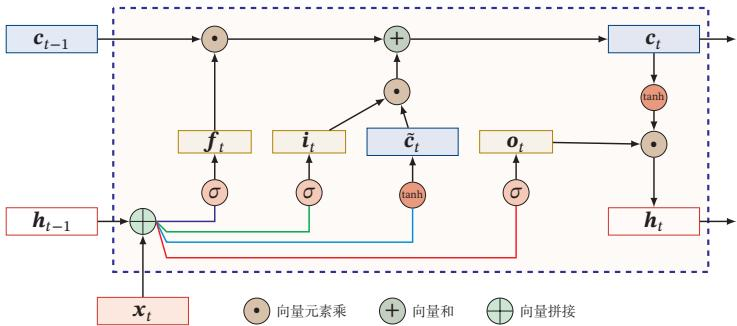  
图6.7 LSTM网络的循环单元结构

[¶0207] 通过LSTM循环单元，整个网络可以建立较长距离的时序依赖关系．公式(6.51)～公式 (6.56) 可以简洁地描述为

[¶0208]
$$
\left[ \begin{array} { c } { \tilde { c } _ { t } } \\ { \sigma _ { t } } \\ { i _ { t } } \\ { f _ { t } } \end{array} \right] = \left[ \begin{array} { c } { \operatorname { t a n h } } \\ { \sigma } \\ { \sigma } \\ { \sigma } \\ { \sigma } \end{array} \right] \left( W \left[ \begin{array} { c } { x _ { t } } \\ { h _ { t - 1 } } \end{array} \right] + b \right) ,\tag{6.57}
$$

[¶0209]
$$
\pmb { c } _ { t } = \pmb { f } _ { t } \odot \pmb { c } _ { t - 1 } + \pmb { i } _ { t } \odot \tilde { \pmb { c } } _ { t } ,\tag{6.58}
$$

[¶0210]
$$
\begin{array} { r } { \pmb { h } _ { t } = \pmb { \sigma } _ { t } \odot \operatorname { t a n h } \left( \pmb { c } _ { t } \right) , } \end{array}\tag{6.59}
$$

[¶0211] 其中 $\pmb { x } _ { t } \in \mathbb { R } ^ { M }$ 为当前时刻的输入， $\pmb { W } \in \mathbb { R } ^ { 4 D \times ( M + D ) }$ 和 $\pmb { b } \in \mathbb { R } ^ { 4 D }$ 为网络参数

[¶0212] 记忆 循环神经网络中的隐状态??存储了历史信息，可以看作一种记忆（Mem-ory）．在简单循环网络中，隐状态每个时刻都会被重写，因此可以看作一种短期记忆（Short-Term Memory）．在神经网络中，长期记忆（Long-Term Mem-ory）可以看作网络参数，隐含了从训练数据中学到的经验，其更新周期要远远慢于短期记忆．而在LSTM网络中，记忆单元??可以在某个时刻捕捉到某个关键信息，并有能力将此关键信息保存一定的时间间隔．记忆单元??中保存信息的生命周期要长于短期记忆 ??，但又远远短于长期记忆， 因此称为长短期记忆（LongShort-Term Memory）

[¶0213] 长短期记忆是指长的“短期记忆”

[¶0214]

[¶0215] 一般在深度网络参数学习时，参数初始化的值一般都比较小．但是在训练LSTM网络时，过小的值会使得遗忘门的值比较小．这意味着前一时刻的信息大部分都丢失了，这样网络很难捕捉到长距离的依赖信息．并且相邻时间间隔的梯度会非常小，这会导致梯度弥散问题．因此遗忘的参数初始值一般都设得比较大，其偏置向量 ${ \pmb b } _ { f }$ 设为1或2

## 6.6.2 LSTM网络的各种变体

[¶0216] 目前主流的LSTM网络用三个门来动态地控制内部状态应该遗忘多少历史信息，输入多少新信息，以及输出多少信息．我们可以对门控机制进行改进并获得LSTM网络的不同变体

[¶0217] 无遗忘门的 LSTM 网络 [Hochreiter et al., 1997] 最早提出的 LSTM 网络是没有遗忘门的，其内部状态的更新为

[¶0218]
$$
\pmb { c } _ { t } = \pmb { c } _ { t - 1 } + \pmb { i } _ { t } \odot \tilde { \pmb { c } } _ { t } .\tag{6.60}
$$

[¶0219] 如之前的分析，记忆单元 $\pmb { c }$ 会不断增大．当输入序列的长度非常大时，记忆单元的容量会饱和，从而大大降低LSTM模型的性能

[¶0220] peephole连接 另外一种变体是三个门不但依赖于输入 $\mathbf { \boldsymbol { x } } _ { t }$ 和上一时刻的隐状态 $\pmb { h } _ { t - 1 }$ ，也依赖于上一个时刻的记忆单元 $\pmb { c } _ { t - 1 }$ ，即

[¶0221]
$$
\dot { \pmb { i } } _ { t } = \sigma ( \pmb { W } _ { i } \pmb { x } _ { t } + \pmb { U } _ { i } \pmb { h } _ { t - 1 } + \pmb { V } _ { i } \pmb { c } _ { t - 1 } + \pmb { b } _ { i } ) ,\tag{6.61}
$$

[¶0222]
$$
\pmb { f } _ { t } = \sigma ( \pmb { W _ { f } } \pmb { x } _ { t } + \pmb { U } _ { f } \pmb { h } _ { t - 1 } + \pmb { V } _ { f } \pmb { c } _ { t - 1 } + \pmb { b } _ { f } ) ,\tag{6.62}
$$

[¶0223]
$$
\begin{array} { r } { \pmb { \sigma } _ { t } = \sigma ( \pmb { W _ { o } } \pmb { x } _ { t } + \pmb { U _ { o } } \pmb { h } _ { t - 1 } + \pmb { V _ { o } } \pmb { c } _ { t } + \pmb { b } _ { o } ) , } \end{array}\tag{6.63}
$$

[¶0224] 其中 $V _ { i } , V _ { f }$ 和 $V _ { o }$ 为对角矩阵

[¶0225] 耦合输入门和遗忘门 LSTM网络中的输入门和遗忘门有些互补关系，因此同时用两个门比较冗余．为了减少LSTM网络的计算复杂度，将这两门合并为一个门．令 $\pmb { f } _ { t } = \mathbf { 1 } - \pmb { i } _ { t }$ ，内部状态的更新方式为

[¶0226]
$$
\pmb { c } _ { t } = \left( \mathbf { 1 } - \pmb { i } _ { t } \right) \odot \pmb { c } _ { t - 1 } + \pmb { i } _ { t } \odot \tilde { \pmb { c } } _ { t } .\tag{6.64}
$$

## 6.6.3 门控循环单元网络

[¶0227] 门控循环单元（Gated Recurrent Unit，GRU）网络 [Cho et al., 2014; Chung et al.,2014]是一种比LSTM网络更加简单的循环神经网络

[¶0228] GRU网络引入门控机制来控制信息更新的方式．和LSTM不同，GRU不引入额外的记忆单元，GRU网络也是在公式(6.50)的基础上引入一个更新门（Up-date Gate）来控制当前状态需要从历史状态中保留多少信息（不经过非线性变换），以及需要从候选状态中接受多少新信息，即

[¶0229]
$$
\pmb { h } _ { t } = z _ { t } \odot \pmb { h } _ { t - 1 } + ( 1 - z _ { t } ) \odot \mathsf { g } ( \pmb { x } _ { t } , \pmb { h } _ { t - 1 } ; \theta ) ,\tag{6.65}
$$

[¶0230] 其中 $\boldsymbol { z } _ { t } \in [ 0 , 1 ] ^ { D }$ 为更新门：

[¶0231]
$$
z _ { t } = \sigma \big ( W _ { z } x _ { t } + U _ { z } \pmb { h } _ { t - 1 } + \pmb { b } _ { z } \big ) .\tag{6.66}
$$

[¶0232] 在LSTM网络中，输入门和遗忘门是互补关系，具有一定的冗余性．GRU网络直接使用一个门来控制输入和遗忘之间的平衡．当 $\boldsymbol { z } _ { t } = \mathbf { 0 }$ 时，当前状态 $\pmb { h } _ { t }$ 和前一时刻的状态 $\pmb { h } _ { t - 1 }$ 之间为非线性函数关系；当 $\boldsymbol { z } _ { t } = \boldsymbol { 1 }$ 时， $\pmb { h } _ { t }$ 和 $\pmb { h } _ { t - 1 }$ 之间为线性函数关系

[¶0233] 公式 (6.66)～公式 (6.68)中的 $W _ { * } , U _ { * } , \boldsymbol { b } _ { * }$ 为可学习的 网 络 参 数，其 中$* \in \{ b , r , z \}$

[¶0234] 在GRU网络中，函数 $g ( x _ { t } , h _ { t - 1 } ; \theta )$ 的定义为

[¶0235]
$$
\tilde { \pmb { h } } _ { t } = \operatorname { t a n h } \Big ( \pmb { W } _ { h } \pmb { x } _ { t } + \pmb { U } _ { h } ( \pmb { r } _ { t } \odot \pmb { h } _ { t - 1 } ) + \pmb { b } _ { h } \Big ) ,\tag{6.67}
$$

[¶0236] https://nndl.github.io/这里使用Tanh函数是由于其导数有比较大的值域，能够缓解梯度消失问题

[¶0237] 其中 $\tilde { h } _ { t }$ 表示当前时刻的候选状态， $\boldsymbol { r } _ { t } \in [ 0 , 1 ] ^ { D }$ 为重置门（Reset Gate）

[¶0238]
$$
\boldsymbol { r } _ { t } = \sigma ( \boldsymbol { W } _ { r } \boldsymbol { x } _ { t } + \boldsymbol { U } _ { r } \boldsymbol { h } _ { t - 1 } + \boldsymbol { b } _ { r } ) ,\tag{6.68}
$$

[¶0239] 用来控制候选状态 $\tilde { h } _ { t }$ 的计算是否依赖上一时刻的状态 $\pmb { h } _ { t - 1 }$

[¶0240] 当 $\boldsymbol r _ { t } = { \bf 0 }$ 时，候选状态 $\tilde { \pmb { h } } _ { t } = \operatorname { t a n h } ( \pmb { W _ { c } } \pmb { x } _ { t } + \pmb { b } )$ 只和当前输入 $\mathbf { \boldsymbol { x } } _ { t }$ 相关，和历史状态无关．当 $\boldsymbol { r } _ { t } = 1$ 时，候选状态 $\tilde { \pmb { h } } _ { t } = \operatorname { t a n h } ( \pmb { W _ { h } } \pmb { x } _ { t } + \pmb { U } _ { h } \pmb { h } _ { t - 1 } + \pmb { b } _ { h } )$ 和当前输入$\mathbf { \boldsymbol { x } } _ { t }$ 以及历史状态 $\pmb { h } _ { t - 1 }$ 相关，和简单循环网络一致

[¶0241] 综上，GRU网络的状态更新方式为

[¶0242]
$$
\pmb { h } _ { t } = z _ { t } \odot \pmb { h } _ { t - 1 } + ( 1 - z _ { t } ) \odot \tilde { \pmb { h } } _ { t } .\tag{6.69}
$$

[¶0243] 可以看出，当 $z _ { t } = 0 , r = 1$ 时，GRU网络退化为简单循环网络；若 $z _ { t } = 0 , r = 0$ 时，当前状态 $\pmb { h } _ { t }$ 只和当前输入 $\mathbf { \boldsymbol { x } } _ { t }$ 相关，和历史状态 $\pmb { h } _ { t - 1 }$ 无关．当 $\boldsymbol { z } _ { t } = \boldsymbol { 1 }$ 时，当前状态 ${ \pmb h } _ { t } = { \pmb h } _ { t - 1 }$ 等于上一时刻状态 $\mathbf { \delta } _ { h _ { t - 1 } }$ ，和当前输入 $\mathbf { \boldsymbol { x } } _ { t }$ 无关

[¶0244] 图6.8给出了GRU网络的循环单元结构

[¶0245]
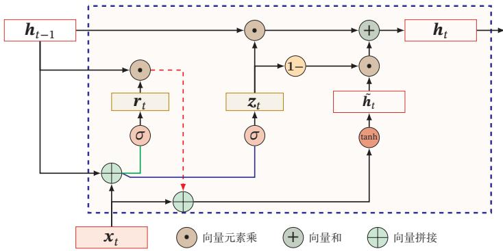  
图6.8 GRU网络的循环单元结构

## 6.7 深层循环神经网络

[¶0246] 如果将深度定义为网络中信息传递路径长度的话，循环神经网络可以看作既“深”又“浅”的网络．一方面来说，如果我们把循环网络按时间展开，长时间间隔的状态之间的路径很长，循环网络可以看作一个非常深的网络．从另一方面来说，如果同一时刻网络输入到输出之间的路径 $\mathbf x _ { t } \to \mathbf y _ { t }$ ，这个网络是非常浅的

[¶0247] 因此，我们可以增加循环神经网络的深度从而增强循环神经网络的能力．增加循环神经网络的深度主要是增加同一时刻网络输入到输出之间的路径 $x _ { t } $ $y _ { t }$ ，比如增加隐状态到输出 ${ \pmb h } _ { t }  { \pmb y } _ { t }$ ，以及输入到隐状态 $\mathbf { \boldsymbol { x } } _ { t } \to \mathbf { \boldsymbol { h } } _ { t }$ 之间的路径的深度

## 6.7.1 堆叠循环神经网络

[¶0248] 一种常见的增加循环神经网络深度的做法是将多个循环网络堆叠起来，称为堆叠循环神经网络（Stacked Recurrent Neural Network，SRNN）．一个堆叠的简单循环网络（Stacked SRN）也称为循环多层感知器（Recurrent Multi-Layer Perceptron，RMLP）[Parlos et al., 1991]

[¶0249] 参见习题6-6

[¶0250] 图6.9给出了按时间展开的堆叠循环神经网络．第??层网络的输入是第?? − 1层网络的输出．我们定义 ${ \pmb h } _ { t } ^ { ( l ) }$ 为在时刻??时第??层的隐状态

[¶0251]
$$
\pmb { h } _ { t } ^ { ( l ) } = f ( \pmb { U } ^ { ( l ) } \pmb { h } _ { t - 1 } ^ { ( l ) } + \pmb { W } ^ { ( l ) } \pmb { h } _ { t } ^ { ( l - 1 ) } + \pmb { b } ^ { ( l ) } ) ,\tag{6.70}
$$

[¶0252] 其中 $\pmb { U } ^ { ( l ) }$ $\mathbf { \Delta } W ^ { ( l ) }$ 和 $\mathbf { \delta } _ { \mathbf { \pmb { b } } } ( l )$ 为权重矩阵和偏置向量， ${ \pmb h } _ { t } ^ { ( 0 ) } = { \pmb x } _ { t }$

[¶0253]
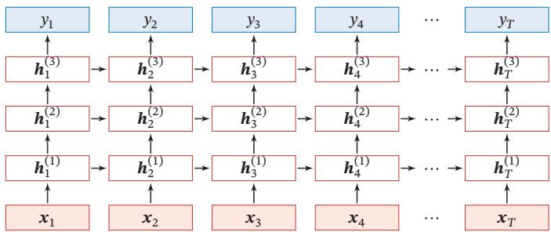  
图6.9 按时间展开的堆叠循环神经网络

## 6.7.2 双向循环神经网络

[¶0254] 在有些任务中，一个时刻的输出不但和过去时刻的信息有关，也和后续时刻的信息有关．比如给定一个句子，其中一个词的词性由它的上下文决定，即包含左右两边的信息．因此，在这些任务中，我们可以增加一个按照时间的逆序来传递信息的网络层，来增强网络的能力

[¶0255] 双向循环神经网络（Bidirectional Recurrent Neural Network，Bi-RNN）由两层循环神经网络组成，它们的输入相同，只是信息传递的方向不同

[¶0256] 假设第1层按时间顺序，第2层按时间逆序，在时刻??时的隐状态定义为 ${ \pmb h } _ { t } ^ { ( 1 ) }$ 和 ${ \pmb h } _ { t } ^ { ( 2 ) }$ ，则

[¶0257]
$$
\pmb { h } _ { t } ^ { ( 1 ) } = f ( \pmb { U } ^ { ( 1 ) } \pmb { h } _ { t - 1 } ^ { ( 1 ) } + \pmb { W } ^ { ( 1 ) } \pmb { x } _ { t } + \pmb { b } ^ { ( 1 ) } ) ,\tag{6.71}
$$

[¶0258]
$$
\pmb { h } _ { t } ^ { ( 2 ) } = f ( \pmb { U } ^ { ( 2 ) } \pmb { h } _ { t + 1 } ^ { ( 2 ) } + \pmb { W } ^ { ( 2 ) } \pmb { x } _ { t } + \pmb { b } ^ { ( 2 ) } ) ,\tag{6.72}
$$

[¶0259]
$$
\pmb { h } _ { t } = \pmb { h } _ { t } ^ { ( 1 ) } \oplus \pmb { h } _ { t } ^ { ( 2 ) } ,\tag{6.73}
$$

[¶0260] 其中⊕为向量拼接操作

[¶0261] 图6.10给出了按时间展开的双向循环神经网络

[¶0262]
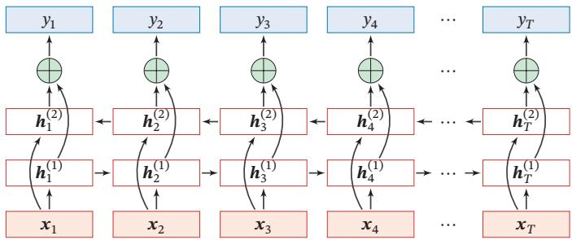  
图6.10 按时间展开的双向循环神经网络

## 6.8 扩展到图结构

[¶0263] 如果将循环神经网络按时间展开，每个时刻的隐状态 $\pmb { h } _ { t }$ 看作一个节点，那么这些节点构成一个链式结构，每个节点 ?? 都收到其父节点的消息（Message），更新自己的状态，并传递给其子节点．而链式结构是一种特殊的图结构，我们可以比较容易地将这种消息传递（Message Passing）的思想扩展到任意的图结构上

## 6.8.1 递归神经网络

[¶0264] 递归神经网络（Recursive Neural Network，RecNN）是循环神经网络在有向无循环图上的扩展[Pollack,1990]．递归神经网络的一般结构为树状的层次结构，如图6.11a所示

[¶0265]
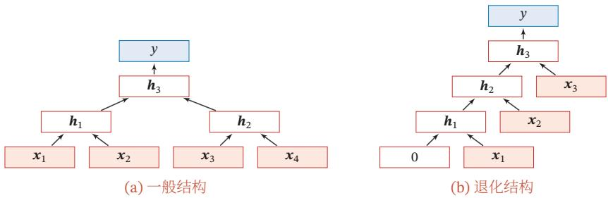  
图6.11 递归神经网络

[¶0266] 以图6.11a中的结构为例，有三个隐藏层 $\pmb { h } _ { 1 } , \pmb { h } _ { 2 }$ 和 $\pmb { h } _ { 3 }$ ，其中 $\pmb { h } _ { 1 }$ 由两个输入层$\mathbf { x } _ { 1 }$ 和 $\mathbf { \boldsymbol { x } } _ { 2 }$ 计算得到， $\pmb { h } _ { 2 }$ 由另外两个输入层 $\mathbf { \boldsymbol { x } } _ { 3 }$ 和 $x _ { 4 }$ 计算得到， $\pmb { h } _ { 3 }$ 由两个隐藏层 $\pmb { h } _ { 1 }$ 和 $\pmb { h } _ { 2 }$ 计算得到

[¶0267] 对于一个节点 $\pmb { h } _ { i }$ ，它可以接受来自父节点集合 $\pi _ { i }$ 中所有节点的消息，并更

[¶0268] 新自己的状态

[¶0269]
$$
\mathbf { } h _ { i } = f (  { \boldsymbol { h } } _ { \pi _ { i } } ) ,\tag{6.74}
$$

[¶0270] 其中 $\pmb { h } _ { \pi _ { i } }$ 表示集合 $\pi _ { i }$ 中所有节点状态的拼接， $f ( \cdot )$ 是一个和节点位置无关的非线性函数，可以为一个单层的前馈神经网络．比如图6.11a所示的递归神经网络具体可以写为

[¶0271]
$$
\begin{array} { r } { \pmb { h } _ { 1 } = \sigma ( \pmb { W } \left[ \begin{array} { l } { \pmb { x } _ { 1 } } \\ { \pmb { x } _ { 2 } } \end{array} \right] + \pmb { b } ) , } \end{array}\tag{6.75}
$$

[¶0272]
$$
\begin{array} { r } { \pmb { { h } } _ { 2 } = \sigma ( \pmb { W } \left[ \begin{array} { l } { \pmb { x } _ { 3 } } \\ { \pmb { x } _ { 4 } } \end{array} \right] + \pmb { b } ) , } \end{array}\tag{6.76}
$$

[¶0273]
$$
\begin{array} { r } { \pmb { h } _ { 3 } = \sigma ( \pmb { W } \left[ \begin{array} { c } { \pmb { h } _ { 1 } } \\ { \pmb { h } _ { 2 } } \end{array} \right] + \pmb { b } ) , } \end{array}\tag{6.77}
$$

[¶0274] 其中 $\sigma ( \cdot )$ 表示非线性激活函数， $\mathbf { \Delta } _ { W }$ 和??是可学习的参数．同样，输出层 $y$ 可以为一个分类器，比如

[¶0275]
$$
y = g ( W ^ { \prime } \pmb { h } _ { 3 } + \pmb { b } ^ { \prime } ) ,\tag{6.78}
$$

[¶0276] 其中 $g ( \cdot )$ 为分类器， $\mathbf { \overrightarrow { W } } ^ { \prime }$ 和 $\pmb { b } ^ { \prime }$ 为分类器的参数

[¶0277] 当递归神经网络的结构退化为线性序列结构（见图6.11b）时，递归神经网络就等价于简单循环网络

[¶0278] 参见习题6-7

[¶0279] 递归神经网络主要用来建模自然语言句子的语义[Socher et al., 2011, 2013]给定一个句子的语法结构（一般为树状结构），可以使用递归神经网络来按照句法的组合关系来合成一个句子的语义．句子中每个短语成分又可以分成一些子成分，即每个短语的语义都可以由它的子成分语义组合而来，并进而合成整句的语义

[¶0280] 同样，我们也可以用门控机制来改进递归神经网络中的长距离依赖问题，比如树结构的长短期记忆模型（Tree-Structured LSTM）[Tai et al., 2015; Zhuet al., 2015]就是将LSTM模型的思想应用到树结构的网络中，来实现更灵活的组合函数

## 6.8.2 图神经网络

[¶0281] 在实际应用中，很多数据是图结构的，比如知识图谱、社交网络、分子网络等．而前馈网络和反馈网络很难处理图结构的数据

[¶0282] 图神经网络（Graph Neural Network，GNN）是将消息传递的思想扩展到图结构数据上的神经网络

[¶0283] 对于一个任意的图结构??(??, ℰ)，其中??表示节点集合，ℰ表示边集合．每条边表示两个节点之间的依赖关系．节点之间的连接可以是有向的，也可以是无向的．图中每个节点??都用一组神经元来表示其状态 $\pmb { h } ^ { ( v ) }$ ，初始状态可以为节点??的输入特征 $\boldsymbol { x } ^ { ( v ) }$ ．每个节点可以收到来自相邻节点的消息，并更新自己的状态

[¶0284]
$$
{ \pmb m } _ { t } ^ { ( v ) } = \sum _ { u \in \mathcal { N } ( v ) } f ( \pmb { h } _ { t - 1 } ^ { ( v ) } , \pmb { h } _ { t - 1 } ^ { ( u ) } , \pmb { e } ^ { ( u , v ) } ) ,\tag{6.79}
$$

[¶0285]
$$
\pmb { h } _ { t } ^ { ( v ) } = g \big ( \pmb { h } _ { t - 1 } ^ { ( v ) } , \pmb { m } _ { t } ^ { ( v ) } \big ) ,\tag{6.80}
$$

[¶0286] 其中 $\mathcal { N } ( v )$ 表示节点??的邻居， ${ \pmb m } _ { t } ^ { ( v ) }$ 表示在第??时刻节点??收到的信息， $\pmb { e } ^ { ( u , v ) }$ 为边 $e ^ { ( u , v ) }$ 上的特征

[¶0287] 公式(6.79)和公式(6.80)是一种同步的更新方式，所有的结构同时接受信息并更新自己的状态．而对于有向图来说，使用异步的更新方式会更有效率，比如循环神经网络或递归神经网络．在整个图更新?? 次后，可以通过一个读出函数（Readout Function）??(⋅) 来得到整个网络的表示：

[¶0288]
$$
{ \bf o } _ { t } = g \big ( \{ h _ { T } ^ { ( v ) } | v \in \mathcal { V } \} \big ) .\tag{6.81}
$$

## 6.9 总结和深入阅读

[¶0289] 循环神经网络可以建模时间序列数据之间的相关性．和延时神经网络[Langet al., 1990; Waibel et al., 1989]以及有外部输入的非线性自回归模型[Leontaritiset al.,1985]相比，循环神经网络可以更方便地建模长时间间隔的相关性

[¶0290] 常用的循环神经网络的参数学习算法是BPTT算法[Werbos, 1990]，其计算时间和空间要求会随时间线性增长．为了提高效率，当输入序列的长度比较大时，可以使用带截断（truncated）的BPTT算法[Williams et al., 1990]，只计算固定时间间隔内的梯度回传

[¶0291] 一个完全连接的循环神经网络有着强大的计算和表示能力，可以近似任何非线性动力系统以及图灵机，解决所有的可计算问题．然而由于梯度爆炸和梯度消失问题，简单循环网络存在长期依赖问题[Bengio et al., 1994; Hochreiteret al., 2001]．为了解决这个问题，人们对循环神经网络进行了很多的改进，其中最有效的改进方式为引入门控机制，比如LSTM 网络 [Gers et al., 2000; Hochre-iter et al., 1997]和GRU网络[Chung et al., 2014]．当然还有一些其他方法，比如时钟循环神经网络（Clockwork RNN）[Koutnik et al., 2014]、乘法RNN[Sutskeveret al., 2011; Wu et al., 2016] 以及引入注意力机制等

[¶0292] 注 意 力 机 制 参 见第8.2节

[¶0293] LSTM网络是目前为止最成功的循环神经网络模型，成功应用在很多领域，比如语音识别、机器翻译 [Sutskever et al., 2014]、语音模型以及文本生成．LSTM网络通过引入线性连接来缓解长距离依赖问题．虽然LSTM网络取得了很大的成功，其结构的合理性一直受到广泛关注．人们不断尝试对其进行改进来寻找最优结构，比如减少门的数量、提高并行能力等．关于LSTM网络的分析可以参考文献 [Greff et al., 2017; Jozefowicz et al., 2015; Karpathy et al., 2015]

[¶0294] LSTM网络的线性连接以及门控机制是一种十分有效的避免梯度消失问题的方法．这种机制也可以用在深层的前馈网络中，比如残差网络[He et al., 2016]和高速网络[Srivastava et al., 2015]都通过引入线性连接来训练非常深的卷积网络．对于循环神经网格，这种机制也可以用在非时间维度上，比如Gird LSTM网络 [Kalchbrenner et al., 2015]、Depth Gated RNN[Chung et al., 2015] 等

[¶0295] 此外，循环神经网络可以很容易地扩展到更广义的图结构数据上，称为图网络[Scarselli et al., 2009]．递归神经网络是一种在有向无环图上的简单的图网络图网络是目前新兴的研究方向，还没有比较成熟的网络模型．在不同的网络结构以及任务上，都有很多不同的具体实现方式．其中比较有名的图网络模型包括图卷积网络（Graph Convolutional Network，GCN）[Kipf et al., 2016]、图注意力网络（Graph Attention Network，GAT）[Veličković et al., 2017]、消息传递神经网络（Message Passing Neural Network，MPNN）[Gilmer et al., 2017] 等．关于图网络的综述可以参考文献 [Battaglia et al., 2018]

## 习题

[¶0296] 习题6-1 分析延时神经网络、卷积神经网络和循环神经网络的异同点

[¶0297] 习题 6-2 推导公式 (6.40) 和公式 (6.41) 中的梯度

[¶0298] 习题6-3 当使用公式(6.50)作为循环神经网络的状态更新公式时，分析其可能存在梯度爆炸的原因并给出解决方法

[¶0299] 习题6-4 推导LSTM网络中参数的梯度，并分析其避免梯度消失的效果

[¶0300] 习题6-5 推导GRU网络中参数的梯度，并分析其避免梯度消失的效果

[¶0301] 习题6-6 除了堆叠循环神经网络外，还有什么结构可以增加循环神经网络深度？

[¶0302] 习题6-7 证明当递归神经网络的结构退化为线性序列结构时，递归神经网络就等价于简单循环神经网络

## 参考文献

[¶0303] Battaglia P W, Hamrick J B, Bapst V, et al., 2018. Relational inductive biases, deep learning, and graph networks[J]. arXiv preprint arXiv:1806.01261.

[¶0304] Bengio Y, Simard P, Frasconi P, 1994. Learning long-term dependencies with gradient descent is difficult[J]. Neural Networks, IEEE Transactions on, 5(2):157-166.

[¶0305] Cho K, Van Merriënboer B, Gulcehre C, et al., 2014. Learning phrase representations using RNN encoder-decoder for statistical machine translation[J]. arXiv preprint arXiv:1406.1078.

[¶0306] Chung J, Gulcehre C, Cho K, et al., 2014. Empirical evaluation of gated recurrent neural networks on sequence modeling[J]. arXiv preprint arXiv:1412.3555.

[¶0307] Chung J, Gulcehre C, Cho K, et al., 2015. Gated feedback recurrent neural networks[C]// International Conference on Machine Learning. 2067-2075.

[¶0308] Elman J L, 1990. Finding structure in time[J]. Cognitive science, 14(2):179-211.

[¶0309] Gers F A, Schmidhuber J, Cummins F, 2000. Learning to forget: Continual prediction with lstm[J]. Neural Computation.

[¶0310] Gilmer J, Schoenholz S S, Riley P F, et al., 2017. Neural message passing for quantum chemistry[J]. arXiv preprint arXiv:1704.01212.

[¶0311] Greff K, Srivastava R K, Koutník J, et al., 2017. Lstm: A search space odyssey[J]. IEEE transactions on neural networks and learning systems.

[¶0312] Haykin S, 2009. Neural networks and learning machines[M]. 3rd edition. Pearson.

[¶0313] He K, Zhang X, Ren S, et al., 2016. Deep residual learning for image recognition[C]//Proceedings of the IEEE conference on computer vision and pattern recognition. 770-778.

[¶0314] Hochreiter S, Schmidhuber J, 1997. Long short-term memory[J]. Neural computation, 9(8):1735- 1780.

[¶0315] Hochreiter S, Bengio Y, Frasconi P, et al., 2001. Gradient flow in recurrent nets: The difficulty of learning longterm dependencies[M/OL]//Kolen J F, Kremer S C. A Field Guide to Dynamical Recurrent Networks. IEEE: 237-243. https://ieeexplore.ieee.org/document/5264952.

[¶0316] Jozefowicz R, Zaremba W, Sutskever I, 2015. An empirical exploration of recurrent network architectures[C]//Proceedings of the 32nd International Conference on Machine Learning. 2342-2350.

[¶0317] Kalchbrenner N, Danihelka I, Graves A, 2015. Grid long short-term memory[J]. arXiv preprint arXiv:1507.01526.

[¶0318] Karpathy A, Johnson J, Fei-Fei L, 2015. Visualizing and understanding recurrent networks[J]. arXiv preprint arXiv:1506.02078.

[¶0319] Kipf T N, Welling M, 2016. Semi-supervised classification with graph convolutional networks[J]. arXiv preprint arXiv:1609.02907.

[¶0320] Koutnik J, Greff K, Gomez F, et al., 2014. A clockwork rnn[C]//Proceedings of The 31st International Conference on Machine Learning. 1863-1871.

[¶0321] Lang K J, Waibel A H, Hinton G E, 1990. A time-delay neural network architecture for isolated word recognition[J]. Neural networks, 3(1):23-43.

[¶0322] Leontaritis I, Billings S A, 1985. Input-output parametric models for non-linear systems part i: deterministic non-linear systems[J]. International journal of control, 41(2):303-328.

[¶0323] Parlos A, Atiya A, Chong K, et al., 1991. Recurrent multilayer perceptron for nonlinear system identification[C]//International Joint Conference on Neural Networks: volume 2. IEEE: 537-540.

[¶0324] Pollack J B, 1990. Recursive distributed representations[J]. Artificial Intelligence, 46(1):77-105.

[¶0325] Scarselli F, Gori M, Tsoi A C, et al., 2009. The graph neural network model[J]. IEEE Transactions on Neural Networks, 20(1):61-80.

[¶0326] https://nndl.github.io/

[¶0327] Schäfer A M, Zimmermann H G, 2006. Recurrent neural networks are universal approximators[C]// International Conference on Artificial Neural Networks. Springer: 632-640.

[¶0328] Siegelmann H T, Sontag E D, 1991. Turing computability with neural nets[J]. Applied Mathematics Letters, 4(6):77-80.

[¶0329] Socher R, Lin C C, Manning C, et al., 2011. Parsing natural scenes and natural language with recursive neural networks[C]//Proceedings of the International Conference on Machine Learning.

[¶0330] Socher R, Perelygin A, Wu J Y, et al., 2013. Recursive deep models for semantic compositionality over a sentiment treebank[C]//Proceedings of EMNLP.

[¶0331] Srivastava R K, Greff K, Schmidhuber J, 2015. Highway networks[J]. arXiv preprint arXiv:1505.00387.

[¶0332] Sutskever I, Martens J, Hinton G E, 2011. Generating text with recurrent neural networks[C]// Proceedings of the 28th International Conference on Machine Learning. 1017-1024.

[¶0333] Sutskever I, Vinyals O, Le Q V, 2014. Sequence to sequence learning with neural networks[C]// Advances in Neural Information Processing Systems. 3104-3112.

[¶0334] Tai K S, Socher R, Manning C D, 2015. Improved semantic representations from tree-structured long short-term memory networks[C]//Proceedings of the 53rd Annual Meeting of the Association for Computational Linguistics.

[¶0335] Veličković P, Cucurull G, Casanova A, et al., 2017. Graph attention networks[J]. arXiv preprint arXiv:1710.10903.

[¶0336] Waibel A, Hanazawa T, Hinton G, et al., 1989. Phoneme recognition using time-delay neural networks[J]. IEEE transactions on acoustics, speech, and signal processing, 37(3):328-339.

[¶0337] Werbos P J, 1990. Backpropagation through time: what it does and how to do it[J]. Proceedings of the IEEE, 78(10):1550-1560.

[¶0338] Williams R J, Peng J, 1990. An efficient gradient-based algorithm for on-line training of recurrent network trajectories[J]. Neural computation, 2(4):490-501.

[¶0339] Williams R J, Zipser D, 1995. Gradient-based learning algorithms for recurrent networks and their computational complexity[J]. Backpropagation: Theory, architectures, and applications, 1:433- 486.

[¶0340] Wu Y, Zhang S, Zhang Y, et al., 2016. On multiplicative integration with recurrent neural networks [C]//Advances in neural information processing systems. 2856-2864.

[¶0341] Zhu X, Sobihani P, Guo H, 2015. Long short-term memory over recursive structures[C]//Proceedings of LCML. 1604-1612.
