# 第7章 网络优化与正则化

[¶0001] 任何数学技巧都不能弥补信息的缺失

[¶0002] 科尼利厄斯·兰佐斯（Cornelius Lanczos）

[¶0003] 匈牙利数学家、物理学家

[¶0004] 虽然神经网络具有非常强的表达能力，但是当应用神经网络模型到机器学习时依然存在一些难点问题．主要分为两大类：

[¶0005] （1） 优化问题：深度神经网络的优化十分困难．首先，神经网络的损失函数是一个非凸函数，找到全局最优解通常比较困难．其次，深度神经网络的参数通常非常多，训练数据也比较大，因此也无法使用计算代价很高的二阶优化方法，而一阶优化方法的训练效率通常比较低．此外，深度神经网络存在梯度消失或爆炸问题，导致基于梯度的优化方法经常失效

[¶0006] （2） 泛化问题：由于深度神经网络的复杂度比较高，并且拟合能力很强，很容易在训练集上产生过拟合．因此在训练深度神经网络时，同时也需要通过一定的正则化方法来改进网络的泛化能力

[¶0007] 目前，研究者从大量的实践中总结了一些经验方法，在神经网络的表示能力、复杂度、学习效率和泛化能力之间找到比较好的平衡，并得到一个好的网络模型．本章从网络优化和网络正则化两个方面来介绍这些方法．在网络优化方面，介绍一些常用的优化算法、参数初始化方法、数据预处理方法、逐层归一化方法和超参数优化方法．在网络正则化方面，介绍一些提高网络泛化能力的方法，包括 $\ell _ { 1 }$ 和 $\ell _ { 2 }$ 正则化、权重衰减、提前停止、丢弃法、数据增强和标签平滑

## 7.1 网络优化

[¶0008] 网络优化是指寻找一个神经网络模型来使得经验（或结构）风险最小化的过程，包括模型选择以及参数学习等．深度神经网络是一个高度非线性的模型，

[¶0009] 其风险函数是一个非凸函数，因此风险最小化是一个非凸优化问题．此外，深度神经网络还存在梯度消失问题．因此，深度神经网络的优化是一个具有挑战性的问题．本节概要地介绍神经网络优化的一些特点和改善方法

## 7.1.1 网络结构多样性

[¶0010] 神经网络的种类非常多，比如卷积网络、循环网络、图网络等．不同网络的结构也非常不同，有些比较深，有些比较宽．不同参数在网络中的作用也有很大的差异，比如连接权重和偏置的不同，以及循环网络中循环连接上的权重和其他权重的不同

[¶0011] 由于网络结构的多样性，我们很难找到一种通用的优化方法．不同优化方法在不同网络结构上的表现也有比较大的差异

[¶0012] 此外，网络的超参数一般比较多，这也给优化带来很大的挑战

## 7.1.2 高维变量的非凸优化

[¶0013] 低维空间的非凸优化问题主要是存在一些局部最优点．基于梯度下降的优化方法会陷入局部最优点，因此在低维空间中非凸优化的主要难点是如何选择初始化参数和逃离局部最优点．深度神经网络的参数非常多，其参数学习是在非常高维空间中的非凸优化问题，其挑战和在低维空间中的非凸优化问题有所不同

[¶0014] 鞍点 在高维空间中，非凸优化的难点并不在于如何逃离局部最优点，而是如何逃离鞍点（Saddle Point）[Dauphin et al., 2014]．鞍点的梯度是 0，但是在一些维度上是最高点，在另一些维度上是最低点，如图7.1所示

[¶0015]
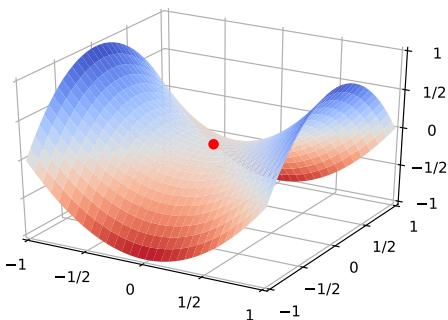  
图7.1 鞍点示例

[¶0016] 鞍点的叫法是因为其形状像马鞍．鞍点的特征是一阶梯度为0，但是二阶梯度的Hessian矩阵不是半正定矩阵，参见定理C.2

[¶0017] 在高维空间中，局部最小值（Local Minima）要求在每一维度上都是最低点，这种概率非常低．假设网络有10, 000维参数，梯度为0的点（即驻点（Sta- 在一般的非凸问题中，tionary Point））在某一维上是局部最小值的概率为??，那么在整个参数空间中， $p \approx 0 . 5 .$ https://nndl.github.io/

[¶0018] 驻点是局部最优点的概率为 $p ^ { 1 0 , 0 0 0 }$ ，这种可能性非常小．也就是说，在高维空间中大部分驻点都是鞍点

[¶0019] 基于梯度下降的优化方法会在鞍点附近接近于停滞，很难从这些鞍点中逃离．因此，随机梯度下降对于高维空间中的非凸优化问题十分重要，通过在梯度方向上引入随机性，可以有效地逃离鞍点

[¶0020] 平坦最小值 深度神经网络的参数非常多，并且有一定的冗余性，这使得每单个参数对最终损失的影响都比较小，因此会导致损失函数在局部最小解附近通常是一个平坦的区域，称为平坦最小值（Flat Minima）[Hochreiter et al., 1997; Liet al., 2017a]．图7.2给出了平坦最小值和尖锐最小值（Sharp Minima）的示例

[¶0021]
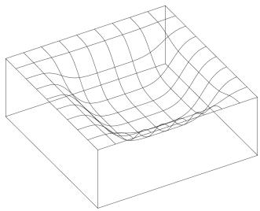  
(a)平坦最小值

[¶0022]
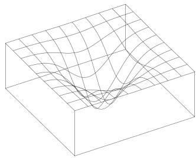  
(b)尖锐最小值  
图 7.2 平坦最小值和尖锐最小值的示例（图片来源：[Hochreiter et al., 1997]）

[¶0023] 在一个平坦最小值的邻域内，所有点对应的训练损失都比较接近，表明我们在训练神经网络时，不需要精确地找到一个局部最小解，只要在一个局部最小解的邻域内就足够了．平坦最小值通常被认为和模型泛化能力有一定的关系．一般而言，当一个模型收敛到一个平坦的局部最小值时，其鲁棒性会更好，即微小的参数变动不会剧烈影响模型能力；而当一个模型收敛到一个尖锐的局部最小值时，其鲁棒性也会比较差．具备良好泛化能力的模型通常应该是鲁棒的，因此理想的局部最小值应该是平坦的

[¶0024] 这里的很多描述都是经验性的，并没有很好的理论证明

[¶0025] 局部最小解的等价性 在非常大的神经网络中，大部分的局部最小解是等价的，它们在测试集上性能都比较相似．此外，局部最小解对应的训练损失都可能非常接近于全局最小解对应的训练损失 [Choromanska et al., 2015]．虽然神经网络有一定概率收敛于比较差的局部最小值，但随着网络规模增加，网络陷入比较差的局部最小值的概率会大大降低．在训练神经网络时，我们通常没有必要找全局最小值，这反而可能导致过拟合

## 7.1.3 神经网络优化的改善方法

[¶0026] 改善神经网络优化的目标是找到更好的局部最小值和提高优化效率．目前比较有效的经验性改善方法通常分为以下几个方面：

[¶0027] （1） 使用更有效的优化算法（第7.2节）来提高梯度下降优化方法的效率和稳定性，比如动态学习率调整、梯度估计修正等

[¶0028] （2） 使用更好的参数初始化方法（第7.3节）、数据预处理方法（第7.4节）来提高优化效率

[¶0029] （3） 修改网络结构来得到更好的优化地形（Optimization Landscape），比如使用ReLU激活函数、残差连接、逐层归一化（第7.5节）等

[¶0030] （4） 使用更好的超参数优化方法（第7.6节）

[¶0031] 优化地形指在高维空间中损失函数的曲面形状．好的优化地形通常比较平滑

[¶0032] 通过上面的方法，我们通常可以高效地、端到端地训练一个深度神经网络

## 7.2 优化算法

[¶0033] 目前，深度神经网络的参数学习主要是通过梯度下降法来寻找一组可以最小化结构风险的参数．在具体实现中，梯度下降法可以分为：批量梯度下降、随机梯度下降以及小批量梯度下降三种形式．根据不同的数据量和参数量，可以选择一种具体的实现形式．本节介绍一些在训练神经网络时常用的优化算法．这些优化算法大体上可以分为两类：1）调整学习率，使得优化更稳定；2）梯度估计修正，优化训练速度

## 7.2.1 小批量梯度下降

[¶0034] 在训练深度神经网络时，训练数据的规模通常都比较大．如果在梯度下降时，每次迭代都要计算整个训练数据上的梯度，这就需要比较多的计算资源．另外大规模训练集中的数据通常会非常冗余，也没有必要在整个训练集上计算梯度．因此，在训练深度神经网络时，经常使用小批量梯度下降法（Mini-BatchGradient Descent）

[¶0035] 令 $f ( \pmb { x } ; \theta )$ 表示一个深度神经网络，??为网络参数，在使用小批量梯度下降进行优化时，每次选取??个训练样本 $\mathcal { S } _ { t } = \{ ( \boldsymbol { x } ^ { ( k ) } , \boldsymbol { y } ^ { ( k ) } ) \} _ { k = 1 } ^ { K }$ ．第 ?? 次迭代（Iteration）时损失函数关于参数??的偏导数为

[¶0036]
$$
{ \mathfrak { g } } _ { t } ( \theta ) = { \frac { 1 } { K } } \sum _ { ( \pmb { x } , \pmb { y } ) \in \mathscr { S } _ { t } } \frac { \partial \mathscr { L } \big ( \pmb { y } , f ( \pmb { x } ; \theta ) \big ) } { \partial \theta } ,\tag{7.1}
$$

[¶0037] 这里的损失函数忽略了正则化项．加上 $\ell _ { p }$ 正则化的损失函数参见第7.7.1节

[¶0038] 其中ℒ(⋅)为可微分的损失函数，??称为批量大小（Batch Size）

[¶0039] 第??次更新的梯度 $\mathbf { g } _ { t }$ 定义为

[¶0040]
$$
\mathbf { g } _ { t } \triangleq \mathfrak { g } _ { t } ( \theta _ { t - 1 } ) .\tag{7.2}
$$

[¶0041] 使用梯度下降来更新参数，

[¶0042]
$$
\begin{array} { r } { \theta _ { t }  \theta _ { t - 1 } - \alpha \mathbf { g } _ { t } , } \end{array}\tag{7.3}
$$

[¶0043] 其中 $\alpha > 0$ 为学习率

[¶0044] 每次迭代时参数更新的差值 $\Delta \theta _ { t }$ 定义为

[¶0045]
$$
\Delta \theta _ { t } \triangleq \theta _ { t } - \theta _ { t - 1 } .\tag{7.4}
$$

[¶0046] $\Delta \theta _ { t }$ 和梯度 ${ \pmb g } _ { t }$ 并不需要完全一致． $\Delta \theta _ { t }$ 为每次迭代时参数的实际更新方向，即$\theta _ { t } = \theta _ { t - 1 } + \Delta \theta _ { t }$ ．在标准的小批量梯度下降中， $\Delta \theta _ { t } = - \alpha \mathbf { g } _ { t }$

[¶0047] 从上面公式可以看出，影响小批量梯度下降法的主要因素有：1）批量大小??、2）学习率??、3）梯度估计．为了更有效地训练深度神经网络，在标准的小批量梯度下降法的基础上，也经常使用一些改进方法以加快优化速度，比如如何选择批量大小、如何调整学习率以及如何修正梯度估计．我们分别从这三个方面来介绍在神经网络优化中常用的算法．这些改进的优化算法也同样可以应用在批量或随机梯度下降法上

## 7.2.2 批量大小选择

[¶0048] 在小批量梯度下降法中，批量大小（Batch Size）对网络优化的影响也非常大．一般而言，批量大小不影响随机梯度的期望，但是会影响随机梯度的方差．批量大小越大，随机梯度的方差越小，引入的噪声也越小，训练也越稳定，因此可以设置较大的学习率．而批量大小较小时，需要设置较小的学习率，否则模型会不收敛．学习率通常要随着批量大小的增大而相应地增大．一个简单有效的方法是线性缩放规则（Linear Scaling Rule）[Goyal et al., 2017]：当批量大小增加 ??倍时，学习率也增加??倍．线性缩放规则往往在批量大小比较小时适用，当批量大小非常大时，线性缩放会使得训练不稳定

[¶0049] 参见习题7-1

[¶0050] 参见第7.2.3.2节

[¶0051] 图7.3给出了从回合（Epoch）和迭代（Iteration）的角度，批量大小对损失下降的影响．每一次小批量更新为一次迭代，所有训练集的样本更新一遍为一个回合，两者的关系为

[¶0052]
$$
1 \boxed { \begin{array} { r c l } { 1 \boxplus \boxed { \begin{array} { c } { \boxplus } \end{array} } \left( \mathrm { E p o c h } \right) } & { = \left( \frac { \beth \boxed { \left[ \underline { { \xi } } \underline { { \mathcal { F } } } \right] \times \underline { { \xi } } \underline { { \mathcal { F } } } \dotsc \boxed { \underline { { \theta } } } \underline { { \mathcal { F } } } \dotsc \underline { { \theta } } } } { \beth \boxed { \underline { { \xi } } } \dotsc \dotsc \dotsc \dotsc \dotsc } \right) \times \nwarrow \nwarrow \nmid \mathrm { \mathcal { E } } \pmod { \mathrm { ~ . ~ } } } \end{array} }
$$

[¶0053]
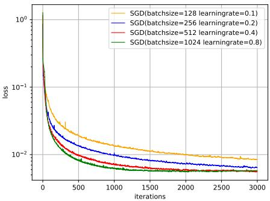  
(a) 按迭代（Iteration）的损失变化

[¶0054]
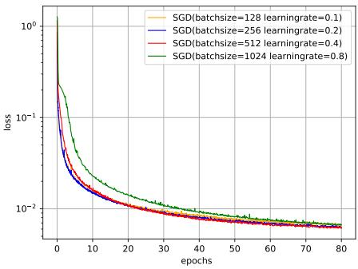  
(b)按回合（Epoch）的损失变化

[¶0055] 值得注意的是，图7.3中的4种批量大小对应的学习率设置不同，因此并不是严格对比

[¶0056] 图7.3 在MNIST数据集上批量大小对损失下降的影响

[¶0057] 从图7.3a可以看出，批量大小越大，下降效果越明显，并且下降曲线越平滑但从图7.3b可以看出，如果按整个数据集上的回合（Epoch）数来看，则是批量样本数越小，下降效果越明显．适当小的批量会导致更快的收敛

[¶0058] 此外，批量大小和模型的泛化能力也有一定的关系．[Keskar et al., 2016]通过实验发现：批量越大，越有可能收敛到尖锐最小值；批量越小，越有可能收敛到平坦最小值

## 7.2.3 学习率调整

[¶0059] 学习率是神经网络优化时的重要超参数．在梯度下降法中，学习率 $\alpha$ 的取值非常关键，如果过大就不会收敛，如果过小则收敛速度太慢．常用的学习率调整方法包括学习率衰减、学习率预热、周期性学习率调整以及一些自适应调整学习率的方法，比如 AdaGrad、RMSprop、AdaDelta 等．自适应学习率方法可以针对每个参数设置不同的学习率

## 7.2.3.1 学习率衰减

[¶0060] 从经验上看，学习率在一开始要保持大些来保证收敛速度，在收敛到最优点附近时要小些以避免来回振荡．比较简单的学习率调整可以通过学习率衰减（Learning Rate Decay）的方式来实现，也称为学习率退火（Learning Rate An-nealing）

[¶0061] 不失一般性，这里的衰减方式设置为按迭代次数进行衰减

[¶0062] 学习率衰减是按每次迭代（Iteration）进行，也可以按每??次迭代或每个回合（Epoch）进行．衰减率通常和总迭代次数相关

[¶0063] 假设初始化学习率为 $\alpha _ { 0 }$ ，在第??次迭代时的学习率 $\alpha _ { t }$ ．常见的衰减方法有以下几种：

[¶0064] 分段常数衰减（Piecewise Constant Decay）：即每经过 $T _ { 1 } , T _ { 2 } , \cdots , T _ { m }$ 次迭代将学习率衰减为原来的 $\beta _ { 1 } , \beta _ { 2 } , \cdots , \beta _ { m }$ 倍，其中 $T _ { m }$ 和 $\beta _ { m } < 1$ 为根据经验设置https://nndl.github.io/

[¶0065] 的超参数．分段常数衰减也称为阶梯衰减（Step Decay）

[¶0066] 逆时衰减（Inverse Time Decay）：

[¶0067]
$$
\alpha _ { t } = \alpha _ { 0 } \frac { 1 } { 1 + \beta \times t } ,\tag{7.5}
$$

[¶0068] 其中 $\beta$ 为衰减率

[¶0069] 指数衰减（Exponential Decay）：

[¶0070]
$$
\alpha _ { t } = \alpha _ { 0 } \beta ^ { t } ,\tag{7.6}
$$

[¶0071] 其中 $\beta < 1$ 为衰减率

[¶0072] 自然指数衰减（Natural Exponential Decay）：

[¶0073]
$$
\alpha _ { t } = \alpha _ { 0 } \exp ( - \beta \times t ) ,\tag{7.7}
$$

[¶0074] 其中 $\beta$ 为衰减率

[¶0075] 余弦衰减（Cosine Decay）：

[¶0076]
$$
\alpha _ { t } = \frac { 1 } { 2 } \alpha _ { 0 } \Big ( 1 + \cos \big ( \frac { t \pi } { T } \big ) \Big ) ,\tag{7.8}
$$

[¶0077] 其中 $T$ 为总的迭代次数

[¶0078] 图7.4给出了不同衰减方法的示例（假设初始学习率为1）

[¶0079]
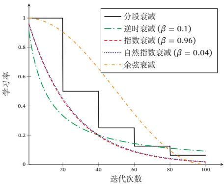  
图7.4 不同学习率衰减方法的比较

## 7.2.3.2 学习率预热

[¶0080] 在小批量梯度下降法中，当批量大小的设置比较大时，通常需要比较大的学习率．但在刚开始训练时，由于参数是随机初始化的，梯度往往也比较大，再加上比较大的初始学习率，会使得训练不稳定

[¶0081] 为了提高训练稳定性，我们可以在最初几轮迭代时，采用比较小的学习率，等梯度下降到一定程度后再恢复到初始的学习率，这种方法称为学习率预热（Learning Rate Warmup）

[¶0082] 一个常用的学习率预热方法是逐渐预热（Gradual Warmup）[Goyal et al.,2017]．假设预热的迭代次数为 $T ^ { \prime }$ ，初始学习率为 $\alpha _ { 0 }$ ，在预热过程中，每次更新的学习率为

[¶0083]
$$
\alpha _ { t } ^ { \prime } = \frac { t } { T ^ { \prime } } \alpha _ { 0 } , \qquad 1 \leq t \leq T ^ { \prime } .\tag{7.9}
$$

[¶0084] 当预热过程结束，再选择一种学习率衰减方法来逐渐降低学习率

## 7.2.3.3 周期性学习率调整

[¶0085] 为了使得梯度下降法能够逃离鞍点或尖锐最小值，一种经验性的方式是在训练过程中周期性地增大学习率．当参数处于尖锐最小值附近时，增大学习率有助于逃离尖锐最小值；当参数处于平坦最小值附近时，增大学习率依然有可能在该平坦最小值的吸引域（Basin of Attraction）内．因此，周期性地增大学习率虽然可能短期内损害优化过程，使得网络收敛的稳定性变差，但从长期来看有助于找到更好的局部最优解

[¶0086] 本节介绍两种常用的周期性调整学习率的方法：循环学习率和带热重启的随机梯度下降

[¶0087] 循环学习率 一种简单的方法是使用循环学习率（Cyclic Learning Rate）[Goyalet al., 2017]，即让学习率在一个区间内周期性地增大和缩小．通常可以使用线性缩放来调整学习率，称为三角循环学习率（Triangular Cyclic Learning Rate）假设每个循环周期的长度相等都为2Δ??，其中前 $\Delta T$ 步为学习率线性增大阶段，后 $\Delta T$ 步为学习率线性缩小阶段．在第??次迭代时，其所在的循环周期数??为

[¶0088]
$$
m = \lfloor 1 + \frac { t } { 2 \Delta T } \rfloor ,\tag{7.10}
$$

[¶0089] 其中⌊⋅⌋表示“向下取整”函数．第??次迭代的学习率为

[¶0090]
$$
\alpha _ { t } = \alpha _ { m i n } ^ { m } + ( \alpha _ { m a x } ^ { m } - \alpha _ { m i n } ^ { m } ) \big ( \operatorname* { m a x } ( 0 , 1 - b ) \big ) ,\tag{7.11}
$$

[¶0091] 其中 $\alpha _ { m a x } ^ { m }$ 和 ${ \alpha } _ { m i n } ^ { m }$ 分别为第??个周期中学习率的上界和下界，可以随着??的增大而逐渐降低； $b \in [ 0 , 1 ]$ 的计算为

[¶0092]
$$
b = | \frac { t } { \Delta T } - 2 m + 1 | .\tag{7.12}
$$

[¶0093] 带热重启的随机梯度下降 带热重启的随机梯度下降（Stochastic Gradient Descent with Warm Restarts，SGDR）[Loshchilov et al., 2017a] 是用热重启方式来 https://nndl.github.io/

[¶0094] 替代学习率衰减的方法．学习率每间隔一定周期后重新初始化为某个预先设定值，然后逐渐衰减．每次重启后模型参数不是从头开始优化，而是从重启前的参数基础上继续优化

[¶0095] 假设在梯度下降过程中重启??次，第??次重启在上次重启开始第 $T _ { m }$ 个回合后进行， $T _ { m }$ 称为重启周期．在第??次重启之前，采用余弦衰减来降低学习率第??次迭代的学习率为

[¶0096]
$$
\alpha _ { t } = \alpha _ { m i n } ^ { m } + \frac { 1 } { 2 } ( \alpha _ { m a x } ^ { m } - \alpha _ { m i n } ^ { m } ) \Bigl ( 1 + \cos \bigl ( \frac { T _ { c u r } } { T _ { m } } \pi \bigr ) \Bigr ) ,\tag{7.13}
$$

[¶0097] 当 $\alpha _ { m a x } ^ { m } = \alpha _ { 0 } , \alpha _ { m i n } ^ { m } =$ 0， 并 不 进 行 重 启时，公式(7.13)退化为公式(7.8)

[¶0098] 其中 $\alpha _ { m a x } ^ { m }$ 和 ${ \alpha } _ { m i n } ^ { m }$ 分别为第??个周期中学习率的上界和下界，可以随着??的增大而逐渐降低； $T _ { c u r }$ 为从上次重启之后的回合（Epoch）数 $T _ { c u r }$ 可以取小数，比如0.1、0.2等，这样可以在一个回合内部进行学习率衰减．重启周期 $T _ { m }$ 可以随着重启次数逐渐增加，比如 $T _ { m } = T _ { m - 1 } \times \kappa$ ，其中 $\kappa \geq 1$ 为放大因子

[¶0099] 图7.5给出了两种周期性学习率调整的示例（假设初始学习率为1），每个周期中学习率的上界也逐步衰减

[¶0100]
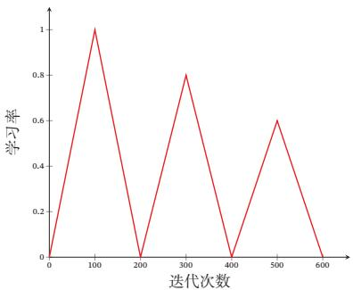  
(a)三角循环学习率

[¶0101]
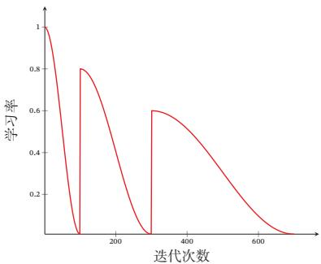  
(b)带热重启的余弦衰减  
图7.5 周期性学习率调整

## 7.2.3.4 AdaGrad 算法

[¶0102] 在标准的梯度下降法中，每个参数在每次迭代时都使用相同的学习率．由于每个参数的维度上收敛速度都不相同，因此根据不同参数的收敛情况分别设置学习率．

[¶0103] AdaGrad 算法（Adaptive Gradient Algorithm）[Duchi et al., 2011] 是借鉴$\ell _ { 2 }$ 正则化的思想，每次迭代时自适应地调整每个参数的学习率．在第??次迭代时，先计算每个参数梯度平方的累计值

[¶0104]
$$
G _ { t } = \sum _ { \tau = 1 } ^ { t } \mathbf { g } _ { \tau } \odot \mathbf { g } _ { \tau } ,\tag{7.14}
$$

[¶0105] https://nndl.github.io/

[¶0106] 其中 $\odot$ 为按元素乘积， $\mathbf { g } _ { \tau } \in \mathbb { R } ^ { | \boldsymbol { \theta } | }$ 是第??次迭代时的梯度

[¶0107] AdaGrad算法的参数更新差值为

[¶0108]
$$
\Delta \theta _ { t } = - \frac { \alpha } { \sqrt { G _ { t } + \epsilon } } \odot { \bf g } _ { t } ,\tag{7.15}
$$

[¶0109] 其中 $\alpha$ 是初始的学习率，??是为了保持数值稳定性而设置的非常小的常数，一般取值 $\mathrm { e } ^ { - 7 }$ 到 $\mathrm { e } ^ { - 1 0 }$ ．此外，这里的开平方、除、加运算都是按元素进行的操作

[¶0110] 在AdaGrad算法中，如果某个参数的偏导数累积比较大，其学习率相对较小；相反，如果其偏导数累积较小，其学习率相对较大．但整体是随着迭代次数的增加，学习率逐渐缩小

[¶0111] AdaGrad算法的缺点是在经过一定次数的迭代依然没有找到最优点时，由于这时的学习率已经非常小，很难再继续找到最优点

## 7.2.3.5 RMSprop 算法

[¶0112] RMSprop 算法是 Geoff Hinton 提出的一种自适应学习率的方法 [Tielemanet al., 2012]，可以在有些情况下避免AdaGrad算法中学习率不断单调下降以至于过早衰减的缺点

[¶0113] RMSprop算法首先计算每次迭代梯度 ${ \pmb g } _ { t }$ 平方的指数衰减移动平均，

[¶0114]
$$
G _ { t } = \beta G _ { t - 1 } + ( 1 - \beta ) \mathbf { g } _ { t } \odot \mathbf { g } _ { t }\tag{7.16}
$$

[¶0115]
$$
= ( 1 - \beta ) \sum _ { \tau = 1 } ^ { t } \beta ^ { t - \tau } { \bf g } _ { \tau } \odot { \bf g } _ { \tau } ,\tag{7.17}
$$

[¶0116] 其中 $\beta$ 为衰减率，一般取值为0.9

[¶0117] RMSprop算法的参数更新差值为

[¶0118]
$$
\Delta \theta _ { t } = - \frac { \alpha } { \sqrt { G _ { t } + \epsilon } } \odot { \bf g } _ { t } ,\tag{7.18}
$$

[¶0119] 其中??是初始的学习率，比如0.001

[¶0120] 从上式可以看出，RMSProp算法和AdaGrad算法的区别在于 $G _ { t }$ 的计算由累积方式变成了指数衰减移动平均．在迭代过程中，每个参数的学习率并不是呈衰减趋势，既可以变小也可以变大

## 7.2.3.6 AdaDelta 算法

[¶0121] AdaDelta 算法[Zeiler, 2012] 也是 AdaGrad 算法的一个改进．和 RMSprop算法类似，AdaDelta算法通过梯度平方的指数衰减移动平均来调整学习率．此外，AdaDelta算法还引入了每次参数更新差值 $\Delta \theta$ 的平方的指数衰减权移动平均

[¶0122] 第??次迭代时，参数更新差值 $\Delta \theta$ 的平方的指数衰减权移动平均为

[¶0123]
$$
\Delta X _ { t - 1 } ^ { 2 } = \beta _ { 1 } \Delta X _ { t - 2 } ^ { 2 } + ( 1 - \beta _ { 1 } ) \Delta \theta _ { t - 1 } \odot \Delta \theta _ { t - 1 } ,\tag{7.19}
$$

[¶0124] 其中 $\beta _ { 1 }$ 为衰减率．此时 $\Delta \theta _ { t }$ 还未知，因此只能计算到 $\Delta X _ { t - 1 }$

[¶0125] AdaDelta算法的参数更新差值为

[¶0126]
$$
\Delta \theta _ { t } = - \frac { \sqrt { \Delta X _ { t - 1 } ^ { 2 } + \epsilon } } { \sqrt { G _ { t } + \epsilon } } \mathbf { g } _ { t } ,\tag{7.20}
$$

[¶0127] 其中 $G _ { t }$ 的计算方式和RMSprop算法一样（公式(7.16)）， $\Delta X _ { t - 1 } ^ { 2 }$ 为参数更新差值$\Delta \theta$ 的指数衰减权移动平均

[¶0128] 从上式可以看出，AdaDelta算法将RMSprop算法中的初始学习率 $\alpha$ 改为动态计算的 $\sqrt { \Delta X _ { t - 1 } ^ { 2 } }$ ，在一定程度上平抑了学习率的波动

## 7.2.4 梯度估计修正

[¶0129] 除了调整学习率之外，还可以进行梯度估计（Gradient Estimation）的修正．从图7.3看出，在随机（小批量）梯度下降法中，如果每次选取样本数量比较小，损失会呈现振荡的方式下降．也就是说，随机梯度下降方法中每次迭代的梯度估计和整个训练集上的最优梯度并不一致，具有一定的随机性．一种有效地缓解梯度估计随机性的方式是通过使用最近一段时间内的平均梯度来代替当前时刻的随机梯度来作为参数更新的方向，从而提高优化速度

[¶0130] 增加批量大小也是缓解随机性的一种方式

## 7.2.4.1 动量法

[¶0131] 动量（Momentum）是模拟物理中的概念．一个物体的动量指的是该物体在它运动方向上保持运动的趋势，是该物体的质量和速度的乘积．动量法（Mo-mentum Method）是用之前积累动量来替代真正的梯度．每次迭代的梯度可以看作加速度

[¶0132] 在第??次迭代时，计算负梯度的“加权移动平均”作为参数的更新方向，

[¶0133]
$$
\Delta \theta _ { t } = \rho \Delta \theta _ { t - 1 } - \alpha \mathbf { g } _ { t } = - \alpha \sum _ { \tau = 1 } ^ { t } \rho ^ { t - \tau } \mathbf { g } _ { \tau } ,\tag{7.21}
$$

[¶0134] 其中 $\rho$ 为动量因子，通常设为0.9，??为学习率

[¶0135] 这样，每个参数的实际更新差值取决于最近一段时间内梯度的加权平均值当某个参数在最近一段时间内的梯度方向不一致时，其真实的参数更新幅度变小；相反，当在最近一段时间内的梯度方向都一致时，其真实的参数更新幅度变大，起到加速作用．一般而言，在迭代初期，梯度方向都比较一致，动量法会起到https://nndl.github.io/

[¶0136] 加速作用，可以更快地到达最优点．在迭代后期，梯度方向会不一致，在收敛值附近振荡，动量法会起到减速作用，增加稳定性．从某种角度来说，当前梯度叠加上部分的上次梯度，一定程度上可以近似看作二阶梯度

## 7.2.4.2 Nesterov 加速梯度

[¶0137] Nesterov 加速梯度（Nesterov Accelerated Gradient，NAG）是一种对动量法的改进 [Nesterov, 2013; Sutskever et al., 2013]，也称为Nesterov 动量法（Nes-terov Momentum）

[¶0138] 在动量法中，实际的参数更新方向 $\Delta \theta _ { t }$ 为上一步的参数更新方向 $\Delta \theta _ { t - 1 }$ 和当前梯度的反方向 $\mathbf { - } \mathbf { g } _ { t }$ 的叠加．这样， $\Delta \theta _ { t }$ 可以被拆分为两步进行，先根据 $\Delta \theta _ { t - 1 }$ 更新一次得到参数 $\hat { \theta }$ ，再用 $- \pmb { g } _ { t }$ 进行更新

[¶0139]
$$
\begin{array} { r } { \hat { \theta } = \theta _ { t - 1 } + \rho \Delta \theta _ { t - 1 } , } \end{array}\tag{7.22}
$$

[¶0140]
$$
\begin{array} { r } { \theta _ { t } = \hat { \theta } - \alpha \mathbf { g } _ { t } , } \end{array}\tag{7.23}
$$

[¶0141] 其中梯度 ${ \pmb g } _ { t }$ 为点 $\theta _ { t - 1 }$ 上的梯度，因此在第二步更新中有些不太合理．更合理的更新方向应该为 $\hat { \theta }$ 上的梯度

[¶0142] 这样，合并后的更新方向为

[¶0143]
$$
\Delta \theta _ { t } = \rho \Delta \theta _ { t - 1 } - \alpha g _ { t } ( \theta _ { t - 1 } + \rho \Delta \theta _ { t - 1 } ) ,\tag{7.24}
$$

[¶0144] 其中 $\mathfrak { g } _ { t } ( \theta _ { t - 1 } + \rho \Delta \theta _ { t - 1 } )$ 表示损失函数在点 $\hat { \theta } = \theta _ { t - 1 } + \rho \Delta \theta _ { t - 1 }$ 上的偏导数

[¶0145] 图7.6给出了动量法和Nesterov加速梯度在参数更新时的比较

[¶0146] 偏导数 ${ \mathfrak { g } } _ { t }$ 的定义参见公式(7.1)

[¶0147]
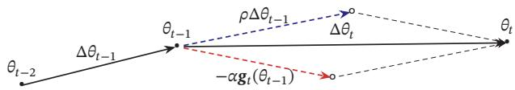  
(a) 动量法

[¶0148]
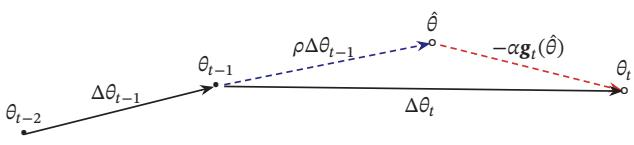  
(b) Nesterov 加速梯度  
图7.6 动量法和Nesterov加速梯度的比较

## 7.2.4.3 Adam 算法

[¶0149] Adam算法（Adaptive Moment Estimation Algorithm）[Kingma et al., 2015]可以看作动量法和RMSprop算法的结合，不但使用动量作为参数更新方向，而且可以自适应调整学习率

[¶0150] Adam算法一方面计算梯度平方 $\mathbf { g } _ { t } ^ { 2 }$ 的指数加权平均（和RMSprop算法类似），另一方面计算梯度 $\mathbf { g } _ { t }$ 的指数加权平均（和动量法类似）

[¶0151]
$$
M _ { t } = \beta _ { 1 } M _ { t - 1 } + ( 1 - \beta _ { 1 } ) \mathbf { g } _ { t } ,\tag{7.25}
$$

[¶0152]
$$
G _ { t } = \beta _ { 2 } G _ { t - 1 } + ( 1 - \beta _ { 2 } ) \mathbf { g } _ { t } \odot \mathbf { g } _ { t } ,\tag{7.26}
$$

[¶0153] 其中 $\beta _ { 1 }$ 和 $\beta _ { 2 }$ 分别为两个移动平均的衰减率，通常取值为 $\beta _ { 1 } = 0 . 9 , \beta _ { 2 } = 0 . 9 9$ ．我们可以把 $M _ { t }$ 和 $G _ { t }$ 分别看作梯度的均值（一阶矩）和未减去均值的方差（二阶矩）

[¶0154] 假设 $M _ { 0 } = 0 , G _ { 0 } = 0$ ，那么在迭代初期 $M _ { t }$ 和 $G _ { t }$ 的值会比真实的均值和方差要小．特别是当 $\beta _ { 1 }$ 和 $\beta _ { 2 }$ 都接近于1时，偏差会很大．因此，需要对偏差进行修正

[¶0155] 参见习题7-2

[¶0156]
$$
\hat { M } _ { t } = \frac { M _ { t } } { 1 - \beta _ { 1 } ^ { t } } ,\tag{7.27}
$$

[¶0157]
$$
\hat { G } _ { t } = \frac { G _ { t } } { 1 - \beta _ { 2 } ^ { t } } .\tag{7.28}
$$

[¶0158] Adam算法的参数更新差值为

[¶0159]
$$
\Delta \theta _ { t } = - \frac { \alpha } { \sqrt { \hat { G } _ { t } + \epsilon } } \hat { M } _ { t } ,\tag{7.29}
$$

[¶0160] 其中学习率??通常设为0.001，并且也可以进行衰减，比如 $\alpha _ { t } = \alpha _ { 0 } / { \sqrt { t } } .$

[¶0161] Adam算法是RMSProp算法与动量法的结合，因此一种自然的Adam算法的改进方法是引入 Nesterov 加速梯度，称为Nadam 算法[Dozat, 2016]

## 7.2.4.4 梯度截断

[¶0162] 在深度神经网络或循环神经网络中，除了梯度消失之外，梯度爆炸也是影响学习效率的主要因素．在基于梯度下降的优化过程中，如果梯度突然增大，用大的梯度更新参数反而会导致其远离最优点．为了避免这种情况，当梯度的模大于一定阈值时，就对梯度进行截断，称为梯度截断（Gradient Clipping）[Pascanuet al., 2013]

[¶0163] 图7.7给出了一个循环神经网络的损失函数关于参数的曲面．图中的曲面为只有一个隐藏神经元的循环神经网络 $h _ { t } = \sigma ( w h _ { t - 1 } + b )$ 的损失函数，其中??和??为参数．假如 $h _ { 0 }$ 初始值为0.3，损失函数为 $\mathcal { L } = ( h _ { 1 0 0 } - 0 . 6 5 ) ^ { 2 }$ ．从图7.7中可以看出，损失函数关于参数??, ??的梯度在某个区域会突然变大

[¶0164] 梯度截断是一种比较简单的启发式方法，把梯度的模限定在一个区间，当梯度的模小于或大于这个区间时就进行截断．一般截断的方式有以下几种：

[¶0165]
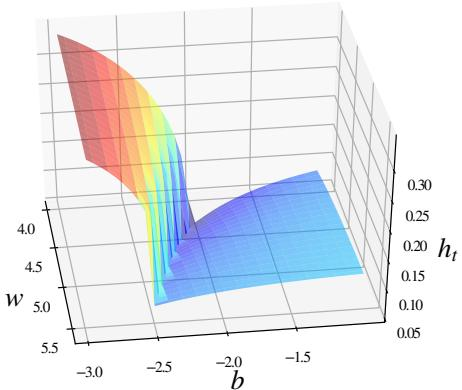  
图7.7 梯度爆炸问题示例

[¶0166] 按值截断 在第??次迭代时，梯度为 ${ \pmb g } _ { t }$ ，给定一个区间 $[ a , b ]$ ，如果一个参数的梯度小于 $a$ 时，就将其设为??；如果大于??时，就将其设为??

[¶0167]
$$
\begin{array} { r } { \mathbf { g } _ { t } = \operatorname* { m a x } ( \operatorname* { m i n } ( \mathbf { g } _ { t } , b ) , a ) . } \end{array}\tag{7.30}
$$

[¶0168] 按模截断 按模截断是将梯度的模截断到一个给定的截断阈值??

[¶0169] 如果 $\| \mathbf { g } _ { t } \| ^ { 2 } \leq b$ ，保持 ${ \pmb g } _ { t }$ 不变．如果 $\| \mathbf { g } _ { t } \| ^ { 2 } > b$ ，令

[¶0170]
$$
\mathbf { g } _ { t } = { \frac { b } { \left\| \mathbf { g } _ { t } \right\| } } \mathbf { g } _ { t } .\tag{7.31}
$$

[¶0171] 截断阈值??是一个超参数，也可以根据一段时间内的平均梯度来自动调整．实验中发现，训练过程对阈值??并不十分敏感，通常一个小的阈值就可以得到很好的结果 [Pascanu et al., 2013]

[¶0172] 在训练循环神经网络时，按模截断是避免梯度爆炸问题的有效方法

## 7.2.5 优化算法小结

[¶0173] 本节介绍的几种优化方法大体上可以分为两类：1）调整学习率，使得优化更稳定；2）梯度估计修正，优化训练速度

[¶0174] 表7.1汇总了本节介绍的几种神经网络常用优化算法

[¶0175] 这些优化算法可以使用下面公式来统一描述概括：

[¶0176]
$$
\Delta \theta _ { t } = - \frac { \alpha _ { t } } { \sqrt { G _ { t } + \epsilon } } M _ { t } ,\tag{7.32}
$$

[¶0177]
$$
G _ { t } = \psi ( \pmb { \mathrm { g } } _ { 1 } , \cdots , \pmb { \mathrm { g } } _ { t } ) ,\tag{7.33}
$$

[¶0178] 参见习题7-3

[¶0179]
$$
M _ { t } = \phi ( \mathbf { g } _ { 1 } , \cdots , \mathbf { g } _ { t } ) ,\tag{7.34}
$$

[¶0180] 表7.1 神经网络常用优化方法的汇总
<table><tr><td rowspan=1 colspan=2>类别</td><td rowspan=1 colspan=1>优化算法</td></tr><tr><td rowspan=1 colspan=1>潮原密大疗</td><td rowspan=1 colspan=1>固定衰减学习率周期性学习率自适应学习率</td><td rowspan=1 colspan=1>分段常数衰减、逆时衰减、（自然)指数衰减、余弦衰减循环学习率、SGDRAdaGrad、RMSprop、AdaDelta</td></tr><tr><td rowspan=1 colspan=2>梯度估计修正</td><td rowspan=1 colspan=1>动量法、Nesterov加速梯度、梯度截断</td></tr><tr><td rowspan=1 colspan=2>综合方法</td><td rowspan=1 colspan=1>Adam~动量法+RMSprop</td></tr></table>

[¶0181] 其中 ${ \pmb g } _ { t }$ 是第??步的梯度； $\alpha _ { t }$ 是第??步的学习率，可以进行衰减，也可以不变； $\psi ( \cdot )$ 是学习率缩放函数，可以取1或历史梯度的模的移动平均； $\phi ( \cdot )$ 是优化后的参数更新方向，可以取当前的梯度 ${ \pmb g } _ { t }$ 或历史梯度的移动平均

[¶0182] 图7.8给出了这几种优化方法在MNIST数据集上收敛性的比较（学习率为0.001，批量大小为 128）

[¶0183]
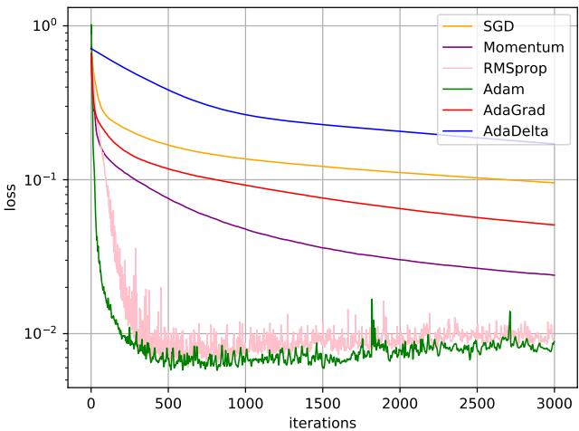  
图7.8 不同优化方法的比较

## 7.3 参数初始化

[¶0184] 神经网络的参数学习是一个非凸优化问题．当使用梯度下降法来进行优化网络参数时，参数初始值的选取十分关键，关系到网络的优化效率和泛化能力参数初始化的方式通常有以下三种：

[¶0185] （1） 预训练初始化：不同的参数初始值会收敛到不同的局部最优解．虽然这些局部最优解在训练集上的损失比较接近，但是它们的泛化能力差异很大．一个好的初始值会使得网络收敛到一个泛化能力高的局部最优解．通常情况下，一个已经在大规模数据上训练过的模型可以提供一个好的参数初始值，这种初始化方法称为预训练初始化（Pre-trained Initialization）

[¶0186] 预训练初始化通常会提升模型泛化能力的一种解释是预训练任务起到一定的正则化作用．

[¶0187] 预训练任务可以为监督学习或无监督学习任务．由于无监督学习任务更容易获取大规模的训练数据，因此被广泛采用．预训练模型在目标任务上的学习过程也称为精调（Fine-Tuning）

[¶0188] （2） 随机初始化：在线性模型的训练（比如感知器和Logistic回归）中，我们一般将参数全部初始化为0．但是这在神经网络的训练中会存在一些问题．因为如果参数都为0，在第一遍前向计算时，所有的隐藏层神经元的激活值都相同；在反向传播时，所有权重的更新也都相同，这样会导致隐藏层神经元没有区分性．这种现象也称为对称权重现象．为了打破这个平衡，比较好的方式是对每个参数都随机初始化（Random Initialization），使得不同神经元之间的区分性更好．

[¶0189] （3） 固定值初始化：对于一些特殊的参数，我们可以根据经验用一个特殊的固定值来进行初始化．比如偏置（Bias）通常用0来初始化，但是有时可以设置某些经验值以提高优化效率．在LSTM网络的遗忘门中，偏置通常初始化为1或2，使得时序上的梯度变大．对于使用ReLU的神经元，有时也可以将偏置设为0.01，使得ReLU神经元在训练初期更容易激活，从而获得一定的梯度来进行误差反向传播

[¶0190] 虽然预训练初始化通常具有更好的收敛性和泛化性，但是灵活性不够，不能在目标任务上任意地调整网络结构．因此，好的随机初始化方法对训练神经网络模型来说依然十分重要．这里我们介绍三类常用的随机初始化方法：基于固定方差的参数初始化、基于方差缩放的参数初始化和正交初始化方法

## 7.3.1 基于固定方差的参数初始化

[¶0191] 遗忘门参见公式(6.55)

[¶0192] 一种最简单的随机初始化方法是从一个固定均值（通常为0）和方差 $\sigma ^ { 2 }$ 的分布中采样来生成参数的初始值．基于固定方差的参数初始化方法主要有以下两种：

[¶0193] （1） 高斯分布初始化：使用一个高斯分布 ${ \mathcal { N } } ( 0 , \sigma ^ { 2 } )$ 对每个参数进行随机初始化

[¶0194] （2） 均匀分布初始化：在一个给定的区间 $\left[ - \boldsymbol { r } , \boldsymbol { r } \right]$ 内采用均匀分布来初始化

[¶0195] 随机初始化通常只应用在神经网络的权重矩阵上

[¶0196] 这里的“固定”的含义是方差 $\sigma ^ { 2 }$ 为一个预设值，和神经元的输入、激活函数以及所在层数无关

[¶0197] 参数．假设随机变量??在区间[??, ??]内均匀分布，则其方差为

[¶0198]
$$
\operatorname { v a r } ( x ) = { \frac { ( b - a ) ^ { 2 } } { 1 2 } } .\tag{7.35}
$$

[¶0199] 因此，若使用区间为 $\left[ - \boldsymbol { r } , \boldsymbol { r } \right]$ 的均匀分布来采样，并满足 $\operatorname { v a r } ( x ) = \sigma ^ { 2 }$ 时，则??的取值为

[¶0200]
$$
r = { \sqrt { 3 \sigma ^ { 2 } } } .\tag{7.36}
$$

[¶0201] 在基于固定方差的随机初始化方法中，比较关键的是如何设置方差 $\sigma ^ { 2 }$ ．如果参数范围取的太小，一是会导致神经元的输出过小，经过多层之后信号就慢慢消失了；二是还会使得Sigmoid型激活函数丢失非线性的能力．以Sigmoid型函数为例，在0附近基本上是近似线性的．这样多层神经网络的优势也就不存在了．如果参数范围取的太大，会导致输入状态过大．对于 Sigmoid 型激活函数来说，激活值变得饱和，梯度接近于0，从而导致梯度消失问题

[¶0202] 为了降低固定方差对网络性能以及优化效率的影响，基于固定方差的随机初始化方法一般需要配合逐层归一化来使用

[¶0203] 逐 层 归 一 化 参 见第7.5节

## 7.3.2 基于方差缩放的参数初始化

[¶0204] 要高效地训练神经网络，给参数选取一个合适的随机初始化区间是非常重要的．一般而言，参数初始化的区间应该根据神经元的性质进行差异化的设置如果一个神经元的输入连接很多，它的每个输入连接上的权重就应该小一些，以避免神经元的输出过大（当激活函数为ReLU时）或过饱和（当激活函数为Sigmoid 函数时）

[¶0205] 初始化一个深度网络时，为了缓解梯度消失或爆炸问题，我们尽可能保持每个神经元的输入和输出的方差一致，根据神经元的连接数量来自适应地调整初始化分布的方差，这类方法称为方差缩放（Variance Scaling）

## 7.3.2.1 Xavier 初始化

[¶0206] 假设在一个神经网络中，第??层的一个神经元 $a ^ { ( l ) }$ ，其接收前一层的 $M _ { l - 1 }$ 个神经元的输出 $a _ { i } ^ { ( l - 1 ) } , 1 \le i \le M _ { l - 1 }$

[¶0207] 偏置??初始化为0

[¶0208]
$$
a ^ { ( l ) } = f \Big ( \sum _ { i = 1 } ^ { M _ { l - 1 } } w _ { i } ^ { ( l ) } a _ { i } ^ { ( l - 1 ) } \Big ) ,\tag{7.37}
$$

[¶0209] 其中 $f ( \cdot )$ 为激活函数， $w _ { i } ^ { ( l ) }$ 为参数， $M _ { l - 1 }$ 是第?? − 1层神经元个数．为简单起见，这里令激活函数 $f ( \cdot )$ 为恒等函数，即 $f ( x ) = x$

[¶0210] 假设 $w _ { i } ^ { ( l ) }$ 和 $a _ { i } ^ { ( l - 1 ) }$ 的均值都为0，并且互相独立，则 $a ^ { ( l ) }$ 的均值为

[¶0211]
$$
\mathbb { E } [ a ^ { ( l ) } ] = \mathbb { E } \Big [ \sum _ { i = 1 } ^ { M _ { l - 1 } } w _ { i } ^ { ( l ) } a _ { i } ^ { ( l - 1 ) } \Big ] = \sum _ { i = 1 } ^ { M _ { l - 1 } } \mathbb { E } [ w _ { i } ^ { ( l ) } ] \mathbb { E } [ a _ { i } ^ { ( l - 1 ) } ] = 0 .\tag{7.38}
$$

[¶0212] $a ^ { ( l ) }$ 的方差为

[¶0213]
$$
\operatorname { v a r } ( a ^ { ( l ) } ) = \operatorname { v a r } \Big ( \sum _ { i = 1 } ^ { M _ { l - 1 } } w _ { i } ^ { ( l ) } a _ { i } ^ { ( l - 1 ) } \Big )\tag{7.39}
$$

[¶0214]
$$
= \sum _ { i = 1 } ^ { M _ { l - 1 } } \operatorname { v a r } ( w _ { i } ^ { ( l ) } ) \operatorname { v a r } ( a _ { i } ^ { ( l - 1 ) } )\tag{7.40}
$$

[¶0215]
$$
= M _ { l - 1 } \mathrm { v a r } ( w _ { i } ^ { ( l ) } ) \mathrm { v a r } ( a _ { i } ^ { ( l - 1 ) } ) .\tag{7.41}
$$

[¶0216] 也就是说，输入信号的方差在经过该神经元后被放大或缩小了 $M _ { l - 1 } \operatorname { v a r } ( w _ { i } ^ { ( l ) } )$ 倍为了使得在经过多层网络后，信号不被过分放大或过分减弱，我们尽可能保持每个神经元的输入和输出的方差一致．这样 $M _ { l - 1 } \operatorname { v a r } ( w _ { i } ^ { ( l ) } )$ 设为1比较合理，即

[¶0217]
$$
\operatorname { v a r } ( w _ { i } ^ { ( l ) } ) = \frac { 1 } { M _ { l - 1 } } .\tag{7.42}
$$

[¶0218] 同理，为了使得在反向传播中，误差信号也不被放大或缩小，需要将 $w _ { i } ^ { ( l ) }$ 的方差保持为

[¶0219]
$$
\operatorname { v a r } ( w _ { i } ^ { ( l ) } ) = \frac { 1 } { M _ { l } } .\tag{7.43}
$$

[¶0220] 参见习题7-4

[¶0221] 作为折中，同时考虑信号在前向和反向传播中都不被放大或缩小，可以设置

[¶0222]
$$
\mathrm { v a r } ( w _ { i } ^ { ( l ) } ) = \frac { 2 } { M _ { l - 1 } + M _ { l } } .\tag{7.44}
$$

[¶0223] 在计算出参数的理想方差后，可以通过高斯分布或均匀分布来随机初始化参数．若采用高斯分布来随机初始化参数，连接权重 $w _ { i } ^ { ( l ) }$ 可以按 $\mathcal { N } \big ( 0 , \frac { 2 } { M _ { l - 1 } + M _ { l } } \big )$ 的高斯分布进行初始化．若采用区间为[−??, ??]的均匀分布来初始化 $w _ { i } ^ { ( l ) }$ ，则 $r$ 的取值为 $\sqrt { \frac { 6 } { M _ { l - 1 } + M _ { l } } }$ ．这种根据每层的神经元数量来自动计算初始化参数方差的方法称为Xavier 初始化[Glorot et al., 2010]

[¶0224] 参见公式(7.36)

[¶0225] 虽然在Xavier初始化中我们假设激活函数为恒等函数，但是Xavier初始化也适用于Logistic函数和Tanh函数．这是因为神经元的参数和输入的绝对值通常比较小，处于激活函数的线性区间．这时Logistic函数和Tanh函数可以近似为线性函数．由于Logistic函数在线性区间的斜率约为0.25，因此其参数初始化的方差约为 $1 6 \times \frac { 2 } { M _ { l - 1 } + M _ { l } }$ ．在实际应用中，使用Logistic函数或Tanh函数的神经层通常将方差 $\frac { 2 } { M _ { l - 1 } + M _ { l } }$ 乘以一个缩放因子 $\rho$

[¶0226] Xavier初始化方法中，Xavier 是发明者 XavierGlorot 的 名 字．Xavier初始化也称为Glorot初始化

[¶0227] $\rho$ 根据经验设定

## 7.3.2.2 He 初始化

[¶0228] 当第??层神经元使用ReLU激活函数时，通常有一半的神经元输出为0，因此其分布的方差也近似为使用恒等函数时的一半．这样，只考虑前向传播时，参数$w _ { i } ^ { ( l ) }$ 的理想方差为

[¶0229]
$$
\mathrm { v a r } ( w _ { i } ^ { ( l ) } ) = \frac { 2 } { M _ { l - 1 } } ,\tag{7.45}
$$

[¶0230] 参见习题7-5

[¶0231] 其中 $M _ { l - 1 }$ 是第?? − 1层神经元个数

[¶0232] 因此当使用 ReLU 激活函数时，若采用高斯分布来初始化参数 $w _ { i } ^ { ( l ) }$ ，其方差为 $\frac { 2 } { M _ { l - 1 } }$ ；若采用区间为 [−??, ??] 的均匀分布来初始化参数 $w _ { i } ^ { ( l ) }$ ，则 $r = \sqrt { \frac { 6 } { M _ { l - 1 } } }$ ．这种初始化方法称为He 初始化[He et al., 2015]

[¶0233] 表7.2给出了Xavier初始化和He初始化的具体设置情况

[¶0234] He初始化也称为Kaiming初始化

[¶0235] 表7.2 Xavier初始化和He初始化的具体设置情况
<table><tr><td>初始化方法</td><td>激活函数</td><td>均匀分布[-r,r]</td><td>高斯分布  ${ \mathcal { N } } ( 0 , \sigma ^ { 2 } )$ </td></tr><tr><td>Xavier初始化</td><td>Logistic</td><td> $\begin{array} { r } { r = 4 \sqrt { \frac { 6 } { M _ { l - 1 } + M _ { l } } } } \end{array}$ </td><td> $\begin{array} { r } { \sigma ^ { 2 } = 1 6 \times \frac { 2 } { M _ { l - 1 } + M _ { l } } } \end{array}$ </td></tr><tr><td>Xavier初始化</td><td>Tanh</td><td> $\begin{array} { r } { r = \sqrt { \frac { 6 } { M _ { l - 1 } + M _ { l } } } } \end{array}$ </td><td> $\begin{array} { r } { \sigma ^ { 2 } = \frac { 2 } { M _ { l - 1 } + M _ { l } } } \end{array}$ </td></tr><tr><td>He初始化</td><td>ReLU</td><td> $r = \sqrt { \frac { 6 } { M _ { l - 1 } } }$ </td><td> $\begin{array} { r } { \sigma ^ { 2 } = \frac { 2 } { M _ { l - 1 } } } \end{array}$ </td></tr></table>

## 7.3.3 正交初始化

[¶0236] 上面介绍的两种基于方差的初始化方法都是对权重矩阵中的每个参数进行独立采样．由于采样的随机性，采样出来的权重矩阵依然可能存在梯度消失或梯度爆炸问题

[¶0237] 假设一个??层的等宽线性网络（激活函数为恒等函数）为

[¶0238] 这里假设每一层的偏置初始化为0

[¶0239]
$$
\pmb { y } = \pmb { W } ^ { ( L ) } \pmb { W } ^ { ( L - 1 ) } \cdots \pmb { W } ^ { ( 1 ) } \pmb { x } ,\tag{7.46}
$$

[¶0240] 其中 $\boldsymbol { W } ^ { ( l ) } \in \mathbb { R } ^ { M \times M } ( 1 \le l \le L )$ 为神经网络的第??层权重矩阵．在反向传播中，误差项??的反向传播公式为 $\delta ^ { ( l - 1 ) } = ( \mathbf { W } ^ { ( l ) } ) ^ { \top } \delta ^ { ( l ) }$ ．为了避免梯度消失或梯度爆炸问题，我们希望误差项在反向传播中具有范数保持性（Norm-Preserving），即$\lVert \delta ^ { ( l - 1 ) } \rVert ^ { 2 } = \lVert \delta ^ { ( l ) } \rVert ^ { 2 } = \lVert ( \mathbf { W } ^ { ( l ) } ) ^ { \top } \delta ^ { ( l ) } \rVert ^ { 2 }$ ．如果我们以均值为0、方差为 $\frac { 1 } { M }$ 的高斯分布来随机生成权重矩阵 $\mathbf { \Delta } _ { \mathbf { } W } ( l )$ 中每个元素的初始值，那么当 $M \to \infty$ 时，范数保持

[¶0241] 误差项参见公式(4.63)

[¶0242] 性成立．但是当??不足够大时，这种对每个参数进行独立采样的初始化方式难以保证范数保持性

[¶0243] 因此，一种更加直接的方式是将 $\mathbf { \Delta } W ^ { ( l ) }$ 初始化为正交矩阵，即 $\mathbf { \delta W } ^ { ( l ) } ( \mathbf { W } ^ { ( l ) } ) ^ { \top } =$ ??，这种方法称为正交初始化（Orthogonal Initialization）[Saxe et al., 2014]．正交初始化的具体实现过程可以分为两步：1）用均值为0、方差为1的高斯分布初始化一个矩阵；2）将这个矩阵用奇异值分解得到两个正交矩阵，并使用其中之一作为权重矩阵

[¶0244] 奇 异 值 分 解 参 见第A.2.6.2节

[¶0245] 根据正交矩阵的性质，这个线性网络在信息的前向传播过程和误差的反向传播过程中都具有范数保持性，从而可以避免在训练开始时就出现梯度消失或梯度爆炸现象

[¶0246] 当在非线性神经网络中应用正交初始化时，通常需要将正交矩阵乘以一个缩放系数 $\rho .$ ．比如当激活函数为ReLU时，激活函数在0附近的平均梯度可以近似为0.5．为了保持范数不变，缩放系数 $\rho$ 可以设置为 ${ \sqrt { 2 } } .$

[¶0247] 正交初始化通常用在循环神经网络中循环边上的权重矩阵上

## 7.4 数据预处理

[¶0248] 一般而言，样本特征由于来源以及度量单位不同，它们的尺度（Scale）（即取值范围）往往差异很大．以描述长度的特征为例，当用“米”作单位时令其值为??，那么当用“厘米”作单位时其值为100??．不同机器学习模型对数据特征尺度的敏感程度不一样．如果一个机器学习算法在缩放全部或部分特征后不影响它的学习和预测，我们就称该算法具有尺度不变性（Scale Invariance）．比如线性分类器是尺度不变的，而最近邻分类器就是尺度敏感的．当我们计算不同样本之间的欧氏距离时，尺度大的特征会起到主导作用．因此，对于尺度敏感的模型，必须先对样本进行预处理，将各个维度的特征转换到相同的取值区间，并且消除不同特征之间的相关性，才能获得比较理想的结果

[¶0249] 从理论上，神经网络应该具有尺度不变性，可以通过参数的调整来适应不同特征的尺度．但尺度不同的输入特征会增加训练难度．假设一个只有一层的网络 $y = \operatorname { t a n h } ( w _ { 1 } x _ { 1 } + w _ { 2 } x _ { 2 } + b )$ ，其中 $x _ { 1 } \in [ 0 , 1 0 ] , x _ { 2 } \in [ 0 , 1 ]$ ．之前我们提到tanh函数的导数在区间[−2, 2]上是敏感的，其余的导数接近于0．因此，如果$w _ { 1 } x _ { 1 } + w _ { 2 } x _ { 2 } + b$ 过大或过小，都会导致梯度过小，难以训练．为了提高训练效率，我们需要使 $w _ { 1 } x _ { 1 } + w _ { 2 } x _ { 2 } + b$ 在[−2, 2]区间，因此需要将 $w _ { 1 }$ 设得小一点，比如在[−0.1, 0.1]之间．可以想象，如果数据维数很多时，我们很难这样精心去选择每一个参数．因此，如果每一个特征的尺度相似，比如 [0, 1] 或者 [−1, 1]，我们就不太需要区别对待每一个参数，从而减少人工干预

[¶0250] 除了参数初始化比较困难之外，不同输入特征的尺度差异比较大时，梯https://nndl.github.io/

[¶0251] 度下降法的效率也会受到影响．图7.9给出了数据归一化对梯度的影响．其中，图7.9a为未归一化数据的等高线图．尺度不同会造成在大多数位置上的梯度方向并不是最优的搜索方向．当使用梯度下降法寻求最优解时，会导致需要很多次迭代才能收敛．如果我们把数据归一化为相同尺度，如图7.9b所示，大部分位置的梯度方向近似于最优搜索方向．这样，在梯度下降求解时，每一步梯度的方向都基本指向最小值，训练效率会大大提高

[¶0252]
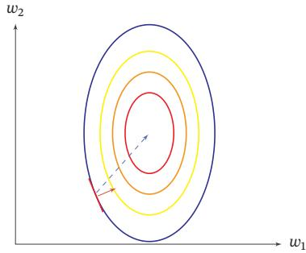  
(a)未归一化数据的梯度

[¶0253]
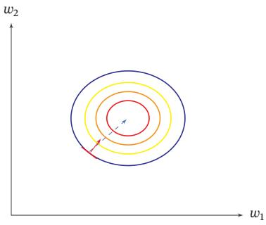  
(b)归一化数据的梯度  
图7.9 数据归一化对梯度的影响

[¶0254] 归一化（Normalization）方法泛指把数据特征转换为相同尺度的方法，比如把数据特征映射到[0, 1]或[−1, 1]区间内，或者映射为服从均值为0、方差为1的标准正态分布．归一化的方法有很多种，比如之前我们介绍的 Sigmoid型函数等都可以将不同尺度的特征挤压到一个比较受限的区间．这里，我们介绍几种在神经网络中经常使用的归一化方法

[¶0255] 最小最大值归一化 最小最大值归一化（Min-Max Normalization）是一种非常简单的归一化方法，通过缩放将每一个特征的取值范围归一到[0, 1]或[−1, 1]之间．假设有??个样本 $\{ \boldsymbol { x } ^ { ( n ) } \} _ { n = 1 } ^ { N }$ ，对于每一维特征??，归一化后的特征为

[¶0256]
$$
\hat { x } ^ { ( n ) } = \frac { x ^ { ( n ) } - \operatorname* { m i n } _ { n } ( x ^ { ( n ) } ) } { \operatorname* { m a x } _ { n } ( x ^ { ( n ) } ) - \operatorname* { m i n } _ { n } ( x ^ { ( n ) } ) } ,\tag{7.47}
$$

[¶0257] 其中min(??)和max(??)分别是特征??在所有样本上的最小值和最大值

[¶0258] 标准化 标准化（Standardization）也叫Z值归一化（Z-Score Normalization），来源于统计上的标准分数．将每一个维特征都调整为均值为0，方差为1．假设有??个样本 $\{ \pmb { x } ^ { ( n ) } \} _ { n = 1 } ^ { N }$ ，对于每一维特征??，我们先计算它的均值和方差：

[¶0259]
$$
\mu = \frac { 1 } { N } \sum _ { n = 1 } ^ { N } x ^ { ( n ) } ,\tag{7.48}
$$

[¶0260]
$$
\sigma ^ { 2 } = \frac { 1 } { N } \sum _ { n = 1 } ^ { N } ( x ^ { ( n ) } - \mu ) ^ { 2 } .\tag{7.49}
$$

[¶0261] https://nndl.github.io/

[¶0262] 然后，将特征 $x ^ { ( n ) }$ 减去均值，并除以标准差，得到新的特征值 $\hat { x } ^ { ( n ) }$

[¶0263]
$$
\hat { x } ^ { ( n ) } = \frac { x ^ { ( n ) } - \mu } { \sigma } ,\tag{7.50}
$$

[¶0264] 其中标准差 $\sigma$ 不能为0．如果标准差为0，说明这一维特征没有任何区分性，可以直接删掉

[¶0265] 白化 白化（Whitening）是一种重要的预处理方法，用来降低输入数据特征之间的冗余性．输入数据经过白化处理后，特征之间相关性较低，并且所有特征具有相同的方差．白化的一个主要实现方式是使用主成分分析（Principal Compo-nent Analysis，PCA）方法去除掉各个成分之间的相关性

[¶0266] 图7.10给出了标准归一化和PCA白化的比较

[¶0267]
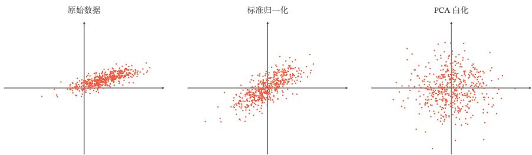  
图7.10 标准归一化和PCA白化

## 7.5 逐层归一化

[¶0268] 逐层归一化（Layer-wise Normalization）是将传统机器学习中的数据归一化方法应用到深度神经网络中，对神经网络中隐藏层的输入进行归一化，从而使得网络更容易训练

[¶0269] 逐层归一化可以有效提高训练效率的原因有以下几个方面：

[¶0270] （1） 更好的尺度不变性：在深度神经网络中，一个神经层的输入是之前神经层的输出．给定一个神经层??，它之前的神经层(1, ⋯ , ?? − 1)的参数变化会导致其输入的分布发生较大的改变．当使用随机梯度下降来训练网络时，每次参数更新都会导致该神经层的输入分布发生改变．越高的层，其输入分布会改变得越明显．就像一栋高楼，低楼层发生一个较小的偏移，可能会导致高楼层较大的偏移．从机器学习角度来看，如果一个神经层的输入分布发生了改变，那么其参数需要重新学习，这种现象叫作内部协变量偏移（Internal Covariate Shift）．为了缓解这个问题，我们可以对每一个神经层的输入进行归一化操作，使其分布保持稳定

[¶0271] 这里的逐层归一化方法是指可以应用在深度神经网络中的任何一个中间层．实际上并不需要对所有层进行归一化

[¶0272] 协 变 量 偏 移 参 见第10.4.2节

[¶0273] 把每个神经层的输入分布都归一化为标准正态分布，可以使得每个神经层对其输入具有更好的尺度不变性．不论低层的参数如何变化，高层的输入保持相对稳定．另外，尺度不变性可以使得我们更加高效地进行参数初始化以及超参选择

[¶0274] （2） 更平滑的优化地形：逐层归一化一方面可以使得大部分神经层的输入处于不饱和区域，从而让梯度变大，避免梯度消失问题；另一方面还可以使得神经网络的优化地形（Optimization Landscape）更加平滑，以及使梯度变得更加稳定，从而允许我们使用更大的学习率，并提高收敛速度[Bjorck et al., 2018;Santurkar et al., 2018]

[¶0275] 下面介绍几种比较常用的逐层归一化方法：批量归一化、层归一化、权重归一化和局部响应归一化

## 7.5.1 批量归一化

[¶0276] 批量归一化（Batch Normalization，BN）方法 [Ioffe et al., 2015] 是一种有效的逐层归一化方法，可以对神经网络中任意的中间层进行归一化操作

[¶0277] 对于一个深度神经网络，令第??层的净输入为 $\boldsymbol { z } ^ { ( l ) }$ ，神经元的输出为 $\mathbf { \pmb { a } } ^ { ( l ) }$ ，即

[¶0278]
$$
\pmb { a } ^ { ( l ) } = f ( \pmb { z } ^ { ( l ) } ) = f ( \pmb { W } \pmb { a } ^ { ( l - 1 ) } + \pmb { b } ) ,\tag{7.51}
$$

[¶0279] 其中??(⋅)是激活函数，?? 和??是可学习的参数

[¶0280] 为了提高优化效率，就要使得净输入 $\boldsymbol { z } ^ { ( l ) }$ 的分布一致，比如都归一化到标准正态分布．虽然归一化操作也可以应用在输入 $\pmb { a } ^ { ( l - 1 ) }$ 上，但归一化 $\boldsymbol { z } ^ { ( l ) }$ 更加有利于优化．因此，在实践中归一化操作一般应用在仿射变换（Affine Transforma-tion） ${ \pmb { W } } { \pmb { a } } ^ { ( l - 1 ) } + { \pmb { b } }$ 之后、激活函数之前

[¶0281] 批量归一化的提出动机 是 为 了 解 决 内 部协方差偏移问题，但后 来 的 研 究 者 发 现其主要优点是归一化会导致更平滑的优化地 形 [Santurkar et al.,2018]．

[¶0282] 利用第7.4节中介绍的数据预处理方法对 $\boldsymbol { z } ^ { ( l ) }$ 进行归一化，相当于每一层都进行一次数据预处理，从而加速收敛速度．但是逐层归一化需要在中间层进行操作，要求效率比较高，因此复杂度比较高的白化方法就不太合适．为了提高归一化效率，一般使用标准化将净输入 $\boldsymbol { z } ^ { ( l ) }$ 的每一维都归一到标准正态分布

[¶0283]
$$
\hat { \pmb z } ^ { ( l ) } = \frac { \pmb z ^ { ( l ) } - \mathbb { E } [ \pmb z ^ { ( l ) } ] } { \sqrt { \mathrm { v a r } ( \pmb z ^ { ( l ) } ) + \epsilon } } ,\tag{7.52}
$$

[¶0284] ??是为了保持数值稳定性而设置的非常小的常数

[¶0285] 其中?? $[ z ^ { ( l ) } ]$ 和 $\mathrm { v a r } ( \pmb { z } ^ { ( l ) } )$ 是指当前参数下， $\boldsymbol { z } ^ { ( l ) }$ 的每一维在整个训练集上的期望和方差．因为目前主要的优化算法是基于小批量的随机梯度下降法，所以准确地计算 $\boldsymbol { z } ^ { ( l ) }$ 的期望和方差是不可行的．因此， $\boldsymbol { z } ^ { ( l ) }$ 的期望和方差通常用当前小批量样本集的均值和方差近似估计

[¶0286] 给定一个包含?? 个样本的小批量样本集合，第??层神经元的净输入 $\pmb { z } ^ { ( 1 , l ) }$ $\cdots , z ^ { ( K , l ) }$ 的均值和方差为

[¶0287]
$$
\mu _ { \mathcal { B } } = \frac { 1 } { K } \sum _ { k = 1 } ^ { K } z ^ { ( k , l ) } ,\tag{7.53}
$$

[¶0288]
$$
\sigma _ { \mathcal { B } } ^ { 2 } = \frac { 1 } { K } \sum _ { k = 1 } ^ { K } ( \boldsymbol { z } ^ { ( k , l ) } - \boldsymbol { \mu } _ { \mathcal { B } } ) \odot ( \boldsymbol { z } ^ { ( k , l ) } - \boldsymbol { \mu } _ { \mathcal { B } } ) .\tag{7.54}
$$

[¶0289] 对净输入 $\boldsymbol { z } ^ { ( l ) }$ 的标准归一化会使得其取值集中到0附近，如果使用Sigmoid型激活函数时，这个取值区间刚好是接近线性变换的区间，减弱了神经网络的非线性性质．因此，为了使得归一化不对网络的表示能力造成负面影响，可以通过一个附加的缩放和平移变换改变取值区间

[¶0290]
$$
\hat { z } ^ { ( l ) } = \frac { z ^ { ( l ) } - \mu _ { \mathcal { B } } } { \sqrt { \sigma _ { \mathcal { B } } ^ { 2 } + \epsilon } } \odot \gamma + \beta\tag{7.55}
$$

[¶0291] 参见习题7-7

[¶0292]
$$
\triangleq \mathbb { B N } _ { \gamma , \beta } ( \pmb { z } ^ { ( l ) } ) ,\tag{7.56}
$$

[¶0293] 其中 $\gamma$ 和 $\beta$ 分别代表缩放和平移的参数向量．从最保守的角度考虑，可以通过标准归一化的逆变换来使得归一化后的变量可以被还原为原来的值．当 $\gamma = \sqrt { \sigma _ { \mathcal B } ^ { 2 } }$ ${ \boldsymbol { \beta } } = \mu _ { \mathcal { B } }$ 时， $\hat { z } ^ { ( l ) } = z ^ { ( l ) }$

[¶0294] 批量归一化操作可以看作一个特殊的神经层，加在每一层非线性激活函数之前，即

[¶0295]
$$
\begin{array} { r } { \pmb { a } ^ { ( l ) } = f \big ( \mathrm { B N } _ { \gamma , \beta } ( \pmb { z } ^ { ( l ) } ) \big ) = f \big ( \mathrm { B N } _ { \gamma , \beta } ( \pmb { W } \pmb { a } ^ { ( l - 1 ) } ) \big ) , } \end{array}\tag{7.57}
$$

[¶0296] 其中因为批量归一化本身具有平移变换，所以仿射变换 ${ \bf W } { \bf q } ^ { ( l - 1 ) }$ 不再需要偏置参数．

[¶0297] 这里要注意的是，每次小批量样本的 $\pmb { \mu } _ { \mathcal { B } }$ 和方差 $\sigma _ { \mathcal { B } } ^ { 2 }$ 是净输入 $\boldsymbol { z } ^ { ( l ) }$ 的函数，而不是常量．因此在计算参数梯度时需要考虑 $\pmb { \mu } _ { \mathcal { B } }$ 和 $\sigma _ { \mathcal { B } } ^ { 2 }$ 的影响．当训练完成时，用整个数据集上的均值 $\mu$ 和方差 $\sigma$ 来分别代替每次小批量样本的 $\pmb { \mu } _ { \mathcal { B } }$ 和方差 $\sigma _ { \mathcal { B } } ^ { 2 }$ ．在实践中， $\pmb { \mu } _ { \mathcal { B } }$ 和 $\sigma _ { \mathcal { B } } ^ { 2 }$ 也可以用移动平均来计算

[¶0298] 值得一提的是，逐层归一化不但可以提高优化效率，还可以作为一种隐形的正则化方法．在训练时，神经网络对一个样本的预测不仅和该样本自身相关，也和同一批次中的其他样本相关．由于在选取批次时具有随机性，因此使得神经网络不会“过拟合”到某个特定样本，从而提高网络的泛化能力[Luo et al.,2018]

## 7.5.2 层归一化

[¶0299] 批量归一化是对一个中间层的单个神经元进行归一化操作，因此要求小批量样本的数量不能太小，否则难以计算单个神经元的统计信息．此外，如果一个神经元的净输入的分布在神经网络中是动态变化的，比如循环神经网络，那么就无法应用批量归一化操作

[¶0300] 参见习题7-8

[¶0301] 层归一化（Layer Normalization）[Ba et al., 2016] 是和批量归一化非常类似的方法．和批量归一化不同的是，层归一化是对一个中间层的所有神经元进行归一化

[¶0302] 对于一个深度神经网络，令第??层神经元的净输入为 $\boldsymbol { z } ^ { ( l ) }$ ，其均值和方差为

[¶0303]
$$
\mu ^ { ( l ) } = \frac { 1 } { M _ { l } } \sum _ { i = 1 } ^ { M _ { l } } z _ { i } ^ { ( l ) } ,\tag{7.58}
$$

[¶0304]
$$
\sigma ^ { ( l ) ^ { 2 } } = \frac { 1 } { M _ { l } } \sum _ { i = 1 } ^ { M _ { l } } ( z _ { i } ^ { ( l ) } - \mu ^ { ( l ) } ) ^ { 2 } ,\tag{7.59}
$$

[¶0305] 其中 $M _ { l }$ 为第??层神经元的数量

[¶0306] 层归一化定义为

[¶0307]
$$
\hat { z } ^ { ( l ) } = \frac { z ^ { ( l ) } - \mu ^ { ( l ) } } { \sqrt { { \sigma ^ { ( l ) } } ^ { 2 } + \epsilon } } \odot \gamma + \beta\tag{7.60}
$$

[¶0308]
$$
\triangleq  { \mathbb { A } } _ { }  { \mathrm { I } } _ { \ b { \mathbf { N } } _ { \gamma , \beta } } (  { \boldsymbol { z } } ^ { ( l ) } ) ,\tag{7.61}
$$

[¶0309] 其中 $\gamma$ 和 $\beta$ 分别代表缩放和平移的参数向量，和 $\boldsymbol { z } ^ { ( l ) }$ 维数相同

[¶0310] 循环神经网络中的层归一化 层归一化可以应用在循环神经网络中，对循环神经层进行归一化操作．假设在时刻??，循环神经网络的隐藏层为 $\pmb { h } _ { t }$ ，其层归一化的更新为

[¶0311] 参见公式(6.6)

[¶0312]
$$
z _ { t } = U \pmb { h } _ { t - 1 } + W \pmb { x } _ { t } ,\tag{7.62}
$$

[¶0313]
$$
\begin{array} { r } { \pmb { h } _ { t } = f ( \mathrm { L N } _ { \gamma , \beta } ( \pmb { z } _ { t } ) ) , } \end{array}\tag{7.63}
$$

[¶0314] 其中输入为 $\mathbf { \boldsymbol { x } } _ { t }$ 为第??时刻的输入，??和 $\mathbf { \Delta } _ { W }$ 为网络参数

[¶0315] 在标准循环神经网络中，循环神经层的净输入一般会随着时间慢慢变大或变小，从而导致梯度爆炸或消失．而层归一化的循环神经网络可以有效地缓解这种状况

[¶0316] 层归一化和批量归一化整体上是十分类似的，差别在于归一化的方法不同对于?? 个样本的一个小批量集合 $Z ^ { ( l ) } = [ z ^ { ( 1 , l ) } ; \cdots ; z ^ { ( K , l ) } ]$ ，层归一化是对矩阵$\pmb { Z } ^ { ( l ) }$ 的每一列进行归一化，而批量归一化是对每一行进行归一化．一般而言，批量归一化是一种更好的选择．当小批量样本数量比较小时，可以选择层归一化

## 7.5.3 权重归一化

[¶0317] 权重归一化（Weight Normalization）[Salimans et al., 2016] 是对神经网络的连接权重进行归一化，通过再参数化（Reparameterization）方法，将连接权重分解为长度和方向两种参数．假设第??层神经元 $\pmb { a } ^ { ( l ) } = f ( \pmb { W } \pmb { a } ^ { ( l - 1 ) } + \pmb { b } )$ ，我们将?? 再参数化为

[¶0318]
$$
W _ { i , : } = \frac { g _ { i } } { \lvert \lvert v _ { i } \rvert \rvert } v _ { i } , \qquad 1 \leq i \leq M _ { l }\tag{7.64}
$$

[¶0319] 其中 $W _ { i , \astrosun }$ 表示权重 $\mathbf { \Delta } _ { W }$ 的第??行， $M _ { l }$ 为神经元数量．新引入的参数 $g _ { i }$ 为标量， $\mathbf { v } _ { i }$ 和$\pmb { a } ^ { ( l - 1 ) }$ 维数相同

[¶0320] 由于在神经网络中权重经常是共享的，权重数量往往比神经元数量要少，因此权重归一化的开销会比较小

## 7.5.4 局部响应归一化

[¶0321] 局部响应归一化（Local Response Normalization，LRN）[Krizhevsky et al.,2012]是一种受生物学启发的归一化方法，通常用在基于卷积的图像处理上

[¶0322] 假设一个卷积层的输出特征映射 $\pmb { Y } \in \mathbb { R } ^ { M ^ { \prime } \times N ^ { \prime } \times P }$ 为三维张量，其中每个切片矩阵 $Y ^ { p } \in \mathbb { R } ^ { M ^ { \prime } \times N ^ { \prime } }$ 为一个输出特征映射， $1 \leq p \leq P .$

[¶0323] 参见公式(5.24)

[¶0324] 局部响应归一化是对邻近的特征映射进行局部归一化

[¶0325]
$$
\begin{array} { r } { \hat { Y } ^ { p } = Y ^ { p } / \left( k + \alpha \sum _ { j = \mathrm { m a x } ( 1 , p - \frac { n } { 2 } ) } ^ { \mathrm { m i n } ( P , p + \frac { n } { 2 } ) } ( Y ^ { j } ) ^ { 2 } \right) ^ { \beta } } \end{array}\tag{7.65}
$$

[¶0326]
$$
\triangleq { \mathrm { L R N } } _ { n , k , \alpha , \beta } ( Y ^ { p } ) ,\tag{7.66}
$$

[¶0327] 其中除和幂运算都是按元素运算，??, ??, ??, ??为超参，??为局部归一化的特征窗口大小．在AlexNet中，这些超参的取值为 $n = 5 , k = 2 , \alpha = 1 0 \mathrm { e } ^ { - 4 } , \beta = 0 . 7 5 .$

[¶0328] 局部响应归一化和层归一化都是对同层的神经元进行归一化．不同的是，局部响应归一化应用在激活函数之后，只是对邻近的神经元进行局部归一化，并且不减去均值

[¶0329] 邻近的神经元指对应同样位置的邻近特征映射

[¶0330] 局部响应归一化和生物神经元中的侧抑制（lateral inhibition）现象比较类似，即活跃神经元对相邻神经元具有抑制作用．当使用ReLU作为激活函数时，神经元的活性值是没有限制的，局部响应归一化可以起到平衡和约束作用．如果一个神经元的活性值非常大，那么和它邻近的神经元就近似地归一化为0，从而起到抑制作用，增强模型的泛化能力．最大汇聚也具有侧抑制作用．但最大汇聚是对同一个特征映射中的邻近位置中的神经元进行抑制，而局部响应归一化是对同一个位置的邻近特征映射中的神经元进行抑制

## 7.6 超参数优化

[¶0331] 在神经网络中，除了可学习的参数之外，还存在很多超参数．这些超参数对网络性能的影响也很大．不同的机器学习任务往往需要不同的超参数．常见的超参数有以下三类：

[¶0332] （1） 网络结构，包括神经元之间的连接关系、层数、每层的神经元数量、激活函数的类型等

[¶0333] （2） 优化参数，包括优化方法、学习率、小批量的样本数量等

[¶0334] （3） 正则化系数

[¶0335] 超参数优化（Hyperparameter Optimization）主要存在两方面的困难：1）超参数优化是一个组合优化问题，无法像一般参数那样通过梯度下降方法来优化，也没有一种通用有效的优化方法；2）评估一组超参数配置（Configuration）的时间代价非常高，从而导致一些优化方法（比如演化算法（Evolution Algo-rithm））在超参数优化中难以应用

[¶0336] 假设一个神经网络中总共有??个超参数，每个超参数配置表示为一个向量$x \in \mathcal { X } , \mathcal { X } \subset \mathbb { R } ^ { K }$ 是超参数配置的取值空间．超参数优化的目标函数定义为$f ( \pmb { x } ) : \mathcal { X }  \mathbb { R } , f ( \pmb { x } )$ 是衡量一组超参数配置??效果的函数，一般设置为开发集上的错误率．目标函数 $f ( x )$ 可以看作一个黑盒（black-box）函数，不需要知道其具体形式．虽然在神经网络的超参数优化中， $f ( x )$ 的函数形式已知，但 $f ( x )$ 不是关于??的连续函数，并且??不同， $f ( x )$ 的函数形式也不同，因此无法使用梯度下降等优化方法

[¶0337] 对于超参数的配置，比较简单的方法有网格搜索、随机搜索、贝叶斯优化、动态资源分配和神经架构搜索

## 7.6.1 网格搜索

[¶0338] 网格搜索（Grid Search）是一种通过尝试所有超参数的组合来寻址合适一组超参数配置的方法．假设总共有??个超参数，第??个超参数的可以取 $m _ { k }$ 个值那么总共的配置组合数量为 $m _ { 1 } \times m _ { 2 } \times \cdots \times m _ { K }$ ．如果超参数是连续的，可以将超参数离散化，选择几个“经验”值．比如学习率??，我们可以设置

[¶0339]
$$
\alpha \in \{ 0 . 0 1 , 0 . 1 , 0 . 5 , 1 . 0 \} .
$$

[¶0340] 一般而言，对于连续的超参数，我们不能按等间隔的方式进行离散化，需要根据超参数自身的特点进行离散化

[¶0341] 网格搜索根据这些超参数的不同组合分别训练一个模型，然后测试这些模型在开发集上的性能，选取一组性能最好的配置

## 7.6.2 随机搜索

[¶0342] 不同超参数对模型性能的影响有很大差异．有些超参数（比如正则化系数）对模型性能的影响有限，而另一些超参数（比如学习率）对模型性能影响比较大．在这种情况下，采用网格搜索会在不重要的超参数上进行不必要的尝试．一种在实践中比较有效的改进方法是对超参数进行随机组合，然后选取一个性能最好的配置，这就是随机搜索（Random Search）[Bergstra et al., 2012]．随机搜索在实践中更容易实现，一般会比网格搜索更加有效

[¶0343] 网格搜索和随机搜索都没有利用不同超参数组合之间的相关性，即如果模型的超参数组合比较类似，其模型性能也是比较接近的．因此这两种搜索方式一般都比较低效．下面我们介绍两种自适应的超参数优化方法：贝叶斯优化和动态资源分配

## 7.6.3 贝叶斯优化

[¶0344] 贝叶斯优化（Bayesian optimization）[Bergstra et al., 2011; Snoek et al.,2012]是一种自适应的超参数优化方法，根据当前已经试验的超参数组合，来预测下一个可能带来最大收益的组合

[¶0345] 一种比较常用的贝叶斯优化方法为时序模型优化（Sequential Model-BasedOptimization，SMBO）[Hutter et al., 2011]．假设超参数优化的函数 $f ( x )$ 服从高斯过程，则 $p ( f ( { \pmb x } ) | { \pmb x } )$ 为一个正态分布．贝叶斯优化过程是根据已有的??组试验结果 $\mathcal { H } = \{ \boldsymbol { x } _ { n } , \boldsymbol { y } _ { n } \} _ { n = 1 } ^ { N } ( \boldsymbol { y } _ { n }$ 为 $f ( { \boldsymbol { x } } _ { n } )$ 的观测值）来建模高斯过程，并计算 $f ( x )$ 的后验分布 $p _ { \mathcal { G P } } ( f ( \pmb { x } ) | \pmb { x } , \mathcal { H } )$

[¶0346] 高 斯 过 程 参 见第D.3.2节

[¶0347] 为了使得 $p _ { \mathcal { G P } } ( f ( \pmb { x } ) | \pmb { x } , \mathcal { H } )$ 接近其真实分布，就需要对样本空间进行足够多的采样．但是超参数优化中每一个样本的生成成本很高，需要用尽可能少的样本来使得 $p _ { \theta } ( f ( \pmb { x } ) | \pmb { x } , \mathcal { H } )$ 接近于真实分布．因此，需要通过定义一个收益函数（ $\mathrm { . A c . }$ quisition Function） $a ( x , { \mathcal { H } } )$ 来判断一个样本是否能够给建模 $p _ { \theta } ( f ( \pmb { x } ) | \pmb { x } , \mathcal { H } )$ 提供更多的收益．收益越大，其修正的高斯过程会越接近目标函数的真实分布

[¶0348] 收益函数的定义有很多种方式．一个常用的是期望改善（Expected Improve-ment，EI）函数．假设 $y ^ { * } = \operatorname* { m i n } \{ y _ { n } , 1 \leq n \leq N \}$ 是当前已有样本中的最优值，期望改善函数为，

[¶0349]
$$
\mathbf { E I } ( x , { \mathcal { H } } ) = \int _ { - \infty } ^ { \infty } \operatorname* { m a x } ( y ^ { * } - y , 0 ) p _ { { \mathcal { G P } } } ( y | \mathbf { x } , { \mathcal { H } } ) \mathrm { d } y .\tag{7.67}
$$

[¶0350] 期望改善是定义一个样本??在当前模型 $p _ { \mathcal { G P } } ( f ( \pmb { x } ) | \pmb { x } , \mathcal { H } )$ 下， $f ( x )$ 超过最好结果$y ^ { * }$ 的期望．除了期望改善函数之外，收益函数还有其他定义形式，比如改善概率（Probability of Improvement）、高斯过程置信上界（GP Upper ConfidenceBound，GP-UCB）等

[¶0351] 时序模型优化方法如算法7.1所示．贝叶斯优化的一个缺点是高斯过程建模需要计算协方差矩阵的逆，时间复杂度是 $O ( N ^ { 3 } )$ ，因此不能很好地处理高维情况．深度神经网络的超参数一般比较多，为了使用贝叶斯优化来搜索神经网络的超参数，需要一些更高效的高斯过程建模．也有一些方法可以将时间复杂度从$O ( N ^ { 3 } )$ 降低到 ??(??)[Snoek et al., 2015]

[¶0352] 算法7.1 时序模型优化（SMBO）方法  
输入:优化目标函数 $f ( x )$ ，迭代次数??，收益函数 $a ( x , { \mathcal { H } } )$   
1 ${ \mathcal { H } } \gets \emptyset ;$   
2 随机初始化高斯过程，并计算 $p _ { \mathcal { G P } } ( f ( \pmb { x } ) | \pmb { x } , \mathcal { H } ) ;$   
3 for ?? ← 1 to ?? do  
4 $\begin{array} { r } { \pmb { x } ^ { \prime }  \operatorname * { a r g m a x } _ { x } a ( \pmb { x } , \mathcal { H } ) ; } \end{array}$   
5 评价 $y ^ { \prime } = f ( \pmb { x } ^ { \prime } )$ // 代价高  
6 ${ \mathcal { H } } \gets { \mathcal { H } } \cup ( { \pmb { x } } ^ { \prime } , { \pmb { y } } ^ { \prime } ) ;$   
7 根据ℋ重新建模高斯过程，并计算 $p _ { \mathcal { G P } } ( f ( \pmb { x } ) | \pmb { x } , \mathcal { H } )$   
8 end  
输出:ℋ

## 7.6.4 动态资源分配

[¶0353] 在超参数优化中，每组超参数配置的评估代价比较高．如果我们可以在较早的阶段就估计出一组配置的效果会比较差，那么我们就可以中止这组配置的评估，将更多的资源留给其他配置．这个问题可以归结为多臂赌博机问题的一个泛化问题：最优臂问题（Best-Arm Problem），即在给定有限的机会次数下，如何玩这些赌博机并找到收益最大的臂．和多臂赌博机问题类似，最优臂问题也是在利用和探索之间找到最佳的平衡

[¶0354] 由于目前神经网络的优化方法一般都采取随机梯度下降，因此我们可以通过一组超参数的学习曲线来预估这组超参数配置是否有希望得到比较好的结果．如果一组超参数配置的学习曲线不收敛或者收敛比较差，我们可以应用早期停止（Early-Stopping）策略来中止当前的训练

[¶0355] 动态资源分配的关键是将有限的资源分配给更有可能带来收益的超参数组合．一种有效方法是逐次减半（Successive Halving）方法 [Jamieson et al.,2016]，将超参数优化看作一种非随机的最优臂问题．假设要尝试??组超参数配置，总共可利用的资源预算（摇臂的次数）为??，我们可以通过 $T = \lceil \log _ { 2 } ( N ) \rceil - 1$ 轮逐次减半的方法来选取最优的配置，具体过程如算法7.2所示

[¶0356] 算法7.2 一种逐次减半的动态资源分配方法  
输入:预算??，??个超参数配置 $\{ \boldsymbol { x } _ { n } \} _ { n = 1 } ^ { N }$   
1 $T \gets \lceil \log _ { 2 } ( N ) \rceil - 1 ;$   
2 随机初始化 $\mathcal { S } _ { 0 } = \{ \boldsymbol { x } _ { n } \} _ { n = 1 } ^ { N }$   
3 for ?? ← 1 to ?? do  
4 $r _ { t } \gets \lfloor \frac { B } { | \mathcal { S } _ { t } | \times T } \rfloor ;$   
5 给 $S _ { t }$ 中的每组配置分配 $r _ { t }$ 的资源;  
6 运行 $S _ { t }$ 所有配置，评估结果为 $\mathbf { \nabla } y _ { t } ;$   
7 根据评估结果，选取 $| S _ { t } | / 2$ 组最优的配置 $\mathcal { S } _ { t } \gets \arg \operatorname* { m a x } ( \mathcal { S } _ { t } , \mathbf { y } _ { t } , | \mathcal { S } _ { t } | / 2 )$   
// arg max(??, ??, ??)为从集合??中选取??个元素，对应最优的??个评估结果  
8 end  
输出:最优配置 ${ \mathcal { S } } _ { K }$

[¶0357] 在逐次减半方法中，尝试的超参数配置数量??十分关键．如果??越大，得到最佳配置的机会也越大，但每组配置分到的资源就越少，这样早期的评估结果可能不准确．反之，如果??越小，每组超参数配置的评估会越准确，但有可能无法得到最优的配置．因此，如何设置??是平衡“利用-探索”的一个关键因素．一种改进的方法是HyperBand方法[Li et al., 2017b]，通过尝试不同的?? 来选取最优参数

## 7.6.5 神经架构搜索

[¶0358] 上面介绍的超参数优化方法都是在固定（或变化比较小）的超参数空间??中进行最优配置搜索，而最重要的神经网络架构一般还是需要由有经验的专家来进行设计

[¶0359] 从某种角度来讲，深度学习使得机器学习中的“特征工程”问题转变为“网络架构工程”问题

[¶0360] 神经架构搜索（Neural Architecture Search，NAS）[Zoph et al., 2017] 是一个新的比较有前景的研究方向，通过神经网络来自动实现网络架构的设计．一个神经网络的架构可以用一个变长的字符串来描述．利用元学习的思想，神经架构搜索利用一个控制器来生成另一个子网络的架构描述．控制器可以由一个循环神经网络来实现．控制器的训练可以通过强化学习来完成，其奖励信号为生成的子网络在开发集上的准确率

## 7.7 网络正则化

[¶0361] 机器学习模型的关键是泛化问题，即在样本真实分布上的期望风险最小化而训练数据集上的经验风险最小化和期望风险并不一致．由于神经网络的拟合能力非常强，其在训练数据上的错误率往往都可以降到非常低，甚至可以到0，从而导致过拟合．因此，如何提高神经网络的泛化能力反而成为影响模型能力的最关键因素

[¶0362] 参见第2.8.1节

[¶0363] 正则化（Regularization）是一类通过限制模型复杂度，从而避免过拟合，提高泛化能力的方法，比如引入约束、增加先验、提前停止等

[¶0364] 在传统的机器学习中，提高泛化能力的方法主要是限制模型复杂度，比如采用 $\ell _ { 1 }$ 和 $\ell _ { 2 }$ 正则化等方式．而在训练深度神经网络时，特别是在过度参数化（Over-Parameterization）时， $\ell _ { 1 }$ 和 $\ell _ { 2 }$ 正则化的效果往往不如浅层机器学习模型中显著．因此训练深度学习模型时，往往还会使用其他的正则化方法，比如数据增强、提前停止、丢弃法、集成法等

[¶0365] 过度参数化是指模型参数的数量远远大于训练数据的数量

## 7.7.1 $\ell _ { 1 }$ 和 $\ell _ { 2 }$ 正则化

[¶0366] $\ell _ { 1 }$ 和 $\ell _ { 2 }$ 正则化是机器学习中最常用的正则化方法，通过约束参数的 $\ell _ { 1 }$ 和 $\ell _ { 2 }$ 范数来减小模型在训练数据集上的过拟合现象

[¶0367] 范数参见第A.1.3节

[¶0368] 通过加入 $\ell _ { 1 }$ 和 $\ell _ { 2 }$ 正则化，优化问题可以写为

[¶0369]
$$
\theta ^ { * } = \underset { \theta } { \arg \operatorname* { m i n } } \frac { 1 } { N } \sum _ { n = 1 } ^ { N } \mathcal { L } \big ( y ^ { ( n ) } , f ( \pmb { x } ^ { ( n ) } ; \theta ) \big ) + \lambda \ell _ { p } ( \theta ) ,\tag{7.68}
$$

[¶0370] 其中 $\mathcal { L } ( \cdot )$ 为损失函数，??为训练样本数量， $f ( \cdot )$ 为待学习的神经网络，??为其参数，$\ell _ { p }$ 为范数函数， $p$ 的取值通常为{1, 2}代表 $\ell _ { 1 }$ 和 $\ell _ { 2 }$ 范数，??为正则化系数

[¶0371] 带正则化的优化问题等价于下面带约束条件的优化问题，

[¶0372] 参见第C.1.2节

[¶0373]
$$
\theta ^ { * } = \underset { \theta } { \arg \operatorname* { m i n } } \frac { 1 } { N } \sum _ { n = 1 } ^ { N } \mathcal { L } \big ( y ^ { ( n ) } , f ( \pmb { x } ^ { ( n ) } ; \theta ) \big ) ,\tag{7.69}
$$

[¶0374]
$$
\quad \mathrm { s . t . } \qquad \ell _ { p } ( \theta ) \leq 1 .\tag{7.70}
$$

[¶0375] $\ell _ { 1 }$ 范数在零点不可导，因此经常用下式来近似：

[¶0376]
$$
\ell _ { 1 } ( \theta ) = \sum _ { d = 1 } ^ { D } \sqrt { \theta _ { d } ^ { 2 } + \epsilon }\tag{7.71}
$$

[¶0377] 其中??为参数数量，??为一个非常小的常数

[¶0378] 图7.11给出了不同范数约束条件下的最优化问题示例．红线表示函数 $\ell _ { p } =$ 1， $\mathcal { F }$ 为函数 $f ( \theta )$ 的等高线（为简单起见，这里用直线表示）．可以看出， $\ell _ { 1 }$ 范数的约束通常会使得最优解位于坐标轴上，从而使得最终的参数为稀疏性向量

[¶0379]
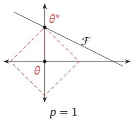

[¶0380]
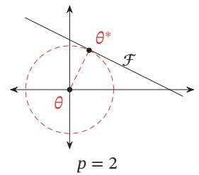

[¶0381]
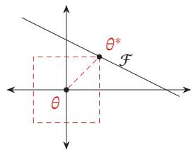  
图7.11 不同范数约束条件下的最优化问题示例

[¶0382] 一种折中的正则化方法是同时加入 $\ell _ { 1 }$ 和 $\ell _ { 2 }$ 正则化，称为弹性网络正则化（Elastic Net Regularization）[Zou et al., 2005]，

[¶0383]
$$
\theta ^ { * } = \underset { \theta } { \arg \operatorname* { m i n } } \frac { 1 } { N } \sum _ { n = 1 } ^ { N } \mathcal { L } \big ( y ^ { ( n ) } , f ( x ^ { ( n ) } ; \theta ) \big ) + \lambda _ { 1 } \ell _ { 1 } ( \theta ) + \lambda _ { 2 } \ell _ { 2 } ( \theta ) ,\tag{7.72}
$$

[¶0384] 其中 $\lambda _ { 1 }$ 和 $\lambda _ { 2 }$ 分别为两个正则化项的系数

## 7.7.2 权重衰减

[¶0385] 权重衰减（Weight Decay）是一种有效的正则化方法 [Hanson et al., 1989]，在每次参数更新时，引入一个衰减系数

[¶0386]
$$
\begin{array} { r } { \theta _ { t }  ( 1 - \beta ) \theta _ { t - 1 } - \alpha \mathbf { g } _ { t } , } \end{array}\tag{7.73}
$$

[¶0387] 其中 $\mathbf { g } _ { t }$ 为第??步更新时的梯度， $\alpha$ 为学习率， $\beta$ 为权重衰减系数，一般取值比较小，比如0.0005．在标准的随机梯度下降中，权重衰减正则化和 $\ell _ { 2 }$ 正则化的效果相同．因此，权重衰减在一些深度学习框架中通过 $\ell _ { 2 }$ 正则化来实现．但是，在较为复杂的优化方法（比如Adam）中，权重衰减正则化和 $\ell _ { 2 }$ 正则化并不等价[Loshchilov et al., 2017b]

[¶0388] 参见习题7-9

## 7.7.3 提前停止

[¶0389] 提前停止（Early Stop）对于深度神经网络来说是一种简单有效的正则化方法．由于深度神经网络的拟合能力非常强，因此比较容易在训练集上过拟合．在使用梯度下降法进行优化时，我们可以使用一个和训练集独立的样本集合，称为验证集（Validation Set），并用验证集上的错误来代替期望错误．当验证集上的错误率不再下降，就停止迭代

[¶0390] 提前停止也可以参见第2.2.3.2节

[¶0391] 然而在实际操作中，验证集上的错误率变化曲线并不一定是图2.4中所示的平衡曲线，很可能是先升高再降低．因此，提前停止的具体停止标准需要根据实际任务进行优化 [Prechelt, 1998]

## 7.7.4 丢弃法

[¶0392] 当训练一个深度神经网络时，我们可以随机丢弃一部分神经元（同时丢弃其对应的连接边）来避免过拟合，这种方法称为丢弃法（Dropout Method）[Srivastava et al., 2014]．每次选择丢弃的神经元是随机的．最简单的方法是设置一个固定的概率 $p .$ ．对每一个神经元都以概率 $p$ 来判定要不要保留．对于一个神经层 $y \ = \ f ( W x + b )$ ，我们可以引入一个掩蔽函数mask(⋅)使得 $y \ : =$ $f ( W { \bmod { \mathbf { x } } } ( { \pmb { x } } ) + { \pmb { b } } )$ ．掩蔽函数mask(⋅)的定义为

[¶0393]
$$
\mathrm { m a s k } ( { \pmb x } ) = \left\{ \begin{array} { l l } { { \pmb m } \odot { \pmb x } } & { \overset { \mathrm { a v } } { \equiv } { \hat { \mathbb { J } } } \mathbb { J } [ \left| \xi \pm \right| \Im ] [ \xi _ { \pmb X } ^ { \mathrm { n } } \mathbb { H } ] } \\ { p { \pmb x } } & { \overset { \mathrm { a v } } { \equiv } { \hat { \mathbb { J } } } \mathbb { J } [ \left| \hat { \mathbb { J } } \right| ] { \pmb \Sigma } [ \mathcal { W } ] [ \hat { \mathbb { J } } \hat { \mathbb { J } } ] } \end{array} \right.\tag{7.74}
$$

[¶0394] ??为输入??的维度

[¶0395] 其中 $\pmb { m } \in \{ 0 , 1 \} ^ { D }$ 是丢弃掩码（Dropout Mask），通过以概率为 $p$ 的伯努利分布随机生成．在训练时，激活神经元的平均数量为原来的 $p$ 倍．而在测试时，所有的神经元都是可以激活的，这会造成训练和测试时网络的输出不一致．为了缓解这个问题，在测试时需要将神经层的输入 $_ x$ 乘以 $p$ ，也相当于把不同的神经网络做了平均．保留率 $p$ 可以通过验证集来选取一个最优的值．一般来讲，对于隐藏层的神经元，其保留率 $p = 0 . 5$ 时效果最好，这对大部分的网络和任务都比较有效．当 $p = 0 . 5$ 时，在训练时有一半的神经元被丢弃，只剩余一半的神经元是可以激活的，随机生成的网络结构最具多样性．对于输入层的神经元，其保留率通常设为更接近1的数，使得输入变化不会太大．对输入层神经元进行丢弃时，相当于给数据增加噪声，以此来提高网络的鲁棒性

[¶0396] 丢弃法一般是针对神经元进行随机丢弃，但是也可以扩展到对神经元之间的连接进行随机丢弃[Wan et al., 2013]，或每一层进行随机丢弃．图7.12给出了一个网络应用丢弃法后的示例

[¶0397]
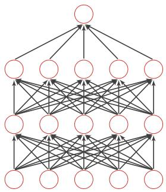  
(a)标准网络

[¶0398]
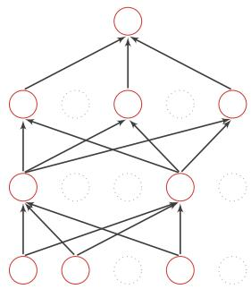  
(b)应用丢弃法后的网络  
图7.12 丢弃法示例

[¶0399] 集成学习角度的解释 每做一次丢弃，相当于从原始的网络中采样得到一个子网络．如果一个神经网络有??个神经元，那么总共可以采样出 $2 ^ { n }$ 个子网络．每次迭代都相当于训练一个不同的子网络，这些子网络都共享原始网络的参数．那么，最终的网络可以近似看作集成了指数级个不同网络的组合模型

[¶0400] 贝叶斯学习角度的解释 丢弃法也可以解释为一种贝叶斯学习的近似[Gal et al.,2016a]．用 $y = f ( \pmb { x } ; \theta )$ 来表示要学习的神经网络，贝叶斯学习是假设参数??为随机向量，并且先验分布为??(??)，贝叶斯方法的预测为

[¶0401]
$$
\mathbb { E } _ { q ( \theta ) } [ y ] = \int _ { q } f ( \pmb { x } ; \theta ) q ( \theta ) d \theta\tag{7.75}
$$

[¶0402]
$$
\approx \frac { 1 } { M } \sum _ { m = 1 } ^ { M } f ( \pmb { x } , \pmb { \theta } _ { m } ) ,\tag{7.76}
$$

[¶0403] 其中 $f ( \pmb { x } , \pmb { \theta } _ { m } )$ 为第??次应用丢弃方法后的网络，其参数 $\theta _ { m }$ 为对全部参数??的一次采样．

## 7.7.4.1 循环神经网络上的丢弃法

[¶0404] 当在循环神经网络上应用丢弃法时，不能直接对每个时刻的隐状态进行随机丢弃，这样会损害循环网络在时间维度上的记忆能力．一种简单的方法是对非时间维度的连接（即非循环连接）进行随机丢失[Zaremba et al., 2014]．如图7.13所示，虚线边表示进行随机丢弃，不同的颜色表示不同的丢弃掩码

[¶0405]
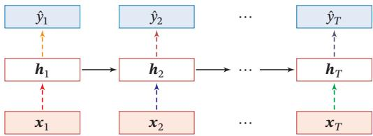  
图7.13 针对非循环连接的丢弃法

[¶0406] 然而根据贝叶斯学习的解释，丢弃法是一种对参数??的采样．每次采样的参数需要在每个时刻保持不变．因此，在对循环神经网络上使用丢弃法时，需要对参数矩阵的每个元素进行随机丢弃，并在所有时刻都使用相同的丢弃掩码．这种方法称为变分丢弃法（Variational Dropout）[Gal et al., 2016b]．图7.14给出了变分丢弃法的示例，相同颜色表示使用相同的丢弃掩码

[¶0407]
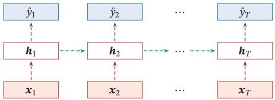  
图7.14 变分丢弃法

## 7.7.5 数据增强

[¶0408] 深度神经网络一般都需要大量的训练数据才能获得比较理想的效果．在数据量有限的情况下，可以通过数据增强（Data Augmentation）来增加数据量，提高模型鲁棒性，避免过拟合．目前，数据增强还主要应用在图像数据上，在文本等其他类型的数据上还没有太好的方法

[¶0409] 图像数据的增强主要是通过算法对图像进行转变，引入噪声等方法来增加数据的多样性．增强的方法主要有几种：

[¶0410] （1） 旋转（Rotation）：将图像按顺时针或逆时针方向随机旋转一定角度

[¶0411] （2） 翻转（Flip）：将图像沿水平或垂直方向随机翻转一定角度

[¶0412] （3） 缩放（Zoom In/Out）：将图像放大或缩小一定比例

[¶0413] （4） 平移（Shift）：将图像沿水平或垂直方法平移一定步长

[¶0414] （5） 加噪声（Noise）：加入随机噪声

## 7.7.6 标签平滑

[¶0415] 在数据增强中，我们可以给样本特征加入随机噪声来避免过拟合．同样，我们也可以给样本的标签引入一定的噪声．假设训练数据集中有一些样本的标签是被错误标注的，那么最小化这些样本上的损失函数会导致过拟合．一种改善的正则化方法是标签平滑（Label Smoothing），即在输出标签中添加噪声来避免模型过拟合 [Szegedy et al., 2016]

[¶0416] 一个样本??的标签可以用one-hot向量表示，即

[¶0417]
$$
\begin{array} { r } { { \mathbf { y } } = [ 0 , \cdots , 0 , 1 , 0 , \cdots , 0 ] ^ { \intercal } . } \end{array}
$$

[¶0418] 这种标签可以看作硬目标（Hard Target）．如果使用Softmax分类器并使用交叉熵损失函数，最小化损失函数会使得正确类和其他类的权重差异变得很大．根据Softmax函数的性质可知，如果要使得某一类的输出概率接近于1，其未归一化的得分需要远大于其他类的得分，可能会导致其权重越来越大，并导致过拟合此外，如果样本标签是错误的，会导致更严重的过拟合现象．为了改善这种情况，我们可以引入一个噪声对标签进行平滑，即假设样本以??的概率为其他类．平滑后的标签为

[¶0419]
$$
\tilde { \boldsymbol { y } } = [ \frac { \epsilon } { K - 1 } , \cdots , \frac { \epsilon } { K - 1 } , 1 - \epsilon , \frac { \epsilon } { K - 1 } , \cdots , \frac { \epsilon } { K - 1 } ] ^ { \intercal } .
$$

[¶0420] 其中??为标签数量，这种标签可以看作软目标（Soft Target）．标签平滑可以避免模型的输出过拟合到硬目标上，并且通常不会损害其分类能力

[¶0421] 参见习题7-11

[¶0422] 上面的标签平滑方法是给其他?? − 1个标签相同的概率 $\frac { \epsilon } { K - 1 }$ ，没有考虑标签之间的相关性．一种更好的做法是按照类别相关性来赋予其他标签不同的概率比如先训练另外一个更复杂（一般为多个网络的集成）的教师网络（TeacherNetwork），并使用大网络的输出作为软目标来训练学生网络（Student Net-work）．这种方法也称为知识蒸馏（Knowledge Distillation）[Hinton et al.,2015]．

## 7.8 总结和深入阅读

[¶0423] 深度神经网络的优化和正则化是既对立又统一的关系．一方面我们希望优化算法能找到一个全局最优解（或较好的局部最优解），另一方面我们又不希望模型优化到最优解，这可能陷入过拟合．优化和正则化的统一目标是期望风险最小化．近年来深度学习的快速发展在一定程度上也归因于很多深度神经网络的优化和正则化方法的出现．虽然这些方法往往是经验性的，但在实践中取得了很好的效果，使得我们可以高效地、端到端地训练神经网络模型

[¶0424] 在优化方面，训练神经网络时的主要难点是非凸优化以及梯度消失问题．在深度学习技术发展的初期，我们通常需要利用预训练和逐层训练等比较低效的方法来辅助优化．随着深度学习技术的发展，我们目前通常可以高效地、端到端地训练一个深度神经网络．这些提高训练效率的方法通常分为以下3个方面：1）修改网络模型来得到更好的优化地形，比如使用逐层归一化、残差连接以及ReLU激活函数等；2）使用更有效的优化算法，比如动态学习率以及梯度估计修正等；3）使用更好的参数初始化方法

[¶0425] 目前，预训练方法依然有着广泛的应用，但主要是利用它带来更好泛化性，而不再是为了解决网络优化问题

[¶0426] 在泛化方面，传统的机器学习中有一些很好的理论可以帮助我们在模型的表示能力、复杂度和泛化能力之间找到比较好的平衡，比如Vapnik-Chervonenkis（VC）维 [Vapnik, 1998] 和 Rademacher 复杂度 [Bartlett et al., 2002]．但是这些理论无法解释深度神经网络在实际应用中的泛化能力表现．根据通用近似定理，神经网络的表示能力十分强大．从直觉上，一个过度参数化的深度神经网络很容易产生过拟合现象，因为它的容量足够记住所有训练数据．但是实验表明，深度神经网络在训练过程中依然优先记住训练数据中的一般模式（Pattern），即具有https://nndl.github.io/

[¶0427] 高泛化能力的模式[Zhang et al., 2016]．但目前，深度神经网络的泛化能力还没有很好的理论支持．在传统机器学习模型上比较有效的 $\ell _ { 1 }$ 或 $\ell _ { 2 }$ 正则化在深度神经网络中作用也比较有限，而一些经验的做法（比如小的批量大小、大的学习率、提前停止、丢弃法、数据增强）会更有效

## 习题

[¶0428] 习题7-1 在小批量梯度下降中，试分析为什么学习率要和批量大小成正比

[¶0429] 习题7-2 在Adam算法中，说明指数加权平均的偏差修正的合理性（即公式(7.27)和公式(7.28)）

[¶0430] 习题 7-3 给出公式(7.33)和公式(7.34)中的函数 ??(⋅) 和 ??(⋅) 在不同优化算法中的具体形式

[¶0431] 习题 7-4 证明公式(7.43)

[¶0432] 习题 7-5 证明公式(7.45)

[¶0433] 习题7-6 在批量归一化中，以??(⋅)取Logistic函数或ReLU函数为例，分析以下两种归一化方法的差异： $f \big ( \mathrm { B N } ( \mathbf { W } \pmb { a } ^ { ( l - 1 ) } + \pmb { b } ) \big )$ 和 $f \big ( \boldsymbol { W } \mathrm { B N } ( \boldsymbol { a } ^ { ( l - 1 ) } ) + \boldsymbol { b } \big )$

[¶0434] 参见公式(7.51)

[¶0435] 习题7-7 从再参数化的角度来分析批量归一化中缩放和平移的意义

[¶0436] 参见公式(7.55)

[¶0437] 习题7-8 分析为什么批量归一化不能直接应用于循环神经网络

[¶0438] 习题7-9 证明在标准的随机梯度下降中，权重衰减正则化和 $\ell _ { 2 }$ 正则化的效果相同．并分析这一结论在动量法和Adam算法中是否依然成立

[¶0439] 习题7-10 试分析为什么不能在循环神经网络中的循环连接上直接应用丢弃法？习题7-11 若使用标签平滑正则化方法，给出其交叉熵损失函数

## 参考文献

[¶0440] Ba L J, Kiros R, Hinton G E, 2016. Layer normalization[J/OL]. CoRR, abs/1607.06450. http://arxiv. org/abs/1607.06450.

[¶0441] Bartlett P L, Mendelson S, 2002. Rademacher and gaussian complexities: Risk bounds and structural results[J]. Journal of Machine Learning Research, 3(Nov):463-482.

[¶0442] Bergstra J, Bengio Y, 2012. Random search for hyper-parameter optimization[J]. Journal of Machine Learning Research, 13(Feb):281-305.

[¶0443] Bergstra J S, Bardenet R, Bengio Y, et al., 2011. Algorithms for hyper-parameter optimization[C]// Advances in neural information processing systems. 2546-2554.

[¶0444] Bjorck N, Gomes C P, Selman B, et al., 2018. Understanding batch normalization[C]//Advances in Neural Information Processing Systems. 7694-7705.

[¶0445] Choromanska A, Henaff M, Mathieu M, et al., 2015. The loss surfaces of multilayer networks[C]// Artificial Intelligence and Statistics. 192-204.

[¶0446] Dauphin Y N, Pascanu R, Gulcehre C, et al., 2014. Identifying and attacking the saddle point problem in high-dimensional non-convex optimization[C]//Advances in neural information processing systems. 2933-2941.

[¶0447] Dozat T, 2016. Incorporating nesterov momentum into adam[C]//ICLR Workshop.

[¶0448] Duchi J, Hazan E, Singer Y, 2011. Adaptive subgradient methods for online learning and stochastic optimization[J]. The Journal of Machine Learning Research, 12:2121-2159.

[¶0449] Gal Y, Ghahramani Z, 2016. Dropout as a bayesian approximation: Representing model uncertainty in deep learning[C]//international conference on machine learning. 1050-1059.

[¶0450] Gal Y, Ghahramani Z, 2016. A theoretically grounded application of dropout in recurrent neural networks[C]//Advances in neural information processing systems. 1019-1027.

[¶0451] Glorot X, Bengio Y, 2010. Understanding the difficulty of training deep feedforward neural networks [C]//Proceedings of International conference on artificial intelligence and statistics. 249-256.

[¶0452] Goyal P, Dollár P, Girshick R, et al., 2017. Accurate, large minibatch sgd: Training imagenet in 1 hour[J]. arXiv preprint arXiv:1706.02677.

[¶0453] Hanson S J, Pratt L Y, 1989. Comparing biases for minimal network construction with backpropagation[C]//Advances in neural information processing systems. 177-185.

[¶0454] He K, Zhang X, Ren S, et al., 2015. Delving deep into rectifiers: Surpassing human-level performance on imagenet classification[C]//Proceedings of the IEEE International Conference on Computer Vision. 1026-1034.

[¶0455] Hinton G, Vinyals O, Dean J, 2015. Distilling the knowledge in a neural network[J]. arXiv preprint arXiv:1503.02531.

[¶0456] Hochreiter S, Schmidhuber J, 1997. Flat minima[J]. Neural Computation, 9(1):1-42.

[¶0457] Hutter F, Hoos H H, Leyton-Brown K, 2011. Sequential model-based optimization for general algorithm configuration[C]//International Conference on Learning and Intelligent Optimization. Springer: 507-523.

[¶0458] Ioffe S, Szegedy C, 2015. Batch normalization: Accelerating deep network training by reducing internal covariate shift[C]//Proceedings of the 32nd International Conference on Machine Learning. 448-456.

[¶0459] Jamieson K, Talwalkar A, 2016. Non-stochastic best arm identification and hyperparameter optimization[C]//Artificial Intelligence and Statistics. 240-248.

[¶0460] Keskar N S, Mudigere D, Nocedal J, et al., 2016. On large-batch training for deep learning: Generalization gap and sharp minima[J]. arXiv preprint arXiv:1609.04836.

[¶0461] Kingma D, Ba J, 2015. Adam: A method for stochastic optimization[C]//Proceedings of International Conference on Learning Representations.

[¶0462] Krizhevsky A, Sutskever I, Hinton G E, 2012. ImageNet classification with deep convolutional neural networks[C]//Advances in Neural Information Processing Systems 25. 1106-1114.

[¶0463] Li H, Xu Z, Taylor G, et al., 2017. Visualizing the loss landscape of neural nets[J]. arXiv preprint arXiv:1712.09913.

[¶0464] Li L, Jamieson K, DeSalvo G, et al., 2017. Hyperband: Bandit-based configuration evaluation for hyperparameter optimization[C]//Proceedings of 5th International Conference on Learning Representations.

[¶0465] Loshchilov I, Hutter F, 2017. SGDR: stochastic gradient descent with warm restarts[C]//Proceedings of 5th International Conference on Learning Representations.

[¶0466] Loshchilov I, Hutter F, 2017. Fixing weight decay regularization in adam[J]. arXiv preprint arXiv:1711.05101.

[¶0467] Luo P, Wang X, Shao W, et al., 2018. Towards understanding regularization in batch normalization [J]. arXiv preprint arXiv:1809.00846.

[¶0468] Nesterov Y, 2013. Gradient methods for minimizing composite functions[J]. Mathematical Programming, 140(1):125-161.

[¶0469] Pascanu R, Mikolov T, Bengio Y, 2013. On the difficulty of training recurrent neural networks[C]// Proceedings of the International Conference on Machine Learning. 1310-1318.

[¶0470] Prechelt L, 1998. Early stopping-but when?[M]//Neural Networks: Tricks of the trade. Springer: 55-69.

[¶0471] Salimans T, Kingma D P, 2016. Weight normalization: A simple reparameterization to accelerate training of deep neural networks[C]//Advances in Neural Information Processing Systems. 901- 909.

[¶0472] Santurkar S, Tsipras D, Ilyas A, et al., 2018. How does batch normalization help optimization?(no, it is not about internal covariate shift)[J]. arXiv preprint arXiv:1805.11604.

[¶0473] Saxe A M, Mcclelland J L, Ganguli S, 2014. Exact solutions to the nonlinear dynamics of learning in deep linear neural network[C]//International Conference on Learning Representations.

[¶0474] Snoek J, Larochelle H, Adams R P, 2012. Practical bayesian optimization of machine learning algorithms[C]//Advances in neural information processing systems. 2951-2959.

[¶0475] Snoek J, Rippel O, Swersky K, et al., 2015. Scalable bayesian optimization using deep neural networks[C]//International Conference on Machine Learning. 2171-2180.

[¶0476] Srivastava N, Hinton G, Krizhevsky A, et al., 2014. Dropout: A simple way to prevent neural networks from overfitting[J]. The Journal of Machine Learning Research, 15(1):1929-1958.

[¶0477] Sutskever I, Martens J, Dahl G, et al., 2013. On the importance of initialization and momentum in deep learning[C]//International conference on machine learning. 1139-1147.

[¶0478] Szegedy C, Vanhoucke V, Ioffe S, et al., 2016. Rethinking the inception architecture for computer vision[C]//Proceedings of the IEEE Conference on Computer Vision and Pattern Recognition. 2818-2826.

[¶0479] Tieleman T, Hinton G, 2012. Lecture 6.5-rmsprop: Divide the gradient by a running average of its recent magnitude[Z].

[¶0480] Vapnik V, 1998. Statistical learning theory[M]. New York: Wiley.

[¶0481] Wan L, Zeiler M, Zhang S, et al., 2013. Regularization of neural networks using dropconnect[C]// International Conference on Machine Learning. 1058-1066.

[¶0482] Zaremba W, Sutskever I, Vinyals O, 2014. Recurrent neural network regularization[J]. arXiv preprint arXiv:1409.2329.

[¶0483] Zeiler M D, 2012. Adadelta: An adaptive learning rate method[J]. arXiv preprint arXiv:1212.5701.

[¶0484] Zhang C, Bengio S, Hardt M, et al., 2016. Understanding deep learning requires rethinking generalization[J]. arXiv preprint arXiv:1611.03530.

[¶0485] Zoph B, Le Q V, 2017. Neural architecture search with reinforcement learning[C]//Proceedings of 5th International Conference on Learning Representations.

[¶0486] Zou H, Hastie T, 2005. Regularization and variable selection via the elastic net[J]. Journal of the Royal Statistical Society: Series B (Statistical Methodology), 67(2):301-320.
