# 第8章 注意力机制与外部记忆

[¶0001] 智慧的艺术是知道该忽视什么

[¶0002] 威廉·詹姆斯（William James）

[¶0003] 美国心理学家和哲学家

[¶0004] 根据通用近似定理，前馈网络和循环网络都有很强的能力．但由于优化算法和计算能力的限制，在实践中很难达到通用近似的能力．特别是在处理复杂任务时，比如需要处理大量的输入信息或者复杂的计算流程时，目前计算机的计算能力依然是限制神经网络发展的瓶颈

[¶0005] 为了减少计算复杂度，通过部分借鉴生物神经网络的一些机制，我们引入了局部连接、权重共享以及汇聚操作来简化神经网络结构．虽然这些机制可以有效缓解模型的复杂度和表达能力之间的矛盾，但是我们依然希望在不“过度”增加模型复杂度（主要是模型参数）的情况下来提高模型的表达能力．以阅读理解任务为例，给定的背景文章（Background Document）一般比较长，如果用循环神经网络来将其转换为向量表示，那么这个编码向量很难反映出背景文章的所有语义．在比较简单的任务（比如文本分类）中，只需要编码一些对分类有用的信息，因此用一个向量来表示文本语义是可行的．但是在阅读理解任务中，编码时还不知道可能会接收到什么样的问句．这些问句可能会涉及背景文章的所有信息点，因此丢失任何信息都可能导致无法正确回答问题

[¶0006] 神经网络中可以存储的信息量称为网络容量（Network Capacity）．一般来讲，利用一组神经元来存储信息时，其存储容量和神经元的数量以及网络的复杂度成正比．要存储的信息越多，神经元数量就要越多或者网络要越复杂，进而导致神经网络的参数成倍地增加

[¶0007] 阅读理解任务是让机器阅读一篇背景文章，然后询问一些相关的问题，来测试机器是否理解了这篇文章

[¶0008] 在循环神经网络中，丢失信息的另外一个因素是长程依赖问题

[¶0009] 我们人脑的生物神经网络同样存在网络容量问题，人脑中的工作记忆大概只有几秒钟的时间，类似于循环神经网络中的隐状态．而人脑每个时刻接收的外界输入信息非常多，包括来自于视觉、听觉、触觉的各种各样的信息．单就视觉来说，眼睛每秒钟都会发送千万比特的信息给视觉神经系统．人脑在有限的资源下，并不能同时处理这些过载的输入信息．大脑神经系统有两个重要机制可以解决信息过载问题：注意力和记忆机制

[¶0010] 我们可以借鉴人脑解决信息过载的机制，从两方面来提高神经网络处理信息的能力．一方面是注意力，通过自上而下的信息选择机制来过滤掉大量的无关信息；另一方面是引入额外的外部记忆，优化神经网络的记忆结构来提高神经网络存储信息的容量

## 8.1 认知神经学中的注意力

[¶0011] 注意力是一种人类不可或缺的复杂认知功能，指人可以在关注一些信息的同时忽略另一些信息的选择能力．在日常生活中，我们通过视觉、听觉、触觉等方式接收大量的感觉输入．但是人脑还能在这些外界的信息轰炸中有条不紊地工作，是因为人脑可以有意或无意地从这些大量输入信息中选择小部分的有用信息来重点处理，并忽略其他信息．这种能力就叫作注意力（Attention）．注意力可以作用在外部的刺激（听觉、视觉、味觉等），也可以作用在内部的意识（思考、回忆等）

[¶0012] 注意力一般分为两种：

[¶0013] （1） 自上而下的有意识的注意力，称为聚焦式注意力（Focus Attention）聚焦式注意力是指有预定目的、依赖任务的，主动有意识地聚焦于某一对象的注意力．

[¶0014] 聚焦式注意力也常称为选择性注意力（Se-lective Attention）

[¶0015] （2） 自下而上的无意识的注意力，称为基于显著性的注意力（Saliency-Based Attention）．基于显著性的注意力是由外界刺激驱动的注意，不需要主动干预，也和任务无关．如果一个对象的刺激信息不同于其周围信息，一种无意识的“赢者通吃”（Winner-Take-All）或者门控（Gating）机制就可以把注意力转向这个对象．不管这些注意力是有意还是无意，大部分的人脑活动都需要依赖注意力，比如记忆信息、阅读或思考等

[¶0016] 一个和注意力有关的例子是鸡尾酒会效应．当一个人在吵闹的鸡尾酒会上和朋友聊天时，尽管周围噪音干扰很多，他还是可以听到朋友的谈话内容，而忽略其他人的声音（聚焦式注意力）．同时，如果背景声中有重要的词（比如他的名字），他会马上注意到（显著性注意力）

[¶0017] 除非特别声明，在本节及以后章节中，注意力机制通常指自上而下的聚焦式注意力

[¶0018] 聚焦式注意力一般会随着环境、情景或任务的不同而选择不同的信息．比如当要从人群中寻找某个人时，我们会专注于每个人的脸部；而当要统计人群的人数时，我们只需要专注于每个人的轮廓

## 8.2 注意力机制

[¶0019] 在计算能力有限的情况下，注意力机制（Attention Mechanism）作为一种资源分配方案，将有限的计算资源用来处理更重要的信息，是解决信息超载问题的主要手段

[¶0020] 注 意 力 机 制 也 可 称为注意力模型

[¶0021] 当用神经网络来处理大量的输入信息时，也可以借鉴人脑的注意力机制，只选择一些关键的信息输入进行处理，来提高神经网络的效率

[¶0022] 在目前的神经网络模型中，我们可以将最大汇聚（Max Pooling）、门控（Gating）机制近似地看作自下而上的基于显著性的注意力机制．除此之外，自上而下的聚焦式注意力也是一种有效的信息选择方式．以阅读理解任务为例，给定一篇很长的文章，然后就此文章的内容进行提问．提出的问题只和段落中的一两个句子相关，其余部分都是无关的．为了减小神经网络的计算负担，只需要把相关的片段挑选出来让后续的神经网络来处理，而不需要把所有文章内容都输入给神经网络

[¶0023] 用 $\pmb { X } = [ \pmb { x } _ { 1 } , \cdots , \pmb { x } _ { N } ] \in \mathbb { R } ^ { D \times N }$ 表示?? 组输入信息，其中??维向量 ${ \pmb x } _ { n } ~ \in$ $\mathbb { R } ^ { D } , n \in [ 1 , N ]$ 表示一组输入信息．为了节省计算资源，不需要将所有信息都输入神经网络，只需要从??中选择一些和任务相关的信息．注意力机制的计算可以分为两步：一是在所有输入信息上计算注意力分布，二是根据注意力分布来计算输入信息的加权平均

[¶0024] 注意力分布 为了从?? 个输入向量 $[ \pmb { x } _ { 1 } , \cdots , \pmb { x } _ { N } ]$ 中选择出和某个特定任务相关的信息，我们需要引入一个和任务相关的表示，称为查询向量（Query Vector），并通过一个打分函数来计算每个输入向量和查询向量之间的相关性

[¶0025] 给定一个和任务相关的查询向量??，我们用注意力变量 $z \in [ 1 , N ]$ 来表示被选择信息的索引位置，即 $z = n$ 表示选择了第??个输入向量．为了方便计算，我们采用一种“软性”的信息选择机制．首先计算在给定 $\pmb q$ 和??下，选择第??个输入向量的概率 $\alpha _ { n }$

[¶0026] 查询向量??可以是动态生成的，也可以是可学习的参数

[¶0027]
$$
\begin{array} { l } { \alpha _ { n } = p ( z = n | X , q ) \ } \\ { \displaystyle \quad = \mathrm { s o f t m a x } \left( s ( x _ { n } , q ) \right) \ } \\ { \displaystyle \quad = \frac { \exp \left( s ( x _ { n } , q ) \right) } { \sum _ { j = 1 } ^ { N } \exp \left( s ( x _ { j } , q ) \right) } , } \end{array}\tag{8.1}
$$

[¶0028] 其中 $\alpha _ { n }$ 称为注意力分布（Attention Distribution）， $s ( \pmb { x } , \pmb { q } )$ 为注意力打分函数，可以使用以下几种方式来计算：

[¶0029] 加性模型

[¶0030]
$$
\begin{array} { r } { s ( \pmb { x } , \pmb { q } ) = \pmb { v } ^ { \top } \operatorname { t a n h } ( \pmb { W } \pmb { x } + \pmb { U } \pmb { q } ) , } \end{array}\tag{8.2}
$$

[¶0031] 点积模型

[¶0032]
$$
s ( \pmb { x } , \pmb q ) = \pmb { x } ^ { \top } \pmb q ,\tag{8.3}
$$

[¶0033] 缩放点积模型

[¶0034]
$$
s ( x , { \pmb q } ) = \frac { { \pmb x } ^ { \top } { \pmb q } } { \sqrt { D } } ,\tag{8.4}
$$

[¶0035]
$$
x \times \frac { 4 } { 2 } \times 1 4 \times 1 5 = 1 1
$$

[¶0036]
$$
s ( \pmb { x } , \pmb { q } ) = \pmb { x } ^ { \top } \pmb { W } \pmb { q } ,\tag{8.5}
$$

[¶0037] 其中??, ??, ??为可学习的参数，??为输入向量的维度

[¶0038] 理论上，加性模型和点积模型的复杂度差不多，但是点积模型在实现上可以更好地利用矩阵乘积，从而计算效率更高

[¶0039] 当输入向量的维度??比较高时，点积模型的值通常有比较大的方差，从而导致Softmax函数的梯度会比较小．因此，缩放点积模型可以较好地解决这个问题双线性模型是一种泛化的点积模型．假设公式(8.5)中 $\pmb { W } = \pmb { U } ^ { \top } \pmb { V }$ ，双线性模型可以写为 $s ( x , \pmb { q } ) = { { \acute { x } } ^ { \mathrm { T } } } U ^ { \mathrm { T } } V \pmb { q } = ( U \pmb { x } ) ^ { \mathrm { T } } ( V \pmb { q } )$ ，即分别对??和??进行线性变换后计算点积．相比点积模型，双线性模型在计算相似度时引入了非对称性

[¶0040] 参见习题8-2

[¶0041] 加权平均 注意力分布 $\alpha _ { n }$ 可以解释为在给定任务相关的查询??时，第??个输入向量受关注的程度．我们采用一种“软性”的信息选择机制对输入信息进行汇总，即

[¶0042]
$$
\operatorname { a t t } ( \mathbf { } X , { \pmb q } ) = \sum _ { n = 1 } ^ { N } \alpha _ { n } \mathbf { x } _ { n } ,\tag{8.6}
$$

[¶0043]
$$
\begin{array} { r } { = \mathbb { E } _ { z \sim p ( z | X , q ) } [ \pmb { x } _ { z } ] . } \end{array}\tag{8.7}
$$

[¶0044] 公式 (8.7) 称为软性注意力机制（Soft Attention Mechanism）．图8.1a给出软性注意力机制的示例

[¶0045]
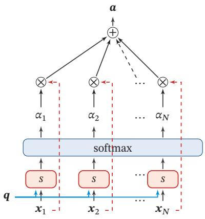  
(a)普通模式

[¶0046]
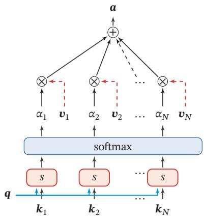  
(b)键值对模式  
图8.1 注意力机制

[¶0047] 注意力机制可以单独使用，但更多地用作神经网络中的一个组件

## 8.2.1 注意力机制的变体

[¶0048] 除了上面介绍的基本模式外，注意力机制还存在一些变化的模型

## 8.2.1.1 硬性注意力

[¶0049] 公式(8.7)提到的注意力是软性注意力，其选择的信息是所有输入向量在注意力分布下的期望．此外，还有一种注意力是只关注某一个输入向量，叫作硬性注意力（Hard Attention）

[¶0050] 硬性注意力有两种实现方式：

[¶0051] （1）一种是选取最高概率的一个输入向量，即

[¶0052]
$$
\operatorname { a t t } ( X , q ) = x _ { \hat { n } } ,\tag{8.8}
$$

[¶0053] 其中 ̂??为概率最大的输入向量的下标，即 $\hat { n } = \mathop { \arg \operatorname* { m a x } } _ { n = 1 } ^ { N } \alpha _ { n }$

[¶0054] （2）另一种硬性注意力可以通过在注意力分布式上随机采样的方式实现

[¶0055] 硬性注意力的一个缺点是基于最大采样或随机采样的方式来选择信息，使得最终的损失函数与注意力分布之间的函数关系不可导，无法使用反向传播算法进行训练．因此，硬性注意力通常需要使用强化学习来进行训练．为了使用反向传播算法，一般使用软性注意力来代替硬性注意力

## 8.2.1.2 键值对注意力

[¶0056] 更一般地，我们可以用键值对（key-value pair）格式来表示输入信息，其中“键”用来计算注意力分布 $\alpha _ { n }$ ，“值”用来计算聚合信息

[¶0057] 用 $( \pmb { K } , \pmb { V } ) = [ ( \pmb { k } _ { 1 } , \pmb { v } _ { 1 } ) , \cdots , ( \pmb { k } _ { N } , \pmb { v } _ { N } ) ]$ 表示??组输入信息，给定任务相关的查询向量 $\pmb q$ 时，注意力函数为

[¶0058]
$$
\begin{array} { r l r } {  { \mathrm { a t t } \Big ( ( K , V ) , \pmb q \Big ) = \sum _ { n = 1 } ^ { N } \alpha _ { n } \pmb v _ { n } , } } \\ & { } & { = \displaystyle \sum _ { n = 1 } ^ { N } \frac { \exp \big ( s ( \pmb { k _ { n } } , \pmb q ) \big ) } { \sum _ { j } \exp \big ( s ( \pmb { k _ { j } } , \pmb q ) \big ) } \pmb v _ { n } , } \end{array}\tag{8.9}
$$

[¶0059] (8.10)

[¶0060] 其中 $s ( k _ { n } , \pmb { q } )$ 为打分函数

[¶0061] 图8.1b给出键值对注意力机制的示例．当 $\pmb { K } = \pmb { V }$ 时，键值对模式就等价于普通的注意力机制

## 8.2.1.3 多头注意力

[¶0062] 多头注意力（Multi-Head Attention）是利用多个查询 $Q = [ \pmb { q } _ { 1 } , \cdots , \pmb { q } _ { M } ]$ ，来并行地从输入信息中选取多组信息．每个注意力关注输入信息的不同部分

[¶0063]
$$
\operatorname { a t t } \Bigl ( ( K , V ) , Q \Bigr ) = \operatorname { a t t } \Bigl ( ( K , V ) , q _ { 1 } \Bigr ) \oplus \cdots \oplus \operatorname { a t t } \Bigl ( ( K , V ) , q _ { M } \Bigr ) ,\tag{8.11}
$$

[¶0064] 其中⊕表示向量拼接

## 8.2.1.4 结构化注意力

[¶0065] 在之前介绍中，我们假设所有的输入信息是同等重要的，是一种扁平（Flat）结构，注意力分布实际上是在所有输入信息上的多项分布．但如果输入信息本身具有层次（Hierarchical）结构，比如文本可以分为词、句子、段落、篇章等不同粒度的层次，我们可以使用层次化的注意力来进行更好的信息选择 [Yang et al.,2016]．此外，还可以假设注意力为上下文相关的二项分布，用一种图模型来构建更复杂的结构化注意力分布[Kim et al., 2017]

## 8.2.1.5 指针网络

[¶0066] 注意力机制主要是用来做信息筛选，从输入信息中选取相关的信息．注意力机制可以分为两步：一是计算注意力分布??，二是根据??来计算输入信息的加权平均．我们可以只利用注意力机制中的第一步，将注意力分布作为一个软性的指针（pointer）来指出相关信息的位置

[¶0067] 指针网络（Pointer Network）[Vinyals et al., 2015] 是一种序列到序列模型，输入是长度为??的向量序列 $\pmb { X } = \pmb { x } _ { 1 } , \cdots , \pmb { x } _ { N }$ ，输出是长度为??的下标序列$\pmb { c } _ { 1 : M } = c _ { 1 } , c _ { 2 } , \cdots , c _ { M } , c _ { m } \in [ 1 , N ] , \forall m$

[¶0068] 和一般的序列到序列任务不同，这里的输出序列是输入序列的下标（索引）．比如输入一组乱序的数字，输出为按大小排序的输入数字序列的下标．比如输入为 20, 5, 10，输出为 1, 3, 2

[¶0069] 条件概率 $p ( c _ { 1 : M } | \pmb { x } _ { 1 : N } )$ 可以写为

[¶0070]
$$
\begin{array} { l } { \displaystyle p ( c _ { 1 : M } | \pmb { x } _ { 1 : N } ) = \prod _ { m = 1 } ^ { M } p ( c _ { m } | c _ { 1 : ( m - 1 ) } , \pmb { x } _ { 1 : N } ) } \\ { \approx \displaystyle \prod _ { m = 1 } ^ { M } p ( c _ { m } | \pmb { x } _ { c _ { 1 } } , \cdots , \pmb { x } _ { c _ { m - 1 } } , \pmb { x } _ { 1 : N } ) , } \end{array}\tag{8.12}
$$

[¶0071] (8.13)

[¶0072] 其中条件概率 $p ( c _ { m } | \pmb { x } _ { c _ { 1 } } , \cdots , \pmb { x } _ { c _ { ( m - 1 ) } } , \pmb { x } _ { 1 : N } )$ 可以通过注意力分布来计算．假设用一个循环神经网络对 $\pmb { x } _ { c _ { 1 } } , \cdots , \pmb { x } _ { c _ { m - 1 } } , \pmb { x } _ { 1 : N }$ 进行编码得到向量 $\pmb { h } _ { m }$ ，则

[¶0073]
$$
p ( c _ { m } | c _ { 1 : ( m - 1 ) } , \boldsymbol { x } _ { 1 : N } ) = \mathrm { s o f t m a x } ( s _ { m , n } ) ,\tag{8.14}
$$

[¶0074] 其中 $s _ { m , n }$ 为在解码过程的第??步时， $\pmb { h } _ { m }$ 对 $\pmb { h } _ { n }$ 的未归一化的注意力分布，即

[¶0075]
$$
s _ { m , n } = { \pmb v } ^ { \top } \operatorname { t a n h } ( { \pmb W } { \pmb x } _ { n } + { \pmb U } { \pmb h } _ { m } ) , \forall n \in [ 1 , N ] ,\tag{8.15}
$$

[¶0076] 其中 $\mathbf { v } ,$ ??, ??为可学习的参数

[¶0077] 图8.2给出了指针网络的示例，其中 $\pmb { h } _ { 1 } , \pmb { h } _ { 2 } , \pmb { h } _ { 3 }$ 为输入数字20, 5, 10经过循环神经网络的隐状态， $\pmb { h } _ { 0 }$ 对应一个特殊字符 $\mathbf { \overrightarrow { \mathbf { \sigma } } } _ { < } ,$ ．当输入 $\mathbf { \Phi } ^ { \star } > \mathbf { \Phi } ^ { \star }$ 时，网络一步一步输出三个输入数字从大到小排列的下标

[¶0078]
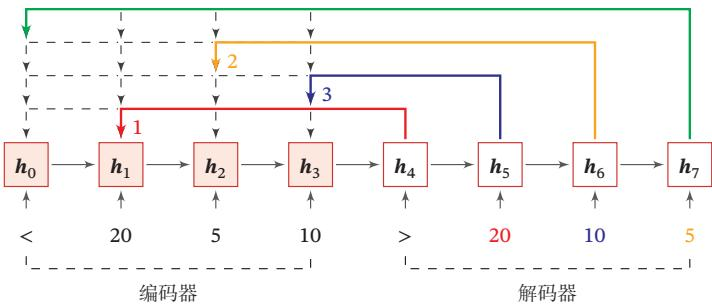  
图8.2 指针网络

## 8.3 自注意力模型

[¶0079] 当使用神经网络来处理一个变长的向量序列时，我们通常可以使用卷积网络或循环网络进行编码来得到一个相同长度的输出向量序列，如图8.3所示

[¶0080]
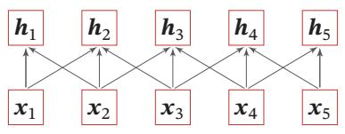  
(a)卷积网络

[¶0081]
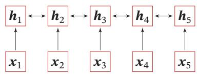  
(b)双向循环网络  
图8.3 基于卷积网络和循环网络的变长序列编码

[¶0082] 基于卷积或循环网络的序列编码都是一种局部的编码方式，只建模了输入信息的局部依赖关系．虽然循环网络理论上可以建立长距离依赖关系，但是由于信息传递的容量以及梯度消失问题，实际上也只能建立短距离依赖关系

[¶0083] 如果要建立输入序列之间的长距离依赖关系，可以使用以下两种方法：一种方法是增加网络的层数，通过一个深层网络来获取远距离的信息交互；另一种方法是使用全连接网络．全连接网络是一种非常直接的建模远距离依赖的模型，但https://nndl.github.io/

[¶0084] 是无法处理变长的输入序列．不同的输入长度，其连接权重的大小也是不同的这时我们就可以利用注意力机制来“动态”地生成不同连接的权重，这就是自注意力模型（Self-Attention Model）

[¶0085] 自注意力也称为内部 注 意 力（Intra-Attention）

[¶0086] 为了提高模型能力，自注意力模型经常采用查询-键-值（Query-Key-Value，QKV）模式，其计算过程如图8.4所示，其中红色字母表示矩阵的维度

[¶0087]
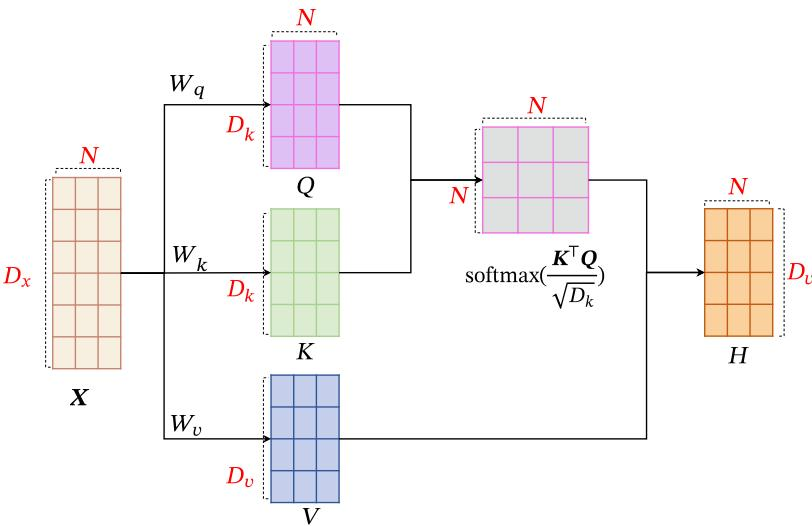  
图8.4 自注意力模型的计算过程

[¶0088] 假设输入序列为 $\pmb { X } = [ \pmb { x } _ { 1 } , \cdots , \pmb { x } _ { N } ] \in \mathbb { R } ^ { D _ { { x } } \times N }$ ，输出序列为 ${ \pmb { H } } = [ { \pmb { h } } _ { 1 } , \cdots , { \pmb { h } } _ { N } ] \in$ ℝ $D _ { v } { \times } N$ ，自注意力模型的具体计算过程如下：

[¶0089] （1）对于每个输入 $\mathbf { \boldsymbol { x } } _ { i }$ ，我们首先将其线性映射到三个不同的空间，得到查询向量 $\mathbf { q } _ { i } \in \mathbb { R } ^ { D _ { k } }$ 、键向量 $\pmb { k } _ { i } \in$ ℝ $D _ { k }$ 和值向量 $\pmb { v } _ { i } \in \mathbb { R } ^ { D _ { v } }$

[¶0090] 对于整个输入序列??，线性映射过程可以简写为

[¶0091]
$$
Q = W _ { q } X \in \mathbb { R } ^ { D _ { k } \times N } ,\tag{8.16}
$$

[¶0092]
$$
\pmb { K } = \pmb { W } _ { k } \pmb { X } \in \mathbb { R } ^ { D _ { k } \times N } ,\tag{8.17}
$$

[¶0093] 由于在自注意力模型中通常使用点积来计算注意力打分，这里查询向量和键向量的维度是相同的

[¶0094]
$$
V = W _ { v } X \in \mathbb R ^ { D _ { v } \times N } ,\tag{8.18}
$$

[¶0095] 其中 $W _ { q } \in \mathbb { R } ^ { D _ { k } \times D _ { x } } , W _ { k } \in \mathbb { R } ^ { D _ { k } \times D _ { x } } , W _ { v } \in \mathbb { R } ^ { D _ { v } \times D _ { x } }$ 分别为线性映射的参数矩阵，$Q = [ \pmb { q } _ { 1 } , \cdots , \pmb { q } _ { N } ] , \pmb { K } = [ \pmb { k } _ { 1 } , \cdots , \pmb { k } _ { N } ] , \pmb { V } = [ \pmb { v } _ { 1 } , \cdots , \pmb { v } _ { N } ]$ 分别是由查询向量、键向量和值向量构成的矩阵

[¶0096] （2）对于每一个查询向量 ${ \pmb q } _ { n } \in { \pmb Q }$ ，利用公式(8.9)的键值对注意力机制，可以得到输出向量 $\pmb { h } _ { n }$

[¶0097]
$$
\pmb { h } _ { n } = \mathrm { a t t } \Big ( ( \pmb { K } , \pmb { V } ) , \pmb { q } _ { n } \Big )\tag{8.19}
$$

[¶0098] https://nndl.github.io/

[¶0099]
$$
\begin{array} { l } { \displaystyle = \sum _ { j = 1 } ^ { N } \alpha _ { n j } { \pmb v } _ { j } } \\ { \displaystyle = \sum _ { j = 1 } ^ { N } \mathrm { s o f t m a x } \big ( s ( { \pmb k } _ { j } , { \pmb q } _ { n } ) \big ) { \pmb v } _ { j } , } \end{array}\tag{8.20}
$$

[¶0100] (8.21)

[¶0101] 其中 $n , j \in [ 1 , N ]$ 为输出和输入向量序列的位置， $\alpha _ { n j }$ 表示第??个输出关注到第??个输入的权重

[¶0102] 如果使用缩放点积来作为注意力打分函数，输出向量序列可以简写为

[¶0103]
$$
H = V \mathrm { s o f t m a x } ( \frac { K ^ { \top } Q } { \sqrt { D _ { k } } } ) ,\tag{8.22}
$$

[¶0104] 其中softmax(⋅)为按列进行归一化的函数

[¶0105] 图8.5给出全连接模型和自注意力模型的对比，其中实线表示可学习的权重，虚线表示动态生成的权重．由于自注意力模型的权重是动态生成的，因此可以处理变长的信息序列

[¶0106]
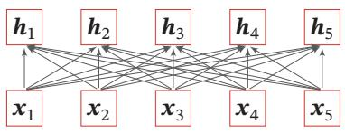  
(a)全连接模型

[¶0107]
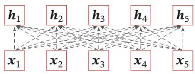  
(b)自注意力模型  
图8.5 全连接模型和自注意力模型

[¶0108] 自注意力模型可以作为神经网络中的一层来使用，既可以用来替换卷积层和循环层[Vaswani et al., 2017]，也可以和它们一起交替使用（比如?? 可以是卷积层或循环层的输出）．自注意力模型计算的权重 $\alpha _ { i j }$ 只依赖于 $\pmb q _ { i }$ 和 $k _ { j }$ 的相关性，而忽略了输入信息的位置信息．因此在单独使用时，自注意力模型一般需要加入位置编码信息来进行修正[Vaswani et al., 2017]．自注意力模型可以扩展为多头自注意力（Multi-Head Self-Attention）模型，在多个不同的投影空间中捕捉不同的交互信息

[¶0109] 参见习题8-3

[¶0110] 多头自注意力参见第15.6.3节

## 8.4 人脑中的记忆

[¶0111] 在生物神经网络中，记忆是外界信息在人脑中的存储机制．大脑记忆毫无疑问是通过生物神经网络实现的．虽然其机理目前还无法解释，但直观上记忆机制和神经网络的连接形态以及神经元的活动相关．生理学家发现信息是作为https://nndl.github.io/

[¶0112] 一种整体效应（Collective Effect）存储在大脑组织中．当大脑皮层的不同部位损伤时，其导致的不同行为表现似乎取决于损伤的程度而不是损伤的确切位置[Kohonen,2012]．大脑组织的每个部分似乎都携带一些导致相似行为的信息．也就是说，记忆在大脑皮层是分布式存储的，而不是存储于某个局部区域[Thomp-son, 1975]

[¶0113] 人脑中的记忆具有周期性和联想性

[¶0114] 记忆周期 虽然我们还不清楚人脑记忆的存储机制，但是已经大概可以确定不同脑区参与了记忆形成的几个阶段．人脑记忆的一个特点是，记忆一般分为长期记忆和短期记忆．长期记忆（Long-Term Memory），也称为结构记忆或知识（Knowledge），体现为神经元之间的连接形态，其更新速度比较慢．短期记忆（Short-Term Memory）体现为神经元的活动，更新较快，维持时间为几秒至几分钟．短期记忆是神经连接的暂时性强化，通过不断巩固、强化可形成长期记忆．短期记忆、长期记忆的动态更新过程称为演化（Evolution）过程

[¶0115] 因此，长期记忆可以类比于人工神经网络中的权重参数，而短期记忆可以类比于人工神经网络中的隐状态

[¶0116] 除了长期记忆和短期记忆，人脑中还会存在一个“缓存”，称为工作记忆（Working Memory）．在执行某个认知行为（比如记下电话号码，做算术运算）时，工作记忆是一个记忆的临时存储和处理系统，维持时间通常为几秒钟．从时间上看，工作记忆也是一种短期记忆，但和短期记忆的内涵不同．短期记忆一般指外界的输入信息在人脑中的表示和短期存储，不关心这些记忆如何被使用；而工作记忆是一个和任务相关的“容器”，可以临时存放和某项任务相关的短期记忆和其他相关的内在记忆．工作记忆的容量比较小，一般可以容纳4组项目

[¶0117] 事实上，人脑记忆周期的划分并没有清晰的界限，也存在其他的划分方法

[¶0118] 作为不严格的类比，现代计算机的存储也可以按照不同的周期分为不同的存储单元，比如寄存器、内存、外存（比如硬盘等）

[¶0119] 联想记忆 大脑记忆的一个主要特点是通过联想来进行检索的．联想记忆（As-sociative Memory）是指一种学习和记住不同对象之间关系的能力，比如看见一个人然后想起他的名字，或记住某种食物的味道等

[¶0120] 联想记忆是指一种可以通过内容匹配的方法进行寻址的信息存储方式，也称为基于内容寻址的存储（Content-Addressable Memory，CAM）．作为对比，现代计算机的存储方式是根据地址来进行存储的，称为随机访问存储（RandomAccess Memory，RAM）

[¶0121] 联想记忆是一个人工智能、计算机科学和认知科学等多个交叉领域的热点研究问题，不同学科中的内涵也不太相同

[¶0122] 和之前介绍的LSTM中的记忆单元相比，外部记忆可以存储更多的信息，并且不直接参与计算，通过读写接口来进行操作．而LSTM模型中的记忆单元包含了信息存储和计算两种功能，不能存储太多的信息．因此，LSTM中的记忆单元可以类比于计算机中的寄存器，而外部记忆可以类比于计算机中的内存单元

[¶0123] 借鉴人脑中工作记忆，可以在神经网络中引入一个外部记忆单元来提高网络容量．外部记忆的实现途径有两种：一种是结构化的记忆，这种记忆和计算机中的信息存储方法比较类似，可以分为多个记忆片段，并按照一定的结构来存储；另一种是基于神经动力学的联想记忆，这种记忆方式具有更好的生物学解释性．

[¶0124] 表8.1给出了不同领域中记忆模型的不严格类比．值得注意的是，由于人脑的记忆机制十分复杂，这里列出的类比关系并不严格

[¶0125] 表8.1 不同领域中记忆模型的不严格类比
<table><tr><td>记忆周期</td><td>计算机</td><td>人脑</td><td>神经网络</td></tr><tr><td>短期</td><td>寄存器</td><td>短期记忆</td><td>状态（神经元活性）</td></tr><tr><td>中期</td><td>内存</td><td>工作记忆</td><td>外部记忆</td></tr><tr><td>长期</td><td>外存</td><td>长期记忆</td><td>可学习参数</td></tr><tr><td>存储方式</td><td>随机寻址</td><td>内容寻址</td><td>内容寻址为主</td></tr></table>

## 8.5 记忆增强神经网络

[¶0126] 为了增强网络容量，我们可以引入辅助记忆单元，将一些和任务相关的信息保存在辅助记忆中，在需要时再进行读取，这样可以有效地增加网络容量．这个引入的辅助记忆单元一般称为外部记忆（External Memory），以区别于循环神经网络的内部记忆（即隐状态）．这种装备外部记忆的神经网络也称为记忆增强神经网络（Memory Augmented Neural Network，MANN），或简称为记忆网络（Memory Network，MN）

[¶0127] 记忆网络的典型结构如图8.6所示，一般由以下几个模块构成：

[¶0128] 以循环神经网络为例，其内部记忆可以类比于计算机的寄存器，外部记忆可以类比于计算机的内存

[¶0129]
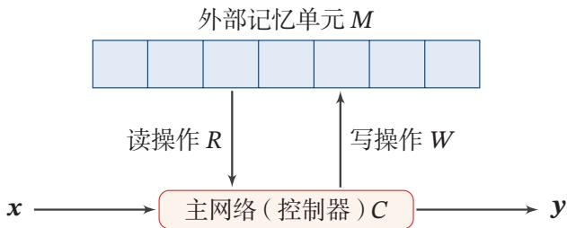  
图8.6 记忆网络的典型结构

[¶0130] （1） 主网络??：也称为控制器（Controller），负责信息处理，以及与外界的交互（接受外界的输入信息并产生输出到外界）．主网络还同时通过读写模块和外部记忆进行交互

[¶0131] （2） 外部记忆单元??：外部记忆单元用来存储信息，一般可以分为很多记忆片段（Memory Segment），这些记忆片段按照一定的结构来进行组织．记忆片段一般用向量来表示，外部记忆单元可以用一组向量 $\pmb { M } = [ \pmb { m } _ { 1 } , \cdots , \pmb { m } _ { N } ]$ 来表示．这些向量的组织方式可以是集合、树、栈或队列等．大部分信息存储于外部记忆中，不需要全时参与主网络的运算

[¶0132] 参见习题8-4

[¶0133] （3） 读取模块??：根据主网络生成的查询向量 $\pmb q _ { r }$ ，从外部记忆单元中读取相应的信息 $r = R ( \pmb { M } , \pmb { q } _ { r } )$

[¶0134] （4） 写入模块??：根据主网络生成的查询向量 $\pmb q _ { w }$ 和要写入的信息??来更新外部记忆 $\pmb { M } = W ( \pmb { M } , \pmb { q } _ { w } , \pmb { a } )$

[¶0135] 这种结构化的外部记忆是带有地址的，即每个记忆片段都可以按地址读取和写入．要实现类似于人脑神经网络的联想记忆能力，就需要按内容寻址的方式进行定位，然后进行读取或写入操作．按内容寻址通常使用注意力机制来进行通过注意力机制可以实现一种“软性”的寻址方式，即计算一个在所有记忆片段上的分布，而不是一个单一的绝对地址．比如读取模型??的实现方式可以为

[¶0136]
$$
r = \sum _ { n = 1 } ^ { N } \alpha _ { n } { \mathbf { } } m _ { n } ,\tag{8.23}
$$

[¶0137]
$$
\alpha _ { n } = \operatorname { s o f t m a x } { \Big ( } s ( \pmb { m } _ { n } , \pmb { q } _ { r } ) { \Big ) } ,\tag{8.24}
$$

[¶0138] 其中 $\pmb q _ { r }$ 是主网络生成的查询向量， $s ( \cdot , \cdot )$ 为打分函数．类比于计算机的存储器读取，计算注意力分布的过程相当于是计算机的“寻址”过程，信息加权平均的过程相当于计算机的“内容读取”过程．因此，结构化的外部记忆也是一种联想记忆，只是其结构以及读写的操作方式更像是受计算机架构的启发

[¶0139] 通过引入外部记忆，可以将神经网络的参数和记忆容量“分离”，即在少量增加网络参数的条件下可以大幅增加网络容量．因此，我们可以将注意力机制看作一个接口，将信息的存储与计算分离

[¶0140] 外部记忆从记忆结构、读写方式等方面可以演变出很多模型．比较典型的结构化外部记忆模型包括端到端记忆网络、神经图灵机等

## 8.5.1 端到端记忆网络

[¶0141] 端到端记忆网络（End-To-End Memory Network，MemN2N）[Sukhbaataret al., 2015]采用一种可微的网络结构，可以多次从外部记忆中读取信息．在端到端记忆网络中，外部记忆单元是只读的

[¶0142] 给定一组需要存储的信息 $m _ { 1 : N } = \{ m _ { 1 } , \cdots , m _ { N } \}$ ，首先将其转换成两组记忆片段 $A = [ \pmb { a } _ { 1 } , \cdots , \pmb { a } _ { N } ]$ 和 $C = [ \pmb { c } _ { 1 } , \cdots , \pmb { c } _ { N } ]$ ，分别存放在两个外部记忆单元中，其中??用来进行寻址， $C$ 用来进行输出

[¶0143] 为简单起见，这两组记忆单元可以合并，即$A = C$

[¶0144] 主网络根据输入 $_ { x }$ 生成 $\pmb q .$ ，并使用键值对注意力机制来从外部记忆中读取相关信息??，

[¶0145]
$$
r = \sum _ { n = 1 } ^ { N } \mathrm { s o f t m a x } ( \mathbf { a } _ { n } ^ { \top } \mathbf { \pmb q } ) \mathbf { c } _ { n } ,\tag{8.25}
$$

[¶0146] 并产生输出

[¶0147]
$$
\begin{array} { r } { { \boldsymbol { y } } = f ( { \boldsymbol { q } } + { \boldsymbol { r } } ) , } \end{array}\tag{8.26}
$$

[¶0148] 其中 $f ( \cdot )$ 为预测函数．当应用到分类任务时， $, f ( \cdot )$ 可以设为Softmax函数

[¶0149] 多跳操作 为了实现更复杂的计算，我们可以让主网络和外部记忆进行多轮交互．在第??轮交互中，主网络根据上次从外部记忆中读取的信息 $\boldsymbol { r } ^ { ( k - 1 ) }$ ，产生新的查询向量

[¶0150]
$$
\pmb q ^ { ( k ) } = \pmb r ^ { ( k - 1 ) } + \pmb q ^ { ( k - 1 ) } ,\tag{8.27}
$$

[¶0151] 其中 $\pmb q ^ { ( 0 ) }$ 为初始的查询向量， $\mathbf { \boldsymbol { r } } ^ { ( 0 ) } = 0 .$

[¶0152] 假设第??轮交互的外部记忆为 $A ^ { ( k ) }$ 和 $C ^ { ( k ) }$ ，主网络从外部记忆读取信息为

[¶0153]
$$
\pmb { r } ^ { ( k ) } = \sum _ { n = 1 } ^ { N } \mathrm { s o f t m a x } ( ( \pmb { a } _ { n } ^ { ( k ) } ) ^ { \top } \pmb { q } ^ { ( k ) } ) \pmb { c } _ { n } ^ { ( k ) } .\tag{8.28}
$$

[¶0154] 在??轮交互后，用 $\pmb { y } = f ( \pmb { q } ^ { ( K ) } + \pmb { r } ^ { ( K ) } )$ 进行预测．这种多轮的交互方式也称为多跳（Multi-Hop）操作．多跳操作中的参数一般是共享的．为了简化起见，每轮交互的外部记忆也可以共享使用，比如 $A ^ { ( 1 ) } = \cdots = A ^ { ( K ) }$ 和 $C ^ { ( 1 ) } = \cdots = C ^ { ( K ) }$

[¶0155] 端到端记忆网络结构如图8.7所示

[¶0156]
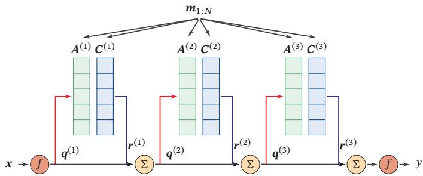  
图8.7 端到端记忆网络

## 8.5.2 神经图灵机

[¶0157] 图灵机 图灵机（Turing Machine）是图灵在1936年提出的一种抽象数学模型，可以用来模拟任何可计算问题[Turing, 1937]．图灵机的结构如图8.8所示，其中控制器包括状态寄存器、控制规则

[¶0158]
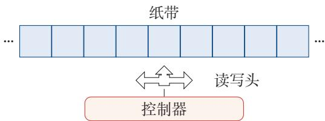  
图8.8 图灵机结构示例

[¶0159] 图灵机由以下几个组件构成：

[¶0160] （1） 一条无限长的纸带：纸带上有一个个方格，每个方格可以存储一个符号．

[¶0161] （2） 一个符号表：纸带上可能出现的所有符号的集合，包含一个特殊的空白符．

[¶0162] （3） 一个读写头：指向纸带上某个方格的指针，每次可以向左或右移动一个位置，并可以读取、擦除、写入当前方格中的内容

[¶0163] （4） 一个状态寄存器：用来保存图灵机当前所处的状态，其中包含两个特殊的状态：起始状态和终止状态

[¶0164] （5） 一套控制规则：根据当前机器所处的状态以及当前读写头所指的方格上的符号来确定读写头下一步的动作，令机器进入一个新的状态

[¶0165] 神经图灵机 神经图灵机（Neural Turing Machine，NTM）[Graves et al., 2014]主要由两个部件构成：控制器和外部记忆．外部记忆定义为矩阵 $M \in \mathbb { R } ^ { D \times N }$ ，这里??是记忆片段的数量，??是每个记忆片段的大小．控制器为一个前馈或循环神经网络．神经图灵机中的外部记忆是可读写的，其结构如图8.9所示

[¶0166] 在每个时刻??，控制器接受当前时刻的输入 $\mathbf { \boldsymbol { x } } _ { t }$ 、上一时刻的输出 $\pmb { h } _ { t - 1 }$ 和上一时刻从外部记忆中读取的信息 $r _ { t - 1 }$ ，并产生输出 $\pmb { h } _ { t }$ ，同时生成和读写外部记忆相关的三个向量：查询向量 $\pmb q _ { t }$ 、删除向量 $\mathbf { } e _ { t }$ 和增加向量 $\mathbf { \pmb { a } } _ { t }$ ．然后对外部记忆 $\mathcal { M } _ { t }$ 进行读写操作，生成读向量 $r _ { t }$ 和新的外部记忆 $M _ { t + 1 }$

[¶0167] 神经图灵机中还实现了比较复杂的基于位置的寻址方式．这里我们只介绍比较简单的基于内容的寻址方式，整个框架不变

[¶0168] 读操作 在时刻??, 外部记忆的内容记为 $\pmb { M } _ { t } = [ \pmb { m } _ { t , 1 } , \cdots , \pmb { m } _ { t , N } ]$ ，读操作为从外部记忆 $\pmb { M } _ { t }$ 中读取信息 $\boldsymbol { r } _ { t } \in \mathbb { R } ^ { D }$

[¶0169] 首先通过注意力机制来进行基于内容的寻址，即

[¶0170]
$$
\alpha _ { t , n } = \operatorname { s o f t m a x } { \Big ( } s ( \pmb { m } _ { t , n } , \pmb { q } _ { t } ) { \Big ) } ,\tag{8.29}
$$

[¶0171]
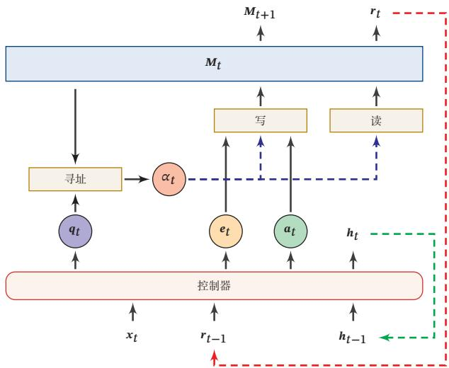  
图8.9 神经图灵机示例

[¶0172] 其中 $\pmb q _ { t }$ 为控制器产生的查询向量，用来进行基于内容的寻址．函数 $s ( \cdot , \cdot )$ 为加性或乘性的打分函数．注意力分布 $\alpha _ { t , n }$ 是记忆片段 ${ \mathbf { } } m _ { t , n }$ 对应的权重，并满足$\begin{array} { r } { \sum _ { n = 1 } ^ { N } \alpha _ { t , n } = 1 } \end{array}$

[¶0173] 根据注意力分布 $\alpha _ { t }$ ，可以计算读向量（read vector） $r _ { t }$ 作为下一个时刻控制器的输入

[¶0174]
$$
\pmb { r } _ { t } = \sum _ { n = 1 } ^ { N } \alpha _ { n } \pmb { m } _ { t , n } .\tag{8.30}
$$

[¶0175] 写操作 外部记忆的写操作可以分解为两个子操作：删除和增加

[¶0176] 首先，控制器产生删除向量（erase vector） $\mathbf { } e _ { t }$ 和增加向量（add vector） $\mathbf { a } _ { t }$ 分别为要从外部记忆中删除的信息和要增加的信息．删除操作是根据注意力分布来按比例地在每个记忆片段中删除 $\mathbf { } e _ { t }$ ，增加操作是根据注意力分布来按比例地给每个记忆片段加入 $\mathbf { \delta } \mathbf { a } _ { t } .$ ．具体过程如下：

[¶0177]
$$
\pmb { m } _ { t + 1 , n } = \pmb { m } _ { t , n } ( \mathbf { 1 } - \alpha _ { t , n } \pmb { e } _ { t } ) + \alpha _ { t , n } \pmb { a } _ { t } , \qquad \forall n \in [ 1 , N ]\tag{8.31}
$$

[¶0178] 通过写操作得到下一时刻的外部记忆 $\pmb { M } _ { t + 1 }$

## 8.6 基于神经动力学的联想记忆

[¶0179] 结构化的外部记忆更多是受现代计算机架构的启发，将计算和存储功能进行分离，这些外部记忆的结构也缺乏生物学的解释性．为了具有更好的生物学解https://nndl.github.io/

[¶0180] 释性，还可以将基于神经动力学（Neurodynamics）的联想记忆模型引入到神经网络以增加网络容量

[¶0181] 联想记忆模型（Associative Memory Model）主要是通过神经网络的动态演化来进行联想，有两种应用场景

[¶0182] 神经动力学是将神经网络作为非线性动力系统，研究其随时间变化的规律以及稳定性等问题

[¶0183] 1）输入的模式和输出的模式在同一空间，这种模型叫作自联想模型（Auto-Associative Model）．自联想模型可以通过前馈神经网络或者循环神经网络来实现，也常称为自编码器（Auto-Encoder，AE）．2）输入的模式和输出的模式不在同一空间，这种模型叫作异联想模型（Hetero-Associative Model）．从广义上讲，大部分机器学习问题都可以被看作异联想，因此异联想模型可以作为分类器使用．

[¶0184] 联想记忆模型可以利用神经动力学的原理来实现按内容寻址的信息存储和检索．一个经典的联想记忆模型为Hopfield网络

## 8.6.1 Hopfield 网络

[¶0185] 本书中之前介绍的神经网络都是作为一种机器学习模型的输入-输出映射函数，其参数学习方法是通过梯度下降方法来最小化损失函数．除了作为机器学习模型外，神经网络还可以作为一种记忆的存储和检索模型

[¶0186] Hopfield网络（Hopfield Network）是一种循环神经网络模型，由一组互相连接的神经元组成．Hopfield网络也可以认为是所有神经元都互相连接的不分层的神经网络．每个神经元既是输入单元，又是输出单元，没有隐藏神经元．一个神经元和自身没有反馈相连，不同神经元之间连接权重是对称的

[¶0187] 图8.10给出了Hopfield网络的结构示例

[¶0188]
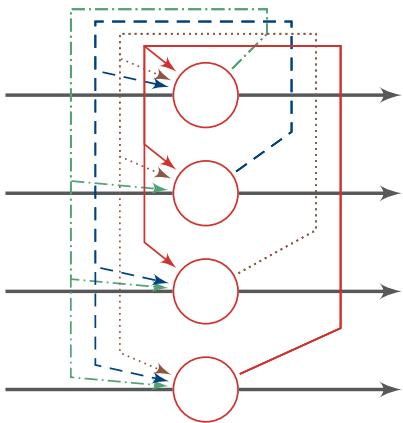  
图 8.10 四个节点的 Hopfield 网络

[¶0189] 假设一个Hopfield网络有??个神经元，第??个神经元的更新规则为

[¶0190]
$$
s _ { i } = \left\{ \begin{array} { l l } { + 1 } & { \mathrm { i f } \sum _ { j = 1 } ^ { M } w _ { i j } s _ { j } + b _ { i } \geq 0 , } \\ { - 1 } & { \mathrm { o t h e r w i s e } , } \end{array} \right.\tag{8.32}
$$

[¶0191] 其中 $w _ { i j }$ 为神经元??和??之间的连接权重， $b _ { i }$ 为偏置

[¶0192] 这里我们只介绍离散Hopfield网络，神经元状态为{+1, −1}两种除此之外，还有连续Hopfield网络，即神经元状态为连续值

[¶0193] 连接权重 $w _ { i j }$ 有以下性质：

[¶0194]
$$
\begin{array} { r l } { w _ { i i } } & { = 0 \qquad \forall i \in [ 1 , M ] } \\ & { } \\ { w _ { i j } } & { = w _ { j i } \quad \forall i , j \in [ 1 , M ] . } \end{array}\tag{8.33}
$$

[¶0195] Hopfield网络的更新可以分为异步和同步两种方式．异步更新是指每次更新一个神经元，神经元的更新顺序可以是随机或事先固定的．同步更新是指一次更新所有的神经元，需要有一个时钟来进行同步．第??时刻的神经元状态为$\pmb { s } _ { t } = [ s _ { t , 1 } , s _ { t , 2 } , \cdots , s _ { t , M } ] ^ { \intercal }$ ，其更新规则为

[¶0196]
$$
\begin{array} { r } { \pmb { s } _ { t } = f ( \pmb { W } \pmb { s } _ { t - 1 } + \pmb { b } ) , } \end{array}\tag{8.34}
$$

[¶0197] 其中 $\pmb { s } _ { 0 } = \pmb { x } , \pmb { W } = [ w _ { i j } ] _ { \pmb { M } \times \pmb { M } }$ 为连接权重， $\pmb { b } = [ b _ { i } ] _ { M \times 1 }$ 为偏置向量， $f ( \cdot )$ 为非线性阶跃函数

[¶0198] 能量函数 在Hopfield网络中，我们给每个不同的网络状态定义一个标量属性，称为“能量”．Hopfield网络的能量函数（Energy Function）?? 定义为

[¶0199]
$$
E = - \frac { 1 } { 2 } \sum _ { i , j } w _ { i j } s _ { i } s _ { j } - \sum _ { i } b _ { i } s _ { i }\tag{8.35}
$$

[¶0200]
$$
\mathbf { \Sigma } = - \frac { 1 } { 2 } \pmb { s } ^ { \intercal } \pmb { W } \pmb { s } - \pmb { b } ^ { \intercal } \pmb { s } .
$$

[¶0201] 能量函数??是Hopfield网络的Lyapunov函数Lyapunov 定理是非线性动力系统中保证系统稳定性的充分条件

[¶0202] (8.36)

[¶0203] Hopfield网络是稳定的，即能量函数经过多次迭代后会达到收敛状态．权重对称是一个重要特征，因为它保证了能量函数在神经元激活时单调递减，而不对称的权重可能导致周期性振荡或者混乱

[¶0204] 给定一个外部输入，网络经过演化，会达到某个稳定状态．这些稳定状态称为吸引点（Attractor）．在一个Hopfield网络中，通常有多个吸引点，每个吸引点为一个能量的局部最优点

[¶0205] 图8.11给出了Hopfield网络的能量函数．红线为网络能量的演化方向，蓝点为吸引点

[¶0206]
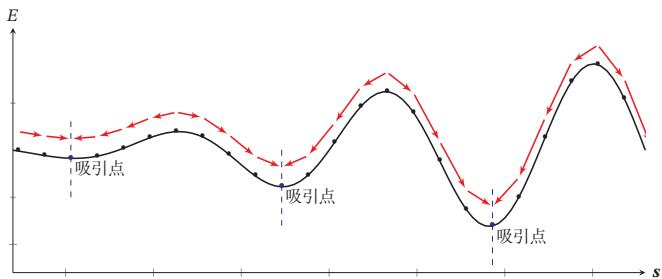  
图 8.11 Hopfield 网络的能量函数

[¶0207] 联想记忆 Hopfield网络存在有限的吸引点（Attractor），即能量函数的局部最小点．每个吸引点??都对应一个“管辖”区域 $\mathcal { R } _ { u }$ ．若输入向量??落入这个区域，网络最终会收敛到??．因此，我们可以把吸引点看作网络中存储的模式（Pattern）

[¶0208] 将网络输入??作为起始状态，随时间收敛到吸引点??上的过程作为检索过程．即使输入向量??只包含部分信息或包含噪声，只要其位于对应存储模式的“吸引”区域内，那么随着时间演化，网络最终会收敛到其对应的存储模式．因此，Hopfield的检索是基于内容寻址的检索，具有联想记忆能力

[¶0209] 信息存储 信息存储是指将一组向量 $\pmb { x } _ { 1 } , \cdots , \pmb { x } _ { N }$ 存储在网络中的过程．存储过程主要是调整神经元之间的连接权重，因此可以看作一种学习过程．Hopfield网络的学习规则有很多种．一种最简单的学习方式为：神经元??和 $j$ 之间的连接权重通过下面公式得到

[¶0210]
$$
w _ { i j } = \frac { 1 } { N } \sum _ { n = 1 } ^ { N } x _ { i } ^ { ( n ) } x _ { j } ^ { ( n ) } ,\tag{8.37}
$$

[¶0211] 其中 $x _ { i } ^ { ( n ) }$ 是第??个输入向量的第??维特征．如果 $x _ { i }$ 和?? 在输入向量中相同的概率 $x _ { j }$ 越多，则 $w _ { i j }$ 越大．这种学习规则和人脑神经网络的学习方式十分类似．在人脑神经网络中，如果两个神经元经常同时激活，则它们之间的连接加强；如果两个神经元经常不同时激活，则连接消失．这种学习方式称为赫布规则（Hebbian Rule，或 Hebb’s Rule）

[¶0212] 存储容量 对于联想记忆模型来说，存储容量为其能够可靠地存储和检索模式的最大数量．对于数量为??的互相连接的二值神经元网络，其总状态数为 $2 ^ { M }$ 其中可以作为有效稳定点的状态数量就是其存储容量．模型容量一般与网络结构和学习方式有关．Hopfield网络的最大容量为0.14??，玻尔兹曼机的容量为0.6??，但是其学习效率比较低，需要非常长时间的演化才能达到均衡状态．通过改进学习算法，Hopfield网络的最大容量可以达到 $O ( M )$ ．如果允许高阶（阶数为??）连接，比如三个神经元连接关系，其稳定存储的最大容量为 $O ( M ^ { K - 1 } )$ ）[Plate, 1995]引入复数运算，有效地提高了网络容量．总体上讲，通过改进网络结https://nndl.github.io/

[¶0213] 玻 尔 兹 曼 机 参 见第12.1节

[¶0214] 构、学习方式以及引入更复杂的运算（比如复数、量子操作），可以有效改善联想记忆网络的容量

## 8.6.2 使用联想记忆增加网络容量

[¶0215] 既然联想记忆具有存储和检索功能，我们可以利用联想记忆来增加网络容量．和结构化的外部记忆相比，联想记忆具有更好的生物学解释性．比如，我们可以将一个联想记忆模型作为部件引入LSTM网络中，从而在不引入额外参数的情况下增加网络容量[Danihelka et al., 2016]；或者将循环神经网络中的部分连接权重作为短期记忆，并通过一个联想记忆模型进行更新，从而提高网络性能[Ba et al.,2016]．在上述的网络中，联想记忆都是作为一个更大网络的组件，用来增加短期记忆的容量．联想记忆组件的参数可以使用Hebbian方式来学习，也可以作为整个网络参数的一部分来学习

## 8.7 总结和深入阅读

[¶0216] 注意力机制是一种（不严格的）受人类神经系统启发的信息处理机制．比如人视觉神经系统并不会一次性地处理所有接受到的视觉信息，而是有选择性地处理部分信息，从而提高其工作效率

[¶0217] 在人工智能领域，注意力这一概念最早是在计算机视觉中提出，用来提取图像特征．[Itti et al., 1998]提出了一种自下而上的注意力模型．该模型通过提取局部的低级视觉特征，得到一些潜在的显著（salient）区域．在神经网络中，[Mnih et al., 2014]在循环神经网络模型上使用了注意力机制来进行图像分类[Bahdanau et al.,2014]使用注意力机制在机器翻译任务上将翻译和对齐同时进行．目前，注意力机制已经在语音识别、图像标题生成、阅读理解、文本分类、机器翻译等多个任务上取得了很好的效果，也变得越来越流行．注意力机制的一个重要应用是自注意力．自注意力可以作为神经网络中的一层来使用，有效地建模长距离依赖问题 [Vaswani et al., 2017]

[¶0218] 联想记忆是人脑的重要能力，涉及人脑中信息的存储和检索机制，因此对人工神经网络都有着重要的指导意义．通过引入外部记忆，神经网络在一定程度上可以增加模型容量．这类引入外部记忆的模型也称为记忆增强神经网络．记忆增强神经网络的代表性模型有神经图灵机[Graves et al., 2014]、端到端记忆网络 [Sukhbaatar et al., 2015]、动态记忆网络 [Kumar et al., 2016] 等．此外，基于神经动力学的联想记忆也可以作为一种外部记忆，并具有更好的生物学解释性[Hopfield, 1984]将能量函数的概念引入到神经网络模型中，提出了Hopfield网络．Hopfield网络在旅行商问题上获得了当时最好结果，引起轰动．有一些学者https://nndl.github.io/

[¶0219] 将联想记忆模型作为部件引入循环神经网络中来增加网络容量[Ba et al., 2016;Danihelka et al., 2016]，但受限于联想记忆模型的存储和检索效率，这类方法收效有限．目前人工神经网络中的外部记忆模型结构还比较简单，需要借鉴神经科学的研究成果，提出更有效的记忆模型，增加网络容量

## 习题

[¶0220] 习题8-1 分析LSTM模型中隐藏层神经元数量与参数数量之间的关系

[¶0221] 习题8-2 分析缩放点积模型可以缓解Softmax函数梯度消失的原因

[¶0222] 参见公式(8.4)

[¶0223] 习题8-3 当将自注意力模型作为一个神经层使用时，分析它和卷积层以及循环层在建模长距离依赖关系的效率和计算复杂度方面的差异

[¶0224] 参见第8.3节

[¶0225] 习题8-4 试设计用集合、树、栈或队列来组织外部记忆，并分析它们的差异

[¶0226] 习题8-5 分析端到端记忆网络和神经图灵机对外部记忆操作的异同点

[¶0227] 习题8-6 证明Hopfield网络的能量函数随时间单调递减

## 参考文献

[¶0228] Ba J, Hinton G E, Mnih V, et al., 2016. Using fast weights to attend to the recent past[C]//Advances In Neural Information Processing Systems. 4331-4339.

[¶0229] Bahdanau D, Cho K, Bengio Y, 2014. Neural machine translation by jointly learning to align and translate[J]. ArXiv e-prints.

[¶0230] Danihelka I, Wayne G, Uria B, et al., 2016. Associative long short-term memory[C]//Proceedings of the 33nd International Conference on Machine Learning. 1986-1994.

[¶0231] Graves A, Wayne G, Danihelka I, 2014. Neural turing machines[J]. arXiv preprint arXiv:1410.5401.

[¶0232] Hopfield J J, 1984. Neurons with graded response have collective computational properties like those of two-state neurons[J]. Proceedings of the national academy of sciences, 81(10):3088-3092.

[¶0233] Itti L, Koch C, Niebur E, 1998. A model of saliency-based visual attention for rapid scene analysis [J]. IEEE Transactions on Pattern Analysis & Machine Intelligence(11):1254-1259.

[¶0234] Kim Y, Denton C, Hoang L, et al., 2017. Structured attention networks[C]//Proceedings of 5th International Conference on Learning Representations.

[¶0235] Kohonen T, 2012. Self-organization and associative memory: volume 8[M]. Springer Science & Business Media.

[¶0236] Kumar A, Irsoy O, Ondruska P, et al., 2016. Ask me anything: Dynamic memory networks for natural language processing[C]//Proceedings of the 33nd International Conference on Machine Learning. 1378-1387.

[¶0237] Mnih V, Heess N, Graves A, et al., 2014. Recurrent models of visual attention[C]//Advances in Neural Information Processing Systems. 2204-2212.

[¶0238] Plate T A, 1995. Holographic reduced representations[J]. IEEE Transactions on Neural networks, 6(3):623-641.

[¶0239] https://nndl.github.io/

[¶0240] Sukhbaatar S, Weston J, Fergus R, et al., 2015. End-to-end memory networks[C]//Advances in Neural Information Processing Systems. 2431-2439.

[¶0241] Thompson R F, 1975. Introduction to physiological psychology[M]. HarperCollins Publishers.

[¶0242] Turing A M, 1937. On computable numbers, with an application to the entscheidungsproblem[J]. Proceedings of the London mathematical society, 2(1):230-265.

[¶0243] Vaswani A, Shazeer N, Parmar N, et al., 2017. Attention is all you need[C]//Advances in Neural Information Processing Systems. 6000-6010.

[¶0244] Vinyals O, Fortunato M, Jaitly N, 2015. Pointer networks[C]//Advances in Neural Information Processing Systems. 2692-2700.

[¶0245] Yang Z, Yang D, Dyer C, et al., 2016. Hierarchical attention networks for document classification. [C]//HLT-NAACL. 1480-1489.
