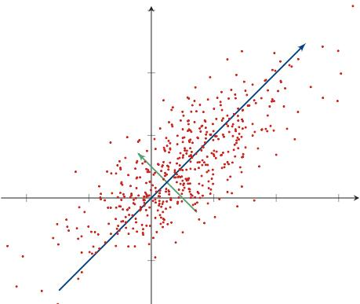
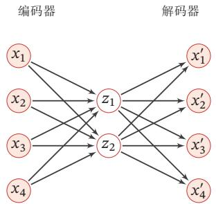
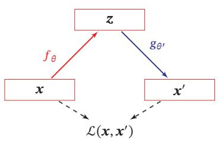
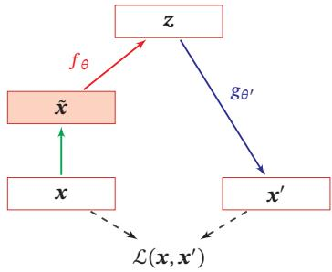
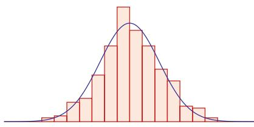
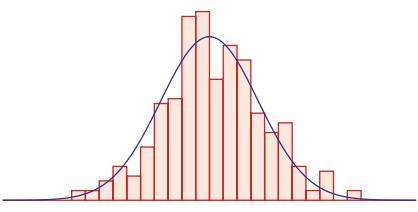

## 第9章 无监督学习

[¶0001] 大脑有大约 $1 0 ^ { 1 4 }$ 个突触，我们只能活大约 $1 0 ^ { 9 }$ 秒．所以我们有比数据更多的参数．这启发了我们必须进行大量无监督学习的想法，因为感知输入（包括本体感受）是我们可以获得每秒$1 0 ^ { 5 }$ 维约束的唯一途径

[¶0002] 这 里 数 字 是 指 数 量级．更早的正式描述见[Hinton et al., 1999]

[¶0003] —杰弗里·辛顿（Geoffrey Hinton）2018年图灵奖获得者

[¶0004] 无监督学习（Unsupervised Learning，UL）是指从无标签的数据中学习出一些有用的模式．无监督学习算法一般直接从原始数据中学习，不借助于任何人工给出标签或者反馈等指导信息．如果监督学习是建立输入-输出之间的映射关系，那么无监督学习就是发现隐藏的数据中的有价值信息，包括有效的特征、类别、结构以及概率分布等

[¶0005] 典型的无监督学习问题可以分为以下几类：

[¶0006] （1） 无监督特征学习（Unsupervised Feature Learning）是从无标签的训练数据中挖掘有效的特征或表示．无监督特征学习一般用来进行降维、数据可视化或监督学习前期的数据预处理

[¶0007] 特征学习也包含很多的监督学习算法，比如线性判别分析等

[¶0008] （2） 概率密度估计（Probabilistic Density Estimation）简称密度估计，是根据一组训练样本来估计样本空间的概率密度．密度估计可以分为参数密度估计和非参数密度估计．参数密度估计是假设数据服从某个已知概率密度函数形式的分布（比如高斯分布），然后根据训练样本去估计概率密度函数的参数．非参数密度估计是不假设数据服从某个已知分布，只利用训练样本对密度进行估计，可以进行任意形状密度的估计．非参数密度估计的方法有直方图、核密度估计等．

[¶0009] （3） 聚类（Clustering）是将一组样本根据一定的准则划分到不同的组（也称为簇（Cluster））．一个比较通用的准则是组内样本的相似性要高于组间样本的相似性．常见的聚类算法包括K-Means算法、谱聚类等

[¶0010] 和监督学习一样，无监督学习方法也包含三个基本要素：模型、学习准则和优化算法．无监督学习的准则非常多，比如最大似然估计、最小重构错误等．在无监督特征学习中，经常使用的准则为最小化重构错误，同时也经常对特征进行一些约束，比如独立性、非负性或稀释性等．而在密度估计中，经常采用最大似然估计来进行学习

[¶0011] 本章介绍两种无监督学习问题：无监督特征学习和概率密度估计

## 9.1 无监督特征学习

[¶0012] 无监督特征学习是指从无标注的数据中自动学习有效的数据表示，从而能够帮助后续的机器学习模型更快速地达到更好的性能．无监督特征学习主要方法有主成分分析、稀疏编码、自编码器等

## 9.1.1 主成分分析

[¶0013] 主成分分析（Principal Component Analysis，PCA）是一种最常用的数据降维方法，使得在转换后的空间中数据的方差最大．如图9.1所示的两维数据，如果将这些数据投影到一维空间中，选择数据方差最大的方向进行投影，才能最大化数据的差异性，保留更多的原始数据信息

[¶0014]
  
图9.1 主成分分析

[¶0015] 假设有一组??维的样本 $\pmb { x } ^ { ( n ) } \in \mathbb { R } ^ { D } , 1 \leq n \leq N$ ，我们希望将其投影到一维空间中，投影向量为 ${ \pmb w } \in \mathbb { R } ^ { D }$ ．不失一般性，我们限制??的模为1，即 $\pmb { w } ^ { \top } \pmb { w } = 1$ ．每个样本点 $\pmb { x } ^ { ( n ) }$ 投影之后的表示为

[¶0016]
$$
z ^ { ( n ) } = { \pmb w } ^ { \top } { \pmb x } ^ { ( n ) } .\tag{9.1}
$$

[¶0017] 用矩阵 $\pmb { X } = [ \pmb { x } ^ { ( 1 ) } , \pmb { x } ^ { ( 2 ) } , \cdots , \pmb { x } ^ { ( N ) } ]$ 表示输入样本， $\begin{array} { r } { \bar { \mathbf { x } } = \frac { 1 } { N } \sum _ { n = 1 } ^ { N } \mathbf { x } ^ { ( n ) } } \end{array}$ 为原始样本的中心点，所有样本投影后的方差为

[¶0018]
$$
\sigma ( \boldsymbol { X } ; \boldsymbol { w } ) = \frac { 1 } { N } \sum _ { n = 1 } ^ { N } ( \boldsymbol { w ^ { \intercal } x ^ { ( n ) } } - \boldsymbol { w ^ { \intercal } \bar { x } } ) ^ { 2 }\tag{9.2}
$$

[¶0019]
$$
{ \bf \Omega } = \frac { 1 } { N } ( { \pmb w } ^ { \top } { \pmb X } - { \pmb w } ^ { \top } \bar { \pmb X } ) ( { \pmb w } ^ { \top } { \pmb X } - { \pmb w } ^ { \top } \bar { \pmb X } ) ^ { \top }\tag{9.3}
$$

[¶0020]
$$
{ \bf \mu } = { \bf w } ^ { \top } { \bf \pmb { \Sigma } } { \bf w } ,\tag{9.4}
$$

[¶0021] 其中 $\bar { \mathbf X } = \bar { \mathbf { \ b { x } } } \mathbf { 1 } _ { D } ^ { \top }$ 是向量??̄和??维全1向量 ${ \bf 1 } _ { D }$ 的外积，即有??列??̄组成的矩阵，$\begin{array} { r } { \pmb { \Sigma } = \frac { 1 } { N } ( \pmb { X } - \pmb { \bar { X } } ) ( \pmb { X } - \pmb { \bar { X } } ) ^ { \top } } \end{array}$ 是原始样本的协方差矩阵

[¶0022] 最大化投影方差 $\sigma ( { \pmb X } ; { \pmb w } )$ 并满足 $\pmb { w } ^ { \top } \pmb { w } = 1$ ，利用拉格朗日方法转换为无约束优化问题，

[¶0023]
$$
\operatorname* { m a x } _ { \boldsymbol { w } } \pmb { w } ^ { \intercal } \pmb { \Sigma } \pmb { w } + \lambda ( 1 - \boldsymbol { w } ^ { \intercal } \boldsymbol { w } ) ,\tag{9.5}
$$

[¶0024] 其中??为拉格朗日乘子．对上式求导并令导数等于0，可得

[¶0025]
$$
\begin{array} { r } { \Sigma { \pmb w } = \lambda { \pmb w } . } \end{array}\tag{9.6}
$$

[¶0026] 从上式可知，??是协方差矩阵??的特征向量，??为特征值．同时

[¶0027]
$$
\sigma ( \boldsymbol { X } ; \boldsymbol { w } ) = \boldsymbol { w } ^ { \intercal } \boldsymbol { \Sigma } \boldsymbol { w } = \boldsymbol { w } ^ { \intercal } \boldsymbol { \lambda } \boldsymbol { w } = \boldsymbol { \lambda } .\tag{9.7}
$$

[¶0028] ??也是投影后样本的方差．因此，主成分分析可以转换成一个矩阵特征值分解问题，投影向量??为矩阵??的最大特征值对应的特征向量

[¶0029] 如果要通过投影矩阵 ${ \pmb W } \in \ b { R } ^ { D \times D ^ { \prime } }$ 将样本投到 $D ^ { \prime }$ 维空间，投影矩阵满足$W ^ { \top } W = I$ 为单位阵，只需要将??的特征值从大到小排列，保留前 $D ^ { \prime }$ 个特征向量，其对应的特征向量即是最优的投影矩阵

[¶0030]
$$
\Sigma W = W \mathrm { d i a g } ( \lambda ) ,\tag{9.8}
$$

[¶0031] 其中 $\lambda = [ \lambda _ { 1 } , \cdots , \lambda _ { D ^ { \prime } } ]$ 为??的前 $D ^ { \prime }$ 个最大的特征值

[¶0032] 主成分分析是一种无监督学习方法，可以作为监督学习的数据预处理方法，用来去除噪声并减少特征之间的相关性，但是它并不能保证投影后数据的类别可分性更好．提高两类可分性的方法一般为监督学习方法，比如线性判别分析（Linear Discriminant Analysis，LDA）

[¶0033] 参见习题9-3

## 9.1.2 稀疏编码

[¶0034] 稀疏编码（Sparse Coding）也是一种受哺乳动物视觉系统中简单细胞感受野而启发的模型．在哺乳动物的初级视觉皮层（Primary Visual Cortex）中，每个神经元仅对处于其感受野中特定的刺激信号（比如特定方向的边缘、条纹等特征）做出响应．局部感受野可以被描述为具有空间局部性、方向性和带通性[Olshausen et al.,1996]．也就是说，外界信息经过编码后仅有一小部分神经元激活，即外界刺激在视觉神经系统的表示具有很高的稀疏性．编码的稀疏性在一定程度上符合生物学的低功耗特性

[¶0035] 在数学上，（线性）编码是指给定一组基向量 $\pmb { A } = [ \pmb { a } _ { 1 } , \cdots , \pmb { a } _ { M } ]$ ，将输入样本$\boldsymbol { x } \in \mathbb { R } ^ { D }$ 表示为这些基向量的线性组合

[¶0036] 带 通 性是 指 不 同 尺度 下 空 间 结 构 的 敏感 性．比 如，带 通 滤波器（Bandpass Filter）是指容许某个频率范围的信号通过，同时屏蔽其他频段的设备

[¶0037]
$$
x = \sum _ { m = 1 } ^ { M } z _ { m } \mathbf { a } _ { m }\tag{9.9}
$$

[¶0038]
$$
{ \bf \xi } = { \bf A } z ,\tag{9.10}
$$

[¶0039] 其中基向量的系数 $z = [ z _ { 1 } , \cdots , z _ { M } ]$ 称为输入样本??的编码（Encoding），基向量??也称为字典（Dictionary）

[¶0040] 编码是对??维空间中的样本??找到其在??维空间中的表示（或投影），其目标通常是编码的各个维度都是统计独立的，并且可以重构出输入样本．编码的关键是找到一组“完备”的基向量??，比如主成分分析等．但是主成分分析得到的编码通常是稠密向量，没有稀疏性

## 数学小知识|完备性

[¶0041] 如果??个基向量刚好可以支撑??维的欧氏空间，则这??个基向量是完备的．如果??个基向量可以支撑??维的欧氏空间，并且 $M > D$ ，则这??个基向量是过完备的（overcomplete）、冗余的

[¶0042]

[¶0043] “过完备”基向量是指基向量个数远远大于其支撑空间维度．因此这些基向量一般不具备独立、正交等性质

[¶0044] 为了得到稀疏的编码，我们需要找到一组“过完备”的基向量（即 $M > D )$ 来进行编码．在过完备基向量之间往往会存在一些冗余性，因此对于一个输入样本，会存在很多有效的编码．如果加上稀疏性限制，就可以减少解空间的大小，得到“唯一”的稀疏编码

[¶0045] 给定一组??个输入向量 $\pmb { x } ^ { ( 1 ) } , \cdots , \pmb { x } ^ { ( N ) }$ ，其稀疏编码的目标函数定义为

[¶0046]
$$
\mathcal { L } ( A , Z ) = \sum _ { n = 1 } ^ { N } \left( \left\| x ^ { ( n ) } - A z ^ { ( n ) } \right\| ^ { 2 } + \eta \rho ( z ^ { ( n ) } ) \right) ,\tag{9.11}
$$

[¶0047] https://nndl.github.io/

[¶0048] 其中 $Z = [ z ^ { ( 1 ) } , \cdots , z ^ { ( N ) } ] , \rho ( \cdot )$ 是一个稀疏性衡量函数，??是一个超参数，用来控制稀疏性的强度

[¶0049] 对于一个向量 $z \in \mathbb { R } ^ { M }$ ，其稀疏性定义为非零元素的比例．如果一个向量只有很少的几个非零元素，就说这个向量是稀疏的．稀疏性衡量函数 $\rho ( z )$ 是给向量$z$ 一个标量分数 $z$ 越稀疏， $\rho ( z )$ 越小

[¶0050] 稀疏性衡量函数有多种选择，最直接的衡量向量 $z$ 稀疏性的函数是 $\ell _ { 0 }$ 范数

[¶0051] 由于通常比较难以得到严格的稀疏向量，因此如果一个向量只有少数几个远大于零的元素，其他元素都接近于0，我们也称这个向量为稀疏向量

[¶0052]
$$
\rho ( z ) = \sum _ { m = 1 } ^ { M } \mathbf { I } ( | z _ { m } | > 0 ) .\tag{9.12}
$$

[¶0053] 但 $\ell _ { 0 }$ 范数不满足连续可导，因此很难进行优化．在实际中，稀疏性衡量函数通常使用 $\ell _ { 1 }$ 范数

[¶0054]
$$
\rho ( z ) = \sum _ { m = 1 } ^ { M } | z _ { m } | ,\tag{9.13}
$$

[¶0055] 或对数函数

[¶0056]
$$
\rho ( z ) = \sum _ { m = 1 } ^ { M } \log ( 1 + z _ { m } ^ { 2 } ) ,\tag{9.14}
$$

[¶0057] 或指数函数

[¶0058] 参见习题9-6

[¶0059]
$$
\rho ( z ) = \sum _ { m = 1 } ^ { M } - \exp ( - z _ { m } ^ { 2 } ) .\tag{9.15}
$$

## 9.1.2.1 训练方法

[¶0060] 给定一组??个输入向量 $\{ \pmb { x } ^ { ( n ) } \} _ { n = 1 } ^ { N }$ ，需要同时学习基向量??以及每个输入样本对应的稀疏编码 $\{ z ^ { ( n ) } \} _ { n = 1 } ^ { N }$

[¶0061] 稀疏编码的训练过程一般用交替优化的方法进行

[¶0062] 1)固定基向量??，对每个输入 $\pmb { x } ^ { ( n ) }$ ，计算其对应的最优编码

[¶0063]
$$
\operatorname* { m i n } _ { z ^ { ( n ) } } \left\| x ^ { ( n ) } - A z ^ { ( n ) } \right\| ^ { 2 } + \eta \rho ( z ^ { ( n ) } ) , \forall n \in [ 1 , N ] .\tag{9.16}
$$

[¶0064] 2)固定上一步得到的编码 $\{ z ^ { ( n ) } \} _ { n = 1 } ^ { N }$ ，计算其最优的基向量

[¶0065]
$$
\operatorname* { m i n } _ { A } \sum _ { n = 1 } ^ { N } \left( \left\| \pmb { x } ^ { ( n ) } - \pmb { A } \pmb { z } ^ { ( n ) } \right\| ^ { 2 } \right) + \lambda \frac { 1 } { 2 } | | \pmb { A } | | ^ { 2 } ,\tag{9.17}
$$

[¶0066] 其中第二项为正则化项，??为正则化项系数

## 9.1.2.2 稀疏编码的优点

[¶0067] 稀疏编码的每一维都可以被看作一种特征．和基于稠密向量的分布式表示相比，稀疏编码具有更小的计算量和更好的可解释性等优点

[¶0068] （1） 计算量稀疏性带来的最大好处就是可以极大地降低计算量

[¶0069] （2） 可解释性 因为稀疏编码只有少数的非零元素，相当于将一个输入样本表示为少数几个相关的特征．这样我们可以更好地描述其特征，并易于理解

[¶0070] （3） 特征选择 稀疏性带来的另外一个好处是可以实现特征的自动选择，只选择和输入样本最相关的少数特征，从而更高效地表示输入样本，降低噪声并减轻过拟合

## 9.1.3 自编码器

[¶0071] 自编码器（Auto-Encoder，AE）是通过无监督的方式来学习一组数据的有效编码（或表示）

[¶0072] 假设有一组??维的样本 $\pmb { x } ^ { ( n ) } \in \mathbb { R } ^ { D } , 1 \leq n \leq N$ ，自编码器将这组数据映射到特征空间得到每个样本的编码 $\pmb { z } ^ { ( n ) } \in \mathbb { R } ^ { M } , 1 \leq n \leq N$ ，并且希望这组编码可以重构出原来的样本

[¶0073] 自编码器的结构可分为两部分：

[¶0074] （1） 编码器（Encoder）?? ∶ ℝ?? → ℝ??

[¶0075] （2） 解码器（Decoder）?? ∶ ℝ?? → ℝ??

[¶0076] 自编码器的学习目标是最小化重构错误（Reconstruction Error）：

[¶0077]
$$
\mathcal { L } = \sum _ { n = 1 } ^ { N } | | \pmb { x } ^ { ( n ) } - g \big ( f ( \pmb { x } ^ { ( n ) } ) \big ) | | ^ { 2 }\tag{9.18}
$$

[¶0078]
$$
= \sum _ { n = 1 } ^ { N } | | \pmb { x } ^ { ( n ) } - f \circ \pmb { g } ( \pmb { x } ^ { ( n ) } ) | | ^ { 2 } .\tag{9.19}
$$

[¶0079] 如果特征空间的维度??小于原始空间的维度??，自编码器相当于是一种降维或特征抽取方法．如果 $M \geq D$ ，一定可以找到一组或多组解使得 $f \circ g$ 为单位函数（Identity Function），并使得重构错误为0．然而，这样的解并没有太多的意义．但是，如果再加上一些附加的约束，就可以得到一些有意义的解，比如编码的稀疏性、取值范围，??和??的具体形式等．如果我们让编码只能取??个不同的值$( K < N )$ ，那么自编码器就可以转换为一个?? 类的聚类（Clustering）问题

[¶0080] 单位函数??(??) = ??

[¶0081] 最简单的自编码器是如图9.2所示的两层神经网络．输入层到隐藏层用来编码，隐藏层到输出层用来解码，层与层之间互相全连接

[¶0082]
  
图9.2 两层网络结构的自编码器

[¶0083] 对于样本??，自编码器的中间隐藏层的活性值为??的编码，即

[¶0084]
$$
\pmb { z } = f ( \pmb { W } ^ { ( 1 ) } \pmb { x } + \pmb { b } ^ { ( 1 ) } ) ,\tag{9.20}
$$

[¶0085] 自编码器的输出为重构的数据

[¶0086]
$$
\begin{array} { r } { \pmb { x } ^ { \prime } = f ( \pmb { W } ^ { ( 2 ) } \pmb { \mathrm { z } } + \pmb { b } ^ { ( 2 ) } ) , } \end{array}\tag{9.21}
$$

[¶0087] 其中 ${ \pmb W } ^ { ( 1 ) } , { \pmb W } ^ { ( 2 ) } , { \pmb b } ^ { ( 1 ) } , { \pmb b } ^ { ( 2 ) }$ 为网络参数， $f ( \cdot )$ 为激活函数．如果令 $\pmb { W } ^ { ( 2 ) }$ 等于 $\mathbf { \delta } \mathbf { W } ^ { ( 1 ) }$ 的转置，即 $\boldsymbol { W } ^ { ( 2 ) } = \boldsymbol { W } ^ { ( 1 ) } ^ { \top }$ ，称为捆绑权重（Tied Weight）．捆绑权重自编码器的参数更少，因此更容易学习．此外，捆绑权重还在一定程度上起到正则化的作用

[¶0088] 给定一组样本 $\pmb { x } ^ { ( n ) } \in [ 0 , 1 ] ^ { D } , 1 \leq n \leq N$ ，其重构错误为

[¶0089]
$$
\mathcal { L } = \sum _ { n = 1 } ^ { N } \| \pmb { x } ^ { ( n ) } - \pmb { x } ^ { \prime ( n ) } ) \| ^ { 2 } + \lambda \| \pmb { W } \| _ { F } ^ { 2 } .\tag{9.22}
$$

[¶0090] 其中??为正则化项系数．通过最小化重构错误，可以有效地学习网络的参数

[¶0091] 我们使用自编码器是为了得到有效的数据表示，因此在训练结束后，我们一般会去掉解码器，只保留编码器．编码器的输出可以直接作为后续机器学习模型的输入

## 9.1.4 稀疏自编码器

[¶0092] 自编码器除了可以学习低维编码之外，也能够学习高维的稀疏编码．假设中间隐藏层??的维度??大于输入样本??的维度??，并让 $z$ 尽量稀疏，这就是稀疏自编码器（Sparse Auto-Encoder）．和稀疏编码一样，稀疏自编码器的优点是有很高的可解释性，并同时进行了隐式的特征选择

[¶0093] 通过给自编码器中隐藏层单元??加上稀疏性限制，自编码器可以学习到数据中一些有用的结构．给定??个训练样本 $\{ \boldsymbol { x } ^ { ( n ) } \} _ { n = 1 } ^ { N }$ ，稀疏自编码器的目标函数为

[¶0094]
$$
\mathcal { L } = \sum _ { n = 1 } ^ { N } \| \pmb { x } ^ { ( n ) } - \pmb { x } ^ { \prime ( n ) } ) \| ^ { 2 } + \eta \rho ( \pmb { Z } ) + \lambda \| \pmb { W } \| ^ { 2 } ,\tag{9.23}
$$

[¶0095] https://nndl.github.io/

[¶0096] 其中 $\pmb { Z } = [ \pmb { z } ^ { ( 1 ) } , \cdots , \pmb { z } ^ { ( N ) } ]$ 表示所有训练样本的编码， $\rho ( \boldsymbol { Z } )$ 为稀疏性度量函数， $\mathbf { \Delta } _ { W }$ 表示自编码器中的参数

[¶0097] 稀疏性度量函数 $\rho ( \boldsymbol { Z } )$ 可以使用公式(9.13)～公式(9.15)中的稀疏性定义，分别计算每个编码 $\pmb { z } ^ { ( n ) }$ 的稀疏度，再进行求和．此外， $\rho ( \boldsymbol { Z } )$ 还可以定义为一组训练样本中每一个神经元激活的概率

[¶0098] 给定??个训练样本，隐藏层第??个神经元平均活性值为

[¶0099]
$$
\hat { \rho } _ { j } = \frac { 1 } { N } \sum _ { n = 1 } ^ { N } z _ { j } ^ { ( n ) } ,\tag{9.24}
$$

[¶0100] 其中 $\hat { \rho } _ { j }$ 可以近似地看作第 $j$ 个神经元激活的概率．我们希望 $\hat { \rho } _ { j }$ 接近于一个事先给定的值 $\rho ^ { * }$ ，比如0.05，可以通过KL距离来衡量 $\hat { \rho } _ { j }$ 和 $\rho ^ { * }$ 的差异，即

[¶0101]
$$
\mathrm { K L } ( \rho ^ { * } | | \hat { \rho } _ { j } ) = \rho ^ { * } \log \frac { \rho ^ { * } } { \hat { \rho } _ { j } } + ( 1 - \rho ^ { * } ) \log \frac { 1 - \rho ^ { * } } { 1 - \hat { \rho } _ { j } } .\tag{9.25}
$$

[¶0102] 如果 $\hat { \rho } _ { j } = \rho ^ { * }$ ，则 $\mathrm { K L } ( \rho ^ { * } | | \hat { \rho } _ { j } ) = 0$

[¶0103] 稀疏性度量函数定义为

[¶0104]
$$
\rho ( Z ) = \sum _ { j = 1 } ^ { p } \mathrm { K L } ( \rho ^ { * } | | \hat { \rho } _ { j } ) .\tag{9.26}
$$

## 9.1.5 堆叠自编码器

[¶0105] 对于很多数据来说，仅使用两层神经网络的自编码器还不足以获取一种好的数据表示．为了获取更好的数据表示，我们可以使用更深层的神经网络．深层神经网络作为自编码器提取的数据表示一般会更加抽象，能够更好地捕捉到数据的语义信息．在实践中经常使用逐层堆叠的方式来训练一个深层的自编码器，称为堆叠自编码器（Stacked Auto-Encoder，SAE）．堆叠自编码器一般可以采用逐层训练（Layer-Wise Training）来学习网络参数 [Bengio et al., 2007]

## 9.1.6 降噪自编码器

[¶0106] 我们使用自编码器是为了得到有效的数据表示，而有效的数据表示除了具有最小重构错误或稀疏性等性质之外，还可以要求其具备其他性质，比如对数据部分损坏（Partial Destruction）的鲁棒性．高维数据（比如图像）一般都具有一定的信息冗余，比如我们可以根据一张部分破损的图像联想出其完整内容．因此，我们希望自编码器也能够从部分损坏的数据中得到有效的数据表示，并能够恢复出完整的原始信息

[¶0107] 降噪自编码器（Denoising Auto-Encoder）就是一种通过引入噪声来增加编码鲁棒性的自编码器[Vincent et al., 2008]．对于一个向量??，我们首先根据一个比例 $\mu$ 随机将 $_ x$ 的一些维度的值设置为0，得到一个被损坏的向量??̃．然后将被损坏的向量 $\tilde { x }$ 输入给自编码器得到编码 $z ,$ ，并重构出无损的原始输入??

[¶0108] 损坏比例 $\mu$ 一般不超过0.5．也可以使用其他的方法来损坏数据，比如引入高斯噪声

[¶0109] 降噪自编码器的思想十分简单，通过引入噪声来学习更鲁棒性的数据编码，并提高模型的泛化能力．图9.3给出了自编码器和降噪自编码器的对比，其中 $f _ { \theta }$ 为编码器， $g _ { \theta ^ { \prime } }$ 为解码器， $\mathcal { L } (  { \mathbf { { x } } } ,  { \mathbf { { x } } } ^ { \prime } )$ 为重构错误

[¶0110]
  
(a) 自编码器

[¶0111]
  
(b)降噪自编码器  
图9.3 自编码器和降噪自编码器

## 9.2 概率密度估计

[¶0112] 概率密度估计（Probabilistic Density Estimation），简称密度估计（Den-sity Estimation），是基于一些观测样本来估计一个随机变量的概率密度函数密度估计在数据建模、机器学习中使用广泛

[¶0113] 密度估计方法可以分为两类：参数密度估计和非参数密度估计

## 9.2.1 参数密度估计

[¶0114] 参数密度估计（Parametric Density Estimation）是根据先验知识假设随机变量服从某种分布，然后通过训练样本来估计分布的参数

[¶0115] 令 $\mathcal { D } = \{ \pmb { x } ^ { ( n ) } \} _ { n = 1 } ^ { N }$ 为从某个未知分布中独立抽取的??个训练样本，假设这些样本服从一个概率分布函数 $p ( \pmb { x } ; \theta )$ ，其对数似然函数为

[¶0116]
$$
\log p ( \mathcal { D } ; \theta ) = \sum _ { n = 1 } ^ { N } \log p ( \boldsymbol { x } ^ { ( n ) } ; \theta ) .\tag{9.27}
$$

[¶0117] 使用最大似然估计（Maximum Likelihood Estimation，MLE）来寻找参数

[¶0118] ??使得 $\log p ( \mathcal { D } ; \theta )$ 最大．这样参数估计问题就转化为最优化问题：

[¶0119]
$$
\theta ^ { M L } = \underset { \theta } { \arg \operatorname* { m a x } } \sum _ { n = 1 } ^ { N } \log p ( \pmb { x } ^ { ( n ) } ; \theta ) .\tag{9.28}
$$

## 9.2.1.1 正态分布

[¶0120] 假设样本 $\boldsymbol { x } \in \mathbb { R } ^ { D }$ 服从正态分布

[¶0121]
$$
\mathcal { N } ( { \pmb x } | { \pmb \mu } , { \pmb \Sigma } ) = \frac { 1 } { ( 2 \pi ) ^ { D / 2 } | { \pmb \Sigma } | ^ { 1 / 2 } } \exp \Big ( - \frac { 1 } { 2 } ( { \pmb x } - { \pmb \mu } ) ^ { \top } { \pmb \Sigma } ^ { - 1 } ( { \pmb x } - { \pmb \mu } ) \Big ) ,\tag{9.29}
$$

[¶0122] 其中 $\mu$ 和??分别为正态分布的均值和方差

[¶0123] 数据集 $\mathcal { D } = \{ \pmb { x } ^ { ( n ) } \} _ { n = 1 } ^ { N }$ 的对数似然函数为

[¶0124]
$$
\log p ( \mathcal { D } | \mu , \Sigma ) = - \frac { N } { 2 } \log \Big ( ( 2 \pi ) ^ { D } | \Sigma | \Big ) - \frac { 1 } { 2 } \sum _ { n = 1 } ^ { N } ( { \pmb x } ^ { ( n ) } - { \pmb \mu } ) ^ { \top } \Sigma ^ { - 1 } ( { \pmb x } ^ { ( n ) } - \mu ) .\tag{9.30}
$$

[¶0125] 分别求上式关于 $\mu , \Sigma$ 的偏导数，并令其等于0．可得，

[¶0126]
$$
\mu ^ { M L } = \frac { 1 } { N } \sum _ { n = 1 } ^ { N } \pmb { x } ^ { ( n ) } ,\tag{9.31}
$$

[¶0127]
$$
\Sigma ^ { M L } = \frac { 1 } { N } \sum _ { n = 1 } ^ { N } ( { \pmb x } ^ { ( n ) } - { \pmb \mu } ^ { M L } ) ( { \pmb x } ^ { ( n ) } - { \pmb \mu } ^ { M L } ) ^ { \top } .\tag{9.32}
$$

## 9.2.1.2 多项分布

[¶0128] 假设样本服从??个状态的多项分布，令one-hot向量 ${ \pmb x } \in \{ 0 , 1 \} ^ { K }$ 来表示第??个状态，即 $x _ { k } = 1$ ，其余 $x _ { i , i \neq k } = 0$ ．样本 $_ { x }$ 的概率密度函数为

[¶0129] 多 项 分 布 参 见第D.2.2.1节

[¶0130]
$$
p ( { \pmb x } | { \pmb \mu } ) = \prod _ { k = 1 } ^ { K } \mu _ { k } ^ { x _ { k } } ,\tag{9.33}
$$

[¶0131] 其中 $\mu _ { k }$ 为第??个状态的概率，并满足 $\begin{array} { r } { \sum _ { k = 1 } ^ { K } \mu _ { k } = 1 } \end{array}$

[¶0132] 数据集 $\mathcal { D } = \{ \pmb { x } ^ { ( n ) } \} _ { n = 1 } ^ { N }$ 的对数似然函数为

[¶0133] 这里没有多项式系数

[¶0134]
$$
\log p ( \mathcal { D } | \mu ) = \sum _ { n = 1 } ^ { N } \sum _ { k = 1 } ^ { K } x _ { k } ^ { ( n ) } \log ( \mu _ { k } ) .\tag{9.34}
$$

[¶0135] 多项分布的参数估计为约束优化问题．引入拉格朗日乘子??，将原问题转换为无约束优化问题

[¶0136] 拉格朗日乘子参考参见第C.3节

[¶0137]
$$
\operatorname* { m a x } _ { \mu , \lambda } \quad \sum _ { n = 1 } ^ { N } \sum _ { k = 1 } ^ { K } x _ { k } ^ { ( n ) } \log ( \mu _ { k } ) + \lambda \Big ( \sum _ { k = 1 } ^ { K } \mu _ { k } - 1 \Big ) .\tag{9.35}
$$

[¶0138] https://nndl.github.io/

[¶0139] 分别求上式关于 $\mu _ { k }$ , ??的偏导数，并令其等于0．可得，

[¶0140]
$$
\mu _ { k } ^ { M L } = \frac { m _ { k } } { N } , \qquad 1 \leq k \leq K\tag{9.36}
$$

[¶0141] 其中 $\begin{array} { r } { m _ { k } = \sum _ { n = 1 } ^ { N } x _ { k } ^ { ( n ) } } \end{array}$ 为数据集中取值为第??个状态的样本数量

[¶0142] 在实际应用中，参数密度估计一般存在以下问题：

[¶0143] （1） 模型选择问题：即如何选择数据分布的密度函数．实际数据的分布往往是非常复杂的，而不是简单的正态分布或多项分布

[¶0144] （2） 不可观测变量问题：即我们用来训练的样本只包含部分的可观测变量，还有一些非常关键的变量是无法观测的，这导致我们很难准确估计数据的真实分布．

[¶0145] 包含不可观测变量的密度估计问题一般需要使用EM算法，参见第11.2.2.1节．

[¶0146] （3） 维度灾难问题：即高维数据的参数估计十分困难．随着维度的增加，估计参数所需要的样本数量指数增加．在样本不足时会出现过拟合

## 9.2.2 非参数密度估计

[¶0147] 非参数密度估计（Nonparametric Density Estimation）是不假设数据服从某种分布，通过将样本空间划分为不同的区域并估计每个区域的概率来近似数据的概率密度函数

[¶0148] 对于高维空间中的一个随机向量??，假设其服从一个未知分布 $p ( { \pmb x } )$ ，则??落入空间中的小区域ℛ的概率为

[¶0149]
$$
P = \int _ { \mathcal R } p ( \pmb x ) d \pmb x .\tag{9.37}
$$

[¶0150] 给定??个训练样本 $\mathcal { D } = \{ \pmb { x } ^ { ( n ) } \} _ { n = 1 } ^ { N }$ ，落入区域ℛ的样本数量??服从二项分布：

[¶0151]
$$
P _ { K } = \binom { N } { K } P ^ { K } ( 1 - P ) ^ { 1 - K } ,\tag{9.38}
$$

[¶0152] 其中 $K / N$ 的期望为 $\mathbb { E } [ K / N ] = P$ ，方差为 $\mathrm { v a r } ( K / N ) = P ( 1 - P ) / N$ ．当??非常大时，我们可以近似认为

[¶0153]
$$
P \approx { \frac { K } { N } } .\tag{9.39}
$$

[¶0154] 假设区域ℛ足够小，其内部的概率密度是相同的，则有

[¶0155]
$$
P \approx p ( { \pmb x } ) V ,\tag{9.40}
$$

[¶0156] 其中?? 为区域ℛ的体积．结合上述两个公式，得到

[¶0157]
$$
p ( { \pmb x } ) \approx \frac { K } { N V } .\tag{9.41}
$$

[¶0158] https://nndl.github.io/

[¶0159] 根据公式(9.41)，要准确地估计 $p ( { \pmb x } )$ ，需要尽量使得样本数量??足够大，区域体积?? 尽可能地小．但在具体应用中，样本数量一般是有限的，过小的区域会导致落入该区域的样本比较少，这样估计的概率密度就不太准确．因此，实践中非参数密度估计通常使用两种方式：1）固定区域大小??，统计落入不同区域的数量，这种方式包括直方图方法和核方法两种；2）改变区域大小以使得落入每个区域的样本数量为??，这种方式称为K近邻方法

## 9.2.2.1 直方图方法

[¶0160] 直方图方法（Histogram Method）是一种非常直观的估计连续变量密度函数的方法，可以表示为一种柱状图

[¶0161] 以一维随机变量为例，首先将其取值范围分成??个连续的、不重叠的区间（bin），每个区间的宽度为 $\Delta _ { m }$ ．给定??个训练样本 $\mathcal { D } = \{ x ^ { ( n ) } \} _ { n = 1 } ^ { N }$ ，我们统计这些样本落入每个区间的数量 $K _ { m }$ ，然后将它们归一化为密度函数

[¶0162] Histogram 源 自 希 腊语histos（竖 立） 和gramma（描绘），由英国统计学家卡尔·皮尔逊于1895年提出

[¶0163]
$$
p _ { m } = \frac { K _ { m } } { N \Delta _ { m } } , \qquad 1 \leq m \leq M\tag{9.42}
$$

[¶0164] 其中区间宽度 $\Delta _ { m }$ 通常设为相同的值 $\Delta .$ ．直方图方法的关键问题是如何选取一个合适的区间宽度Δ．如果 $\Delta$ 太小，那么落入每个区间的样本数量会比较少，其估计的区间密度也具有很大的随机性．如果 $\Delta$ 太大，其估计的密度函数变得十分平滑，很难反映出真实的数据分布．图9.4给出了直方图密度估计的例子，其中蓝线表示真实的密度函数，红色的柱状图为直方图方法估计的密度

[¶0165]
  
(a) 10 个区间（bin）

[¶0166]
  
(b) 30 个区间（bin）  
图9.4 直方图密度估计

[¶0167] 直方图通常用来处理低维变量，可以非常快速地对数据的分布进行可视化，但其缺点是很难扩展到高维变量．假设一个??维的随机向量，如果每一维都划分为??个区间，那么整个空间的区间数量为 $M ^ { D }$ 个．直方图方法需要的样本数量会随着维度??的增加而指数增长，从而导致维度灾难（Curse of Dimensionality）问题

## 9.2.2.2 核方法

[¶0168] 核密度估计（Kernel Density Estimation），也叫 Parzen 窗方法，是一种直方图方法的改进

[¶0169] 假设ℛ为??维空间中的一个以点??为中心的“超立方体”，并定义核函数（Kernel Function）为

[¶0170]
$$
\phi \Big ( \frac { z - x } { H } \Big ) = \left\{ \begin{array} { l l } { 1 \quad } & { \mathrm { i f } | z _ { i } - x _ { i } | < \frac { H } { 2 } , 1 \le i \le D } \\ { 0 \quad } & { \mathrm { e l s e } } \end{array} \right.\tag{9.43}
$$

[¶0171] 来表示一个样本 $z$ 是否落入该超立方体中，其中??为超立方体的边长，也称为核函数的宽度

[¶0172] 给定??个训练样本 $\mathcal { D } = \{ \pmb { x } ^ { ( n ) } \} _ { n = 1 } ^ { N }$ ，落入区域ℛ的样本数量??为

[¶0173]
$$
K = \sum _ { n = 1 } ^ { N } \phi \Big ( \frac { { \pmb x } ^ { ( n ) } - { \pmb x } } { H } \Big ) ,\tag{9.44}
$$

[¶0174] 则点??的密度估计为

[¶0175]
$$
p ( { \pmb x } ) = \frac { K } { N H ^ { D } } = \frac { 1 } { N H ^ { D } } \sum _ { n = 1 } ^ { N } \phi \Big ( \frac { { \pmb x } ^ { ( n ) } - { \pmb x } } { H } \Big ) ,\tag{9.45}
$$

[¶0176] 其中 $H ^ { D }$ 表示超立方体ℛ的体积

[¶0177] 除了超立方体的核函数之外，我们还可以选择更加平滑的核函数，比如高斯核函数：

[¶0178]
$$
\phi \Bigl ( \frac { z - x } { H } \Bigr ) = \frac { 1 } { ( 2 \pi ) ^ { 1 / 2 } H } \exp \Bigl ( - \frac { | | z - x | | ^ { 2 } } { 2 H ^ { 2 } } \Bigr ) ,\tag{9.46}
$$

[¶0179] 其中 $h ^ { 2 }$ 是高斯核函数的方差．这样，点??的密度估计为

[¶0180]
$$
p ( \pmb { x } ) = \frac { 1 } { N } \sum _ { n = 1 } ^ { N } \frac { 1 } { ( 2 \pi ) ^ { 1 / 2 } H } \exp \Big ( - \frac { \lVert \pmb { z } - \pmb { x } \rVert ^ { 2 } } { 2 H ^ { 2 } } \Big ) .\tag{9.47}
$$

## 9.2.2.3 K 近邻方法

[¶0181] 核密度估计方法中的核宽度是固定的，因此同一个宽度可能对高密度的区域过大，而对低密度的区域过小．一种更灵活的方式是设置一种可变宽度的区域，并使得落入每个区域中样本数量为固定的??．要估计点??的密度，首先找到一个以??为中心的球体，使得落入球体的样本数量为??，然后根据公式(9.41)，就可以计算出点??的密度．因为落入球体的样本也是离??最近的??个样本，所以这种方法称为K 近邻方法（K-Nearest Neighbor Method）

[¶0182] K近邻方法并不是一个严格的密度函数估计方法，参见习题9-5

[¶0183] 在K近邻方法中，??的选择也十分关键．如果??太小，无法有效地估计密度函数；而??太大也会使得局部的密度不准确，并且增加计算开销

[¶0184] K近邻方法也经常用于分类问题，称为K近邻分类器（K-Nearest NeighborClassifier）．当 $K = 1$ 时，也称为最近邻分类器（Nearest Neighbor Classifier）最近邻分类器的一个性质是，当 $N \to \infty$ 时，其分类错误率不超过最优分类器错误率的两倍 [Cover et al., 1967]

## 9.3 总结和深入阅读

[¶0185] 无监督学习是一种十分重要的机器学习方法．广义上讲，监督学习也可以看作一类特殊的无监督学习，即估计条件概率 $p ( y | \pmb { x } )$ ．条件概率 $p ( y | \pmb { x } )$ 可以通过贝叶斯公式转为估计概率 $p ( y )$ 和 $p ( { \boldsymbol { x } } | { \boldsymbol { y } } )$ ，并通过无监督密度估计来求解

[¶0186] 无监督学习问题主要可以分为聚类、特征学习、密度估计等几种类型．关于聚类方面的内容，可以参考《机器学习》[周志华,2016]中的第9章

[¶0187] 无监督特征学习是一种十分重要的表示学习方法．当一个监督学习任务的数据比较少时，可以通过大规模的无标注数据，学习到一种有效的数据表示，并有效提高监督学习的性能．关于无监督特征学习的内容，可以参考《机器学习》[周志华, 2016] 中的第 10 章和《Pattern Classification》[Duda et al., 2001] 中的第10章

[¶0188] 概率密度估计方法可以分为两类：参数方法和非参数方法．参数方法是假设数据分布服从某种参数化的模型．我们在本书的后面章节会陆续介绍更多的参数密度估计模型．在第11章中，我们通过概率图模型介绍更一般的参数密度估计方法，包括含隐变量的参数估计方法．当估计出一个数据分布的参数化模型后，我们可以根据这个模型来生成数据，因此这些模型也称为生成模型．第12章介绍两种比较复杂的生成模型：玻尔兹曼机和深度信念网络．第13章介绍两种深度生成模型：变分自编码器和对抗生成网络．第15章介绍几种序列数据的生成模型

[¶0189] 关于非参数密度估计方法的一般性介绍可以参考文献[Duda et al.,2001]和[Bishop, 2007]，理论性介绍可以参考 [Devroye et al., 1985]

[¶0190] 目前，无监督学习并没有像监督学习那样取得广泛的成功，其主要原因在于无监督学习缺少有效的客观评价方法，导致很难衡量一个无监督学习方法的好坏．无监督学习的好坏通常需要代入到下游任务中进行验证

## 习题

[¶0191] 习题9-1 分析主成分分析为什么具有数据降噪能力？

[¶0192] 习题9-2 证明对于??个样本（样本维数 $D > N \}$ ）组成的数据集，主成分分析的有效投影子空间不超过 $N - 1$ 维．

[¶0193] 习题9-3 对于一个二分类问题，试举例分析什么样的数据分布会使得主成分分析得到的特征反而会使得分类性能下降

[¶0194] 习题9-4 若数据矩阵 $X ^ { \prime } = X - { \bar { X } }$ ，则对 $\pmb { X } ^ { \prime }$ 奇异值分解 $\pmb { X } ^ { \prime } = \pmb { U } \pmb { \Sigma } \pmb { V }$ ，则??为主成分分析的投影矩阵

[¶0195] 习题9-5 举例说明，K近邻方法估计的密度函数不是严格的概率密度函数，其在整个空间上的积分不等于1

[¶0196] 习题9-6 分析公式(9.14)和(9.15)来衡量稀疏性的效果

[¶0197] 习题9-7 对于一个??类的分类问题，使用K近邻方法估计每个类 $c \left( 1 \leq c \leq C \right)$ 的密度函数 $p ( { \boldsymbol { x } } | { \boldsymbol { c } } )$ ，并使用贝叶斯公式计算每个类的后验概率 $p ( c | \pmb { x } )$

## 参考文献

[¶0198] 周志华, 2016. 机器学习[M]. 北京: 清华大学出版社.

[¶0199] Bengio Y, Lamblin P, Popovici D, et al., 2007. Greedy layer-wise training of deep networks[C]// Advances in neural information processing systems. 153-160.

[¶0200] Bishop C M, 2007. Pattern recognition and machine learning[M]. 5th edition. Springer.

[¶0201] Cover T, Hart P, 1967. Nearest neighbor pattern classification[J]. IEEE transactions on information theory, 13(1):21-27.

[¶0202] Devroye L, Gyorfi L, 1985. Nonparametric density estimation: The $L _ { 1 }$ view[M]. Wiley.

[¶0203] Duda R O, Hart P E, Stork D G, 2001. Pattern classification[M]. 2nd edition. Wiley.

[¶0204] Hinton G E, Sejnowski T J, Poggio T A, 1999. Unsupervised learning: foundations of neural computation[M]. MIT press.

[¶0205] Olshausen B A, et al., 1996. Emergence of simple-cell receptive field properties by learning a sparse code for natural images[J]. Nature, 381(6583):607-609.

[¶0206] Vincent P, Larochelle H, Bengio Y, et al., 2008. Extracting and composing robust features with denoising autoencoders[C]//Proceedings of the International Conference on Machine Learning. 1096-1103.
