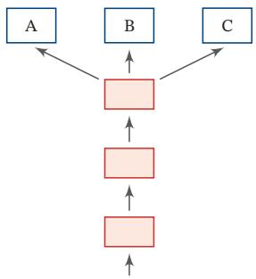
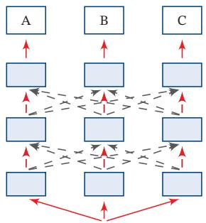
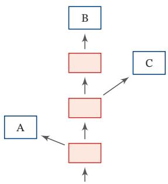
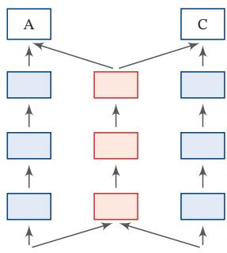
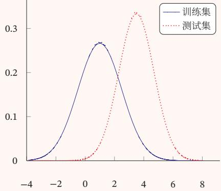
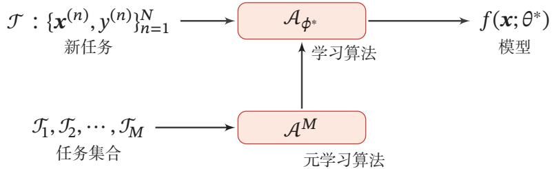

# 第10章 模型独立的学习方式

[¶0001] 三个臭皮匠赛过诸葛亮

[¶0002] 谚语

[¶0003] 在前面的章节中，我们已经介绍了机器学习的几种学习方式，包括监督学习、无监督学习等．这些学习方式分别可以由不同的模型和算法实现，比如神经网络、线性分类器等．针对一个给定的任务，首先要准备一定规模的训练数据，这些训练数据需要和真实数据的分布一致，然后设定一个目标函数和优化方法，在训练数据上学习一个模型．此外，不同任务的模型往往都是从零开始来训练的，一切知识都需要从训练数据中得到．这也导致了每个任务都需要准备大量的训练数据．在实际应用中，我们面对的任务往往难以满足上述要求，比如训练任务和目标任务的数据分布不一致，训练数据过少等．这时机器学习的应用会受到很大的局限．并且在很多场合中，我们也需要一个模型可以快速地适应新的任务因此，人们开始关注一些新的学习方式

[¶0004] 本章介绍一些“模型独立的学习方式”，比如集成学习、协同学习、自训练、多任务学习、迁移学习、终身学习、小样本学习、元学习等．这里“模型独立”是指这些学习方式不限于具体的模型，不管是前馈神经网络、循环神经网络还是其他模型．然而，一种学习方式往往会对符合某种特性的模型更加青睐，比如集成学习往往和方差大的模型组合时效果显著

## 10.1 集成学习

[¶0005] 给定一个学习任务，假设输入??和输出??的真实关系为 $y = h ( { \boldsymbol { x } } )$ ．对于??个不同的模型 $f _ { 1 } ( { \pmb x } ) , \cdots , f _ { M } ( { \pmb x } )$ ，每个模型的期望错误为

[¶0006]
$$
\mathcal { R } ( f _ { m } ) = \mathbb { E } _ { x } \Big [ \Big ( f _ { m } ( \pmb { x } ) - h ( \pmb { x } ) \Big ) ^ { 2 } \Big ]\tag{10.1}
$$

[¶0007]
$$
\begin{array} { r l } { \mathbf { \epsilon } } & { { } = \mathbb { E } _ { \pmb { x } } \Big [ \epsilon _ { m } ( \pmb { x } ) ^ { 2 } \Big ] , } \end{array}\tag{10.2}
$$

[¶0008] 其中 $\epsilon _ { m } ( { \pmb x } ) = f _ { m } ( { \pmb x } ) - h ( { \pmb x } )$ 为模型??在样本??上的错误

[¶0009] 那么所有的模型的平均错误为

[¶0010]
$$
\bar { \mathcal { R } } ( f ) = \frac { 1 } { M } \sum _ { m = 1 } ^ { M } \mathbb { E } _ { \pmb { x } } [ \epsilon _ { m } ( \pmb { x } ) ^ { 2 } ] .\tag{10.3}
$$

[¶0011] 集成学习（Ensemble Learning）就是通过某种策略将多个模型集成起来，通过群体决策来提高决策准确率．集成学习首要的问题是如何集成多个模型．比较常用的集成策略有直接平均、加权平均等

[¶0012] 最直接的集成学习策略就是直接平均，即“投票”．基于投票的集成模型 $F ( { \boldsymbol { x } } )$ 为

[¶0013]
$$
F ( \pmb { x } ) = \frac { 1 } { M } \sum _ { m = 1 } ^ { M } f _ { m } ( \pmb { x } ) .\tag{10.4}
$$

[¶0014] 定理 10.1： 对于?? 个不同的模型 $f _ { 1 } ( { \pmb x } ) , \cdots , f _ { M } ( { \pmb x } )$ ，其平均期望错误为$\bar { \mathcal { R } } ( f )$ ．基于简单投票机制的集成模型 $F ( \pmb { x } ) = \frac { 1 } { M } \sum _ { m = 1 } ^ { M } f _ { m } ( \pmb { x } )$ ，??(??) 的期望错误在 $\textstyle { \frac { 1 } { M } } { \bar { \mathcal { R } } } ( f )$ $\bar { \mathcal { R } } ( f )$ 之间．

[¶0015] 证明. 根据定义，集成模型的期望错误为

[¶0016]
$$
\mathcal { R } ( F ) = \mathbb { E } _ { x } \Big [ \Big ( \frac { 1 } { M } \sum _ { m = 1 } ^ { M } f _ { m } ( \pmb { x } ) - h ( \pmb { x } ) \Big ) ^ { 2 } \Big ]\tag{10.5}
$$

[¶0017]
$$
= \mathbb { E } _ { x } \Big [ \Big ( \frac { 1 } { M } \sum _ { m = 1 } ^ { M } \epsilon _ { m } ( x ) \Big ) ^ { 2 } \Big ]\tag{10.6}
$$

[¶0018]
$$
= \frac { 1 } { M ^ { 2 } } \mathbb { E } _ { x } \Big [ \sum _ { m = 1 } ^ { M } \sum _ { n = 1 } ^ { M } \epsilon _ { m } ( { \pmb x } ) \epsilon _ { n } ( { \pmb x } ) \Big ]\tag{10.7}
$$

[¶0019]
$$
= \frac { 1 } { M ^ { 2 } } \sum _ { m = 1 } ^ { M } \sum _ { n = 1 } ^ { M } \mathbb { E } _ { \pmb { x } } \Big [ \epsilon _ { m } ( \pmb { x } ) \epsilon _ { n } ( \pmb { x } ) \Big ] ,\tag{10.8}
$$

[¶0020] 其中 $\mathbb { E } _ { \pmb { x } } [ \epsilon _ { m } ( \pmb { x } ) \epsilon _ { n } ( \pmb { x } ) ]$ 为两个不同模型错误的相关性．如果每个模型的错误不相关，即 $\forall m \neq n , \mathbb { E } _ { x } [ \epsilon _ { m } ( { \pmb x } ) \epsilon _ { n } ( { \pmb x } ) ] = 0$ ．如果每个模型的错误都是相同的，则 $\forall m \neq$ $n , \epsilon _ { m } ( { \pmb x } ) = \epsilon _ { n } ( { \pmb x } )$ ．并且，由于 $\epsilon _ { m } ( { \pmb x } ) \geq 0 , \forall m$ ，可以得到

[¶0021]
$$
\bar { \mathcal { R } } ( f ) \geq \mathcal { R } ( F ) \geq \frac { 1 } { M } \bar { \mathcal { R } } ( f ) ,\tag{10.9}
$$

[¶0022] https://nndl.github.io/

[¶0023] 即集成模型的期望错误大于等于所有模型的平均期望错误的1/??，小于等于所有模型的平均期望错误 □

[¶0024] 参见习题10-1

[¶0025] 从定理10.1可知，为了得到更好的集成效果，要求每个模型之间具备一定的差异性．并且随着模型数量的增多，其错误率也会下降，并趋近于0

[¶0026] 集成学习的思想可以用一句古老的谚语来描述：“三个臭皮匠赛过诸葛亮”但是一个有效的集成需要各个基模型的差异尽可能大．为了增加模型之间的差异性，可以采取Bagging和Boosting这两类方法

[¶0027] Bagging类方法 Bagging类方法是通过随机构造训练样本、随机选择特征等方法来提高每个基模型的独立性，代表性方法有Bagging和随机森林等

[¶0028] Bagging（Bootstrap Aggregating）是通过不同模型的训练数据集的独立性来提高不同模型之间的独立性．我们在原始训练集上进行有放回的随机采样，得到??个比较小的训练集并训练??个模型，然后通过投票的方法进行模型集成

[¶0029] 随机森林（Random Forest）[Breiman, 2001]是在Bagging的基础上再引入了随机特征，进一步提高每个基模型之间的独立性．在随机森林中，每个基模型都是一棵决策树

[¶0030] Boosting 类方法 Boosting 类方法是按照一定的顺序来先后训练不同的基模型，每个模型都针对前序模型的错误进行专门训练．根据前序模型的结果，来调整训练样本的权重，从而增加不同基模型之间的差异性．Boosting类方法是一种非常强大的集成方法，只要基模型的准确率比随机猜测高，就可以通过集成方法来显著地提高集成模型的准确率．Boosting类方法的代表性方法有Ad-aBoost[Freund et al., 1996] 等

## 10.1.1 AdaBoost 算法

[¶0031] Boosting类集成模型的目标是学习一个加性模型（Additive Model）

[¶0032]
$$
F ( \pmb { x } ) = \sum _ { m = 1 } ^ { M } \alpha _ { m } f _ { m } ( \pmb { x } ) ,\tag{10.10}
$$

[¶0033] 其中 $f _ { m } ( { \pmb x } )$ 为弱分类器（Weak Classifier），或基分类器（Base Classifier）， $\alpha _ { m }$ 为弱分类器的集成权重，??(??)称为强分类器（Strong Classifier）

[¶0034] Boosting类方法的关键是如何训练每个弱分类器 $f _ { m } ( { \pmb x } )$ 及其权重 $\alpha _ { m }$ ．为了提高集成的效果，应当尽量使得每个弱分类器的差异尽可能大．一种有效的算法是采用迭代的方法来学习每个弱分类器，即按照一定的顺序依次训练每个弱分类器．假设已经训练了??个弱分类器，在训练第第?? + 1个弱分类器时，增加已有弱分类器分错样本的权重，使得第?? + 1个弱分类器“更关注”于已有弱分类器https://nndl.github.io/

[¶0035] 分错的样本．这样增加每个弱分类器的差异，最终提升集成分类器的准确率．这种方法称为AdaBoost（Adaptive Boosting）算法

[¶0036] AdaBoost算法是一种迭代式的训练算法，通过改变数据分布来提高弱分类器的差异．在每一轮训练中，增加分错样本的权重，减少分对样本的权重，从而得到一个新的数据分布

[¶0037] 以二分类为例，弱分类器 $f _ { m } ( x ) \in \{ + 1 , - 1 \}$ ，AdaBoost算法的训练过程如算法10.1所示．最初赋予每个样本同样的权重．在每一轮迭代中，根据当前的样本权重训练一个新的弱分类器．然后根据这个弱分类器的错误率来计算其集成权重，并调整样本权重

[¶0038] 算法 10.1 二分类的AdaBoost算法  
输入:训练集 $\overline { { \{ ( \pmb { x } ^ { ( n ) } , y ^ { ( n ) } ) \} _ { n = 1 } ^ { N } } }$ ，迭代次数??  
1 初始样本权重： $\begin{array} { r } { w _ { 1 } ^ { ( n ) }  \frac { 1 } { N } , \forall n \in [ 1 , N ] ; } \end{array}$   
2 for $m = 1 \cdots M$ do  
3 按照样本权重 $w _ { m } ^ { ( 1 ) } , \cdots , w _ { m } ^ { ( N ) }$ ，学习弱分类器 $f _ { m }$   
4 计算弱分类器 $f _ { m }$ 在数据集上的加权错误 $\epsilon _ { m } ;$   
5 计算分类器的集成权重：  
$\alpha _ { m }  \frac { 1 } { 2 } \log \frac { 1 - \epsilon _ { m } } { \epsilon _ { m } } ;$   
6 调整样本权重：  
$w _ { m + 1 } ^ { ( n ) } \gets w _ { m } ^ { ( n ) } \exp \big ( - \alpha _ { m } y ^ { ( n ) } f _ { m } ( \pmb { x } ^ { ( n ) } ) \big ) , \forall n \in [ 1 , N ] ;$   
7 end  
输出: $\begin{array} { r } { F ( \pmb { x } ) = \mathrm { s g n } \left( \sum _ { m = 1 } ^ { M } \alpha _ { m } f _ { m } ( \pmb { x } ) \right) } \end{array}$

[¶0039] AdaBoost算法的统计学解释 AdaBoost算法也可以看作一种分步（Stage-Wise）优化的加性模型 [Friedman et al., 2000]，其损失函数定义为

[¶0040]
$$
\begin{array} { l } { \displaystyle \mathcal { L } ( F ) = \exp \big ( - y F ( x ) \big ) } \\ { \displaystyle = \exp \big ( - y \sum _ { m = 1 } ^ { M } \alpha _ { m } f _ { m } ( x ) \big ) , } \end{array}\tag{10.11}
$$

[¶0041] (10.12)

[¶0042] 其中 $y , f _ { m } ( x ) \in \{ + 1 , - 1 \}$

[¶0043] 假设经过?? − 1次迭代，得到

[¶0044]
$$
F _ { m - 1 } ( { \pmb x } ) = \sum _ { t = 1 } ^ { m - 1 } \alpha _ { t } f _ { t } ( { \pmb x } ) ,\tag{10.13}
$$

[¶0045] 则第??次迭代的目标是找一个 $\alpha _ { m }$ 和 $f _ { m } ( { \pmb x } )$ 使得下面的损失函数最小

[¶0046]
$$
\mathcal { L } ( \alpha _ { m } , f _ { m } ( \pmb { x } ) ) = \sum _ { n = 1 } ^ { N } \exp \Big ( - y ^ { ( n ) } \big ( F _ { m - 1 } ( \pmb { x } ^ { ( n ) } ) + \alpha _ { m } f _ { m } ( \pmb { x } ^ { ( n ) } ) \big ) \Big ) .\tag{10.14}
$$

[¶0047] 令 $w _ { m } ^ { ( n ) } = \exp \big ( - y ^ { ( n ) } F _ { m - 1 } ( { \pmb x } ^ { ( n ) } ) \big )$ ，则损失函数可以写为

[¶0048]
$$
\mathcal { L } ( \alpha _ { m } , f _ { m } ( \pmb { x } ) ) = \sum _ { n = 1 } ^ { N } w _ { m } ^ { ( n ) } \exp \big ( - \alpha _ { m } y ^ { ( n ) } f _ { m } ( \pmb { x } ^ { ( n ) } ) \big ) .\tag{10.15}
$$

[¶0049] 因为 $y , f _ { m } ( x ) \in \{ + 1 , - 1 \}$ ，有

[¶0050]
$$
y f _ { m } ( x ) = 1 - 2 I ( y \neq f _ { m } ( x ) ) ,\tag{10.16}
$$

[¶0051] 其中??(??)为指示函数

[¶0052] 将损失函数在 $- \alpha _ { m } y ^ { ( n ) } f _ { m } ( \pmb { x } ^ { ( n ) } ) = 0$ 处进行二阶泰勒展开，有

[¶0053]
$$
\mathcal { L } ( \alpha _ { m } , f _ { m } ( \pmb { x } ) ) = \sum _ { n = 1 } ^ { N } w _ { m } ^ { ( n ) } \Big ( 1 - \alpha _ { m } y ^ { ( n ) } f _ { m } ( \pmb { x } ^ { ( n ) } ) + \frac { 1 } { 2 } \alpha _ { m } ^ { 2 } \Big )
$$

[¶0054] 指 数 函 数 exp(??) 在$x = 0$ 处的二阶泰勒展开公式为 $1 + x + { \frac { x ^ { 2 } } { 2 ! } }$

[¶0055] (10.17)

[¶0056]
$$
\propto \alpha _ { m } \sum _ { n = 1 } ^ { N } w _ { m } ^ { ( n ) } I \Bigl ( y ^ { ( n ) } \neq f _ { m } ( \pmb { x } ^ { ( n ) } ) \Bigr ) .\tag{10.18}
$$

[¶0057] 从上式可以看出，当 $\alpha _ { m } > 0$ 时，最优的分类器 $f _ { m } ( { \pmb x } )$ 为使得在样本权重为$w _ { m } ^ { ( n ) } , 1 \leq n \leq N$ 时的加权错误率最小的分类器

[¶0058] 在求解出 $f _ { m } ( { \pmb x } )$ 之后，公式(10.15)可以写为

[¶0059]
$$
\mathcal { L } ( \alpha _ { m } , f _ { m } ( x ) ) = \sum _ { y ^ { ( n ) } = f _ { m } ( x ^ { ( n ) } ) } w _ { m } ^ { ( n ) } \exp ( - \alpha _ { m } ) + \sum _ { y ^ { ( n ) } \neq f _ { m } ( x ^ { ( n ) } ) } w _ { m } ^ { ( n ) } \exp ( \alpha _ { m } )\tag{10.19}
$$

[¶0060]
$$
\propto ( 1 - \epsilon _ { m } ) \exp ( - \alpha _ { m } ) + \epsilon _ { m } \exp ( \alpha _ { m } ) ,\tag{10.20}
$$

[¶0061] 其中 $\epsilon _ { m }$ 为分类器 $f _ { m } ( { \pmb x } )$ 的加权错误率，

[¶0062]
$$
\epsilon _ { m } = \frac { \sum _ { y ^ { ( n ) } \neq f _ { m } ( x ^ { ( n ) } ) } w _ { m } ^ { ( n ) } } { \sum _ { n } w _ { m } ^ { ( n ) } } .\tag{10.21}
$$

[¶0063] 求上式关于 $\alpha _ { m }$ 的导数并令其为0，得到

[¶0064]
$$
\alpha _ { m } = \frac { 1 } { 2 } \log \frac { 1 - \epsilon _ { m } } { \epsilon _ { m } } .\tag{10.22}
$$

## 10.2 自训练和协同训练

[¶0065] 监督学习往往需要大量的标注数据，而标注数据的成本比较高．因此，利用大量的无标注数据来提高监督学习的效果有着十分重要的意义．这种利用少量标注数据和大量无标注数据进行学习的方式称为半监督学习（Semi-SupervisedLearning，SSL）．本节介绍两种半监督学习算法：自训练和协同训练

## 10.2.1 自训练

[¶0066] 自训练（Self-Training，或 Self-Teaching），也叫自举法（Bootstrapping），是一种非常简单的半监督学习算法 [Scudder, 1965; Yarowsky, 1995]

[¶0067] 自训练是首先使用标注数据来训练一个模型，并使用这个模型来预测无标注样本的标签，把预测置信度比较高的样本及其预测的伪标签加入训练集，然后重新训练新的模型，并不断重复这个过程．算法10.2给出了自训练的训练过程

[¶0068] 算法10.2 自训练的训练过程  
输入:标注数据集 $\mathcal { L } = \{ ( \boldsymbol { x } ^ { ( n ) } , y ^ { ( n ) } ) \} _ { n = 1 } ^ { N } ;$   
无标注数据集 $\mathcal { U } = \{ \pmb { x } ^ { ( m ) } \} _ { m = 1 } ^ { M }$ ;  
迭代次数??;每次迭代增加样本数量??;  
1 for ?? = 1 ⋯ ?? do  
2 根据训练集ℒ，训练模型??;  
3 使用模型??对无标注数据集??的样本进行预测，选出预测置信度高的??  
个样本 $\mathcal { P } = \{ ( { \pmb x } ^ { ( p ) } , f ( { \pmb x } ^ { ( p ) } ) ) \} _ { p = 1 } ^ { P }$   
4 更新训练集：  
ℒ ← ℒ ∪ ??, ?? ← ?? − ??.  
5 end  
输出:模型??

[¶0069] 自训练和密度估计中EM算法有一定的相似之处，通过不断地迭代来提高模型能力．但自训练的缺点是无法保证每次加入训练集的样本的伪标签是正确的．如果选择样本的伪标签是错误的，反而会损害模型的预测能力．因此，自训练最关键的步骤是如何设置挑选样本的标准

## 10.2.2 协同训练

[¶0070] 协同训练（Co-Training）是自训练的一种改进方法，通过两个基于不同视角（view）的分类器来互相促进．很多数据都有相对独立的不同视角．比如互联网上的每个网页都由两种视角组成：文字内容（text）和指向其他网页的链接https://nndl.github.io/

[¶0071] （hyperlink）．如果要确定一个网页的类别，既可以根据文字内容来判断，也可根据网页之间的链接关系来判断

[¶0072] 假设一个样本 $\pmb { x } = [ \pmb { x } _ { 1 } , \pmb { x } _ { 2 } ]$ ，其中 $\mathbf { x } _ { 1 }$ 和 $\mathbf { \boldsymbol { x } } _ { 2 }$ 分别表示两种不同视角 $V _ { 1 }$ 和 $V _ { 2 }$ 的特征，并满足下面两个假设．1）条件独立性：给定样本标签 $y$ 时，两种特征条件独立 $p ( \pmb { x } _ { 1 } , \pmb { x } _ { 2 } | y ) = p ( \pmb { x } _ { 1 } | y ) p ( \pmb { x } _ { 2 } | y ) ; 2 )$ 充足和冗余性：当数据充分时，每种视角的特征都足以单独训练出一个正确的分类器．令 $y = g ( \pmb { x } )$ 为需要学习的真实映射函数， $f _ { 1 }$ 和 $f _ { 2 }$ 分别为两个视角的分类器，有

[¶0073]
$$
\exists f _ { 1 } , f _ { 2 } , \quad \forall x \in \mathcal { X } , \qquad f _ { 1 } ( x _ { 1 } ) = f _ { 2 } ( x _ { 2 } ) = g ( x ) ,\tag{10.23}
$$

[¶0074] 其中??为样本??的取值空间

[¶0075] 算法10.3给出了协同训练的训练过程．协同算法要求两种视角是条件独立的．如果两种视角完全一样，则协同训练退化成自训练算法

[¶0076] 算法 10.3 协同训练的训练过程  
输入:标注数据集 $\mathcal { L } = \{ ( \boldsymbol { x } ^ { ( n ) } , y ^ { ( n ) } ) \} _ { n = 1 } ^ { N }$ ;  
无标注数据集 $\mathcal { U } = \{ \pmb { x } ^ { ( m ) } \} _ { m = 1 } ^ { M } ;$ ;  
迭代次数 $T ;$ 候选池大小??;每次迭代增加样本数量 $2 P ;$   
1 for ?? = 1 ⋯ ?? do  
2 根据训练集 $\mathcal { L }$ 的视角 $V _ { 1 }$ 训练训练模型 $f _ { 1 }$ ;  
3 根据训练集 $\mathcal { L }$ 的视角 $V _ { 2 }$ 训练训练模型 $f _ { 2 } ;$   
4 从无标注数据集??上随机选取一些样本放入候选池 $u ^ { \prime }$ ，使得 $| \mathcal { U } ^ { \prime } | = K ;$   
5 for $f \in f _ { 1 } , f _ { 2 }$ do  
6 使用模型 $f$ 预测候选池 $u ^ { \prime }$ 中的样本的伪标签;  
7 for $p = 1 \cdots P$ do  
8 根据标签分布，随机选取一个标签 $y ;$   
9 从 $\mathcal { U } ^ { \prime }$ 中选出伪标签为 $y _ { : }$ ，并且预测置信度最高的样本 $x ;$   
10 更新训练集：  
${ \mathcal { L } } \gets { \mathcal { L } } \cup \{ ( { \boldsymbol { x } } , { \boldsymbol { y } } ) \} , \qquad { \mathcal { U } } ^ { \prime } \gets { \mathcal { U } } ^ { \prime } - \{ ( { \boldsymbol { x } } , { \boldsymbol { y } } ) \} .$   
11 end  
12 end  
13 end  
输出:模型 $f _ { 1 } , f _ { 2 }$

[¶0077] 由于不同视角的条件独立性，在不同视角上训练出来的模型就相当于从不同视角来理解问题，具有一定的互补性．协同训练就是利用这种互补性来进行自训练的一种方法．首先在训练集上根据不同视角分别训练两个模型 $f _ { 1 }$ 和 $f _ { 2 }$ ，然后

[¶0078] 用 $f _ { 1 }$ 和 $f _ { 2 }$ 在无标注数据集上进行预测，各选取预测置信度比较高的样本加入训练集，重新训练两个不同视角的模型，并不断重复这个过程

## 10.3 多任务学习

[¶0079] 一般的机器学习模型都是针对单一的特定任务，比如手写体数字识别、物体检测等．不同任务的模型都是在各自的训练集上单独学习得到的．如果有两个任务比较相关，它们之间会存在一定的共享知识，这些知识对两个任务都会有所帮助．这些共享的知识可以是表示（特征）、模型参数或学习算法等．目前，主流的多任务学习方法主要关注表示层面的共享

[¶0080] 多任务学习（Multi-task Learning）是指同时学习多个相关任务，让这些任务在学习过程中共享知识，利用多个任务之间的相关性来改进模型在每个任务上的性能和泛化能力．多任务学习可以看作一种归纳迁移学习（InductiveTransfer Learning），即通过利用包含在相关任务中的信息作为归纳偏置（In-ductive Bias）来提高泛化能力 [Caruana, 1997]

[¶0081] 共享机制 多任务学习的主要挑战在于如何设计多任务之间的共享机制．在传统的机器学习算法中，引入共享的信息是比较困难的，通常会导致模型变得复杂．但是在神经网络模型中，模型共享变得相对比较容易．深度神经网络模型提供了一种很方便的信息共享方式，可以很容易地进行多任务学习．多任务学习的共享机制比较灵活，有很多种共享模式．图10.1给出了多任务学习中四种常见的共享模式，其中??、??和??表示三个不同的任务，红色框表示共享模块，蓝色框表示任务特定模块

[¶0082] 这四种常见的共享模式分别为：

[¶0083] （1） 硬共享模式：让不同任务的神经网络模型共同使用一些共享模块（一般是低层）来提取一些通用特征，然后再针对每个不同的任务设置一些私有模块（一般是高层）来提取一些任务特定的特征

[¶0084] （2） 软共享模式：不显式地设置共享模块，但每个任务都可以从其他任务中“窃取”一些信息来提高自己的能力．窃取的方式包括直接复制使用其他任务的隐状态，或使用注意力机制来主动选取有用的信息

[¶0085] （3） 层次共享模式：一般神经网络中不同层抽取的特征类型不同，低层一般抽取一些低级的局部特征，高层抽取一些高级的抽象语义特征．因此如果多任务学习中不同任务也有级别高低之分，那么一个合理的共享模式是让低级任务在低层输出，高级任务在高层输出

[¶0086] （4） 共享-私有模式：一个更加分工明确的方式是将共享模块和任务特定（私有）模块的责任分开．共享模块捕捉一些跨任务的共享特征，而私有模块只https://nndl.github.io/

[¶0087]
  
(a)硬共享模式

[¶0088]
  
(b)软共享模式

[¶0089]
  
(c)层次共享模式

[¶0090]
  
(d)共享-私有模式  
图10.1 多任务学习中四种常见的共享模式

[¶0091] 捕捉和特定任务相关的特征．最终的表示由共享特征和私有特征共同构成

[¶0092] 学习步骤 在多任务学习中，每个任务都可以有自己单独的训练集．为了让所有任务同时学习，我们通常会使用交替训练的方式来“近似”地实现同时学习

[¶0093] 假设有??个相关任务，第??个任务的训练集为 $\mathcal { D } _ { m }$ ，包含 $N _ { m }$ 个样本

[¶0094]
$$
\mathcal { D } _ { m } = \{ ( \boldsymbol { x } ^ { ( m , n ) } , \boldsymbol { y } ^ { ( m , n ) } ) \} _ { n = 1 } ^ { N _ { m } } ,\tag{10.24}
$$

[¶0095] 其中 $\mathbf { \boldsymbol { x } } ^ { ( m , n ) }$ 和 $y ^ { ( m , n ) }$ 表示第??个任务中的第??个样本以及它的标签

[¶0096] 假设这??个任务对应的模型分别为 $f _ { m } ( { \pmb x } ; \theta ) , 1 \le m \le M$ ，多任务学习的联合目标函数为所有任务损失函数的线性加权

[¶0097]
$$
\mathcal { L } ( \theta ) = \sum _ { m = 1 } ^ { M } \sum _ { n = 1 } ^ { N _ { m } } \eta _ { m } \mathcal { L } _ { m } \Big ( f _ { m } ( x ^ { ( m , n ) } ; \theta ) , y ^ { ( m , n ) } \Big ) ,\tag{10.25}
$$

[¶0098] 其中 $\mathcal { L } _ { m } ( \cdot )$ 为第??个任务的损失函数， $\eta _ { m }$ 是第??个任务的权重，??表示包含了共享模块和私有模块在内的所有参数．权重可以根据不同任务的重要程度来赋值，也可以根据任务的难易程度来赋值．通常情况下，所有任务设置相同的权重，即$\begin{array} { r } { \eta _ { m } = 1 , 1 \le m \le M . } \end{array}$

[¶0099] 多任务学习的流程可以分为两个阶段：

[¶0100] （1） 联合训练阶段：每次迭代时，随机挑选一个任务，然后从这个任务中随机选择一些训练样本，计算梯度并更新参数．多任务学习中联合训练阶段的具体过程如算法10.4所示

[¶0101] 算法10.4 多任务学习中联合训练过程  
输入:??个任务的数据集 $\mathcal { D } _ { m } , 1 \leq m \leq M ;$   
每个任务的批量大小 $K _ { m } , 1 \leq m \leq M ;$   
最大迭代次数??，学习率??;  
1 随机初始化参数 $\theta _ { 0 }$ ;  
2 for $t = 1 \cdots T$ do  
// 准备??个任务的数据  
3 for $m = 1 \cdots M$ do  
4 将任务??的训练集 $\mathcal { D } _ { m }$ 中随机划分为 $\begin{array} { r } { c = \frac { N _ { m } } { K _ { m } } } \end{array}$ 个小批量集合：  
$\mathcal { B } _ { m } = \{ \mathcal { I } _ { m , 1 } , \cdots , \mathcal { I } _ { m , c } \} ;$   
5 end  
6 合并所有小批量样本 $\bar { \mathcal { B } } = \mathcal { B } _ { 1 } \cup \mathcal { B } _ { 2 } \cup \dots \cup \mathcal { B } _ { M } ;$   
7 随机排序ℬ̄;  
8 foreach ${ \mathcal { I } } \in { \bar { \mathcal { B } } }$ do  
9 计算小批量样本ℐ上的损失ℒ(??); // 只计算ℐ在对应任务上的损失  
10 更新参数： $\theta _ { t } \gets \theta _ { t - 1 } - \alpha \cdot \nabla _ { \theta } \mathcal { L } ( \theta ) ;$   
11 end  
12 end  
输出:模型 $f _ { m } , 1 \leq m \leq M$

[¶0102] （2） 单任务精调阶段：基于多任务学习得到的参数，分别在每个单独任务进行精调（Fine-Tuning）．其中单任务精调阶段为可选阶段．当多个任务的差异性比较大时，在每个单任务上继续优化参数可以进一步提升模型能力

[¶0103] 多任务学习通常可以获得比单任务学习更好的泛化能力，主要有以下几个原因：

[¶0104] （1） 多任务学习在多个任务的数据集上进行训练，比单任务学习的训练集更大．由于多个任务之间有一定的相关性，因此多任务学习相当于是一种隐式的数据增强，可以提高模型的泛化能力

[¶0105] （2） 多任务学习中的共享模块需要兼顾所有任务，这在一定程度上避免了模型过拟合到单个任务的训练集，可以看作一种正则化

[¶0106] （3） 既然一个好的表示通常需要适用于多个不同任务，多任务学习的机制使得它会比单任务学习获得更好的表示

[¶0107] （4） 在多任务学习中，每个任务都可以“选择性”利用其他任务中学习到的隐藏特征，从而提高自身的能力

## 10.4 迁移学习

[¶0108] 标准机器学习的前提假设是训练数据和测试数据的分布是相同的．如果不满足这个假设，在训练集上学习到的模型在测试集上的表现会比较差．而在很多实际场景中，经常碰到的问题是标注数据的成本十分高，无法为一个目标任务准备足够多相同分布的训练数据．因此，如果有一个相关任务已经有了大量的训练数据，虽然这些训练数据的分布和目标任务不同，但是由于训练数据的规模比较大，我们假设可以从中学习某些可以泛化的知识，那么这些知识对目标任务会有一定的帮助．如何将相关任务的训练数据中的可泛化知识迁移到目标任务上，就是迁移学习（Transfer Learning）要解决的问题

[¶0109] 具体而言，假设一个机器学习任务??的样本空间为 $\mathcal X \times \mathcal Y$ ，其中??为输入空间，??为输出空间，其概率密度函数为 $p ( { \pmb x } , { \pmb y } )$ ．为简单起见，这里设??为??维实数空间的一个子集，??为一个离散的集合

[¶0110]
$$
p ( x , y ) = P ( X =
$$

[¶0111] 一个样本空间及其分布可以称为一个领域（Domain）： $\mathcal { D } = ( \mathcal { X } , \mathcal { Y } , p ( \pmb { x } , \mathcal { y } ) )$ 给定两个领域，如果它们的输入空间、输出空间或概率分布中至少一个不同，那么这两个领域就被认为是不同的．从统计学习的观点来看，一个机器学习任务??定义为在一个领域??上的条件概率 $p ( y | \pmb { x } )$ 的建模问题

[¶0112] 迁移学习是指两个不同领域的知识迁移过程，利用源领域（Source Domain）$\mathcal { D } _ { S }$ 中学到的知识来帮助目标领域（Target Domain） $\mathcal { D } _ { T }$ 上的学习任务．源领域的训练样本数量一般远大于目标领域

[¶0113] 表10.1给出了迁移学习和标准机器学习的比较

[¶0114] 表10.1 迁移学习和标准机器学习的比较
<table><tr><td rowspan=1 colspan=1>学习类型</td><td rowspan=1 colspan=1>样本空间</td><td rowspan=1 colspan=1>概率分布</td></tr><tr><td rowspan=1 colspan=1>标准机器学习</td><td rowspan=1 colspan=1> $\mathcal { X } _ { S } = \mathcal { X } _ { T } , \mathcal { Y } _ { S } = \mathcal { Y } _ { T }$ </td><td rowspan=1 colspan=1> $p _ { S } ( { \pmb x } , { \pmb y } ) = p _ { T } ( { \pmb x } , { \pmb y } )$ </td></tr><tr><td rowspan=1 colspan=1>迁移学习</td><td rowspan=1 colspan=2> $\mathcal { X } _ { S } \neq \mathcal { X } _ { T }$ 或 $\mathcal { Y } _ { S } \ne \mathcal { Y } _ { T }$ 或 $p _ { S } ( { \pmb x } , { y } ) \neq p _ { T } ( { \pmb x } , { y } )$ </td></tr></table>

[¶0115] 迁移学习根据不同的迁移方式又分为两个类型：归纳迁移学习（InductiveTransfer Learning）和转导迁移学习（Transductive Transfer Learning）．这两个类型分别对应两个机器学习的范式：归纳学习（Inductive Learning）和转导学习（Transductive Learning）[Vapnik, 1998]．一般的机器学习都是指归纳学习，即希望在训练数据集上学习到使得期望风险（即真实数据分布上的错误率）最小的模型．而转导学习的目标是学习一种在给定测试集上错误率最小的模型，在训练阶段可以利用测试集的信息

[¶0116] 期 望 风 险 参 见第2.2.2节

[¶0117] 归纳迁移学习是指在源领域和任务上学习出一般的规律，然后将这个规律迁移到目标领域和任务上；而转导迁移学习是一种从样本到样本的迁移，直接利用源领域和目标领域的样本进行迁移学习

## 10.4.1 归纳迁移学习

[¶0118] 在归纳迁移学习中，源领域和目标领域有相同的输入空间 $\mathcal { X } _ { S } = \mathcal { X } _ { T }$ ，输出空间可以相同也可以不同，源任务和目标任务一般不相同 $\mathcal { F } _ { S } \not = \mathcal { F } _ { T }$ ，即 $p _ { S } ( y | \pmb { x } )$ ≠$p _ { T } ( y | \boldsymbol { x } )$ ．一般而言，归纳迁移学习要求源领域和目标领域是相关的，并且源领域$\mathcal { D } _ { S }$ 有大量的训练样本，这些样本可以是有标注的样本，也可以是无标注样本

[¶0119] （1） 当源领域只有大量无标注数据时，源任务可以转换为无监督学习任务，比如自编码和密度估计任务．通过这些无监督任务学习一种可迁移的表示，然后再将这种表示迁移到目标任务上．这种学习方式和自学习（Self-TaughtLearning）[Raina et al., 2007] 以及半监督学习比较类似．比如在自然语言处理领域，由于语言相关任务的标注成本比较高，很多自然语言处理任务的标注数据都比较少，这导致了在这些自然语言处理任务上经常会受限于训练样本数量而无法充分发挥深度学习模型的能力．同时，由于我们可以低成本地获取大规模的无标注自然语言文本，因此一种自然的迁移学习方式是将大规模文本上的无监督学习（比如语言模型）中学到的知识迁移到一个新的目标任务上．从早期的预训练词向量（比如 word2vec [Mikolov et al., 2013] 和 GloVe [Pennington et al.,2014] 等）到句子级表示（比如 ELMO [Peters et al., 2018]、OpenAI GPT [Rad-ford et al., 2018] 以及 BERT[Devlin et al., 2018] 等）都对自然语言处理任务有很大的促进作用

[¶0120] 自 编 码 器 参 见第9.1.3节．概率密度估计参见第9.2节

[¶0121] （2） 当源领域有大量的标注数据时，可以直接将源领域上训练的模型迁移到目标领域上．比如在计算机视觉领域有大规模的图像分类数据集 ImageNet[Deng et al.,2009]．由于在ImageNet数据集上有很多预训练的图像分类模型，比如 AlexNet[Krizhevsky et al., 2012]、VGG [Simonyan et al., 2014] 和 ResNet[Heet al.,2016]等，我们可以将这些预训练模型迁移到目标任务上

[¶0122] 在归纳迁移学习中，由于源领域的训练数据规模非常大，这些预训练模型通常有比较好的泛化性，其学习到的表示通常也适用于目标任务．归纳迁移学习一般有下面两种迁移方式：

[¶0123] （1） 基于特征的方式：将预训练模型的输出或者是中间隐藏层的输出作为特征直接加入到目标任务的学习模型中．目标任务的学习模型可以是一般的浅层分类器（比如支持向量机等）或一个新的神经网络模型

[¶0124] （2） 精调的方式：在目标任务上复用预训练模型的部分组件，并对其参数进行精调（Fine-Tuning）

[¶0125] 假设预训练模型是一个深度神经网络，这个预训练网络中每一层的可迁移性也不尽相同 [Yosinski et al., 2014]．通常来说，网络的低层学习一些通用的低层特征，中层或高层学习抽象的高级语义特征，而最后几层一般学习和特定任务相关的特征．因此，根据目标任务的自身特点以及和源任务的相关性，可以有针对性地选择预训练模型的不同层来迁移到目标任务中

[¶0126] 将预训练模型迁移到目标任务上通常会比从零开始学习的方式更好，主要体现在以下三点 [Torrey et al., 2010]：1）初始模型的性能一般比随机初始化的模型要好；2）训练时模型的学习速度比从零开始学习要快，收敛性更好；3）模型的最终性能更好，具有更好的泛化性

[¶0127] 归纳迁移学习和多任务学习也比较类似，但有下面两点区别：1）多任务学习是同时学习多个不同任务，而归纳迁移学习通常分为两个阶段，即源任务上的学习阶段和目标任务上的迁移学习阶段；2）归纳迁移学习是单向的知识迁移，希望提高模型在目标任务上的性能，而多任务学习是希望提高所有任务的性能

## 10.4.2 转导迁移学习

[¶0128] 转导迁移学习是一种从样本到样本的迁移，直接利用源领域和目标领域的样本进行迁移学习[Arnold et al., 2007]．转导迁移学习可以看作一种特殊的转导学习（Transductive Learning）[Joachims, 1999]．转导迁移学习通常假设源领域有大量的标注数据，而目标领域没有（或只有少量）标注数据，但是有大量的无标注数据．目标领域的数据在训练阶段是可见的

[¶0129] 转导迁移学习的一个常见子问题是领域适应（Domain Adaptation）．在领域适应问题中，一般假设源领域和目标领域有相同的样本空间，但是数据分布不同 $p _ { S } ( { \pmb x } , { y } ) \neq p _ { T } ( { \pmb x } , { y } )$

[¶0130] 根据贝叶斯公式， $p ( \pmb { x } , y ) = p ( \pmb { x } | y ) p ( y ) = p ( y | \pmb { x } ) p ( \pmb { x } )$ ，因此数据分布的不一致通常由三种情况造成：

[¶0131] （1） 协变量偏移（Covariate Shift）：源领域和目标领域的输入边际分布不同 $p _ { S } ( { \pmb x } ) \neq p _ { T } ( { \pmb x } )$ ，但后验分布相同 $p _ { S } ( y | { \pmb x } ) = p _ { T } ( y | { \pmb x } )$ ，即学习任务相同$\mathcal { F } _ { S } = \mathcal { F } _ { T }$

[¶0132] （2） 概念偏移（Concept Shift）：输入边际分布相同 $p _ { S } ( { \pmb x } ) = p _ { T } ( { \pmb x } )$ ，但后验分布不同 $p _ { S } ( y | \pmb { x } ) \neq p _ { T } ( y | \pmb { x } )$ ，即学习任务不同 $\mathcal { F } _ { S } \not = \mathcal { F } _ { T }$

[¶0133] （3） 先验偏移（Prior Shift）：源领域和目标领域中的输出标签??的先验分布不同 $p _ { S } ( y ) \neq p _ { T } ( y )$ ，条件分布相同 $p _ { S } ( { \pmb x } | y ) = p _ { T } ( { \pmb x } | y )$ ．在这样情况下，目标领域必须提供一定数量的标注样本

[¶0134] 广义的领域适应问题可能包含上述一种或多种偏移情况．目前，大多数的领域适应问题主要关注协变量偏移，这样领域适应问题的关键就在于如何学习领https://nndl.github.io/

## 机器学习小知识|协变量偏移

[¶0135] 协变量是一个统计学概念，是可能影响预测结果的统计变量．在机器学习中，协变量可以看作输入．一般的机器学习算法都要求输入在训练集和测试集上的分布是相似的．协变量偏移（Covariate Shift）一般指输入在训练集和测试集上的分布不同．这样，在训练集上学习到的模型在测试集上的表现会比较差

[¶0136]

[¶0137] 域无关（Domain-Invariant）的表示．假设 $p _ { S } ( y | \pmb { x } ) = p _ { T } ( y | \pmb { x } )$ ，领域适应的目标是学习一个模型 $f : \mathcal X \to \mathcal y$ 使得

[¶0138]
$$
\mathcal { R } _ { T } ( \theta _ { f } ) = \mathbb { E } _ { ( x , y ) \sim p _ { T } ( x , y ) } [ \mathcal { L } ( f ( x ; \theta _ { f } ) , y ) ]\tag{10.26}
$$

[¶0139]
$$
= \mathbb { E } _ { ( x , y ) \sim p _ { S } ( x , y ) } \frac { p _ { T } ( x , y ) } { p _ { S } ( x , y ) } [ \mathcal { L } ( f ( x ; \theta _ { f } ) , y ) ]\tag{10.27}
$$

[¶0140]
$$
= \mathbb { E } _ { ( x , y ) \sim p _ { S } ( x , y ) } \frac { p _ { T } ( x ) } { p _ { S } ( x ) } [ \mathcal { L } ( f ( x ; \theta _ { f } ) , y ) ] ,\tag{10.28}
$$

[¶0141] 其中ℒ(⋅)为损失函数， $\theta _ { f }$ 为模型参数

[¶0142] 如果我们可以学习一个映射函数 $g : \mathcal { X }  \mathbb { R } ^ { d }$ ，将??映射到一个特征空间中，并在这个特征空间中使得源领域和目标领域的边际分布相同 $p _ { S } ( g ( \pmb { x } ; \theta _ { g } ) ) =$ $p _ { T } \big ( g ( \pmb { x } ; \theta _ { g } ) \big ) , \forall \pmb { x } \in \mathcal { X }$ ，其中 $\theta _ { g }$ 为映射函数的参数，那么目标函数可以近似为

[¶0143]
$$
\mathcal { R } _ { T } ( \theta _ { f } , \theta _ { g } ) = \mathbb { E } _ { ( { \boldsymbol { x } } , { \boldsymbol { y } } ) \sim p _ { S } ( { \boldsymbol { x } } , { \boldsymbol { y } } ) } \biggl [ \mathcal { L } \biggl ( f \bigl ( g ( { \boldsymbol { x } } ; \theta _ { g } ) ; \theta _ { f } \bigr ) , { \boldsymbol { y } } \biggr ) \biggr ] + \gamma d _ { g } ( { \boldsymbol { S } } , T )\tag{10.29}
$$

[¶0144]
$$
\mathbf { \eta } = \mathcal { R } _ { S } ( \theta _ { f } , \theta _ { g } ) + \gamma d _ { g } ( S , T ) ,\tag{10.30}
$$

[¶0145] 其中 $\mathcal { R } _ { S } ( \theta _ { f } , \theta _ { g } )$ 为源领域上的期望风险函数， $d _ { g } ( S , T )$ 是一个分布差异的度量函数，用来计算在映射特征空间中源领域和目标领域的样本分布的距离，??为一个超参数，用来平衡两个子目标的重要性比例．这样，学习的目标是优化参数 $\theta _ { f } , \theta _ { g }$ 使得提取的特征是领域无关的，并且在源领域上损失最小

[¶0146] 令

[¶0147]
$$
\mathcal D _ { S } = \{ ( \boldsymbol x _ { S } ^ { ( n ) } , \boldsymbol y _ { S } ^ { ( n ) } ) \} _ { n = 1 } ^ { N } \sim p _ { S } ( \boldsymbol x , \boldsymbol y ) ,\tag{10.31}
$$

[¶0148]
$$
\mathcal { D } _ { T } = \{ \pmb { x } _ { T } ^ { ( m ) } \} _ { m = 1 } ^ { M } \sim p _ { T } ( \pmb { x } , \pmb { y } ) ,\tag{10.32}
$$

[¶0149] 分别为源领域和目标领域的训练数据，我们首先用映射函数 $g ( \pmb { x } , \pmb { \theta } _ { g } )$ 将两个领域中训练样本的输入??映射到特征空间，并优化参数 $\theta _ { g }$ 使得映射后两个领域的输入分布差异最小．分布差异一般可以通过一些度量函数来计算，比如 MMD（Maximum Mean Discrepancy）[Gretton et al., 2007]、CMD（Central MomentDiscrepancy）[Zellinger et al., 2017] 等，也可以通过领域对抗学习来得到领域无关的表示 [Bousmalis et al., 2016; Ganin et al., 2016]

[¶0150] 以对抗学习为例，我们可以引入一个领域判别器??来判断一个样本是来自于哪个领域．如果领域判别器??无法判断一个映射特征的领域信息，就可以认为这个特征是一种领域无关的表示

[¶0151] 对于训练集中的每一个样本??，我们都赋予 $z \in \{ 1 , 0 \}$ 表示它是来自于源领域还是目标领域，领域判别器 $c ( \pmb { h } , \pmb { \theta } _ { c } )$ 根据其映射特征 $\pmb { h } = \mathbf { g } ( \pmb { x } , \theta _ { g } )$ 来预测它来自于源领域的概率 $p ( z = 1 | \pmb { x } )$ ．由于领域判别是一个两分类问题，??来自于目标领域的概率为 $1 - c ( \pmb { h } , \theta _ { c } )$

[¶0152] 因此，领域判别器的损失函数为：

[¶0153]
$$
\mathcal { L } _ { c } ( \theta _ { g } , \theta _ { c } ) = \frac { 1 } { N } \sum _ { n = 1 } ^ { N } \log c ( \boldsymbol { h } _ { S } ^ { ( n ) } , \boldsymbol { \theta } _ { c } ) + \frac { 1 } { M } \sum _ { m = 1 } ^ { M } \log \big ( 1 - c ( \boldsymbol { h } _ { D } ^ { ( m ) } , \boldsymbol { \theta } _ { c } ) \big ) ,\tag{10.33}
$$

[¶0154] 其中 $\pmb { h } _ { S } ^ { ( n ) } = g ( \pmb { x } _ { S } ^ { ( n ) } , \theta _ { g } ) , \pmb { h } _ { D } ^ { ( m ) } = g ( \pmb { x } _ { D } ^ { ( m ) } , \theta _ { g } )$ 分别为样本 $\pmb { x } _ { S } ^ { ( n ) }$ 和 $\pmb { x } _ { D } ^ { ( m ) }$ 的特征向量

[¶0155] 这样，领域迁移的目标函数可以分解为两个对抗的目标．一方面，要学习参数 $\theta _ { c }$ 使得领域判别器 $c ( \pmb { h } , \pmb { \theta } _ { c } )$ 尽可能区分出一个表示 $\pmb { h } = g ( \pmb { x } , \theta _ { g } )$ 是来自于哪个领域；另一方面，要学习参数 $\theta _ { g }$ 使得提取的表示??无法被领域判别器 $c ( \pmb { h } , \pmb { \theta } _ { c } )$ 预测出来，并同时学习参数 $\theta _ { f }$ 使得模型 $f ( \pmb { h } ; \theta _ { f } )$ 在源领域的损失最小

[¶0156]
$$
\operatorname* { m i n } _ { \theta _ { c } } \qquad \mathcal { L } _ { c } ( \theta _ { f } , \theta _ { c } ) ,\tag{10.34}
$$

[¶0157]
$$
\operatorname* { m i n } _ { \theta _ { f } , \theta _ { g } } \qquad \sum _ { n = 1 } ^ { N } \mathcal { L } \biggl ( f \Bigl ( g ( x _ { S } ^ { ( n ) } ; \theta _ { g } ) ; \theta _ { f } \Bigr ) , y _ { S } ^ { ( n ) } \biggr ) - \gamma \mathcal { L } _ { c } ( \theta _ { f } , \theta _ { c } ) .\tag{10.35}
$$

## 10.5 终身学习

[¶0158] 虽然深度学习在很多任务上取得了成功，但是其前提是训练数据和测试数据的分布要相同，一旦训练结束模型就保持固定，不再进行迭代更新．并且，要想https://nndl.github.io/

[¶0159] 一个模型同时在很多不同任务上都取得成功依然是一件十分困难的事情．比如在围棋任务上训练的 AlphaGo 只会下围棋，对象棋一窍不通．如果让 AlphaGo去学习下象棋，可能会损害其下围棋的能力，这显然不符合人类的学习过程．我们在学会了下围棋之后，再去学下象棋，并不会忘记下围棋的下法．人类的学习是一直持续的，人脑可以通过记忆不断地累积学习到的知识，这些知识累积可以在不同的任务中持续进行．在大脑的海马系统上，新的知识在以往知识的基础上被快速建立起来；之后经过长时间的处理，在大脑皮质区形成较难遗忘的长时记忆．由于不断的知识累积，人脑在学习新的任务时一般不需要太多的标注数据

[¶0160] 终身学习（Lifelong Learning），也叫持续学习（Continuous Learning），是指像人类一样具有持续不断的学习能力，根据历史任务中学到的经验和知识来帮助学习不断出现的新任务，并且这些经验和知识是持续累积的，不会因为新的任务而忘记旧的知识 [Chen et al., 2016; Thrun, 1998]

[¶0161] 在终身学习中，假设一个终身学习算法已经在历史任务 $\mathcal { T } _ { 1 } , \mathcal { T } _ { 2 } , \cdots , \mathcal { T } _ { m }$ 上学习到一个模型，当出现一个新任务 $\mathcal { T } _ { m + 1 }$ 时，这个算法可以根据过去在??个任务上学习的知识来帮助学习第?? + 1个任务，同时累积所有的?? + 1个任务上的知识．这个设定和归纳迁移学习十分类似，但归纳迁移学习的目标是优化目标任务的性能，而不关心知识的累积．而终身学习的目标是持续的学习和知识累积．另外，终身学习和多任务学习也十分类似，但不同之处在于终身学习并不在所有任务上同时学习．多任务学习是在使用所有任务的数据进行联合学习，并不是持续地一个一个的学习

[¶0162] 在终身学习中，一个关键的问题是如何避免灾难性遗忘（Catastrophic For-getting），即按照一定顺序学习多个任务时，在学习新任务的同时不忘记先前学会的历史任务 [French, 1999; Kirkpatrick et al., 2017]．比如在神经网络模型中，一些参数对任务 $\mathcal { F } _ { A }$ 非常重要，如果在学习任务 $\mathcal { F } _ { B }$ 时被改变了，就可能给任务 $\mathcal { F } _ { A }$ 造成不好的影响

[¶0163] 在网络容量有限时，学习一个新的任务一般需要遗忘一些历史任务的知识而目前的神经网络往往都是过参数化的，对于任务 $\mathcal { F } _ { A }$ 而言有很多参数组合都可以达到最好的性能．这样，在学习任务 $\mathcal { T } _ { B }$ 时，可以找到一组不影响任务 $\mathcal { F } _ { A }$ 而又能使得任务 $\mathcal { F } _ { B }$ 最优的参数

[¶0164] 解决灾难性遗忘的方法有很多．我们这里介绍一种弹性权重巩固（ElasticWeight Consolidation）方法 [Kirkpatrick et al., 2017]

[¶0165] 不失一般性，以两个任务的持续学习为例，假设任务 $\mathcal { F } _ { A }$ 和任务 $\mathcal { T } _ { B }$ 的数据集分别为 $\mathcal { D } _ { A }$ 和 $\mathcal { D } _ { B }$ ．从贝叶斯的角度来看，将模型参数??看作随机向量，给定两个任务时??的后验分布为

[¶0166]
$$
\log p ( \theta | \mathcal { D } ) = \log p ( \mathcal { D } | \theta ) + \log p ( \theta ) - \log p ( \mathcal { D } ) ,
$$

[¶0167] https://nndl.github.io/

[¶0168] (10.36)

[¶0169] 其中 $\mathcal { D } = \mathcal { D } _ { A } \cup \mathcal { D } _ { B }$ ．根据独立同分布假设，上式可以写为

[¶0170]
$$
\begin{array} { r l } & { \log p ( \theta | \mathcal D ) { = } \underline { { \log p ( \mathcal D _ { A } | \theta ) } } { + } \log p ( \mathcal D _ { B } | \theta ) { + } \underline { { \log p ( \theta ) } } { - } \underline { { \log p ( \mathcal D _ { A } ) } } { - } \mathrm { l o g } p ( \mathcal D _ { B } ) } \\ & { \qquad = \log p ( \mathcal D _ { B } | \theta ) + \log p ( \theta | \mathcal D _ { A } ) - \log p ( \mathcal D _ { B } ) , } \end{array}\tag{10.37}
$$

[¶0171] (10.38)

[¶0172] 其中 $p ( \theta | \mathcal { D } _ { A } )$ 包含了所有在任务 $\mathcal { F } _ { A }$ 上学习到的信息．当顺序地学习任务 $\mathcal { T } _ { B }$ 时，参数在两个任务上的后验分布和其在任务 $\mathcal { F } _ { A }$ 的后验分布有关

[¶0173] 由于后验分布比较难以建模，我们可以通过一个近似的方法来估计．假设$p ( \theta | \mathcal { D } _ { A } )$ 为高斯分布，期望为在任务 $\mathcal { F } _ { A }$ 上学习到的参数 $\theta _ { A } ^ { * }$ ，精度矩阵（即协方差矩阵的逆）可以用参数??在数据集 $\mathcal { D } _ { A }$ 上的Fisher信息矩阵来近似，即

[¶0174] 参 考 [Bishop, 2007] 中第4章 中 的 拉 普 拉 斯近似．

[¶0175]
$$
p ( \theta | \mathcal { D } _ { A } ) = \mathcal { N } ( \theta _ { A } ^ { * } , F ^ { - 1 } ) ,\tag{10.39}
$$

[¶0176] 其中 $F$ 为Fisher信息矩阵．为了提高计算效率， $F$ 可以简化为对角矩阵，由Fisher信息矩阵对角线构成

[¶0177] Fisher信息矩阵 Fisher信息矩阵（Fisher Information Matrix）是一种测量似然函数 $p ( x ; \theta )$ 携带的关于参数??的信息量的方法．通常一个参数对分布的影响可以通过对数似然函数的梯度来衡量．令打分函数 $\operatorname { \dot { \boldsymbol { s } } } ( \theta )$ 为

[¶0178]
$$
\begin{array} { r } { s ( \theta ) = \nabla _ { \theta } \log p ( x ; \theta ) , } \end{array}\tag{10.40}
$$

[¶0179] 则 $s ( \theta )$ 的期望为0

[¶0180] 证明.

[¶0181]
$$
\mathbb { E } [ s ( \theta ) ] = \int \nabla _ { \theta } \log p ( x ; \theta ) p ( x ; \theta ) \mathrm { d } x\tag{10.41}
$$

[¶0182]
$$
\mathbf { \Psi } = \int \frac { \nabla _ { \theta } p ( x ; \theta ) } { p ( x ; \theta ) } p ( x ; \theta ) \mathrm { d } x\tag{10.42}
$$

[¶0183]
$$
\mathbf { \eta } = \int \nabla _ { \theta } p ( x ; \theta ) \mathrm { d } x\tag{10.43}
$$

[¶0184]
$$
\mathbf { \eta } = \nabla _ { \theta } \int p ( x ; \theta ) \mathrm { d } x
$$

[¶0185]
$$
\ d s = \nabla _ { \theta } 1 = 0 .\tag{10.44}
$$

[¶0186] (10.45)

[¶0187] ??(??)的协方差矩阵称为Fisher信息矩阵，可以衡量参数??的估计的不确定性．Fisher信息矩阵的定义为

[¶0188]
$$
F ( \theta ) = \mathbb { E } [ s ( \theta ) s ( \theta ) ^ { \top } ]\tag{10.46}
$$

[¶0189]
$$
\begin{array} { r } { = \mathbb { E } [ \nabla _ { \theta } \log p ( x ; \theta ) ( \nabla _ { \theta } \log p ( x ; \theta ) ) ^ { \top } ] . } \end{array}\tag{10.47}
$$

[¶0190] https://nndl.github.io/

[¶0191] 由于我们不知道似然函数 $p ( x ; \theta )$ 的具体形式，Fisher信息矩阵可以用经验分布来进行估计．给定一个数据集 $\{ x ^ { ( 1 ) } , \cdots , x ^ { ( N ) } \}$ ，Fisher信息矩阵可以近似为

[¶0192]
$$
\boldsymbol { F } ( \boldsymbol { \theta } ) = \frac { 1 } { N } \sum _ { n = 1 } ^ { N } \nabla _ { \boldsymbol { \theta } } \log p ( x ^ { ( n ) } ; \boldsymbol { \theta } ) ( \nabla _ { \boldsymbol { \theta } } \log p ( x ^ { ( n ) } ; \boldsymbol { \theta } ) ) ^ { \intercal } .\tag{10.48}
$$

[¶0193] Fisher信息矩阵的对角线的值反映了对应参数在通过最大似然进行估计时的不确定性，其值越大，表示该参数估计值的方差越小，估计更可靠性，其携带的关于数据分布的信息越多

[¶0194] 因此，对于任务 $\mathcal { F } _ { A }$ 的数据集 $\mathcal { D } _ { A }$ ，我们可以用Fisher信息矩阵来衡量一个参数携带的关于 $\mathcal { D } _ { A }$ 的信息量，即

[¶0195]
$$
F ^ { A } ( \theta ) = \frac { 1 } { N } \sum _ { ( \boldsymbol { x } , \boldsymbol { y } ) \in \mathcal { D } _ { A } } \nabla _ { \theta } \log p ( \boldsymbol { y } | \boldsymbol { x } ; \theta ) ( \nabla _ { \theta } \log p ( \boldsymbol { y } | \boldsymbol { x } ; \theta ) ) ^ { \intercal } .\tag{10.49}
$$

[¶0196] 通过上面的近似，在训练任务 $\mathcal { T } _ { B }$ 时的损失函数为

[¶0197]
$$
\mathcal { L } ( \theta ) = \mathcal { L } _ { B } ( \theta ) + \sum _ { i = 1 } ^ { N } \frac { \lambda } { 2 } F _ { i } ^ { A } \cdot ( \theta _ { i } - \theta _ { A , i } ^ { * } ) ^ { 2 } ,\tag{10.50}
$$

[¶0198] 参见习题10-4

[¶0199] 其中 $\mathcal { L } _ { B } ( \boldsymbol { \theta } )$ 为任务 $p ( \theta | \mathcal { D } _ { B } )$ 的损失函数， $F _ { i } ^ { A }$ 为Fisher信息矩阵的第??个对角线元素， $\theta _ { A } ^ { * }$ 为在任务 $\mathcal { F } _ { A }$ 上学习到的参数，??为平衡两个任务重要性的超参数，??为参数的总数量

## 10.6 元学习

[¶0200] 根据没有免费午餐定理，没有一种通用的学习算法可以在所有任务上都有效．因此，当使用机器学习算法实现某个任务时，我们通常需要“就事论事”，根据任务的特点来选择合适的模型、损失函数、优化算法以及超参数．那么，我们是否可以有一套自动方法，根据不同任务来动态地选择合适的模型或动态地调整超参数呢？事实上，人脑中的学习机制就具备这种能力．在面对不同的任务时，人脑的学习机制并不相同．即使面对一个新的任务，人们往往也可以很快找到其学习方式．这种可以动态调整学习方式的能力，称为元学习（Meta-Learning），也称为学习的学习（Learning to Learn）[Thrun et al., 2012]

[¶0201] 元学习的目的是从已有任务中学习一种学习方法或元知识，可以加速新任务的学习．从这个角度来说，元学习十分类似于归纳迁移学习，但元学习更侧重从多种不同（甚至是不相关）的任务中归纳出一种学习方法

[¶0202] 和元学习比较相关的另一个机器学习问题是小样本学习（Few-shot Learn-ing），即在小样本上的快速学习能力．每个类只有??个标注样本，??非常小．如https://nndl.github.io/

[¶0203] 果?? = 1，称为单样本学习（One-shot Learning）；如果?? = 0，称为零样本学习（Zero-shot Learning）

[¶0204] 这里我们主要介绍两种典型的元学习方法：基于优化器的元学习和模型无关的元学习

## 10.6.1 基于优化器的元学习

[¶0205] 目前神经网络的学习方法主要是定义一个目标损失函数 $\mathcal { L } ( \boldsymbol { \theta } )$ ，并通过梯度下降算法来最小化ℒ(??)：

[¶0206]
$$
\theta _ { t } \gets \theta _ { t - 1 } - \alpha \nabla \mathcal { L } ( \theta _ { t - 1 } ) ,\tag{10.51}
$$

[¶0207] 其中 $\theta _ { t }$ 为第??步时的模型参数， $\nabla \mathcal { L } ( \theta _ { t - 1 } )$ 为梯度，??为学习率．根据没有免费午餐定理，没有一种通用的优化算法可以在所有任务上都有效．因此在不同的任务上，我们需要选择不同的学习率以及不同的优化方法，比如动量法、Adam等．这些选择对具体一个学习的影响非常大．对于一个新的任务，我们往往通过经验或超参搜索来选择一个合适的设置

[¶0208] 不同的优化算法的区别在于更新参数的规则不同，因此一种很自然的元学习就是自动学习一种更新参数的规则，即通过另一个神经网络（比如循环神经网络）来建模梯度下降的过程 [Andrychowicz et al., 2016; Schmidhuber, 1992;Younger et al., 2001]．图10.2给出了基于优化器的元学习的示例

[¶0209]
  
图10.2 基于优化器的元学习

[¶0210] 我们用函数 $g _ { t } ( \cdot )$ 来预测第??步时参数更新的差值 $\Delta \theta _ { t } = \theta _ { t } - \theta _ { t - 1 }$ ．函数 $g _ { t } ( \cdot )$ 称为优化器，输入是当前时刻的梯度值，输出是参数的更新差值 $\Delta \theta _ { t }$ ．这样，第??步的更新规则可以写为

[¶0211]
$$
\theta _ { t + 1 } = \theta _ { t } + g _ { t } \big ( \nabla \mathcal { L } ( \theta _ { t } ) ; \phi \big )\tag{10.52}
$$

[¶0212] 其中 $\phi$ 为优化器 $g _ { t } ( \cdot )$ 的参数

[¶0213] 学习优化器 $g _ { t } ( \cdot )$ 的过程可以看作一种元学习过程，其目标是找到一个适用于多个不同任务的优化器．在标准梯度下降中，每步迭代的目标是使得 $\mathcal { L } ( \boldsymbol { \theta } )$ 下https://nndl.github.io/

[¶0214] 降．而在优化器的元学习中，我们希望在每步迭代的目标是 $\mathcal { L } ( \boldsymbol { \theta } )$ 最小，具体的目标函数为

[¶0215]
$$
\mathcal { L } ( \phi ) = \mathbb { E } _ { f } \big [ \sum _ { t = 1 } ^ { T } w _ { t } \mathcal { L } ( \theta _ { t } ) \big ] ,\tag{10.53}
$$

[¶0216]
$$
\begin{array} { r } { \theta _ { t } = \theta _ { t - 1 } + \mathbf { g } _ { t } , } \end{array}\tag{10.54}
$$

[¶0217]
$$
[ \mathbf { g } _ { t } ; \pmb { h } _ { t } ] = \mathrm { L S T M } \big ( \nabla \mathcal { L } ( \theta _ { t - 1 } ) , \pmb { h } _ { t - 1 } ; \phi \big ) ,\tag{10.55}
$$

[¶0218] 其中??为最大迭代次数， $w _ { t } > 0$ 为每一步的权重，一般可以设置 $w _ { t } = 1 , \forall t$ ．由于LSTM网络可以记忆梯度的历史信息，学习到的优化器可以看作一个高阶的优化方法

[¶0219] 在每步训练时，随机初始化模型参数，计算每一步的 $\mathcal { L } ( \boldsymbol { \theta } _ { t } )$ ，以及元学习的损失函数 $\mathcal { L } ( \phi )$ ，并使用梯度下降更新参数．由于神经网络的参数非常多，导致LSTM网络的输入和输出都是非常高维的，训练这样一个巨大的网络是不可行的．因此，一种简化的方法是为每个参数都使用一个共享的LSTM网络来进行更新，这样可以使用一个非常小的共享LSTM网络来更新参数

## 10.6.2 模型无关的元学习

[¶0220] 元学习的目标之一是快速学习的能力，即在多个不同的任务上学习一个模型，让其在新任务上经过少量的迭代，甚至是单步迭代，就可以达到一个非常好的性能，并且避免在新任务上的过拟合

[¶0221] 模型无关的元学习（Model-Agnostic Meta-Learning，MAML）是一个简单的模型无关、任务无关的元学习算法[Finn et al., 2017]．假设所有的任务都来自于一个任务空间，其分布为 $p ( \mathcal { T } )$ ，我们可以在这个任务空间的所有任务上学习一种通用的表示，这种表示可以经过梯度下降方法在一个特定的单任务上进行精调．假设一个模型为 $f _ { \theta }$ ，如果我们让这个模型适应到一个新任务 $\mathcal { T } _ { m }$ 上，通过一步或多步的梯度下降更新，学习到的任务适配参数为

[¶0222]
$$
\theta _ { m } ^ { \prime } = \theta - \alpha \nabla _ { \theta } \mathcal { L } _ { \mathcal { T } _ { m } } ( f _ { \theta } ) ,\tag{10.56}
$$

[¶0223] 其中 $\alpha$ 为学习率．这里 $\theta _ { m } ^ { \prime }$ 可以理解为关于??的函数，而不是真正的参数更新

[¶0224] MAML的目标是学习一个参数??使得其经过一个梯度迭代就可以在新任务上达到最好的性能，即

[¶0225]
$$
\operatorname* { m i n } _ { \theta } \sum _ { \mathcal { T } _ { m } \sim p ( \mathcal { T } ) } \mathcal { L } _ { \mathcal { T } _ { m } } \bigl ( f _ { \theta _ { m } ^ { \prime } } \bigr ) = \operatorname* { m i n } _ { \theta } \sum _ { \mathcal { T } _ { m } \sim p ( \mathcal { T } ) } \mathcal { L } _ { \mathcal { T } _ { m } } \Bigl ( f \bigl ( \underbrace { \theta - \alpha \nabla _ { \theta } \mathcal { L } _ { \mathcal { T } _ { m } } ( f _ { \theta } ) } _ { \theta _ { m } ^ { \prime } } \bigr ) \Bigr ) .\tag{10.57}
$$

[¶0226] 在所有任务上的元优化（Meta-Optimization）也采用梯度下降来进行优化，即

[¶0227]
$$
\begin{array} { r l } { \displaystyle } & { \theta \gets \theta - \beta \nabla _ { \theta } \sum _ { m = 1 } ^ { M } \mathcal { L } _ { \mathcal { T } _ { m } } ( f _ { \theta _ { m } ^ { \prime } } ) } \\ & { = \theta - \beta \sum _ { m = 1 } ^ { M } \nabla _ { \theta } \mathcal { L } _ { \mathcal { T } _ { m } } ( f _ { \theta _ { m } } ) \Big ( I - \alpha \nabla _ { \theta } ^ { 2 } \mathcal { L } _ { \mathcal { T } _ { m } } ( f _ { \theta _ { m } } ) \Big ) , } \end{array}\tag{10.58}
$$

[¶0228] (10.59)

[¶0229] 其中 $\beta$ 为元学习率，??为单位阵．这一步是一个真正的参数更新步骤．这里可以看出，当??比较小时，MAML就近似为普通的多任务学习优化方法．MAML需要计算关于??的二阶梯度，但用一些近似的一阶方法通常也可以达到比较好的性能

[¶0230] MAML的具体过程如算法10.5所示

[¶0231] 算法10.5 模型无关的元学习过程  
输入:任务分布 $p ( \mathcal { T } ) ;$   
最大迭代次数??，学习率 $\alpha , \beta ;$   
随机初始化参数 $\theta ;$   
2 for ?? = 1 ⋯ ?? do  
3 根据??(??)采样一个任务集合 $\{ \mathcal { F } _ { m } \} _ { m = 1 } ^ { M }$   
4 for ?? = 1 ⋯ ?? do  
5 计算 $\nabla _ { \theta } \mathcal { L } _ { \mathcal { T } _ { m } } ( f _ { \theta } ) ;$   
6 计算任务适配的参数： $\theta _ { m } ^ { \prime } \gets \theta - \alpha \nabla _ { \theta } \mathcal { L } _ { \mathcal { T } _ { m } } ( f _ { \theta } ) ;$   
7 end  
8 更新参数： $\begin{array} { r l } { \boldsymbol { \theta } \gets \boldsymbol { \theta } - \boldsymbol { \beta } \nabla _ { \boldsymbol { \theta } } \sum _ { m = 1 } ^ { M } \mathcal { L } _ { \mathcal { T } _ { m } } ( f _ { \boldsymbol { \theta } _ { m } ^ { \prime } } ) ; } & { { } } \end{array}$   
9 end  
输出:模型 $f _ { \theta }$

## 10.7 总结和深入阅读

[¶0232] 目前，神经网络的学习机制主要是以监督学习为主，这种学习方式得到的模型往往是任务定向的，也是孤立的．每个任务的模型都是从零开始来训练的，一切知识都需要从训练数据中得到，导致每个任务都需要大量的训练数据．这种学习方式和人脑的学习方式是不同的，人脑的学习一般不需要太多的标注数据，并且是一种持续的学习，可以通过记忆不断地累积学习到的知识．本章主要介绍了一些和模型无关的学习方式

[¶0233] 集成学习是一种通过汇总多个模型来提高预测准确率的有效方法，代表性模型有随机森林 [Breiman, 2001] 和 AdaBoost[Freund et al., 1996]．集成学习可https://nndl.github.io/

[¶0234] 以参考《Pattern Recognition and Machine Learning》[Bishop, 2007] 和综述文献[Zhou,2012]．在训练神经网络时经常采用的丢弃法在一定程度上也是一个模型集成．

[¶0235] 半监督学习研究的主要内容就是如何高效地利用少量标注数据和大量无标注数据来训练分类器．相比于监督学习，半监督学习一般需要更少的标注数据，因此在理论和实际应用中均受到了广泛关注．半监督学习可以参考综述 [Zhu,2006]．最早在训练中运用无标注数据的方法是自训练（Self-Training，或Self-Teaching）[Scudder, 1965]．在自训练的基础上，[Blum et al., 1998] 提出了由两个分类器协同训练的算法 Co-Training．该工作获得了国际机器学习会议ICML2008的10年最佳论文

[¶0236] 多任务学习是一种利用多个相关任务来提高模型泛化性的方法，可以参考文献 [Caruana, 1997; Zhang et al., 2017]

[¶0237] 迁移学习是研究如何将在一个领域上训练的模型迁移到新的领域，使得新模型不用从零开始学习．但在迁移学习中需要避免将领域相关的特征迁移到新的领域 [Ganin et al., 2016; Pan et al., 2010]．迁移学习的一个主要研究问题是领域适应 [Ben-David et al., 2010; Zhang et al., 2013]

[¶0238] 终身学习是一种持续的学习方式，学习系统可以不断累积在先前任务中学到的知识，并在未来新的任务中利用这些知识 [Chen et al., 2016; Goodfellowet al., 2013; Kirkpatrick et al., 2017]

[¶0239] 元学习主要关注如何在多个不同任务上学习一种可泛化的快速学习能力[Thrun et al., 2012]

[¶0240] 上述这些方式都是目前深度学习中的前沿研究问题

## 习题

[¶0241] 习题10-1 根据Jensen不等式以及公式(10.6)，证明公式(10.9)中的ℛ(??) ≥ ℛ(??) ̄

[¶0242] 习题10-2 集成学习是否可以避免过拟合？

[¶0243] 习题10-3 分析自训练和EM算法之间的联系

[¶0244] 习题10-4 根据最大后验估计来推导公式(10.50)

## 参考文献

[¶0245] Andrychowicz M, Denil M, Gomez S, et al., 2016. Learning to learn by gradient descent by gradient descent[C]//Advances in Neural Information Processing Systems. 3981-3989.

[¶0246] Arnold A, Nallapati R, Cohen W W, 2007. A comparative study of methods for transductive transfer learning[C]//icdmw. IEEE: 77-82.

[¶0247] Ben-David S, Blitzer J, Crammer K, et al., 2010. A theory of learning from different domains[J]. Machine learning, 79(1-2):151-175.

[¶0248] Bishop C M, 2007. Pattern recognition and machine learning[M]. 5th edition. Springer.

[¶0249] Blum A, Mitchell T, 1998. Combining labeled and unlabeled data with co-training[C]//Proceedings of the eleventh annual conference on Computational learning theory. 92-100.

[¶0250] Bousmalis K, Trigeorgis G, Silberman N, et al., 2016. Domain separation networks[C]//Advances in Neural Information Processing Systems. 343-351.

[¶0251] Breiman L, 2001. Random forests[J]. Machine learning, 45(1):5-32.

[¶0252] Caruana R, 1997. Multi-task learning[J]. Machine Learning, 28(1):41-75.

[¶0253] Chen Z, Liu B, 2016. Lifelong machine learning[J]. Synthesis Lectures on Artificial Intelligence and Machine Learning, 10(3):1-145.

[¶0254] Deng J, Dong W, Socher R, et al., 2009. Imagenet: A large-scale hierarchical image database[C]// Computer Vision and Pattern Recognition, 2009. CVPR 2009. IEEE Conference on. IEEE: 248- 255.

[¶0255] Devlin J, Chang M W, Lee K, et al., 2018. BERT: Pre-training of deep bidirectional transformers for language understanding[J]. arXiv preprint arXiv:1810.04805.

[¶0256] Finn C, Abbeel P, Levine S, 2017. Model-agnostic meta-learning for fast adaptation of deep networks [C]//Proceedings of the 34th International Conference on Machine Learning-Volume 70. JMLR. org: 1126-1135.

[¶0257] French R M, 1999. Catastrophic forgetting in connectionist networks[J]. Trends in cognitive sciences, 3(4):128-135.

[¶0258] Freund Y, Schapire R E, et al., 1996. Experiments with a new boosting algorithm[C]//Proceedings of the International Conference on Machine Learning: volume 96. 148-156.

[¶0259] Friedman J, Hastie T, Tibshirani R, et al., 2000. Additive logistic regression: a statistical view of boosting[J]. The annals of statistics, 28(2):337-407.

[¶0260] Ganin Y, Ustinova E, Ajakan H, et al., 2016. Domain-adversarial training of neural networks[J]. Journal of Machine Learning Research, 17(59):1-35.

[¶0261] Goodfellow I J, Mirza M, Xiao D, et al., 2013. An empirical investigation of catastrophic forgetting in gradient-based neural networks[J]. arXiv preprint arXiv:1312.6211.

[¶0262] Gretton A, Borgwardt K M, Rasch M, et al., 2007. A kernel method for the two-sample-problem [C]//Advances in neural information processing systems. 513-520.

[¶0263] He K, Zhang X, Ren S, et al., 2016. Deep residual learning for image recognition[C]//Proceedings of the IEEE conference on computer vision and pattern recognition. 770-778.

[¶0264] Joachims T, 1999. Transductive inference for text classification using support vector machines[C]// ICML: volume 99. 200-209.

[¶0265] Kirkpatrick J, Pascanu R, Rabinowitz N, et al., 2017. Overcoming catastrophic forgetting in neural networks[J]. Proceedings of the national academy of sciences, 114(13):3521-3526.

[¶0266] Krizhevsky A, Sutskever I, Hinton G E, 2012. ImageNet classification with deep convolutional neural networks[C]//Advances in Neural Information Processing Systems 25. 1106-1114.

[¶0267] Mikolov T, Sutskever I, Chen K, et al., 2013. Distributed representations of words and phrases and their compositionality[C]//Advances in neural information processing systems. 3111-3119.

[¶0268] Pan S J, Yang Q, 2010. A survey on transfer learning[J]. IEEE Transactions on knowledge and data engineering, 22(10):1345-1359.

[¶0269] Pennington J, Socher R, Manning C, 2014. Glove: Global vectors for word representation [C]//Proceedings of the 2014 conference on empirical methods in natural language processing (EMNLP). 1532-1543.

[¶0270] Peters M E, Neumann M, Iyyer M, et al., 2018. Deep contextualized word representations[J]. arXiv preprint arXiv:1802.05365.

[¶0271] Radford A, Narasimhan K, Salimans T, et al., 2018. Improving language understanding by generative pre-training[Z/OL]. https://s3-us-west-2.amazonaws.com/openai-assets/research-covers/ languageunsupervised/languageunderstandingpaper.pdf.

[¶0272] Raina R, Battle A, Lee H, et al., 2007. Self-taught learning: transfer learning from unlabeled data [C]//Proceedings of the 24th international conference on Machine learning. 759-766.

[¶0273] Schmidhuber J, 1992. Learning to control fast-weight memories: An alternative to dynamic recurrent networks[J]. Neural Computation, 4(1):131-139.

[¶0274] Scudder H, 1965. Probability of error of some adaptive pattern-recognition machines[J]. IEEE Transactions on Information Theory, 11(3):363-371.

[¶0275] Simonyan K, Zisserman A, 2014. Very deep convolutional networks for large-scale image recognition[J]. arXiv preprint arXiv:1409.1556.

[¶0276] Thrun S, 1998. Lifelong learning algorithms[M]//Learning to learn. Springer: 181-209.

[¶0277] Thrun S, Pratt L, 2012. Learning to learn[M]. Springer Science & Business Media.

[¶0278] Torrey L, Shavlik J, 2010. Transfer learning[M]//Handbook of Research on Machine Learning Applications and Trends: Algorithms, Methods, and Techniques. IGI Global: 242-264.

[¶0279] Vapnik V, 1998. Statistical learning theory[M]. New York: Wiley.

[¶0280] Yarowsky D, 1995. Unsupervised word sense disambiguation rivaling supervised methods[C]// Proceedings of the 33rd annual meeting on Association for Computational Linguistics. 189-196.

[¶0281] Yosinski J, Clune J, Bengio Y, et al., 2014. How transferable are features in deep neural networks? [C]//Advances in neural information processing systems. 3320-3328.

[¶0282] Younger A S, Hochreiter S, Conwell P R, 2001. Meta-learning with backpropagation[C]// Proceedings of International Joint Conference on Neural Networks: volume 3. IEEE.

[¶0283] Zellinger W, Grubinger T, Lughofer E, et al., 2017. Central moment discrepancy (cmd) for domaininvariant representation learning[J]. arXiv preprint arXiv:1702.08811.

[¶0284] Zhang K, Schölkopf B, Muandet K, et al., 2013. Domain adaptation under target and conditional shift[C]//International Conference on Machine Learning. 819-827.

[¶0285] Zhang Y, Yang Q, 2017. A survey on multi-task learning[J]. arXiv preprint arXiv:1707.08114.

[¶0286] Zhou Z H, 2012. Ensemble methods: foundations and algorithms[M]. Chapman and Hall/CRC.

[¶0287] Zhu X, 2006. Semi-supervised learning literature survey[J]. Computer Science, University of Wisconsin-Madison, 2(3):4.

[¶0288] 第三部分

## 进阶模型
