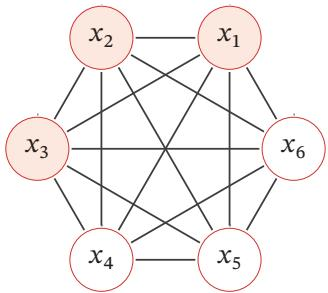
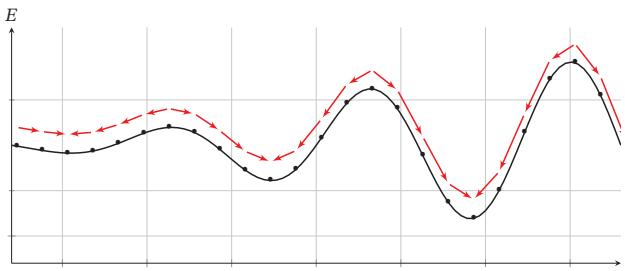
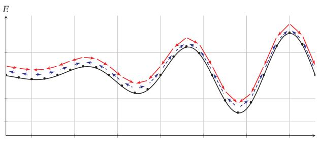
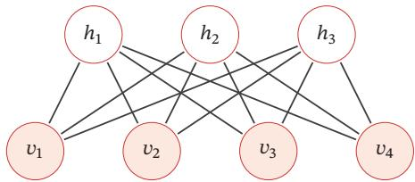
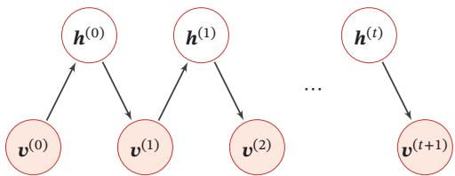
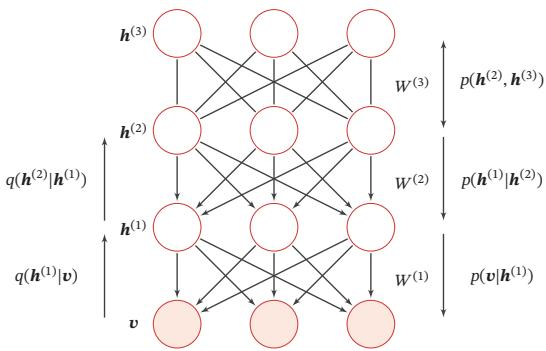
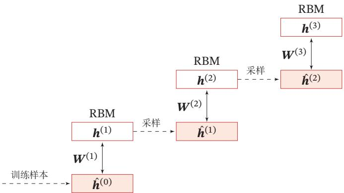
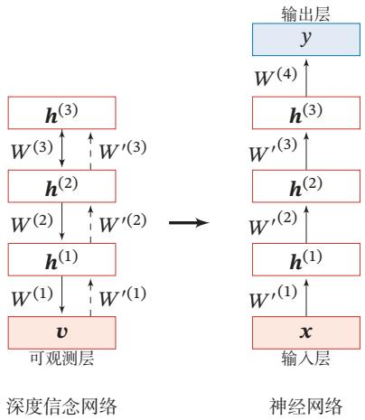

## 第12章 深度信念网络

[¶0001] 计算的目的不在于数据，而在于洞察事物

[¶0002] —理查德·卫斯里·汉明（Richard Wesley Hamming）

[¶0003] 1968年图灵奖获得者

[¶0004] 对于一个复杂的数据分布，我们往往只能观测到有限的局部特征，并且这些特征通常会包含一定的噪声．如果要对这个数据分布进行建模，就需要挖掘出可观测变量之间复杂的依赖关系，以及可观测变量背后隐藏的内部表示

[¶0005] 本章介绍一种可以有效学习变量之间复杂依赖关系的概率图模型（深度信念网络）以及两种相关的基础模型（玻尔兹曼机和受限玻尔兹曼机）．深度信念网络中包含很多层的隐变量，可以有效地学习数据的内部特征表示，也可以作为一种有效的非线性降维方法．这些学习到的内部特征表示包含了数据的更高级的、有价值的信息，因此十分有助于后续的分类和回归等任务

[¶0006] 玻尔兹曼机和深度信念网络都是生成模型，借助隐变量来描述复杂的数据分布．作为概率图模型，玻尔兹曼机和深度信念网络的共同问题是推断和学习问题．因为这两种模型都比较复杂，并且都包含隐变量，它们的推断和学习一般通过MCMC方法来进行近似估计．这两种模型和神经网络有很强的对应关系，在一定程度上也称为随机神经网络（Stochastic Neural Network，SNN）

## 12.1 玻尔兹曼机

[¶0007] 玻尔兹曼机（Boltzmann Machine）是一个随机动力系统（Stochastic Dy-namical System），每个变量的状态都以一定的概率受到其他变量的影响．玻尔兹曼机可以用概率无向图模型来描述．一个具有??个节点（变量）的玻尔兹曼机满足以下三个性质：

[¶0008] （1） 每个随机变量是二值的，所有随机变量可以用一个二值的随机向量

[¶0009] 动力系统（DynamicalSystem）是数学上的一个概念，用来描述一个空间中所有点随时间的变化情况，比如钟摆晃动、水的流动等

[¶0010] $X \in \{ 0 , 1 \} ^ { K }$ 来表示，其中可观测变量表示为??，隐变量表示为??

[¶0011] （2） 所有节点之间是全连接的．每个变量 $X _ { i }$ 都依赖于所有其他变量 $X _ { \backslash i }$

[¶0012] （3） 每两个变量之间的互相影响 $( X _ { i } \to X _ { j }$ 和 $X _ { j }  X _ { i } \ )$ 是对称的

[¶0013] 图12.1给出了一个包含3个可观测变量和3个隐变量的玻尔兹曼机

[¶0014]
  
图12.1 一个有六个变量的玻尔兹曼机

[¶0015] 随机向量??的联合概率由玻尔兹曼分布得到，即

[¶0016]
$$
p ( { \pmb x } ) = \frac { 1 } { Z } \exp \bigg ( \frac { - E ( { \pmb x } ) } { T } \bigg ) ,\tag{12.1}
$$

[¶0017] 其中??为配分函数，??表示温度，能量函数??(??)的定义为

[¶0018]
$$
\begin{array} { l } {displaystyle { E ( { \pmb x } ) \triangleq E ( { \pmb X } = { \pmb x } ) } } \\ { \displaystyle = - \left( \sum _ { i < j } w _ { i j } x _ { i } x _ { j } + \sum _ { i } b _ { i } x _ { i } \right) , } \end{array}\tag{12.2}
$$

[¶0019] 其中 $w _ { i j }$ 是两个变量 $x _ { i }$ 和 $x _ { j }$ 之间的连接权重， $x _ { i } \in \{ 0 , 1 \}$ 表示状态， $b _ { i }$ 是变量 $x _ { i }$ 的偏置

[¶0020] 这也是玻尔兹曼机名称的由来．为简单起见，这里我们把玻尔兹曼常数??吸收到温度?? 中．玻尔兹曼分布取自其提出者、奥地利物理学家路德维希·玻尔兹曼（Ludwig Boltz-mann，1844～1906），他在1868年研究热平衡气体的统计力学时首次提出了这一分布

[¶0021] 如果两个变量 $X _ { i }$ 和 $X _ { j }$ 的取值都为1时，一个正的权重 $w _ { i j } > 0$ 会使得玻尔兹曼机的能量下降，发生的概率变大；相反，一个负的权重会使得玻尔兹曼机的能量上升，发生的概率变小．因此，如果令玻尔兹曼机中的每个变量 $X _ { i }$ 代表一个基本假设，其取值为1或0分别表示模型接受或拒绝该假设，那么变量之间连接的权重代表了两个假设之间的弱约束关系[Ackley et al., 1985]．连接权重为可正可负的实数．一个正的连接权重表示两个假设可以互相支持．也就是说，如果一个假设被接受，另一个也很可能被接受．相反，一个负的连接权重表示两个假设不能同时被接受

[¶0022] 玻尔兹曼机可以用来解决两类问题．一类是搜索问题：当给定变量之间的连接权重时，需要找到一组二值向量，使得整个网络的能量最低．另一类是学习问题：当给定变量的多组观测值时，学习网络的最优权重

## 数学小知识 | 玻尔兹曼分布

[¶0023] 在统计力学中，玻尔兹曼分布（Boltzmann Distribution）是描述粒子处于特定状态下的概率，是关于状态能量与系统温度的函数．一个粒子处于状态??的概率 $p _ { \alpha }$ 是关于状态能量与系统温度的函数：

[¶0024]
$$
p _ { \alpha } = \frac { 1 } { Z } \exp \left( \frac { - E _ { \alpha } } { k T } \right) ,\tag{12.3}
$$

[¶0025] 其中 $E _ { \alpha }$ 为状态??的能量，??为玻尔兹曼常量，??为系统温度， $\mathrm { e x p } ( \frac { - E _ { \alpha } } { k T } )$ 称为玻尔兹曼因子（Boltzmann Factor），是没有归一化的概率．??为归一化因子，通常称为配分函数（Partition Function），是对系统所有状态进行总和， $Z = \sum _ { \alpha } \exp \left( { \frac { - E _ { \alpha } } { k T } } \right)$

[¶0026]

[¶0027] 玻尔兹曼分布的一个性质是两个状态的概率比仅仅依赖于两个状态能量的差值，即

[¶0028]
$$
\frac { p _ { \alpha } } { p _ { \beta } } = \exp \left( \frac { E _ { \beta } - E _ { \alpha } } { k T } \right) .\tag{12.4}
$$

## 12.1.1 生成模型

[¶0029] 在玻尔兹曼机中，配分函数??通常难以计算，因此，联合概率分布 $p ( { \pmb x } )$ 一般通过MCMC方法来近似，生成一组服从 $p ( { \pmb x } )$ 分布的样本．本节介绍基于吉布斯采样的样本生成方法

[¶0030] 吉 布 斯 采 样 参 见第11.5.4.3节

[¶0031] 全条件概率 吉布斯采样需要计算每个变量 $X _ { i }$ 的全条件概率 $p ( \boldsymbol { x } _ { i } | \boldsymbol { x } _ { \setminus i } )$ ，其中 $\boldsymbol { x } _ { \mathrm { \backslash } i }$ 表示除变量 $X _ { i }$ 外其他变量的取值

[¶0032] 定理 12.1–玻尔兹曼机中变量的全条件概率：对于玻尔兹曼机中的一个变量 $X _ { i }$ ，当给定其他变量 $\boldsymbol { x } _ { \ u { \setminus i } }$ 时，全条件概率 $p ( \boldsymbol { x } _ { i } | \boldsymbol { x } _ { \setminus i } )$ 为

[¶0033]
$$
p ( x _ { i } = 1 | \mathbf { x } _ { \setminus i } ) = \sigma \left( \frac { \sum _ { j } w _ { i j } x _ { j } + b _ { i } } { T } \right) ,\tag{12.5}
$$

[¶0034]
$$
p ( \boldsymbol { x } _ { i } = 0 | \boldsymbol { x } _ { \setminus i } ) = 1 - p ( \boldsymbol { x } _ { i } = 1 | \boldsymbol { x } _ { \setminus i } ) ,\tag{12.6}
$$

[¶0035] 其中 $\sigma ( \cdot )$ 为 Logistic 函数

[¶0036] 证明. 首先，保持其他变量 $\boldsymbol { x } _ { \mathrm { \backslash } i }$ 不变，改变变量 $X _ { i }$ 的状态，从0（关闭）和1（打开）之间的能量差异（Energy Gap）为

[¶0037]
$$
\Delta E _ { i } ( \pmb { x } _ { \backslash i } ) = E ( \pmb { x } _ { i } = 0 , \pmb { x } _ { \backslash i } ) - E ( \pmb { x } _ { i } = 1 , \pmb { x } _ { \backslash i } )\tag{12.7}
$$

[¶0038] https://nndl.github.io/

[¶0039]
$$
= \sum _ { j } w _ { i j } x _ { j } + b _ { i } ,\tag{12.8}
$$

[¶0040] 其中 $w _ { i i } = 0 , \forall i$

[¶0041] 又根据玻尔兹曼机的定义可得

[¶0042]
$$
E ( { \pmb x } ) = - T \log p ( { \pmb x } ) - T \log Z .\tag{12.9}
$$

[¶0043] 因此有

[¶0044]
$$
\Delta E _ { i } ( \pmb { x } _ { \backslash i } ) = - T \log p ( x _ { i } = 0 , \pmb { x } _ { \backslash i } ) - ( - T \log p ( x _ { i } = 1 , \pmb { x } _ { \backslash i } ) )\tag{12.10}
$$

[¶0045]
$$
= T \log \frac { p ( x _ { i } = 1 , \pmb { x } _ { \setminus i } ) } { p ( x _ { i } = 0 , \pmb { x } _ { \setminus i } ) }\tag{12.11}
$$

[¶0046]
$$
= T \log { \frac { p ( x _ { i } = 1 , | \pmb { x } _ { \setminus i } ) } { 1 - p ( x _ { i } = 1 | \pmb { x } _ { \setminus i } ) } } .\tag{12.12}
$$

[¶0047] 结合公式 (12.8) 和公式 (12.12)，得到

[¶0048]
$$
\begin{array} { r } { p ( x _ { i } = 1 | \pmb { x } _ { \setminus i } ) = \cfrac { 1 } { 1 + \exp \left( - \cfrac { \Delta E _ { i } ( \pmb { x } _ { \setminus i } ) } { T } \right) } } \\ { = \sigma \left( \cfrac { \sum _ { j } w _ { i j } x _ { j } + b _ { i } } { T } \right) . } \end{array}\tag{12.13}
$$

[¶0049] (12.14)

[¶0050] 吉布斯采样 玻尔兹曼机的吉布斯采样过程为：随机选择一个变量 $X _ { i }$ ，然后根据其全条件概率 $p ( \boldsymbol { x } _ { i } | \boldsymbol { x } _ { \setminus i } )$ 来设置其状态，即以 $p ( \boldsymbol { x } _ { i } = 1 | \boldsymbol { x } _ { \setminus i } )$ 的概率将变量 $X _ { i }$ 设为1，否则为0．在固定温度??的情况下，在运行足够时间之后，玻尔兹曼机会达到热平衡．此时，任何全局状态的概率服从玻尔兹曼分布 $p ( { \pmb x } )$ ，只与系统的能量有关，与初始状态无关

[¶0051] 要使得玻尔兹曼机达到热平衡，其收敛速度和温度??相关．当系统温度非常高 $T \to \infty$ 时， $p ( x _ { i } = 1 | \pmb { x } _ { \setminus i } )  0 . 5$ ，即每个变量状态的改变十分容易，每一种系统状态都是一样的，从而很快可以达到热平衡．当系统温度非常低 $T \to 0$ 时，如果 $\Delta E _ { i } ( { \pmb x } _ { \backslash i } ) > 0$ ，则 $p ( \boldsymbol { x } _ { i } = 1 | \boldsymbol { x } _ { \setminus i } )  1$ ；如果 $\Delta E _ { i } ( { \pmb x } _ { \backslash i } ) < 0$ ，则 $p ( x _ { i } = 1 | \pmb { x } _ { \setminus i } )  0$ 即有

[¶0052] 当玻尔兹曼机达到热平衡时，并不意味其能量最低．热平衡依然是在所有状态上的一个分布

[¶0053]
$$
x _ { i } = \left\{ \begin{array} { l l } { 1 } & { \mathrm { i f } \sum _ { j } w _ { i j } x _ { j } + b _ { i } \ge 0 , } \\ { 0 } & { \mathrm { o t h e r w i s e , } } \end{array} \right.\tag{12.15}
$$

[¶0054] 因此，当 $T \to 0$ 时，随机性方法变成了确定性方法．这时，玻尔兹曼机退化为一个Hopfield 网络

[¶0055] Hopfield 网 络 参 见第8.6.1节

[¶0056] Hopfield网络是一种确定性的动力系统，而玻尔兹曼机是一种随机性的动力系统．Hopfield网络的每次状态更新都会使得系统的能量降低，而玻尔兹曼机则以一定的概率使得系统的能量上升．图12.2给出了Hopfield网络和玻尔兹曼机在运行时系统能量变化的对比

[¶0057]
  
(a) Hopfield 网络

[¶0058]
  
(b)玻尔兹曼机  
图12.2 Hopfield网络和玻尔兹曼机在运行时系统能量变化的对比

## 12.1.2 能量最小化与模拟退火

[¶0059] 在一个动力系统中，找到一个状态使得系统能量最小是一个十分重要的优化问题．如果这个动力系统是确定性的，比如Hopfield网络，一个简单（但是低效）的能量最小化方法是随机选择一个变量，在其他变量保持不变的情况下，将这个变量设为会导致整个网络能量更低的状态．当每个变量 $X _ { i }$ 取值为 {0, 1} 时，如果能量差异 $\Delta E _ { i } ( { \pmb x } _ { \backslash i } )$ 大于0，就设 $X _ { i } = 1$ ，否则就设 $X _ { i } = 0$

[¶0060] 这种简单、确定性的方法在运行一定时间之后总是可以收敛到一个解．但是这个解是局部最优的，不是全局最优的．为了跳出局部最优，就必须允许“偶尔”可以将一个变量设置为使得能量变高的状态．这样，我们就需要引入一定的随机性，我们以 $\sigma \left( \frac { \Delta E _ { i } ( { \pmb x } _ { \backslash i } ) } { T } \right)$ 的概率将变量 $X _ { i }$ 设为1，否则设为0．这个过程和玻尔兹曼机的吉布斯采样过程十分类似

[¶0061] 要使得动力系统达到热平衡，温度??的选择十分关键．一个比较好的折中方

[¶0062] 特别地，离散状态的能量最小化是一个组合优化问题

[¶0063] 局 部 最 优 在Hopfield网络中不是一个缺点相反，Hopfield网络是通过利用局部最优点来存储信息

[¶0064] 法是让系统刚开始在一个比较高的温度下运行达到热平衡，然后逐渐降低，直到系统在一个比较低的温度下运行达到热平衡．这样我们就能够得到一个能量全局最小的分布．这个过程被称为模拟退火（Simulated Annealing）[Kirkpatricket al., 1983]

[¶0065] 模拟退火是一种寻找全局最优的近似方法，其名字来自冶金学的专有名词“退火”，即将材料加热后再以一定的速度退火冷却，可以减少晶格中的缺陷．固体中的内部粒子会停留在使内能有局部最小值的位置，加热时能量变大，粒子会变得无序并随机移动．退火冷却时速度较慢，使得粒子在每个温度都达到平衡态．最后在常温时，粒子以很大的概率达到内能比原先更低的位置．可以证明，模拟退火算法所得解依概率收敛到全局最优解

## 12.1.3 参数学习

[¶0066] 不失一般性，假设一个玻尔兹曼机有??个变量，包括 $K _ { v }$ 个可观测变量 ${ \pmb v } \in$ $\{ 0 , 1 \} ^ { K _ { v } }$ 和 $K _ { h }$ 个隐变量 $\pmb { h } \in \{ 0 , 1 \} ^ { K _ { h } }$

[¶0067] 给定一组可观测的向量 $\mathcal { D } = \{ \hat { v } ^ { ( 1 ) } , \hat { v } ^ { ( 2 ) } , \cdots , \hat { v } ^ { ( N ) } \}$ 作为训练集，我们要学习玻尔兹曼机的参数?? 和??使得训练集中所有样本的对数似然函数最大．训练集的对数似然函数定义为

[¶0068]
$$
\mathcal { L } ( \mathcal { D } ; W , b ) = \frac { 1 } { N } \sum _ { n = 1 } ^ { N } \log p ( \hat { v } ^ { ( n ) } ; W , b )\tag{12.16}
$$

[¶0069]
$$
= \frac { 1 } { N } \sum _ { n = 1 } ^ { N } \log \sum _ { h } p ( \hat { \pmb { v } } ^ { ( n ) } , \pmb { h } ; W , \pmb { b } )\tag{12.17}
$$

[¶0070]
$$
= \frac { 1 } { N } \sum _ { n = 1 } ^ { N } \log \frac { \sum _ { h } \exp \Big ( - E ( \hat { v } ^ { ( n ) } , h ) \Big ) } { \sum _ { v , h } \exp \Big ( - E ( v , h ) \Big ) } .\tag{12.18}
$$

[¶0071] 对数似然函数 $\mathcal { L } ( \mathcal { D } ; W , b )$ 对参数??的偏导数为

[¶0072] ??为?? 或??

[¶0073]
$$
\begin{array} { l } { \displaystyle \frac { \mathcal { L } ( \mathcal { D } ; W , b ) } { \partial \theta } = \frac { 1 } { N } \sum _ { n = 1 } ^ { N } \frac { \partial } { \partial \widetilde { \theta } } \log \sum _ { h } p ( \widetilde { \mathbf { v } } ^ { ( n ) } , h ; W , b ) } \\ { = \displaystyle \frac { 1 } { N } \sum _ { n = 1 } ^ { N } \frac { \partial } { \partial \widetilde { \theta } } \Big ( \log \sum _ { h } \exp \big ( - E ( \widetilde { \mathbf { v } } ^ { ( n ) } , h ) \big ) - \log \sum _ { \mathbf { v } , h } \big ( - E ( \mathbf { v } , h ) \big ) \Big ) } \\ { = \displaystyle \frac { 1 } { N } \sum _ { n = 1 } ^ { N } \sum _ { h } \frac { \exp \big ( - E ( \widetilde { \mathbf { v } } ^ { ( n ) } , h ) \big ) } { \sum _ { h } \exp \big ( - E ( \widetilde { \mathbf { v } } ^ { ( n ) } , h ) \big ) } \big [ - \frac { \partial E ( \widetilde { \mathbf { v } } ^ { ( n ) } , h ) } { \partial \widetilde { \theta } } \big ] } \\ { \displaystyle \qquad - \sum _ { \mathbf { v } , h } \frac { \exp \big ( - E ( \mathbf { v } , h ) \big ) } { \sum _ { x , h } \exp \big ( - E ( \mathbf { v } , h ) \big ) } \Big [ - \frac { \partial E ( \mathbf { v } , h ) } { \partial \widetilde { \theta } } \Big ] } \end{array}\tag{12.19}
$$

[¶0074] (12.20)

[¶0075] (12.21)

[¶0076]
$$
= \frac { 1 } { N } \sum _ { n = 1 } ^ { N } \sum _ { h } p ( h | \hat { v } ^ { ( n ) } ) \Big [ - \frac { \partial E ( \hat { v } ^ { ( n ) } , h ) } { \partial \theta } \Big ] - \sum _ { v , h } p ( v , h ) \Big [ - \frac { \partial E ( v , h ) } { \partial \theta } \Big ]\tag{12.22}
$$

[¶0077]
$$
= \mathbb { E } _ { \hat { p } ( v ) } \mathbb { E } _ { p ( h | v ) } \Big [ - \frac { \hat { \sigma } E ( v , h ) } { \hat { \sigma } \theta } \Big ] - \mathbb { E } _ { p ( v , h ) } \Big [ - \frac { \hat { \sigma } E ( v , h ) } { \hat { \sigma } \theta } \Big ] ,\tag{12.23}
$$

[¶0078] 其中 $\hat { p } ( \pmb { v } )$ 表示可观测向量在训练集上的实际经验分布， $p ( \pmb { h } | \pmb { v } )$ 和 $p ( \pmb { v } , \pmb { h } )$ 为在当前参数??, ??条件下玻尔兹曼机的条件概率和联合概率

[¶0079] 根据公式(12.2)， $\begin{array} { r } { E ( { \pmb v } , { \pmb h } ) = E ( { \pmb x } ) = - \left( \sum _ { i < j } w _ { i j } x _ { i } x _ { j } + \sum _ { i } b _ { i } x _ { i } \right) } \end{array}$ ．因此，整个训练集的对数似然函数 $\mathcal { L } ( \mathcal { D } ; W , b )$ 对每个权重 $w _ { i j }$ 和偏置 $b _ { i }$ 的偏导数为

[¶0080]
$$
\frac { \partial \mathcal { L } ( \mathcal { D } ; W , b ) } { \partial w _ { i j } } = \mathbb { E } _ { \hat { p } ( v ) } \mathbb { E } _ { p ( h \mid v ) } [ x _ { i } x _ { j } ] - \mathbb { E } _ { p ( v , h ) } [ x _ { i } x _ { j } ] ,\tag{12.24}
$$

[¶0081]
$$
\frac { \partial \mathcal { L } ( \mathcal { D } ; W , b ) } { \partial b _ { i } } = \mathbb { E } _ { \hat { p } ( v ) } \mathbb { E } _ { p ( h \mid v ) } [ x _ { i } ] - \mathbb { E } _ { p ( v , h ) } [ x _ { i } ] ,\tag{12.25}
$$

[¶0082] 其中 $i , j \in [ 1 , K ]$ ．这两个公式涉及计算配分函数和期望，很难精确计算．对于一个??维的二值随机向量??，其取值空间大小为 $2 ^ { K }$ ．当??比较大时，配分函数以及期望的计算会十分耗时．因此，玻尔兹曼机一般通过MCMC方法（如吉布斯采样）来进行近似求解

[¶0083] 以参数 $w _ { i j }$ 的梯度为例，公式(12.24)中第一项是在限定可观测变量 $\pmb { v }$ 为训练样本的条件下 $x _ { i } x _ { j }$ 的期望．为了近似这个期望，我们可以固定住可观测变量??，只对??进行吉布斯采样．当玻尔兹曼机达到热平衡状态时，采样 $x _ { i } x _ { j }$ 的值．在训练集上所有的训练样本上重复此过程，得到?? ?? 的近似期望 $x _ { i } x _ { j }$ $\langle x _ { i } x _ { j } \rangle _ { \mathrm { d a t a } }$ ．公式(12.25)中的第二项为玻尔兹曼机在没有任何限制条件下 $x _ { i } x _ { j }$ 的期望．这时可以对所有变量进行吉布斯采样．当玻尔兹曼机达到热平衡状态时，采样 $x _ { i } x _ { j }$ 的值，得到近似期望 $\langle x _ { i } x _ { j } \rangle _ { \mathrm { { m o d e l } } }$

[¶0084] 这样当采用梯度上升法时，权重 $w _ { i j }$ 可以用下面公式近似地更新：

[¶0085]
$$
w _ { i j }  w _ { i j } + \alpha \big ( \langle x _ { i } x _ { j } \rangle _ { \mathrm { d a t a } } - \langle x _ { i } x _ { j } \rangle _ { \mathrm { m o d e l } } \big ) ,\tag{12.26}
$$

[¶0086] 其中 $\alpha > 0$ 为学习率．这个更新方法的一个特点是仅仅使用了局部信息．也就是说，虽然我们优化目标是整个网络的能量最低，但是每个权重的更新只依赖于它连接的相关变量的状态．这种学习方式和人脑神经网络的学习方式，赫布规则（Hebbian Rule，或 Hebb’s Rule），十分类似

[¶0087] 玻尔兹曼机可以用在监督学习和无监督学习中．在监督学习中，可观测的变量??又进一步可以分为输入和输出变量，隐变量则隐式地描述了输入和输出变量之间复杂的约束关系．在无监督学习中，隐变量可以看作可观测变量的内部特征表示．玻尔兹曼机也可以看作一种随机型的神经网络，是Hopfield神经网络的扩展，并且可以生成相应的 Hopfield 神经网络．在没有时间限制时，玻尔兹曼机还可以用来解决复杂的组合优化问题

## 12.2 受限玻尔兹曼机

[¶0088] 全连接的玻尔兹曼机在理论上十分有趣，但是由于其复杂性，目前为止并没有被广泛使用．虽然基于采样的方法在很大程度提高了学习效率，但是每更新一次权重，就需要网络重新达到热平衡状态，这个过程依然比较低效，需要很长时间．在实际应用中，使用比较广泛的是一种带限制的版本，也就是受限玻尔兹曼机．

[¶0089] 受限玻尔兹曼机（Restricted Boltzmann Machine，RBM）是一个二分图结构的无向图模型，如图12.3所示．受限玻尔兹曼机中的变量也分为隐变量和可观测变量．我们分别用可观测层和隐藏层来表示这两组变量．同一层中的节点之间没有连接，而不同层一个层中的节点与另一层中的所有节点连接，这和两层的全连接神经网络的结构相同

[¶0090] 受限玻尔兹曼机因其结构最初称为簧风琴模型，2000年后受限玻兹曼机的名称才变得流行．

[¶0091]
  
图12.3 一个有7个变量的受限玻尔兹曼机

[¶0092] 一个受限玻尔兹曼机由 $K _ { v }$ 个可观测变量和 $K _ { h }$ 个隐变量组成，其定义如下：

[¶0093] （1） 可观测的随机向量 $\pmb { v } \in \mathbb { R } ^ { K _ { v } }$

[¶0094] （2） 隐藏的随机向量 $\pmb { h } \in \mathbb { R } ^ { K _ { h } }$

[¶0095] （3） 权重矩阵 $W \in$ ℝ $K _ { v } { \times } K _ { h }$ ，其中每个元素 $w _ { i j }$ 为可观测变量 $v _ { i }$ 和隐变量$h _ { j }$ 之间边的权重

[¶0096] （4） 偏置 $\pmb { a } \in \mathbb { R } ^ { K _ { v } }$ 和 $\pmb { b } \in \mathbb { R } ^ { K _ { h } }$ ，其中 $a _ { i }$ 为每个可观测的变量 $v _ { i }$ 的偏置， $b _ { j }$ 为每个隐变量 $h _ { j }$ 的偏置

[¶0097] 受限玻尔兹曼机的能量函数定义为

[¶0098]
$$
\begin{array} { l } { { \displaystyle E ( { \pmb v } , { \pmb h } ) = - \sum _ { i } a _ { i } v _ { i } - \sum _ { j } b _ { j } h _ { j } - \sum _ { i } \sum _ { j } v _ { i } w _ { i j } h _ { j } } } \\ { ~ } \\ { { \displaystyle ~ = - { \pmb a } ^ { \top } { \pmb v } - { \pmb b } ^ { \top } { \pmb h } - { \pmb v } ^ { \top } { \pmb W } { \pmb h } } . } \end{array}\tag{12.27}
$$

[¶0099] (12.28)

[¶0100] 受限玻尔兹曼机的联合概率分布 $p ( \pmb { v } , \pmb { h } )$ 定义为

[¶0101]
$$
\begin{array} { l } { { \displaystyle p ( { \pmb v } , { \pmb h } ) = \frac { 1 } { Z } \exp ( - E ( { \pmb v } , { \pmb h } ) ) } \ ~ } \\ { { \displaystyle ~ = \frac { 1 } { Z } \exp ( { \pmb a } ^ { \top } { \pmb v } ) \exp ( { \pmb b } ^ { \top } { \pmb h } ) \exp ( { \pmb v } ^ { \top } { \pmb W } { \pmb h } ) } , } \end{array}\tag{12.29}
$$

[¶0102] (12.30)

[¶0103] 其中 $\begin{array} { r } { Z = \sum _ { v , h } \exp ( - E ( v , h ) ) } \end{array}$ 为配分函数https://nndl.github.io/

## 12.2.1 生成模型

[¶0104] 在给定受限玻尔兹曼机的联合概率分布 $p ( \pmb { h } , \pmb { v } )$ 后，可以通过吉布斯采样方法生成一组服从 $p ( \pmb { h } , \pmb { v } )$ 分布的样本

[¶0105] 吉 布 斯 采 样 参 见第11.5.4.3节

[¶0106] 全条件概率 吉布斯采样需要计算每个变量 $V _ { i }$ 和 $H _ { j }$ 的全条件概率．受限玻尔兹曼机中同层的变量之间没有连接．从无向图的性质可知，在给定可观测变量时，隐变量之间互相条件独立．同样，在给定隐变量时，可观测变量之间也互相条件独立．因此有

[¶0107]
$$
p ( v _ { i } | \pmb { v } _ { \backslash i } , \pmb { h } ) = p ( v _ { i } | \pmb { h } ) ,\tag{12.31}
$$

[¶0108]
$$
\begin{array} { r } { p ( h _ { j } | \pmb { v } , \pmb { h } _ { \setminus j } ) = p ( h _ { j } | \pmb { v } ) , } \end{array}\tag{12.32}
$$

[¶0109] 其中 ${ \pmb v } _ { \backslash i }$ 为除变量 $V _ { i }$ 外其他可观测变量的取值， $\pmb { h } _ { \backslash j }$ 为除变量 $H _ { j }$ 外其他隐变量的取值．因此， $V _ { i }$ 的全条件概率只需要计算 $p ( v _ { i } | { \bf h } )$ ，而 $H _ { j }$ 的全条件概率只需要计算$p ( h _ { j } | \boldsymbol { v } )$

[¶0110] 定理 12.2–受限玻尔兹曼机中变量的条件概率：在受限玻尔兹曼机中，每个可观测变量和隐变量的条件概率为

[¶0111]
$$
p ( v _ { i } = 1 | \pmb { h } ) = \sigma \big ( a _ { i } + \sum _ { j } w _ { i j } h _ { j } \big ) ,\tag{12.33}
$$

[¶0112]
$$
p ( h _ { j } = 1 | \pmb { v } ) = \sigma \big ( b _ { j } + \sum _ { i } w _ { i j } v _ { i } ) \big ) ,\tag{12.34}
$$

[¶0113] 其中 $\sigma$ 为 Logistic 函数

[¶0114] 证明.（1）先计算 $p ( h _ { j } = 1 | \pmb { v } )$ ．可观测层变量??的边际概率为

[¶0115]
$$
P ( v ) = \sum _ { h } P ( v , h ) = \frac { 1 } { Z } \sum _ { h } \exp ( - E ( v , h ) )\tag{12.35}
$$

[¶0116]
$$
= { \frac { 1 } { Z } } \sum _ { h } \exp \left( \pmb { a } ^ { \intercal } \pmb { v } + \sum _ { j } b _ { j } h _ { j } + \sum _ { i } \sum _ { j } v _ { i } w _ { i j } h _ { j } \right)\tag{12.36}
$$

[¶0117]
$$
= { \frac { \exp ( { \pmb a } ^ { \top } { \pmb v } ) } { Z } } \sum _ { h } \exp \left( \sum _ { j } h _ { j } ( b _ { j } + \sum _ { i } w _ { i j } v _ { i } ) \right)\tag{12.37}
$$

[¶0118]
$$
= \frac { \exp ( { \pmb a } ^ { \top } { \pmb v } ) } { Z } \sum _ { h } \prod _ { j } \exp \left( h _ { j } ( b _ { j } + \sum _ { i } w _ { i j } v _ { i } ) \right)\tag{12.38}
$$

[¶0119]
$$
= \frac { \exp ( { \pmb a } ^ { \top } { \pmb v } ) } { Z } \sum _ { h _ { 1 } } \sum _ { h _ { 2 } } \cdots \sum _ { h _ { n } } \prod _ { j } \exp \left( h _ { j } ( b _ { j } + \sum _ { i } w _ { i j } v _ { i } ) \right)\tag{12.39}
$$

[¶0120] 利用分配律

[¶0121] https://nndl.github.io/

[¶0122]
$$
\begin{array} { l } { \displaystyle = \frac { \exp ( a ^ { \top } v ) } { Z } \prod _ { j } { \sum _ { h _ { j } } } \exp \left( h _ { j } ( b _ { j } + \sum _ { i } w _ { i j } v _ { i } ) \right) } \\ { \displaystyle = \frac { \exp ( a ^ { \top } v ) } { Z } \prod _ { j } \left( 1 + \exp ( b _ { j } + \sum _ { i } w _ { i j } v _ { i } ) \right) . } \end{array}\tag{12.40}
$$

[¶0123] 将 $h _ { j }$ 为0或1的取值代入计算

[¶0124] (12.41)

[¶0125] 固定 $h _ { j } = 1$ 时， $p ( h _ { j } = 1 , \pmb { v } )$ 的边际概率为

[¶0126]
$$
\begin{array} { l } { p ( h _ { j } = 1 , \pmb { v } ) = \displaystyle \frac { 1 } { Z } \sum _ { h , h _ { j } = 1 } \exp { ( - E ( \pmb { v } , \pmb { h } ) ) } } \\ { \displaystyle = \frac { \exp ( \pmb { a } ^ { \top } \pmb { v } ) } { Z } \prod _ { k , k \neq j } \left( 1 + \exp ( b _ { k } + \sum _ { i } w _ { i k } v _ { i } ) \right) \exp ( b _ { j } + \sum _ { i } w _ { i j } v _ { i } ) . } \end{array}\tag{12.42}
$$

[¶0127] (12.43)

[¶0128] 由公式(12.41)和公式( 12.43)，可以计算隐变量 $h _ { j }$ 的条件概率为

[¶0129]
$$
\begin{array} { l } { p ( h _ { j } = 1 | \pmb { v } ) = \displaystyle \frac { p ( h _ { i } = 1 , \pmb { v } ) } { p ( \pmb { v } ) } } \\ { = \displaystyle \frac { \exp ( b _ { j } + \sum _ { i } w _ { i j } v _ { i } ) } { 1 + \exp ( b _ { j } + \sum _ { i } w _ { i j } v _ { i } ) } } \\ { = \sigma \Big ( b _ { j } + \sum _ { i } w _ { i j } v _ { i } \Big ) . } \end{array}\tag{12.44}
$$

[¶0130] (12.45)

[¶0131] (12.46)

[¶0132] （2）同理，可观测变量 $v _ { i }$ 的条件概率 $p ( v _ { i } = 1 | h )$ 为

[¶0133]
$$
p ( v _ { i } = 1 | \pmb { h } ) = \sigma \Big ( a _ { i } + \sum _ { j } w _ { i j } h _ { j } \Big ) .\tag{12.47}
$$

[¶0134] 公式(12.46)和公式(12.47)也可以写为向量形式，即

[¶0135]
$$
p ( \pmb { h } = \mathbf { 1 } | \pmb { v } ) = \sigma \left( W ^ { \top } \pmb { v } + \pmb { b } \right) ,\tag{12.48}
$$

[¶0136]
$$
p ( \pmb { v } = 1 | \pmb { h } ) = \sigma \big ( \pmb { W } \pmb { h } + \pmb { a } \big ) .\tag{12.49}
$$

[¶0137] 吉布斯采样 在受限玻尔兹曼机的全条件概率中，可观测变量之间互相条件独立，隐变量之间也互相条件独立．因此，受限玻尔兹曼机可以并行地对所有的可观测变量（或所有的隐变量）同时进行采样，从而可以更快地达到热平衡状态受限玻尔兹曼机的采样过程如下：

[¶0138] （1） 给定或随机初始化一个可观测的向量 $\pmb { v } _ { 0 }$ , 计算隐变量的概率，并从中采样一个隐向量 $\pmb { h } _ { 0 }$

[¶0139] （2） 基于 $\pmb { h } _ { 0 }$ ，计算可观测变量的概率，并从中采样一个可观测的向量 $\pmb { v } _ { 1 }$

[¶0140] （3） 重复??次后，获得 $( v _ { t } , h _ { t } )$

[¶0141] （4） 当 $t  \infty$ 时, $( \pmb { v } _ { t } , \pmb { h } _ { t } )$ 的采样服从 $p ( \pmb { v } , \pmb { h } )$ 分布．

[¶0142] 图12.4也给出了上述过程的示例

[¶0143]
  
图12.4 受限玻尔兹曼机的采样过程

## 12.2.2 参数学习

[¶0144] 和玻尔兹曼机一样，受限玻尔兹曼机通过最大化似然函数来找到最优的参数 $W , \pmb { a } , \pmb { b } .$ ．给定一组训练样本 $\mathcal { D } = \{ \hat { \pmb { v } } ^ { ( 1 ) } , \hat { \pmb { v } } ^ { ( 2 ) } , \cdots , \hat { \pmb { v } } ^ { ( N ) } \}$ ，其对数似然函数为

[¶0145]
$$
\mathcal { L } ( \mathcal { D } ; W , a , b ) = \frac { 1 } { N } \sum _ { n = 1 } ^ { N } \log p ( \hat { \pmb { v } } ^ { ( n ) } ; W , a , b ) .\tag{12.50}
$$

[¶0146] 和玻尔兹曼机类似，在受限玻尔兹曼机中，对数似然函数 $\mathcal { L } ( \mathcal { D } ; W , b )$ 对参数 $w _ { i j } , a _ { i } , b _ { j }$ 的偏导数为

[¶0147] 参见公式(12.23)

[¶0148]
$$
\frac { \partial \mathcal { L } ( \mathcal { D } ; W , a , b ) } { \partial w _ { i j } } = \mathbb { E } _ { \hat { p } ( v ) } \mathbb { E } _ { p ( h | v ) } [ v _ { i } h _ { j } ] - \mathbb { E } _ { p ( v , h ) } [ v _ { i } h _ { j } ] ,\tag{12.51}
$$

[¶0149]
$$
\frac { \partial \mathcal { L } ( \mathcal { D } ; W , a , b ) } { \partial a _ { i } } = \mathbb { E } _ { \hat { p } ( v ) } \mathbb { E } _ { p ( h | v ) } [ v _ { i } ] - \mathbb { E } _ { p ( v , h ) } [ v _ { i } ] ,\tag{12.52}
$$

[¶0150]
$$
\frac { \partial \mathcal { L } ( \mathcal { D } ; W , a , b ) } { \partial b _ { j } } = \mathbb { E } _ { \hat { p } ( v ) } \mathbb { E } _ { p ( h | v ) } [ h _ { j } ] - \mathbb { E } _ { p ( v , h ) } [ h _ { j } ] ,\tag{12.53}
$$

[¶0151] 参见习题12-3

[¶0152] 其中 $\hat { p } ( \pmb { v } )$ 为训练数据集上??的实际分布

[¶0153] 公式(12.51)、公式(12.52)和公式(12.53)中都需要计算配分函数?? 以及两个期望 $\mathbb { E } _ { p ( h | v ) }$ 和 $\mathbb { E } _ { p ( h , v ) }$ ，因此很难计算，一般需要通过MCMC方法来近似计算

[¶0154] 首先，将可观测向量??设为训练样本中的值并固定，然后根据条件概率对隐向量??进行采样，这时受限玻尔兹曼机的值记为 $\langle \cdot \rangle _ { \mathrm { d a t a } }$ ．然后再不固定可观测向量??，通过吉布斯采样来轮流更新??和??．当达到热平衡状态时，采集??和??的值，记为 $\left. \cdot \right. _ { \mathrm { { m o d e 1 } } }$

[¶0155] 采用梯度上升方法时，参数??, ??, ??可以用下面公式近似地更新：

[¶0156]
$$
w _ { i j }  w _ { i j } + \alpha \big ( \langle v _ { i } h _ { j } \rangle _ { \mathrm { d a t a } } - \langle v _ { i } h _ { j } \rangle _ { \mathrm { m o d e l } } \big ) ,\tag{12.54}
$$

[¶0157]
$$
a _ { i }  a _ { i } + \alpha \big ( \langle v _ { i } \rangle _ { \tt d a t a } - \langle v _ { i } \rangle _ { \tt m o d e l } \big ) ,\tag{12.55}
$$

[¶0158]
$$
b _ { j } \gets b _ { j } + \alpha \big ( \langle h _ { j } \rangle _ { \tt d a t a } - \langle h _ { j } \rangle _ { \tt m o d e l } \big ) ,\tag{12.56}
$$

[¶0159] 其中 $\alpha > 0$ 为学习率

[¶0160] 根据受限玻尔兹曼机的条件独立性，可以对可观测变量和隐变量进行分组轮流采样，如图12.4中所示．这样，受限玻尔兹曼机的采样效率会比一般的玻尔兹曼机有很大提高，但一般还是需要通过很多步采样才可以采集到符合真实分布的样本

## 12.2.2.1 对比散度学习算法

[¶0161] 由于受限玻尔兹曼机的特殊结构，因此可以使用一种比吉布斯采样更有效的学习算法，即对比散度（Contrastive Divergence）[Hinton, 2002]．对比散度算法仅需??步吉布斯采样

[¶0162] 为了提高效率，对比散度算法用一个训练样本作为可观测向量的初始值．然后，交替对可观测向量和隐向量进行吉布斯采样，不需要等到收敛，只需要??步就足够了．这就是CD-??算法．通常，?? = 1就可以学得很好．对比散度的流程如算法12.1所示

[¶0163] 算法 12.1 单步对比散度算法  
输入:训练集 $\{ \hat { \pmb { v } } ^ { ( n ) } \} _ { n = 1 } ^ { N }$ ，学习率??  
1 初始化：?? ← 0, ?? ← 0, ?? ← 0 ;  
2 for ?? = 1 ⋯ ?? do  
3 for ?? = 1 ⋯ ?? do  
4 选取一个样本 $\hat { \pmb v } ^ { ( n ) }$ ，用公式 (12.46) 计算 $p ( \pmb { h } = \mathbf { 1 } | \hat { \pmb { v } } ^ { ( n ) } )$ ，并根据这个  
分布采集一个隐向量 $\pmb { h } ;$   
5 计算正向梯度 $\hat { \pmb { v } } ^ { ( n ) } \pmb { h } ^ { \top } ;$ ;  
6 根据??，用公式(12.47)计算??(?? = 1|??)，并根据这个分布采集重构的  
可见变量 $\mathbf { } \mathbf { } v ^ { \prime } ;$   
7 根据 $\mathbf { v ^ { \prime } }$ ，重新计算??(?? = 1|??′)并采样一个 $\pmb { h } ^ { \prime } ;$   
8 计算反向梯度 ${ \mathbf { } } v ^ { \prime } h ^ { \prime ^ { \top } }$ ;  
$/ /$ 更新参数  
9 $\pmb { W }  \pmb { W } + \alpha ( \hat { \pmb { v } } ^ { ( n ) } \pmb { h } ^ { \top } - \pmb { v } ^ { \prime } \pmb { h } ^ { \prime } ^ { \top } )$   
10 ?? ← ?? + ??(??̂ (??) − ??′) ;  
11 ?? ← ?? + ??(?? − ??′) ;  
12 end  
13 end  
输出: ??, ??, ??

## 12.2.3 受限玻尔兹曼机的类型

[¶0164] 在具体的不同任务中，需要处理的数据类型不一定都是二值的，也可能是连续值．为了能够处理这些数据，就需要根据输入或输出的数据类型来设计新的能https://nndl.github.io/

[¶0165] 量函数

[¶0166] 一般来说，常见的受限玻尔兹曼机有以下三种：

[¶0167] （1）“伯努利-伯努利”受限玻尔兹曼机（Bernoulli-Bernoulli RBM, BB-RBM）：上面介绍的可观测变量和隐变量都为二值类型的受限玻尔兹曼机

[¶0168] （2）“高斯-伯努利”受限玻尔兹曼机（Gaussian-Bernoulli RBM, GB-RBM）：可观测变量为高斯分布，隐变量为伯努利分布，其能量函数定义为

[¶0169]
$$
E ( { \pmb v } , { \pmb h } ) = \sum _ { i } \frac { ( v _ { i } - \mu _ { i } ) ^ { 2 } } { 2 \sigma _ { i } ^ { 2 } } - \sum _ { j } b _ { j } h _ { j } - \sum _ { i } \sum _ { j } \frac { v _ { i } } { \sigma _ { i } } w _ { i j } h _ { j } ,\tag{12.57}
$$

[¶0170] 其中每个可观测变量 $v _ { i }$ 服从 $( \mu _ { i } , \sigma _ { i } )$ 的高斯分布

[¶0171] 参见习题12-4

[¶0172] （3）“伯努利-高斯”受限玻尔兹曼机（Bernoulli-Gaussian RBM, BG-RBM）：可观测变量为伯努利分布，隐变量为高斯分布，其能量函数定义为

[¶0173]
$$
E ( v , h ) = - \sum _ { i } a _ { i } v _ { i } + \sum _ { j } \frac { ( h _ { j } - \mu _ { j } ) ^ { 2 } } { 2 \sigma _ { j } ^ { 2 } } - \sum _ { i } \sum _ { j } v _ { i } w _ { i j } \frac { h _ { j } } { \sigma _ { j } } ,\tag{12.58}
$$

[¶0174] 其中每个隐变量 $h _ { j }$ 服从 $( \mu _ { j } , \sigma _ { j } )$ 的高斯分布

## 12.3 深度信念网络

[¶0175] 深度信念网络（Deep Belief Network，DBN）是一种深层的概率有向图模型，其图结构由多层的节点构成．每层节点的内部没有连接，相邻两层的节点之间为全连接．网络的最底层为可观测变量，其他层节点都为隐变量．最顶部的两层间的连接是无向的，其他层之间的连接是有向的．图12.5给出了一个深度信念网络的示例

[¶0176] 和全连接的前馈神经网络结构相同

[¶0177]
  
图12.5 一个有4层结构的深度信念网络

[¶0178] 对一个有??层隐变量的深度信念网络，令 ${ \pmb v } = { \pmb h } ^ { ( 0 ) }$ 表示最底层（第0层）为可观测变量， $\pmb { h } ^ { ( 1 ) } , \cdots , \pmb { h } ^ { ( L ) }$ 表示其余每层的变量．顶部的两层是一个无向图，可以https://nndl.github.io/

[¶0179] 看作一个受限玻尔兹曼机，用来产生 $p ( \pmb { h } ^ { ( L - 1 ) } )$ 的先验分布．除了最顶上两层外，每一层变量 $\mathbf { \delta } _ { \pmb { h } } ( l )$ 依赖于其上面一层 $\pmb { h } ^ { ( l + 1 ) }$ ，即

[¶0180]
$$
p ( { \pmb h } ^ { ( l ) } | { \pmb h } ^ { ( l + 1 ) } , \cdots , { \pmb h } ^ { ( L ) } ) = p ( { \pmb h } ^ { ( l ) } | { \pmb h } ^ { ( l + 1 ) } ) ,\tag{12.59}
$$

[¶0181] 其中 $l = \{ 0 , \cdots , L - 2 \}$

[¶0182] 深度信念网络中所有变量的联合概率可以分解为

[¶0183]
$$
\begin{array} { l } { { \displaystyle p ( { \pmb v } , { \pmb h } ^ { ( 1 ) } , \cdots , { \pmb h } ^ { ( L ) } ) = p ( { \pmb v } | { \pmb h } ^ { ( 1 ) } ) \left( \prod _ { l = 1 } ^ { L - 2 } p ( { \pmb h } ^ { ( l ) } | { \pmb h } ^ { ( l + 1 ) } ) \right) p ( { \pmb h } ^ { ( L - 1 ) } , { \pmb h } ^ { ( L ) } ) } \ ~ } \\ { { \displaystyle ~ = \left( \prod _ { l = 0 } ^ { L - 1 } p ( { \pmb h } ^ { ( l ) } | { \pmb h } ^ { ( l + 1 ) } ) \right) p ( { \pmb h } ^ { ( L - 1 ) } , { \pmb h } ^ { ( L ) } ) } , } \end{array}\tag{12.60}
$$

[¶0184] (12.61)

[¶0185] 其中 $p ( { \pmb h } ^ { ( l ) } | { \pmb h } ^ { ( l + 1 ) } )$ 为Sigmoid型条件概率分布，定义为

[¶0186]
$$
p ( \pmb { h } ^ { ( l ) } | \pmb { h } ^ { ( l + 1 ) } ) = \sigma \big ( \pmb { a } ^ { ( l ) } + \pmb { W } ^ { ( l + 1 ) } \pmb { h } ^ { ( l + 1 ) } \big ) ,\tag{12.62}
$$

[¶0187] 其中 $\sigma ( \cdot )$ 为按位计算的Logistic函数， $\mathbf { \pmb { a } } ^ { ( l ) }$ 为偏置参数， $\mathbf { \Delta } _ { W } ( l { + } 1 )$ 为权重参数．这样，每一个层都可以看作一个Sigmoid信念网络

[¶0188] Sigmoid信念网络参见第11.1.2.1节

## 12.3.1 生成模型

[¶0189] 深度信念网络是一个生成模型，可以用来生成符合特定分布的样本．隐变量用来描述在可观测变量之间的高阶相关性．假如训练数据服从分布 $p ( \pmb { v } )$ ，通过训练得到一个深度信念网络

[¶0190] 在生成样本时，首先运行最顶层的受限玻尔兹曼机进行足够多次的吉布斯采样，在达到热平衡时生成样本 $\pmb { h } ^ { ( L - 1 ) }$ ，然后依次计算下一层变量的条件分布并采样．因为在给定上一层变量取值时，下一层的变量是条件独立的，所以可以独立采样．这样，我们可以从第?? − 1层开始，自顶向下进行逐层采样，最终得到可观测层的样本

## 12.3.2 参数学习

[¶0191] 深度信念网络最直接的训练方式是最大化可观测变量的边际分布 $p ( \pmb { v } )$ 在训练集合上的似然．但在深度信念网络中，隐变量??之间的关系十分复杂，由于“贡献度分配问题”，很难直接学习．即使对于简单的单层Sigmoid信念网络

[¶0192]
$$
\begin{array} { r } { p ( \boldsymbol { v } = 1 | \boldsymbol { h } ) = \sigma \left( \boldsymbol { b } + \boldsymbol { w } ^ { \intercal } \boldsymbol { h } \right) , } \end{array}\tag{12.63}
$$

[¶0193] 在已知可观测变量时，其隐变量的联合后验概率 $p ( \pmb { h } | \boldsymbol { v } )$ 不再互相独立，因此很难精确估计所有隐变量的后验概率．早期深度信念网络的后验概率一般通过蒙特卡罗方法或变分方法来近似估计，但是效率比较低，从而导致其参数学习比较困难

[¶0194] 为了有效地训练深度信念网络，我们将每一层的Sigmoid信念网络转换为受限玻尔兹曼机．这样做的好处是隐变量的后验概率是互相独立的，从而可以很容易地进行采样．这样，深度信念网络可以看作由多个受限玻尔兹曼机从下到上进行堆叠，第??层受限玻尔兹曼机的隐层作为第?? + 1层受限玻尔兹曼机的可观测层．进一步地，深度信念网络可以采用逐层训练的方式来快速训练，即从最底层开始，每次只训练一层，直到最后一层[Hinton et al., 2006]

[¶0195] 逐层训练是能够有效训练深度模型的最早的方法

[¶0196] 深度信念网络的训练过程可以分为逐层预训练和精调两个阶段．先通过逐层预训练将模型的参数初始化为较优的值，再通过传统学习方法对参数进行精调．

## 12.3.2.1 逐层预训练

[¶0197] 在逐层预训练阶段，采用逐层训练的方式，将深度信念网络的训练简化为对多个受限玻尔兹曼机的训练．图12.6给出了深度信念网络的逐层预训练过程

[¶0198]
  
图12.6 深度信念网络的逐层预训练过程

[¶0199] 具体的逐层训练过程为自下而上依次训练每一层的受限玻尔兹曼机．假设我们已经训练好了前?? − 1层的受限玻尔兹曼机，那么可以计算隐变量自下而上的条件概率

[¶0200]
$$
p ( \pmb { h } ^ { ( i ) } | \pmb { h } ^ { ( i - 1 ) } ) = \sigma \big ( \pmb { b } ^ { ( i ) } + \pmb { W } ^ { ( i ) } \pmb { h } ^ { ( i - 1 ) } \big ) , \qquad 1 \leq i \leq ( l - 1 )\tag{12.64}
$$

[¶0201] 其中 $\pmb { b } ^ { ( i ) }$ 为第??层受限玻尔兹曼机的偏置， $\mathbf { \Delta } \mathbf { W } ^ { ( i ) }$ 为连接权重．这样，我们可以按照 $\pmb { v } = \pmb { h } ^ { ( 0 ) }  \pmb { h } ^ { ( 1 ) }  \cdots  \pmb { h } ^ { ( l - 1 ) }$ 的顺序生成一组 $\pmb { h } ^ { ( l - 1 ) }$ 的样本，记为

[¶0202] $\hat { \pmb { H } } ^ { ( l - 1 ) } = \{ \hat { \pmb { h } } ^ { ( l , 1 ) } , \cdots , \hat { \pmb { h } } ^ { ( l , M ) } \}$ ．然后，将 $\pmb { h } ^ { ( l - 1 ) }$ 和 $\mathbf { \delta } _ { \pmb { h } } ( l )$ 组成一个受限玻尔兹曼机，用$\hat { H } ^ { ( l - 1 ) }$ 作为训练集充分训练第??层的受限玻尔兹曼机

[¶0203] 算法12.2给出一种深度信念网络的逐层预训练方法．大量的实践表明，逐层预训练可以产生非常好的参数初始值，从而极大地降低了模型的学习难度

[¶0204] 算法 12.2 深度信念网络的逐层预训练方法  
输入: 训练集 $\{ \hat { \pmb { v } } ^ { ( n ) } \} _ { n = 1 } ^ { N }$ ，学习率 $\alpha .$ ，深度信念网络层数??，第??层权重 $\mathbf { \delta } _ { W } ( l )$ ，第??  
层偏置 $\mathbf { \pmb { a } } ^ { ( l ) }$ ，第??层偏置 $\mathbf { \delta } _ { \pmb { b } } ( l )$   
1 for ?? = 1 ⋯ ?? do  
2 初始化： $\pmb { W } ^ { ( l ) }  0 , \pmb { a } ^ { ( l ) }  0 , \pmb { b } ^ { ( l ) }  0 ;$   
3 从训练集中采样 $\hat { \pmb { h } } ^ { ( 0 ) }$ ;  
4 for $i = 1 \cdots l - 1$ do  
5 根据分布 $p ( \pmb { h } ^ { ( i ) } | \hat { \pmb { h } } ^ { ( i - 1 ) } )$ 采样 $\hat { \pmb { h } } ^ { ( i ) }$   
6 end  
7 将 $\hat { \pmb { h } } ^ { ( l - 1 ) }$ 作为训练样本，充分训练第??层受限玻尔兹曼机，得到参数  
$\mathbf { \Delta } W ^ { ( l ) } , \mathbf { \Delta } \mathbf { a } ^ { ( l ) } , \mathbf { \Delta } b ^ { ( l ) }$   
8 end  
输出: $\{ W ^ { ( l ) } , \pmb { a } ^ { ( l ) } , \pmb { b } ^ { ( l ) } \} , 1 \le l \le L$

## 12.3.2.2 精调

[¶0205] 经过预训练之后，再结合具体的任务（监督学习或无监督学习），通过传统的全局学习算法对网络进行精调（Fine-Tuning），使模型收敛到更好的局部最优点．

[¶0206] 作为生成模型的精调 除了顶层的受限玻尔兹曼机，其他层之间的权重可以被分成向下的生成权重（Generative Weight）?? 和向上的认知权重（RecognitionWeight） $\mathbf { \overrightarrow { W } } ^ { \prime }$ ．生成权重用来定义原始的生成模型，而认知权重用来计算反向（上行）的条件概率．认知权重的初始值 $\mathbf { W ^ { \prime } } ^ { ( l ) } = \mathbf { W } ^ { ( l ) } ^ { \top }$

[¶0207] 深度信念网络一般采用 Contrastive Wake-Sleep 算法 [Hinton et al., 2006]进行精调，其算法过程是：

[¶0208] （1） Wake阶段：a）认知过程，通过外界输入（可观测变量）和向上的认知权重，计算每一层变量的上行的条件概率 $p ( \pmb { h } ^ { ( l + 1 ) } | \pmb { h } ^ { ( l ) } )$ 并采样．b）修改下行的生成权重使得每一层变量的下行的条件概率 $p ( { \pmb h } ^ { ( l ) } | { \pmb h } ^ { ( l + 1 ) } )$ 最大．也就是“如果现实跟我想象的不一样，改变我的生成权重使得我想象的东西就是这样的”

[¶0209] （2） Sleep阶段：a）生成过程，运行顶层的受限玻尔兹曼机并在达到热平衡时采样，然后通过向下的生成权重逐层计算每一层变量的下行的条件概率$p ( { \pmb h } ^ { ( l ) } | { \pmb h } ^ { ( l + 1 ) } )$ 并采样．b）修改向上的认知权重使得上一层变量的上行的条件概率 $p ( \pmb { h } ^ { ( l + 1 ) } | \pmb { h } ^ { ( l ) } )$ 最大．也就是“如果梦中的景象不是我脑中的相应概念，改变我的认知权重使得这种景象在我看来就是这个概念”

## （3） 交替进行Wake和Sleep过程，直到收敛

[¶0210] 作为判别模型的精调 深度信念网络的一个应用是作为深度神经网络的预训练模型，提供神经网络的初始权重．这时只需要向上的认知权重，作为判别模型使用．图12.7给出深度信念网络作为神经网络预训练模型的示例

[¶0211]
  
图12.7 深度信念网络作为神经网络的预训练模型

[¶0212] 具体的精调过程为：在深度信念网络的最顶层再增加一层输出层，然后使用反向传播算法对这些权重进行调优．特别是在训练数据比较少时，预训练的作用非常大．因为不恰当的初始化权重会显著影响最终模型的性能，而预训练获得的权重在权值空间中比随机权重更接近最优的权重，避免了反向传播算法因随机初始化权值参数而容易陷入局部最优和训练时间长的缺点．这不仅提升了模型的性能，也加快了调优阶段的收敛速度 [Larochelle et al., 2007]

## 12.4 总结和深入阅读

[¶0213] 玻尔兹曼机是Hopfield网络的随机化版本，最早由 Geoffrey Hinton等人提出[Hinton et al., 1984]．玻尔兹曼机能够学习数据的内部表示，并且其参数学习的方式和赫布型学习十分类似．没有任何约束的玻尔兹曼机因为过于复杂，难以应用在实际问题上．通过引入一定的约束（即变为二分图），受限玻尔兹曼机在特征抽取、协同过滤、分类等多个任务上得到了广泛的应用．受限玻尔兹曼机最早由 [Smolensky, 1986] 提出，并命名为簧风琴．[Carreira-Perpinan et al., 2005]提出了对比散度算法使得受限玻尔兹曼机的训练非常高效．受限玻尔兹曼机一https://nndl.github.io/

[¶0214] 度变得非常流行，因为其作为深度信念网络的一部分，显著提高了语音识别的精度 [Dahl et al., 2012; Hinton et al., 2012]，并开启了深度学习的浪潮

[¶0215] 深度神经网络的误差反向传播算法存在梯度消失问题，因此在2006年以前，我们还无法有效地训练深度神经网络．[Hinton et al., 2006]提出了深度信念网络，并通过逐层训练和精调可以有效地学习．[Salakhutdinov, 2015]给出了深度信念网络可以逐层训练的理论依据．深度信念网络的一个重要贡献是可以为一个深度神经网络提供较好的初始参数，从而使得训练深度神经网络变得可行．深度信念网络也成为早期深度学习算法的主要框架之一

[¶0216] 典型的深度信念网络的隐变量是二值的，其后验为伯努利分布，[Wellinget al., 2005]提出一个改进，允许隐变量为其他类型，其后验分布为指数族分布．[Lee et al., 2009] 提出了卷积深度信念网络（Convolutional Deep Belief Net-work，CDBN），采用和卷积神经网络类似的结构，以便处理高维的图像特征．通过基于卷积的受限玻尔兹曼机和概率最大汇聚操作，卷积深度信念网络也能够使用类似深度置信网络的训练方法进行训练

[¶0217] 和深度信念网络类似的一种深度概率模型是深度玻尔兹曼机（Deep Boltz-mann Machine，DBM）[Salakhutdinov et al., 2010]．深度玻尔兹曼机是由多层受限玻尔兹曼机堆叠而成，是真正的无向图模型，其联合概率是通过能量函数来定义．和深度信念网络相比，深度玻尔兹曼机的学习和推断要更加困难

[¶0218] 除了深度信念网络之外，自编码器[Bengio et al., 2007]以及它的变体，比如稀疏自编码器 [Ranzato et al., 2006] 和去噪自编码器 [Vincent et al., 2008]，也可以用来作为深度神经网络的参数初始化，并可以得到和深度信念网络类似的效果．随着人们对深度学习认识的加深，出现了很多更加便捷的训练深度神经网络的技术，比如 ReLU激活函数、权重初始化、逐层归一化以及残差连接等，使得我们可以不需要预训练就能够训练一个非常深的神经网络

[¶0219] 尽管深度信念网络作为一种深度学习模型已经很少使用，但其在深度学习发展进程中的贡献十分巨大，并且其理论基础为概率图模型，有非常好的解释性，依然是一种值得深入研究的模型

## 习题

[¶0220] 习题12-1 如果使用Metropolis算法对玻尔兹曼机进行采样，给出其提议分布的具体形式

[¶0221] 习题12-2 在受限玻尔兹曼机中，证明公式(12.47)

[¶0222] 习题 12-3 在受限玻尔兹曼机中，证明公式 (12.51)、公式 (12.52) 和公式 (12.53) 中参数的梯度

[¶0223] 习题12-4 计算“高斯-伯努利”受限玻尔兹曼机和“伯努利-高斯”受限玻尔兹曼机的条件概率 $p ( \pmb { v } = \mathbf { 1 } | \pmb { h } )$ 和 $p ( \pmb { h } = \mathbf { 1 } | \pmb { v } )$

[¶0224] 习题12-5 在受限玻尔兹曼机中，如果可观测变量服从多项分布，隐变量服务伯努利分布，可观测变量 $v _ { i }$ 的条件概率为

[¶0225]
$$
p ( v _ { i } = k | \pmb { h } ) = \frac { \exp { \left( a _ { i } ^ { ( k ) } + \Sigma _ { j } w _ { i j } ^ { ( k ) } h _ { j } \right) } } { \Sigma _ { k ^ { \prime } = 1 } ^ { K } \exp { \left( a _ { i } ^ { ( k ^ { \prime } ) } + \Sigma _ { j } w _ { i j } ^ { ( k ^ { \prime } ) } h _ { j } \right) } } ,\tag{12.65}
$$

[¶0226] 其中 $k \in [ 1 , K ]$ 为可观测变量的取值， ${ \pmb W } ^ { ( k ) }$ 和 $\mathbf { \pmb { a } } ^ { ( k ) }$ 为参数，请给出满足这个条件分布的能量函数

[¶0227] 习题12-6 在深度信念网络中，试分析逐层训练背后的理论依据

[¶0228] 习题12-7 分析深度信念网络和深度玻尔兹曼机之间的异同点

## 参考文献

[¶0229] Ackley D H, Hinton G E, Sejnowski T J, 1985. A learning algorithm for boltzmann machines[J]. Cognitive science, 9(1):147-169.

[¶0230] Bengio Y, Lamblin P, Popovici D, et al., 2007. Greedy layer-wise training of deep networks[C]// Advances in neural information processing systems. 153-160.

[¶0231] Carreira-Perpinan M A, Hinton G E, 2005. On contrastive divergence learning.[C]//Aistats: volume 10. 33-40.

[¶0232] Dahl G E, Yu D, Deng L, et al., 2012. Context-dependent pre-trained deep neural networks for largevocabulary speech recognition[J]. IEEE Transactions on audio, speech, and language processing, 20(1):30-42.

[¶0233] Hinton G E, 2002. Training products of experts by minimizing contrastive divergence[J]. Neural computation, 14(8):1771-1800.

[¶0234] Hinton G E, Sejnowski T J, Ackley D H, 1984. Boltzmann machines: Constraint satisfaction networks that learn[M]. Carnegie-Mellon University, Department of Computer Science Pittsburgh, PA.

[¶0235] Hinton G E, Osindero S, Teh Y W, 2006. A fast learning algorithm for deep belief nets[J]. Neural computation, 18(7):1527-1554.

[¶0236] Hinton G E, Deng L, Yu D, et al., 2012. Deep neural networks for acoustic modeling in speech recognition: The shared views of four research groups[J]. IEEE Signal Processing Magazine, 29 (6):82-97.

[¶0237] Kirkpatrick S, Gelatt C D, Vecchi M P, 1983. Optimization by simulated annealing[J]. science, 220 (4598):671-680.

[¶0238] Larochelle H, Erhan D, Courville A, et al., 2007. An empirical evaluation of deep architectures on problems with many factors of variation[C]//Proceedings of the 24th international conference on Machine learning. 473-480.

[¶0239] https://nndl.github.io/

[¶0240] Lee H, Grosse R, Ranganath R, et al., 2009. Convolutional deep belief networks for scalable unsupervised learning of hierarchical representations[C]//Proceedings of the 26th annual international conference on machine learning. 609-616.

[¶0241] Ranzato M, Poultney C, Chopra S, et al., 2006. Efficient learning of sparse representations with an energy-based model[C]//Proceedings of the 19th International Conference on Neural Information Processing Systems. MIT Press: 1137-1144.

[¶0242] Salakhutdinov R, 2015. Learning deep generative models[J]. Annual Review of Statistics and Its Application, 2:361-385.

[¶0243] Salakhutdinov R, Larochelle H, 2010. Efficient learning of deep boltzmann machines[C]// Proceedings of the thirteenth international conference on artificial intelligence and statistics. 693- 700.

[¶0244] Smolensky P, 1986. Information processing in dynamical systems: Foundations of harmony theory [R]. Dept Of Computer Science, Colorado Univ At Boulder.

[¶0245] Vincent P, Larochelle H, Bengio Y, et al., 2008. Extracting and composing robust features with denoising autoencoders[C]//Proceedings of the International Conference on Machine Learning. 1096-1103.

[¶0246] Welling M, Rosen-Zvi M, Hinton G E, 2005. Exponential family harmoniums with an application to information retrieval[C]//Advances in neural information processing systems. 1481-1488.
