## 第13章 深度生成模型

[¶0001] 我不能创造的东西，我就不了解

[¶0002] 理查德·菲利普斯·费曼（Richard Phillips Feynman）

[¶0003] 1965年诺贝尔物理奖获得者

[¶0004] 概率生成模型（Probabilistic Generative Model），简称生成模型，是概率统计和机器学习领域的一类重要模型，指一系列用于随机生成可观测数据的模型假设在一个连续或离散的高维空间??中，存在一个随机向量?? 服从一个未知的数据分布 $p _ { r } ( { \pmb x } ) , { \pmb x } \in \mathcal { X } .$ ．生成模型是根据一些可观测的样本 ${ \pmb x } ^ { ( 1 ) } , { \pmb x } ^ { ( 2 ) } , \cdots , { \pmb x } ^ { ( N ) }$ 来学习一个参数化的模型 $p _ { \theta } ( { \pmb x } )$ 来近似未知分布 $p _ { r } ( { \pmb x } )$ ，并可以用这个模型来生成一些样本，使得“生成”的样本和“真实”的样本尽可能地相似．生成模型通常包含两个基本功能：概率密度估计和生成样本（即采样）．图13.1以手写体数字图像为例给出了生成模型的两个功能示例，其中左图表示手写体数字图像的真实分布 $p _ { r } ( { \pmb x } )$ 以及从中采样的一些“真实”样本，右图表示估计出了分布 $p _ { \theta } ( { \pmb x } )$ 以及从中采样的“生成”样本

[¶0005]
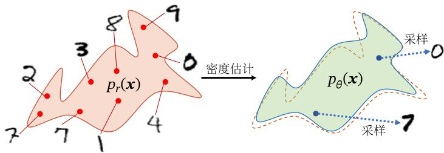  
图13.1 生成模型的两个功能

[¶0006] 生成模型的应用十分广泛，可以用来建模不同的数据，比如图像、文本、声音等．但对于一个高维空间中的复杂分布，密度估计和生成样本通常都不容易实现．一是高维随机向量一般比较难以直接建模，需要通过一些条件独立性来简化模型，二是给定一个已建模的复杂分布，也缺乏有效的采样方法

[¶0007] 深度生成模型就是利用深度神经网络可以近似任意函数的能力来建模一个复杂分布 $p _ { r } ( { \pmb x } )$ 或直接生成符合分布 $p _ { r } ( { \pmb x } )$ 的样本．本章先介绍概率生成模型的基本概念，然后介绍两种深度生成模型：变分自编码器和生成对抗网络

## 13.1 概率生成模型

[¶0008] 生成模型一般具有两个基本功能：密度估计和生成样本

[¶0009] 概率密度估计简称密 度估计，参见第9.2节

## 13.1.1 密度估计

[¶0010] 给定一组数据 $\mathcal { D } = \{ \pmb { x } ^ { ( n ) } \} _ { n = 1 } ^ { N }$ ，假设它们都是独立地从相同的概率密度函数为 $p _ { r } ( { \pmb x } )$ 的未知分布中产生的．密度估计（Density Estimation）是根据数据集??来估计其概率密度函数 $p _ { \theta } ( { \pmb x } )$

[¶0011] 在机器学习中，密度估计是一类无监督学习问题．比如在手写体数字图像的密度估计问题中，我们将图像表示为一个随机向量??，其中每一维都表示一个像素值．假设手写体数字图像都服从一个未知的分布 $p _ { r } ( { \pmb x } )$ ，希望通过一些观测样本来估计其分布．但是，手写体数字图像中不同像素之间存在复杂的依赖关系（比如相邻像素的颜色一般是相似的），很难用一个明确的图模型来描述其依赖关系，所以直接建模 $p _ { r } ( { \pmb x } )$ 比较困难．因此，我们通常通过引入隐变量 $z$ 来简化模型，这样密度估计问题可以转换为估计变量 $( x , z )$ 的两个局部条件概率 $p _ { \theta } ( z )$ 和$p _ { \theta } ( { \pmb x } | { \pmb z } )$ ．一般为了简化模型，假设隐变量 $z$ 的先验分布为标准高斯分布 $\mathcal { N } ( \mathbf { 0 } , \pmb { I } )$ 隐变量 $z$ 的每一维之间都是独立的．在这个假设下，先验分布 $p ( z ; \theta )$ 中没有参数因此，密度估计的重点是估计条件分布 $p ( \pmb { x } | \pmb { z } ; \theta )$

[¶0012] 如果要建模含隐变量的分布（如图13.2a），就需要利用EM算法来进行密度估计．而在EM算法中，需要估计条件分布 $p ( \pmb { x } | \pmb { z } ; \theta )$ 以及近似后验分布 $p ( \boldsymbol { z } | \boldsymbol { x } ; \boldsymbol { \theta } )$ 当这两个分布比较复杂时，我们可以利用神经网络来进行建模，这就是变分自编码器的思想

[¶0013] EM算 法 参 见第11.2.2.1节．

[¶0014]
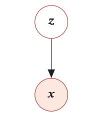  
(a)含隐变量的生成模型

[¶0015]
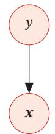  
(b)带标签的生成模型  
图13.2 生成模型

## 13.1.2 生成样本

[¶0016] 生成样本就是给定一个概率密度函数为 $p _ { \theta } ( { \pmb x } )$ 的分布，生成一些服从这个分布的样本，也称为采样．我们在第11.5节中介绍了一些常用的采样方法

[¶0017] 对于图13.2a中的图模型，在得到两个变量的局部条件概率 $p _ { \theta } ( \pmb { z } )$ 和 $p _ { \theta } ( { \pmb x } | { \pmb z } )$ 之后，我们就可以生成数据??，具体过程可以分为两步进行：

[¶0018] （1） 根据隐变量的先验分布 $p _ { \theta } ( \pmb { z } )$ 进行采样，得到样本??

[¶0019] （2） 根据条件分布 $p _ { \theta } ( { \pmb x } | { \pmb z } )$ 进行采样，得到样本??

[¶0020] 为了便于采样，通常 $p _ { \theta } ( { \pmb x } | { \pmb z } )$ 不能太过复杂．因此，另一种生成样本的思想是从一个简单分布 $p ( z ) , z \in \mathcal { Z }$ （比如标准正态分布）中采集一个样本 $z ,$ ，并利用一个深度神经网络 $g : \mathcal { Z }  \mathcal { X }$ 使得 $g ( z )$ 服从 $p _ { r } ( { \pmb x } )$ ．这样，我们就可以避免密度估计问题，并有效降低生成样本的难度，这正是生成对抗网络的思想

## 13.1.3 应用于监督学习

[¶0021] 除了生成样本外，生成模型也可以应用于监督学习．监督学习的目标是建模样本??和输出标签 $y$ 之间的条件概率分布 $p ( y | \pmb { x } )$ ．根据贝叶斯公式，

[¶0022]
$$
p ( y | \pmb { x } ) = \frac { p ( \pmb { x } , y ) } { \sum _ { y } p ( \pmb { x } , y ) } .\tag{13.1}
$$

[¶0023] 我们可以将监督学习问题转换为联合概率分布 $p ( { \pmb x } , { \pmb y } )$ 的密度估计问题

[¶0024] 图13.2b给出了带标签的生成模型的图模型表示，可以用于监督学习．在监督学习中，比较典型的生成模型有朴素贝叶斯分类器、隐马尔可夫模型

[¶0025] 参见第11.1.2节

[¶0026] 判别模型 和生成模型相对应的另一类监督学习模型是判别模型（Discrimina-tive Model）．判别模型直接建模条件概率分布 $p ( y | \pmb { x } )$ ，并不建模其联合概率分布 $p ( { \boldsymbol { \mathbf { \mathit { x } } } } , { \boldsymbol { \mathbf { \mathit { y } } } } )$ ．常见的判别模型有Logistic回归、支持向量机、神经网络等．由生成模型可以得到判别模型，但由判别模型得不到生成模型

## 13.2 变分自编码器

## 13.2.1 含隐变量的生成模型

[¶0027] 假设一个生成模型（如图13.3所示）中包含隐变量，即有部分变量是不可观测的，其中观测变量??是一个高维空间??中的随机向量，隐变量??是一个相对低维的空间??中的随机向量

[¶0028] 本章中，我们假设??和??都是连续随机向量

[¶0029]
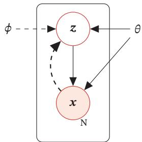

[¶0030] 实线表示生成模型，虚线表示变分近似

[¶0031] 图13.3 变分自编码器

[¶0032] 这个生成模型的联合概率密度函数可以分解为

[¶0033]
$$
p ( \pmb { x } , \pmb { z } ; \theta ) = p ( \pmb { x } | \pmb { z } ; \theta ) p ( \pmb { z } ; \theta ) ,\tag{13.2}
$$

[¶0034] 其中 $p ( z ; \theta )$ 为隐变量 $z$ 先验分布的概率密度函数， $p ( \pmb { x } | \pmb { z } ; \theta )$ 为已知 $z$ 时观测变量$_ x$ 的条件概率密度函数， $\boldsymbol { \theta }$ 表示两个密度函数的参数．一般情况下，我们可以假设 $p ( z ; \theta )$ 和 $p ( \pmb { x } | \pmb { z } ; \theta )$ 为某种参数化的分布族，比如正态分布．这些分布的形式已知，只是参数??未知，可以通过最大化似然来进行估计

[¶0035] 给定一个样本 $_ x$ ，其对数边际似然log $p ( \pmb { x } ; \theta )$ 可以分解为

[¶0036]
$$
\begin{array} { r } { \log p ( { \pmb x } ; \theta ) = E L B O ( q , { \pmb x } ; \theta , \phi ) + \mathrm { K L } ( q ( { \pmb z } ; \phi ) , p ( { \pmb z } | { \pmb x } ; \theta ) ) , } \end{array}\tag{13.3}
$$

[¶0037] 其中 $q ( \boldsymbol { z } ; \boldsymbol { \phi } )$ 是额外引入的变分密度函数，其参数为 $\phi$ ， $E L B O ( q , x ; \theta , \phi )$ 为证据下界，

[¶0038] 参见公式(11.49)

[¶0039]
$$
E L B O ( q , \pmb { x } ; \theta , \phi ) = \mathbb { E } _ { z \sim q ( z ; \phi ) } \bigg [ \log \frac { p ( \pmb { x } , z ; \theta ) } { q ( z ; \phi ) } \bigg ] .\tag{13.4}
$$

[¶0040] 最大化对数边际似然log $p ( \pmb { x } ; \theta )$ 可以用EM算法来求解．在EM算法的每次迭代中，具体可以分为两步：

[¶0041] EM算 法 参 见第11.2.2.1节．

[¶0042] （1） E步：固定??，寻找一个密度函数 $q ( \boldsymbol { z } ; \boldsymbol { \phi } )$ 使其等于或接近于后验密度函数 $p ( \pmb { z } | \pmb { x } ; \theta )$ ；

[¶0043] （2） M步：固定 $q ( \boldsymbol { z } ; \boldsymbol { \phi } )$ ，寻找??来最大化 $E L B O ( q , x ; \theta , \phi )$ 不断重复上述两步骤，直到收敛

[¶0044] 在EM算法的每次迭代中，理论上最优的 $q ( \boldsymbol { z } ; \boldsymbol { \phi } )$ 为隐变量的后验概率密度函数 $p ( \pmb { z } | \pmb { x } ; \theta )$ ，即

[¶0045]
$$
p ( \boldsymbol { z } | \boldsymbol { x } ; \boldsymbol { \theta } ) = \frac { p ( \boldsymbol { x } | \boldsymbol { z } ; \boldsymbol { \theta } ) p ( \boldsymbol { z } ; \boldsymbol { \theta } ) } { \int _ { \boldsymbol { z } } p ( \boldsymbol { x } | \boldsymbol { z } ; \boldsymbol { \theta } ) p ( \boldsymbol { z } ; \boldsymbol { \theta } ) d \boldsymbol { z } } .\tag{13.5}
$$

[¶0046] 后验概率密度函数 $p ( \pmb { z } | \pmb { x } ; \theta )$ 的计算是一个统计推断问题，涉及积分计算．当隐变量 $z$ 是有限的一维离散变量时，计算起来比较容易．但在一般情况下，这个后验概https://nndl.github.io/

[¶0047] 率密度函数是很难计算的，通常需要通过变分推断来近似估计．在变分推断中，为了降低复杂度，通常会选择一些比较简单的分布 $q ( \boldsymbol { z } ; \boldsymbol { \phi } )$ 来近似推断 $p ( \boldsymbol { z } | \boldsymbol { x } ; \boldsymbol { \theta } )$ 当 $p ( \pmb { z } | \pmb { x } ; \theta )$ 比较复杂时，近似效果不佳．此外，概率密度函数 $p ( \pmb { x } | \pmb { z } ; \theta )$ 一般也比较复杂，很难直接用已知的分布族函数进行建模

[¶0048] 变 分 推 断 参 见第11.4节

[¶0049] 变分自编码器（Variational AutoEncoder，VAE）[Kingma et al., 2014]是一种深度生成模型，其思想是利用神经网络来分别建模两个复杂的条件概率密度函数．

[¶0050] （1） 用神经网络来估计变分分布 $q ( \boldsymbol { z } ; \boldsymbol { \phi } )$ ，称为推断网络．理论上 $q ( \boldsymbol { z } ; \boldsymbol { \phi } )$ 可以不依赖 $x .$ ．但由于 $q ( \boldsymbol { z } ; \boldsymbol { \phi } )$ 的目标是近似后验分布 $p ( \boldsymbol { z } | \boldsymbol { x } ; \boldsymbol { \theta } )$ ，其和 $_ x$ 相关，因此变分密度函数一般写为 $q ( \boldsymbol { z } | \boldsymbol { x } ; \boldsymbol { \phi } )$ ．推断网络的输入为 $_ x$ ，输出为变分分布 $q ( \boldsymbol { z } | \boldsymbol { x } ; \boldsymbol { \phi } )$

[¶0051] （2） 用神经网络来估计概率分布 $p ( \pmb { x } | \pmb { z } ; \theta )$ ，称为生成网络．生成网络的输入为??，输出为概率分布 $p ( \pmb { x } | \pmb { z } ; \theta )$

[¶0052] 将推断网络和生成网络合并就得到了变分自编码器的整个网络结构，如图13.4所示，其中实线表示网络计算操作，虚线表示采样操作

[¶0053]
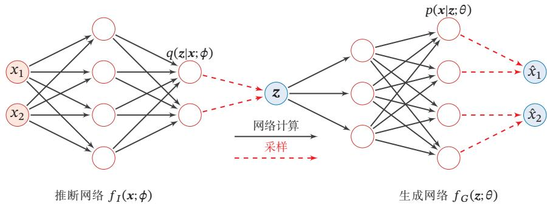  
图13.4 变分自编码器的网络结构

[¶0054] 变分自编码器的名称来自于其整个网络结构和自编码器比较类似．我们可以把推断网络看作“编码器”，将可观测变量映射为隐变量；把生成网络看作“解码器”，将隐变量映射为可观测变量．然而，变分自编码器背后的原理和自编码器完全不同．变分自编码器中的编码器和解码器的输出为分布（或分布的参数），而不是确定的编码

[¶0055] 自 编 码 器 参 见第9.1.3节

## 13.2.2 推断网络

[¶0056] 为简单起见，假设 $q ( \boldsymbol { z } | \boldsymbol { x } ; \boldsymbol { \phi } )$ 是服从对角化协方差的高斯分布，

[¶0057]
$$
q ( \boldsymbol { z } | \boldsymbol { x } ; \phi ) = \mathcal { N } ( \boldsymbol { z } ; \mu _ { I } , \sigma _ { I } ^ { 2 } I ) ,\tag{13.6}
$$

[¶0058] 其中 $\pmb { \mu } _ { I }$ 和 $\sigma _ { I } ^ { 2 }$ 是高斯分布的均值和方差，可以通过推断网络 $f _ { I } ( { \boldsymbol { x } } ; \phi )$ 来预测

[¶0059]
$$
\left[ \begin{array} { l } { \mu _ { I } } \\ { \sigma _ { I } ^ { 2 } } \end{array} \right] = f _ { I } ( \pmb { x } ; \pmb { \phi } ) ,\tag{13.7}
$$

[¶0060] 其中推断网络 $f _ { I } ( { \boldsymbol { x } } ; \phi )$ 可以是一般的全连接网络或卷积网络，比如一个两层的神经网络，

[¶0061]
$$
\pmb { h } = \sigma \big ( \pmb { W } ^ { ( 1 ) } \pmb { x } + \pmb { b } ^ { ( 1 ) } \big ) ,\tag{13.8}
$$

[¶0062]
$$
\pmb { \mu } _ { I } = \pmb { W } ^ { ( 2 ) } \pmb { h } + \pmb { b } ^ { ( 2 ) } ,\tag{13.9}
$$

[¶0063]
$$
\sigma _ { I } ^ { 2 } = \mathrm { s o f t p l u s } \big ( W ^ { ( 3 ) } { \pmb h } + { \pmb b } ^ { ( 3 ) } \big ) ,\tag{13.10}
$$

[¶0064] softplus(??) = log(1 + $\mathrm { e } ^ { x } )$

[¶0065] 其中 $\phi$ 代表所有的网络参数 $\{ W ^ { ( 1 ) } , W ^ { ( 2 ) } , W ^ { ( 3 ) } , { b ^ { ( 1 ) } } , { b ^ { ( 2 ) } } , { b ^ { ( 3 ) } } \}$ ，?? 和 softplus 为激活函数．这里使用softplus激活函数是由于方差总是非负的．在实际实现中，也可以用一个线性层（不需要激活函数）来预测 $\log ( \sigma _ { I } ^ { 2 } )$

[¶0066] 推断网络的目标 推断网络的目标是使得 $q ( \boldsymbol { z } | \boldsymbol { x } ; \boldsymbol { \phi } )$ 尽可能接近真实的后验 $p ( \boldsymbol { z } | \boldsymbol { x } ; \boldsymbol { \theta } )$ 需要找到一组网络参数 $\phi ^ { * }$ 来最小化两个分布的KL散度，即

[¶0067]
$$
\phi ^ { * } = \underset { \phi } { \arg \operatorname* { m i n } } \mathrm { K L } \Big ( q ( \boldsymbol { z } | \boldsymbol { x } ; \phi ) , p ( \boldsymbol { z } | \boldsymbol { x } ; \theta ) \Big ) .\tag{13.11}
$$

[¶0068] 然而，直接计算上面的KL散度是不可能的，因为 $p ( \boldsymbol { z } | \boldsymbol { x } ; \boldsymbol { \theta } )$ 一般无法计算．传统方法是利用采样或者变分法来近似推断．基于采样的方法效率很低且估计也不是很准确，所以一般使用的是变分推断方法，即用简单的分布??去近似复杂的分布$p ( \boldsymbol { z } | \boldsymbol { x } ; \boldsymbol { \theta } )$ ．但是，在深度生成模型中， $p ( \pmb { z } | \pmb { x } ; \theta )$ 通常比较复杂，很难用简单分布去近似．因此，我们需要找到一种间接计算方法

[¶0069] 变 分 推 断 参 见第11.4节

[¶0070] 根据公式(13.3)可知，变分分布 $q ( \boldsymbol { z } | \boldsymbol { x } ; \boldsymbol { \phi } )$ 与真实后验 $p ( \boldsymbol { z } | \boldsymbol { x } ; \boldsymbol { \theta } )$ 的KL散度等于对数边际似然 $\log p ( \pmb { x } ; \theta )$ 与其下界 $E L B O ( q , x ; \theta , \phi )$ 的差，即

[¶0071]
$$
\operatorname { K L } ( q ( \boldsymbol { z } | \boldsymbol { x } ; \phi ) , p ( \boldsymbol { z } | \boldsymbol { x } ; \theta ) ) = \log p ( \boldsymbol { x } ; \theta ) - E L B O ( q , \boldsymbol { x } ; \theta , \phi ) ,\tag{13.12}
$$

[¶0072] 因此，推断网络的目标函数可以转换为

[¶0073] 可以看作EM算法中的E步．

[¶0074]
$$
\phi ^ { * } = \underset { \phi } { \arg \operatorname* { m i n } } \mathrm { { K L } } \left( q ( \boldsymbol { z } | \boldsymbol { x } ; \phi ) , \boldsymbol { p } ( \boldsymbol { z } | \boldsymbol { x } ; \theta ) \right)\tag{13.13}
$$

[¶0075]
$$
\mathbf { \Phi } = \underset { \phi } { \arg \operatorname* { m i n } } \log p ( \mathbf { \boldsymbol { x } } ; \boldsymbol { \theta } ) - E L B O ( q , \mathbf { \boldsymbol { x } } ; \boldsymbol { \theta } , \boldsymbol { \phi } )\tag{13.14}
$$

[¶0076] 第一项与??无关

[¶0077]
$$
\displaystyle = \arg \operatorname* { m a x } _ { \phi } E L B O ( q , \pmb { x } ; \theta , \phi ) ,\tag{13.15}
$$

[¶0078] 即推断网络的目标转换为寻找一组网络参数 $\phi ^ { * }$ 使得证据下界 $E L B O ( q , x ; \theta , \phi )$ 最大，这和变分推断中的转换类似

[¶0079] 参见公式(11.85)

## 13.2.3 生成网络

[¶0080] 生成模型的联合分布 $p ( \pmb { x } , \pmb { z } ; \theta )$ 可以分解为两部分：隐变量 $z$ 的先验分布$p ( z ; \theta )$ 和条件概率分布 $p ( \pmb { x } | \pmb { z } ; \theta )$

[¶0081] 先验分布 $p ( z ; \theta )$ 为简单起见，我们一般假设隐变量 $z$ 的先验分布为各向同性的标准高斯分布 $\mathcal { N } ( z | \mathbf { 0 } , I )$ ．隐变量 $z$ 的每一维之间都是独立的

[¶0082] 条件概率分布 $p ( \boldsymbol { x } | \boldsymbol { z } ; \boldsymbol { \theta } )$ 条件概率分布 $p ( \pmb { x } | \pmb { z } ; \theta )$ 可以通过生成网络来建模．为简单起见，我们同样用参数化的分布族来表示条件概率分布 $p ( \pmb { x } | \pmb { z } ; \theta )$ ，这些分布族的参数可以用生成网络计算得到

[¶0083] 根据变量??的类型不同，可以假设 $p ( \pmb { x } | \pmb { z } ; \theta )$ 服从不同的分布族

[¶0084] （1）如果 ${ \pmb x } \in \{ 0 , 1 \} ^ { D }$ 是??维的二值的向量，可以假设 $p ( \pmb { x } | \pmb { z } ; \theta )$ 服从多变量的伯努利分布，即

[¶0085]
$$
p ( \pmb { x } | \tau ; \theta ) = \prod _ { d = 1 } ^ { D } p ( x _ { d } | \pmb { z } ; \theta )\tag{13.16}
$$

[¶0086]
$$
= \prod _ { d = 1 } ^ { D } \gamma _ { d } ^ { x _ { d } } ( 1 - \gamma _ { d } ) ^ { ( 1 - x _ { d } ) } ,\tag{13.17}
$$

[¶0087] 其中 $\gamma _ { d }$ ≜ $p ( x _ { d } = 1 | \boldsymbol { z } ; \boldsymbol { \theta } )$ 为第??维分布的参数．分布的参数 $\gamma = [ \gamma _ { 1 } , \cdots , \gamma _ { D } ] ^ { \intercal }$ 可以通过生成网络来预测

[¶0088] （2）如果 $\boldsymbol { x } \in \mathbb { R } ^ { D }$ 是??维的连续向量，可以假设 $p ( \pmb { x } | \pmb { z } ; \theta )$ 服从对角化协方差的高斯分布，即

[¶0089]
$$
p ( \pmb { x } | \mathbf { z } ; \theta ) = \mathcal { N } ( \pmb { x } ; \pmb { \mu } _ { G } , \pmb { \sigma } _ { G } ^ { 2 } \pmb { I } ) ,\tag{13.18}
$$

[¶0090] 其中 $\mu _ { G } \in \mathbb { R } ^ { D }$ 和 $\sigma _ { G } \in \mathbb { R } ^ { D }$ 同样可以用生成网络 $f _ { G } ( \boldsymbol { z } ; \boldsymbol { \theta } )$ 来预测

[¶0091] 生成网络的目标 生成网络 $f _ { G } ( \boldsymbol { z } ; \boldsymbol { \theta } )$ 的目标是找到一组网络参数 $\theta ^ { * }$ 来最大化证据下界 $E L B O ( q , x ; \theta , \phi )$ ，即

[¶0092] 可以看作EM算法中的M步

[¶0093]
$$
\theta ^ { * } = \operatorname * { a r g m a x } _ { \theta } E L B O ( q , \pmb { x } ; \theta , \phi ) .\tag{13.19}
$$

## 13.2.4 模型汇总

[¶0094] 结合公式(13.15)和公式(13.19)，推断网络和生成网络的目标都为最大化证据下界 $E L B O ( q , x ; \theta , \phi )$ ．因此，变分自编码器的总目标函数为

[¶0095]
$$
\operatorname* { m a x } _ { \theta , \phi } E L B O ( q , x ; \theta , \phi ) = \operatorname* { m a x } _ { \theta , \phi } \mathbb { E } _ { z \sim q ( z ; \phi ) } \bigg [ \log \frac { p ( x | z ; \theta ) p ( z ; \theta ) } { q ( z ; \phi ) } \bigg ]\tag{13.20}
$$

[¶0096]
$$
= \underset { \theta , \phi } { \operatorname* { m a x } } \mathbb { E } _ { z \sim q ( z | x ; \phi ) } \Big [ \log p ( \boldsymbol { x } | \boldsymbol { z } ; \theta ) \Big ] - \mathrm { K L } \Big ( q ( \boldsymbol { z } | \boldsymbol { x } ; \phi ) , p ( \boldsymbol { z } ; \theta ) \Big ) ,\tag{13.21}
$$

[¶0097] 其中 $p ( z ; \theta )$ 为先验分布，??和 $\phi$ 分别表示生成网络和推断网络的参数

[¶0098] 从EM算法角度来看，变分自编码器优化推断网络和生成网络的过程，可以分别看作EM算法中的E步和M步．但在变分自编码器中，这两步的目标合二为一，都是最大化证据下界．此外，变分自编码器可以看作神经网络和贝叶斯网络的混合体．贝叶斯网络中的所有节点都是随机变量．在变分自编码器中，我们仅仅将隐藏编码对应的节点看成是随机变量，其他节点还是作为普通神经元．这样，编码器变成一个变分推断网络，而解码器变成一个将隐变量映射到观测变量的生成网络

[¶0099] 我们分别来看公式(13.21)中的两项

[¶0100] （1）通常情况下，公式(13.21)中第一项的期望 $\mathbb { E } _ { z \sim q ( z | x ; \phi ) } [ \log p ( { \pmb x } | z ; \theta ) ]$ 可 以通过采样的方式近似计算．对于每个样本??，根据 $q ( \boldsymbol { z } | \boldsymbol { x } ; \boldsymbol { \phi } )$ 采集??个 $z ^ { ( m ) } , 1 \leq$ $m \leq M$ ，有

[¶0101]
$$
\mathbb { E } _ { z \sim q ( z | x ; \phi ) } [ \log p ( \boldsymbol { x } | \boldsymbol { z } ; \boldsymbol { \theta } ) ] \approx \frac { 1 } { M } \sum _ { m = 1 } ^ { M } \log p ( \boldsymbol { x } | z ^ { ( m ) } ; \boldsymbol { \theta } ) .\tag{13.22}
$$

[¶0102] 期望 $\mathbb { E } _ { z \sim q ( z | x ; \phi ) } [ \log p ( { \pmb x } | z ; \theta ) ]$ 依赖于参数 $\phi .$ ．但在上面的近似中，这个期望变得和参数 $\phi$ 无关．当使用梯度下降法来学习参数时，期望 $\mathbb { E } _ { z \sim q ( z | x ; \phi ) } [ \log p ( { \pmb x } | z ; \theta ) ]$ 关于参数 $\phi$ 的梯度为0．这种情况是由于变量 $z$ 和参数 $\phi$ 之间不是直接的确定性关系，而是一种“采样”关系．这种情况可以通过两种方法解决：一种是再参数化，我们在下一节具体介绍；另一种是梯度估计的方法，具体参考第 $1 4 . 3 \dot s$ 节．

[¶0103] （2）公式(13.21)中第二项的KL散度通常可以直接计算．特别是当 $q ( \boldsymbol { z } | \boldsymbol { x } ; \boldsymbol { \phi } )$ 和 $p ( z ; \theta )$ 都是正态分布时，它们的KL散度可以直接计算出闭式解

[¶0104] 给定??维空间中的两个正态分布 $\mathcal { N } ( \mu _ { 1 } , \pmb { \Sigma } _ { 1 } )$ 和 $\mathcal { N } ( \mu _ { 2 } , \Sigma _ { 2 } )$ ，其KL散度为

[¶0105]
$$
\begin{array} { r l } & { \mathrm { K L } \Big ( \mathcal { N } ( \mu _ { 1 } , \Sigma _ { 1 } ) , \mathcal { N } ( \mu _ { 2 } , \Sigma _ { 2 } ) \Big ) } \\ & { = \frac { 1 } { 2 } \Big ( \mathrm { t r } ( \Sigma _ { 2 } ^ { - 1 } \Sigma _ { 1 } ) + ( \mu _ { 2 } - \mu _ { 1 } ) ^ { \top } \Sigma _ { 2 } ^ { - 1 } ( \mu _ { 2 } - \mu _ { 1 } ) - D + \log \frac { | \Sigma _ { 2 } | } { | \Sigma _ { 1 } | } \Big ) , } \end{array}\tag{13.23}
$$

[¶0106] 其中tr(⋅)表示矩阵的迹，| ⋅ |表示矩阵的行列式

[¶0107] 这样，当 $p ( z ; \theta ) = \mathcal { N } ( z ; 0 , I )$ 以及 $q ( \boldsymbol { z } | \mathbf { x } ; \boldsymbol { \phi } ) = \mathcal { N } ( \boldsymbol { z } ; \mu _ { I } , \sigma _ { I } ^ { 2 } I )$ 时，

[¶0108] 矩阵的“迹”为主对角线（从左上方至右下方的对角线）上各个元素的总和

[¶0109]
$$
\begin{array} { r l } & { \mathrm { K L } \Big ( q ( \boldsymbol { z } | \boldsymbol { x } ; \phi ) , p ( \boldsymbol { z } ; \theta ) \Big ) } \\ & { = \frac { 1 } { 2 } \Big ( \mathrm { t r } ( \sigma _ { I } ^ { 2 } \pmb { I } ) + \mu _ { I } ^ { \top } \mu _ { I } - d - \log ( | \sigma _ { I } ^ { 2 } \pmb { I } | ) \Big ) , } \end{array}\tag{13.24}
$$

[¶0110] 其中 $\pmb { \mu } _ { I }$ 和 $\sigma _ { I }$ 为推断网络 $f _ { I } ( { \boldsymbol { x } } ; \phi )$ 的输出https://nndl.github.io/

## 13.2.5 再参数化

[¶0111] 再参数化（Reparameterization） 是将一个函数 ??(??) 的参数 ?? 用另外一组参数表示 $\theta = g ( \vartheta )$ ，这样函数 $f ( \theta )$ 就转换成参数为??的函数 ${ \hat { f } } ( \vartheta ) = f { \bigl ( } g ( \vartheta ) { \bigr ) }$ ．再参数化通常用来将原始参数转换为另外一组具有特殊属性的参数．比如当??为一个很大的矩阵时，可以使用两个低秩矩阵的乘积来再参数化，从而减少参数量

[¶0112] 再参数化的另一个例子是逐层归一化，参见第7.5节

[¶0113] 在公式(13.21)中，期望 $\mathbb { E } _ { z \sim q ( z | x ; \phi ) } \Big [ \log p ( x | z ; \theta ) \Big ]$ 依赖于分布 $q$ 的参数 $\phi .$ ．但是，由于随机变量 $z$ 采样自后验分布 $q ( \boldsymbol { z } | \boldsymbol { x } ; \boldsymbol { \phi } )$ ，它们之间不是确定性关系，因此无法直接求解 $z$ 关于参数 $\phi$ 的导数．这时，我们可以通过再参数化方法来将 $z$ 和 $\phi$ 之间随机性的采样关系转变为确定性函数关系

[¶0114] 我们引入一个分布为 $p ( \epsilon )$ 的随机变量??，期望 $\mathbb { E } _ { z \sim q ( z | x ; \phi ) } \Big [ \log p ( { \pmb x } | z ; \theta ) \Big ]$ 可以重写为

[¶0115]
$$
\mathbb { E } _ { z \sim q ( z | x ; \phi ) } \Big [ \log p ( { \boldsymbol x } | z ; \theta ) \Big ] = \mathbb { E } _ { \boldsymbol { \epsilon } \sim p ( \boldsymbol { \epsilon } ) } \Big [ \log p ( { \boldsymbol x } | g ( \phi , \boldsymbol { \epsilon } ) ; \theta ) \Big ] ,\tag{13.25}
$$

[¶0116] 其中 $z \triangleq g ( \phi , \epsilon )$ 为一个确定性函数

[¶0117] 假设 $q ( \boldsymbol { z } | \boldsymbol { x } ; \boldsymbol { \phi } )$ 为正态分布 $N ( \mu _ { I } , \sigma _ { I } ^ { 2 } I )$ ，其中 $\{ \mu _ { I } , \sigma _ { I } \}$ 是推断网络 $f _ { I } ( { \pmb x } ; \phi )$ 的输出，依赖于参数 $\phi$ ，我们可以通过下面方式来再参数化：

[¶0118]
$$
z = \mu _ { I } + \sigma _ { I } \odot \epsilon ,\tag{13.26}
$$

[¶0119] 参见习题13-1

[¶0120] 其中 $\mathbf { \varepsilon } \in \sim \mathcal { N } ( \mathbf { 0 } , I )$ ．这样 $z$ 和参数 $\phi$ 的关系从采样关系变为确定性关系，使得${ z \sim q ( \boldsymbol { z } | \boldsymbol { x } ; \phi ) }$ 的随机性独立于参数 $\phi$ ，从而可以求 $z$ 关于 $\phi$ 的导数

## 13.2.6 训练

[¶0121] 通过再参数化，变分自编码器可以通过梯度下降法来学习参数，从而提高变分自编码器的训练效率

[¶0122] 给定一个数据集 $\mathcal { D } = \{ \pmb { x } ^ { ( n ) } \} _ { n = 1 } ^ { N }$ ，对于每个样本 $\pmb { x } ^ { ( n ) }$ ，随机采样??个变量$\epsilon ^ { ( n , m ) } , 1 \le m \le M$ ，并通过公式(13.26)计算 $\boldsymbol { z } ^ { ( n , m ) }$ ．变分自编码器的目标函数近似为

[¶0123]
$$
\mathcal { J } ( \phi , \theta | \mathcal { D } ) = \sum _ { n = 1 } ^ { N } \left( \frac { 1 } { M } \sum _ { m = 1 } ^ { M } \log p ( x ^ { ( n ) } | z ^ { ( n , m ) } ; \theta ) - \mathrm { K L } \left( q ( z | x ^ { ( n ) } ; \phi ) , \mathcal { N } ( z ; \mathbf { 0 } , I ) \right) \right) .\tag{13.27}
$$

[¶0124] 如果采用随机梯度方法，每次从数据集中采集一个样本??和一个对应的随机变量??，并进一步假设 $p ( \pmb { x } | \pmb { z } ; \theta )$ 服从高斯分布 $\mathcal { N } ( \boldsymbol { x } | \mu _ { G } , \lambda I )$ ，其中 $\pmb { \mu } _ { G } = f _ { G } ( \pmb { z } ; \theta )$ 是生成网络的输出，??为控制方差的超参数，则目标函数可以简化为

[¶0125]
$$
\mathcal { J } ( \phi , \theta | x ) = - \frac { 1 } { 2 } \| x - \mu _ { G } \| ^ { 2 } - \lambda \operatorname { K L } \Big ( \mathcal { N } ( \mu _ { I } , \sigma _ { I } ) , \mathcal { N } ( \mathbf { 0 } , I ) \Big ) ,\tag{13.28}
$$

[¶0126] 参见习题13-2

[¶0127] https://nndl.github.io/

[¶0128] 其中第一项可以近似看作输入??的重构正确性，第二项可以看作正则化项，??可以看作正则化系数．这和自编码器在形式上非常类似，但它们的内在机理是完全 参见习题13-3不同的

[¶0129] 变分自编码器的训练过程如图13.5所示，其中空心矩形表示“目标函数”

[¶0130]
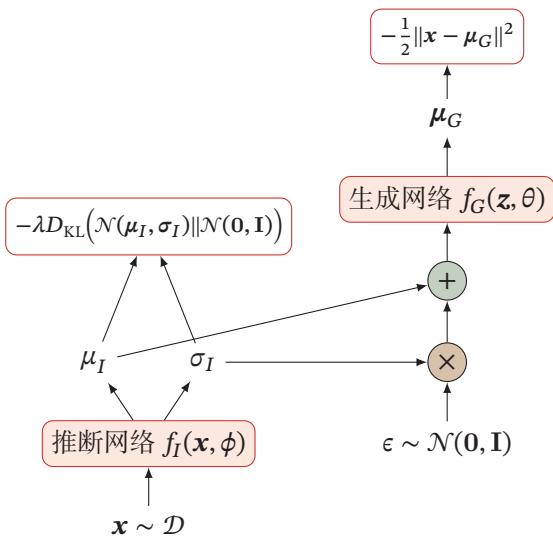  
图13.5 变分自编码器的训练过程

[¶0131] 图13.6给出了在MNIST数据集上变分自编码器学习到的隐变量流形的可视化示例．图13.6a是将训练集上每个样本??通过推断网络映射到2维的隐变量空间，图中的每个点表示??[??|??]，不同颜色表示不同的数字．图13.6b是对2维的标准高斯分布上进行均匀采样得到不同的隐变量??，然后通过生成网络产生??[??|??]

[¶0132]
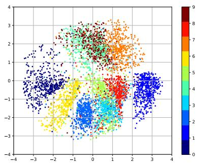  
(a)训练集上所有样本在隐空间上的投影

[¶0133]
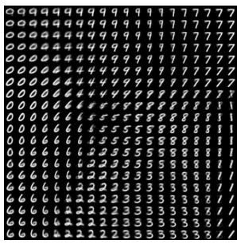  
(b)隐变量??在图像空间的投影  
图13.6 在MNIST数据集上变分自编码器学习到的隐变量流形的可视化示例

## 13.3 生成对抗网络

## 13.3.1 显式密度模型和隐式密度模型

[¶0134] 之前介绍的深度生成模型，比如变分自编码器、深度信念网络等，都是显示地构建出样本的密度函数 $p ( \pmb { x } ; \theta )$ ，并通过最大似然估计来求解参数，称为显式密度模型（Explicit Density Model）．比如，变分自编码器的密度函数为$p ( \pmb { x } , \pmb { z } ; \theta ) = p ( \pmb { x } | \pmb { z } ; \theta ) p ( \pmb { z } ; \theta )$ ．虽然使用了神经网络来估计 $p ( \pmb { x } | \pmb { z } ; \theta )$ ，但是我们依然假设 $p ( \pmb { x } | \pmb { z } ; \theta )$ 为一个参数分布族，而神经网络只是用来预测这个参数分布族的参数．这在某种程度上限制了神经网络的能力

[¶0135] 如果只是希望有一个模型能生成符合数据分布 $p _ { r } ( { \pmb x } )$ 的样本，那么可以不显示地估计出数据分布的密度函数．假设在低维空间??中有一个简单容易采样的分布 $p ( z ) , p ( z )$ 通常为标准多元正态分布 $\mathcal { N } ( \mathbf { 0 } , \pmb { I } )$ ．我们用神经网络构建一个映射函数 $G : \mathcal { Z }  \mathcal { X }$ ，称为生成网络．利用神经网络强大的拟合能力，使得 $G ( z )$ 服从数据分布 $p _ { r } ( { \pmb x } )$ ．这种模型就称为隐式密度模型（Implicit Density Model）．所谓隐式模型就是指并不显式地建模 $p _ { r } ( { \pmb x } )$ ，而是建模生成过程．图13.7给出了隐式模型生成样本的过程

[¶0136]
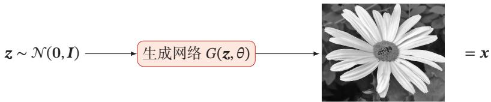  
图13.7 隐式模型生成样本的过程

## 13.3.2 网络分解

[¶0137] 隐式密度模型的一个关键是如何确保生成网络产生的样本一定是服从真实的数据分布．既然我们不构建显式密度函数，就无法通过最大似然估计等方法来训练．生成对抗网络（Generative Adversarial Networks，GAN）[Goodfellowet al., 2014]是通过对抗训练的方式来使得生成网络产生的样本服从真实数据分布．在生成对抗网络中，有两个网络进行对抗训练．一个是判别网络，目标是尽量准确地判断一个样本是来自于真实数据还是由生成网络产生；另一个是生成网络，目标是尽量生成判别网络无法区分来源的样本．这两个目标相反的网络不断地进行交替训练．当最后收敛时，如果判别网络再也无法判断出一个样本的来源，那么也就等价于生成网络可以生成符合真实数据分布的样本．生成对抗网络的流程图如图13.8所示

[¶0138]
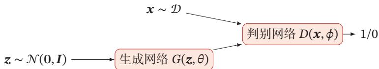  
图13.8 生成对抗网络的流程图

## 13.3.2.1 判别网络

[¶0139] 判别网络（Discriminator Network） $D ( \boldsymbol { x } ; \boldsymbol { \phi } )$ 的目标是区分出一个样本??是来自于真实分布 $p _ { r } ( { \pmb x } )$ 还是来自于生成模型 $p _ { \theta } ( { \pmb x } )$ ，因此判别网络实际上是一个二分类的分类器．用标签 $y = 1$ 来表示样本来自真实分布， $y = 0$ 表示样本来自生成模型，判别网络 $D ( { \boldsymbol { x } } ; \phi )$ 的输出为??属于真实数据分布的概率，即

[¶0140]
$$
p ( y = 1 | \pmb { x } ) = D ( \pmb { x } ; \pmb { \phi } ) ,\tag{13.29}
$$

[¶0141] 则样本来自生成模型的概率为 $p ( y = 0 | \pmb { x } ) = 1 - D ( \pmb { x } ; \pmb { \phi } )$

[¶0142] 给定一个样本 $( x , y ) , y = \{ 1 , 0 \}$ 表示其来自于 $p _ { r } ( { \pmb x } )$ 还是 $p _ { \theta } ( { \pmb x } )$ ，判别网络的目标函数为最小化交叉熵，即

[¶0143]
$$
\displaystyle \operatorname* { m i n } _ { \phi } - \biggl ( \mathbb { E } _ { x } \Bigl [ y \log p ( y = 1 | x ) + ( 1 - y ) \log p ( y = 0 | x ) \Bigr ] \biggr ) .\tag{13.30}
$$

[¶0144] 假设分布 $p ( { \pmb x } )$ 是由分布 $p _ { r } ( { \pmb x } )$ 和分布 $p _ { \theta } ( { \pmb x } )$ 等比例混合而成，即 $p ( { \pmb x } ) =$ $\begin{array} { r } { \frac { 1 } { 2 } \big ( p _ { r } ( { \pmb x } ) + p _ { \theta } ( { \pmb x } ) \big ) } \end{array}$ ，则上式等价于

[¶0145]
$$
\underset { \phi } { \operatorname* { m a x } } \mathbb { E } _ { \boldsymbol { x } \sim p _ { r } ( \boldsymbol { x } ) } \Big [ \log D ( \boldsymbol { x ; \phi } ) \Big ] + \mathbb { E } _ { \boldsymbol { x ^ { \prime } \sim } p _ { \theta } ( \boldsymbol { x ^ { \prime } } ) } \Big [ \log ( 1 - D ( \boldsymbol { x ^ { \prime } ; \phi } ) ) \Big ]\tag{13.31}
$$

[¶0146]
$$
= \operatorname* { m a x } _ { \phi } \mathbb { E } _ { { x } \sim { p } _ { r } ( x ) } \Big [ \log D ( { x } ; { \phi } ) \Big ] + \mathbb { E } _ { { z } \sim { p } ( z ) } \Big [ \log \Big ( 1 - D \big ( G ( { z } ; \theta ) ; { \phi } \big ) \Big ) \Big ] ,\tag{13.32}
$$

[¶0147] 其中 $\boldsymbol { \theta }$ 和 $\phi$ 分别是生成网络和判别网络的参数

## 13.3.2.2 生成网络

[¶0148] 生成网络（Generator Network）的目标刚好和判别网络相反，即让判别网络将自己生成的样本判别为真实样本

[¶0149]
$$
\operatorname* { m a x } _ { \theta } \biggl ( \mathbb { E } _ { z \sim p ( z ) } \Bigl [ \log D \Bigl ( G ( z ; \theta ) ; \phi ) \Bigr ] \biggr )\tag{13.33}
$$

[¶0150]
$$
= \underset { \theta } { \operatorname* { m i n } } \biggl ( \mathbb { E } _ { z \sim p ( z ) } \Bigl [ \log \Bigl ( 1 - D \bigl ( G ( z ; \theta ) ; \phi \bigr ) \Bigr ) \Bigr ] \biggr ) .\tag{13.34}
$$

[¶0151] 上面的这两个目标函数是等价的．但是在实际训练时，一般使用前者，因为其梯度性质更好．我们知道，函数 $\log ( x ) , x \in ( 0 , 1 )$ 在??接近1时的梯度要比接近0时的梯度小很多，接近“饱和”区间．这样，当判别网络??以很高的概率认为生成网络??产生的样本是“假”样本，即 $\Big ( 1 - D \big ( G ( \pmb { \mu } ; \theta ) ; \phi \big ) \Big )  1$ ，这时目标函数关于??的梯度反而很小，从而不利于优化

[¶0152] 还有一种改进生成网络的梯度的方法是将真实样本和生成样本的标签互换，即生成样本的标签为1

## 13.3.3 训练

[¶0153] 和单目标的优化任务相比，生成对抗网络的两个网络的优化目标刚好相反因此生成对抗网络的训练比较难，往往不太稳定．一般情况下，需要平衡两个网络的能力．对于判别网络来说，一开始的判别能力不能太强，否则难以提升生成网络的能力．但是，判别网络的判别能力也不能太弱，否则针对它训练的生成网络也不会太好．在训练时需要使用一些技巧，使得在每次迭代中，判别网络比生成网络的能力强一些，但又不能强太多

[¶0154] 生成对抗网络的训练流程如算法13.1所示．每次迭代时，判别网络更新??次而生成网络更新一次，即首先要保证判别网络足够强才能开始训练生成网络．在实践中??是一个超参数，其取值一般取决于具体任务

[¶0155] 算法 13.1 生成对抗网络的训练过程  
输入:训练集??，对抗训练迭代次数??，每次判别网络的训练迭代次数??，小批  
量样本数量??  
1 随机初始化 $\theta ,$ ??;  
2 for ?? ← 1 to ?? do  
// 训练判别网络 $D ( x ; \phi )$   
3 for ?? ← 1 to ?? do  
// 采集小批量训练样本  
4 从训练集??中采集??个样本 $\{ \pmb { x } ^ { ( m ) } \} , 1 \leq m \leq M ;$   
5 从分布 $\mathcal { N } ( \mathbf { 0 } , \pmb { I } )$ 中采集??个样本 $\{ z ^ { ( m ) } \} , 1 \leq m \leq M ;$   
6 使用随机梯度上升更新 $\phi$ ，梯度为  
$\frac { \partial } { \partial \phi } \bigg [ \frac { 1 } { M } \sum _ { m = 1 } ^ { M } \bigg ( \log D ( { \boldsymbol x } ^ { ( m ) } ; \phi ) + \log \big ( 1 - D \big ( G ( { \boldsymbol z } ^ { ( m ) } ; \theta ) ; \phi ) \big ) \bigg ) \bigg ] ;$   
7 end  
$/ /$ 训练生成网络 $G ( z ; \theta )$   
8 从分布 $\mathcal { N } ( \mathbf { 0 } , \pmb { I } )$ 中采集??个样本 $\{ z ^ { ( m ) } \} , 1 \leq m \leq M ;$   
9 使用随机梯度上升更新??，梯度为  
$\frac { \partial } { \partial \theta } \bigg [ \frac { 1 } { M } \sum _ { m = 1 } ^ { M } D \big ( G ( z ^ { ( m ) } ; \theta ) , \phi \big ) \bigg ] ;$   
10 end  
输出:生成网络 $G ( z ; \theta )$

## 13.3.4 一个生成对抗网络的具体实现：DCGAN

[¶0156] 生成对抗网络是指一类采用对抗训练方式来进行学习的深度生成模型，其包含的判别网络和生成网络都可以根据不同的生成任务使用不同的网络结构

[¶0157] 本节介绍一个生成对抗网络的具体模型：深度卷积生成对抗网络（DeepConvolutional Generative Adversarial Network，DCGAN）[Radford et al., 2016]在DCGAN中，判别网络是一个传统的深度卷积网络，但使用了带步长的卷积来实现下采样操作，不用最大汇聚（pooling）操作；生成网络使用一个特殊的深度卷积网络来实现，如图13.9所示，使用微步卷积来生成64 × 64大小的图像．第一层是全连接层，输入是从均匀分布中随机采样的100维向量??，输出是 $4 { \times } 4 { \times } 1 0 2 4$ 的向量，重塑为 $4 \times 4 \times 1 0 2 4$ 的张量；然后是四层的微步卷积，没有汇聚层

[¶0158] 微 步 卷 积 参 见第5.5.1节

[¶0159]
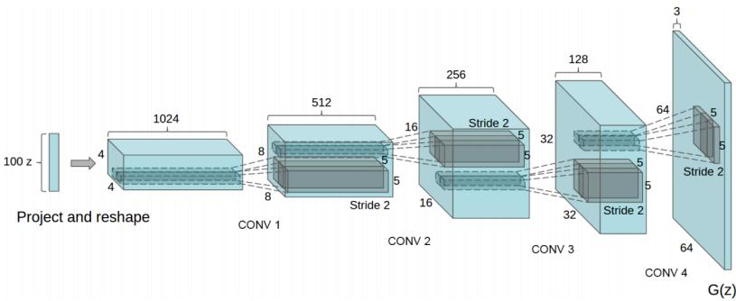  
图 13.9 DCGAN 中的生成网络（图片来源：[Radford et al., 2016]）

[¶0160] DCGAN的主要优点是通过一些经验性的网络结构设计使得对抗训练更加稳定．比如：1）使用带步长的卷积（在判别网络中）和微步卷积（在生成网络中）来代替汇聚操作，以免损失信息；2）使用批量归一化；3）去除卷积层之后的全连接层；4）在生成网络中，除了最后一层使用Tanh激活函数外，其余层都使用ReLU函数；5）在判别网络中，都使用LeakyReLU激活函数

## 13.3.5 模型分析

[¶0161] 我们把判别网络和生成网络合并为一个整体，将整个生成对抗网络的目标函数看作最小化最大化游戏（Minimax Game）：

[¶0162]
$$
\operatorname* { m i n } _ { \theta } \operatorname* { m a x } _ { \phi } \bigg ( \mathbb { E } _ { x \sim p _ { r } ( x ) } \Big [ \log D ( x ; \phi ) \Big ] + \mathbb { E } _ { x \sim p _ { \theta } ( x ) } \Big [ \log \Big ( 1 - D \big ( x ; \phi \big ) \Big ) \Big ] \bigg )\tag{13.35}
$$

[¶0163]
$$
= \underset { \theta } { \mathrm { m i n } } \underset { \phi } { \mathrm { m a x } } \bigg ( \mathbb { E } _ { { x } \sim { p } _ { r } ( x ) } \Big [ \log D ( { x } ; \phi ) \Big ] + \mathbb { E } _ { z \sim p ( z ) } \Big [ \log \Big ( 1 - D \big ( G ( { z } ; \theta ) ; \phi \big ) \Big ) \Big ] \bigg ) .\tag{13.36}
$$

[¶0164] 因为之前提到的生成网络梯度问题，这个最小化最大化形式的目标函数一般用来进行理论分析，并不是实际训练时的目标函数

[¶0165] 假设 $p _ { r } ( { \pmb x } )$ 和 $p _ { \theta } ( { \pmb x } )$ 已知，则最优的判别器为

[¶0166] 参见习题13-4

[¶0167]
$$
D ^ { \star } ( x ) = \frac { p _ { r } ( { \pmb x } ) } { p _ { r } ( { \pmb x } ) + p _ { \theta } ( { \pmb x } ) } .\tag{13.37}
$$

[¶0168] 将最优的判别器 $D ^ { \star } ( x )$ 代入公式(13.35)，其目标函数变为

[¶0169]
$$
\mathcal { L } ( G | D ^ { \star } ) = \mathbb { E } _ { x \sim p _ { r } ( x ) } \Big [ \log D ^ { \star } ( x ) \Big ] + \mathbb { E } _ { x \sim p _ { \theta } ( x ) } \Big [ \log ( 1 - D ^ { \star } ( x ) ) \Big ]\tag{13.38}
$$

[¶0170]
$$
= \mathbb { E } _ { x \sim p _ { r } ( x ) } \Big [ \log \frac { p _ { r } ( x ) } { p _ { r } ( x ) + p _ { \theta } ( x ) } \Big ] + \mathbb { E } _ { x \sim p _ { \theta } ( x ) } \Big [ \log \frac { p _ { \theta } ( x ) } { p _ { r } ( x ) + p _ { \theta } ( x ) } \Big ]\tag{13.39}
$$

[¶0171]
$$
= \operatorname { K L } ( p _ { r } , p _ { a } ) + \operatorname { K L } ( p _ { \theta } , p _ { a } ) - 2 \log 2\tag{13.40}
$$

[¶0172]
$$
= 2 \mathrm { J S } ( p _ { r } , p _ { \theta } ) - 2 \log 2 ,\tag{13.41}
$$

[¶0173] 其中 JS(⋅) 为 JS 散度， $\begin{array} { r } { p _ { a } ( { \pmb x } ) = \frac { 1 } { 2 } \big ( p _ { r } ( { \pmb x } ) + p _ { \theta } ( { \pmb x } ) \big ) } \end{array}$ 为一个“平均”分布

[¶0174] JS散度参见第E.3.3节

[¶0175] 在生成对抗网络中，当判别网络为最优时，生成网络的优化目标是最小化真实分布 $p _ { r }$ 和模型分布 $p _ { \theta }$ 之间的JS散度．当两个分布相同时，JS散度为0，最优生成网络 $G ^ { \star }$ 对应的损失为 $\mathcal { L } ( G ^ { \star } | D ^ { \star } ) = - 2 \log 2$

## 13.3.5.1 训练稳定性

[¶0176] 使用JS散度来训练生成对抗网络的一个问题是当两个分布没有重叠时，它们之间的JS散度恒等于常数log2．对生成网络来说，目标函数关于参数的梯度为0，即 $\begin{array} { r } { \frac { \partial \mathcal { L } ( G | D ^ { \star } ) } { \partial \theta } = 0 } \end{array}$

[¶0177] 图13.10给出了生成对抗网络中的梯度消失问题的示例．当真实分布 $p _ { r }$ 和模型分布 $p _ { \theta }$ 没有重叠时，最优的判别器 $D ^ { \star }$ 对所有生成数据的输出都为0，即$D ^ { \star } ( G ( \pmb { z } ; \theta ) ) = 0 , \forall z$ ．因此，生成网络的梯度消失

[¶0178]
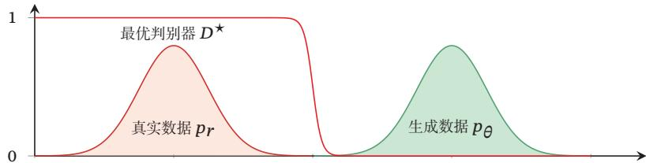  
图13.10 生成对抗网络中的梯度消失问题

[¶0179] 因此，在实际训练生成对抗网络时，一般不会将判别网络训练到最优，只进行一步或多步梯度下降，使得生成网络的梯度依然存在．另外，判别网络也不能太差，否则生成网络的梯度为错误的梯度．但是，如何在梯度消失和梯度错误之间取得平衡并不是一件容易的事，这个问题使得生成对抗网络在训练时稳定性比较差

## 13.3.5.2 模型坍塌

[¶0180] 如果使用公式(13.33)作为生成网络的目标函数，将最优判别器 $D ^ { \star }$ 代入，可以得到

[¶0181]
$$
\mathcal { L } ^ { \prime } ( G | D ^ { \star } ) = \mathbb { E } _ { \pmb { x } \sim p _ { \theta } ( \pmb { x } ) } \Big [ \log D ^ { \star } ( \pmb { x } ) \Big ]\tag{13.42}
$$

[¶0182]
$$
= \mathbb { E } _ { x \sim p _ { \theta } ( x ) } \Big [ \log \frac { p _ { r } ( x ) } { p _ { r } ( x ) + p _ { \theta } ( x ) } \cdot \frac { p _ { \theta } ( x ) } { p _ { \theta } ( x ) } \Big ]\tag{13.43}
$$

[¶0183]
$$
= - \mathbb { E } _ { x \sim p _ { \theta } ( x ) } \Big [ \log \frac { p _ { \theta } ( x ) } { p _ { r } ( x ) } \Big ] + \mathbb { E } _ { x \sim p _ { \theta } ( x ) } \Big [ \log \frac { p _ { \theta } ( x ) } { p _ { r } ( x ) + p _ { \theta } ( x ) } \Big ]\tag{13.44}
$$

[¶0184]
$$
= - \operatorname { K L } ( p _ { \theta } , p _ { r } ) + \mathbb { E } _ { x \sim p _ { \theta } ( x ) } \Big [ \log \big ( 1 - D ^ { \star } ( { \pmb x } ) \big ) \Big ]\tag{13.45}
$$

[¶0185]
$$
= - \operatorname { K L } ( p _ { \theta } , p _ { r } ) + 2 \operatorname { J S } ( p _ { r } , p _ { \theta } ) - 2 \log 2 - \mathbb { E } _ { x \sim p _ { r } ( x ) } \Big [ \log D ^ { \star } ( x ) \Big ] ,\tag{13.46}
$$

[¶0186] 根据公式 (13.41)

[¶0187] 其中后两项和生成网络无关．因此

[¶0188]
$$
\underset { \theta } { \arg \operatorname* { m a x } } \mathcal { L } ^ { \prime } ( G | D ^ { \star } ) = \underset { \theta } { \arg \operatorname* { m i n } } \mathrm { K L } ( p _ { \theta } , p _ { r } ) - 2 \mathrm { J S } ( p _ { r } , p _ { \theta } ) ,\tag{13.47}
$$

[¶0189] 其中JS散度 $\mathrm { J S } ( p _ { \theta } , p _ { r } ) \in [ 0 , \log 2 ]$ 为有界函数，因此生成网络的目标更多的是受逆向KL散度 $\mathrm { K L } ( p _ { \theta } , p _ { r } )$ 影响，使得生成网络更倾向于生成一些更“安全”的样本，从而造成模型坍塌（Model Collapse）问题

[¶0190] 前向和逆向KL散度 因为KL散度是一种非对称的散度，在计算真实分布 $p _ { r }$ 和模型分布 $p _ { \theta }$ 之间的KL散度时，按照顺序不同，有两种KL散度：前向KL散度（Forward KL divergence） $\mathrm { K L } ( p _ { r } , p _ { \theta } )$ 和逆向 KL 散度（Reverse KL divergence）$\mathrm { K L } ( p _ { \theta } , p _ { r } )$ ．前向和逆向KL散度分别定义为

[¶0191]
$$
\mathrm { K L } ( p _ { r } , p _ { \theta } ) = \int p _ { r } ( { \pmb x } ) \log \frac { p _ { r } ( { \pmb x } ) } { p _ { \theta } ( { \pmb x } ) } \mathrm { d } { \pmb x } ,\tag{13.48}
$$

[¶0192]
$$
\mathrm { K L } ( p _ { \theta } , p _ { r } ) = \int p _ { \theta } ( { \pmb x } ) \log \frac { p _ { \theta } ( { \pmb x } ) } { p _ { r } ( { \pmb x } ) } \mathrm { d } { \pmb x } .\tag{13.49}
$$

[¶0193] 图13.11给出数据真实分布为一个高斯混合分布，模型分布为一个单高斯分布时，使用前向和逆向KL散度来进行模型优化的示例．黑色曲线为真实分布 $p _ { r }$ 的等高线，红色曲线为模型分布 $p _ { \theta }$ 的等高线

[¶0194] 在前向KL散度中，

[¶0195] （1）当 $p _ { r } ( { \pmb x } )  0$ 而 $p _ { \theta } ( { \pmb x } ) > 0$ 时， $\begin{array} { r } { p _ { r } ( { \pmb x } ) \log \frac { p _ { r } ( { \pmb x } ) } { p _ { \theta } ( { \pmb x } ) }  0 . } \end{array}$ ．不管 $p _ { \theta } ( { \pmb x } )$ 如何取值，都对前向KL散度的计算没有贡献

[¶0196] （2）当 $p _ { r } ( { \pmb x } ) > 0$ 而 $p _ { \theta } ( { \pmb x } )  0$ 时， $p _ { r } ( { \pmb x } ) \log \frac { p _ { r } ( { \pmb x } ) } { p _ { \theta } ( { \pmb x } ) }  \infty$ ，前向KL散度会变得非常大

[¶0197] 因此，前向KL散度会鼓励模型分布 $p _ { \theta } ( { \pmb x } )$ 尽可能覆盖所有真实分布 $p _ { r } ( { \pmb x } ) >$ 0的点，而不用回避 $p _ { r } ( { \pmb x } ) \approx 0$ 的点

[¶0198]
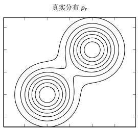

[¶0199]
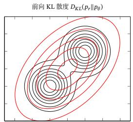

[¶0200]
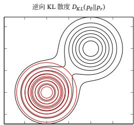  
图13.11 前向和逆向KL散度

[¶0201] 在逆向KL散度中，

[¶0202] （1）当 $p _ { r } ( { \pmb x } )  0$ 而 $p _ { \theta } ( { \pmb x } ) > 0$ 时， $p _ { \theta } ( { \pmb x } ) \log \frac { p _ { \theta } ( { \pmb x } ) } { p _ { r } ( { \pmb x } ) }  \infty$ ．即当 $p _ { r } ( { \pmb x } )$ 接近于0，而 $p _ { \theta } ( { \pmb x } )$ 有一定的密度时，逆向KL散度会变得非常大

[¶0203] （2）当 $p _ { \theta } ( { \pmb x } )  0$ 时，不管 $p _ { r } ( { \pmb x } )$ 如何取值， $\begin{array} { r } { p _ { \theta } ( { \pmb x } ) \log \frac { p _ { \theta } ( { \pmb x } ) } { p _ { r } ( { \pmb x } ) }  0 . } \end{array}$

[¶0204] 因此，逆向KL散度会鼓励模型分布 $p _ { \theta } ( { \pmb x } )$ 尽可能避开所有真实分布 $p _ { r } ( { \pmb x } ) \approx$ 0的点，而不需要考虑是否覆盖所有真实分布 $p _ { r } ( { \pmb x } ) > 0$ 的点

## 13.3.6 改进模型

[¶0205] 在生成对抗网络中，JS散度不适合衡量生成数据分布和真实数据分布的距离．由于通过优化交叉熵（JS散度）训练生成对抗网络会导致训练稳定性和模型坍塌问题，因此要改进生成对抗网络，就需要改变其损失函数

## 13.3.6.1 W-GAN

[¶0206] W-GAN是一种通过用Wasserstein距离替代JS散度来优化训练的生成对抗 网络 [Arjovsky et al., 2017]

[¶0207] 对于真实分布 $p _ { r }$ 和模型分布 $p _ { \theta }$ ，它们的 1st-Wasserstein 距离为

[¶0208] Wasserstein 距 离 也 称为推 土 机 距 离，参 见第E.3.4节

[¶0209]
$$
W ^ { 1 } ( p _ { r } , p _ { \theta } ) = \operatorname* { i n f } _ { \gamma \sim \Gamma ( p _ { r } , p _ { \theta } ) } \mathbb { E } _ { ( x , y ) \sim \gamma } \Big [ | | x - y | | \Big ] ,\tag{13.50}
$$

[¶0210] 其中 $\Gamma ( p _ { r } , p _ { \theta } )$ 是边际分布为 $p _ { r }$ 和 $p _ { \theta }$ 的所有可能的联合分布集合

[¶0211] 当两个分布没有重叠或者重叠非常少时，它们之间的KL散度为+∞，JS散度为log2，并不随着两个分布之间的距离而变化．而1st-Wasserstein距离依然可以衡量两个没有重叠分布之间的距离

[¶0212] 两个分布 $p _ { r }$ 和 $p _ { \theta }$ 的1st-Wasserstein距离通常难以直接计算，但是两个分布的 1st-Wasserstein 距离有一个对偶形式：

[¶0213]
$$
W ^ { 1 } ( p _ { r } , p _ { \theta } ) = \operatorname* { s u p } _ { \| f \| _ { L } \leq 1 } \Big ( \mathbb { E } _ { \boldsymbol { x } \sim p _ { r } } [ f ( \boldsymbol { x } ) ] - \mathbb { E } _ { \boldsymbol { x } \sim p _ { \theta } } [ f ( \boldsymbol { x } ) ] \Big ) ,\tag{13.52}
$$

[¶0214] https://nndl.github.io/

## 数学小知识 | Lipschitz 连续函数

[¶0215] 在数学中，对于一个实数函数 $f$ ∶ ℝ → ℝ，如果满足函数曲线上任意两点连线的斜率一致有界，即任意两点的斜率都小于常数 $K > 0$

[¶0216]
$$
| f ( x _ { 1 } ) - f ( x _ { 2 } ) | \leq K | x _ { 1 } - x _ { 2 } | ,\tag{13.51}
$$

[¶0217] 则函数 ?? 就称为K-Lipschitz 连续函数，?? 称为 Lipschitz 常数．参见习题13-5．

[¶0218] Lipschitz连续要求函数在无限的区间上不能有超过线性的增长如果一个函数可导，并满足Lipschitz连续，那么导数有界．如果一个函数可导，并且导数有界，那么函数为Lipschitz连续

[¶0219] 其中 $f : \mathbb { R } ^ { d } $ ℝ 为 1-Lipschitz 函数，满足

[¶0220]
$$
\| f \| _ { L } \triangleq \operatorname* { s u p } _ { x \neq y } { \frac { | f ( x ) - f ( y ) | } { | x - y | } } \leq 1 .\tag{13.53}
$$

[¶0221] 公式(13.52)称为Kantorovich-Rubinstein 对偶定理

[¶0222] 根据Kantorovich-Rubinstein对偶定理，两个分布 $p _ { r }$ 和 $p _ { \theta }$ 之间的 1st-Wasser-stein距离可以转换为一个满足1-Lipschitz连续的函数在分布 $p _ { r }$ 和 $p _ { \theta }$ 下期望的差的上界．通常情况下，1-Lipschitz连续的约束可以宽松为K-Lipschitz连续．这样分布 $p _ { r }$ 和 $p _ { \theta }$ 之间的 1st-Wasserstein 距离为

[¶0223]
$$
W ^ { 1 } ( p _ { r } , p _ { \theta } ) = \frac { 1 } { K } \operatorname* { s u p } _ { \| f \| _ { L } \leq K } \Big ( \mathbb { E } _ { { \boldsymbol { x } } \sim { \boldsymbol { p } } _ { r } } [ f ( { \boldsymbol { x } } ) ] - \mathbb { E } _ { { \boldsymbol { x } } \sim { \boldsymbol { p } } _ { \theta } } [ f ( { \boldsymbol { x } } ) ] \Big ) .\tag{13.54}
$$

[¶0224] 参见习题13-6

[¶0225] 评价网络 然而，要计算公式(13.54)中的上界也并不容易．根据神经网络的通用近似定理，我们可以假设存在一个神经网络使得可以达到这个上界．令 $f ( { \pmb x } ; \phi )$ 为一个神经网络，假设存在参数集合 $\Phi$ ，对于所有的 $\phi \in \Phi , f ( { \pmb x } ; \phi )$ 为 K-Lipschitz连续函数，那么公式（13.54）中的上界可以近似转换为

[¶0226]
$$
\operatorname* { m a x } _ { \phi \in \Phi } \Big ( \mathbb { E } _ { x \sim p _ { r } } [ f ( { \pmb x } ; \phi ) ] - \mathbb { E } _ { { \pmb x } \sim p _ { \theta } } [ f ( { \pmb x } ; \phi ) ] \Big ) ,
$$

[¶0227] 这里忽略了常数 $\frac { 1 } { K }$ ，并不影响网络的优化

[¶0228] (13.55)

[¶0229] 其中 $f ( { \pmb x } ; \phi )$ 称为评价网络（Critic Network）．和标准GAN中的判别网络的值域为[0, 1]不同，评价网络 $f ( { \pmb x } ; \phi )$ 的最后一层为线性层，其值域没有限制．这样只需要找到一个网络 $f ( { \pmb x } ; \phi )$ 使其在两个分布 $p _ { r }$ 和 $p _ { \theta }$ 下的期望的差最大．即对于真实样本， $f ( { \pmb x } ; \phi )$ 的打分要尽可能高；对于模型生成的样本， $f ( { \pmb x } ; \phi )$ 的打分要尽可能低

[¶0230] 为了使得 $f ( { \pmb x } ; \phi )$ 满足K-Lipschitz连续，一种近似的方法是限制参数的取值范围．因为神经网络为连续可导函数，满足K-Lipschitz连续可以近似为其关于 $_ { x }$ https://nndl.github.io/

[¶0231] 的偏导数的模 $\| \frac { \partial f ( \pmb { x } ; \phi ) } { \partial \pmb { x } } \|$ 小于某个上界．由于这个偏导数的大小一般和参数的取值范围相关，我们可以通过限制参数 $\phi$ 的取值范围来近似，令 $\phi \in [ - c , c ]$ ，?? 为一个比较小的正数，比如0.01

[¶0232] 生成网络 生成网络的目标是使得评价网络 $f ( { \pmb x } ; \phi )$ 对其生成样本的打分尽可能高，即

[¶0233]
$$
\operatorname* { m a x } _ { \theta } \mathbb { E } _ { z \sim p ( z ) } \Big [ f \Big ( G ( z ; \theta ) ; \phi ) \Big ] .\tag{13.56}
$$

[¶0234] 因为 $f ( { \pmb x } ; \phi )$ 为不饱和函数，所以生成网络参数??的梯度不会消失，理论上解决了原始GAN训练不稳定的问题．并且W-GAN中生成网络的目标函数不再是两个分布的比率，在一定程度上缓解了模型坍塌问题，使得生成的样本具有多样性

[¶0235] 算法13.2给出W-GAN的训练过程．和原始GAN相比，W-GAN的评价网络最后一层不使用Sigmoid函数，损失函数不取对数

[¶0236] 算法 13.2 W-GAN的训练过程  
输入:训练集??，对抗训练迭代次数??，每次评价网络的训练迭代次数??，小批  
量样本数量??，参数限制大小??;  
1 随机初始化 $\theta ,$ ??;  
2 for ?? ← 1 to ?? do  
// 训练评价网络??(??; ??)  
3 for ?? ← 1 to ?? do  
// 采集小批量训练样本  
4 从训练集??中采集??个样本 $\{ \pmb { x } ^ { ( m ) } \} , 1 \leq m \leq M ;$   
5 从分布??(0, ??)中采集??个样本 $\{ z ^ { ( m ) } \} , 1 \leq m \leq M ;$   
// 计算评价网络参数 $\phi$ 的梯度  
6 $g _ { \phi } = \frac { \partial } { \partial \phi } \biggl [ \frac { 1 } { M } \sum _ { m = 1 } ^ { M } \biggl ( f ( x ^ { ( m ) } ; \phi ) - f \Bigl ( G ( z ^ { ( m ) } ; \theta ) ; \phi \Bigr ) \biggr ) \biggr ] ;$   
7 $\phi  \phi + \alpha \cdot \mathrm { R M S P r o p } ( \phi , g _ { \phi } )$ // 使用 RMSProp 算法更新 $\phi$   
8 ?? ← clip(??, −??, ??) ; // 梯度截断  
9 end  
// 训练生成网络 $G ( z ; \theta )$   
10 从分布??(0, ??)中采集??个样本 $\{ z ^ { ( m ) } \} , 1 \leq m \leq M ;$   
// 更新生成网络参数??  
11 $g _ { \theta } = \frac { \partial } { \partial \theta } \bigg [ \frac { 1 } { M } \sum _ { m = 1 } ^ { M } f \Big ( G ( z ^ { ( m ) } ; \theta ) ; \phi \Big ) \bigg ] ;$   
12 $\theta \gets \theta + \alpha \cdot \mathrm { R M S P r o p } ( \theta , g _ { \theta } )$ // 使用 RMSProp 算法更新 ??  
13 end  
输出:生成网络 $G ( z ; \theta )$

## 13.4 总结和深入阅读

[¶0237] 深度生成模型是一种有机融合神经网络和概率图模型的生成模型，将神经网络作为一个概率分布的逼近器，可以拟合非常复杂的数据分布

[¶0238] 变分自编码器是一个非常典型的深度生成模型，利用神经网络的拟合能力来有效地解决含隐变量的概率模型中后验分布难以估计的问题[Kingma et al.,2014; Rezende et al., 2014]．变分自编码器的详尽介绍可以参考文献 [Doersch,2016]．[Bowman et al., 2016]进一步将变分自编码器应用于序列生成问题．再参数化是变分自编码器的重要技巧．对于离散变量的再参数化，可以使用Gumbel-Softmax 方法 [Jang et al., 2017]

[¶0239] 生成对抗网络[Goodfellow et al., 2014]是一个具有开创意义的深度生成模型，突破了以往的概率模型必须通过最大似然估计来学习参数的限制．然而，生成对抗网络的训练通常比较困难．DCGAN[Radford et al., 2016]是一个生成对抗网络的成功实现，可以生成十分逼真的自然图像．[Yu et al., 2017]进一步在文本生成任务上结合生成对抗网络和强化学习来建立文本生成模型．对抗生成网络的训练不稳定问题的一种有效解决方法是W-GAN[Arjovsky et al., 2017]，通过用Wasserstein距离替代JS散度来进行训练

[¶0240] 虽然深度生成模型取得了巨大的成功，但是作为一种无监督模型，其主要的缺点是缺乏有效的客观评价，很难客观衡量不同模型之间的优劣

## 习题

[¶0241] 习题13-1 对于一个分布为 $p _ { \theta } ( z )$ 的离散随机变量??，以及函数 $f ( z )$ ，如何计算期望 $\mathcal { L } ( \theta ) = \mathbb { E } _ { z \sim p _ { \theta } ( z ) } [ f ( z ) ]$ 关于分布参数??的导数

[¶0242] 参见第13.2.5节

[¶0243] 习题 13-2 推导公式(13.28)

[¶0244] 习题13-3 通过分析公式(13.28)，给出变分自编码器和自编码器在内在机理上的不同之处

[¶0245] 习题13-4 假设一个二分类问题，类别为 $c _ { 1 }$ 和 $c _ { 2 }$ ，并有 $p ( c _ { 1 } ) = p ( c _ { 2 } )$ ．样本??在两个类的条件分布为 $p ( \pmb { x } | c _ { 1 } )$ 和 $p ( \pmb { x } | c _ { 2 } )$ ，一个分类器 $\begin{array} { r } { f ( \pmb { x } ) = p ( c _ { 1 } | \pmb { x } ) } \end{array}$ 用于预测一个样本??来自类别 $c _ { 1 }$ 的条件概率．证明若采用交叉熵损失，

[¶0246]
$$
\mathcal { L } ( f ) = \mathbb { E } _ { { x } \sim { p } ( { x } | { c } _ { 1 } ) } \Big [ \log f ( { x } ) \Big ] + \mathbb { E } _ { { x } \sim { p } ( { x } | { c } _ { 2 } ) } \Big [ \log \big ( 1 - f ( { x } ) \big ) \Big ] ,\tag{13.57}
$$

[¶0247] 则最优分类器 $f ^ { \star } ( x )$ 为

[¶0248] 参见公式(13.37)

[¶0249]
$$
f ^ { \star } ( { \pmb x } ) = \frac { p ( { \pmb x } | c _ { 1 } ) } { p ( { \pmb x } | c _ { 1 } ) + p ( { \pmb x } | c _ { 2 } ) } .\tag{13.58}
$$

[¶0250] https://nndl.github.io/

[¶0251] 习题13-5 分析下面函数是否满足Lipschitz连续条件

[¶0252] （1） $f : [ - 1 , 1 ] \to \mathbb { R } , f ( x ) = x ^ { 2 }$

[¶0253] （2） $f : \mathbb { R } \to \mathbb { R } , f ( x ) = x ^ { 2 } ;$

[¶0254] （3） $f : \mathbb { R } \to \mathbb { R } , f ( x ) = { \sqrt { x ^ { 2 } + 1 } } ;$

[¶0255] （4） $f : [ 0 , 1 ] \to [ 0 , 1 ] , f ( x ) = { \sqrt { x } } .$

[¶0256] 习题 13-6 证明公式(13.54)

## 参考文献

[¶0257] Arjovsky M, Chintala S, Bottou L, 2017. Wasserstein GAN[J/OL]. CoRR, abs/1701.07875. http: //arxiv.org/abs/1701.07875.

[¶0258] Bowman S R, Vilnis L, Vinyals O, et al., 2016. Generating sentences from a continuous space [C/OL]//Proceedings of the 20th SIGNLL Conference on Computational Natural Language Learning. 10-21. https://www.aclweb.org/anthology/K16-1002/.

[¶0259] Doersch C, 2016. Tutorial on variational autoencoders[J/OL]. CoRR, abs/1606.05908. http://arxiv. org/abs/1606.05908.

[¶0260] Goodfellow I, Pouget-Abadie J, Mirza M, et al., 2014. Generative adversarial nets[C]//Advances in Neural Information Processing Systems. 2672-2680.

[¶0261] Jang E, Gu S, Poole B, 2017. Categorical reparameterization with gumbel-softmax[C/OL]// Proceedings of 5th International Conference on Learning Representations. https://openreview. net/forum?id=rkE3y85ee.

[¶0262] Kingma D P, Welling M, 2014. Auto-encoding variational bayes[C/OL]//Proceedings of 2nd International Conference on Learning Representations. http://arxiv.org/abs/1312.6114.

[¶0263] Radford A, Metz L, Chintala S, 2016. Unsupervised representation learning with deep convolutional generative adversarial networks[C/OL]//Proceedings of 4th International Conference on Learning Representations. http://arxiv.org/abs/1511.06434.

[¶0264] Rezende D J, Mohamed S, Wierstra D, 2014. Stochastic backpropagation and approximate inference in deep generative models[J]. arXiv preprint arXiv:1401.4082.

[¶0265] Yu L, Zhang W, Wang J, et al., 2017. SeqGAN: Sequence generative adversarial nets with policy gradient[C]//Proceedings of Thirty-First AAAI Conference on Artificial Intelligence. 2852-2858.
