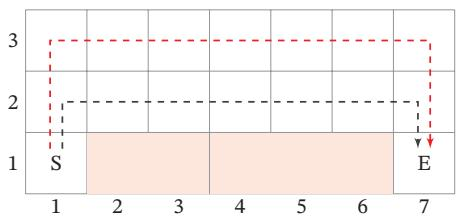
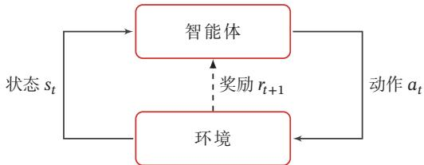
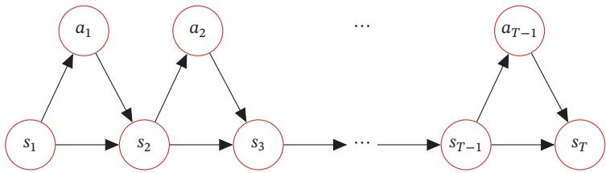
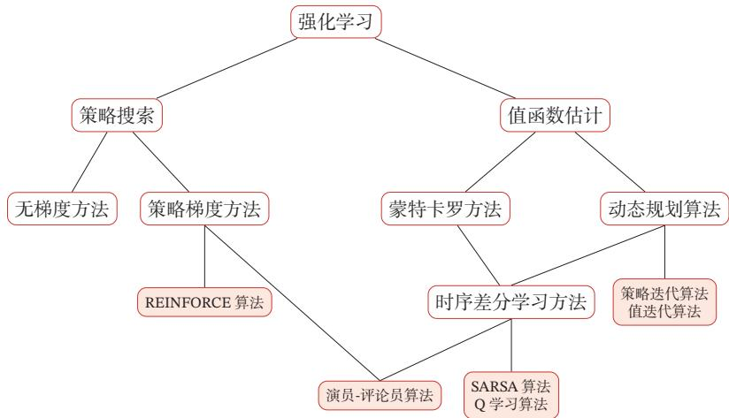

## 第14章 深度强化学习

[¶0001] 除了试图直接去建立一个可以模拟成人大脑的程序之外，为什么不试图建立一个可以模拟小孩大脑的程序呢？如果它接受适当的教育，就可能成长为成人的大脑

[¶0002] —阿兰·图灵（Alan Turing）

[¶0003] 在之前的章节中，我们主要关注监督学习，而监督学习一般需要一定数量的带标签的数据．在很多的应用场景中，通过人工标注的方式来给数据打标签的方式往往行不通．比如我们通过监督学习来训练一个模型可以自动下围棋，就需要将当前棋盘的状态作为输入数据，其对应的最佳落子位置（动作）作为标签．训练一个好的模型就需要收集大量的不同棋盘状态以及对应动作．这种做法实践起来比较困难，一是对于每一种棋盘状态，即使是专家也很难给出“正确”的动作，二是获取大量数据的成本往往比较高．对于下棋这类任务，虽然我们很难知道每一步的“正确”动作，但是其最后的结果（即赢输）却很容易判断．因此，如果可以通过大量的模拟数据，通过最后的结果（奖励）来倒推每一步棋的好坏，从而学习出“最佳”的下棋策略，这就是强化学习

[¶0004] 强化学习（Reinforcement Learning，RL），也叫增强学习，是指一类从（与环境）交互中不断学习的问题以及解决这类问题的方法．强化学习问题可以描述为一个智能体从与环境的交互中不断学习以完成特定目标（比如取得最大奖励值）．和深度学习类似，强化学习中的关键问题也是贡献度分配问题 [Minsky,1961]，每一个动作并不能直接得到监督信息，需要通过整个模型的最终监督信息（奖励）得到，并且有一定的延时性

[¶0005] 贡献度分配问题即一个系统中不同的组件（component）对 最 终系统输出结果的贡献或影响

[¶0006] 强化学习也是机器学习中的一个重要分支．强化学习和监督学习的不同在于，强化学习问题不需要给出“正确”策略作为监督信息，只需要给出策略的（延迟）回报，并通过调整策略来取得最大化的期望回报

## 14.1 强化学习问题

[¶0007] 本节介绍强化学习问题的基本定义和相关概念

## 14.1.1 典型例子

[¶0008] 强化学习广泛应用于很多领域，比如电子游戏、棋类游戏、迷宫类游戏、控制系统、推荐等．这里我们介绍几个比较典型的强化学习例子

[¶0009] 多臂赌博机问题 给定??个赌博机，拉动每个赌博机的拉杆（Arm），赌博机会按照一个事先设定的概率掉出一块钱或不掉钱．每个赌博机掉钱的概率不一样多臂赌博机问题（Multi-Armed Bandit Problem）是指，给定有限的机会次数??，如何玩这些赌博机才能使得期望累积收益最大化．多臂赌博机问题在广告推荐、投资组合等领域有着非常重要的应用

[¶0010] 也 称 为K臂 赌 博 机问 题（K-Armed Ban-dit Problem）

[¶0011] 悬崖行走问题 在一个网格世界（Grid World）中，每个格子表示一个状态．如图14.1所示的一个网格世界，每个状态为 $( i , j ) , 1 \le i \le 7 , 1 \le j \le 3$ ，其中格子(2, 1)到(6, 1)是悬崖（Cliff）．有一个醉汉，从左下角的开始位置??，走到右下角的目标位置??．如果走到悬崖，醉汉会跌落悬崖并死去．醉汉可以选择行走的路线，即在每个状态时，选择行走的方向：上下左右．动作空间 $\mathcal { A } = \{ \uparrow , \downarrow , \left. , \right. \}$ ．但每走一步，都有一定的概率滑落到周围其他格子．醉汉的目标是如何安全地到达目标位置

[¶0012]
  
图14.1 悬崖行走问题

## 14.1.2 强化学习定义

[¶0013] 我们先描述强化学习的任务定义

[¶0014] 在强化学习中，有两个可以进行交互的对象：智能体和环境

[¶0015] （1） 智能体（Agent）可以感知外界环境的状态（State）和反馈的奖励（Reward），并进行学习和决策．智能体的决策功能是指根据外界环境的状态来做出不同的动作（Action），而学习功能是指根据外界环境的奖励来调整策略

[¶0016] （2） 环境（Environment）是智能体外部的所有事物，并受智能体动作的影响而改变其状态，并反馈给智能体相应的奖励

[¶0017] 强化学习的基本要素包括：

[¶0018] （1） 状态??是对环境的描述，可以是离散的或连续的，其状态空间为??

[¶0019] （2） 动作??是对智能体行为的描述，可以是离散的或连续的，其动作空间为??．

[¶0020] （3） 策略 $\pi ( a | s )$ 是智能体根据环境状态??来决定下一步动作??的函数

[¶0021] （4） 状态转移概率 $p ( s ^ { \prime } | s , a )$ 是在智能体根据当前状态??做出一个动作??之后，环境在下一个时刻转变为状态 $s ^ { \prime }$ 的概率

[¶0022] （5） 即时奖励 $r ( s , a , s ^ { \prime } )$ 是一个标量函数，即智能体根据当前状态??做出动作??之后，环境会反馈给智能体一个奖励，这个奖励也经常和下一个时刻的状态$s ^ { \prime }$ 有关．

[¶0023] 策略 智能体的策略（Policy）就是智能体如何根据环境状态??来决定下一步的动作??，通常可以分为确定性策略（Deterministic Policy）和随机性策略（Sto-chastic Policy）两种

[¶0024] 确定性策略是从状态空间到动作空间的映射函数 $\pi : \mathcal { S }  \mathcal { A } .$ ．随机性策略表示在给定环境状态时，智能体选择某个动作的概率分布

[¶0025]
$$
\pi ( a | s ) \triangleq p ( a | s ) ,\tag{14.1}
$$

[¶0026]
$$
\sum _ { a \in \mathcal { A } } \pi ( a | s ) = 1 .\tag{14.2}
$$

[¶0027] 通常情况下，强化学习一般使用随机性策略．随机性策略可以有很多优点：1）在学习时可以通过引入一定随机性更好地探索环境；2）随机性策略的动作具有多样性，这一点在多个智能体博弈时也非常重要．采用确定性策略的智能体总是对同样的环境做出相同的动作，会导致它的策略很容易被对手预测

[¶0028] 参考利用-探索策略．参见第14.2.2节

## 14.1.3 马尔可夫决策过程

[¶0029] 为简单起见，我们将智能体与环境的交互看作离散的时间序列．智能体从感知到的初始环境 $s _ { 0 }$ 开始，然后决定做一个相应的动作 $a _ { 0 }$ ，环境相应地发生改变到新的状态 $s _ { 1 }$ ，并反馈给智能体一个即时奖励 $r _ { 1 }$ ，然后智能体又根据状态 $s _ { 1 }$ 做一个动作 $a _ { 1 }$ ，环境相应改变为 $s _ { 2 }$ ，并反馈奖励 $r _ { 2 }$ ．这样的交互可以一直进行下去

[¶0030]
$$
s _ { 0 } , a _ { 0 } , s _ { 1 } , r _ { 1 } , a _ { 1 } , \cdots , s _ { t - 1 } , r _ { t - 1 } , a _ { t - 1 } , s _ { t } , r _ { t } , \cdots ,\tag{14.3}
$$

[¶0031] 其中 $r _ { t } = r ( s _ { t - 1 } , a _ { t - 1 } , s _ { t } )$ 是第??时刻的即时奖励．图14.2给出了智能体与环境的交互

[¶0032]
  
图14.2 智能体与环境的交互

[¶0033] 智能体与环境的交互过程可以看作一个马尔可夫决策过程（Markov Deci-sion Process，MDP）

[¶0034] 马尔可夫过程（Markov Process）是一组具有马尔可夫性质的随机变量序列 $s _ { 0 } , s _ { 1 } , \cdots , s _ { t } \in \mathcal { S }$ ，其中下一个时刻的状态 $s _ { t + 1 }$ 只取决于当前状态 $s _ { t }$

[¶0035] 马尔可夫过程参见第D.3.1节

[¶0036]
$$
p ( s _ { t + 1 } | s _ { t } , \cdots , s _ { 0 } ) = p ( s _ { t + 1 } | s _ { t } ) ,\tag{14.4}
$$

[¶0037] 其中 $p ( s _ { t + 1 } | s _ { t } )$ 称为状态转移概率， $\sum _ { s _ { t + 1 } \in \mathcal S } p ( s _ { t + 1 } | s _ { t } ) = 1$

[¶0038] 马尔可夫决策过程在马尔可夫过程中加入一个额外的变量：动作??，下一个时刻的状态 $s _ { t + 1 }$ 不但和当前时刻的状态 $s _ { t }$ 相关，而且和动作 $a _ { t }$ 相关，

[¶0039]
$$
p ( s _ { t + 1 } | s _ { t } , a _ { t } , \cdots , s _ { 0 } , a _ { 0 } ) = p ( s _ { t + 1 } | s _ { t } , a _ { t } ) ,\tag{14.5}
$$

[¶0040] 其中 $p ( s _ { t + 1 } | s _ { t } , a _ { t } )$ 为状态转移概率

[¶0041] 图14.3给出了马尔可夫决策过程的图模型表示

[¶0042]
  
图14.3 马尔可夫决策过程

[¶0043] 给定策略 $\pi ( a | s )$ ，马尔可夫决策过程的一个轨迹（Trajectory）

[¶0044]
$$
\tau = s _ { 0 } , a _ { 0 } , s _ { 1 } , r _ { 1 } , a _ { 1 } , \cdots , s _ { T - 1 } , a _ { T - 1 } , s _ { T } , r _ { T }
$$

[¶0045] 的概率为

[¶0046]
$$
\begin{array} { l } { { \displaystyle p ( \tau ) = p ( s _ { 0 } , a _ { 0 } , s _ { 1 } , a _ { 1 } , \cdots ) } } \\ { { \displaystyle \qquad = p ( s _ { 0 } ) \prod _ { t = 0 } ^ { T - 1 } \pi ( a _ { t } | s _ { t } ) p ( s _ { t + 1 } | s _ { t } , a _ { t } ) . } } \end{array}\tag{14.6}
$$

[¶0047] (14.7)

[¶0048] https://nndl.github.io/

## 14.1.4 强化学习的目标函数

## 14.1.4.1 总回报

[¶0049] 给定策略 $\pi ( \boldsymbol { a } | \boldsymbol { s } )$ ，智能体和环境一次交互过程的轨迹 $\tau$ 所收到的累积奖励为总回报（Return）

[¶0050]
$$
\begin{array} { l } { { \displaystyle { G ( \tau ) = \sum _ { t = 0 } ^ { T - 1 } r _ { t + 1 } } } } \\ { { \displaystyle { \phantom { \sum _ { t = 0 } ^ { T - 1 } } } } } \\ { { \displaystyle { \phantom { \sum _ { t = 0 } ^ { T - 1 } r ( s _ { t } , a _ { t } , s _ { t + 1 } ) . } } } } \end{array}\tag{14.8}
$$

[¶0051] (14.9)

[¶0052] 假设环境中有一个或多个特殊的终止状态（Terminal State），当到达终止状态时，一个智能体和环境的交互过程就结束了．这一轮交互的过程称为一个回合（Episode）或试验（Trial）．一般的强化学习任务（比如下棋、游戏）都属于这种回合式任务（Episodic Task）

[¶0053] 如果环境中没有终止状态（比如终身学习的机器人），即 $T = \infty$ ，称为持续式任务（Continuing Task），其总回报也可能是无穷大．为了解决这个问题，我们可以引入一个折扣率来降低远期回报的权重．折扣回报（Discounted Return）定义为

[¶0054]
$$
G ( \tau ) = \sum _ { t = 0 } ^ { T - 1 } \gamma ^ { t } r _ { t + 1 } ,\tag{14.10}
$$

[¶0055] 其中 $\gamma \in [ 0 , 1 ]$ 是折扣率．当 $\gamma$ 接近于 $^ { \cdot 0 }$ 时，智能体更在意短期回报；而当 $\gamma$ 接近于1时，长期回报变得更重要

## 14.1.4.2 目标函数

[¶0056] 因为策略和状态转移都有一定的随机性，所以每次试验得到的轨迹是一个随机序列，其收获的总回报也不一样．强化学习的目标是学习到一个策略 $\pi _ { \theta } ( a | s )$ 来最大化期望回报（Expected Return），即希望智能体执行一系列的动作来获得尽可能多的平均回报

[¶0057] 在持续式任务中，强化学习的优化目标也可以定义为MDP到达平稳分布时“即时奖励”的期望

[¶0058] 强化学习的目标函数为

[¶0059]
$$
\mathcal { J } ( \theta ) = \mathbb { E } _ { \tau \sim p _ { \theta } ( \tau ) } [ G ( \tau ) ] = \mathbb { E } _ { \tau \sim p _ { \theta } ( \tau ) } [ \sum _ { t = 0 } ^ { T - 1 } \gamma ^ { t } r _ { t + 1 } ] ,\tag{14.11}
$$

[¶0060] 参见习题14-1

[¶0061] 其中 $\boldsymbol { \theta }$ 为策略函数的参数

## 14.1.5 值函数

[¶0062] 为了评估策略??的期望回报，我们定义两个值函数：状态值函数和状态-动作值函数

## 14.1.5.1 状态值函数

[¶0063] 策略??的期望回报可以分解为

[¶0064]
$$
\begin{array} { r l } {  { \mathbb { E } _ { \tau \sim p ( \tau ) } [ G ( \tau ) ] = \mathbb { E } _ { s \sim p ( s _ { 0 } ) } [ \mathbb { E } _ { \tau \sim p ( \tau ) } \Big [ \sum _ { t = 0 } ^ { T - 1 } \gamma ^ { t } r _ { t + 1 } | \tau _ { s _ { 0 } } = s \Big ] ] } } \\ & { = \mathbb { E } _ { s \sim p ( s _ { 0 } ) } [ V ^ { \pi } ( s ) ] , } \end{array}\tag{14.12}
$$

[¶0065] (14.13)

[¶0066] 其中 $V ^ { \pi } ( s )$ 称为状态值函数（State Value Function），表示从状态??开始，执行策略 $\pi$ 得到的期望总回报

[¶0067]
$$
V ^ { \pi } ( s ) = \mathbb { E } _ { \tau \sim p ( \tau ) } \Big [ \sum _ { t = 0 } ^ { T - 1 } \gamma ^ { t } r _ { t + 1 } | \tau _ { s _ { 0 } } = s \Big ] ,\tag{14.14}
$$

[¶0068] 其中 $\tau _ { s _ { 0 } }$ 表示轨迹??的起始状态

[¶0069] 为了方便起见，我们用 $\tau _ { 0 : T }$ 来表示轨迹 $s _ { 0 } , a _ { 0 } , s _ { 1 } , \cdots , s _ { T }$ ，用 $\tau _ { 1 : T }$ 来表示轨迹$s _ { 1 } , a _ { 1 } , \cdots , s _ { T }$ ，因此有 $\tau _ { 0 : T } = s _ { 0 } , a _ { 0 } , \tau _ { 1 : T }$

[¶0070] 根据马尔可夫性质， $V ^ { \pi } ( s )$ 可展开得到

[¶0071]
$$
V ^ { \pi } ( s ) = \mathbb { E } _ { \tau _ { 0 : T } \sim p ( \tau ) } \left[ r _ { 1 } + \gamma \sum _ { t = 1 } ^ { T - 1 } \gamma ^ { t - 1 } r _ { t + 1 } | \tau _ { s _ { 0 } } = s \right]\tag{14.15}
$$

[¶0072]
$$
= \mathbb { E } _ { a \sim \pi ( a | s ) } \mathbb { E } _ { s ^ { \prime } \sim p ( s ^ { \prime } | s , a ) } \mathbb { E } _ { \tau _ { 1 : T } \sim p ( \tau ) } \left[ r ( s , a , s ^ { \prime } ) + \gamma \sum _ { t = 1 } ^ { T - 1 } \gamma ^ { t - 1 } r _ { t + 1 } | \tau _ { s _ { 1 } } = s ^ { \prime } \right]\tag{14.16}
$$

[¶0073]
$$
= \mathbb { E } _ { a \sim \pi ( a | s ) } \mathbb { E } _ { s ^ { \prime } \sim p ( s ^ { \prime } | s , a ) } \left[ r ( s , a , s ^ { \prime } ) + \gamma \mathbb { E } _ { \tau _ { 1 : T } \sim p ( \tau ) } \Big [ \sum _ { t = 1 } ^ { T - 1 } \gamma ^ { t - 1 } r _ { t + 1 } | \tau _ { s _ { 1 } } = s ^ { \prime } \Big ] \right]\tag{14.17}
$$

[¶0074]
$$
= \mathbb { E } _ { a \sim \pi ( a | s ) } \mathbb { E } _ { s ^ { \prime } \sim p ( s ^ { \prime } | s , a ) } \left[ r ( s , a , s ^ { \prime } ) + \gamma V ^ { \pi } ( s ^ { \prime } ) \right] .\tag{14.18}
$$

[¶0075] 公式(14.18)也称为贝尔曼方程（Bellman Equation），表示当前状态的值函数可以通过下个状态的值函数来计算

[¶0076] 如果给定策略 $\pi ( { a } | { s } )$ ，状态转移概率 $p ( s ^ { \prime } | s , a )$ 和奖励 $r ( s , a , s ^ { \prime } )$ ，我们就可以通过迭代的方式来计算 $V ^ { \pi } ( s )$ ．由于存在折扣率，迭代一定步数后，每个状态的值函数就会固定不变

[¶0077] 贝尔曼方程因其提出者、美国国家科学院院士、动态规划创始人理查德·贝尔曼（RichardBellman，1920～1984）而得名，也叫作“动态规划方程”

## 14.1.5.2 状态-动作值函数

[¶0078] 公式(14.18)中的第二个期望是指初始状态为??并进行动作 $a$ ，然后执行策略$\pi$ 得到的期望总回报，称为状态-动作值函数（State-Action Value Function）：

[¶0079]
$$
\begin{array} { r } { Q ^ { \pi } ( s , a ) = \operatorname { \mathbb { E } } _ { s ^ { \prime } \sim p ( s ^ { \prime } \mid s , a ) } \left[ r ( s , a , s ^ { \prime } ) + \gamma V ^ { \pi } ( s ^ { \prime } ) \right] , } \end{array}\tag{14.19}
$$

[¶0080] https://nndl.github.io/

[¶0081] 状态-动作值函数也经常称为Q函数（Q-Function）

[¶0082] 状态值函数 $V ^ { \pi } ( s )$ 是Q函数 $Q ^ { \pi } ( s , a )$ 关于动作??的期望，即

[¶0083]
$$
V ^ { \pi } ( s ) = \mathbb { E } _ { a \sim \pi ( a | s ) } [ Q ^ { \pi } ( s , a ) ] .\tag{14.20}
$$

[¶0084] 结合公式(14.19)和公式(14.20)，Q函数可以写为

[¶0085]
$$
Q ^ { \pi } ( s , a ) = \mathbb { E } _ { s ^ { \prime } \sim p ( s ^ { \prime } \mid s , a ) } \biggl [ r ( s , a , s ^ { \prime } ) + \gamma \mathbb { E } _ { a ^ { \prime } \sim \pi ( a ^ { \prime } \mid s ^ { \prime } ) } [ Q ^ { \pi } ( s ^ { \prime } , a ^ { \prime } ) ] \biggr ] ,\tag{14.21}
$$

[¶0086] 这是关于Q函数的贝尔曼方程

## 14.1.5.3 值函数的作用

[¶0087] 值函数可以看作对策略??的评估，因此我们就可以根据值函数来优化策略假设在状态??，有一个动作 $a ^ { * }$ 使得 $Q ^ { \pi } ( s , a ^ { * } ) > V ^ { \pi } ( s )$ ，说明执行动作 $a ^ { * }$ 的回报比当前的策略 $\pi ( \boldsymbol { a } | \boldsymbol { s } )$ 要高，我们就可以调整参数使得策略中动作 $a ^ { * }$ 的概率 $\boldsymbol { p } ( \boldsymbol { a } ^ { * } | \boldsymbol { s } )$ 增加

## 14.1.6 深度强化学习

[¶0088] 在强化学习中，一般需要建模策略 $\pi ( \boldsymbol { a } | \boldsymbol { s } )$ 和值函数 $V ^ { \pi } ( s ) , Q ^ { \pi } ( s , a )$ ．早期的强化学习算法主要关注状态和动作都是离散且有限的问题，可以使用表格来记录这些概率．但在很多实际问题中，有些任务的状态和动作的数量非常多．比如围棋的棋局有 $3 ^ { 3 6 1 } \approx 1 0 ^ { 1 7 0 }$ 种状态，动作（即落子位置）数量为361．还有些任务的状态和动作是连续的．比如在自动驾驶中，智能体感知到的环境状态是各种传感器数据，一般都是连续的．动作是操作方向盘的方向（−90度∼ 90度）和速度控制（0 ∼ 300公里/小时），也是连续的

[¶0089] 为了有效地解决这些问题，我们可以设计一个更强的策略函数（比如深度神经网络），使得智能体可以应对复杂的环境，学习更优的策略，并具有更好的泛化能力

[¶0090] 深度强化学习（Deep Reinforcement Learning）是将强化学习和深度学习结合在一起，用强化学习来定义问题和优化目标，用深度学习来解决策略和值函数的建模问题，然后使用误差反向传播算法来优化目标函数．深度强化学习在一定程度上具备解决复杂问题的通用智能，并在很多任务上都取得了很大的成功

## 14.2 基于值函数的学习方法

[¶0091] 值函数是对策略??的评估．如果策略 $\pi$ 有限（即状态数和动作数都有限），可以对所有的策略进行评估并选出最优策略 $\pi ^ { * }$

[¶0092]
$$
\forall s , \qquad \pi ^ { * } = \arg \operatorname* { m a x } _ { \pi } V ^ { \pi } ( s ) .\tag{14.22}
$$

[¶0093] 但这种方式在实践中很难实现．假设状态空间??和动作空间??都是离散且有限的，策略空间为 $| \mathcal { A } | ^ { | \mathcal { S } | }$ ，往往也非常大

[¶0094] 一种可行的方式是通过迭代的方法不断优化策略，直到选出最优策略．对于一个策略 $\pi ( { a } | { s } )$ ，其Q函数为 $Q ^ { \pi } ( s , a )$ ，我们可以设置一个新的策略 $\pi ^ { \prime } ( a | s )$

[¶0095]
$$
\begin{array} { r } { \pi ^ { \prime } ( { a } | { s } ) = \left\{ \begin{array} { l l } { 1 } & { \mathrm { i f } { a } = \arg \operatorname* { m a x } _ { \hat { a } } Q ^ { \pi } ( { s } , \hat { a } ) , } \\ { 0 } & { \mathrm { o t h e r w i s e } , } \end{array} \right. } \end{array}\tag{14.23}
$$

[¶0096] 即 $\pi ^ { \prime } ( a | s )$ 为一个确定性的策略，也可以直接写为

[¶0097]
$$
\pi ^ { \prime } ( s ) = \arg \operatorname* { m a x } _ { a } Q ^ { \pi } ( s , a ) .\tag{14.24}
$$

[¶0098] 如果执行 $\pi ^ { \prime }$ ，会有

[¶0099]
$$
\forall s , \qquad V ^ { \pi ^ { \prime } } ( s ) \geq V ^ { \pi } ( s ) .\tag{14.25}
$$

[¶0100] 参见习题14-2

[¶0101] 根据公式(14.25)，我们可以通过下面方式来学习最优策略：先随机初始化一个策略，计算该策略的值函数，并根据值函数来设置新的策略，然后一直反复迭代直到收敛

[¶0102] 基于值函数的策略学习方法中最关键的是如何计算策略??的值函数，一般有动态规划或蒙特卡罗两种计算方式

## 14.2.1 动态规划算法

[¶0103] 从贝尔曼方程可知，如果知道马尔可夫决策过程的状态转移概率 $p ( s ^ { \prime } | s , a )$ 和奖励 $r ( s , a , s ^ { \prime } )$ ，我们直接可以通过贝尔曼方程来迭代计算其值函数．这种模型已知的强化学习算法也称为基于模型的强化学习（Model-Based ReinforcementLearning）算法，这里的模型就是指马尔可夫决策过程

[¶0104] 在模型已知时，可以通过动态规划的方法来计算．常用的方法主要有策略迭代算法和值迭代算法

[¶0105] 基于模型的强化学习，也叫作模型相关的强化学习，或有模型的强化学习

## 14.2.1.1 策略迭代算法

[¶0106] 策略迭代（Policy Iteration）算法中，每次迭代可以分为两步：

[¶0107] （1） 策略评估（Policy Evaluation）：计算当前策略下每个状态的值函数，即算法14.1中的3-6步．策略评估可以通过贝尔曼方程（公式(14.18)）进行迭代计算 $V ^ { \pi } ( s )$

[¶0108] 如果状态数有限，也可以通过直接求解贝尔曼方程来得到 $V ^ { \pi } ( s )$

[¶0109] （2） 策略改进（Policy Improvement）：根据值函数来更新策略，即算法14.1中的 7-8 步

[¶0110] 策略迭代算法如算法14.1所示

[¶0111] 算法14.1 策略迭代算法  
输入:MDP五元组： $\mathcal { S } , \mathcal { A } , P , r , \gamma ;$   
1 初始化： $\begin{array} { r } { { ; \forall s , \forall a , \pi ( a | s ) = \frac { 1 } { | \mathcal { A } | } ; } } \end{array}$   
2 repeat  
$/ /$ 策略评估  
3 repeat  
4 根据贝尔曼方程（公式(14.18)），计算 $V ^ { \pi } ( s )$ , ∀??;  
5 until $\forall s , V ^ { \pi } ( s )$ 收敛;  
$/ /$ 策略改进  
6 根据公式(14.19)，计算 $Q ( s , a ) ;$   
7 $\forall s , \pi ( s ) = \arg \operatorname* { m a x } _ { a } Q ( s , a ) ;$   
8 until $\forall s , \pi ( s )$ 收敛;  
输出: 策略 $\pi$

## 14.2.1.2 值迭代算法

[¶0112] 策略迭代算法中的策略评估和策略改进是交替轮流进行，其中策略评估也是通过一个内部迭代来进行计算，其计算量比较大．事实上，我们不需要每次计算出每次策略对应的精确的值函数，也就是说内部迭代不需要执行到完全收敛

[¶0113] 值迭代（Value Iteration）算法将策略评估和策略改进两个过程合并，来直接计算出最优策略．最优策略 $\pi ^ { * }$ 对应的值函数称为最优值函数，其中包括最优状态值函数 $V ^ { \ast } ( s )$ 和最优状态-动作值函数 $Q ^ { * } ( s , a )$ ，它们之间的关系为

[¶0114]
$$
V ^ { * } ( s ) = \operatorname* { m a x } _ { a } Q ^ { * } ( s , a ) .\tag{14.26}
$$

[¶0115] 根据贝尔曼方程，我们可以通过迭代的方式来计算最优状态值函数 $V ^ { * } ( s )$ 和最优状态-动作值函数 $Q ^ { * } ( s , a )$

[¶0116]
$$
V ^ { * } ( s ) = \operatorname* { m a x } _ { a } \mathbb { E } _ { s ^ { \prime } \sim p ( s ^ { \prime } \mid s , a ) } \biggl [ r ( s , a , s ^ { \prime } ) + \gamma V ^ { * } ( s ^ { \prime } ) \biggr ] ,\tag{14.27}
$$

[¶0117] https://nndl.github.io/

[¶0118]
$$
Q ^ { * } ( s , a ) = \mathbb { E } _ { s ^ { \prime } \sim p ( s ^ { \prime } \mid s , a ) } \biggl [ r ( s , a , s ^ { \prime } ) + \gamma \operatorname* { m a x } _ { a ^ { \prime } } Q ^ { * } ( s ^ { \prime } , a ^ { \prime } ) \biggr ] ,\tag{14.28}
$$

[¶0119] 参见习题14-3

[¶0120] 这两个公式称为贝尔曼最优方程（Bellman Optimality Equation）

[¶0121] 值迭代算法通过直接优化贝尔曼最优方程（见公式(14.27)），迭代计算最优值函数．值迭代算法如算法14.2所示

[¶0122] 算法14.2 值迭代算法  
输入:MDP五元组： $: \mathcal { S } , \mathcal { A } , P , r , \gamma ;$   
1 初始化： ${ \mathfrak { s o } } \in { \mathcal { S } } , V ( s ) = 0$   
2 repeat  
3 $\forall s , V ( s ) \gets \operatorname* { m a x } _ { a } \mathbb { E } _ { s ^ { \prime } \sim p ( s ^ { \prime } | s , a ) } \biggl [ r ( s , a , s ^ { \prime } ) + \gamma V ( s ^ { \prime } ) \biggr ]$   
4 until ∀??，?? (??) 收敛;  
5 根据公式 (14.19) 计算 $Q ( s , a ) ;$   
6 $\forall s , \pi ( s ) = \arg \operatorname* { m a x } _ { a } Q ( s , a ) ;$   
输出:策略 $\pi$

[¶0123] 策略迭代算法VS值迭代算法 在策略迭代算法中，每次迭代的时间复杂度最大为 $O ( | \mathcal { S } | ^ { 3 } | \mathcal { A } | ^ { 3 } )$ ，最大迭代次数为 $| \mathcal { A } | ^ { | \mathcal { S } | }$ ．而在值迭代算法中，每次迭代的时间复杂度最大为 $O ( | \mathcal { S } | ^ { 2 } | \mathcal { A } | )$ ，但迭代次数要比策略迭代算法更多

[¶0124] 策略迭代算法是根据贝尔曼方程来更新值函数，并根据当前的值函数来改进策略．而值迭代算法是直接使用贝尔曼最优方程来更新值函数，收敛时的值函数就是最优的值函数，其对应的策略也就是最优的策略

[¶0125] 值迭代算法和策略迭代算法都需要经过非常多的迭代次数才能完全收敛在实际应用中，可以不必等到完全收敛．这样，当状态和动作数量有限时，经过有限次迭代就可以收敛到近似最优策略

[¶0126] 基于模型的强化学习算法实际上是一种动态规划方法．在实际应用中有以下两点限制：

[¶0127] （1）要求模型已知，即要给出马尔可夫决策过程的状态转移概率 $p ( s ^ { \prime } | s , a )$ 和奖励函数 $r ( s , a , s ^ { \prime } )$ ．但实际应用中这个要求很难满足．如果我们事先不知道模型，那么可以先让智能体与环境交互来估计模型，即估计状态转移概率和奖励函数．一个简单的估计模型的方法为R-max [Brafman et al., 2002]，通过随机游走的方法来探索环境．每次随机一个策略并执行，然后收集状态转移和奖励的样本．在收集一定的样本后，就可以通过统计或监督学习来重构出马尔可夫决策过程．但是，这种基于采样的重构过程的复杂度也非常高，只能应用于状态数非常少的场合

[¶0128] （2）效率问题，即当状态数量较多时，算法效率比较低．但在实际应用中，很https://nndl.github.io/

[¶0129] 多问题的状态数量和动作数量非常多．比如，围棋有 $1 9 \times 1 9 = 3 6 1$ 个位置，每个位置有黑子、白子或无子三种状态，整个棋局有 $3 ^ { 3 6 1 } \approx 1 0 ^ { 1 7 0 }$ 种状态．动作（即落子位置）数量为361．不管是值迭代还是策略迭代，以当前计算机的计算能力，根本无法计算．一种有效的方法是通过一个函数（比如神经网络）来近似计算值函数，以减少复杂度，并提高泛化能力

[¶0130] 参见第14.2.4节

## 14.2.2 蒙特卡罗方法

[¶0131] 在很多应用场景中，马尔可夫决策过程的状态转移概率 $p ( s ^ { \prime } | s , a )$ 和奖励函数 $r ( s , a , s ^ { \prime } )$ 都是未知的．在这种情况下，我们一般需要智能体和环境进行交互，并收集一些样本，然后再根据这些样本来求解马尔可夫决策过程最优策略．这种模型未知，基于采样的学习算法也称为模型无关的强化学习（Model-Free Rein-forcement Learning）算法

[¶0132] 模 型 无 关 的 强 化 学习也叫作无模型的强化学习

[¶0133] Q函数 $Q ^ { \pi } ( s , a )$ 是初始状态为??，并执行动作??后所能得到的期望总回报：

[¶0134] Q函数的定义参见公式(14.19)

[¶0135]
$$
Q ^ { \pi } ( s , a ) = \mathbb { E } _ { \tau \sim p ( \tau ) } [ G ( \tau _ { s _ { 0 } = s , a _ { 0 } = a } ) ] ,\tag{14.29}
$$

[¶0136] 其中 $\tau _ { s _ { 0 } = s , a _ { 0 } = a }$ 表示轨迹??的起始状态和动作为 $s , a .$

[¶0137] 如果模型未知，Q函数可以通过采样来进行计算，这就是蒙特卡罗方法．对于一个策略??，智能体从状态??，执行动作??开始，然后通过随机游走的方法来探索环境，并计算其得到的总回报．假设我们进行?? 次试验，得到?? 个轨迹 $\tau ^ { ( 1 ) } , \tau ^ { ( 2 ) } , \cdots , \tau ^ { ( N ) }$ ，其总回报分别为 $G ( \tau ^ { ( 1 ) } ) , G ( \tau ^ { ( 2 ) } ) , \cdots , G ( \tau ^ { ( N ) } )$ ．Q函数可以近似为

[¶0138]
$$
Q ^ { \pi } ( s , a ) \approx \hat { Q } ^ { \pi } ( s , a ) = \frac { 1 } { N } \sum _ { n = 1 } ^ { N } G ( \tau _ { s _ { 0 } = s , a _ { 0 } = a } ^ { ( n ) } ) .\tag{14.30}
$$

[¶0139] 当 $N \to \infty$ 时， ${ \hat { Q } } ^ { \pi } ( s , a )  Q ^ { \pi } ( s , a )$

[¶0140] 在近似估计出Q函数 $\hat { Q } ^ { \pi } ( s , a )$ 之后，就可以进行策略改进．然后在新的策略下重新通过采样来估计Q函数，并不断重复，直至收敛

[¶0141] 利用和探索 但在蒙特卡罗方法中，如果采用确定性策略 $\pi$ ，每次试验得到的轨迹是一样的，只能计算出 $Q ^ { \pi } ( s , \pi ( s ) )$ ，而无法计算其他动作 $a ^ { \prime }$ 的Q函数，因此也无法进一步改进策略．这样情况仅仅是对当前策略的利用（exploitation），而缺失了对环境的探索（exploration），即试验的轨迹应该尽可能覆盖所有的状态和动作，以找到更好的策略

[¶0142] 这也可以看作一个多臂赌博机问题

[¶0143] 为了平衡利用和探索，我们可以采用??-贪心法（??-greedy Method）．对于一

[¶0144] 个目标策略 $\pi$ ，其对应的??-贪心法策略为

[¶0145]
$$
\pi ^ { \epsilon } ( s ) = \left\{ \begin{array} { c c } { \pi ( s ) , } & { \mathrm { f } \ddot { \mathcal { Z } } ^ { \dagger } \mathbb { H } \mathbb { M } \xrightarrow { \infty } 1 - \epsilon , } \\ { \mathbb { H } \mathbb { H } \mathbb { H } \mathbb { M } \xrightarrow { \# } \mathbb { H } \mathbb { H } \mathbb { H } \mathbb { H } \mathbb { H } \mathbb { F } , } & { \mathrm { f } \sharp \mathbb { H } \mathbb { H } \xrightarrow { \infty } \epsilon . } \end{array} \right.\tag{14.31}
$$

[¶0146] 这样， $\in -$ 贪心法将一个仅利用的策略转为带探索的策略．每次选择动作 $\pi ( s )$ 的概率为 $1 - \epsilon + \frac { \epsilon } { | \mathcal { A } | }$ ，其他动作的概率为 $\frac { \epsilon } { | \mathcal { A } | }$

[¶0147] 同策略 在蒙特卡罗方法中，如果采样策略是 $\pi ^ { \epsilon } ( s )$ ，不断改进策略也是 $\pi ^ { \epsilon } ( s )$ 而不是目标策略 $\pi ( s )$ ．这种采样与改进策略相同（即都是 $\pi ^ { \epsilon } ( s )$ ）的强化学习方法叫作同策略（On-Policy）方法

[¶0148] 异策略 如果采样策略是 $\pi ^ { \epsilon } ( s )$ ，而优化目标是策略 $\pi$ ，可以通过重要性采样，引入重要性权重来实现对目标策略 $\pi$ 的优化．这种采样与改进分别使用不同策略的强化学习方法叫作异策略（Off-Policy）方法

[¶0149] 重 要 性 采 样 参 见第11.5.3节

## 14.2.3 时序差分学习方法

[¶0150] 蒙特卡罗方法一般需要拿到完整的轨迹，才能对策略进行评估并更新模型，因此效率也比较低．时序差分学习（Temporal-Difference Learning）方法是蒙特卡罗方法的一种改进，通过引入动态规划算法来提高学习效率[Sutton et al.,2018]．时序差分学习方法是模拟一段轨迹，每行动一步(或者几步)，就利用贝尔曼方程来评估行动前状态的价值

[¶0151] 首先，将蒙特卡罗方法中Q函数 $\hat { Q } ^ { \pi } ( s , a )$ 的估计改为增量计算的方式，假设第??次试验后值函数 $\hat { Q } _ { N } ^ { \pi } ( s , a )$ 的平均为

[¶0152] 当时序差分学习方法中每次更新的动作数为最大步数时，就等价于蒙特卡罗方法

[¶0153]
$$
\hat { Q } _ { N } ^ { \pi } ( s , a ) = \frac { 1 } { N } \sum _ { n = 1 } ^ { N } G ( \tau _ { s _ { 0 } = s , a _ { 0 } = a } ^ { ( n ) } )\tag{14.32}
$$

[¶0154]
$$
= \frac { 1 } { N } \Big ( G ( \tau _ { s _ { 0 } = s , a _ { 0 } = a } ^ { ( N ) } ) + \sum _ { n = 1 } ^ { N - 1 } G ( \tau _ { s _ { 0 } = s , a _ { 0 } = a } ^ { ( n ) } ) \Big )\tag{14.33}
$$

[¶0155]
$$
= \frac { 1 } { N } \Big ( G ( \tau _ { s _ { 0 } = s , a _ { 0 } = a } ^ { ( N ) } ) + ( N - 1 ) \hat { Q } _ { N - 1 } ^ { \pi } ( s , a ) \Big )\tag{14.34}
$$

[¶0156]
$$
= \hat { Q } _ { N - 1 } ^ { \pi } ( s , a ) + \frac { 1 } { N } \Big ( G ( \tau _ { s _ { 0 } = s , a _ { 0 } = a } ^ { ( N ) } ) - \hat { Q } _ { N - 1 } ^ { \pi } ( s , a ) \Big ) ,\tag{14.35}
$$

[¶0157] 其中 $\tau _ { s _ { 0 } = s , a _ { 0 } = a }$ 表示轨迹??的起始状态和动作为 $s , a$

[¶0158] 值函数 $\hat { Q } ^ { \pi } ( s , a )$ 在第??试验后的平均等于第?? − 1试验后的平均加上一个增量．更一般性地，我们将权重系数 $\frac { 1 } { N }$ 改为一个比较小的正数 $\alpha .$ ．这样每次采用一个新的轨迹 $\tau _ { s _ { 0 } = s , a _ { 0 } = a }$ ，就可以更新 $\hat { Q } ^ { \pi } ( s , a )$

[¶0159]
$$
\hat { Q } ^ { \pi } ( s , a ) \gets \hat { Q } ^ { \pi } ( s , a ) + \alpha \Big ( G ( \tau _ { s _ { 0 } = s , a _ { 0 } = a } ) - \hat { Q } ^ { \pi } ( s , a ) \Big ) ,\tag{14.36}
$$

[¶0160] https://nndl.github.io/

[¶0161] 其中增量 $\delta \triangleq G ( \tau _ { s _ { 0 } = s , a _ { 0 } = a } ) - \hat { Q } ^ { \pi } ( s , a )$ 称为蒙特卡罗误差，表示当前轨迹的真实回报 $G ( \tau _ { s _ { 0 } = s , a _ { 0 } = a } )$ 与期望回报 $\hat { Q } ^ { \pi } ( s , a )$ 之间的差距

[¶0162] 在公式(14.36)中， $G ( \tau _ { s _ { 0 } = s , a _ { 0 } = a } )$ 为一次试验的完整轨迹所得到的总回报．为了提高效率，可以借助动态规划的方法来计算 $G ( \tau _ { s _ { 0 } = s , a _ { 0 } = a } )$ ，而不需要得到完整的轨迹．从 $s , a$ 开始，采样下一步的状态和动作 $( s ^ { \prime } , a ^ { \prime } )$ ，并得到奖励 $r ( s , a , s ^ { \prime } )$ ，然后利用贝尔曼方程来近似估计 $G ( \tau _ { s _ { 0 } = s , a _ { 0 } = a } )$

[¶0163] 贝尔曼方程参见公式(14.21)

[¶0164]
$$
G ( \tau _ { s _ { 0 } = s , a _ { 0 } = a , s _ { 1 } = s ^ { \prime } , a _ { 1 } = a ^ { \prime } } ) = r ( s , a , s ^ { \prime } ) + \gamma G ( \tau _ { s _ { 0 } = s ^ { \prime } , a _ { 0 } = a ^ { \prime } } )\tag{14.37}
$$

[¶0165]
$$
\approxeq r ( s , a , s ^ { \prime } ) + \gamma \hat { Q } ^ { \pi } ( s ^ { \prime } , a ^ { \prime } ) ,\tag{14.38}
$$

[¶0166] 其中 $\hat { Q } ^ { \pi } ( s ^ { \prime } , a ^ { \prime } )$ 是当前的Q函数的近似估计

[¶0167] 参见习题14-4

[¶0168] 结合公式 (14.36) 和公式 (14.38)，有

[¶0169]
$$
\hat { Q } ^ { \pi } ( s , a ) \gets \hat { Q } ^ { \pi } ( s , a ) + \alpha \Big ( r ( s , a , s ^ { \prime } ) + \gamma \hat { Q } ^ { \pi } ( s ^ { \prime } , a ^ { \prime } ) - \hat { Q } ^ { \pi } ( s , a ) \Big ) ,\tag{14.39}
$$

[¶0170] 因此，更新 $\hat { Q } ^ { \pi } ( s , a )$ 只需要知道当前状态??和动作??、奖励 $r ( s , a , s ^ { \prime } )$ 、下一步的状态 $s ^ { \prime }$ 和动作 $a ^ { \prime }$ ．这种策略学习方法称为SARSA 算法（State Action Reward StateAction，SARSA）[Rummery et al., 1994]

[¶0171] SARSA算法的学习过程如算法14.3所示，其采样和优化的策略都是 $\pi ^ { \epsilon }$ ，因此是一种同策略算法．为了提高计算效率，我们不需要对环境中所有的 $s , a$ 组合进行穷举，并计算值函数．只需要将当前的探索 $( s , a , r , s ^ { \prime } , a ^ { \prime } )$ 中 $s ^ { \prime } , a ^ { \prime }$ 作为下一次估计的起始状态和动作

[¶0172] 算法14.3 SARSA：一种同策略的时序差分学习算法  
输入:状态空间??，动作空间??，折扣率 $\gamma ,$ ，学习率 $\alpha$   
1 ∀??, ∀??，随机初始化 ??(??, ??); 根据 $\mathrm { Q }$ 函数构建策略 $\pi ;$   
2 repeat  
3 初始化起始状态 $s ;$ 选择动作 $a = \pi ^ { \in } ( s )$ // $\pi ^ { \epsilon } ( s )$ 参见公式(14.31)  
4 repeat  
5 执行动作??，得到即时奖励??和新状态 $s ^ { \prime } { \mathrm { ; } }$ ;  
6 在状态 $s ^ { \prime }$ ，选择动作 $a ^ { \prime } = \pi ^ { \epsilon } ( s ^ { \prime } ) ;$   
7 $Q ( s , a )  Q ( s , a ) + \alpha \big ( r + \gamma Q ( s ^ { \prime } , a ^ { \prime } ) - Q ( s , a ) \big ) ;$ // 更新 Q 函数  
8 $\pi ( s ) = \arg \operatorname* { m a x } _ { a \in \lvert \mathcal { A } \rvert } Q ( s , a ) ;$ // 更新策略  
9 $s  s ^ { \prime } , a  a ^ { \prime } ;$   
10 until ??为终止状态;  
11 until ∀??, ??，??(??, ??) 收敛;  
输出:策略 $\pi ( s )$

[¶0173] 时序差分学习是强化学习的主要学习方法，其关键步骤就是在每次迭代中优化Q函数来减少现实 $r + \gamma Q ( s ^ { \prime } , a ^ { \prime } )$ 和预期 $Q ( s , a )$ 的差距．这和动物学习的机制十分相像．在大脑神经元中，多巴胺的释放机制和时序差分学习十分吻合[Schultz, 1998]的一个实验中，通过监测猴子大脑释放的多巴胺浓度，发现如果猴子获得比预期更多的果汁，或者在没有预想到的时间喝到果汁,多巴胺释放大增．如果没有喝到本来预期的果汁，多巴胺的释放就会大减．多巴胺的释放, 来自对于实际奖励和预期奖励的差异，而不是奖励本身

[¶0174] 多巴胺是一种神经传导物质，传递开心、兴奋有关的信息

[¶0175] 时序差分学习方法和蒙特卡罗方法的主要不同为：蒙特卡罗方法需要一条完整的路径才能知道其总回报，也不依赖马尔可夫性质；而时序差分学习方法只需要一步，其总回报需要通过马尔可夫性质来进行近似估计

## 14.2.3.1 Q 学习

[¶0176] Q 学习（Q-Learning）算法 [Watkins et al., 1992] 是一种异策略的时序差分学习方法．在Q学习中，Q函数的估计方法为

[¶0177]
$$
Q ( s , a )  Q ( s , a ) + \alpha \Big ( r + \gamma \operatorname* { m a x } _ { a ^ { \prime } } Q ( s ^ { \prime } , a ^ { \prime } ) - Q ( s , a ) \Big ) ,
$$

[¶0178] 事 实 上，Q学 习 算 法被 提 出 的 时 间 更 早，SARSA算法是Q学习算法的改进

[¶0179] (14.40)

[¶0180] 相当于让 $Q ( s , a )$ 直接去估计最优状态值函数 $Q ^ { * } ( s , a )$

[¶0181] 与SARSA算法不同，Q学习算法不通过 $\pi ^ { \epsilon }$ 来选下一步的动作 $a ^ { \prime }$ ，而是直接选最优的Q函数，因此更新后的Q函数是关于策略??的，而不是策略 $\pi ^ { \epsilon }$ 的．

[¶0182] 算法14.4给出了Q学习的学习过程

[¶0183] 算法14.4 Q学习：一种异策略的时序差分学习算法  
输入:状态空间??，动作空间??，折扣率 $\gamma _ { : }$ ，学习率 $\alpha$   
1 ∀??, ∀??，随机初始化??(??, ??); 根据Q函数构建策略 $\pi ;$   
2 repeat  
3 初始化起始状态??;  
4 repeat  
5 在状态??，选择动作 $a = \pi ^ { \in } ( s ) ;$   
6 执行动作??，得到即时奖励??和新状态 $s ^ { \prime } { \mathrm { ; } }$ ;  
7 $Q ( s , a )  Q ( s , a ) + \alpha \Big ( r + \gamma \operatorname* { m a x } _ { a ^ { \prime } } Q ( s ^ { \prime } , a ^ { \prime } ) - Q ( s , a ) \Big ) ;$ ; // 更新 Q 函数  
8 $s \gets s ^ { \prime } ;$   
9 until ??为终止状态;  
10 until ∀??, ??，??(??, ??) 收敛;  
输出:策略 $\pi ( s ) = \arg \operatorname* { m a x } _ { a \in \mathcal { A } | } Q ( s , a )$

## 14.2.4 深度 Q 网络

[¶0184] 为了在连续的状态和动作空间中计算值函数 $Q ^ { \pi } ( s , a )$ ，我们可以用一个函数$Q _ { \phi } ( \pmb { s } , \pmb { a } )$ 来表示近似计算，称为值函数近似（Value Function Approximation）

[¶0185]
$$
Q _ { \phi } ( s , { \pmb a } ) \approx Q ^ { \pi } ( s , { \pmb a } ) ,\tag{14.41}
$$

[¶0186] 其中 ${ \pmb S } , { \pmb a }$ 分别是状态??和动作??的向量表示；函数 $Q _ { \phi } ( \pmb { s } , \pmb { a } )$ 通常是一个参数为 $\phi$ 的函数，比如神经网络，输出为一个实数，称为Q网络（Q-network）

[¶0187] 如果动作为有限离散的??个动作 $a _ { 1 } , \cdots , a _ { M }$ ，我们可以让Q网络输出一个??维向量，其中第??维表示 $Q _ { \phi } ( \pmb { s } , a _ { m } )$ ，对应值函数 $Q ^ { \pi } ( s , a _ { m } )$ 的近似值

[¶0188]
$$
\begin{array} { r } { Q _ { \phi } ( s ) = \left[ { \displaystyle \sum _ { \begin{array} { c } { { \scriptstyle \vdots } } \\ { { \scriptstyle Q _ { \phi } ( s , a _ { M } ) } } \end{array} } } \right] \approx \left[ { \displaystyle Q ^ { \pi } ( s , a _ { 1 } ) \atop { \scriptstyle \vdots } } \right] . } \end{array}\tag{14.42}
$$

[¶0189] 我们需要学习一个参数 $\phi$ 来使得函数 $Q _ { \phi } ( \pmb { s } , \pmb { a } )$ 可以逼近值函数 $Q ^ { \pi } ( s , a )$ ．如果采用蒙特卡罗方法，就直接让 $Q _ { \phi } ( \pmb { s } , \pmb { a } )$ 去逼近平均的总回报 $\hat { Q } ^ { \pi } ( s , a )$ ；如果采用时序差分学习方法，就让 $Q _ { \phi } ( \pmb { s } , \pmb { a } )$ 去逼近?? ${ \dot { \mathbf { \zeta } } } _ { s ^ { \prime } , a ^ { \prime } } [ r + \gamma Q _ { \phi } ( s ^ { \prime } , { \pmb a } ^ { \prime } ) ]$

[¶0190] 以 $Q$ 学习为例，采用随机梯度下降，目标函数为

[¶0191]
$$
\mathcal { L } ( s , a , s ^ { \prime } | \phi ) = \Big ( r + \gamma \operatorname* { m a x } _ { a ^ { \prime } } Q _ { \phi } ( s ^ { \prime } , a ^ { \prime } ) - Q _ { \phi } ( s , a ) \Big ) ^ { 2 } ,\tag{14.43}
$$

[¶0192] 其中 $\pmb { s } ^ { \prime }$ $\pmb { a } ^ { \prime }$ 是下一时刻的状态 $s ^ { \prime }$ 和动作 $a ^ { \prime }$ 的向量表示

[¶0193] 然而，这个目标函数存在两个问题：一是目标不稳定，参数学习的目标依赖于参数本身；二是样本之间有很强的相关性．为了解决这两个问题，[Mnih et al.,2015]提出了一种深度Q网络（Deep Q-Networks，DQN）．深度Q网络采取两个措施：一是目标网络冻结（Freezing Target Networks），即在一个时间段内固定目标中的参数，来稳定学习目标； 二是经验回放（Experience Replay），即构建一个经验池（Replay Buffer）来去除数据相关性．经验池是由智能体最近的经历组成的数据集

[¶0194] 经验回放可以形象地理解为在回忆中学习

[¶0195] 训练时，随机从经验池中抽取样本来代替当前的样本用来进行训练．这样，就打破了和相邻训练样本的相似性，避免模型陷入局部最优．经验回放在一定程度上类似于监督学习．先收集样本，然后在这些样本上进行训练．深度Q网络的

[¶0196] 学习过程如算法14.5所示

[¶0197] 算法 14.5 带经验回放的深度Q网络  
输入:状态空间??，动作空间 $\mathcal { A }$ ，折扣率 $\gamma ,$ ，学习率 $\alpha$ ，参数更新间隔 $C ;$   
初始化经验池??，容量为 $N ;$   
2 随机初始化 $Q$ 网络的参数??;  
3 随机初始化目标??网络的参数 $\hat { \phi } = \phi ;$   
4 repeat  
5 初始化起始状态 $s ;$   
6 repeat  
7 在状态??，选择动作 $a = \pi ^ { \epsilon } ;$   
8 执行动作??，观测环境，得到即时奖励??和新的状态 $s ^ { \prime }$ ;  
9 将 $s , a , r , s ^ { \prime }$ 放入??中;  
10 从??中采样 $s s , a a , r r , s s ^ { \prime } ;$   
????, $s s ^ { \prime }$ 为终止状态,  
11 ?? = {  
$\begin{array} { r } { \left. r r + \gamma \operatorname* { m a x } _ { a ^ { \prime } } Q _ { \hat { \phi } } ( \mathbf { s } \mathbf { s } ^ { \prime } , \pmb { a } ^ { \prime } ) _ { : } \right. } \end{array}$ 否则  
12 以 $\big ( y - Q _ { \phi } ( s s , \pmb { a } \pmb { a } ) \big ) ^ { 2 }$ 为损失函数来训练 $Q$ 网络;  
13 $s \gets s ^ { \prime } ;$   
14 每隔 $C$ 步， $\hat { \phi }  \phi ;$   
15 until ??为终止状态;  
16 until $\forall s , a , Q _ { \phi } ( s , \pmb { a } )$ 收敛;  
输出:??网络 $Q _ { \phi } ( \pmb { s } , \pmb { a } )$

[¶0198] 整体上，在基于值函数的学习方法中，策略一般为确定性策略．策略优化通常都依赖于值函数，比如贪心策略 $\pi ( s ) = \arg \operatorname* { m a x } _ { a } Q ( s , a )$ ．最优策略一般需要遍历当前状态s下的所有动作，并找出最优的 $Q ( s , a )$ ．当动作空间离散但是很大时，遍历求最大需要很高的时间复杂度；当动作空间是连续的并且 $Q ( s , a )$ 非 $\boxed { \begin{array} { r l } \end{array} }$ 时，也很难求解出最佳的策略

## 14.3 基于策略函数的学习方法

[¶0199] 强化学习的目标是学习到一个策略 $\pi _ { \theta } ( a | s )$ 来最大化期望回报．一种直接的方法是在策略空间直接搜索来得到最佳策略，称为策略搜索（Policy Search）策略搜索本质是一个优化问题，可以分为基于梯度的优化和无梯度优化．策略搜索和基于值函数的方法相比，策略搜索可以不需要值函数，直接优化策略．参数化的策略能够处理连续状态和动作，可以直接学出随机性策略

[¶0200] 策略梯度（Policy Gradient）是一种基于梯度的强化学习方法．假设 $\pi _ { \boldsymbol { \theta } } ( a | \boldsymbol { s } )$ 是一个关于??的连续可微函数，我们可以用梯度上升的方法来优化参数??使得目https://nndl.github.io/

[¶0201] 标函数 ??(??) 最大目标函数 $\mathcal { J } ( \theta )$ 参见公式(14.11)

[¶0202] 目标函数 $\mathcal { J } ( \theta )$ 关于策略参数??的导数为

[¶0203]
$$
\frac { \partial \mathcal { J } ( \theta ) } { \partial \theta } = \frac { \partial } { \partial \theta } \int p _ { \theta } ( \tau ) G ( \tau ) \mathrm { d } \tau\tag{14.44}
$$

[¶0204]
$$
= \int \left( { \frac { \partial } { \partial \theta } } p _ { \theta } ( \tau ) \right) G ( \tau ) \mathrm { d } \tau\tag{14.45}
$$

[¶0205]
$$
= \int p _ { \theta } ( \tau ) \left( \frac { 1 } { p _ { \theta } ( \tau ) } \frac { \partial } { \partial \theta } p _ { \theta } ( \tau ) \right) G ( \tau ) \mathrm { d } \tau\tag{14.46}
$$

[¶0206]
$$
= \int p _ { \theta } ( \tau ) \left( \frac { \partial } { \partial \theta } \log p _ { \theta } ( \tau ) \right) G ( \tau ) \mathrm { d } \tau\tag{14.47}
$$

[¶0207]
$$
= \mathbb { E } _ { \tau \sim p _ { \theta } ( \tau ) } \left[ \frac { \partial } { \partial \theta } \log p _ { \theta } ( \tau ) G ( \tau ) \right] ,\tag{14.48}
$$

[¶0208] 其中 $\frac { \partial } { \partial \theta } \log p _ { \theta } ( \tau )$ 为函数 $\log { p _ { \theta } ( \tau ) }$ 关于??的偏导数．从公式(14.48)中可以看出，参数??优化的方向是使得总回报 $G ( \tau )$ 越大的轨迹??的概率 $p _ { \theta } ( \tau )$ 也越大

[¶0209] $\frac { \partial } { \partial \theta } \log p _ { \theta } ( \tau )$ 可以进一步分解为

[¶0210]
$$
\begin{array} { r l } & { \displaystyle \frac { \partial } { \partial \boldsymbol { \theta } } \log p _ { \boldsymbol { \theta } } ( \boldsymbol { \tau } ) = \frac { \partial } { \partial \boldsymbol { \theta } } \log \left( p ( s _ { 0 } ) \prod _ { t = 0 } ^ { T - 1 } \pi _ { \boldsymbol { \theta } } ( a _ { t } | s _ { t } ) p ( s _ { t + 1 } | s _ { t } , a _ { t } ) \right) } \\ & { \quad \quad = \displaystyle \frac { \partial } { \partial \boldsymbol { \theta } } \left( \log p ( s _ { 0 } ) + \sum _ { t = 0 } ^ { T - 1 } \log \pi _ { \boldsymbol { \theta } } ( a _ { t } | s _ { t } ) + \sum _ { t = 0 } ^ { T - 1 } \log p ( s _ { t + 1 } | s _ { t } , a _ { t } ) \right) } \\ & { \quad \quad = \displaystyle \sum _ { t = 0 } ^ { T - 1 } \frac { \partial } { \partial \boldsymbol { \theta } } \log \pi _ { \boldsymbol { \theta } } ( a _ { t } | s _ { t } ) . } \end{array}\tag{14.49}
$$

[¶0211] (14.50)

[¶0212] (14.51)

[¶0213] 可以看出， $\frac { \partial } { \partial \theta } \log p _ { \theta } ( \tau )$ 是和状态转移概率无关，只和策略函数相关

[¶0214] 因此，策略梯度 $\frac { \partial \mathcal { J } ( \theta ) } { \partial \theta }$ 可写为

[¶0215]
$$
\frac { \partial \mathcal { J } ( \theta ) } { \partial \theta } = \mathbb { E } _ { \tau \sim p _ { \theta } ( \tau ) } \left[ \left( \sum _ { t = 0 } ^ { T - 1 } \frac { \partial } { \partial \theta } \log \pi _ { \theta } ( a _ { t } | s _ { t } ) \right) G ( \tau ) \right]\tag{14.52}
$$

[¶0216]
$$
G ( \tau ) = \sum _ { t = 0 } ^ { T - 1 } \gamma ^ { t } r _ { t + 1 } .
$$

[¶0217]
$$
= \mathbb { E } _ { \tau \sim p _ { \Theta } ( \tau ) } \left[ \left( \sum _ { t = 0 } ^ { T - 1 } \frac { \partial } { \partial \theta } \log \pi _ { \theta } ( a _ { t } | s _ { t } ) \right) \Big ( G ( \tau _ { 0 : t } ) + \gamma ^ { t } G ( \tau _ { t : T } ) \Big ) \right]\tag{14.53}
$$

[¶0218]
$$
= \mathbb { E } _ { \tau \sim p _ { \theta } ( \tau ) } \left[ \sum _ { t = 0 } ^ { T - 1 } \Big ( \frac { \partial } { \partial \theta } \log \pi _ { \theta } ( a _ { t } | s _ { t } ) \gamma ^ { t } G ( \tau _ { t : T } ) \Big ) \right] ,\tag{14.54}
$$

[¶0219] 时刻??之前的回报和时刻??之后的动作无关，参见习题14-6

[¶0220] 其中 $G ( \tau _ { t : T } )$ 为从时刻??作为起始时刻收到的总回报

[¶0221]
$$
G ( \tau _ { t : T } ) = \sum _ { t ^ { \prime } = t } ^ { T - 1 } \gamma ^ { t ^ { \prime } - t } r _ { t ^ { \prime } + 1 } .\tag{14.55}
$$

[¶0222] https://nndl.github.io/

## 14.3.1 REINFORCE算法

[¶0223] 公式(14.54)中，期望可以通过采样的方法来近似．根据当前策略 $\pi _ { \theta }$ ，通过随机游走的方式来采集多个轨迹 $\tau ^ { ( 1 ) } , \tau ^ { ( 2 ) } , \cdots , \tau ^ { ( N ) }$ ，其中每一条轨迹 $\tau ^ { ( n ) } =$ $s _ { 0 } ^ { ( n ) } , a _ { 0 } ^ { ( n ) } , s _ { 1 } ^ { ( n ) } , a _ { 1 } ^ { ( n ) }$ , ⋯．这样，策略梯度 $\frac { \partial \mathcal { J } ( \theta ) } { \partial \theta }$ 可以写为

[¶0224]
$$
\frac { \partial \mathcal { J } ( \theta ) } { \partial \theta } \approx \frac { 1 } { N } \sum _ { n = 1 } ^ { N } \left( \sum _ { t = 0 } ^ { T - 1 } \frac { \partial } { \partial \theta } \log \pi _ { \theta } ( a _ { t } ^ { ( n ) } | s _ { t } ^ { ( n ) } ) \gamma ^ { t } G _ { \tau _ { t : T } ^ { ( n ) } } \right) .\tag{14.56}
$$

[¶0225] 结合随机梯度上升算法，我们可以每次采集一条轨迹，计算每个时刻的梯度并更新参数，这称为REINFORCE算法[Williams, 1992]，如算法14.6所示

[¶0226] 算法 14.6 REINFORCE算法  
输入:状态空间??，动作空间??，可微分的策略函数 $\pi _ { \theta } ( a | s )$ ，折扣率 $\gamma ,$ ，学习率 $\alpha ;$   
1 随机初始化参数 $\theta ;$   
2 repeat  
3 根据策略 $\pi _ { \theta } ( a | s )$ 生成一条轨迹： $\tau = s _ { 0 } , a _ { 0 } , s _ { 1 } , a _ { 1 } , \cdots , s _ { T - 1 } , a _ { T - 1 } , s _ { T } ;$   
4 for t=0 to T do  
5 计算 $G ( \tau _ { t : T } ) ;$   
6 $\begin{array} { r } { \theta \gets \theta + \alpha \gamma ^ { t } G ( \tau _ { t : T } ) \frac { \partial } { \partial \theta } \log \pi _ { \theta } ( a _ { t } | s _ { t } ) } \end{array}$ $/ /$ 更新策略函数参数  
7 end  
8 until $\pi _ { \theta }$ 收敛;  
输出:策略 $\pi _ { \theta }$

## 14.3.2 带基准线的REINFORCE算法

[¶0227] REINFORCE算法的一个主要缺点是不同路径之间的方差很大，导致训练不稳定，这是在高维空间中使用蒙特卡罗方法的通病．一种减少方差的通用方法是引入一个控制变量．假设要估计函数 $f$ 的期望，为了减少 $f$ 的方差，我们引入一个已知期望的函数 $g _ { \ i }$ ，令

[¶0228]
$$
{ \hat { f } } = f - \alpha ( g - \mathbb { E } [ g ] ) .\tag{14.57}
$$

[¶0229] 因为?? $[ \hat { f } ] = \mathbb { E } [ f ]$ ，我们可以用 $\hat { f }$ ̂的期望来估计函数 $f$ 的期望，同时利用函数 $g$ 来减小 $\hat { f }$ ̂的方差

[¶0230] 函数 $\hat { f }$ 的方差为

[¶0231]
$$
\operatorname { v a r } ( { \hat { f } } ) = \operatorname { v a r } ( f ) - 2 \alpha \operatorname { c o v } ( f , g ) + \alpha ^ { 2 } \operatorname { v a r } ( g ) ,\tag{14.58}
$$

[¶0232] 其中 $\mathrm { v a r } ( \cdot )$ 和 $\operatorname { c o v } ( \cdot , \cdot )$ 分别表示方差和协方差

[¶0233] 如果要使得 $\operatorname { v a r } ( { \hat { f } } )$ 最小，令 $\begin{array} { r } { \frac { \partial \operatorname { v a r } ( { \hat { f } } ) } { \partial \alpha } = 0 } \end{array}$ ，得到

[¶0234]
$$
\alpha = \frac { \cos ( f , g ) } { \mathrm { v a r } ( g ) } .\tag{14.59}
$$

[¶0235] 因此，

[¶0236]
$$
\operatorname { v a r } ( { \hat { f } } ) = \left( 1 - { \frac { \operatorname { c o v } ( f , g ) ^ { 2 } } { \operatorname { v a r } ( g ) \operatorname { v a r } ( f ) } } \right) \operatorname { v a r } ( f )\tag{14.60}
$$

[¶0237]
$$
= \left( 1 - \operatorname { c o r r } ( f , g ) ^ { 2 } \right) \operatorname { v a r } ( f ) ,\tag{14.61}
$$

[¶0238] 其中 $\operatorname { c o r r } ( f , g )$ 为函数??和??的相关性．如果相关性越高，则 $\hat { f }$ 的方差越小带基准线的REINFORCE算法 在每个时刻??，其策略梯度为

[¶0239]
$$
\frac { \partial \mathcal { J } _ { t } ( \theta ) } { \partial \theta } = \mathbb { E } _ { s _ { t } } \left[ \mathbb { E } _ { a _ { t } } \big [ \gamma ^ { t } G ( \tau _ { t : T } ) \frac { \partial } { \partial \theta } \log \pi _ { \theta } ( a _ { t } | s _ { t } ) \big ] \right] .\tag{14.62}
$$

[¶0240] 为了减小策略梯度的方差，我们引入一个和 $a _ { t }$ 无关的基准函数 $b ( s _ { t } )$

[¶0241]
$$
\frac { \partial \hat { \mathcal { J } } _ { t } ( \theta ) } { \partial \theta } = \mathbb { E } _ { s _ { t } } \left[ \mathbb { E } _ { a _ { t } } \big [ \gamma ^ { t } \Big ( G ( \tau _ { t : T } ) - b ( s _ { t } ) \Big ) \frac { \partial } { \partial \theta } \log \pi _ { \theta } ( a _ { t } | s _ { t } ) \big ] \right] .\tag{14.63}
$$

[¶0242] 因为 $b ( s _ { t } )$ 和 $a _ { t }$ 无关，有

[¶0243]
$$
\mathbb { E } _ { a _ { t } } \bigg [ b ( s _ { t } ) \frac { \partial } { \partial \theta } \log \pi _ { \theta } ( a _ { t } | s _ { t } ) \bigg ] = \int _ { a _ { t } } \bigg ( b ( s _ { t } ) \frac { \partial } { \partial \theta } \log \pi _ { \theta } ( a _ { t } | s _ { t } ) \bigg ) \pi _ { \theta } ( a _ { t } | s _ { t } ) \mathrm { d } a _ { t }\tag{14.64}
$$

[¶0244]
$$
= \int _ { a _ { t } } b ( s _ { t } ) \frac { \partial } { \partial \theta } \pi _ { \theta } ( a _ { t } | s _ { t } ) d a _ { t }\tag{14.65}
$$

[¶0245]
$$
= \frac { \partial } { \partial \theta } b ( s _ { t } ) \int _ { a _ { t } } \pi _ { \theta } ( a _ { t } | s _ { t } ) \mathrm { d } a _ { t }\tag{14.66}
$$

[¶0246]
$$
\begin{array} { r } { \int _ { a _ { t } } \pi _ { \theta } ( a _ { t } | s _ { t } ) \mathrm { d } a _ { t } = 1 . } \end{array}
$$

[¶0247]
$$
= \frac { \partial } { \partial \theta } \big ( b ( s _ { t } ) \cdot 1 \big ) = 0 .\tag{14.67}
$$

[¶0248] 因此， $\frac { \partial \hat { \mathcal { J } } _ { t } ( \theta ) } { \partial \theta } = \frac { \partial \mathcal { J } _ { t } ( \theta ) } { \partial \theta }$

[¶0249] 为了有效减小方差， $b ( s _ { t } )$ 和 $G ( \tau _ { t : T } )$ 越相关越好，一个很自然的选择是令$b ( s _ { t } )$ 为值函数 $V ^ { \pi _ { \theta } } ( s _ { t } )$ ．但是由于值函数未知，我们可以用一个可学习的函数$V _ { \phi } ( s _ { t } )$ 来近似值函数，目标函数为

[¶0250]
$$
\mathcal { L } ( \phi | s _ { t } , \pi _ { \theta } ) = \Big ( V ^ { \pi _ { \theta } } ( s _ { t } ) - V _ { \phi } ( s _ { t } ) \Big ) ^ { 2 } ,\tag{14.68}
$$

[¶0251] 其中 $V ^ { \pi _ { \Theta } } ( s _ { t } ) = \mathbb { E } [ G ( \tau _ { t : T } ) ]$ 也用蒙特卡罗方法进行估计．采用随机梯度下降法，参数 $\phi$ 的梯度为

[¶0252]
$$
\frac { \partial \mathcal { L } ( \phi | s _ { t } , \pi _ { \theta } ) } { \partial \phi } = - \Big ( G ( \tau _ { t : T } ) - V _ { \phi } ( s _ { t } ) \Big ) \frac { \partial V _ { \phi } ( s _ { t } ) } { \partial \phi } .\tag{14.69}
$$

[¶0253] https://nndl.github.io/

[¶0254] 策略函数参数??的梯度为

[¶0255]
$$
\frac { \partial \hat { \mathcal { J } } _ { t } ( \theta ) } { \partial \theta } = \mathbb { E } _ { s _ { t } } \left[ \mathbb { E } _ { a _ { t } } \Big [ \gamma ^ { t } \Big ( G ( \tau _ { t : T } ) - V _ { \phi } ( s _ { t } ) \Big ) \frac { \partial } { \partial \theta } \log \pi _ { \theta } ( a _ { t } | s _ { t } ) \Big ] \right] .\tag{14.70}
$$

[¶0256] 算法14.7给出了带基准线的REINFORCE算法

[¶0257]
```latex
算法 14.7 带基准线的REINFORCE算法
输入: 状态空间??，动作空间 $\mathcal { A }$ ，可微分的策略函数 $\pi _ { \theta } ( a | s )$ ，可微分的状态值
函数 $V _ { \phi } ( s )$ ，折扣率 $\gamma ,$ ，学习率 $\alpha , \beta ;$
1 随机初始化参数??,??;
2 repeat
3 根据策略 $\pi _ { \theta } ( a | s )$ 生成一条轨迹： $\tau = s _ { 0 } , a _ { 0 } , s _ { 1 } , a _ { 1 } , \cdots , s _ { T - 1 } , a _ { T - 1 } , s _ { T } ;$
4 for $t { = } 0$ to T do
5 计算 $G ( \tau _ { t : T } ) ;$
6 $\delta  G ( \tau _ { t : T } ) - V _ { \phi } ( s _ { t } ) ;$
7 $\begin{array} { r } { \phi  \phi + \beta \delta \frac { \partial } { \partial \phi } V _ { \phi } ( s _ { t } ) } \end{array}$ $/ /$ 更新值函数参数
8 $\begin{array} { r } { \theta \gets \theta + \alpha \gamma ^ { t } \delta \frac { \partial } { \partial \theta } \log \pi _ { \theta } ( a _ { t } | s _ { t } ) } \end{array}$ // 更新策略函数参数
9 end
10 until $\pi _ { \theta }$ 收敛;
输出:策略 $\pi _ { \theta }$
```

## 14.4 演员-评论员算法

[¶0258] 在REINFORCE算法中，每次需要根据一个策略采集一条完整的轨迹，并计算这条轨迹上的回报．这种采样方式的方差比较大，学习效率也比较低．我们可以借鉴时序差分学习的思想，使用动态规划方法来提高采样的效率，即从状态??开始的总回报可以通过当前动作的即时奖励 $r ( s , a , s ^ { \prime } )$ 和下一个状态 $s ^ { \prime }$ 的值函数来近似估计

[¶0259] 演员-评论员算法（Actor-Critic Algorithm）是一种结合策略梯度和时序差分学习的强化学习方法．其中演员（Actor）是指策略函数 $\pi _ { \theta } ( a | s )$ ，即学习一个策略来得到尽量高的回报，评论员（Critic）是指值函数 $V _ { \phi } ( s )$ ，对当前策略的值函数进行估计，即评估演员的好坏．借助于值函数，演员-评论员算法可以进行单步更新参数，不需要等到回合结束才进行更新

[¶0260] 在演员-评论员算法中的策略函数 $\pi _ { \theta } ( s , a )$ 和值函数 $V _ { \phi } ( s )$ 都是待学习的函数，需要在训练过程中同时学习

[¶0261] 假设从时刻??开始的回报 $G ( \tau _ { t : T } )$ ，我们用下面公式近似计算：

[¶0262]
$$
\hat { G } ( \tau _ { t : T } ) = r _ { t + 1 } + \gamma V _ { \phi } ( s _ { t + 1 } ) ,\tag{14.71}
$$

[¶0263] 参见习题14-7

[¶0264] 其中 $s _ { t + 1 }$ 是 $t + 1$ 时刻的状态， $r _ { t + 1 }$ 是即时奖励

[¶0265] 在每步更新中，分别进行策略函数 $\pi _ { \theta } ( s , a )$ 和值函数 $V _ { \phi } ( s )$ 的学习．一方面，更新参数 $\phi$ 使得值函数 $V _ { \phi } ( s _ { t } )$ 接近于估计的真实回报 $\hat { G } ( \tau _ { t : T } )$ ，即

[¶0266]
$$
\operatorname* { m i n } _ { \phi } \Big ( \hat { G } ( \tau _ { t : T } ) - V _ { \phi } ( s _ { t } ) \Big ) ^ { 2 } ,\tag{14.72}
$$

[¶0267] 另一方面，将值函数 $V _ { \phi } ( s _ { t } )$ 作为基线函数来更新参数??，减少策略梯度的方差，即

[¶0268]
$$
\theta \gets \theta + \alpha \gamma ^ { t } \Big ( \hat { G } ( \tau _ { t : T } ) - V _ { \phi } ( s _ { t } ) \Big ) \frac { \partial } { \partial \theta } \log \pi _ { \theta } ( a _ { t } | s _ { t } ) .\tag{14.73}
$$

[¶0269] 在每步更新中，演员根据当前的环境状态??和策略 $\pi _ { \theta } ( a | s )$ 去执行动作??，环境状态变为 $s ^ { \prime }$ ，并得到即时奖励??．评论员（值函数 $V _ { \phi } ( s )$ ）根据环境给出的真实奖励和之前标准下的打分 $( r + \gamma V _ { \phi } ( s ^ { \prime } ) )$ ，来调整自己的打分标准，使得自己的评分更接近环境的真实回报．演员则跟据评论员的打分，调整自己的策略 $\pi _ { \theta }$ ，争取下次做得更好．开始训练时，演员随机表演，评论员随机打分．通过不断的学习，评论员的评分越来越准，演员的动作越来越好

[¶0270] 算法14.8给出了演员-评论员算法的训练过程

[¶0271] 算法14.8 演员-评论员算法  
输入: 状态空间??，动作空间??，可微分的策略函数 $\pi _ { \theta } ( a | s )$ ，可微分的状态值  
函数 $V _ { \phi } ( s )$ ，折扣率??，学习率 $\alpha > 0 , \beta > 0 ;$   
1 随机初始化参数??,??;  
2 repeat  
3 初始化起始状态??; $\lambda = 1 ;$   
4 repeat  
5 在状态??，选择动作 $a = \pi _ { \theta } ( a | s ) ;$   
6 执行动作??，得到即时奖励??和新状态 $s ^ { \prime } { \mathrm { ; } }$ ;  
7 $\delta  r + \gamma V _ { \phi } ( s ^ { \prime } ) - V _ { \phi } ( s ) ;$   
8 $\begin{array} { r } { \phi  \phi + \beta \delta \frac { \partial } { \partial \phi } V _ { \phi } ( s ) } \end{array}$ // 更新值函数参数  
9 $\begin{array} { r } { \theta \gets \theta + \alpha \lambda \delta \frac { \partial } { \partial \theta } \log \pi _ { \theta } ( a | s ) } \end{array}$ // 更新策略函数参数  
10 $\lambda  \gamma \lambda ;$   
11 $s \gets s ^ { \prime } ;$   
12 until ??为终止状态;  
13 until ?? 收敛;  
输出:策略 $\pi _ { \theta }$

[¶0272] 虽然带基准线的REINFORCE算法也同时学习策略函数和值函数，但是它并不是一种演员-评论员算法．因为其中值函数只是用作基线函数以减少方差，并不用来估计回报（即评论员的角色）

## 14.5 总结和深入阅读

[¶0273] 强化学习是一种十分吸引人的机器学习方法，通过智能体不断与环境进行交互，并根据经验调整其策略来最大化其长远的所有奖励的累积值．相比其他机器学习方法，强化学习更接近生物学习的本质，可以应对多种复杂的场景，从而更接近通用人工智能系统的目标

[¶0274] 强化学习和监督学习的区别在于：1）强化学习的样本通过不断与环境进行交互产生，即试错学习，而监督学习的样本由人工收集并标注；2）强化学习的反馈信息只有奖励，并且是延迟的，而监督学习需要明确的指导信息（每一个状态对应的动作）

[¶0275] 现代强化学习可以追溯到两个来源：一个是心理学中的行为主义理论，即有机体如何在环境给予的奖励或惩罚的刺激下，逐步形成对刺激的预期，产生能获得最大利益的习惯性行为；另一个是控制论领域的最优控制问题，即在满足一定约束条件下，寻求最优控制策略，使得性能指标取极大值或极小值

[¶0276] 强化学习的算法非常多，大体上可以分为基于值函数的方法（包括动态规划、时序差分学习等）、基于策略函数的方法（包括策略梯度等）以及融合两者的方法．不同算法之间的关系如图14.4所示

[¶0277]
  
图14.4 不同强化学习算法之间的关系

[¶0278] 一般而言，基于值函数的方法在策略更新时可能会导致值函数的改变比较大，对收敛性有一定影响，而基于策略函数的方法在策略更新时更加更平稳些但后者因为策略函数的解空间比较大，难以进行充分的采样，导致方差较大，并容易收敛到局部最优解．演员-评论员算法通过融合两种方法，取长补短，有着更好的收敛性

[¶0279] 这些不同的强化学习算法的优化步骤都可以分为3步：1）执行策略，生成样本；2）估计回报；3）更新策略．表14.1给出了4种典型的强化学习算法（SARSA、Q学习、REINFORCE、演员-评论员算法）优化步骤的比较

[¶0280] 表14.1 4种强化学习算法优化步骤的比较
<table><tr><td>算法</td><td>步骤</td></tr><tr><td>SARSA</td><td>（1)执行策略,生成样本  $: s , a , r , s ^ { \prime } , a ^ { \prime }$  （2）估计回报；  ${ \mathrm { : } } Q ( s , a ) \gets Q ( s , a ) + \alpha \Big ( r + \gamma Q ( s ^ { \prime } , a ^ { \prime } ) - Q ( s , a ) \Big )$  （3）更新策略  ${ \mathrm { : } } \pi ( s ) = \arg \operatorname* { m a x } _ { a \in | \mathcal { A } | } Q ( s , a )$ </td></tr><tr><td>Q学习</td><td>（1)执行策略,生成样本  $: s , a , r , s ^ { \prime }$  （2）估计回报：  $Q ( s , a ) \gets Q ( s , a ) + \alpha \Big ( r + \gamma \operatorname* { m a x } _ { a ^ { \prime } } Q ( s ^ { \prime } , a ^ { \prime } ) - Q ( s , a ) \Big )$  （3）更新策略：  $\pi ( s ) = \arg \operatorname* { m a x } _ { a \in \left| \mathcal { A } \right| } Q ( s , a )$ </td></tr><tr><td>REINFORCE（2）估计回报：</td><td>（1)执行策略,生成样本，  ${ \bf \chi } ; \tau = s _ { 0 } , a _ { 0 } , s _ { 1 } , a _ { 1 } , \cdots$  T-1  $\mathbf { \partial } _ { \cdot } G ( \tau ) = \sum _ { t = 0 } \mathbf { \partial } _ { \ } r _ { t + 1 }$  （3）更新策略：  $\begin{array} { r } { \mathbf { \Omega } ; \theta \gets \theta + \sum _ { t = 0 } ^ { T - 1 } \left( \frac { \partial } { \partial \theta } \log \pi _ { \theta } ( a _ { t } | s _ { t } ) \gamma ^ { t } G ( \tau _ { t : T } ) \right) } \end{array}$ </td></tr><tr><td>演员-评论员</td><td>(1)执行策略,生成样本  $: s , a , s ^ { \prime } , r$  员（2）估计回报：  ${ } ; G ( s ) = r + \gamma V _ { \phi } ( s ^ { \prime } )$   ${ \phi }  { \phi } + { \beta } \Big ( G ( s ) - { V } _ { \phi } ( s ) \Big ) \frac { \partial } { \partial \phi } { V } _ { \phi } ( s )$  （3）更新策略  $: \lambda  \gamma \lambda$ </td></tr></table>

[¶0281] 强化学习的主要参考文献为《Reinforcement Learning: An Introduction》[Sutton et al., 2018]

[¶0282] 在深度强化学习方面，DeepMind的Mnih et al.在2013年提出了第一个强化学习和深度学习结合的模型：深度Q网络（DQN）[Mnih et al., 2015]．虽然DQN模型相对比较简单，只是面向有限的动作空间，但依然在Atari游戏上取得了很大的成功，超越了人类水平．之后，深度强化学习开始快速发展．一些基于DQN 的改进包括双 Q 网络 [Van Hasselt et al., 2016]、优先级经验回放 [Schaulet al., 2015]、决斗网络 [Wang et al., 2015] 等

[¶0283] 目前，深度强化学习更多是同时使用策略网络和值网络来近似策略函数和值函数．在演员-评论员算法的基础上，[Silver et al., 2014]将策略梯度的思想推广到确定性的策略上，提出了确定性策略梯度（Deterministic Policy Gradient，

[¶0284] DPG）算法．策略函数为状态到动作的映射 $a = \pi _ { \theta } ( s )$ ．采用确定性策略的一个好处是方差会变得很小，提高收敛性．确定性策略的缺点是对环境的探索不足，这可以通过异策略的方法解决．[Lillicrap et al., 2015] 进一步在 DPG 算法的基础上，利用 DQN 来估计值函数，提出深度确定性策略梯度（Deep Determinis-tic Policy Gradient，DDPG）算法．DDPG 算法可以适合连续的状态和动作空间．[Mnih et al., 2016]利用分布式计算的思想提出了异步优势的演员-评论员（Asynchronous Advantage Actor-Critic，A3C）算法．在 A3C 算法中，有多个并行的环境，每个环境中都有一个智能体执行各自的动作并计算累计的参数梯度在一定步数后进行累计，利用累计的参数梯度去更新所有智能体共享的全局参数．因为不同环境中的智能体可以使用不同的探索策略，会导致经验样本之间的相关性较小，所以能够提高学习效率

[¶0285] 除了本章中介绍的标准强化学习问题之外，还存在一些更加泛化的强化学习问题

[¶0286] 部分可观测马尔可夫决策过程 部分可观测马尔可夫决策过程（Partially Ob-servable Markov Decision Processes，POMDP）是一个马尔可夫决策过程的泛化．POMDP依然具有马尔可夫性质，但是假设智能体无法感知环境的状态??，只能知道部分观测值??．比如在自动驾驶中，智能体只能感知传感器采集的有限的环境信息

[¶0287] POMDP可以用一个7元组描述： $( \mathcal { S } , \mathcal { A } , T , R , \Omega , \mathcal { O } , \gamma )$ ，其中??表示状态空间，为隐变量，??为动作空间， $T ( s ^ { \prime } | s , a )$ 为状态转移概率，??为奖励函数， $\Omega ( o | s , a )$ 为观测概率，??为观测空间，??为折扣系数

[¶0288] 逆向强化学习 强化学习的基础是智能体可以和环境进行交互，得到奖励．但在某些情况下，智能体无法从环境得到奖励，只有一组轨迹示例（Demonstra-tion）．比如在自动驾驶中，我们可以得到司机的一组轨迹数据，但并不知道司机在每个时刻得到的即时奖励．虽然我们可以用监督学习来解决，称为行为克隆但行为克隆只是学习司机的行为，并没有深究司机行为的动机

[¶0289] 逆向强化学习（Inverse Reinforcement Learning，IRL）就是指一个不带奖励的马尔可夫决策过程，通过给定的一组专家（或教师）的行为轨迹示例来逆向估计出奖励函数 $r ( s , a , s ^ { \prime } )$ 来解释专家的行为，然后再进行强化学习

[¶0290] 分层强化学习 分层强化学习（Hierarchical Reinforcement Learning，HRL）是指将一个复杂的强化学习问题分解成多个小的、简单的子问题[Barto et al.,2003]，每个子问题都可以单独用马尔可夫决策过程来建模．这样，我们可以将智能体的策略分为高层次策略和低层次策略，高层次策略根据当前状态决定如何执行低层次策略．这样，智能体就可以解决一些非常复杂的任务

## 习题

[¶0291] 习题14-1 让一个智能体通过强化学习来学习走迷宫，如果智能体走出迷宫，奖

[¶0292] 励为+1，其他状态奖励为0．智能体的目标是最大化期望回报．当折扣率?? = 1 参见公式(14.11)时，智能体是否能学会走迷宫的技巧？如何改进？

[¶0293] 习题 14-2 证明公式 (14.25)

[¶0294] 习题 14-3 证明公式 (14.27) 和公式 (14.28) 会收敛到最优解

[¶0295] 习题 14-4 比较证明公式 (14.21) 和公式 (14.38) 的不同之处

[¶0296] 习题14-5 分析SARSA算法和Q学习算法的不同

[¶0297] 习题 14-6 证明公式 (14.54)

[¶0298] 习题14-7 在演员-评论员算法和生成对抗网络中都有两个可学习的模型，其中一个模型用来评估另一个模型的质量．请分析演员-评论员算法和生成对抗网络在学习方式上的异同点

## 参考文献

[¶0299] Barto A G, Mahadevan S, 2003. Recent advances in hierarchical reinforcement learning[J]. Discrete Event Dynamic Systems, 13(4):341-379.

[¶0300] Brafman R I, Tennenholtz M, 2002. R-max – a general polynomial time algorithm for near-optimal reinforcement learning[J]. Journal of Machine Learning Research, 3(Oct):213-231.

[¶0301] Lillicrap T P, Hunt J J, Pritzel A, et al., 2015. Continuous control with deep reinforcement learning [J]. arXiv preprint arXiv:1509.02971.

[¶0302] Minsky M, 1961. Steps toward artificial intelligence[J]. Proceedings of the IRE, 49(1):8-30.

[¶0303] Mnih V, Kavukcuoglu K, Silver D, et al., 2015. Human-level control through deep reinforcement learning[J]. Nature, 518(7540):529-533.

[¶0304] Mnih V, Badia A P, Mirza M, et al., 2016. Asynchronous methods for deep reinforcement learning [C]//Proceedings of International Conference on Machine Learning. 1928-1937.

[¶0305] Rummery G A, Niranjan M, 1994. On-line q-learning using connectionist systems[R]. Department of Engineering, University of Cambridge.

[¶0306] Schaul T, Quan J, Antonoglou I, et al., 2015. Prioritized experience replay[J]. arXiv preprint arXiv:1511.05952.

[¶0307] Schultz W, 1998. Predictive reward signal of dopamine neurons[J]. Journal of neurophysiology, 80 (1):1-27.

[¶0308] Silver D, Lever G, Heess N, et al., 2014. Deterministic policy gradient algorithms[C]//Proceedings of International Conference on Machine Learning. 387-395.

[¶0309] Sutton R S, Barto A G, 2018. Reinforcement learning: An introduction[M]. MIT press.

[¶0310] Van Hasselt H, Guez A, Silver D, 2016. Deep reinforcement learning with double q-learning[C]// AAAI. 2094-2100.

[¶0311] Wang Z, Schaul T, Hessel M, et al., 2015. Dueling network architectures for deep reinforcement learning[J]. arXiv preprint arXiv:1511.06581.

[¶0312] https://nndl.github.io/

[¶0313] Williams R J, 1992. Simple statistical gradient-following algorithms for connectionist reinforcement learning[J]. Machine learning, 8(3-4):229-256.

[¶0314] Watkins C J, Dayan P, 1992. Q-learning[J]. Machine learning, 8(3):279-292.
