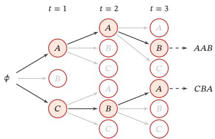
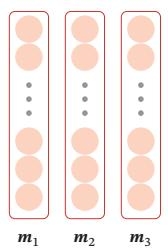
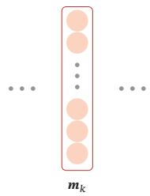
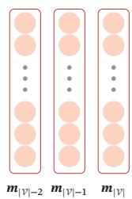
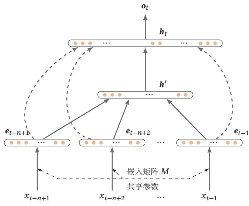
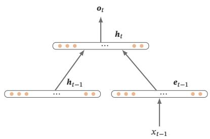
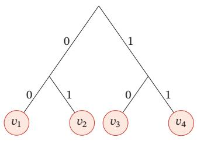
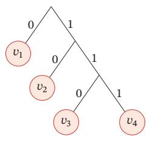
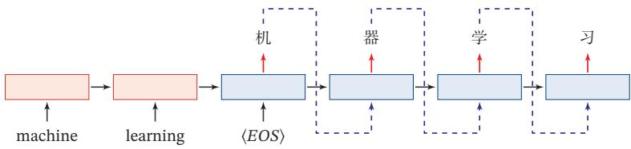
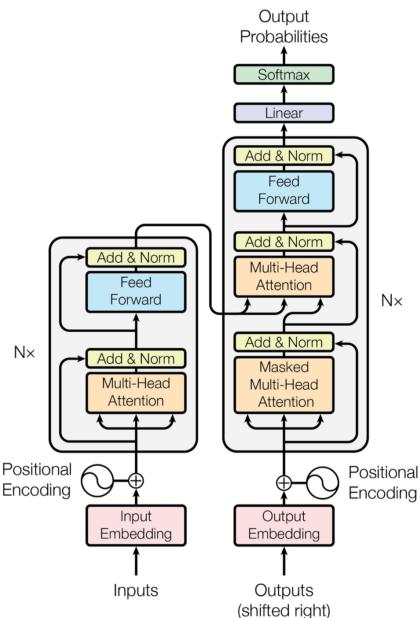

# 第15章 序列生成模型

[¶0001] 人类语言似乎是一种独特的现象，在动物世界中没有显著类似的存在

[¶0002] 诺姆·乔姆斯基（Noam Chomsky）

[¶0003] 美国语言学家、哲学家

[¶0004] 在深度学习的应用中，有很多数据是以序列的形式存在，比如声音、语言、视频、DNA序列或者其他的时序数据等．以自然语言为例，一个句子可以看作符合一定自然语言规则的词（word）的序列．在认知心理学上有一个经典的实验，让一个人看下面两个句子：

[¶0005]
$$
\begin{array} { r l } & { \mathbb { E } \hat { \mathcal { V } } \stackrel { \neq } { \in } \mathbb { E } \dot { \langle \mathcal { A } _ { \star } \mathcal { H } _ { \star } \mathcal { V } _ { \star } \mathcal { V } _ { \star } \mathcal { G } _ { \star } \mathcal { G } _ { \star } \mathcal { G } _ { \star } \rangle } , } \\ &  \mathbb { E } \hat { \mathcal { V } } \stackrel { \neq } { \in } \mathbb { E } \dot { \langle \mathcal { A } _ { \star } \mathcal { H } _ { \star } \mathcal { H } _ { \star } \mathcal { F } _ { \star } \mathcal { F } _ { \star } \mathcal { G } _ { \star } \mathcal { G } _ { \star } \mathcal { G } _ { \star } \mathcal { G } _ { \star } \mathcal { G } _ { \star } \mathcal { G } _ { \star } \mathcal { G } _ { \star } \mathcal { G } _ { \star } } \end{array}
$$

[¶0006] 这里假定语言的最基本单位为词（word），当然也可以为字或字母（character）

[¶0007] 后一个句子在人脑进行语义整合时需要更多的处理时间，说明后一个句子更不符合自然语言规则．这些语言规则包含非常复杂的语法和语义的组合关系，我们很难显式地建模这些规则．为了有效地描述自然语言规则，我们可以从统计的角度来建模．将一个长度为??的文本序列看作一个随机事件 $X _ { 1 : T } = \langle X _ { 1 } , \cdots , X _ { T } \rangle$ ，其中每个位置上的变量 $X _ { t }$ 的样本空间为一个给定的词表（vocabulary）??，整个序列 $x _ { 1 : T }$ 的样本空间为 $| \mathcal { V } | ^ { T }$ ．在某种程度上，自然语言也确实有很多随机因素比如当我们称赞一个人漂亮时，可以说“美丽”“帅”或者“好看”等．当不指定使用场合时，这几个词可以交替使用，具体使用哪个词相当于一个随机事件．一个文本序列的概率大小可以用来评估它符合自然语言规则的程度

[¶0008] 给定一个序列样本 $\pmb { x } _ { 1 : T } = x _ { 1 } , x _ { 2 } , \cdots , x _ { T }$ ，其概率是??个词的联合概率：

[¶0009]
$$
p ( \pmb { x } _ { 1 : T } ) \triangleq P ( \pmb { X } _ { 1 : T } = \pmb { x } _ { 1 : T } )\tag{15.1}
$$

[¶0010]
$$
= P ( X _ { 1 } = x _ { 1 } , X _ { 2 } = x _ { 2 } , \cdots , X _ { T } = x _ { T } ) .\tag{15.2}
$$

[¶0011] 在本章中，我们用 $X _ { t }$ 表示位置??上的随机变量， $. x _ { 1 : T }$ 表示一个序列样本， $x _ { t }$ 表示一个序列样本在位置??上的值

[¶0012] 和一般的概率模型类似，序列概率模型有两个基本问题．1）概率密度估计：给定一组序列数据，估计这些数据背后的概率分布；2）样本生成：从已知的序列分布中生成新的序列样本

[¶0013] 序列数据一般可以通过概率图模型来建模序列中不同变量之间的依赖关系．本章主要介绍在序列数据上经常使用的一种模型：自回归生成模型（Au-toRegressive Generative Model）

[¶0014] 不失一般性，本章以自然语言为例来介绍序列概率模型

## 15.1 序列概率模型

[¶0015] 序列数据有两个特点：1）样本是变长的；2）样本空间非常大．对于一个长度为??的序列，其样本空间为 $| \mathcal { V } | ^ { T }$ ．因此，我们很难用已知的概率模型来直接建模整个序列的概率

[¶0016] 根据概率的乘法公式，序列 $x _ { 1 : T }$ 的概率可以写为

[¶0017]
$$
p ( { \pmb x } _ { 1 : T } ) = p ( x _ { 1 } ) p ( x _ { 2 } | x _ { 1 } ) p ( x _ { 3 } | { \pmb x } _ { 1 : 2 } ) \cdots p \big ( x _ { t } | { \pmb x } _ { 1 : ( t - 1 ) } \big )\tag{15.3}
$$

[¶0018]
$$
= \prod _ { t = 1 } ^ { T } p \big ( x _ { t } | \pmb { x } _ { 1 : ( t - 1 ) } \big ) ,\tag{15.4}
$$

[¶0019] 其中 $x _ { t } \in \mathcal { V } , t \in \{ 1 , \cdots , T \}$ 为词表??中的一个词， $p ( x _ { 1 } | x _ { 0 } ) = p ( x _ { 1 } )$

[¶0020] 因此，序列数据的概率密度估计问题可以转换为单变量的条件概率估计问题，即给定 $\pmb { x } _ { 1 : ( t - 1 ) }$ 时 $x _ { t }$ 的条件概率 $p ( x _ { t } | \mathbf { x } _ { 1 : ( t - 1 ) } )$

[¶0021] 给定一个包含??个序列数据的数据集 $\mathcal { D } = \{ \boldsymbol { x } _ { 1 : T _ { n } } ^ { ( n ) } \} _ { n = 1 } ^ { N }$ ，序列概率模型需要学习一个模型 $p _ { \theta } ( x | \mathbf { x } _ { 1 : ( t - 1 ) } )$ 来最大化整个数据集的对数似然函数，即

[¶0022]
$$
\operatorname* { m a x } _ { \theta } \sum _ { n = 1 } ^ { N } \log p _ { \theta } \bigl ( x _ { 1 : T _ { n } } ^ { ( n ) } \bigr ) = \operatorname* { m a x } _ { \theta } \sum _ { n = 1 } ^ { N } \sum _ { t = 1 } ^ { T _ { n } } \log p _ { \theta } \bigl ( x _ { t } ^ { ( n ) } | x _ { 1 : ( t - 1 ) } ^ { ( n ) } \bigr ) .\tag{15.5}
$$

[¶0023] 在这种序列模型方式中，每一步都需要将前面的输出作为当前步的输入，是一种自回归（AutoRegressive）的方式． 因此这一类模型也称为自回归生成模型（AutoRegressive Generative Model）

[¶0024] 自 回 归 模 型 参 见第6.1.2节

[¶0025] 由于 $X _ { t } \in \mathcal { V }$ 为离散变量，我们可以假设条件概率 $p _ { \theta } \big ( x _ { t } | \mathbf { x } _ { 1 : ( t - 1 ) } \big )$ 服从多项分布，然后通过不同的模型来估计．本章主要介绍两种比较主流的自回归生成模型：N元统计模型和深度序列模型

[¶0026] 多 项 分 布 参 见第D.2.2.1节

## 15.1.1 序列生成

[¶0027] 一旦通过最大似然估计训练了模型 $p _ { \theta } ( x | \mathbf { x } _ { 1 : ( t - 1 ) } )$ ，就可以通过时间顺序来生成一个完整的序列样本．令 $\hat { x } _ { t }$ 为在第??步根据分布 $p _ { \theta } ( x | \hat { x } _ { 1 : ( t - 1 ) } )$ 生成的词，

[¶0028]
$$
\hat { x } _ { t } \sim p _ { \theta } ( x | \hat { x } _ { 1 : ( t - 1 ) } ) ,\tag{15.6}
$$

[¶0029] 其中 $\hat { \pmb { x } } _ { 1 : ( t - 1 ) } = \hat { x } _ { 1 } , \cdots , \hat { x } _ { t - 1 }$ 为前面?? − 1步中生成的前缀序列

[¶0030] 自回归的方式可以生成一个无限长度的序列．为了避免这种情况，通常会设置一个特殊的符号⟨??????⟩来表示序列的结束．在训练时，每个序列样本的结尾都加上符号⟨??????⟩．在测试时，一旦生成了符号⟨??????⟩，就中止生成过程

[¶0031] 束搜索 当使用自回归模型生成一个最可能的序列时，生成过程是一种从左到右的贪婪式搜索过程．在每一步都生成最可能的词，

[¶0032]
$$
\hat { x } _ { t } = \mathop { \arg \operatorname* { m a x } } _ { x \in \mathcal { V } } p _ { \theta } ( x | \hat { { x } } _ { 1 : ( t - 1 ) } ) ,\tag{15.7}
$$

[¶0033] 其中 $\hat { \pmb { x } } _ { 1 : ( t - 1 ) } = \hat { x } _ { 1 } , \cdots , \hat { x } _ { t - 1 }$ 为前面?? − 1步中生成的前缀序列

[¶0034] 这种贪婪式的搜索方式是次优的，生成的序列 $\hat { x } _ { 1 : T }$ 并不保证是全局最优的

[¶0035]
$$
\prod _ { t = 1 } ^ { T } \operatorname* { m a x } _ { x _ { t } \in \mathcal { V } } p _ { \theta } ( x _ { t } | \hat { x } _ { 1 : ( t - 1 ) } ) \leq \operatorname* { m a x } _ { x _ { 1 : T } \in \mathcal { V } ^ { T } } \prod _ { t = 1 } ^ { T } p _ { \theta } ( x | x _ { 1 : ( t - 1 ) } ) .\tag{15.8}
$$

[¶0036] 一种常用的减少搜索错误的启发式方法是束搜索（Beam Search）．在每一步中，生成??个最可能的前缀序列，其中??为束的大小（Beam Size），是一个超参数．图15.1给出了一个束搜索过程的示例，其中词表 $\mathcal { V } = \{ A , B , C \}$ ，束大小为2

[¶0037] 束搜索也经常称为集束搜索或柱搜索

[¶0038]
  
图15.1 束搜索过程示例

[¶0039] 束搜索的过程如下：在第1步时，生成??个最可能的词；在后面每一步中，从$K | \mathcal { V } |$ 个候选输出中选择??个最可能的序列

[¶0040] 参见习题15-5

[¶0041] 束的大小??越大，束搜索的复杂度越高，但越有可能生成最优序列．在实际应用中，束搜索可以通过调整束大小??来平衡计算复杂度和搜索质量之间的优先级．

## 15.2 N元统计模型

[¶0042] 由于数据稀疏问题，当??比较大时，依然很难估计条件概率 $p ( x _ { t } | \mathbf { x } _ { 1 : ( t - 1 ) } )$ 个简化的方法是N元模型（N-Gram Model），假设每个词 $x _ { t }$ 只依赖于其前面的?? − 1个词（??阶马尔可夫性质），即

[¶0043] 马 尔 可 夫 性 质 参 见第D.3.1节

[¶0044]
$$
p \big ( x _ { t } | \mathbf { x } _ { 1 : ( t - 1 ) } \big ) = p ( x _ { t } | \mathbf { x } _ { ( t - N + 1 ) : ( t - 1 ) } ) .\tag{15.9}
$$

[¶0045] 当?? = 1时，称为一元（Unigram）模型；当?? = 2时，称为二元（Bigram）模型，以此类推

[¶0046] 一元模型 当 ?? = 1 时，序列 $x _ { 1 : T }$ 中每个词都和其他词独立，和它的上下文无关．每个位置上的词都是从多项分布独立生成的．在多项分布中， $\theta \ =$ $[ \theta _ { 1 } , \cdots , \theta _ { \vert \mathcal { V } \vert } ]$ 为词表中每个词被抽取的概率

[¶0047] 多 项 分 布 参 见第D.2.2.1节

[¶0048] 在一元模型中，序列 $x _ { 1 : T }$ 的概率可以写为

[¶0049]
$$
p ( \pmb { x } _ { 1 : T } ; \theta ) = \prod _ { t = 1 } ^ { T } p ( \pmb { x } _ { t } ) = \prod _ { k = 1 } ^ { | \mathcal { V } | } \theta _ { k } ^ { m _ { k } } ,\tag{15.10}
$$

[¶0050] 其中 $m _ { k }$ 为词表中第??个词 $v _ { k }$ 在序列中出现的次数．公式(15.10)和标准多项分布的区别是没有多项式系数，因为这里词的顺序是给定的

[¶0051] 给定一组训练集 $\{ \pmb { x } _ { 1 : T _ { n } } ^ { ( n ) } \} _ { n = 1 } ^ { N ^ { \prime } }$ ，其对数似然函数为：

[¶0052]
$$
\begin{array} { r l r } {  { \log \prod _ { n = 1 } ^ { N ^ { \prime } } p \big ( { \pmb x } _ { 1 : T _ { n } } ^ { ( n ) } ; \theta \big ) = \log \prod _ { k = 1 } ^ { | \mathcal { V } | } \theta _ { k } ^ { m _ { k } } } } \\ & { } & { = \displaystyle \sum _ { k = 1 } ^ { | \mathcal { V } | } m _ { k } \log \theta _ { k } , } \end{array}\tag{15.11}
$$

[¶0053] (15.12)

[¶0054] 其中 $m _ { k }$ 为第??个词在整个训练集中出现的次数

[¶0055] 这样，一元模型的最大似然估计可以转化为约束优化问题：

[¶0056]
$$
\begin{array} { r l } { \displaystyle \operatorname* { m a x } _ { \theta } } & { { } \displaystyle \sum _ { k = 1 } ^ { | \mathcal { V } | } m _ { k } \log \theta _ { k } } \\ { \mathrm { s . t . ~ } } & { { } \displaystyle \sum _ { k = 1 } ^ { | \mathcal { V } | } \theta _ { k } = 1 . } \end{array}\tag{15.13}
$$

[¶0057] (15.14)

[¶0058] 引入拉格朗日乘子??，定义拉格朗日函数Λ(??, ??)为

[¶0059] 拉 格 朗 日 乘 子 参 见第C.3节

[¶0060]
$$
\Lambda ( \theta , \lambda ) = \sum _ { k = 1 } ^ { | \mathcal { V } | } m _ { k } \log \theta _ { k } + \lambda \left( \sum _ { k = 1 } ^ { | \mathcal { V } | } \theta _ { k } - 1 \right) .\tag{15.15}
$$

[¶0061] https://nndl.github.io/

[¶0062] 令

[¶0063]
$$
\frac { \partial \Lambda ( \theta , \lambda ) } { \partial \theta _ { k } } = \frac { m _ { k } } { \theta _ { k } } + \lambda = 0 , \qquad k = 1 , 2 , \cdots , | \mathcal { V } |\tag{15.16}
$$

[¶0064]
$$
{ \frac { \partial \Lambda ( \theta , \lambda ) } { \partial \lambda } } = \sum _ { k = 1 } ^ { | \mathcal { V } | } \theta _ { k } - 1 = 0 .\tag{15.17}
$$

[¶0065] 求解上述方程得到 $\begin{array} { r } { \lambda = - \sum _ { k = 1 } ^ { | V | } m _ { k } } \end{array}$ ，进一步得到

[¶0066]
$$
\theta _ { k } = \frac { m _ { k } } { \sum _ { k ^ { \prime } = 1 } ^ { | \mathcal { V } | } m _ { k ^ { \prime } } } = \frac { m _ { k } } { \bar { m } } ,\tag{15.18}
$$

[¶0067] 其中 $\begin{array} { r } { \bar { m } = \sum _ { k ^ { \prime } = 1 } ^ { | \mathcal { V } | } m _ { k ^ { \prime } } } \end{array}$ 为文档集合的长度．因此，最大似然估计等价于频率估计N元模型 同理，N元模型中的条件概率 $p ( x _ { t } | \pmb { x } _ { ( t - N + 1 ) : ( t - 1 ) } )$ 也可以通过最大似然函数得到

[¶0068]
$$
p ( x _ { t } | \mathbf { x } _ { ( t - N + 1 ) : ( t - 1 ) } ) = \frac { \mathrm { m } \big ( \mathbf { x } _ { ( t - N + 1 ) : t } \big ) } { \mathrm { m } \big ( \mathbf { x } _ { ( t - N + 1 ) : ( t - 1 ) } \big ) } ,\tag{15.19}
$$

[¶0069] 参见习题15-1

[¶0070] 其中 $\mathrm { m } ( \pmb { x } _ { ( t - N + 1 ) : t } )$ 为 $\pmb { x } _ { ( t - N + 1 ) }$ 在数据集中出现的次数

[¶0071] N元模型广泛应用于各种自然语言处理问题，如语音识别、机器翻译、拼音输入法、字符识别等．通过N元模型，我们可以计算一个序列的概率，从而判断该序列是否符合自然语言的语法和语义规则

[¶0072] 平滑技术 N元模型的一个主要问题是数据稀疏问题．数据稀疏问题在基于统计的机器学习中是一个常见的问题，主要是由于训练样本不足而导致密度估计不准确．在一元模型中，如果一个词??在训练数据集中不存在，就会导致任何包含??的句子的概率都为0．同样在N元模型中，当一个N元组合在训练数据集中不存在时，包含这个组合的句子的概率为0

[¶0073] 数据稀疏问题最直接的解决方法就是增加训练数据集的规模，但其边际效益会随着数据集规模的增加而递减．以自然语言为例，大多数自然语言都服从Zipf定律（Zipf’s Law）：“在一个给定自然语言数据集中，一个单词出现的频率与它在频率表里的排名成反比．出现频率最高的单词的出现频率大约是出现频率第二位的单词的2倍，大约是出现频率第三位的单词的3倍．”因此，在自然语言中大部分的词都是低频词，很难通过增加数据集来避免数据稀疏问题

[¶0074] Zipf定律是美国语言学家 George K. Zipf 提出的实验定律

[¶0075] 数据稀疏问题的一种解决方法是平滑技术（Smoothing），即给一些没有出现的词组合赋予一定先验概率．平滑技术是N元模型中一项必不可少的技术，比如加法平滑的计算公式为

[¶0076]
$$
p \big ( x _ { t } | \pmb { x } _ { ( t - N + 1 ) : ( t - 1 ) } \big ) = \frac { \mathrm { m } \big ( \pmb { x } _ { ( t - N + 1 ) : t } \big ) + \delta } { \mathrm { m } \big ( \pmb { x } _ { ( t - N + 1 ) : ( t - 1 ) } \big ) + \delta | \mathcal { V } | } ,\tag{15.20}
$$

[¶0077] https://nndl.github.io/

[¶0078] 其中 $\delta \in ( 0 , 1 ]$ 为常数．?? = 1时，称为加1平滑

[¶0079] 除了加法平滑，还有很多平滑技术，比如 Good-Turing平滑、Kneser-Ney 平滑等，其基本思想都是增加低频词的频率，而降低高频词的频率

[¶0080] 参见习题15-2

## 15.3 深度序列模型

[¶0081] 深度序列模型（Deep Sequence Model）是指利用神经网络模型来估计条件概率 $p _ { \theta } ( x _ { t } | \mathbf { x } _ { 1 : ( t - 1 ) } )$ ．假设一个神经网络 $f ( \cdot ; \theta )$ ，其输入为历史信息 $\tilde { h } _ { t } = x _ { 1 : ( t - 1 ) }$ 输出为词表??中的每个词 $v _ { k } ( 1 \leq k \leq | \mathcal { V } | )$ 出现的概率，并满足

[¶0082]
$$
\sum _ { k = 1 } ^ { | \nu | } f _ { k } \big ( \pmb { x } _ { 1 : ( t - 1 ) } ; \theta \big ) = 1 ,\tag{15.21}
$$

[¶0083] 其中??表示网络参数．条件概率 $p _ { \theta } \big ( x _ { t } | \mathbf { x } _ { 1 : ( t - 1 ) } \big )$ 可以从神经网络的输出中得到：

[¶0084]
$$
\begin{array} { r } { p _ { \theta } \big ( x _ { t } | \pmb { x } _ { 1 : ( t - 1 ) } \big ) = f _ { k _ { x _ { t } } } \big ( \pmb { x } _ { 1 : ( t - 1 ) } ; \theta \big ) , } \end{array}\tag{15.22}
$$

[¶0085] 其中 $k _ { x _ { t } }$ 为 $x _ { t }$ 在词表??中的索引

## 15.3.1 模型结构

[¶0086] 深度序列模型一般可以分为三个模块：嵌入层、特征层、输出层

## 15.3.1.1 嵌入层

[¶0087] 这里的层泛指神经网络模块（Module），可以由一个或多个神经层组成

[¶0088] 令 $\tilde { h } _ { t } \ = \ x _ { 1 : ( t - 1 ) }$ 表示输入的历史信息，一般为符号序列．由于神经网络模型一般要求输入形式为实数向量，因此为了使得神经网络模型能处理符号数据，需要将这些符号转换为向量形式．一种简单的转换方法是通过一个嵌入表（Embedding Lookup Table）来将每个符号直接映射成向量表示．嵌入表也称为嵌入矩阵或查询表．图15.2是嵌入矩阵的示例

[¶0089]


[¶0090]
  
图15.2 嵌入矩阵

[¶0091]


[¶0092] 令 $M \in \mathbb { R } ^ { D _ { x } \times | \mathcal { V } | }$ 为嵌入矩阵，其中第??列向量 ${ \pmb m } _ { k } \in \mathbb { R } ^ { D _ { x } }$ 表示词表中第??个词对应的向量表示．假设词 $x _ { t }$ 对应词表中的索引为??，则其one-hot向量表示为$\delta _ { t } \in \{ 0 , 1 \} ^ { | \mathcal { V } | }$ ，即第??维为1，其余为0的|??|维向量．词 $x _ { t }$ 对应的向量表示为

[¶0093]
$$
\begin{array} { r } { \pmb { e } _ { t } = M \delta _ { t } = \pmb { m } _ { k } . } \end{array}\tag{15.23}
$$

[¶0094] 通过上面的映射可以得到序列 $x _ { 1 : ( t - 1 ) }$ 对应的向量序列 $\boldsymbol { e } _ { 1 } , \cdots , \boldsymbol { e } _ { t - 1 }$

## 15.3.1.2 特征层

[¶0095] 特征层用于从输入向量序列 $\pmb { e } _ { 1 } , \cdots , \pmb { e } _ { t - 1 }$ 中提取特征，输出为一个可以表示历史信息的向量 $\pmb { h } _ { t }$

[¶0096] 特征层可以通过不同类型的神经网络（比如前馈神经网络和循环神经网络等）来实现．常见的网络类型有以下三种：

## （1）简单平均

[¶0097] 历史信息的向量 $\pmb { h } _ { t }$ 为前面?? − 1个词向量的平均，即

[¶0098]
$$
\pmb { h } _ { t } = \sum _ { i = 1 } ^ { t - 1 } \alpha _ { i } \pmb { e } _ { i } ,\tag{15.24}
$$

[¶0099] 其中 $\alpha _ { i }$ 为每个词的权重

[¶0100] 权重 $\alpha _ { i }$ 可以和位置??及其表示 $\mathbf { \boldsymbol { e } } _ { i }$ 相关，也可以无关．为简单起见，可以设置$\begin{array} { r } { \alpha _ { i } = \frac { 1 } { t - 1 } } \end{array}$ ．权重 $\alpha _ { i }$ 也可以通过注意力机制来动态计算

[¶0101] 注 意 力 机 制 参 见第8.2节参见习题15-3

## （2）前馈神经网络

[¶0102] 前馈神经网络要求输入的大小是固定的．因此，和N元模型类似，假设历史信息只包含前面?? − 1个词．首先将这?? − 1个词向量 $\pmb { e } _ { t - N + 1 } , \cdots , \pmb { e } _ { t - 1 }$ 拼接成一个 $D _ { x } \times \left( N - 1 \right)$ 维的向量 $\pmb { h } ^ { \prime }$ ，即

[¶0103] ??为超参数

[¶0104]
$$
\pmb { h } ^ { \prime } = \pmb { e } _ { t - N + 1 } \oplus \cdots \oplus \pmb { e } _ { t - 1 } ,\tag{15.25}
$$

[¶0105] 其中⊕表示向量拼接操作

[¶0106] 然后将 $\pmb { h } ^ { \prime }$ 输入到由前馈神经网络构成的隐藏层，最后一层隐藏层的输出 $\pmb { h } _ { t }$ 即

[¶0107]
$$
\pmb { h } _ { t } = g ( \pmb { h } ^ { \prime } ; \theta _ { g } ) ,\tag{15.26}
$$

[¶0108] 其中 $g ( \cdot ; \theta _ { g } )$ 可以为全连接的前馈神经网络或卷积神经网络， $\theta _ { g }$ 为网络参数

[¶0109] 为了增加特征的多样性和提高模型训练效率，前馈神经网络中也可以包含跳层连接（Skip-Layer Connection）[Bengio et al., 2003]，比如

[¶0110]
$$
\begin{array} { r } { \pmb { h } _ { t } = \pmb { h } ^ { \prime } \oplus \mathrm { g } ( \pmb { h } ^ { \prime } ; \theta _ { \mathrm { g } } ) . } \end{array}\tag{15.27}
$$

[¶0111] https://nndl.github.io/跳层连接是指前馈神经网络中的某一神经层可以接受来自非相邻的低层信息，其思想和残差网络中的直连边并不完全一样．残差网络参见第5.4.4节

## （3）循环神经网络

[¶0112] 和前馈神经网络不同，循环神经网络可以接受变长的输入序列，依次接受输入 $\pmb { e } _ { 1 } , \cdots , \pmb { e } _ { t - 1 }$ ，得到时刻??的隐藏状态

[¶0113]
$$
\pmb { h } _ { t } = g ( \pmb { h } _ { t - 1 } , \pmb { e } _ { t } ; \theta _ { g } ) ,\tag{15.28}
$$

[¶0114] 其中 $g ( \cdot )$ 为一个非线性函数， $\theta _ { g }$ 为循环神经网络的参数， $\pmb { h } _ { 0 } = 0$

[¶0115] 前馈神经网络模型和循环神经网络模型的不同之处在于循环神经网络利用隐藏状态来记录以前所有时刻的信息，而前馈神经网络只能接受前?? − 1个时刻的信息．

## 15.3.1.3 输出层

[¶0116] 输出层一般使用Softmax分类器，接受历史信息的向量表示 $\pmb { h } _ { t } \in \mathbb { R } ^ { D _ { h } }$ ，输出为词表中每个词的后验概率，输出大小为|??|

[¶0117]
$$
\mathbf { \delta } \mathbf { 0 } _ { t } = \mathrm { s o f t m a x } ( \hat { \mathbf { o } } _ { t } )\tag{15.29}
$$

[¶0118]
$$
= \mathrm { s o f t m a x } ( \boldsymbol { W } \boldsymbol { h } _ { t } + \boldsymbol { b } ) ,\tag{15.30}
$$

[¶0119] 其中输出向量 $\mathbf { \pmb { \sigma } } _ { t } \in ( 0 , 1 ) ^ { | \mathcal { V } | }$ 为预测的概率分布，第??维是词表中第??个词出现的条件概率； $\hat { \mathbf { o } } _ { t }$ 是未归一化的得分向量； $W \in$ ℝ $| { \mathcal { V } } | { \times } D _ { h }$ 是最后一层隐藏层到输出层直接的权重矩阵， $\pmb { b } \in$ ℝ|??| 为偏置

[¶0120] 图15.3给出了两种不同的深度序列模型，图15.3a为前馈神经网络模型（虚线边为可选的跳层连接），图15.3b为循环神经网络模型

[¶0121]
  
(a)前馈神经网络模型

[¶0122]
  
(b)循环神经网络模型  
图15.3 深度序列模型

## 15.3.2 参数学习

[¶0123] 给定一个训练序列 $\pmb { x } _ { 1 : T }$ ，深度序列模型的训练目标是找到一组参数??使得对数似然函数最大

[¶0124] 简要起见，这里忽略了正则化项

[¶0125]
$$
\log p _ { \theta } ( \pmb { x } _ { 1 : T } ) = \sum _ { t = 1 } ^ { T } \log p _ { \theta } \big ( x _ { t } | \pmb { x } _ { 1 : ( t - 1 ) } \big ) ,\tag{15.31}
$$

[¶0126] 其中??表示网络中的所有参数，包括嵌入矩阵??以及神经网络的权重和偏置

[¶0127] 网络参数一般通过梯度上升法来学习，

[¶0128]
$$
\theta \gets \theta + \alpha \frac { \partial \log p _ { \theta } ( \pmb { x } _ { 1 : T } ) } { \partial \theta } ,\tag{15.32}
$$

[¶0129] 其中??为学习率

## 15.4 评价方法

[¶0130] 构造一个序列生成模型后，需要有一个度量来评价其好坏

## 15.4.1 困惑度

[¶0131] 给定一个测试文本集合，一个好的序列生成模型应该使得测试集合中句子的联合概率尽可能高

[¶0132] 困惑度（Perplexity）是信息论中的一个概念，可以用来衡量一个分布的不确定性．对于离散随机变量 $X \in \mathcal X$ ，其概率分布为 $p ( x )$ ，困惑度为

[¶0133]
$$
2 ^ { H \left( p \right) } = 2 ^ { - \sum _ { x \in \mathcal { X } } p \left( x \right) \log _ { 2 } p \left( x \right) } ,\tag{15.33}
$$

[¶0134] 其中 $\pmb { H } ( p )$ 为分布 $p$ 的熵

[¶0135] 困惑度也可以用来衡量两个分布之间差异．对于一个未知的数据分布 $p _ { r } ( x )$ 和一个模型分布 $p _ { \theta } ( x )$ ，我们从 $p _ { r } ( x )$ 中采样出一组测试样本 ${ x ^ { ( 1 ) } , \cdots , x ^ { ( N ) } }$ ，模型分布 $p _ { \theta } ( x )$ 的困惑度为

[¶0136]
$$
2 ^ { H ( \tilde { p } _ { r } , p _ { \theta } ) } = 2 ^ { - \frac { 1 } { N } \sum _ { n = 1 } ^ { N } \log _ { 2 } p _ { \theta } ( x ^ { ( n ) } ) } ,\tag{15.34}
$$

[¶0137] 其中 $\pmb { H } ( \tilde { p } _ { r } , p _ { \theta } )$ 为样本的经验分布 ${ \tilde { p } } _ { r }$ 与模型分布 $p _ { \theta }$ 之间的交叉熵，也是所有样本上的负对数似然函数

[¶0138] 困惑度可以衡量模型分布与样本经验分布之间的契合程度．困惑度越低则两个分布越接近．因此，模型分布 $p _ { \theta } ( x )$ 的好坏可以用困惑度来评价

[¶0139] 假设测试集合有??个独立同分布的序列 $\{ \pmb { x } _ { 1 : T _ { n } } ^ { ( n ) } \} _ { n = 1 } ^ { N }$ ．我们可以用模型 $p _ { \theta } ( { \pmb x } )$ 对每个序列计算其概率 $p _ { \theta } ( \pmb { x } _ { 1 : T _ { n } } ^ { ( n ) } )$ ，整个测试集的联合概率为

[¶0140]
$$
\prod _ { n = 1 } ^ { N } p _ { \boldsymbol { \theta } } \big ( \boldsymbol x _ { 1 : T _ { n } } ^ { ( n ) } \big ) = \prod _ { n = 1 } ^ { N } \prod _ { t = 1 } ^ { T _ { n } } p _ { \boldsymbol { \theta } } \big ( \boldsymbol x _ { t } ^ { ( n ) } | \boldsymbol x _ { 1 : ( t - 1 ) } ^ { ( n ) } \big ) .\tag{15.35}
$$

[¶0141] 模型 $p _ { \theta } ( { \pmb x } )$ 的困惑度定义为

[¶0142]
$$
\begin{array} { r } { \mathrm { P P L } ( \theta ) = 2 ^ { - \frac { 1 } { T } \sum _ { n = 1 } ^ { N } \log _ { 2 } p _ { \theta } \left( x _ { 1 : T _ { n } } ^ { ( n ) } \right) } } \end{array}\tag{15.36}
$$

[¶0143]
$$
\begin{array} { r } { = 2 ^ { - \frac { 1 } { T } \sum _ { n = 1 } ^ { N } \sum _ { t = 1 } ^ { T n } \log _ { 2 } p _ { \theta } \left( x _ { t } ^ { ( n ) } | x _ { 1 : ( t - 1 ) } ^ { ( n ) } \right) } } \end{array}\tag{15.37}
$$

[¶0144]
$$
= \left( \prod _ { n = 1 } ^ { N } \prod _ { t = 1 } ^ { T _ { n } } p _ { \theta } \big ( x _ { t } ^ { ( n ) } | \pmb { x } _ { 1 : ( t - 1 ) } ^ { ( n ) } \big ) \right) ^ { - 1 / T } ,\tag{15.38}
$$

[¶0145] 其中 $\begin{array} { r } { T = \sum _ { n = 1 } ^ { N } T _ { n } } \end{array}$ 为测试数据集中序列的总长度．可以看出，困惑度为每个词条件概率 $p _ { \theta } \big ( x _ { t } ^ { ( n ) } | \mathbf { x } _ { 1 : ( t - 1 ) } ^ { ( n ) } \big )$ 的几何平均数的倒数．测试集中所有序列的概率越大，困惑度越小，模型越好

[¶0146] 假设一个序列模型赋予每个词出现的概率均等，即 $\begin{array} { r } { p _ { \theta } \big ( x _ { t } ^ { ( n ) } | \pmb { x } _ { 1 : ( t - 1 ) } ^ { ( n ) } \big ) = \frac { 1 } { | \mathcal { V } | } } \end{array}$ 则该模型的困惑度为|??|．以英语为例，N元模型的困惑度范围一般为 $5 0 \sim 1 0 0 0$

[¶0147] 几 何 平 均 数 是 一 种求 数 值 平 均 数 的 方法，计算公式为： $\bar { x } =$ $\textstyle { \sqrt [ n ] { \prod _ { t = 1 } ^ { n } x _ { t } } }$

## 15.4.2 BLEU 算法

[¶0148] BLEU（BiLingual Evaluation Understudy）算法是一种衡量模型生成序列和参考序列之间的N元词组（N-Gram）重合度的算法，最早用来评价机器翻译模型的质量，目前也广泛应用在各种序列生成任务中

[¶0149] 令??为从模型分布 $p _ { \theta }$ 中生成的一个候选（Candidate）序列， $\pmb { s } ^ { ( 1 ) } , \cdots , \pmb { s } ^ { ( K ) }$ 为从真实数据分布中采集的一组参考（Reference）序列，??为从生成的候选序列中提取所有N元组合的集合，这些N元组合的精度（Precision）

[¶0150]
$$
P _ { N } ( \pmb { x } ) = \frac { \displaystyle \sum _ { w \in \mathcal { W } } \operatorname* { m i n } \left( c _ { w } ( \pmb { x } ) , \underset { k = 1 } { \overset { K } { \operatorname* { m a x } } } c _ { w } ( \pmb { s } ^ { ( k ) } ) \right) } { \displaystyle \sum _ { w \in \mathcal { W } } c _ { w } ( \pmb { x } ) } ,\tag{15.39}
$$

[¶0151] 其中 $c _ { w } ( \pmb { x } )$ 是N元组合 $w$ 在生成序列 $_ x$ 中出现的次数， $c _ { w } ( \pmb { s } ^ { ( k ) } )$ 是N元组合 $w$ 在参考序列 $\pmb { s } ^ { ( k ) }$ 中出现的次数．N元组合的精度 $P _ { N } ( { \pmb x } )$ 是计算生成序列中的N元组合有多少比例在参考序列中出现

[¶0152] 由于精度只衡量生成序列中的N元组合是否在参考序列中出现，生成序列越短，其精度会越高，因此可以引入长度惩罚因子(Brevity Penalty)．如果生成序https://nndl.github.io/

[¶0153] 列的长度短于参考序列，就对其进行惩罚

[¶0154]
$$
b ( \pmb { x } ) = \left\{ \begin{array} { c c c } { 1 } & { \mathrm { i f } } & { l _ { x } > l _ { s } } \\ { \exp \big ( 1 - l _ { s } / l _ { x } \big ) } & { \mathrm { i f } } & { l _ { x } \le l _ { s } } \end{array} \right.\tag{15.40}
$$

[¶0155] 其中 $l _ { x }$ 为生成序列??的长度， $l _ { s }$ 为参考序列的最短长度

[¶0156] BLEU算法是通过计算不同长度的N元组合 $( N = 1 , 2 , \cdots )$ 的精度，并进行几何加权平均而得到

[¶0157]
$$
\mathrm { B L E U - N } ( { \boldsymbol { \mathbf { x } } } ) = b ( { \boldsymbol { \mathbf { x } } } ) \times \exp \big ( \sum _ { N = 1 } ^ { N ^ { \prime } } \alpha _ { N } \log P _ { N } \big ) ,\tag{15.41}
$$

[¶0158] 其中 $N ^ { \prime }$ 为最长N元组合的长度， $\alpha _ { N }$ 为不同N元组合的权重，一般设为 $\frac { 1 } { N ^ { \prime } }$ ．BLEU算法的值域范围是[0, 1]，越大表明生成的质量越好．但是BLEU算法只计算精度，而不关心召回率（即参考序列里的N元组合是否在生成序列中出现）

[¶0159] 参见习题15-4

## 15.4.3 ROUGE算法

[¶0160] ROUGE（Recall-Oriented Understudy for Gisting Evaluation）算法最早应用于文本摘要领域．和BLEU算法类似，但ROUGE算法计算的是召回率（Re-call）

[¶0161] 令??为从模型分布 $p _ { \theta }$ 中生成的一个候选序列， $\pmb { s } ^ { ( 1 ) } , \cdots , \pmb { s } ^ { ( K ) }$ 为从真实数据分布中采样出的一组参考序列，??为从参考序列中提取N元组合的集合，ROUGE-N算法的定义为

[¶0162]
$$
\mathrm { R O U G E - N } ( \pmb { x } ) = \frac { \displaystyle \sum _ { k = 1 } ^ { K } \sum _ { w \in \mathcal { W } } \operatorname* { m i n } \left( c _ { w } ( \pmb { x } ) , c _ { w } \big ( \pmb { s } ^ { ( k ) } \big ) \right) } { \displaystyle \sum _ { k = 1 } ^ { K } \sum _ { w \in \mathcal { W } } c _ { w } \big ( \pmb { s } ^ { ( k ) } \big ) } ,\tag{15.42}
$$

[¶0163] 其中 $c _ { w } ( { \pmb x } )$ 是N元组合??在生成序列??中出现的次数， $c _ { w } ( \pmb { s } ^ { ( k ) } )$ 是N元组合??在参考序列 $\pmb { s } ^ { ( k ) }$ 中出现的次数

## 15.5 序列生成模型中的学习问题

[¶0164] 使用最大似然估计来学习自回归序列生成模型时，会存在以下三个主要问题：曝光偏差问题、训练目标不一致问题和计算效率问题．下面我们分别介绍这三个问题以及解决方法

## 15.5.1 曝光偏差问题

[¶0165] 在自回归生成模型中，第??步的输入为模型生成的前缀序列 $\hat { x } _ { 1 : ( t - 1 ) }$ ．而在训练时，我们使用的前缀序列是训练集中的真实数据 $\pmb { x } _ { 1 : ( t - 1 ) }$ ，而不是模型预测的 $\hat { x } _ { 1 : ( t - 1 ) }$ ．这种学习方式也称为教师强制（Teacher Forcing）[Williams et al.,1989]

[¶0166] 这种教师强制的学习方式存在协变量偏移问题．在训练时，每步的输入$\pmb { x } _ { 1 : ( t - 1 ) }$ 来自于真实数据分布 $p _ { r } \big ( { \pmb x } _ { 1 : ( t - 1 ) } \big )$ ；而在测试时，每步的输入 $\hat { x } _ { 1 : ( t - 1 ) }$ 来自于模型分布 $p _ { \theta } \big ( { \pmb x } _ { 1 : ( t - 1 ) } \big )$ ．由于模型分布 $p _ { \theta } \big ( { \pmb x } _ { 1 : ( t - 1 ) } \big )$ 和真实数据分布 $p _ { r } \big ( { \pmb x } _ { 1 : ( t - 1 ) } \big )$ 并不严格一致，因此存在协变量偏移问题．一旦在预测前缀 $\hat { x } _ { 1 : ( t - 1 ) }$ 的过程中存在错误，会导致错误传播，使得后续生成的序列也会偏离真实分布．这个问题称为曝光偏差（Exposure Bias）问题

[¶0167] 协变量偏移问题参见第10.4.2节

[¶0168] 计划采样 为了缓解曝光偏差问题，我们可以在训练时混合使用真实数据和模型生成数据．在第??步时，模型随机使用真实数据 $x _ { t - 1 }$ 或前一步生成的词 $\hat { x } _ { t - 1 }$ 作为输入

[¶0169] 令 $\epsilon \in [ 0 , 1 ]$ 为一个控制替换率的超参数，在每一步时，以 $\epsilon$ 的概率使用真实数据 $x _ { t - 1 }$ ，以 $1 - \epsilon$ 的概率使用生成数据 $\hat { x } _ { t - 1 }$ ．当令 $\epsilon = 1$ 时，训练和最大似然估计一样，使用真实数据；当令 $\epsilon = 0$ 时，训练时全部使用模型生成数据

[¶0170] 直觉上，如果一开始训练时的??过小，模型相当于在噪声很大的数据上训练，会导致模型性能变差，并且难以收敛．因此，一个较好的策略是在训练初期赋予 $\epsilon$ 较大的值，随着训练次数的增加逐步减小 $\epsilon$ 的取值．这种策略称为计划采样（Scheduled Sampling）[Bengio et al., 2015]

[¶0171] 令 $\epsilon _ { i }$ 为在第??次迭代时的替换率，在计划采样中可以通过下面几种方法来逐步减小??的取值

[¶0172] （1） 线性衰减： $\epsilon _ { i } = \operatorname* { m a x } ( \epsilon , k - c i )$ ，其中 $\boldsymbol { \epsilon }$ 为最小的替换率，??和 $c$ 分别为初始值和衰减率

[¶0173] （2） 指数衰减： $\epsilon _ { i } = k ^ { i }$ ，其中 $k < 1$ 为初始替换率

[¶0174] （3） 逆Sigmoid衰减： $\epsilon _ { i } = k / ( k + \exp ( i / k ) )$ ，其中 $k \geq 1$ 来控制衰减速度

[¶0175] 计划采样的一个缺点是过度纠正，即在每一步中不管输入如何选择，目标输出依然是来自于真实数据．这可能使得模型预测一些不正确的序列．比如一个真实的序列是“吃饭”，如果在第一步生成时使用模型预测的词是“喝”，模型就会强制记住“喝饭”这个不正确的序列

## 15.5.2 训练目标不一致问题

[¶0176] 序列生成模型的好坏通常采用和任务相关的指标来进行评价，比如BLEU、ROUGE等．然而，在训练时通常是使用最大似然估计来优化模型，这导致训练目标和评价方法不一致．并且这些评价指标一般都是不可微的，无法直接使用基于梯度的方法来进行优化

[¶0177] 基于强化学习的序列生成 为了可以直接优化评价目标，我们可以将自回归序列生成看作一种马尔可夫决策过程，并使用强化学习的方法来进行训练

[¶0178] 参见第14.1.3节

[¶0179] 在第??步，动作 $a _ { t }$ 可以看作从词表中选择一个词，策略为 $\pi _ { \theta } ( a | s _ { t } )$ ，其中状态$s _ { t }$ 为之前步骤中生成的前缀序列 $\pmb { x } _ { 1 : ( t - 1 ) }$ ．我们可以把一个序列 $x _ { 1 : T }$ 看作马尔可夫决策过程的一个轨迹（trajectory）：

[¶0180]
$$
\tau = \{ s _ { 1 } , a _ { 1 } , s _ { 2 } , a _ { 2 } , . . . , s _ { T } , a _ { T } \} .\tag{15.43}
$$

[¶0181] 轨迹 $\tau$ 的概率为

[¶0182]
$$
p _ { \theta } ( \tau ) = \prod _ { t = 1 } ^ { T } \pi _ { \theta } \big ( a _ { t } = x _ { t } | s _ { t } = \mathbf { x } _ { 1 : ( t - 1 ) } \big ) ,\tag{15.44}
$$

[¶0183] 其中状态转移概率 $p \big ( s _ { t } = \mathbf { x } _ { 1 : t - 1 } | s _ { t - 1 } = \mathbf { x } _ { 1 : ( t - 2 ) } , a _ { t - 1 } = x _ { t - 1 } \big ) = 1$ 是确定性的，可以被忽略

[¶0184] 强化学习的目标是学习一个策略 $\pi _ { \boldsymbol { \theta } } ( \boldsymbol { a } | \boldsymbol { s } _ { t } )$ 使得期望回报最大，

[¶0185]
$$
\mathcal { J } ( \theta ) = \mathbb { E } _ { \tau \sim p _ { \theta } ( \tau ) } [ G ( \tau ) ]\tag{15.45}
$$

[¶0186]
$$
= \mathbb { E } _ { { x _ { 1 : T } } \sim { p _ { \theta } ( x _ { 1 : T } ) } } [ G ( { x _ { 1 : T } } ) ] ,\tag{15.46}
$$

[¶0187] 其中 $G ( \pmb { x } _ { 1 : T } )$ 为序列 $\pmb { x } _ { 1 : T }$ 的总回报，可以为BLEU、ROUGE或其他评价指标

[¶0188] 这样，序列生成问题就转换为强化学习问题，其策略函数 $\pi _ { \theta } ( a | s _ { t } )$ 可以通过REINFORCE算法或演员-评论员算法来进行学习．为了改进强化学习的效率，策略函数 $\pi _ { \theta } ( a | s _ { t } )$ 一般会通过最大似然估计来进行预训练

[¶0189] 基于强化学习的序列生成模型不但可以解决训练和评价目标不一致问题，也可以有效地解决曝光偏差问题

## 15.5.3 计算效率问题

[¶0190] 序列生成模型的输出层为词表中所有词的条件概率，需要Softmax归一化当词表比较大时，计算效率比较低

[¶0191] 在第??步时，前缀序列为 $\tilde { h } _ { t } = x _ { 1 : ( t - 1 ) }$ ，词 $x _ { t }$ 的条件概率为

[¶0192]
$$
\begin{array} { r } { s ( x _ { t } , \tilde { h } _ { t } ; \theta ) = [ \hat { \pmb { \sigma } } _ { t } ] _ { k _ { x _ { t } } } , } \end{array}
$$

[¶0193]
$$
p _ { \theta } ( x _ { t } | \tilde { h } _ { t } ) = \mathrm { s o f t m a x } \left( s ( x _ { t } , \tilde { h } _ { t } ; \theta ) \right)\tag{15.47}
$$

[¶0194] $\hat { \mathbf { o } } _ { t }$ 为未归一化的网络输出， $k _ { x _ { t } }$ 为 $x _ { t }$ 在词表?? 中 的 索 引，参 见 公式(15.29)

[¶0195] https://nndl.github.io/

[¶0196]
$$
= \frac { \exp \left( s ( x _ { t } , \tilde { h } _ { t } ; \theta ) \right) } { \sum _ { v \in \mathcal { V } } \exp \left( s ( v , \tilde { h } _ { t } ; \theta ) \right) } ,\tag{15.48}
$$

[¶0197]
$$
= \frac { \exp \left( s ( x _ { t } , \tilde { h } _ { t } ; \theta ) \right) } { Z ( \tilde { h } _ { t } ; \theta ) } ,\tag{15.49}
$$

[¶0198] 其中 $s ( x _ { t } , \tilde { h } _ { t } ; \theta )$ 为未经过Softmax归一化的得分函数， $Z ( \tilde { h } _ { t } ; \theta )$ 为配分函数（Par-tition Function）：

[¶0199] 配 分 函 数 参 见第11.1.4节

[¶0200]
$$
Z ( \tilde { h } _ { t } ; \theta ) = \sum _ { v \in \mathcal { V } } \exp \big ( s ( v , \tilde { h } _ { t } ; \theta ) \big ) .\tag{15.50}
$$

[¶0201] 配分函数的计算需要对词表中所有的词??计算 $s ( v , \tilde { h } _ { t } ; \theta )$ 并求和．当词表比较大时，计算开销非常大．比如在自然语言中，词表??的规模一般在1万到10万之间．在训练时，每个样本都要计算一次配分函数，这样每一轮迭代需要计算??次配分函数（??为训练文本长度），导致整个训练过程变得十分耗时．因此在实践中，我们通常采用一些近似估计的方法来加快训练速度．常用的方法可以分为两类：1）层次化的Softmax方法，将标准Softmax函数的扁平结构转换为层次化结构；2）基于采样的方法，通过采样来近似计算更新梯度

[¶0202] 本节介绍三种加速训练速度的方法：层次化Softmax、重要性采样和噪声对比估计

## 15.5.3.1 层次化 Softmax

[¶0203] 我们先来考虑使用两层的树结构来组织词表，即将词表中的词分成??组，并且每一个词只能属于一个分组，每组大小为 $\frac { | \mathcal { V } | } { K }$ ．假设词??所属的组为 $c ( w )$ ，则

[¶0204]
$$
p ( w | \tilde { h } ) = p ( w , c ( w ) | \tilde { h } )\tag{15.51}
$$

[¶0205]
$$
= p ( w | c ( w ) , \tilde { h } ) p ( c ( w ) | \tilde { h } ) ,\tag{15.52}
$$

[¶0206] 其中 $p ( c ( w ) | \tilde { h } )$ 是给定历史信息 $\tilde { h }$ 条件下，类 $c ( w )$ 的后验概率， $p ( w | c ( w ) , \tilde { h } )$ 是给定历史信息 $\tilde { h }$ 和类??(??)条件下，词??的后验概率．因此，一个词的概率可以分解为两个概率 $p ( w | c ( w ) , \tilde { h } )$ 和 $p ( c ( w ) | \tilde { h } )$ 的乘积，它们可以分别利用神经网络来估计，这样计算Softmax函数时分别只需要做 $\frac { | \mathcal { V } | } { K }$ 和??次求和，从而大大提高了Softmax函数的计算速度

[¶0207] 一般对于词表大小 $\lvert \mathcal { V } \rvert$ ，我们将词平均分到 $\sqrt { | \mathcal { V } | }$ 个分组中，每组 $\sqrt { | \mathcal { V } | }$ 个词这样通过一层的分组，我们可以将Softmax计算加速 $\scriptstyle { \frac { 1 } { 2 } } { \sqrt { | { \mathcal { V } } | } }$ 倍．比如当词表大小为40, 000时，将词表中所有词分到200组，每组200个词．这样只需要计算两次200 类的 Softmax，比直接计算 40, 000 类的 Softmax 加快 100 倍

[¶0208] 为了进一步降低Softmax函数的计算复杂度，我们可以使用更深层的树结构来组织词汇表．假设用二叉树来组织词表中的所有词，二叉树的叶子节点代表https://nndl.github.io/

[¶0209] 词表中的词，非叶子节点表示不同层次上的类别．图15.4给出了平衡二叉树和霍夫曼编码二叉树的示例

[¶0210]
  
(a) 平衡树

[¶0211]
  
(b)霍夫曼编码树  
图15.4 层次化树结构

[¶0212] 如果我们将二叉树上所有左连边标记为0，右连边标记为1．每一个词可以用根节点到它所在的叶子之间路径上的标记来进行编码．图15.4a中所示的四个词的编码分别为：

[¶0213]
$$
v _ { 1 } = 0 0 , \qquad v _ { 2 } = 0 1 , \qquad v _ { 3 } = 1 0 , \qquad v _ { 4 } = 1 1 .\tag{15.53}
$$

[¶0214] 假设词??在二叉树上从根节点到其所在叶子节点的路径长度为??，其编码可以表示一个位向量（bit vector）： $[ b _ { 1 } , \cdots , b _ { M } ] ^ { \scriptscriptstyle \mathsf { T } }$ ．词??的条件概率为

[¶0215]
$$
P ( v | \tilde { h } ) = p \big ( b _ { 1 } , \cdots , b _ { M } | \tilde { h } \big )\tag{15.54}
$$

[¶0216]
$$
= \prod _ { m = 1 } ^ { M } p \big ( b _ { m } | b _ { 1 } , \cdots , b _ { m - 1 } , \tilde { h } \big ) ,\tag{15.55}
$$

[¶0217]
$$
= \prod _ { m = 1 } ^ { M } p \big ( b _ { m } | b _ { m - 1 } , \tilde { h } \big ) .\tag{15.56}
$$

[¶0218] 由于 $b _ { m } \in \{ 0 , 1 \}$ 为二值变量，可以将 $p ( b _ { m } | b _ { m - 1 } , \tilde { h } )$ 看作二分类问题，使用Logistic回归来进行预测：

[¶0219]
$$
p ( b _ { m } = 1 | b _ { m - 1 } , \tilde { h } ) = \sigma \big ( \boldsymbol w _ { n ( b _ { m - 1 } ) } ^ { \top } \boldsymbol h + b _ { n ( b _ { m - 1 } ) } \big ) ,\tag{15.57}
$$

[¶0220] 其中 $n ( b _ { m - 1 } )$ 为词??在树??上的路径上的第?? − 1个节点

[¶0221] 若使用平衡二叉树来进行分组，则条件概率估计可以转换为 $\log _ { 2 } | \mathcal { V } |$ 个二分类问题．这时原始预测模型中的Softmax函数可以用Logistic函数代替,计算效率可以加速 $\frac { | \mathcal { V } | } { \log _ { 2 } | \mathcal { V } | }$ 倍．

[¶0222] 将词表中的词按照树结构进行组织，有以下几种转换方式：

[¶0223] （1） 利用人工整理的词汇层次结构，比如利用WordNet[Miller, 1995]系统中的“IS-A”关系（即上下位关系）．例如，“狗”是“动物”的下位词．因为WordNet的层次化结构不是二叉树，因此需要通过进一步聚类来转换为二叉树

[¶0224] （2） 使用霍夫曼编码（Huffman Coding）．霍夫曼编码对出现概率高的词使用较短的编码，出现概率低的词使用较长的编码．因此训练速度会更快．霍夫曼编码的算法如算法15.1所示

[¶0225] WordNet是 按 照 词 义来组织的英语词汇知识库，由普林斯顿大学研发．

[¶0226] 霍 夫 曼 编 码 是DavidHuffman 于 1952 年 发明的一种用于无损数据压缩的熵编码算法熵编码参见第E.1.2节

[¶0227]
```perl
算法15.1 霍夫曼编码树构建算法
输入: 词表: ??
1 初始化：为每个词??建立一个叶子节点，其概率为词的出现频率;
2 将所有的叶子节点放入集合??中;
3 while $| \mathcal { S } | > 1$ do
4 从集合??中选择两个概率最低的节点 $n _ { 1 }$ 和 $n _ { 2 } ;$
5 构建一个新节点 $n ^ { \prime }$ ，并将 $n _ { 1 }$ 和 $n _ { 2 }$ 作为 $n ^ { \prime }$ 的左右子节点;
6 新节点 $n ^ { \prime }$ 的概率为 $n _ { 1 }$ 和 $n _ { 2 }$ 的概率之和;
7 将新节点 $n ^ { \prime }$ 加入集合??中，并把 $n _ { 1 }$ 和 $n _ { 2 }$ 从集合??中移除;
8 end
9 集合??中最后一个节点为 $n ;$
输出:以??为根节点的二叉树??
```

## 15.5.3.2 重要性采样

[¶0228] 另一种提高训练效率的方法是基于采样的方法，即通过采样来近似计算训练时的梯度

[¶0229] 参见第11.5节

[¶0230] 用随机梯度上升来更新参数??时，第??个样本 $( \tilde { h } _ { t } , x _ { t } )$ 的目标函数关于??的梯度为

[¶0231] (15.58)

[¶0232]
$$
\begin{array} { r l } & { \frac { \partial \log { \wp _ { \beta } ( x _ { 1 } | \hat { h } _ { i } ) } } { \partial \ell } = \frac { \partial \hat { s } ( x _ { 1 } , \hat { h } _ { i } ; \hat { \wp } ) } { \partial \ell } - \frac { \partial \log \big ( \sum _ { w } \exp \big ( \hat { s } ( x _ { 1 } , \hat { h } _ { i } ; \hat { \wp } ) \big ) \big ) } { \partial \ell } } \\ & { = \frac { \partial \hat { s } ( x _ { 1 } , \hat { h } _ { i } ; \hat { \wp } ) } { \partial \ell } - \frac { 1 } { \sum _ { \mathfrak { w } } \exp \big ( \big | x _ { 1 } , \hat { h } _ { i } ; \hat { \wp } \big ) } \frac { \hat { s } \sum _ { \mathfrak { w } } \exp \big ( \hat { s } ( x _ { i } , \hat { h } _ { i } ; \hat { \wp } ) \big ) } { \partial \ell } } \\ & { = \frac { \partial \hat { s } ( x _ { 1 } , \hat { h } _ { i } ; \hat { \wp } ) } { \partial \ell } - \frac { 1 } { \sum _ { \mathfrak { w } } \exp \big ( \hat { s } ( x _ { i } , \hat { h } _ { i } ; \hat { \wp } ) \big ) } \frac { \hat { s } \exp \big ( \hat { s } ( x _ { i } , \hat { h } _ { i } ; \hat { \wp } ) \big ) } { \partial \ell } } \\ & { = \frac { \partial \hat { s } ( x _ { i } , \hat { h } _ { i } ; \hat { \wp } ) } { \partial \ell } - [ \frac { \exp \big ( \hat { s } ( x _ { i } , \hat { h } _ { i } ; \hat { \wp } ) \big ) } { \sum _ { \mathfrak { w } } \exp \big ( \hat { s } ( x _ { i } , \hat { h } _ { i } ; \hat { \wp } ) \big ) } \frac { \hat { s } \exp \big ( \hat { s } ( x _ { i } , \hat { h } _ { i } ; \hat { \wp } ) \big ) } { \partial \ell }  } \\ &   = \frac  \partial \hat  \end{array}\tag{15.59}
$$

[¶0233] (15.60)

[¶0234] (15.61)

[¶0235] (15.62)

[¶0236] (15.63)

[¶0237] https://nndl.github.io/

[¶0238] 公式(15.63)中最后一项是计算 $\frac { \partial } { \partial \theta } s ( v , \tilde { h } _ { t } ; \theta )$ 在分布 $p _ { \theta } ( v | \tilde { h } _ { t } )$ 下的期望．从公式(15.61)中可以看出，在计算每个样本的梯度时需要在整个词表上计算两次求和．一次是求配分函数 $\begin{array} { r } { \sum _ { w } \exp \left( s ( w , \tilde { h } _ { t } ; \theta ) \right) } \end{array}$ ，另一次是计算所有词的梯度的期望?? $\frac { \partial } { \partial \theta } s ( v , \tilde { h } _ { t } ; \theta ) ]$ ．由于自然语言中的词表都比较大，训练速度会非常慢

[¶0239] 为了提高训练效率，可以用采样方法来近似地估计公式(15.63)中的期望但是我们不能直接根据分布 $p _ { \theta } ( v | \tilde { h } _ { t } )$ 进行采样，因为直接采样需要先计算分布$p _ { \theta } ( v | \tilde { h } _ { t } )$ ，而这正是我们希望避免的

[¶0240] 重要性采样是用一个容易采样的提议分布 $\mathsf { q }$ 来近似估计分布 $p .$

[¶0241] 重 要 性 采 样 参 见第11.5.3节

[¶0242] 公式(15.63)中最后一项可以写为

[¶0243]
$$
\mathbb { E } _ { p _ { \theta } ( v | \tilde { h } _ { t } ) } \left[ \frac { \partial s ( v , \tilde { h } _ { t } ; \theta ) } { \partial \theta } \right] = \sum _ { v \in \mathcal { V } } p _ { \theta } ( v | \tilde { h } _ { t } ) \frac { \partial s ( v , \tilde { h } _ { t } ; \theta ) } { \partial \theta }\tag{15.64}
$$

[¶0244]
$$
= \sum _ { v \in \mathcal { V } } q ( v | \tilde { h } _ { t } ) \frac { p _ { \theta } ( v | \tilde { h } _ { t } ) } { q ( v | \tilde { h } _ { t } ) } \frac { \partial s ( v , \tilde { h } _ { t } ; \theta ) } { \partial \theta }\tag{15.65}
$$

[¶0245]
$$
= \mathbb { E } _ { q ( v | \tilde { h } _ { t } ) } \left[ \frac { p _ { \theta } ( v | \tilde { h } _ { t } ) } { q ( v | \tilde { h } _ { t } ) } \frac { \partial s ( v , \tilde { h } _ { t } ; \theta ) } { \partial \theta } \right] .\tag{15.66}
$$

[¶0246] 这样，原始分布 $p _ { \theta } ( v | \tilde { h } _ { t } )$ 上的期望转换为提议分布 $q ( v | \tilde { h } _ { t } )$ 上的期望．提议分布 $q$ 需要尽可能和 $p _ { \theta } ( v | \tilde { h } _ { t } )$ 接近，并且从 $q ( v | \tilde { h } _ { t } )$ 采样的代价要比较小．在实践中，提议分布 $q ( v | \tilde { h } _ { t } )$ 可以采用N元模型的分布函数

[¶0247] 根据分布 $q ( v | \tilde { h } _ { t } )$ 独立采样 $K$ 个样本 $v _ { 1 } , \cdots , v _ { K }$ 来近似求解公式(15.66)，即

[¶0248]
$$
\mathbb { E } _ { p _ { \theta } ( v | \tilde { h } _ { t } ) } \left[ \frac { \partial s ( v , \tilde { h } _ { t } ; \theta ) } { \partial \theta } \right] \approx \frac { 1 } { K } \sum _ { k = 1 } ^ { K } \frac { p _ { \theta } ( v _ { k } | \tilde { h } _ { t } ) } { q ( v _ { k } | \tilde { h } _ { t } ) } \frac { \partial s ( v _ { k } , \tilde { h } _ { t } ; \theta ) } { \partial \theta } .\tag{15.67}
$$

[¶0249] 在公式(15.67)中，依然需要计算每一个抽取样本的概率 $p _ { \theta } ( v _ { k } | \tilde { h } _ { t } )$ ，即

[¶0250]
$$
p _ { \theta } ( v _ { k } | \tilde { h } _ { t } ) = \frac { s ( v _ { k } , \tilde { h } _ { t } ; \theta ) } { Z ( \tilde { h } _ { t } ) } ,\tag{15.68}
$$

[¶0251] 其中配分函数 $\begin{array} { r } { Z ( \tilde { h } _ { t } ) = \sum _ { w } \exp \left( s ( w , \tilde { h } _ { t } ; \theta ) \right) } \end{array}$ 需要在所有样本上计算 $s ( w , \tilde { h } _ { t } ; \theta )$ 并求和．为了避免这种情况，我们也使用重要性采样来计算配分函数 $Z ( \tilde { h } _ { t } )$ ，即

[¶0252]
$$
Z ( \tilde { h } _ { t } ) = \sum _ { w } \exp \left( s ( w , \tilde { h } _ { t } ; \theta ) \right)\tag{15.69}
$$

[¶0253]
$$
= \sum _ { w } q ( w | \tilde { h } _ { t } ) \frac { 1 } { q ( w | \tilde { h } _ { t } ) } \exp \left( s ( w , \tilde { h } _ { t } ; \theta ) \right)\tag{15.70}
$$

[¶0254]
$$
= \mathbb { E } _ { q ( w | \tilde { h } _ { t } ) } \left[ \frac { 1 } { q ( w | \tilde { h } _ { t } ) } \exp \left( s ( w , \tilde { h } _ { t } ; \theta ) \right) \right]\tag{15.71}
$$

[¶0255]
$$
\approx \frac { 1 } { K } \sum _ { k = 1 } ^ { K } \frac { 1 } { q ( v _ { k } | \tilde { h } _ { t } ) } \exp \left( s ( v _ { k } , \tilde { h } _ { t } ; \theta ) \right)\tag{15.72}
$$

[¶0256] 通过采样近似估计

[¶0257] https://nndl.github.io/

[¶0258]
$$
= \frac { 1 } { K } \sum _ { k = 1 } ^ { K } \frac { \exp \left( s ( v _ { k } , \tilde { h } _ { t } ; \theta ) \right) } { q ( v _ { k } | \tilde { h } _ { t } ) }\tag{15.73}
$$

[¶0259]
$$
= \frac { 1 } { K } \sum _ { k = 1 } ^ { K } r ( v _ { k } ) ,\tag{15.74}
$$

[¶0260] 其中 $\begin{array} { r } { r ( v _ { k } ) \ = \ \frac { \exp \big ( s ( v _ { k } , \tilde { h } _ { t } ; \theta ) \big ) } { q ( v _ { k } | \tilde { h } _ { t } ) } } \end{array}$ ， $q ( v _ { k } | \tilde { h } _ { t } )$ 为提议分布．为了提高效率，可以和公式(15.67)中的提议分布设为一致，并复用在上一步中抽取的样本

[¶0261] 在近似估计了配分函数以及梯度期望之后，公式(15.67)可写为

[¶0262]
$$
\mathbb { E } _ { p _ { \theta } ( v | \tilde { h } _ { t } ) } \left[ \frac { \partial s ( v , \tilde { h } _ { t } ; \theta ) } { \partial \theta } \right] \approx \frac { 1 } { K } \sum _ { k = 1 } ^ { K } \frac { p _ { \theta } ( v _ { k } | \tilde { h } _ { t } ) } { q ( v _ { k } | \tilde { h } _ { t } ) } \frac { \partial s ( v _ { k } , \tilde { h } _ { t } ; \theta ) } { \partial \theta }\tag{15.75}
$$

[¶0263]
$$
= \frac { 1 } { K } \sum _ { k = 1 } ^ { K } \frac { \exp \left( s ( v _ { k } , \tilde { h } _ { t } ; \theta ) \right) } { Z ( \tilde { h } _ { t } ) } \frac { 1 } { q ( v _ { k } | \tilde { h } _ { t } ) } \frac { \partial s ( v _ { k } , \tilde { h } _ { t } ; \theta ) } { \partial \theta }\tag{15.76}
$$

[¶0264]
$$
= \frac { 1 } { K } \sum _ { k = 1 } ^ { K } \frac { 1 } { Z ( \tilde { h } _ { t } ) } r ( v _ { k } ) \frac { \partial s ( v _ { k } , \tilde { h } _ { t } ; \theta ) } { \partial \theta }\tag{15.77}
$$

[¶0265]
$$
\approx \sum _ { k = 1 } ^ { K } \frac { r ( v _ { k } ) } { \sum _ { k = 1 } ^ { K } r ( v _ { k } ) } \frac { \partial s ( v _ { k } , \tilde { h } _ { t } ; \theta ) } { \partial \theta }\tag{15.78}
$$

[¶0266]
$$
= \frac { 1 } { \sum _ { k = 1 } ^ { K } r ( v _ { k } ) } \sum _ { k = 1 } ^ { K } r ( v _ { k } ) \frac { \partial s ( v _ { k } , \tilde { h } _ { t } ; \theta ) } { \partial \theta } .\tag{15.79}
$$

[¶0267] 将公式(15.79)代入公式(15.63)，得到每个样本目标函数关于??的梯度可以近似为

[¶0268]
$$
\frac { \partial \log p _ { \theta } ( x _ { t } | \tilde { h } _ { t } ) } { \partial \theta } = \frac { \partial s ( x _ { t } , \tilde { h } _ { t } ; \theta ) } { \partial \theta } - \frac { 1 } { \sum _ { k = 1 } ^ { K } r ( v _ { k } ) } \sum _ { k = 1 } ^ { K } r ( v _ { k } ) \frac { \partial s ( v _ { k } , \tilde { h } _ { t } ; \theta ) } { \partial \theta } ,\tag{15.80}
$$

[¶0269] 其中 $v _ { 1 } , \cdots , v _ { K }$ 是根据提议分布 $q ( v | \tilde { h } _ { t } )$ 从词表?? 中采样的词．和公式(15.63)相比，重要性采样相当于采样了一个词表的子集 $\mathcal { V } ^ { \prime } = \{ v _ { 1 } , \cdots , v _ { K } \}$ ，然后在这个子集上求梯度 $\frac { \partial s ( v _ { k } , \tilde { h } ; \theta ) } { \partial \theta }$ 的期望；公式(15.63)中分布 $p _ { \theta } ( v | \tilde { h } _ { t } )$ 被 $r ( v _ { k } )$ 所替代．这样目标函数关于 $\boldsymbol { \theta }$ 的梯度就避免了在词表上对所有词进行计算，只需要计算较少的抽取的样本．采样的样本数量??越大，近似越接近正确值．在实际应用中，??取100左右就能够以足够高的精度对期望做出估计．通过重要性采样的方法，训练速度可以加速 $\frac { | \mathcal { V } | } { K }$ 倍

[¶0270] 重要性采样的思想和算法都比较简单，但其效果依赖于提议分布 $q ( v | \tilde { h } _ { t } )$ 的选取．如果 $q ( v | \tilde { h } _ { t } )$ 选取不合适，会造成梯度估计非常不稳定．在实践中，提议分布 $q ( v | \tilde { h } _ { t } )$ 经常使用一元模型的分布函数．虽然直观上 $q ( v | \tilde { h } _ { t } )$ 采用N元模型更加准确，但使用复杂的N元模型分布并不能改进性能，原因是N元模型的分布和神经网络模型估计的分布之间有很大的差异[Bengio et al., 2008]

## 15.5.3.3 噪声对比估计

[¶0271] 除重要性采样外，噪声对比估计（Noise-Contrastive Estimation，NCE）也是一种常用的近似估计梯度的方法

[¶0272] 噪声对比估计是将密度估计问题转换为二分类问题，从而降低计算复杂度[Gutmann et al., 2010]．噪声对比估计的思想在我们日常生活中十分常见．比如我们教小孩认识“苹果”，往往会让小孩从一堆各式各样的水果中找出哪个是“苹果”．通过不断的对比和纠错，最终小孩会知道“苹果”的特征，并很容易识别出“苹果”．

[¶0273] 噪声对比估计的数学描述如下：假设有三个分布，第一个是需要建模的真实数据分布 $p _ { r } ( x )$ ；第二个是模型分布 $p _ { \theta } ( x )$ ，并期望调整模型参数??使得 $p _ { \theta } ( x )$ 可以拟合真实数据分布 $p _ { r } ( x )$ ；第三个是噪声分布 $q ( x )$ ，用来对比学习．给定一个样本 $x$ ，如果 $x$ 是从 $p _ { r } ( x )$ 中抽取的，则称为真实样本，如果 $x$ 是从 $q ( x )$ 中抽取的，则称为噪声样本．为了判断样本??是真实样本还是噪声样本，引入一个判别函数??

[¶0274] 噪声对比估计是通过调整模型 $p _ { \theta } ( x )$ 使得判别函数??很容易分辨出样本 $x$ 来自哪个分布．令 $y \in \{ 1 , 0 \}$ 表示一个样本 $x$ 是真实样本或噪声样本，其条件概率为

[¶0275]
$$
\begin{array} { r } { p ( x | y = 1 ) = p _ { \theta } ( x ) , } \end{array}\tag{15.81}
$$

[¶0276]
$$
p ( x | y = 0 ) = q ( x ) .\tag{15.82}
$$

[¶0277] 一般噪声样本的数量要比真实样本大很多．为了提高近似效率，我们近似假设噪声样本的数量是真实样本的??倍，即??的先验分布满足

[¶0278]
$$
p ( y = 0 ) = K p ( y = 1 ) .\tag{15.83}
$$

[¶0279] 根据贝叶斯公式，样本??来自于真实数据分布的后验概率为

[¶0280]
$$
p ( y = 1 | x ) = \frac { p ( x | y = 1 ) p ( y = 1 ) } { p ( x | y = 1 ) p ( y = 1 ) + p ( x | y = 0 ) p ( y = 0 ) }\tag{15.84}
$$

[¶0281]
$$
= { \frac { p _ { \theta } ( x ) p ( y = 1 ) } { p _ { \theta } ( x ) p ( y = 1 ) + q ( x ) k p ( y = 1 ) } }\tag{15.85}
$$

[¶0282]
$$
= { \frac { p _ { \theta } ( x ) } { p _ { \theta } ( x ) + K q ( x ) } } .\tag{15.86}
$$

[¶0283] 相反，样本??来自于噪声分布的后验概率为 $p ( y = 0 | x ) = 1 - p ( y = 1 | x )$

[¶0284] 从真实分布 $p _ { r } ( x )$ 中抽取??个样本 $x _ { 1 } , \cdots , x _ { N }$ ，将其类别设为 $y = 1$ ，然后从噪声分布中抽取????个样本 $x _ { 1 } ^ { \prime } , \cdots , x _ { K N } ^ { \prime }$ ，将其类别设为 $y = 0$ ．噪声对比估计的https://nndl.github.io/

[¶0285] 目标是将真实样本和噪声样本区别开来，可以看作一个二分类问题．噪声对比估计的损失函数为

[¶0286]
$$
\mathcal { L } ( \theta ) = - \frac { 1 } { N ( K + 1 ) } \left( \sum _ { n = 1 } ^ { N } \log p ( y = 1 | x _ { n } ) + \sum _ { n = 1 } ^ { K N } \log p ( y = 0 | x _ { n } ^ { \prime } ) \right) .\tag{15.87}
$$

[¶0287] 通过不断采样真实样本和噪声样本，并用梯度下降法，可以学习参数??使得$p _ { \theta } ( x )$ 逼近于真实分布 $p _ { r } ( x )$

[¶0288] 噪声对比估计相当于用判别式的准则ℒ(??)来训练一个生成式模型 $p _ { \theta } ( x )$ ，使得判别函数??很容易分辨出样本??来自哪个分布，其思想与生成对抗网络类似．不同之处在于，在噪声对比估计中的判别函数??是通过贝叶斯公式计算得到，而生成对抗网络的判别函数??是一个需要学习的神经网络

[¶0289] 生 成 对 抗 网 络 参 见第13.3节

[¶0290] 基于噪声对比估计的序列模型 在计算序列模型的条件概率时，我们也可以利用噪声对比估计的思想来提高计算效率[Mnih et al., 2013, 2012]．在序列模型中需要建模的分布是 $p _ { \theta } ( v | \tilde { h } )$ ，原则上噪声分布 $q ( v | \tilde { h } )$ 应该是依赖于历史信息ℎ̃的条件分布，但实践中一般使用和历史信息无关的分布 $q ( v )$ ，比如一元模型的分布．

[¶0291] $p _ { \theta } ( v | \tilde { h } )$ 的计算参见公式(15.48)

[¶0292] 给定历史信息 $\tilde { h }$ ， 我们需要判断词表中每一个词??是来自于真实分布还是噪声分布．令

[¶0293]
$$
p ( y = 1 | v , \tilde { h } ) = \frac { p _ { \theta } ( v | \tilde { h } ) } { p _ { \theta } ( v | \tilde { h } ) + K q ( v ) } .\tag{15.88}
$$

[¶0294] 对于一个训练序列 $x _ { 1 : T }$ ，将 $\{ ( \tilde { h } _ { t } , x _ { t } ) \} _ { t = 1 } ^ { T }$ 作为真实样本．对于每一个 $x _ { t }$ ，从噪声分布中抽取??个噪声样本 $\{ x _ { t , 1 } ^ { \prime } , \cdots , x _ { t , K } ^ { \prime } \}$ ．噪声对比估计的目标函数是

[¶0295]
$$
\tilde { h } _ { t } = x _ { 1 : ( t - 1 ) } .
$$

[¶0296]
$$
\mathcal { L } ( \theta ) = - \sum _ { t = 1 } ^ { T } \left( \log p ( y = 1 | x _ { t } , \tilde { h } _ { t } ) + \sum _ { k = 1 } ^ { K } \log \left( 1 - p ( y = 1 | x _ { t , k } ^ { \prime } , \tilde { h } _ { t } ) \right) \right) .\tag{15.89}
$$

[¶0297] 为简单起见，这里省略了系数 $\frac { 1 } { T ( K + 1 ) }$

[¶0298] 虽然通过噪声对比估计，将一个|??|类的分类问题转换为一个二分类问题，但是依然需要计算 $p _ { \theta } ( v | \tilde { h } )$ ，其中仍然涉及配分函数的计算．为了避免计算配分函数，我们将负对数配分函数− $\log Z ( \tilde { h } ; \theta )$ 作为一个可学习的参数 $z _ { \tilde { h } }$ （即每一个$\tilde { h }$ 对应一个参数），这样条件概率 $p _ { \theta } ( v | \tilde { h } )$ 重新定义为

[¶0299]
$$
p _ { \theta } ( v | \tilde { h } ) = \exp \left( s ( v , \tilde { h } ; \theta ) \right) \exp ( z _ { \tilde { h } } ) .\tag{15.90}
$$

[¶0300] 噪声对比估计方法的一个特点是会促使未归一化分布 $\exp \big ( s ( v , \tilde { h } ; \theta ) \big )$ 自己学习到一个近似归一化的分布，并接近真实的数据分布 $p _ { r } ( v | \tilde { h } )$ [Gutmann et al.,2010]．也就是说，学习出来的 $\exp ( z _ { \tilde { h } } ) \approx 1$ ．这样可以直接令 $\exp ( z _ { \tilde { h } } ) = 1 , \forall \tilde { h }$ ， 并https://nndl.github.io/

[¶0301] 用未归一化的分布 $\exp \left( s ( v , \tilde { h } ; \theta ) \right)$ 来代替 $p _ { \theta } ( v | \tilde { h } )$ ．直接令 $\exp ( z _ { \tilde { h } } ) = 1$ 不会影响模型的性能．因为神经网络有大量的参数，这些参数足以让模型学习到一个近似归一化的分布 [Mnih et al., 2012]

[¶0302] 公式(15.88)可以写为

[¶0303]
$$
p ( y = 1 | v , \tilde { h } ) = \frac { \exp \left( s ( v , \tilde { h } ; \theta ) \right) } { \exp \left( s ( v , \tilde { h } ; \theta ) \right) ) + K q ( v ) }\tag{15.91}
$$

[¶0304]
$$
= \frac { 1 } { 1 + \frac { K q ( v ) } { \exp { \Big ( } s ( v , \tilde { h } ; \theta ) { \Big ) } } }\tag{15.92}
$$

[¶0305]
$$
1 + \exp \Big ( - s ( v , \tilde { h } ; \theta ) + \log \big ( K q ( v ) \big ) \Big )\tag{15.93}
$$

[¶0306]
$$
= \frac { 1 } { 1 + \exp ( - ( \Delta s ( v , \tilde { h } ; \theta ) ) ) }\tag{15.94}
$$

[¶0307]
$$
= \sigma ( \Delta s ( v , \tilde { h } ; \theta ) ) ,\tag{15.95}
$$

[¶0308] 其中 $\sigma$ 为 Logistic 函数， $\Delta s ( v , \tilde { h } ; \theta ) = s ( v , \tilde { h } ; \theta ) - \log ( K q ( v ) )$ 为模型打分（未归一化分布）与放大的噪声分布之间的差

[¶0309] 在噪声对比估计中，噪声分布 $q ( v )$ 的选取也十分关键．首先是从 $q ( v )$ 中采样要十分容易．另外， $q ( v )$ 要和真实数据分布 $p _ { r } ( v | \tilde { h } )$ 比较接近，否则分类问题就变得十分容易，不需要学习到一个接近真实分布的 $p _ { \theta } ( v | \tilde { h } )$ 就可以分出数据来源了．对自然语言的序列模型， $q ( v )$ 取一元模型的分布是一个很好的选择．每次迭代噪声样本的个数??取值在25 ∼ 100左右

[¶0310] 总结 基于采样的方法并不改变模型的结构，只是近似计算参数梯度．在训练时可以显著提高模型的训练速度，但是在测试阶段依然需要计算配分函数．而基于层次化Softmax的方法改变了模型的结构，在训练和测试时都可以加快计算速度

## 15.6 序列到序列模型

[¶0311] 在序列生成任务中，有一类任务是序列到序列生成任务，即输入一个序列，生成另一个序列，比如机器翻译、语音识别、文本摘要、对话系统、图像标题生成等．

[¶0312] 序列到序列（Sequence-to-Sequence，Seq2Seq）是一种条件的序列生成问题，给定一个序列 $\pmb { x } _ { 1 : S }$ ，生成另一个序列 $y _ { 1 : T }$ ．输入序列的长度??和输出序列的长度 $T$ 可以不同．比如在机器翻译中，输入为源语言，输出为目标语言．图15.5给

[¶0313] 出了基于循环神经网络的序列到序列机器翻译示例，其中⟨??????⟩表示输入序列的结束，虚线表示用上一步的输出作为下一步的输入

[¶0314]
  
图15.5 基于循环神经网络的序列到序列机器翻译

[¶0315] 序列到序列模型的目标是估计条件概率

[¶0316]
$$
p _ { \theta } ( \pmb { y } _ { 1 : T } | \pmb { x } _ { 1 : S } ) = \prod _ { t = 1 } ^ { T } p _ { \theta } ( y _ { t } | \pmb { y } _ { 1 : ( t - 1 ) } , \pmb { x } _ { 1 : S } ) ,\tag{15.96}
$$

[¶0317] 其中 $\boldsymbol { y } _ { t } \in \mathcal { V }$ 为词表??中的某个词

[¶0318] 给定一组训练数据 $\{ ( \pmb { x } _ { S _ { n } } , \pmb { y } _ { T _ { n } } ) \} _ { n = 1 } ^ { N }$ ，我们可以使用最大似然估计来训练模型参数

[¶0319]
$$
\hat { \theta } = \underset { \theta } { \arg \operatorname* { m a x } } \sum _ { n = 1 } ^ { N } \log p _ { \theta } ( \pmb { y } _ { 1 : T _ { n } } | \pmb { x } _ { 1 : S _ { n } } ) .\tag{15.97}
$$

[¶0320] 一旦训练完成，模型就可以根据一个输入序列??来生成最可能的目标序列

[¶0321]
$$
\hat { \mathbf { y } } = \mathop { \underset { \mathbf { y } } { \operatorname { a r g m a x } } } p _ { \hat { \boldsymbol { \theta } } } ( \mathbf { y } | \mathbf { x } ) ,\tag{15.98}
$$

[¶0322] 具体的生成过程可以通过贪婪方法或束搜索来完成

[¶0323] 和一般的序列生成模型类似，条件概率 $p _ { \theta } ( y _ { t } | \mathbf { y } _ { 1 : ( t - 1 ) } , \pmb { x } _ { 1 : S } )$ 可以使用各种不同的神经网络来实现．这里我们介绍三种主要的序列到序列模型：基于循环神经网络的序列到序列模型、基于注意力的序列到序列模型、基于自注意力的序列到序列模型

## 15.6.1 基于循环神经网络的序列到序列模型

[¶0324] 实现序列到序列的最直接方法是使用两个循环神经网络来分别进行编码和解码，也称为编码器-解码器（Encoder-Decoder）模型

[¶0325] 编码器 首先使用一个循环神经网络 $f _ { \mathrm { e n c } }$ 来编码输入序列 $\pmb { x } _ { 1 : S }$ 得到一个固定维数的向量??，??一般为编码循环神经网络最后时刻的隐状态

[¶0326]
$$
\pmb { h } _ { t } ^ { \mathrm { e n c } } = f _ { \mathrm { e n c } } ( \pmb { h } _ { t - 1 } ^ { \mathrm { e n c } } , \pmb { e } _ { x _ { t - 1 } } , \theta _ { \mathrm { e n c } } ) , \qquad \forall t \in [ 1 : S ] ,\tag{15.99}
$$

[¶0327] https://nndl.github.io/

[¶0328]
$$
{ \pmb u } = { \pmb h } _ { S } ^ { \mathrm { e n c } } ,\tag{15.100}
$$

[¶0329] 其中 $f _ { \mathrm { e n c } } ( \cdot )$ 为编码循环神经网络，可以为LSTM或GRU，其参数为 $\theta _ { \mathrm { e n c } } , e _ { x }$ 为词??的词向量

[¶0330] 解码器 在生成目标序列时，使用另外一个循环神经网络 $f _ { \mathrm { d e c } }$ 来进行解码．在解码过程的第??步时，已生成前缀序列为 $y _ { 1 : ( t - 1 ) }$ ．令 $\pmb { h } _ { t } ^ { \mathrm { d e c } }$ 表示在网络 $f _ { \mathrm { d e c } }$ 的隐状态，$\mathbf { \pmb { \mathscr { o } } } _ { t } \in ( 0 , 1 ) ^ { | \mathcal { V } | }$ 为词表中所有词的后验概率，则

[¶0331]
$$
\begin{array} { r } { \pmb { h } _ { 0 } ^ { \mathrm { d e c } } = \pmb { u } , } \end{array}\tag{15.101}
$$

[¶0332]
$$
\begin{array} { r } { \pmb { h } _ { t } ^ { \mathrm { d e c } } = f _ { \mathrm { d e c } } ( \pmb { h } _ { t - 1 } ^ { \mathrm { d e c } } , \pmb { e } _ { y _ { t - 1 } } , \theta _ { \mathrm { d e c } } ) , } \end{array}\tag{15.102}
$$

[¶0333]
$$
{ \pmb { \sigma } } _ { t } = g ( { \pmb h } _ { t } ^ { \mathrm { d e c } } , \theta _ { o } ) ,\tag{15.103}
$$

[¶0334] 其中 $f _ { \mathrm { d e c } } ( \cdot )$ 为解码循环神经网络， $g ( \cdot )$ 为最后一层为Softmax函数的前馈神经网络， $\theta _ { \mathrm { d e c } }$ 和 $\theta _ { o }$ 为网络参数， $\pmb { e } _ { y }$ 为??的词向量， $y _ { 0 }$ 为一个特殊符号，比如⟨??????⟩.

[¶0335] 基于循环神经网络的序列到序列模型的缺点是：1）编码向量??的容量问题，输入序列的信息很难全部保存在一个固定维度的向量中；2）当序列很长时，由于循环神经网络的长程依赖问题，容易丢失输入序列的信息

[¶0336] 长程依赖问题参见第6.5节

## 15.6.2 基于注意力的序列到序列模型

[¶0337] 为了获取更丰富的输入序列信息，我们可以在每一步中通过注意力机制来从输入序列中选取有用的信息

[¶0338] 注 意 力 机 制 参 见第8.2节

[¶0339] 在解码过程的第??步时，先用上一步的隐状态 $\pmb { h } _ { t - 1 } ^ { \mathrm { d e c } }$ 作为查询向量，利用注意力机制从所有输入序列的隐状态 $\pmb { H } ^ { \mathrm { e n c } } = [ \pmb { h } _ { 1 } ^ { \mathrm { e n c } } , \cdots , \pmb { h } _ { S } ^ { \mathrm { e n c } } ]$ 中选择相关信息

[¶0340] 基于注意力的序列到序列生成过程见

[¶0341]
$$
\pmb { c } _ { t } = \mathrm { a t t } ( \pmb { H } ^ { \mathrm { e n c } } , \pmb { h } _ { t - 1 } ^ { \mathrm { d e c } } ) = \sum _ { i = 1 } ^ { S } \alpha _ { i } \pmb { h } _ { i } ^ { \mathrm { e n c } }
$$

[¶0342] https://nndl.github.io/ v/sgm-seq2seq

[¶0343] (15.104)

[¶0344]
$$
= \sum _ { i = 1 } ^ { S } \mathrm { s o f t m a x } \Big ( s ( \pmb { h } _ { i } ^ { \mathrm { e n c } } , \pmb { h } _ { t - 1 } ^ { \mathrm { d e c } } ) \Big ) \pmb { h } _ { i } ^ { \mathrm { e n c } }\tag{15.105}
$$

[¶0345]


[¶0346] 其中 $s ( \cdot )$ 为注意力打分函数

[¶0347] 然后，将从输入序列中选择的信息 $\mathbf { c } _ { t }$ 也作为解码器 $f _ { \mathrm { d e c } } ( \cdot )$ 在第??步时的输 入，得到第??步的隐状态

[¶0348] 注 意 力 打 分 函 数 可以有多种选择，参见第8.2节

[¶0349]
$$
\begin{array} { r } { \pmb { h } _ { t } ^ { \mathrm { d e c } } = f _ { \mathrm { d e c } } ( \pmb { h } _ { t - 1 } ^ { \mathrm { d e c } } , [ \pmb { e } _ { y _ { t - 1 } } ; \pmb { c } _ { t } ] , \theta _ { \mathrm { d e c } } ) . } \end{array}\tag{15.106}
$$

[¶0350] 最后，将 $\pmb { h } _ { t } ^ { \mathrm { d e c } }$ 输入到分类器??(⋅)中来预测词表中每个词出现的概率

## 15.6.3 基于自注意力的序列到序列模型

[¶0351] 除长程依赖问题外，基于循环神经网络的序列到序列模型的另一个缺点是无法并行计算．为了提高并行计算效率以及捕捉长距离的依赖关系，我们可以使用自注意力模型（Self-Attention Model）来建立一个全连接的网络结构．本节介绍一个目前非常成功的基于自注意力的序列到序列模型：Transformer [Vaswaniet al., 2017]

[¶0352] 自注意力模型参见第8.3节

## 15.6.3.1 自注意力

[¶0353] 对于一个向量序列 $\pmb { H } = [ \pmb { h } _ { 1 } , \cdots , \pmb { h } _ { T } ] \in \mathbb { R } ^ { D _ { h } \times T }$ ，首先用自注意力模型来对其进行编码，即

[¶0354]
$$
{ \mathrm { s e l f - a t t } } ( Q , K , V ) = V { \mathrm { s o f t m a x } } \Big ( \frac { K ^ { \gamma } Q } { \sqrt { D _ { k } } } \Big ) ,\tag{15.107}
$$

[¶0355]
$$
Q = W _ { q } H , K = W _ { k } H , V = W _ { v } H ,\tag{15.108}
$$

[¶0356] 其中 $D _ { k }$ 是输入矩阵??和??中列向量的维度， $W _ { q } \in \mathbb { R } ^ { D _ { k } \times D _ { h } } , W _ { k } \in \mathbb { R } ^ { D _ { k } \times D _ { h } } , W _ { v } \in$ ℝ $D _ { v } { \times } D _ { h }$ 为三个投影矩阵

## 15.6.3.2 多头自注意力

[¶0357] 自注意力模型可以看作在一个线性投影空间中建立??中不同向量之间的交互关系．为了提取更多的交互信息，我们可以使用多头自注意力（Multi-HeadSelf-Attention），在多个不同的投影空间中捕捉不同的交互信息．假设在??个投影空间中分别应用自注意力模型，有

[¶0358]
$$
\mathrm { M u l t i H e a d } ( H ) = W _ { o } [ \mathrm { h e a d } _ { 1 } ; \cdots ; \mathrm { h e a d } _ { M } ] ,\tag{15.109}
$$

[¶0359]
$$
\mathrm { h e a d } _ { m } = \mathrm { s e l f - a t t } (  { Q _ { m } } , K _ { m } , V _ { m } ) ,\tag{15.110}
$$

[¶0360]
$$
\forall m \in \{ 1 , \cdots , M \} , \quad Q _ { m } = W _ { q } ^ { m } H , K = W _ { k } ^ { m } H , V = W _ { v } ^ { m } H ,\tag{15.111}
$$

[¶0361] 其中 $W _ { o } \in \mathbb R ^ { D _ { h } \times M d _ { v } }$ 为输出投影矩阵， $\pmb { W } _ { q } ^ { m } \in \mathbb { R } ^ { D _ { k } \times D _ { h } } , \pmb { W } _ { k } ^ { m } \in \mathbb { R } ^ { D _ { k } \times D _ { h } } , \pmb { W } _ { v } ^ { m } \in \mathbb { R }$ ℝ $D _ { v } { \times } D _ { h }$ 为投影矩阵， $m \in \{ 1 , \cdots , M \}$

## 15.6.3.3 基于自注意力模型的序列编码

[¶0362] 对于一个序列 $x _ { 1 : T }$ ，我们可以构建一个含有多层多头自注意力模块的模型来对其进行编码．由于自注意力模型忽略了序列 $x _ { 1 : T }$ 中每个 $\mathbf { \boldsymbol { x } } _ { t }$ 的位置信息，因此需要在初始的输入序列中加入位置编码（Positional Encoding）来进行修正对于一个输入序列 $\pmb { x } _ { 1 : T } \in \mathbb { R } ^ { D \times T }$ ，令

[¶0363]
$$
{ \pmb H } ^ { ( 0 ) } = [ { \pmb e } _ { x _ { 1 } } + { \pmb p } _ { 1 } , \cdots , { \pmb e } _ { x _ { T } } + { \pmb p } _ { T } ] ,\tag{15.112}
$$

[¶0364] 其中 $\pmb { e } _ { x _ { t } } \in \mathbb { R } ^ { D }$ 为词 $x _ { t }$ 的嵌入向量表示， $\pmb { p } _ { t } \in \mathbb { R } ^ { D }$ 为位置??的向量表示，即位置编码 ${ \pmb p } _ { t }$ 可以作为可学习的参数，也可以通过下面方式进行预定义：

[¶0365]
$$
\begin{array} { r } { \pmb { p } _ { t , 2 i } = \mathrm { s i n } ( t / 1 0 0 0 0 ^ { 2 i / D } ) , } \end{array}\tag{15.113}
$$

[¶0366]
$$
\pmb { p } _ { t , 2 i + 1 } = \cos ( t / 1 0 0 0 0 ^ { 2 i / D } ) ,
$$

[¶0367] 参见习题15-7

[¶0368] (15.114)

[¶0369] 其中 $\pmb { p } _ { t , 2 i }$ 表示第??个位置的编码向量的第2??维，??是编码向量的维度

[¶0370] 给定第?? − 1层的隐状态 $\pmb { H } ^ { ( l - 1 ) }$ ，第??层的隐状态 $\pmb { H } ^ { ( l ) }$ 可以通过一个多头自注意力模块和一个非线性的前馈网络得到．每次计算都需要残差连接以及层归一化操作．具体计算为

[¶0371]
$$
\begin{array} { r } { \pmb { Z } ^ { ( l ) } = \mathrm { n o r m } \Big ( \pmb { H } ^ { ( l - 1 ) } + \mathrm { M u l t i H e a d } \big ( \pmb { H } ^ { ( l - 1 ) } \big ) \Big ) , } \end{array}\tag{15.115}
$$

[¶0372]
$$
\begin{array} { r } { \pmb { H } ^ { ( l ) } = \mathrm { n o r m } \Big ( \pmb { Z } ^ { ( l ) } + \mathrm { F F N } ( \pmb { Z } ^ { ( l ) } ) \Big ) , } \end{array}\tag{15.116}
$$

[¶0373] 其中norm(⋅)表示层归一化，FFN(⋅)表示逐位置的前馈神经网络（Position-wiseFeed-Forward Network），是一个简单的两层网络．对于输入序列中每个位置上向量 $\boldsymbol { z } \in \boldsymbol { Z } ^ { ( l ) }$

[¶0374] 层 归 一 化 参 见第7.5.2节

[¶0375]
$$
\mathrm { F F N } ( z ) = { W _ { 2 } } \mathrm { R e L u } ( { W _ { 1 } } { z } + { b _ { 1 } } ) + { b _ { 2 } } ,\tag{15.117}
$$

[¶0376] 其中 ${ \bf { \cal W } } _ { 1 }$ , ${ \bf { { W } } } _ { 2 }$ $\pmb { b } _ { 1 }$ ${ \pmb b } _ { 2 }$ 为网络参数

[¶0377] 基于自注意力模型的序列编码可以看作一个全连接的前馈神经网络，第??层的每个位置都接受第?? − 1层的所有位置的输出．不同的是，其连接权重是通过注意力机制动态计算得到

## 15.6.3.4 Transformer 模型

[¶0378] Transformer模型 [Vaswani et al., 2017] 是一个基于多头自注意力的序列到序列模型，其整个网络结构可以分为两部分：

[¶0379] 基于 Transformer的 序 列到序列生成过程见 https://nndl.github.io/ v/sgm-seq2seq

[¶0380] （1） 编码器只包含多层的多头自注意力（Multi-Head Self-Attention）模块，每一层都接受前一层的输出作为输入．编码器的输入为序列 $\pmb { x } _ { 1 : S }$ ，输出为一个向量序列 $\pmb { H } ^ { \mathrm { e n c } } = [ \pmb { h } _ { 1 } ^ { \mathrm { e n c } } , \cdots , \pmb { h } _ { S } ^ { \mathrm { e n c } } ]$ ．然后，用两个矩阵将 ${ \pmb { H } } ^ { \mathrm { e n c } }$ 映射到 $\pmb { K } ^ { \mathrm { e n c } }$ 和$V ^ { \mathrm { e n c } }$ 作为键值对供解码器使用，即

[¶0381]
$$
\begin{array} { r } { K ^ { \mathrm { e n c } } = W _ { \boldsymbol { k } } ^ { \prime } H ^ { \mathrm { e n c } } , } \end{array}
$$

[¶0382]


[¶0383] (15.118)

[¶0384]
$$
\begin{array} { r } { V ^ { \mathrm { e n c } } = W _ { v } ^ { \prime } H ^ { \mathrm { e n c } } , } \end{array}\tag{15.119}
$$

[¶0385] 其中 $\pmb { W } _ { k } ^ { \prime }$ 和 $\pmb { W _ { v } ^ { \prime } }$ 为线性映射的参数矩阵

[¶0386] （2） 解码器是通过自回归的方式来生成目标序列．和编码器不同，解码器由以下三个模块构成：

[¶0387] a) 掩蔽自注意力模块：第??步时，先使用自注意力模型对已生成的前缀序列 $y _ { 0 : ( t - 1 ) }$ 进行编码得到 $H ^ { \mathrm { d e c } } = [ \pmb { h } _ { 1 } ^ { \mathrm { d e c } } , \cdots , \pmb { h } _ { t } ^ { \mathrm { d e c } } ]$

[¶0388] b) 解码器到编码器注意力模块：将 $\pmb { h } _ { t } ^ { \mathrm { d e c } }$ 进行线性映射得到 $\pmb q _ { t } ^ { \mathrm { d e c } }$ ．将 $\pmb q _ { t } ^ { \mathrm { d e c } }$ 作为查询向量，通过键值对注意力机制来从输入 $( K ^ { \mathrm { e n c } } , V ^ { \mathrm { e n c } } )$ 中选取有用的信息

[¶0389] $y _ { 0 }$ 为一个特殊符号为了提高训练效率，这里的自注意力模型实际上是掩蔽自注意力，即阻止每个位置看到它右边的词

[¶0390] c) 逐位置的前馈神经网络：使用一个前馈神经网络来综合得到所有信息

[¶0391] 将上述三个步骤重复多次，最后通过一个全连接前馈神经网络来计算输出概率．图15.6给出了Transformer的网络结构示例，其中??×表示重复?? 次，“Add& Norm”表示残差连接和层归一化．在训练时，为了提高效率，我们通常将右移的目标序列（Right-Shifted Output） $y _ { 0 : ( T - 1 ) }$ 作为解码器的输入，即在第??个位置的输入为 $y _ { t - 1 }$ ．在这种情况下，可以通过一个掩码（Mask）来阻止每个位置选择其后面的输入信息．这种方式称为掩蔽自注意力（Masked Self-Attention）

[¶0392]
  
图 15.6 Transformer 网络结构（图片来源 [Vaswani et al., 2017]）

## 15.7 总结和深入阅读

[¶0393] 序列生成模型主要解决序列数据的密度估计和生成问题，是一种在实际应用中十分重要的模型．目前主流的序列生成模型都是自回归生成模型

[¶0394] 最早的深度序列模型是神经网络语言模型．[Bengio et al.,2003]最早提出了基于前馈神经网络的语言模型，随后[Mikolov et al., 2010]利用循环神经网络来https://nndl.github.io/

[¶0395] 实现语言模型．[Oord et al., 2016]针对语音合成任务提出了WaveNet，可以生成接近自然人声的语音

[¶0396] 为了解决曝光偏差问题，[Venkatraman et al., 2014] 提出了 DAD（Data AsDemonstrator）算法，即在训练时混合使用真实数据和模型生成的数据，[Ben-gio et al., 2015] 进一步使用课程学习（Curriculum Learning）控制使用两种数据的比例．[Ranzato et al., 2015]将序列生成看作强化学习问题，并使用最大似然估计来预训练模型，并逐步将训练目标由最大似然估计切换为最大期望回报[Yu et al.,2017]进一步利用生成对抗网络的思想来进行文本生成

[¶0397] 由于深度序列模型在输出层使用Softmax进行归一化，因此计算代价很高为了提高效率，[Bengio et al., 2008] 提出了利用重要性采样来加速 Softmax 的计算，[Mnih et al.,2013]提出了噪声对比估计来计算非归一化的条件概率，[Morinet al., 2005] 使用了层次化 Softmax 函数来近似扁平的 Softmax 函数

[¶0398] 在众多的序列生成任务中，序列到序列生成是一种十分重要的任务类型[Sutskever et al., 2014] 开创性地使用基于循环神经网络的序列到序列模型来进行机器翻译，[Bahdanau et al., 2014]使用注意力模型来改进循环神经网络的长程依赖问题，[Gehring et al., 2017]提出了基于卷积神经网络的序列到序列模型．目前最成功的序列到序列模型是全连接的自注意力模型，比如Trans-former[Vaswani et al., 2017]

[¶0399] Texar1是一个非常好的序列生成框架，提供了很多主流的序列生成模型

## 习题

[¶0400] 习题 15-1 证明公式 (15.19)

[¶0401] 习题15-2 通过文献了解N元模型中Good-Turing平滑、Kneser-Ney平滑的原理习题15-3 试通过注意力机制来动态计算公式(15.24)中的权重

[¶0402] 习题 15-4 给定一个生成序列“The cat sat on the mat”和两个参考序列“The catis on the mat”“The bird sat on the bush”，分别计算BLEU-N和ROUGE-N得分（?? = 1或?? = 2时）

[¶0403] 习题15-5 描述束搜索的实现算法

[¶0404] 习题15-6 根据公式(15.89)和公式(15.95)，计算噪声对比估计的参数梯度，并分析其和重要性采样中参数梯度（见公式(15.80)）的异同点

[¶0405] 习题15-7 证明公式(15.113)和公式(15.114)中位置编码可以刻画一个序列中任意两个词之间的相对距离

## 参考文献

[¶0406] Bahdanau D, Cho K, Bengio Y, 2014. Neural machine translation by jointly learning to align and translate[J]. ArXiv e-prints.

[¶0407] Bengio S, Vinyals O, Jaitly N, et al., 2015. Scheduled sampling for sequence prediction with recurrent neural networks[C]//Advances in Neural Information Processing Systems. 1171-1179.

[¶0408] Bengio Y, Senécal J S, 2008. Adaptive importance sampling to accelerate training of a neural probabilistic language model[J]. IEEE Transactions on Neural Networks, 19(4):713-722.

[¶0409] Bengio Y, Ducharme R, Vincent P, 2003. A neural probabilistic language model[J]. Journal of Machine Learning Research, 3:1137-1155.

[¶0410] Gehring J, Auli M, Grangier D, et al., 2017. Convolutional sequence to sequence learning[C]// Proceedings of the 34th International Conference on Machine Learning. 1243-1252.

[¶0411] Gutmann M, Hyvärinen A, 2010. Noise-contrastive estimation: A new estimation principle for unnormalized statistical models.[C]//AISTATS.

[¶0412] Mikolov T, Karafiát M, Burget L, et al., 2010. Recurrent neural network based language model.[C]// Interspeech: volume 2. 3.

[¶0413] Miller G A, 1995. Wordnet: a lexical database for english[J]. Communications of the ACM, 38(11): 39-41.

[¶0414] Mnih A, Kavukcuoglu K, 2013. Learning word embeddings efficiently with noise-contrastive estimation[C]//Advances in Neural Information Processing Systems. 2265-2273.

[¶0415] Mnih A, Teh Y W, 2012. A fast and simple algorithm for training neural probabilistic language models[J]. arXiv preprint arXiv:1206.6426.

[¶0416] Morin F, Bengio Y, 2005. Hierarchical probabilistic neural network language model[C]//Aistats: volume 5. 246-252.

[¶0417] Oord A v d, Dieleman S, Zen H, et al., 2016. Wavenet: A generative model for raw audio[J]. arXiv preprint arXiv:1609.03499.

[¶0418] Ranzato M, Chopra S, Auli M, et al., 2015. Sequence level training with recurrent neural networks [J]. arXiv preprint arXiv:1511.06732.

[¶0419] Sutskever I, Vinyals O, Le Q V, 2014. Sequence to sequence learning with neural networks[C]// Advances in Neural Information Processing Systems. 3104-3112.

[¶0420] Vaswani A, Shazeer N, Parmar N, et al., 2017. Attention is all you need[C]//Advances in Neural Information Processing Systems. 6000-6010.

[¶0421] Venkatraman A, Boots B, Hebert M, et al., 2014. Data as demonstrator with applications to system identification[C]//ALR Workshop, NIPS.

[¶0422] Williams R J, Zipser D, 1989. A learning algorithm for continually running fully recurrent neural networks[J]. Neural computation, 1(2):270-280.

[¶0423] Yu L, Zhang W, Wang J, et al., 2017. SeqGAN: Sequence generative adversarial nets with policy gradient[C]//Proceedings of Thirty-First AAAI Conference on Artificial Intelligence. 2852-2858.

[¶0424] 附 录

[¶0425] 数学基础
