## 附录A 线性代数

[¶0001] 线性代数主要包含向量、向量空间（或称线性空间）以及向量的线性变换和有限维的线性方程组

## A.1 向量和向量空间

## A.1.1 向量

[¶0002] 标量（Scalar）是一个实数，只有大小，没有方向．标量一般用斜体小写英文字母??, ??, ??来表示．向量（Vector）是由一组实数组成的有序数组，同时具有大小和方向．一个??维向量??是由??个有序实数组成，表示为

[¶0003]
$$
\begin{array} { r } { { \bf { a } } = [ { a _ { 1 } } , { a _ { 2 } } , \cdots , { a _ { N } } ] , } \end{array}\tag{A.1}
$$

[¶0004] 其中 $a _ { n }$ 称为向量??的第??个分量，或第??维．向量符号一般用黑斜体小写英文字母??, ??, ??，或小写希腊字母 $\alpha , \beta , \gamma$ 等来表示

## A.1.2 向量空间

[¶0005] 向量空间（Vector Space），也称线性空间（Linear Space），是指由向量组成的集合，并满足以下两个条件：

[¶0006] （1） 向量加法+：向量空间??中的两个向量??和??，它们的和 ${ \pmb a } + { \pmb b }$ 也属于空间??；

[¶0007] （2） 标量乘法⋅：向量空间??中的任一向量??和任一标量??，它们的乘积 $c \cdot a$ 也属于空间??

[¶0008] 欧氏空间 一个常用的线性空间是欧氏空间（Euclidean Space）．一个定义在实数域上的欧式空间通常表示为ℝ??，其中??为空间维度（Dimension）．欧氏空间中的向量加法和标量乘法定义为：

[¶0009]
$$
[ a _ { 1 } , a _ { 2 } , \cdots , a _ { N } ] + [ b _ { 1 } , b _ { 2 } , \cdots , b _ { N } ] = [ a _ { 1 } + b _ { 1 } , a _ { 2 } + b _ { 2 } , \cdots , a _ { N } + b _ { N } ] ,\tag{A.2}
$$

[¶0010]
$$
c \cdot [ a _ { 1 } , a _ { 2 } , \cdots , a _ { N } ] = [ c a _ { 1 } , c a _ { 2 } , \cdots , c a _ { N } ] ,\tag{A.3}
$$

[¶0011] 其中 $a , b , c \in \mathbb { R }$ 为标量

[¶0012] 线性子空间 向量空间??的线性子空间??是??的一个子集，并且满足向量空间的条件（向量加法和标量乘法）

[¶0013] 线性无关 线性空间??中的??个向量 $\{ \pmb { v } _ { 1 } , \pmb { v } _ { 2 } , \cdots , \pmb { v } _ { M } \}$ ，如果对任意的一组标量$\lambda _ { 1 } , \lambda _ { 2 } , \cdots , \lambda _ { M }$ ，满足 $\lambda _ { 1 } \pmb { v } _ { 1 } + \lambda _ { 2 } \pmb { v } _ { 2 } + \dots + \lambda _ { M } \pmb { v } _ { M } = 0$ ，则必然 $\lambda _ { 1 } = \lambda _ { 2 } = \cdots = \lambda _ { M } =$ 0，那么 $\{ \pmb { v } _ { 1 } , \pmb { v } _ { 2 } , \cdots , \pmb { v } _ { M } \}$ 是线性无关的，也称为线性独立的

[¶0014] 基向量 ??维向量空间??的基 $( \mathrm { ~ B a s e ~ } ) \mathcal { B } = \{ \pmb { e } _ { 1 } , \pmb { e } _ { 2 } , \cdots , \pmb { e } _ { N } \}$ 是??的有限子集，其元素之间线性无关．向量空间??中所有的向量都可以按唯一的方式表达为 ℬ中向量的线性组合．对任意 $v \in \mathcal V$ ，存在一组标量 $( \lambda _ { 1 } , \lambda _ { 2 } , \cdots , \lambda _ { N } )$ 使得

[¶0015]
$$
\pmb { v } = \lambda _ { 1 } \pmb { e } _ { 1 } + \lambda _ { 2 } \pmb { e } _ { 2 } + \dots + \lambda _ { N } \pmb { e } _ { N } ,\tag{A.4}
$$

[¶0016] 其中基ℬ中的向量称为基向量（Base Vector）．如果基向量是有序的，则标量$( \lambda _ { 1 } , \lambda _ { 2 } , \cdots , \lambda _ { N } )$ 称为向量??关于基ℬ的坐标（Coordinate）

[¶0017] ?? 维空间?? 的一组标准基（Standard Basis）为

[¶0018]
$$
\pmb { e } _ { 1 } = [ 1 , 0 , 0 , \cdots , 0 ] ,\tag{A.5}
$$

[¶0019]
$$
\begin{array} { r } { \pmb { e } _ { 2 } = [ 0 , 1 , 0 , \cdots , 0 ] , } \end{array}\tag{A.6}
$$

[¶0020] (A.7)

[¶0021]
$$
\begin{array} { r } { \pmb { e } _ { N } = [ 0 , 0 , 0 , \cdots , 1 ] , } \end{array}\tag{A.8}
$$

[¶0022] ??中的任一向量 $\pmb { v } = [ v _ { 1 } , v _ { 2 } , \cdots , v _ { N } ]$ 可以唯一地表示为

[¶0023]
$$
[ v _ { 1 } , v _ { 2 } , \cdots , v _ { N } ] = v _ { 1 } { \pmb e } _ { 1 } + v _ { 2 } { \pmb e } _ { 2 } + \cdots + v _ { N } { \pmb e } _ { N } ,\tag{A.9}
$$

[¶0024] $v _ { 1 } , v _ { 2 } , \cdots , v _ { N }$ 也称为向量 ?? 的笛卡尔坐标（Cartesian Coordinate）

[¶0025] 向量空间中的每个向量可以看作一个线性空间中的笛卡尔坐标

[¶0026] 内积 一个??维线性空间中的两个向量??和??，其内积（Inner Product）为

[¶0027]
$$
\langle { \pmb a } , { \pmb b } \rangle = \sum _ { n = 1 } ^ { N } a _ { n } b _ { n } .\tag{A.10}
$$

[¶0028] 内积也称为点积（Dot Product）或标量积（Scalar Product）

[¶0029] 正交 如果向量空间中两个向量的内积为0，则它们正交（Orthogonal）．如果向量空间中一个向量??与子空间??中的每个向量都正交，那么向量??和子空间??正交．

## A.1.3 范数

[¶0030] 范数（Norm）是一个表示向量“长度”的函数，为向量空间内的所有向量赋予非零的正长度或大小．对于一个??维向量??，一个常见的范数函数为 $\ell _ { p }$ 范数，

[¶0031]
$$
\ell _ { p } ( \pmb { v } ) \equiv \| \pmb { v } \| _ { p } = \bigg ( \sum _ { n = 1 } ^ { N } | v _ { n } | ^ { p } \bigg ) ^ { 1 / p } ,\tag{A.11}
$$

[¶0032] 其中 $p \geq 0$ 为一个标量的参数．常用的??的取值有1，2，∞等

[¶0033] $\ell _ { 1 }$ 范数 $\ell _ { 1 }$ 范数为向量的各个元素的绝对值之和

[¶0034]
$$
\| \pmb { v } \| _ { 1 } = \sum _ { n = 1 } ^ { N } | v _ { n } | .\tag{A.12}
$$

[¶0035] $\ell _ { 2 }$ 范数 $\ell _ { 2 }$ 范数为向量的各个元素的平方和再开平方

[¶0036]
$$
\| \pmb { v } \| _ { 2 } = \sqrt { \sum _ { n = 1 } ^ { N } v _ { n } ^ { 2 } } = \sqrt { \pmb { v } ^ { \top } \pmb { v } } .\tag{A.13}
$$

[¶0037] $\ell _ { 2 }$ 范数又称为Euclidean范数或者Frobenius范数．从几何角度，向量也可以表示为从原点出发的一个带箭头的有向线段，其 $\ell _ { 2 }$ 范数为线段的长度，也常称为向量的模

[¶0038] $\ell _ { \infty }$ 范数 $\ell _ { \infty }$ 范数为向量的各个元素的最大绝对值，

[¶0039]
$$
\| \pmb { v } \| _ { \infty } = \operatorname* { m a x } \{ v _ { 1 } , v _ { 2 } , \cdots , v _ { N } \} .\tag{A.14}
$$

[¶0040] 图A.1给出了常见范数的示例，其中红线表示不同范数的 $\ell _ { p } = 1$ 的点

[¶0041]
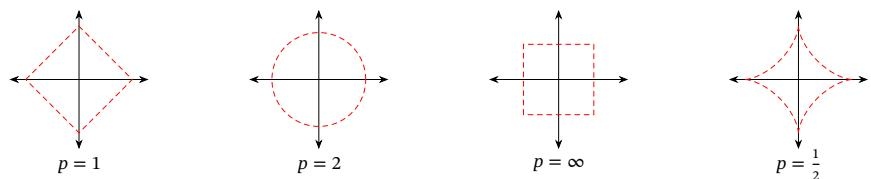  
图A.1 常见的范数

## A.1.4 常见的向量

[¶0042] 全0向量指所有元素都为0的向量，用0表示．全0向量为笛卡尔坐标系中的原点

[¶0043] 全1向量指所有元素都为1的向量，用1表示

[¶0044] one-hot向量为有且只有一个元素为1，其余元素都为0的向量．one-hot向量是在数字电路中的一种状态编码，指对任意给定的状态，状态寄存器中只有l位为1，其余位都为0

## A.2 矩阵

## A.2.1 线性映射

[¶0045] 线性映射（Linear Mapping）是指从线性空间??到线性空间??的一个映射函数 $f : \mathcal X  \mathcal y$ ，并满足：对于??中任何两个向量??和??以及任何标量??，有

[¶0046]
$$
f ( \pmb { u } + \pmb { v } ) = f ( \pmb { u } ) + f ( \pmb { v } ) ,\tag{A.15}
$$

[¶0047] 从线性空间??到其自身的线性映射，称为线性变换（Linear Trans-formation）

[¶0048]
$$
f ( c \pmb { v } ) = c f ( \pmb { v } ) .\tag{A.16}
$$

[¶0049] 两个有限维欧氏空间的映射函数 $f$ ∶ ℝ $^ { \dprime } \ d t ^ { N } \to \mathbb { R } ^ { M }$ 可以表示为

[¶0050]
$$
\pmb { y } = \pmb { A } \pmb { x } \triangleq \left[ \begin{array} { c } { a _ { 1 1 } x _ { 1 } + a _ { 1 2 } x _ { 2 } + \cdots + a _ { 1 N } x _ { N } } \\ { a _ { 2 1 } x _ { 1 } + a _ { 2 2 } x _ { 2 } + \cdots + a _ { 2 N } x _ { N } } \\ { \vdots } \\ { a _ { M 1 } x _ { 1 } + a _ { M 2 } x _ { 2 } + \cdots + a _ { M N } x _ { N } } \end{array} \right] ,\tag{A.17}
$$

[¶0051] 其中??是一个由??行??列个元素排列成的矩形阵列，称为 $M \times N$ 的矩阵 $\mathrm { ( \ M a \cdot }$ trix）：

[¶0052]
$$
\begin{array} { r } { A = \left[ \begin{array} { c c c c } { a _ { 1 1 } } & { a _ { 1 2 } } & { \cdots } & { a _ { 1 N } } \\ { a _ { 2 1 } } & { a _ { 2 2 } } & { \cdots } & { a _ { 2 N } } \\ { \vdots } & { \vdots } & { \ddots } & { \vdots } \\ { a _ { M 1 } } & { a _ { M 2 } } & { \cdots } & { a _ { M N } } \end{array} \right] . } \end{array}\tag{A.18}
$$

[¶0053] 向量 $\boldsymbol { x } \in \mathbb { R } ^ { N }$ 和 $\boldsymbol { y } \in \mathbb { R } ^ { M }$ 为两个空间中的向量．??和 $_ y$ 可以分别表示为 $N \times 1$ 的矩阵和 $M \times 1$ 的矩阵：

[¶0054]
$$
\begin{array} { r } { \pmb { x } = \left[ \begin{array} { c } { x _ { 1 } } \\ { x _ { 2 } } \\ { \vdots } \\ { x _ { N } } \end{array} \right] , \qquad \pmb { y } = \left[ \begin{array} { c } { y _ { 1 } } \\ { y _ { 2 } } \\ { \vdots } \\ { y _ { M } } \end{array} \right] . } \end{array}\tag{A.19}
$$

[¶0055] 这种表示形式称为列向量，即只有一列的矩阵

[¶0056] 如果没有特别说明，本书默认向量为列向量

[¶0057] 为简化书写、方便排版起见，本书约定行向量（即 $1 \times N$ 的矩阵）用逗号隔离的向量 $[ x _ { 1 } , x _ { 2 } , \cdots , x _ { N } ]$ 表示；列向量用分号隔开的向量 $\pmb { x } = [ x _ { 1 } ; x _ { 2 } ; \cdots ; x _ { N } ]$ 表示，或用行向量的转置 $[ x _ { 1 } , x _ { 2 } , \cdots , x _ { N } ] ^ { \intercal }$ 表示

[¶0058] 矩阵 $\pmb { A } \in \mathbb { R } ^ { M \times N }$ 定义了一个从空间 $\mathbb { R } ^ { N }$ 到空间ℝ $M$ 的线性映射．一个矩阵??从左上角数起的第??行第??列上的元素称为第??, ??项，通常记为 $[ A ] _ { m n }$ 或 $a _ { m n }$

## A.2.2 仿射变换

[¶0059] 仿射变换（Affine Transformation）是指通过一个线性变换和一个平移，将一个向量空间变换成另一个向量空间的过程

[¶0060] 令 $A \in \mathbb { R } ^ { N \times N }$ 为 $N \times N$ 的实数矩阵， $\boldsymbol { x } \in \mathbb { R } ^ { N }$ 是??维向量空间中的点，仿射变换可以表示为

[¶0061]
$$
y = A x + b ,\tag{A.20}
$$

[¶0062] 其中 $\pmb { b } \in \mathbb { R } ^ { N }$ 为平移项．当?? = 0时，仿射变换就退化为线性变换

[¶0063] 仿射变换可以实现线性空间中的旋转、平移、缩放变换．仿射变换不改变原始空间的相对位置关系，具有以下性质．1）共线性（Collinearity）不变：在同一条直线上的三个或三个以上的点，在变换后依然在一条直线上；2）比例不变：不同点之间的距离比例在变换后不变；3）平行性不变：两条平行线在转换后依然平行；4）凸性不变：一个凸集（Convex Set）在转换后依然是凸的

## A.2.3 矩阵操作

[¶0064] 加 如果??和??都为 $M \times N$ 的矩阵，则??和??的加也是 $M \times N$ 的矩阵，其每个元素是A和B相应元素相加，即

[¶0065]
$$
[ { \pmb A } + { \pmb B } ] _ { m n } = a _ { m n } + b _ { m n } .\tag{A.21}
$$

[¶0066] 乘积 假设有两个矩阵??和??分别表示两个线性映射 $g : \mathbb { R } ^ { K } \to \mathbb { R } ^ { M }$ 和 $f :$ ℝ $\mathbf { \Psi } _ { \mathbf { \Lambda } } ^ { N } \to \mathbb { R } ^ { K }$ ，则其复合线性映射

[¶0067]
$$
( g \circ f ) ( x ) = g ( f ( x ) ) = g ( B x ) = A ( B x ) = ( A B ) x ,\tag{A.22}
$$

[¶0068] 其中????表示矩阵??和??的乘积，定义为

[¶0069]
$$
[ \pmb { A } \pmb { B } ] _ { m n } = \sum _ { k = 1 } ^ { K } a _ { m k } b _ { k n } .\tag{A.23}
$$

[¶0070] 两个矩阵的乘积仅当第一个矩阵的列数和第二个矩阵的行数相等时才能定义如??是 $M \times K$ 矩阵和??是 $K \times N$ 矩阵，则乘积????是一个 $M \times N$ 的矩阵

[¶0071] 矩阵的乘法满足结合律和分配律：

[¶0072] （1） 结合律： $( A B ) C = A ( B C )$

[¶0073] （2） 分配律： $( A + B ) C = A C + B C , C ( A + B ) = C A + C B .$

[¶0074] 转置 $M \times N$ 的矩阵??的转置（Transposition）是一个 $N \times M$ 的矩阵，记为 $A ^ { \intercal }$ $A ^ { \intercal }$ 的第??行第??列的元素是原矩阵??的第??行第??列的元素，

[¶0075]
$$
[ { \cal A } ^ { \top } ] _ { m n } = [ { \cal A } ] _ { n m } .\tag{A.24}
$$

[¶0076] Hadamard 积 矩阵 ?? 和矩阵 ?? 的Hadamard 积（Hadamard Product）也称为逐点乘积，为??和??中对应的元素相乘

[¶0077]
$$
[ { \pmb A } \odot { \pmb B } ] _ { m n } = a _ { m n } b _ { m n } .\tag{A.25}
$$

[¶0078] 一个标量??与矩阵??乘积为??的每个元素是??的相应元素与??的乘积

[¶0079]
$$
[ c \pmb { A } ] _ { m n } = c a _ { m n } .\tag{A.26}
$$

[¶0080] Kronecker积 如果??是 $M { \times } N$ 的矩阵，??是 $S { \times } T$ 的矩阵，那么它们的Kronecker积（Kronecker Product）是一个 $M S \times N T$ 的矩阵：

[¶0081]
$$
\left[ { \pmb A } \otimes { \pmb B } \right] = \left[ \begin{array} { c c c c } { a _ { 1 1 } { \pmb B } } & { a _ { 1 2 } { \pmb B } } & { \cdots } & { a _ { 1 N } { \pmb B } } \\ { a _ { 2 1 } { \pmb B } } & { a _ { 2 2 } { \pmb B } } & { \cdots } & { a _ { 2 N } { \pmb B } } \\ { \vdots } & { \vdots } & { \ddots } & { \vdots } \\ { a _ { M 1 } { \pmb B } } & { a _ { M 2 } { \pmb B } } & { \cdots } & { a _ { M N } { \pmb B } } \end{array} \right] .\tag{A.27}
$$

[¶0082] 外积 两个向量 $\pmb { a } \in \mathbb { R } ^ { M }$ 和 $\pmb { b } \in \mathbb { R } ^ { N }$ 的外积（Outer Product）是一个 $M \times N$ 的矩阵，定义为

[¶0083] 外积通常看作矩阵的Kronecker 积的一种特例，但两者并不等价

[¶0084]
$$
a \otimes b = \left[ \begin{array} { c c c c } { a _ { 1 } b _ { 1 } } & { a _ { 1 } b _ { 2 } } & { . . . } & { a _ { 1 } b _ { N } } \\ { a _ { 2 } b _ { 1 } } & { a _ { 2 } b _ { 2 } } & { . . . } & { a _ { 2 } b _ { N } } \\ { \vdots } & { \vdots } & { \ddots } & { \vdots } \\ { a _ { M } b _ { 1 } } & { a _ { M } b _ { 2 } } & { . . . } & { a _ { M } b _ { N } } \end{array} \right] = a b ^ { \top } ,\tag{A.28}
$$

[¶0085] ⊗既 可 以 表 示Kro-necker积，也 可 以 表示外积，其具体含义不同一般需要在上下文中说明．

[¶0086] 其中 $[ { \pmb a } \otimes { \pmb b } ] _ { m n } = a _ { m } b _ { n }$

[¶0087] 向量化 矩阵的向量化（Vectorization）是将矩阵表示为一个列向量．令 $A =$ $[ a _ { i j } ] _ { M \times N }$ ，向量化算子vec(⋅)定义为

[¶0088]
$$
\operatorname { v e c } ( A ) = [ a _ { 1 1 } , a _ { 2 1 } , \cdots , a _ { M 1 } , a _ { 1 2 } , a _ { 2 2 } , \cdots , a _ { M 2 } , \cdots , a _ { 1 N } , a _ { 2 N } , \cdots , a _ { M N } ] ^ { \mathsf { T } } .
$$

[¶0089] 迹 方块矩阵??的对角线元素之和称为它的迹（Trace），记为 $t r ( A )$ ．尽管矩阵的乘法不满足交换律，但它们的迹相同，即 $t r ( A { \pmb { B } } ) = t r ( { \pmb { B } } { \pmb { A } } )$

[¶0090] 行列式 方块矩阵??的行列式是一个将其映射到标量的函数，记作 $\operatorname* { d e t } ( A )$ 或$| A |$ ．行列式可以看作有向面积或体积的概念在欧氏空间中的推广．在?? 维欧氏空间中，行列式描述的是一个线性变换对“体积”所造成的影响

[¶0091] 一个 $N \times N$ 的方块矩阵??的行列式定义为：

[¶0092]
$$
\operatorname* { d e t } ( A ) = \sum _ { \sigma \in S _ { N } } \operatorname { s g n } ( \sigma ) \prod _ { n = 1 } ^ { N } a _ { n , \sigma ( n ) }\tag{A.29}
$$

[¶0093] 其中 $S _ { N }$ 是 $\{ 1 , 2 , \cdots , N \}$ 的所有排列的集合， $\sigma$ 是其中一个排列， $\sigma ( n )$ 是元素??在排列 $\sigma$ 中的位置， $\operatorname { s g n } ( \sigma )$ 表示排列 $\sigma$ 的符号差，定义为

[¶0094]
$$
{ \mathrm { s g n } } ( \sigma ) = { \{ \begin{array} { l l } { 1 } & { \sigma { \equiv } { \dot { \mathrm { \bf ~  ~ } } } \partial \Sigma { \dot { \Bigl \vert } } \Sigma { \dot { \Bigl \vert } } { \vec { \mp } } { \vec { \times } } { \mathrm { \bf ~ \times } } { \mathrm { \bf ~ \times } } { \mathrm { \bf ~ \times } } { \mathrm { \bf ~ \times } } } \\ { - 1 } & { \sigma { \equiv } { \dot { \mathrm { \bf ~  ~ } } } \Sigma { \dot { \Bigl \downarrow } } \Sigma { \dot { \Bigl \downarrow } } { \vec { \mp } } { \vec { \times } } { \mathrm { \bf ~ \times } } { \mathrm { \bf ~ \times } } { \mathrm { \bf ~ \times } { \bf ~ \times } } } \end{array}  }\tag{A.30}
$$

[¶0095] 其中逆序对的定义为：在排列 $\sigma$ 中，如果有序数对 $( i , j )$ 满足 $1 \leq i < j \leq N$ 但$\sigma ( i ) > \sigma ( j )$ ，则其为 $\sigma$ 的一个逆序对

[¶0096] 秩 一个矩阵??的列秩是??的线性无关的列向量数量，行秩是??的线性无关的行向量数量．一个矩阵的列秩和行秩总是相等的，简称为秩（Rank）

[¶0097] 一个 $M \times N$ 的矩阵??的秩最大为 $\operatorname* { m i n } ( M , N )$ ．若 $\operatorname { r a n k } ( A ) = \operatorname* { m i n } ( M , N )$ ，则称矩阵为满秩的．如果一个矩阵不满秩，说明其包含线性相关的列向量或行向量，其行列式为0

[¶0098] 两个矩阵的乘积????的秩 $\operatorname { r a n k } ( A B ) \leq \operatorname* { m i n } \left( \operatorname { r a n k } ( A ) , \operatorname { r a n k } ( B ) \right)$

[¶0099] 范数 矩阵的范数有很多种形式，其中常用的 $\ell _ { p }$ 范数定义为

[¶0100]
$$
| | \boldsymbol { A } | | _ { p } = \Big ( \sum _ { m = 1 } ^ { M } \sum _ { n = 1 } ^ { N } | a _ { m n } | ^ { p } \Big ) ^ { 1 / p } .\tag{A.31}
$$

## A.2.4 矩阵类型

[¶0101] 对称矩阵 对称矩阵（Symmetric Matrix）指其转置等于自己的矩阵，即满足$A = A ^ { \intercal }$

[¶0102] 对角矩阵 对角矩阵（Diagonal Matrix）是一个主对角线之外的元素皆为0的矩阵．一个对角矩阵??满足

[¶0103]
$$
[ \pmb { A } ] _ { m n } = 0 \quad \forall m , n \in \{ 1 , \cdots , N \} , \mathrm { a n d } m \not = n .\tag{A.32}
$$

[¶0104] 对角矩阵通常指方块矩阵，但有时也指矩形对角矩阵（Rectangular Diago-nal Matrix），即一个 $M \times N$ 的矩阵，其除 $a _ { i i }$ 之外的元素都为0．一个 $N \times N$ 的对角矩阵??也可以记为diag(??)，??为一个??维向量，并满足

[¶0105]
$$
[ { \cal A } ] _ { n n } = a _ { n } .\tag{A.33}
$$

[¶0106] ?? × ?? 的对角矩阵?? = diag(??)和?? 维向量??的乘积为一个?? 维向量

[¶0107]
$$
\mathbf { \nabla } A \mathbf { b } = \mathrm { d i a g } ( \mathbf { a } ) \mathbf { b } = \mathbf { a } \odot \mathbf { b } ,\tag{A.34}
$$

[¶0108] 其中⊙表示按元素乘积，即 $[ { \pmb a } \odot { \pmb b } ] _ { n } = a _ { n } b _ { n } , 1 \leq n \leq N .$

[¶0109] 单位矩阵 单位矩阵（Identity Matrix）是一种特殊的对角矩阵，其主对角线元素为1，其余元素为0．??阶单位矩阵 $I _ { N }$ ，是一个 $N \times N$ 的方块矩阵，可以记为$I _ { N } = \mathrm { d i a g } ( 1 , 1 , \cdots , 1 )$

[¶0110] 一个 $M \times N$ 的矩阵A和单位矩阵的乘积等于其本身，即

[¶0111]
$$
A I _ { N } = I _ { M } A = A .\tag{A.35}
$$

[¶0112] 逆矩阵 对于一个 $N \times N$ 的方块矩阵??，如果存在另一个方块矩阵??使得

[¶0113]
$$
A B = B A = I _ { N } ,\tag{A.36}
$$

[¶0114] 其中 $I _ { N }$ 为单位阵，则称??是可逆的．矩阵??称为矩阵??的逆矩阵（Inverse Ma-trix），记为 $A ^ { - 1 }$

[¶0115] 一个方阵的行列式等于0当且仅当该方阵不可逆

[¶0116] 正定矩阵 对于一个 $N \times N$ 的对称矩阵??，如果对于所有的非零向量 $\boldsymbol { x } \in \mathbb { R } ^ { N }$ 都满足

[¶0117]
$$
x ^ { \top } A x > 0 ,\tag{A.37}
$$

[¶0118] 则 ?? 为正定矩阵（Positive-Definite Matrix）．如果 ${ \pmb x } ^ { \top } { \pmb A } { \pmb x } \geq 0$ ，则??是半正定矩阵（Positive-Semidefinite Matrix）

[¶0119] 正交矩阵 如果一个 $N \times N$ 的方块矩阵??的逆矩阵等于其转置矩阵，即

[¶0120]
$$
A ^ { \top } = A ^ { - 1 } ,\tag{A.38}
$$

[¶0121] 则 ?? 为正交矩阵（Orthogonal Matrix）

[¶0122] 正交矩阵满足 $A ^ { \intercal } A = A A ^ { \intercal } = I _ { N }$ ，即正交矩阵的每一行（列）向量和自身的内积为1，和其他行（列）向量的内积为0

[¶0123] Gram矩阵 向量空间中一组向量 ${ \pmb a } _ { 1 } , { \pmb a } _ { 2 } , \cdots , { \pmb a } _ { N }$ 的Gram 矩阵（Gram Matrix）??是内积的对称矩阵，其元素 $[ \pmb { G } ] _ { m n } = \pmb { a } _ { m } ^ { \top } \pmb { a } _ { n }$

## A.2.5 特征值与特征向量

[¶0124] 对一个?? × ??的矩阵??，如果存在一个标量??和一个非零向量??满足

[¶0125]
$$
\begin{array} { r } { { \cal A } { \bf v } = \lambda { \bf v } , } \end{array}\tag{A.39}
$$

[¶0126] 则??和??分别称为矩阵??的特征值（Eigenvalue）和特征向量（Eigenvector）

[¶0127] 当用矩阵??对它的特征向量??进行线性映射时，得到的新向量只是在??的长度上缩放??倍．给定一个矩阵的特征值，其对应的特征向量的数量是无限多的令??和??是矩阵??的特征值??对应的特征向量，则????和 ${ \pmb u } + { \pmb v }$ 也是特征值??对应的特征向量

[¶0128] ??为任意实数

[¶0129] 如果矩阵??是一个 $N \times N$ 的实对称矩阵，则存在实数 $\lambda _ { 1 } , \cdots , \lambda _ { N }$ ，以及??个互相正交的单位向量 $\pmb { v } _ { 1 } , \cdots , \pmb { v } _ { N }$ ，使得 ${ \pmb v } _ { n }$ 为矩阵??的特征值为 $\lambda _ { n }$ 的特征向量$( 1 \leq n \leq N )$

[¶0130] 单位向量??的模为1，即$\pmb { v } ^ { \top } \pmb { v } = 1$

## A.2.6 矩阵分解

[¶0131] 一个矩阵通常可以用一些比较“简单”的矩阵来表示，称为矩阵分解（Ma-trix Decomposition, or Matrix Factorization）

## A.2.6.1 特征分解

[¶0132] 一个?? × ?? 的方块矩阵??的特征分解（Eigendecomposition）定义为

[¶0133]
$$
\pmb { A } = \pmb { Q } \pmb { \Lambda } \pmb { Q } ^ { - 1 } ,\tag{A.40}
$$

[¶0134] 其中??为 $N \times N$ 的方块矩阵，其每一列都为??的特征向量，??为对角矩阵，其每一个对角元素分别为??的一个特征值

[¶0135] 如果??为实对称矩阵，那么其不同特征值对应的特征向量相互正交．??可以被分解为

[¶0136]
$$
A = Q \Lambda Q ^ { \top } ,\tag{A.41}
$$

[¶0137] 其中??为正交矩阵

## A.2.6.2 奇异值分解

[¶0138] 一个 $M \times N$ 的矩阵??的奇异值分解（Singular Value Decomposition，SVD）定义为

[¶0139]
$$
\pmb { A } = \pmb { U \Sigma V } ^ { \top } ,\tag{A.42}
$$

[¶0140] 其中??和?? 分别为 $M \times M$ 和 $N \times N$ 的正交矩阵，??为 $M \times N$ 的矩形对角矩阵．??对角线上的元素称为奇异值（Singular Value），一般按从大到小排列

[¶0141] 根据公式(A.42)， $A A ^ { \mathsf { T } } = U \Sigma V ^ { \mathsf { T } } V \Sigma U ^ { \mathsf { T } } = U \Sigma ^ { 2 } U ^ { \top } , A ^ { \top } A = V \Sigma U ^ { \top } U \Sigma V ^ { \top } =$ $V \pmb { \Sigma } ^ { 2 } \pmb { V } ^ { \top }$ ．因此，??和?? 分别为 $A A ^ { \intercal }$ 和??T??的特征向量，??的非零奇异值为 $A A ^ { \intercal }$ 或$\pmb { A } ^ { \top } \pmb { A }$ 的非零特征值的平方根

[¶0142] 由于一个大小为 $M \times N$ 的矩阵??可以表示空间ℝ?? 到空间 $\mathbb { R } ^ { M }$ 的一种线性映射，因此奇异值分解相当于将这个线性映射分解为3个简单操作．1）先使用??在原始空间中进行坐标旋转．2）用??对旋转后的每一维进行缩放．如果 $M > N$ ，则补?? − ??个0；相反，如果 $M < N$ ，则舍去最后的?? − ??维．3）使用??进行再一次的坐标旋转

[¶0143] 一 个 向 量 $\boldsymbol { x } \in \mathbb { R } ^ { N }$ 左乘一个正交矩阵 $\pmb { U } \in$ $\mathbb { R } ^ { N \times N }$ ，可以看作对??进行坐标旋转，即??中的行向量构成一组正交基向量

[¶0144] 令??为矩阵??的非零奇异值的数量，矩阵??可以写为

[¶0145]
$$
\pmb { A } = \sum _ { k = 1 } ^ { K } \sigma _ { k } \pmb { u } _ { k } \pmb { v } _ { k } ^ { \top } ,\tag{A.43}
$$

[¶0146]
$$
\begin{array} { r } { { \bf \Omega } = { \cal U } _ { K } { \pmb \Sigma } _ { K } { \pmb V } _ { K } ^ { \top } , } \end{array}\tag{A.44}
$$

[¶0147] 矩 阵??的 非 零 奇 异值 数 量 等 于 矩 阵 的秩，即 $K = { \mathrm { r a n k } } ( A ) <$ min(??, ??)

[¶0148] 其中 ${ \cal U } _ { K } = [ { \pmb u } _ { 1 } , \cdots , { \pmb u } _ { K } ]$ 和 $V _ { K } = \left[ \pmb { v } _ { 1 } , \cdots , \pmb { v } _ { K } \right]$ 分别为 $M \times K$ 和 $N \times K$ 的矩阵，$\Sigma _ { K } = \operatorname { d i a g } ( \sigma _ { 1 } , \cdots , \sigma _ { K } )$ 为 $K \times K$ 的对角矩阵．公式(A.44)也称为紧凑的奇异值分解（Compact SVD）．如果令 $K < r a n k ( A )$ ，并舍去小的奇异值，则公式(A.44)也称为截断的奇异值分解（Truncated SVD）．在实际应用中，通常使用截断的奇异值分解来提高计算效率，但是截断的奇异值分解只是一种近似的矩阵分解，不能精确重构出原始矩阵

## 附录B 微积分

[¶0149] 微积分（Calculus）是研究函数的微分（Differentiation）、积分（Integra-tion）及其相关应用的数学分支

## B.1 微分

## B.1.1 导数

[¶0150] 导数（Derivative）是微积分学中重要的基础概念

[¶0151] 对于定义域和值域都是实数域的函数?? ∶ ℝ → ℝ，若??(??)在点 $x _ { 0 }$ 的某个邻域 $\Delta x$ 内，极限

[¶0152]
$$
f ^ { \prime } ( x _ { 0 } ) = \operatorname* { l i m } _ { \Delta x \to 0 } { \frac { f ( x _ { 0 } + \Delta x ) - f ( x _ { 0 } ) } { \Delta x } }\tag{B.1}
$$

[¶0153] 存在，则称函数 $f ( x )$ 在点 $x _ { 0 }$ 处可导， $f ^ { \prime } ( x _ { 0 } )$ 称为其导数，或导函数，也可以记为$\frac { \mathrm { d } f ( \boldsymbol { x } _ { 0 } ) } { \mathrm { d } \boldsymbol { x } }$

[¶0154] 在几何上，导数可以看作函数曲线上的切线斜率．图B.1给出了一个函数导数的可视化示例，其中函数 $g ( x )$ 的斜率为函数??(??)在点??的导数， $\Delta y = f ( x +$ $\Delta x ) - f ( x )$

[¶0155]
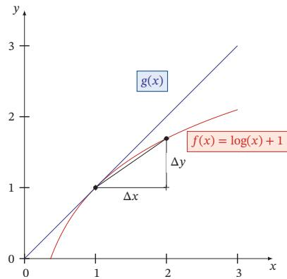  
图 B.1 函数 $f ( x ) = \log ( x ) + 1$ 的导数

[¶0156] 表B.1给出了几个常见函数的导数

[¶0157] 表B.1 几个常见函数的导数
<table><tr><td>函数</td><td>函数形式 导数</td></tr><tr><td>常函数  $f ( x ) = C$ </td><td>，其中C为常数  $f ^ { \prime } ( x ) = 0$ </td></tr><tr><td>幂函数  $f ( x ) = x ^ { r }$ </td><td>,其中r是非零实数  $f ^ { \prime } ( x ) = r x ^ { r - 1 }$ </td></tr><tr><td>指数函数</td><td> $f ( x ) = \exp ( x )$   $f ^ { \prime } ( x ) = \exp ( x )$ </td></tr><tr><td>对数函数  $f ( x ) = \log ( x )$ </td><td> $\begin{array} { r } { f ^ { \prime } ( x ) = \frac { 1 } { x } } \end{array}$ </td></tr></table>

[¶0158] 高阶导数 对一个函数的导数继续求导，可以得到高阶导数．函数 $f ( x )$ 的导数$f ^ { \prime } ( x )$ 称为一阶导数， $f ^ { \prime } ( x )$ 的导数称为二阶导数，记为 $f ^ { \prime \prime } ( x ) \lrcorner f ^ { ( 2 ) } ( x )$ 或 $\frac { \mathrm { d } ^ { 2 } f ( x ) } { \mathrm { d } x ^ { 2 } }$ 偏导数 对于一个多元变量函数 $f : \mathbb { R } ^ { D } $ ℝ，它的偏导数（Partial Derivative ）是关于其中一个变量 $x _ { i }$ 的导数，而保持其他变量固定，可以记为 $f _ { x _ { i } } ^ { \prime } ( { \pmb x } ) , \nabla _ { x _ { i } } f ( { \pmb x } )$ $\frac { \partial f ( \pmb { x } ) } { \partial x _ { i } }$ 或 ${ \frac { \partial } { \partial x _ { i } } } f ( { \pmb x } )$

## B.1.2 微分

[¶0159] 给定一个连续函数，计算其导数的过程称为微分（Differentiation）．若函$f ( x )$ 在其定义域包含的某区间内每一个点都可导，那么也可以说函数 $f ( x )$ 在这个区间内可导．如果一个函数 $f ( x )$ 在定义域中的所有点都存在导数，则 $f ( x )$ 为可微函数（Differentiable Function）．可微函数一定连续，但连续函数不一定可微．例如，函数 $| x |$ 为连续函数，但在点 $x = 0$ 处不可导

## B.1.3 泰勒公式

[¶0160] 泰勒公式（Taylor’s Formula）是一个函数 $f ( x )$ 在已知某一点的各阶导数值的情况之下，可以用这些导数值做系数构建一个多项式来近似函数在这一点的邻域中的值

[¶0161] 如果函数??(??)在??点处??次可导 $\left( n \geq 1 \right)$ ，在一个包含点??的区间上的任意??，都有

[¶0162]
$$
\begin{array} { c } { { f ( x ) = f ( a ) + \displaystyle \frac { 1 } { 1 ! } f ^ { \prime } ( a ) ( x - a ) + \displaystyle \frac { 1 } { 2 ! } f ^ { ( 2 ) } ( a ) ( x - a ) ^ { 2 } + \cdots } } \\ { { + \displaystyle \frac { 1 } { n ! } f ^ { ( n ) } ( a ) ( x - a ) ^ { n } + R _ { n } ( x ) , } } \end{array}\tag{B.2}
$$

[¶0163] 其中 $f ^ { ( n ) } ( a )$ 表示函数 $f ( x )$ 在点??的??阶导数

[¶0164] 上面公式中的多项式部分称为函数 $f ( x )$ 在??处的??阶泰勒展开式，剩余的$R _ { n } ( x )$ 是泰勒公式的余项，是 $( x - a ) ^ { n }$ 的高阶无穷小

## B.2 积分

[¶0165] 积分（Integration）是微分的逆过程，即如何从导数推算出原函数．积分通常可以分为定积分（Definite Integral）和不定积分（Indefinite Integral）

[¶0166] 函数??(??)的不定积分可以写为

[¶0167]
$$
F ( x ) = \int f ( x ) \mathrm { d } x ,\tag{B.3}
$$

[¶0168] 积分符号∫为一个拉长的字母??，表示求和（Sum），和??有类似的意义

[¶0169] 其中 $F ( x )$ 称为 $f ( x )$ 的原函数或反导函数，d??表示积分变量为??．当??(??)是 $F ( x )$ 的导数时， $F ( x )$ 是 $f ( x )$ 的不定积分．根据导数的性质，一个函数??(??)的不定积分是不唯一的．若 $F ( x )$ 是??(??)的不定积分， $F ( x ) + C$ 也是??(??)的不定积分，其中??为一个常数

[¶0170] 给定一个变量为??的实值函数??(??)和闭区间[??, ??]，定积分可以理解为在坐标平面上由函数 $f ( x )$ ，垂直直线 $x = a , x = b$ 以及??轴围起来的区域的带符号的面积，记为

[¶0171]
$$
\int _ { a } ^ { b } f ( x ) \mathrm { d } x .\tag{B.4}
$$

[¶0172] 带符号的面积表示??轴以上的面积为正，??轴以下的面积为负

[¶0173] 积分的严格定义有很多种，最常见的积分定义之一为黎曼积分（RiemannIntegral）．对于闭区间 [??, ??]，我们定义 $[ a , b ]$ 的一个分割为此区间中取一个有限的点列

[¶0174]
$$
a = x _ { 0 } < x _ { 1 } < x _ { 2 } < . . . < x _ { N } = b .
$$

[¶0175] 这些点将区间[??, ??]分割为??个子区间 $[ x _ { n - 1 } , x _ { n } ]$ ，其中 $1 \leq n \leq N .$ ．每个区间取出一个点 $t _ { n } \in [ x _ { n - 1 } , x _ { n } ]$ 作为代表

[¶0176] 在这个分割上，函数??(??)的黎曼和定义为

[¶0177]
$$
\sum _ { n = 1 } ^ { N } f ( t _ { n } ) ( x _ { n } - x _ { n - 1 } ) ,\tag{B.5}
$$

[¶0178] 即所有子区间的带符号面积之和

[¶0179] 不同分割的黎曼和不同．当 $\lambda = \operatorname* { m a x } _ { n = 1 } ^ { N } ( x _ { n } - x _ { n - 1 } )$ 足够小时，如果所有的黎曼和都趋于某个极限，那么这个极限就叫作函数??(??)在闭区间[??, ??]上的黎曼积分．图B.2给出了不同分割的黎曼和示例，其中??表示分割的子区间数量

[¶0180]
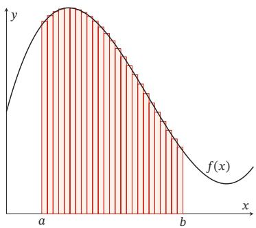  
(a) $N = 2 5$

[¶0181]
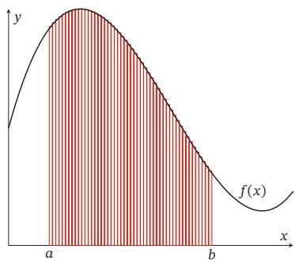  
(b) $N = 5 0$  
图B.2 不同分割的黎曼和示例

## B.3 矩阵微积分

[¶0182] 为了书写简便，我们通常把单个函数对多个变量或者多元函数对单个变量的偏导数写成向量和矩阵的形式，使其可以被当成一个整体处理．矩阵微积分（Matrix Calculus）是多元微积分的一种表达方式，即使用矩阵和向量来表示因变量每个成分关于自变量每个成分的偏导数1

[¶0183] 矩阵微积分的表示通常有两种符号约定： 分子布局（Numerator Layout）和分母布局（Denominator Layout）．两者的区别是一个标量关于一个向量的导数是写成列向量还是行向量

[¶0184] 除特别说明外，本书默认采用分母布局

[¶0185] 标量关于向量的偏导数 对于??维向量 $\pmb { x } \in \mathbb { R } ^ { M }$ 和函数 $y = f ( \pmb { x } ) \in \mathbb { R }$ ，则 ?? 关于??的偏导数为

[¶0186] 分母布局

[¶0187]
$$
\frac { \partial y } { \partial x } = [ \frac { \partial y } { \partial x _ { 1 } } , \cdots , \frac { \partial y } { \partial x _ { M } } ] ^ { \top } \qquad \in \mathbb { R } ^ { M \times 1 } ,\tag{B.6}
$$

[¶0188] 分子布局

[¶0189]
$$
\frac { \partial y } { \partial x } = [ \frac { \partial y } { \partial x _ { 1 } } , \cdots , \frac { \partial y } { \partial x _ { M } } ] \qquad \in \mathbb { R } ^ { 1 \times M } .\tag{B.7}
$$

[¶0190] 在分母布局中， $\frac { \partial y } { \partial x }$ 为列向量；而在分子布局中， $\frac { \partial y } { \partial x }$ 为行向量

[¶0191] 向量关于标量的偏导数 对于标量 $x \in \mathbb { R }$ 和函数 $ { \mathbf { y } } = f (  { \boldsymbol { { x } } } ) \in \mathbb { R } ^ { N }$ ，则 $_ y$ 关于??的偏导数为

[¶0192] 分母布局

[¶0193]
$$
\frac { \partial { \pmb y } } { \partial x } = [ \frac { \partial y _ { 1 } } { \partial x } , \cdots , \frac { \partial y _ { N } } { \partial x } ] \qquad { \in \mathbb R } ^ { 1 \times N } ,\tag{B.8}
$$

[¶0194] 分子布局

[¶0195]
$$
\frac { \partial { \pmb y } } { \partial x } = [ \frac { \partial y _ { 1 } } { \partial x } , \cdots , \frac { \partial y _ { N } } { \partial x } ] ^ { \top } \qquad { \in } \mathbb { R } ^ { N \times 1 } .\tag{B.9}
$$

[¶0196] 在分母布局中， $\frac { \partial y } { \partial x }$ 为行向量；而在分子布局中， $\frac { \partial y } { \partial x }$ 为列向量

[¶0197] 向量关于向量的偏导数 对于??维向量 $\pmb { x } \in \mathbb { R } ^ { M }$ 和函数 ${ \pmb y } = f ( { \pmb x } ) \in \mathbb { R } ^ { N }$ ，则$f ( x )$ 关于??的偏导数（分母布局）为

[¶0198]
$$
\frac { \partial f ( \pmb { x } ) } { \partial \pmb { x } } = \left[ \begin{array} { c c c } { \frac { \partial y _ { 1 } } { \partial x _ { 1 } } } & { \cdots } & { \frac { \partial y _ { N } } { \partial x _ { 1 } } } \\ { \vdots } & { \ddots } & { \vdots } \\ { \frac { \partial y _ { 1 } } { \partial x _ { M } } } & { \cdots } & { \frac { \partial y _ { N } } { \partial x _ { M } } } \end{array} \right] \in \mathbb { R } ^ { M \times N } ,\tag{B.10}
$$

[¶0199] 称为函数 $f ( x )$ 的雅可比矩阵（Jacobian Matrix）的转置

[¶0200] 雅 可 比 矩 阵 通 常 采用分子布局

[¶0201] 对于??维向量 $\pmb { x } \in \mathbb { R } ^ { M }$ 和函数 $y = f ( \pmb { x } ) \in$ ℝ，则 $f ( x )$ 关于??的二阶偏导数（分母布局）为

[¶0202]
$$
\mathbf { { \boldsymbol { H } } } = { \frac { \partial ^ { 2 } f ( \mathbf { { \boldsymbol { x } } } ) } { \partial \mathbf { { \boldsymbol { x } } } ^ { 2 } } } = \left[ \begin{array} { c c c } { \frac { \partial ^ { 2 } y } { \partial x _ { 1 } ^ { 2 } } } & { \cdots } & { \frac { \partial ^ { 2 } y } { \partial x _ { 1 } \partial x _ { M } } } \\ { \vdots } & { \ddots } & { \vdots } \\ { \frac { \partial ^ { 2 } y } { \partial x _ { M } \partial x _ { 1 } } } & { \cdots } & { \frac { \partial ^ { 2 } y } { \partial x _ { M } ^ { 2 } } } \end{array} \right] \in \mathbb { R } ^ { M \times M } ,\tag{B.11}
$$

[¶0203] 称为函数 $f ( x )$ 的Hessian矩阵，也写作 $\nabla ^ { 2 } f ( { \pmb x } )$ ，其中第??, ??个元素为 $\frac { \partial ^ { 2 } y } { \partial x _ { m } \partial x _ { n } }$

## B.3.1 导数法则

[¶0204] 复合函数的导数的计算可以通过以下法则来简化

## B.3.1.1 加（减）法则

[¶0205] 若 $\pmb { x } \in \mathbb { R } ^ { M } , \pmb { y } = f ( \pmb { x } ) \in \mathbb { R } ^ { N } , \pmb { z } = g ( \pmb { x } ) \in \mathbb { R } ^ { N }$ ，则

[¶0206]
$$
\frac { \partial ( \mathbf { y } + \boldsymbol { z } ) } { \partial \boldsymbol { x } } = \frac { \partial \mathbf { y } } { \partial \boldsymbol { x } } + \frac { \partial \boldsymbol { z } } { \partial \boldsymbol { x } } \quad \in \mathbb { R } ^ { M \times N } .\tag{B.12}
$$

## B.3.1.2 乘法法则

[¶0207] （1）若 $\pmb { x } \in \mathbb { R } ^ { M } , \pmb { y } = f ( \pmb { x } ) \in \mathbb { R } ^ { N } , \pmb { z } = g ( \pmb { x } ) \in \mathbb { R } ^ { N }$ ，则

[¶0208]
$$
\frac { \partial { \mathbf { y } } ^ { \top } { \boldsymbol { z } } } { \partial { \mathbf { x } } } = \frac { \partial { \mathbf { y } } } { \partial { \mathbf { x } } } { \boldsymbol { z } } + \frac { \partial { \boldsymbol { z } } } { \partial { \mathbf { x } } } { \mathbf { y } } \quad \in \mathbb { R } ^ { M } .\tag{B.13}
$$

[¶0209] （2）若 $\pmb { x } \in \mathbb { R } ^ { M } , \pmb { y } = \pmb { f } ( \pmb { x } ) \in \mathbb { R } ^ { S } , z = g ( \pmb { x } ) \in \mathbb { R } ^ { T } , \pmb { A } \in \mathbb { R } ^ { S \times T }$ 和??无关，则

[¶0210]
$$
\frac { \partial { \mathbf { y } } ^ { \intercal } { \mathbf { A } } z } { \partial { \mathbf { x } } } = \frac { \partial { \mathbf { y } } } { \partial { \mathbf { x } } } { \mathbf { A } } z + \frac { \partial z } { \partial { \mathbf { x } } } { \mathbf { A } } ^ { \intercal } { \mathbf { y } }  &  \in \mathbb { R } ^ { M } .\tag{B.14}
$$

[¶0211] （3）若 $\pmb { x } \in \mathbb { R } ^ { M } , y = f ( \pmb { x } ) \in \mathbb { R } , z = g ( \pmb { x } ) \in \mathbb { R } ^ { N }$ ，则

[¶0212]
$$
\frac { \partial y z } { \partial x } = y \frac { \partial z } { \partial x } + \frac { \partial y } { \partial x } z ^ { \intercal } \quad \in \mathbb { R } ^ { M \times N } .\tag{B.15}
$$

## B.3.1.3 链式法则

[¶0213] 链式法则（Chain Rule）是在微积分中求复合函数导数的一种常用方法

[¶0214] （1）若 $x \in \mathbb { R } , y = g ( x ) \in \mathbb { R } ^ { M } , z = f ( \pmb { y } ) \in \mathbb { R } ^ { N }$ ，则

[¶0215]
$$
\frac { \partial \pmb { z } } { \partial \pmb { x } } = \frac { \partial \pmb { y } } { \partial \pmb { x } } \frac { \partial \pmb { z } } { \partial \pmb { y } } \quad \in \mathbb { R } ^ { 1 \times N } .\tag{B.16}
$$

[¶0216] （2）若 $\pmb { x } \in \mathbb { R } ^ { M } , \pmb { y } = g ( \pmb { x } ) \in \mathbb { R } ^ { K } , \pmb { z } = f ( \pmb { y } ) \in \mathbb { R } ^ { N }$ ，则

[¶0217]
$$
\frac { \partial \pmb { z } } { \partial \pmb { x } } = \frac { \partial \pmb { y } } { \partial \pmb { x } } \frac { \partial \pmb { z } } { \partial \pmb { y } } \in \mathbb { R } ^ { M \times N } .\tag{B.17}
$$

[¶0218] （3）若 $\pmb { X } \in \mathbb { R } ^ { M \times N }$ 为矩阵， $\pmb { y } = g ( \pmb { X } ) \in \mathbb { R } ^ { K } , z = f ( \pmb { y } ) \in \mathbb { R }$ ，则

[¶0219]
$$
\frac { \partial z } { \partial x _ { i j } } = \frac { \partial { \bf y } } { \partial x _ { i j } } \frac { \partial z } { \partial { \bf y } } \quad \in \mathbb { R } .\tag{B.18}
$$

## B.4 常见函数的导数

[¶0220] 这里我们介绍本书中常用的几个函数

## B.4.1 向量函数及其导数

[¶0221] 对一个向量??有

[¶0222]
$$
\frac { \partial x } { \partial x } = I ,\tag{B.19}
$$

[¶0223]
$$
\frac { \partial \| \pmb { x } \| ^ { 2 } } { \partial \pmb { x } } = 2 \pmb { x } ,\tag{B.20}
$$

[¶0224]
$$
\frac { \partial A x } { \partial x } = A ^ { \top } ,\tag{B.21}
$$

[¶0225]
$$
{ \frac { \partial { \pmb x } ^ { \top } { \pmb A } } { \partial { \pmb x } } } = { \pmb A } .\tag{B.22}
$$

## B.4.2 按位计算的向量函数及其导数

[¶0226] 假设一个函数 $f ( x )$ 的输入是标量??．对于一组??个标量 $x _ { 1 } , \cdots , x _ { K }$ ，我们可以通过??(??)得到另外一组??个标量 $z _ { 1 } , \cdots , z _ { K }$

[¶0227]
$$
z _ { k } = f ( x _ { k } ) , \qquad \forall k = 1 , \cdots , K\tag{B.23}
$$

[¶0228] 为了简便起见，我们定义 $\pmb { x } = [ x _ { 1 } , \cdots , x _ { K } ] ^ { \top } , \pmb { z } = [ z _ { 1 } , \cdots , z _ { K } ] ^ { \top }$

[¶0229]
$$
z = f ( { \pmb x } ) ,\tag{B.24}
$$

[¶0230] 其中 $f ( x )$ 是按位运算的，即 $[ f ( \pmb { x } ) ] _ { k } = f ( \pmb { x } _ { k } )$

[¶0231] 当??为标量时， $f ( x )$ 的导数记为 $f ^ { \prime } ( x )$ ．当输入为??维向量 $\pmb { x } = [ x _ { 1 } , \cdots , x _ { K } ] ^ { \intercal }$ 时，其导数为一个对角矩阵

[¶0232]
$$
{ \begin{array} { r l } { { \frac { \partial f ( { \boldsymbol { x } } ) } { \partial { \boldsymbol { x } } } } = \left[ { \frac { \partial f \left( { \boldsymbol { x } } _ { j } \right) } { \partial { \boldsymbol { x } } _ { i } } } \right] _ { K \times K } } \\ { = { \left[ \begin{array} { l l l l } { f ^ { \prime } ( { \boldsymbol { x } } _ { 1 } ) } & { 0 } & { \cdots } & { 0 } \\ { 0 } & { f ^ { \prime } ( { \boldsymbol { x } } _ { 2 } ) } & { \cdots } & { 0 } \\ { \vdots } & { \vdots } & { \ddots } & { \vdots } \\ { 0 } & { 0 } & { \cdots } & { f ^ { \prime } ( { \boldsymbol { x } } _ { K } ) } \end{array} \right] } } \\ { = \mathrm { d i a g } ( f ^ { \prime } ( { \boldsymbol { x } } ) ) . } \end{array} }
$$

[¶0233] ??, ??为矩阵元素的下标

[¶0234] (B.25)

[¶0235] (B.26)

[¶0236] (B.27)

## B.4.2.1 Logistic 函数

[¶0237] Logistic 函数是一种常用的 S 型函数，是比利时数学家 Pierre François Ver-hulst在1844年～1845年研究种群数量的增长模型时提出命名的，最初作为一种生态学模型

[¶0238] Logistic 函数定义为

[¶0239]
$$
\mathrm { l o g i s t i c } ( x ) = \frac { L } { 1 + \exp ( - K ( x - x _ { 0 } ) ) } ,\tag{B.28}
$$

[¶0240] 其中exp(⋅)函数表示自然对数， $x _ { 0 }$ 是中心点，??是最大值，?? 是曲线的倾斜度图B.3给出了几种不同参数的 Logistic 函数曲线．当 ?? 趋向于 $- \infty$ 时，logistic(??)接近于0；当??趋向于 $+ \infty$ 时，logistic(??) 接近于 ??.

[¶0241]
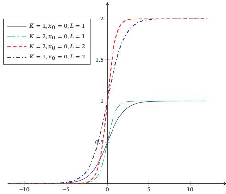  
图 B.3 Logistic 函数

[¶0242] 当参数为 $( k = 1 , x _ { 0 } = 0 , L = 1 )$ 时，Logistic 函数称为标准 Logistic 函数，记

[¶0243] 为 $\sigma ( x )$

[¶0244]
$$
\sigma ( x ) = \frac { 1 } { 1 + \exp ( - x ) } .\tag{B.29}
$$

[¶0245] 标准Logistic函数在机器学习中使用得非常广泛，经常用来将一个实数空间的数映射到(0, 1)区间

[¶0246] 标准Logistic函数的导数为

[¶0247]
$$
\sigma ^ { \prime } ( x ) = \sigma ( x ) \bigl ( 1 - \sigma ( x ) \bigr ) .\tag{B.30}
$$

[¶0248] 当输入为??维向量 $\pmb { x } = [ x _ { 1 } , \cdots , x _ { K } ] ^ { \intercal }$ 时，其导数为

[¶0249]
$$
\begin{array} { r } { \sigma ^ { \prime } ( { \pmb x } ) = \mathrm { d i a g } \big ( \sigma ( { \pmb x } ) \odot ( 1 - \sigma ( { \pmb x } ) ) \big ) . } \end{array}\tag{B.31}
$$

## B.4.2.2 Softmax 函数

[¶0250] Softmax函数可以将多个标量映射为一个概率分布．对于??个标量 $x _ { 1 } , \cdots , x _ { K }$ Softmax函数定义为

[¶0251]
$$
z _ { k } = { \mathrm { s o f t m a x } } ( x _ { k } ) = { \frac { \exp ( x _ { k } ) } { \sum _ { i = 1 } ^ { K } \exp ( x _ { i } ) } } .\tag{B.32}
$$

[¶0252] 这样，我们可以将??个标量 $x _ { 1 } , \cdots , x _ { K }$ 转换为一个分布： $z _ { 1 } , \cdots , z _ { K }$ ，满足

[¶0253]
$$
\begin{array} { r } { z _ { k } \in ( 0 , 1 ) , \qquad \forall k , } \end{array}\tag{B.33}
$$

[¶0254]
$$
\sum _ { k = 1 } ^ { K } z _ { k } = 1 .\tag{B.34}
$$

[¶0255] 为了简便起见，用?? 维向量 $\pmb { x } = [ x _ { 1 } ; \cdots ; x _ { K } ]$ 来表示Softmax函数的输入，Softmax函数可以简写为

[¶0256]
$$
{ \begin{array} { r l } & { { \boldsymbol { \hat { z } } } = \operatorname { s o f t m a x } ( x ) } \\ & { = { \cfrac { 1 } { \sum _ { k = 1 } ^ { K } \exp ( x _ { k } ) } } { \left[ \begin{array} { c } { \exp ( x _ { 1 } ) } \\ { \vdots } \\ { \exp ( x _ { K } ) } \end{array} \right] } } \\ & { = { \cfrac { \exp ( x ) } { \sum _ { k = 1 } ^ { K } \exp ( x _ { k } ) } } } \\ & { = { \cfrac { \exp ( x ) } { 1 } } } \end{array} }\tag{B.35}
$$

[¶0257] (B.36)

[¶0258] (B.37)

[¶0259] (B.38)

[¶0260] 其中 $\mathbf { 1 } _ { K } = [ 1 , \cdots , 1 ] _ { K \times 1 }$ 是??维的全1向量

[¶0261] Softmax函数的导数为

[¶0262]
$$
\begin{array} { r l } & { \frac { \partial \operatorname { s o f t m a x } ( \pmb { x } ) } { \partial \pmb { x } } = \frac { \partial \left( \frac { \exp ( \pmb { x } ) } { \mathbf { 1 } _ { K } ^ { \top } \exp ( \pmb { x } ) } \right) } { \partial \pmb { x } } } \\ & { = \frac { 1 } { \mathbf { 1 } _ { K } ^ { \top } \exp ( \pmb { x } ) } \frac { \partial \exp ( \pmb { x } ) } { \partial \pmb { x } } + \frac { \partial \left( \frac { 1 } { \mathbf { 1 } _ { K } ^ { \top } \exp ( \pmb { x } ) } \right) } { \partial \pmb { x } } \left( \exp ( \pmb { x } ) \right) ^ { \top } } \end{array}\tag{B.39}
$$

[¶0263] (B.40)

[¶0264]
$$
= \frac { \mathrm { d i a g } \left( \exp ( x ) \right) } { \mathbf { 1 } _ { K } ^ { \top } \exp ( x ) } - \left( \frac { 1 } { ( \mathbf { 1 } _ { K } ^ { \top } \exp ( x ) ) ^ { 2 } } \right) \frac { \partial \left( \mathbf { 1 } _ { K } ^ { \top } \exp ( x ) \right) } { \partial x } \left( \exp ( x ) \right) ^ { \top }\tag{B.41}
$$

[¶0265]
$$
= { \frac { \mathrm { d i a g } \left( \exp ( x ) \right) } { \mathbf { 1 } _ { K } ^ { \top } \exp ( x ) } } - \left( { \frac { 1 } { ( \mathbf { 1 } _ { K } ^ { \top } \exp ( x ) ) ^ { 2 } } } \right) \mathrm { d i a g } \left( \exp ( x ) \right) \mathbf { 1 } _ { K } \left( \exp ( x ) \right) ^ { \top }
$$

[¶0266]
$$
\mathrm { d i a g } \left( \exp ( { \boldsymbol { \mathbf { x } } } ) \right) \mathbf { 1 } _ { K } { = } \exp ( { \boldsymbol { \mathbf { \mathit { x } } } } ) .\tag{B.42}
$$

[¶0267]
$$
= { \frac { \mathrm { d i a g } \left( \exp ( x ) \right) } { \mathbf { 1 } _ { K } ^ { \top } \exp ( x ) } } - \left( { \frac { 1 } { ( \mathbf { 1 } _ { K } ^ { \top } \exp ( x ) ) ^ { 2 } } } \right) \exp ( x ) \left( \exp ( x ) \right) ^ { \top }\tag{B.43}
$$

[¶0268]
$$
= \operatorname { d i a g } \left( { \frac { \exp ( x ) } { \mathbf { 1 } _ { K } ^ { \intercal } \exp ( x ) } } \right) - { \frac { \exp ( x ) } { \mathbf { 1 } _ { K } ^ { \intercal } \exp ( x ) } } { \frac { \left( \exp ( x ) \right) ^ { \intercal } } { \mathbf { 1 } _ { K } ^ { \intercal } \exp ( x ) } }\tag{B.44}
$$

[¶0269]
$$
= \operatorname { d i a g } { \big ( } \operatorname { s o f t m a x } ( { \pmb x } ) { \big ) } - \operatorname { s o f t m a x } ( { \pmb x } ) \operatorname { s o f t m a x } ( { \pmb x } ) ^ { \top } .\tag{B.45}
$$

## 附录C 数学优化

[¶0270] 数学优化（Mathematical Optimization）问题，也叫最优化问题，是指在一定约束条件下，求解一个目标函数的最大值（或最小值）问题

[¶0271] 数学优化问题的定义为：给定一个目标函数（也叫代价函数） $f : { \mathcal { A } } $ ℝ，寻找一个变量（也叫参数） $\pmb { x } ^ { * } \in \mathcal { D } \subset \mathcal { A }$ ，使得对于所有 ??中的 ??，都满足$f ( { \pmb x } ^ { * } ) \leq f ( { \pmb x } )$ （最小化）；或者 $f ( { \pmb x } ^ { * } ) \geq f ( { \pmb x } )$ （最大化），其中??为变量??的约束集，也叫可行域；??中的变量被称为是可行解

## C.1 数学优化的类型

## C.1.1 离散优化和连续优化

[¶0272] 根据输入变量?? 的值域是否为实数域，数学优化问题可以分为离散优化问题和连续优化问题

## C.1.1.1 离散优化问题

[¶0273] 离散优化（Discrete Optimization）问题是目标函数的输入变量为离散变量，比如为整数或有限集合中的元素．离散优化问题主要有两个分支：

[¶0274] （1） 组合优化（Combinatorial Optimization）：其目标是从一个有限集合中找出使得目标函数最优的元素．在一般的组合优化问题中，集合中的元素之间存在一定的关联，可以表示为图结构．典型的组合优化问题有旅行商问题、最小生成树问题、图着色问题等．很多机器学习问题都是组合优化问题，比如特征选择、聚类问题、超参数优化问题以及结构化学习（Structured Learning）中标签预测问题等

[¶0275] （2） 整数规划（Integer Programming）：输入变量 $\boldsymbol { x } \in \mathbb { Z } ^ { D }$ 为整数向量常见的整数规划问题通常为整数线性规划（Integer Linear Programming，ILP）．整数线性规划的一种最直接的求解方法是：1）去掉输入必须为整数的限制，将原问题转换为一般的线性规划问题，这个线性规划问题为原问题的松弛问题；2）求得相应松弛问题的解；3）把松弛问题的解四舍五入到最接近的整数．但是这种方法得到的解一般都不是最优的，因为原问题的最优解不一定在松弛问题最优解的附近．另外，这种方法得到的解也不一定满足约束条件

[¶0276] 离散优化问题的求解一般都比较困难，优化算法的复杂度都比较高

## C.1.1.2 连续优化问题

[¶0277] 连续优化（Continuous Optimization）问题是目标函数的输入变量为连续变量 $\boldsymbol { x } \in \mathbb { R } ^ { D }$ ，即目标函数为实函数．本节后面的内容主要以连续优化为主

## C.1.2 无约束优化和约束优化

[¶0278] 在连续优化问题中，根据是否有变量的约束条件，可以将优化问题分为无约束优化问题和约束优化问题

[¶0279] 无约束优化（Unconstrained Optimization）问题的可行域通常为整个实数域 $\mathcal { D } = \mathbb { R } ^ { D }$ ，可以写为

[¶0280]
$$
\operatorname* { m i n } _ { x } \quad f ( x ) ,
$$

[¶0281] 最优化问题一般可以表示为求最小值问题求??(??)最大值等价于求−??(??)的最小值

[¶0282] (C.1)

[¶0283] 其中 $\boldsymbol { x } \in \mathbb { R } ^ { D }$ 为输入变量， $f : \mathbb { R } ^ { D } \to \mathbb { R }$ 为目标函数

[¶0284] 约束优化（Constrained Optimization）问题中变量??需要满足一些等式或不等式的约束．约束优化问题通常使用拉格朗日乘数法来进行求解

[¶0285] 拉格朗日乘数法参见第C.3节

## C.1.3 线性优化和非线性优化

[¶0286] 如果在公式(C.1)中，目标函数和所有的约束函数都为线性函数，则该问题为线性规划（Linear Programming）问题．相反，如果目标函数或任何一个约束函数为非线性函数，则该问题为非线性规划（Nonlinear Programming）问题

[¶0287] 在非线性优化问题中，有一类比较特殊的问题是凸优化（Convex Optimiza-tion）问题．在凸优化问题中，变量??的可行域为凸集（Convex Set），即对于集合中任意两点，它们的连线全部位于集合内部．目标函数??也必须为凸函数，即满足

[¶0288]
$$
f { \big ( } \alpha x + ( 1 - \alpha ) \mathbf { { y } } { \big ) } \leq \alpha f ( { \boldsymbol { x } } ) + ( 1 - \alpha ) f ( { \boldsymbol { y } } ) , \forall \alpha \in [ 0 , 1 ] .\tag{C.2}
$$

[¶0289] 凸优化问题是一种特殊的约束优化问题，需满足目标函数为凸函数，并且等式约束函数为线性函数，不等式约束函数为凸函数

## C.2 优化算法

[¶0290] 优化问题一般都可以通过迭代的方式来求解：通过猜测一个初始的估计 $\scriptstyle { \boldsymbol { x } } _ { 0 }$ 然后不断迭代产生新的估计 $\pmb { x } _ { 1 } , \pmb { x } _ { 2 } , \cdots \pmb { x } _ { t }$ ，希望 $\mathbf { \boldsymbol { x } } _ { t }$ 最终收敛到期望的最优解 $x ^ { * }$

[¶0291] 一个好的优化算法应该是在一定的时间或空间复杂度下能够快速准确地找到最优解．同时，好的优化算法受初始猜测点的影响较小，通过迭代能稳定地找到最优解 $\boldsymbol { x } ^ { * }$ 的邻域，然后迅速收敛于 $x ^ { * }$

[¶0292] 优化算法中常用的迭代方法有线性搜索和置信域方法等．线性搜索的策略是寻找方向和步长，具体算法有梯度下降法、牛顿法、共轭梯度法等

[¶0293] 本书中只介绍梯度下降法

## C.2.1 全局最小解和局部最小解

[¶0294] 对于很多非线性优化问题，会存在若干个局部最小值（Local Minima），其对应的解称为局部最小解（Local Minimizer）．局部最小解 $\boldsymbol { x } ^ { * }$ 定义为：存在一个$\delta > 0$ ，对于所有的满足 $\| { \pmb x } - { \pmb x } ^ { * } \| \leq \delta$ 的??，都有 $f ( { \pmb x } ^ { * } ) \leq f ( { \pmb x } )$ ．也就是说，在 $x ^ { * }$ 的邻域内，所有的函数值都大于或者等于 $f ( \boldsymbol { x } ^ { * } )$

[¶0295] 局部最小解也称为局 部最小值点，或更一般 性地称为局部最优解

[¶0296] 对于所有的 $\boldsymbol { x } \in \mathcal { D }$ ，都有 $f ( x ^ { * } ) \leq f ( x )$ 成立，则 $\boldsymbol { x } ^ { * }$ 为全局最小解（GlobalMinimizer）

[¶0297] 全局最小解也称为全局最小值点，或更一般性地称为全局最优解

[¶0298] 求局部最小解一般是比较容易的，但很难保证其为全局最小解．对于线性规划或凸优化问题，局部最小解就是全局最小解

[¶0299] 要确认一个点 $x ^ { * }$ 是否为局部最小解，通过比较它的邻域内有没有更小的函数值是不现实的．如果函数 $f ( x )$ 是二次连续可微的，我们可以通过检查目标函数在点 $\boldsymbol { x } ^ { * }$ 的梯度 $\nabla f ( { \pmb x } ^ { * } )$ 和 Hessian 矩阵 $\nabla ^ { 2 } f ( { \pmb x } ^ { * } )$ 来判断

[¶0300] Hessian矩 阵 参 见 公式(B.11)

[¶0301] 定理 C.1–局部最小解的一阶必要条件：如果 $\boldsymbol { x } ^ { * }$ 为局部最小解并且函数??在 $x ^ { * }$ 的邻域内一阶可微，则在 $\nabla f ( { \pmb x } ^ { * } ) = 0$

[¶0302] 证明. 如果函数 $f ( x )$ 是连续可微的，根据泰勒公式（Taylor’s Formula），函数$f ( x )$ 的一阶展开可以近似为

[¶0303]
$$
\begin{array} { r } { f ( \pmb { x } ^ { * } + \Delta \pmb { x } ) = f ( \pmb { x } ^ { * } ) + \Delta \pmb { x } ^ { \top } \nabla f ( \pmb { x } ^ { * } ) , } \end{array}\tag{C.3}
$$

[¶0304] 假设 $\nabla f ( { \pmb x } ^ { * } ) \neq 0$ ，则可以找到一个 $\Delta x$ （比如 $\Delta \pmb { x } = - \alpha \nabla f ( \pmb { x } ^ { * } )$ ，??为很小的正数），使得

[¶0305]
$$
f ( { \pmb x } ^ { * } + \Delta { \pmb x } ) - f ( { \pmb x } ^ { * } ) = \Delta { \pmb x } ^ { \top } \nabla f ( { \pmb x } ^ { * } ) \leq 0 .\tag{C.4}
$$

[¶0306] 这和局部最小的定义矛盾

[¶0307] 函数 $f ( x )$ 的一阶偏导数为0的点也称为驻点（Stationary Point）或临界点（Critical Point）．驻点不一定为局部最小解

[¶0308] 定理 C.2–局部最小解的二阶必要条件：如果 $\boldsymbol { x } ^ { * }$ 为局部最小解并且函数 $f$ 在 $x ^ { * }$ 的邻域内二阶可微，则在 $\nabla f ( { \pmb x } ^ { * } ) = 0 , \nabla ^ { 2 } f ( { \pmb x } ^ { * } )$ 为半正定矩阵

[¶0309] 证明. 如果函数 $f ( x )$ 是二次连续可微的，函数 $f ( x )$ 的二阶展开可以近似为

[¶0310]
$$
f ( { \pmb x } ^ { * } + \Delta { \pmb x } ) = f ( { \pmb x } ^ { * } ) + \Delta { \pmb x } ^ { \top } \nabla f ( { \pmb x } ^ { * } ) + \frac { 1 } { 2 } \Delta { \pmb x } ^ { \top } ( \nabla ^ { 2 } f ( { \pmb x } ^ { * } ) ) \Delta { \pmb x } .\tag{C.5}
$$

[¶0311] 由一阶必要性定理可知 $\nabla f ( { \pmb x } ^ { * } ) = 0$ ，则

[¶0312]
$$
f ( x ^ { * } + \Delta x ) - f ( x ^ { * } ) = \frac { 1 } { 2 } \Delta x ^ { \intercal } ( \nabla ^ { 2 } f ( x ^ { * } ) ) \Delta x \geq 0 .\tag{C.6}
$$

[¶0313] 即 $\nabla ^ { 2 } f ( { \pmb x } ^ { * } )$ 为半正定矩阵

## C.2.2 梯度下降法

[¶0314] 梯度下降法（Gradient Descent Method），也叫作最速下降法（SteepestDescend Method），经常用来求解无约束优化的最小值问题

[¶0315] 对于函数 $f ( x )$ ，如果 $f ( x )$ 在点 $\mathbf { \boldsymbol { x } } _ { t }$ 附近是连续可微的，那么 $f ( x )$ 下降最快的方向是 $f ( x )$ 在 $\mathbf { \boldsymbol { x } } _ { t }$ 点的梯度方向的反方向

[¶0316] 根据泰勒一阶展开公式，有

[¶0317]
$$
f ( \pmb { x } _ { t + 1 } ) = f ( \pmb { x } _ { t } + \Delta \pmb { x } ) \approx f ( \pmb { x } _ { t } ) + \Delta \pmb { x } ^ { \top } \nabla f ( \pmb { x } _ { t } ) .\tag{C.7}
$$

[¶0318] 要使得 $f ( \pmb { x } _ { t + 1 } ) < f ( \pmb { x } _ { t } )$ ，就得使 $\Delta x ^ { \mathrm { { r } } } \nabla f ( { \pmb x } _ { t } ) < 0$ ．我们取 $\Delta \pmb { x } = - \alpha \nabla f ( \pmb { x } _ { t } )$ 如果 $\alpha > 0$ 为一个够小数值时，那么 $f ( \pmb { x } _ { t + 1 } ) < f ( \pmb { x } _ { t } )$ 成立

[¶0319] 这样我们就可以从一个初始值 $\scriptstyle { \boldsymbol { x } } _ { 0 }$ 出发，通过迭代公式

[¶0320]
$$
\begin{array} { r } { \pmb { x } _ { t + 1 } = \pmb { x } _ { t } - \alpha _ { t } \nabla f ( \pmb { x } _ { t } ) , t \geq 0 . } \end{array}\tag{C.8}
$$

[¶0321] 生成序列 $\begin{array} { r } { { \pmb x } _ { 0 } , { \pmb x } _ { 1 } , { \pmb x } _ { 2 } , } \end{array}$ … 使得

[¶0322]
$$
f ( \pmb { x } _ { 0 } ) \geq f ( \pmb { x } _ { 1 } ) \geq f ( \pmb { x } _ { 2 } ) \geq \cdots\tag{C.9}
$$

[¶0323] 如果顺利的话，序列 $( { \pmb x } _ { n } )$ 收敛到局部最小解 $\boldsymbol { x } ^ { * }$ ．注意，每次迭代步长 $\alpha$ 可以改变，但其取值必须合适，如果过大就不会收敛，如果过小则收敛速度太慢

[¶0324] 梯度下降法的过程如图C.1所示．曲线是等高线（水平集），即函数??为不同常数的集合构成的曲线．红色的箭头指向该点梯度的反方向（梯度方向与通过该点的等高线垂直）．沿着梯度下降方向，将最终到达函数 $f$ 值的局部最小解

[¶0325]
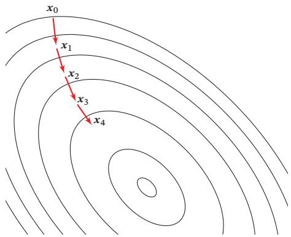  
图C.1 梯度下降法

[¶0326] 梯度下降法为一阶收敛算法，当靠近局部最小解时梯度变小，收敛速度会变慢，并且可能以“之字形”的方式下降．如果目标函数为二阶连续可微，我们可以采用牛顿法．牛顿法（Newton’s method）为二阶收敛算法，收敛速度更快，但是每次迭代需要计算Hessian矩阵的逆矩阵，复杂度较高

[¶0327] 相反，如果我们要求解一个最大值问题，就需要向梯度正方向迭代进行搜索，逐渐接近函数的局部最大解，这个过程则被称为梯度上升法（Gradient As-cent Method）

## C.3 拉格朗日乘数法与KKT条件

[¶0328] 拉格朗日乘数法（Lagrange Multiplier） 是一种有效求解约束优化问题的优化方法

[¶0329] 以数学家约瑟夫·拉格朗日命名

[¶0330] 约束优化问题可以表示为

[¶0331]
$$
\begin{array} { l c l c c l } { \displaystyle { \operatorname* { m i n } _ { x } } } & { f ( { \pmb x } ) } & { } & { } & { } & { } \\ { \mathrm { } } & { \hphantom { f ( { \pmb x } ) } } & { } & { } & { } & { } \\ { \mathrm { s . t . } } & { \hphantom { f ( { \pmb x } ) } } & { = } & { 0 , } & { m = 1 , \hdots , M } \\ { \mathrm { } } & { \hphantom { f ( { \pmb x } ) } } & { \hphantom { f ( { \pmb x } ) } } & { \hphantom { f ( { \pmb x } ) } } & { } & { } \\ { \mathrm { } } & { \hphantom { f ( { \pmb x } ) } } & { \hphantom { f ( { \pmb x } ) } } & { \hphantom { f ( { \pmb x } ) } } & { = } & { 0 , } & { n = 1 , \hdots , N } \end{array}\tag{C.10}
$$

[¶0332] 其中 $h _ { m } ( { \boldsymbol { x } } )$ 为等式约束函数， $g _ { n } ( { \pmb x } )$ 为不等式约束函数．??的可行域为

[¶0333]
$$
\mathcal { D } = \mathrm { d o m } ( f ) \cap \bigcap _ { m = 1 } ^ { M } \mathrm { d o m } ( h _ { m } ) \cap \bigcap _ { n = 1 } ^ { N } \mathrm { d o m } ( g _ { n } ) \subseteq \mathbb { R } ^ { D } ,\tag{C.11}
$$

[¶0334] 其中dom(??)是函数??的定义域

## C.3.1 等式约束优化问题

[¶0335] 如果公式(C.10)中只有等式约束，我们可以构造一个拉格朗日函数 $\Lambda ( { \pmb x } , \lambda )$

[¶0336]
$$
\Lambda ( { \pmb x } , \lambda ) = f ( { \pmb x } ) + \sum _ { m = 1 } ^ { M } \lambda _ { m } h _ { m } ( { \pmb x } ) ,\tag{C.12}
$$

[¶0337] 其中??为拉格朗日乘数，可以是正数或负数．如果 $f ( \boldsymbol { x } ^ { * } )$ 是原始约束优化问题的局部最优值，那么存在一个 $\lambda ^ { * }$ 使得 $( { \boldsymbol { x } } ^ { * } , \lambda ^ { * } )$ 为拉格朗日函数 $\Lambda ( { \pmb x } , \lambda )$ 的驻点．因此，只需要令 $\frac { \partial \Lambda ( x , \lambda ) } { \partial x } = 0$ 和 $\frac { \partial \Lambda ( x , \lambda ) } { \partial \lambda } = 0$ ，得到

[¶0338]
$$
\nabla f ( { \pmb x } ) + \sum _ { m = 1 } ^ { M } \lambda _ { m } \nabla h _ { m } ( { \pmb x } ) = 0 ,\tag{C.13}
$$

[¶0339]
$$
h _ { m } ( { \pmb x } ) = 0 , \qquad \forall m = 1 , \cdots , M .\tag{C.14}
$$

[¶0340] 上面方程组的解即为原始问题的可能解．因为驻点不一定是最小解，所以在实际应用中需根据具体问题来验证是否为最小解

[¶0341] 拉格朗日乘数法是将一个有??个变量和??个等式约束条件的最优化问题转换为一个有 $D + M$ 个变量的函数求驻点的问题．拉格朗日乘数法所得的驻点会包含原问题的所有最小解，但并不保证每个驻点都是原问题的最小解

## C.3.2 不等式约束优化问题

[¶0342] 对于公式(C.10)中定义的一般约束优化问题，其拉格朗日函数为

[¶0343]
$$
\Lambda ( x , a , b ) = f ( x ) + \sum _ { m = 1 } ^ { M } a _ { m } h _ { m } ( x ) + \sum _ { n = 1 } ^ { N } b _ { n } g _ { n } ( x ) ,\tag{C.15}
$$

[¶0344] 其中 $\pmb { a } = [ a _ { 1 } , \cdots , a _ { M } ] ^ { \intercal }$ 为等式约束的拉格朗日乘数， $\pmb { b } = [ b _ { 1 } , \cdots , b _ { N } ] ^ { \top }$ 为不等式约束的拉格朗日乘数

[¶0345] 不等式约束优化问题中的拉格朗日乘数也称为KKT乘数

[¶0346] 当约束条件不满足时，有 $\mathrm { m a x } _ { a , b } \Lambda ( x , a , b ) = \infty$ ；当约束条件满足时并且$\pmb { b } \geq 0$ 时， $\mathrm { m a x } _ { a , b } \Lambda ( x , a , b ) = f ( x )$ ．因此，原始约束优化问题等价于

[¶0347]
$$
\operatorname* { m i n } _ { \boldsymbol { x } } \operatorname* { m a x } _ { \boldsymbol { a } , \boldsymbol { b } } \qquad \Lambda ( \boldsymbol { x } , \boldsymbol { a } , \boldsymbol { b } ) ,\tag{C.16}
$$

[¶0348]
$$
\begin{array} { r } { \mathrm { s . t . } \qquad \pmb { b } \geq 0 , } \end{array}\tag{C.17}
$$

[¶0349] 这个min-max优化问题称为主问题（Primal Problem）

[¶0350] 对偶问题 主问题的优化一般比较困难，我们可以通过交换min-max的顺序来简化．定义拉格朗日对偶函数为

[¶0351]
$$
\Gamma ( a , b ) = \operatorname* { i n f } _ { x \in \mathcal { D } } \Lambda ( x , a , b ) .\tag{C.18}
$$

[¶0352] Γ(??, ??)是一个凹函数，即使 $f ( x )$ 是非凸的

[¶0353] 当 $\pmb { b } \geq 0$ 时，对于任意的 $\tilde { \boldsymbol { x } } \in \mathcal { D }$ ，有

[¶0354]
$$
\Gamma ( \pmb { a } , \pmb { b } ) = \operatorname* { i n f } _ { \pmb { x } \in \mathcal { D } } \Lambda ( \pmb { x } , \pmb { a } , \pmb { b } ) \leq \Lambda ( \tilde { \pmb { x } } , \pmb { a } , \pmb { b } ) \leq f ( \tilde { \pmb { x } } ) ,\tag{C.19}
$$

[¶0355] $\pmb { p } ^ { * }$ 是原问题的最优值，则有

[¶0356]
$$
\Gamma ( a , b ) \leq p ^ { * } ,\tag{C.20}
$$

[¶0357] 即拉格朗日对偶函数Γ(??, ??)为原问题最优值的下界

[¶0358] 优化拉格朗日对偶函数Γ(??, ??)并得到原问题的最优下界，称为拉格朗日对偶问题（Lagrange Dual Problem）

[¶0359]
$$
\operatorname* { m a x } _ { \mathbf { a } , \boldsymbol { b } } \qquad \Gamma ( \mathbf { a } , \boldsymbol { b } ) ,\tag{C.21}
$$

[¶0360]
$$
\mathrm { s . t . } \qquad \pmb { b } \geq 0 .\tag{C.22}
$$

[¶0361] 拉格朗日对偶函数为凹函数，因此拉格朗日对偶问题为凸优化问题

[¶0362] 令 $\pmb { d } ^ { * }$ 表示拉格朗日对偶问题的最优值，则有 $\pmb { d } ^ { * } \leq \pmb { p } ^ { * }$ ，这个性质称为弱对偶性（Weak Duality）．如果 $\ b { d } ^ { * } = \ b { p } ^ { * }$ ，这个性质称为强对偶性（Strong Duality）

[¶0363] 当强对偶性成立时，令 $\boldsymbol { x } ^ { * }$ 和 ${ \pmb a } ^ { * } , { \pmb b } ^ { * }$ 分别是原问题和对偶问题的最优解，那么它们满足以下条件：

[¶0364]
$$
\nabla f ( { \pmb x } ^ { * } ) + \sum _ { m = 1 } ^ { M } a _ { m } ^ { * } \nabla h _ { m } ( { \pmb x } ^ { * } ) + \sum _ { n = 1 } ^ { N } b _ { n } ^ { * } \nabla g _ { n } ( { \pmb x } ^ { * } ) = 0 ,\tag{C.23}
$$

[¶0365]
$$
h _ { m } ( { \pmb x } ^ { * } ) = 0 , \qquad m = 1 , \cdots , M\tag{C.24}
$$

[¶0366]
$$
g _ { n } ( x ^ { * } ) \le 0 , \qquad n = 1 , \cdots , N\tag{C.25}
$$

[¶0367]
$$
b _ { n } ^ { * } g _ { n } ( { \pmb x } ^ { * } ) = 0 , \qquad n = 1 , \cdots , N\tag{C.26}
$$

[¶0368]
$$
b _ { n } ^ { * } \geq 0 , \qquad n = 1 , \cdots , N\tag{C.27}
$$

[¶0369] 这 $5$ 个条件称为不等式约束优化问题的KKT 条件（Karush-Kuhn-Tucker Con-dition）．KKT条件是拉格朗日乘数法在不等式约束优化问题上的泛化．当原问题是凸优化问题时，满足KKT条件的解也是原问题和对偶问题的最优解

[¶0370] 在KKT条件中，需要关注的是公式(C.26)，称为互补松弛（ComplementarySlackness）条件．如果最优解 $x ^ { * }$ 出现在不等式约束的边界上 $g _ { n } ( { \pmb x } ) = 0$ ，则

[¶0371] $b _ { n } ^ { * } > 0$ ；如果最优解 $x ^ { * }$ 出现在不等式约束的内部 $g _ { n } ( { \pmb x } ) < 0$ ，则 $b _ { n } ^ { * } = 0$ ．互补松弛条件说明当最优解出现在不等式约束的内部，则约束失效

[¶0372]

## 附录D 概率论

[¶0373] 概率论主要研究大量随机现象中的数量规律，其应用十分广泛，几乎遍及各个领域

## D.1 样本空间

[¶0374] 样本空间是一个随机试验所有可能结果的集合．例如，如果抛掷一枚硬币，那么样本空间就是集合{正面，反面}．如果投掷一个骰子，那么样本空间就是{1, 2, 3, 4, 5, 6}．随机试验中的每个可能结果称为样本点

[¶0375] 有些试验有两个或多个可能的样本空间．例如，从52张扑克牌中随机抽出一张，样本空间可以是数字（A到K），也可以是花色（黑桃，红桃，梅花，方块）如果要完整地描述一张牌，就需要同时给出数字和花色，这时样本空间可以通过构建上述两个样本空间的笛卡儿乘积来得到

## 数学小知识|笛卡儿乘积

[¶0376] 在数学中，两个集合??和?? 的笛卡儿乘积（Cartesian product），又称直积，在集合论中表示为?? × ??，是所有可能的有序对组成的集合，其中有序对的第一个对象是??中的元素，第二个对象是??中的元素

[¶0377]
$$
\mathcal { X } \times \mathcal { Y } = \{ \langle x , y \rangle \mid x \in \mathcal { X } \land y \in \mathcal { Y } \} .
$$

[¶0378] 比如在扑克牌的例子中，如果集合??是13个元素的点数集合{A, K, Q, J,10, 9, 8, 7, 6, 5, 4, 3, 2}，而集合?? 是4个元素的花色集合{♠,♥,♦,♣ }，则这两个集合的笛卡儿积是有52个元素的标准扑克牌的集合{(A, ♠), (K, ♠),..., (2, ♠), (A, ♥), ..., (3, ♣), (2, ♣)}

## D.2 事件和概率

[¶0379] 随机事件（或简称事件）指的是一个被赋予概率的事物集合，也就是样本空间中的一个子集．概率（Probability）表示一个随机事件发生的可能性大小，为0到1之间的实数．比如，一个0.5的概率表示一个事件有50%的可能性发生

[¶0380] 对于一个机会均等的抛硬币动作来说，其样本空间为“正面”或“反面”．我们可以定义各个随机事件，并计算其概率．比如，

[¶0381] （1） {正面}，其概率为0.5

[¶0382] （2） {反面}，其概率为0.5

[¶0383] （3） 空集∅，不是正面也不是反面，其概率为0

[¶0384] （4） {正面|反面}，不是正面就是反面，其概率为1

## D.2.1 随机变量

[¶0385] 在随机试验中，试验的结果可以用一个数?? 来表示，这个数?? 是随着试验结果的不同而变化的，是样本点的一个函数．我们把这种数称为随机变量（Ran-dom Variable）．例如，随机掷一个骰子，得到的点数就可以看成一个随机变量??，?? 的取值为 {1, 2, 3, 4, 5, 6}

[¶0386] 如果随机掷两个骰子，整个事件空间Ω可以由36个元素组成：

[¶0387]
$$
\Omega = \{ ( i , j ) | i = 1 , \ldots , 6 ; j = 1 , \ldots , 6 \} .\tag{D.1}
$$

[¶0388] 一个随机事件也可以定义多个随机变量．比如在掷两个骰子的随机事件中，可以定义随机变量?? 为获得的两个骰子的点数和，也可以定义随机变量?? 为获得的两个骰子的点数差．随机变量??可以有11个整数值，而随机变量?? 只有6个整数值

[¶0389]
$$
X ( i , j ) \quad : = \quad i + j , \quad x = 2 , 3 , \ldots , 1 2 ,\tag{D.2}
$$

[¶0390]
$$
\begin{array} { r c l } { { Y ( i , j ) } } & { { : = } } & { { \mid i - j \mid , ~ y = 0 , 1 , 2 , 3 , 4 , 5 . } } \end{array}\tag{D.3}
$$

[¶0391] 其中 $i , j$ 分别为两个骰子的点数

## D.2.1.1 离散随机变量

[¶0392] 如果随机变量??所可能取的值为有限可列举的，有??个有限取值

[¶0393]
$$
\{ x _ { 1 } , \cdots , x _ { N } \} ,
$$

[¶0394] 一般用大写的字母表示一个随机变量，用小字字母表示该变量的某一个具体的取值

[¶0395] 则称??为离散随机变量

[¶0396] 要了解??的统计规律，就必须知道它取每种可能值 $x _ { n }$ 的概率，即

[¶0397]
$$
P ( X = x _ { n } ) = p ( x _ { n } ) , \qquad \forall n \in \{ 1 , \cdots , N \}\tag{D.4}
$$

[¶0398] 其中 $p ( x _ { 1 } ) , \cdots , p ( x _ { N } )$ 称为离散随机变量 ?? 的概率分布（Probability Distribu-tion）或分布，并且满足

[¶0399]
$$
\sum _ { n = 1 } ^ { N } p ( x _ { n } ) = 1 ,\tag{D.5}
$$

[¶0400]
$$
p ( x _ { n } ) \geq 0 , \qquad \forall n \in \{ 1 , \cdots , N \} .\tag{D.6}
$$

[¶0401] 常见的离散随机变量的概率分布有：

[¶0402] 伯努利分布 在一次试验中，事件A出现的概率为 $\mu$ ，不出现的概率为 $1 - \mu .$ ．若用变量??表示事件??出现的次数，则??的取值为0和1，其相应的分布为

[¶0403]
$$
p ( x ) = \mu ^ { x } ( 1 - \mu ) ^ { ( 1 - x ) } ,\tag{D.7}
$$

[¶0404] 这个分布称为伯努利分布（Bernoulli Distribution）,又名两点分布或者0-1分布二项分布 在N次伯努利试验中，若以变量??表示事件A出现的次数，则??的取值为 $\{ 0 , \cdots , N \}$ ，其相应的分布为二项分布（Binomial Distribution）

[¶0405] “二项分布”名称的来源是由于其定义形式为二项式 $( \boldsymbol { p } + \boldsymbol { q } ) ^ { N }$ 的展示式中的第??项

[¶0406]
$$
P ( X = k ) = { \binom { N } { k } } \mu ^ { k } ( 1 - \mu ) ^ { N - k } , \qquad k = 0 , \cdots , N ,\tag{D.8}
$$

[¶0407] 其中 $\binom { N } { k }$ 为二项式系数，表示从?? 个元素中取出??个元素而不考虑其顺序的组合的总数

## 数学小知识 | 排列组合

[¶0408] 排列组合是组合学最基本的概念

[¶0409] 排列是指从给定个数的元素中取出指定个数的元素进行排序．??个不同的元素可以有??!种不同的排列方式，即??的阶乘

[¶0410]
$$
N ! \triangleq N \times ( N - 1 ) \times \cdots \times 3 \times 2 \times 1 .
$$

[¶0411] 如果从??个元素中取出??个元素，这??个元素的排列总数为

[¶0412]
$$
P _ { N } ^ { k } \triangleq N \times ( N - 1 ) \times \cdots \times ( N - k + 1 ) = { \frac { N ! } { ( N - k ) ! } } .
$$

[¶0413] 组合则是指从给定个数的元素中仅仅取出指定个数的元素，不考虑排序．从??个元素中取出??个元素，这??个元素可能出现的组合数为

[¶0414]
$$
C _ { N } ^ { k } \triangleq \binom { N } { k } = \frac { P _ { N } ^ { k } } { k ! } = \frac { N ! } { k ! ( N - k ) ! } .
$$

## D.2.1.2 连续随机变量

[¶0415] 与离散随机变量不同，一些随机变量??的取值是不可列举的，由全部实数或者由一部分区间组成，比如

[¶0416]
$$
X = \{ x | a \leq x \leq b \} , \quad - \infty < a < b < \infty ,
$$

[¶0417] 则称??为连续随机变量．连续随机变量的值是不可数及无穷尽的

[¶0418] 对于连续随机变量??，它取一个具体值 $x _ { i }$ 的概率为0，这和离散随机变量截然不同．因此用列举连续随机变量取某个值的概率来描述这种随机变量不但做不到，也毫无意义

[¶0419] 连续随机变量?? 的概率分布一般用概率密度函数（Probability Density Func-${ \mathrm { t i o n } } , { \mathrm { P D F } } ) p ( x )$ 来描述 $p ( x )$ 为可积函数，并满足

[¶0420]
$$
\int _ { - \infty } ^ { + \infty } p ( x ) \mathrm { d } x = 1 ,\tag{D.9}
$$

[¶0421]
$$
\begin{array} { r l r } { p ( x ) } & { { } \ge } & { 0 . } \end{array}\tag{D.10}
$$

[¶0422] 给定概率密度函数 $p ( x )$ ，便可以计算出随机变量落入某一个区域的概率．令ℛ表示??的非常小的邻近区域， $| \mathcal { R } |$ 表示ℛ的大小，则 $p ( x ) | \mathcal { R } |$ 可以反映随机变量处于区域ℛ的概率大小

[¶0423] 常见的连续随机变量的概率分布有：

[¶0424] 均匀分布 若 $a , b$ 为有限数， $[ a , b ]$ 上的均匀分布（Uniform Distribution）的概率密度函数定义为

[¶0425]
$$
p ( x ) = \left\{ { \begin{array} { c l } { \frac { 1 } { b - a } , } & { a \leq x \leq b } \\ { 0 } & { , } \end{array} } \right.\tag{D.11}
$$

[¶0426] 正态分布 正态分布（Normal Distribution），又名高斯分布（Gaussian Distri-bution），是自然界最常见的一种分布，并且具有很多良好的性质，在很多领域都有非常重要的影响力，其概率密度函数为

[¶0427]
$$
p ( x ) = \frac { 1 } { \sqrt { 2 \pi } \sigma } ~ \mathrm { e x p } \Big ( - \frac { ( x - \mu ) ^ { 2 } } { 2 \sigma ^ { 2 } } \Big ) ,\tag{D.12}
$$

[¶0428] 其中 $\sigma > 0 , \mu$ 和 $\sigma$ 均为常数．若随机变量?? 服从一个参数为 $\mu$ 和 $\sigma$ 的概率分布，简记为

[¶0429]
$$
X \sim { \mathcal { N } } ( \mu , \sigma ^ { 2 } ) .\tag{D.13}
$$

[¶0430] 当 $\mu = 0 , \sigma = 1$ 时，称为标准正态分布（Standard Normal Distribution）

[¶0431] 图D.1a和D.1b分别显示了均匀分布和正态分布的概率密度函数

[¶0432]
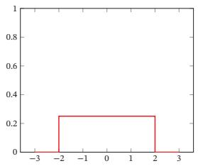  
(a)均匀分布

[¶0433]
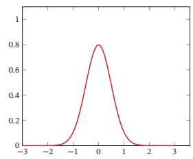  
(b)正态分布  
图D.1 连续随机变量的概率密度函数

## D.2.1.3 累积分布函数

[¶0434] 对于一个随机变量 ??，其累积分布函数（Cumulative Distribution Func-tion，CDF）是随机变量??的取值小于等于??的概率

[¶0435]
$$
\operatorname { c d f } ( x ) = P ( X \leq x ) .\tag{D.14}
$$

[¶0436] 以连续随机变量??为例，累积分布函数定义为

[¶0437]
$$
\operatorname { c d f } ( x ) = \int _ { - \infty } ^ { x } p ( t ) \mathrm { d } t ,\tag{D.15}
$$

[¶0438] 其中 $p ( x )$ 为概率密度函数．图D.2给出了标准正态分布的概率密度函数和累计分布函数．

[¶0439]
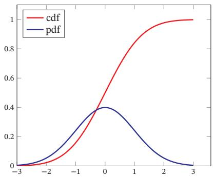  
图D.2 标准正态分布的概率密度函数和累计分布函数

## D.2.2 随机向量

[¶0440] 随机向量是指一组随机变量构成的向量．如果 $X _ { 1 } , X _ { 2 } , \cdots , X _ { K }$ 为??个随机变量, 那么称 $\boldsymbol { X } = [ X _ { 1 } , X _ { 2 } , \cdots , X _ { K } ]$ 为一个??维随机向量．随机向量也分为离散随机向量和连续随机向量

[¶0441] 一维随机向量即随机变量

## D.2.2.1 离散随机向量

[¶0442] 离散随机向量的联合概率分布（Joint Probability Distribution）为

[¶0443]
$$
P ( X _ { 1 } = x _ { 1 } , X _ { 2 } = x _ { 2 } , \cdots , X _ { K } = x _ { K } ) = p ( x _ { 1 } , x _ { 2 } , \cdots , x _ { K } ) ,
$$

[¶0444] 其中 $\boldsymbol { x } _ { k } \in \Omega _ { k }$ 为变量 $X _ { k }$ 的取值， $\Omega _ { k }$ 为变量 $X _ { k }$ 的样本空间

[¶0445] 和离散随机变量类似，离散随机向量的概率分布满足

[¶0446]
$$
p ( x _ { 1 } , x _ { 2 } , \cdots , x _ { K } ) \geq 0 , \qquad \forall x _ { 1 } \in \Omega _ { 1 } , x _ { 2 } \in \Omega _ { 2 } , \cdots , x _ { K } \in \Omega _ { K }\tag{D.16}
$$

[¶0447]
$$
\sum _ { x _ { 1 } \in \Omega _ { 1 } } \sum _ { x _ { 2 } \in \Omega _ { 2 } } \cdots \sum _ { x _ { K } \in \Omega _ { K } } p ( x _ { 1 } , x _ { 2 } , \cdots , x _ { K } ) = 1 .\tag{D.17}
$$

[¶0448] 多项分布 一个最常见的离散向量概率分布为多项分布（Multinomial Distri-bution）．多项分布是二项分布在随机向量的推广．假设一个袋子中装了很多球，总共有??个不同的颜色．我们从袋子中取出??个球．每次取出一个球时，就在袋子中放入一个同样颜色的球．这样保证同一颜色的球在不同试验中被取出的概率是相等的．令?? 为一个??维随机向量，每个元素 $X _ { k } ( k = 1 , \cdots , K )$ 为取出的??个球中颜色为??的球的数量，则??服从多项分布，其概率分布为

[¶0449]
$$
p ( x _ { 1 } , \dots , x _ { K } | \mu ) = \frac { N ! } { x _ { 1 } ! \cdots x _ { K } ! } \mu _ { 1 } ^ { x _ { 1 } } \cdots \mu _ { K } ^ { x _ { K } } ,\tag{D.18}
$$

[¶0450] 其中 $\pmb { \mu } = [ \mu _ { 1 } , \cdots , \mu _ { K } ] ^ { \intercal }$ 分别为每次抽取的球的颜色为 $1 , \cdots , K$ 的概率； $\mathbf { \Phi } : x _ { 1 } , \cdots , x _ { K }$ 为非负整数，并且满足 $\textstyle \sum _ { k = 1 } ^ { K } x _ { k } = N$

[¶0451] 多项分布的概率分布也可以用gamma函数表示：

[¶0452]
$$
p ( x _ { 1 } , \cdots , x _ { K } | \mu ) = { \frac { \Gamma ( \sum _ { k } x _ { k } + 1 ) } { \prod _ { k } \Gamma ( x _ { k } + 1 ) } } \prod _ { k = 1 } ^ { K } \mu _ { k } ^ { x _ { k } } ,\tag{D.19}
$$

[¶0453] 其中 $\Gamma ( z ) = \int _ { 0 } ^ { \infty } \frac { t ^ { z - 1 } } { \exp ( t ) }$ d?? 为 gamma 函数． 这种表示形式和狄利克雷分布类似，而狄利克雷分布可以作为多项分布的共轭先验

[¶0454] 狄 利 克 雷 分 布 参 见第D.2.2.2节

## D.2.2.2 连续随机向量

[¶0455] 一个 ?? 维连续随机向量 ?? 的联合概率密度函数（Joint Probability DensityFunction）满足

[¶0456]
$$
p ( { \pmb x } ) = p ( x _ { 1 } , \cdots , x _ { K } ) \geq 0 ,\tag{D.20}
$$

[¶0457]
$$
\int _ { - \infty } ^ { + \infty } \cdots \int _ { - \infty } ^ { + \infty } p ( x _ { 1 } , \cdots , x _ { K } ) \mathrm { d } x _ { 1 } \cdots \mathrm { d } x _ { K } = 1 .\tag{D.21}
$$

[¶0458] 多元正态分布 使用最广泛的连续随机向量分布为多元正态分布（MultivariateNormal Distribution），也称为多元高斯分布（Multivariate Gaussian Distribu-tion）．若??维随机向量 $\pmb { X } = [ X _ { 1 } , \ldots , X _ { K } ] ^ { \intercal }$ 服从??元正态分布，其密度函数为

[¶0459]
$$
p ( \pmb { x } ) = \frac { 1 } { ( 2 \pi ) ^ { K / 2 } | \Sigma | ^ { 1 / 2 } } \exp \left( - \frac { 1 } { 2 } ( \pmb { x } - \pmb { \mu } ) ^ { \top } \Sigma ^ { - 1 } ( \pmb { x } - \pmb { \mu } ) \right) ,\tag{D.22}
$$

[¶0460] 其中 $\pmb { \mu } \in \mathbb { R } ^ { K }$ 为多元正态分布的均值向量， $\pmb { \Sigma } \in \mathbb { R } ^ { K \times K }$ 为多元正态分布的协方差矩阵， $| \Sigma |$ 表示??的行列式

[¶0461] 各项同性高斯分布 如果一个多元高斯分布的协方差矩阵简化为 $\pmb { \Sigma } = \sigma ^ { 2 } \pmb { I }$ ，即每一个维随机变量都独立并且方差相同，那么这个多元高斯分布称为各向同性高斯分布（Isotropic Gaussian Distribution）

[¶0462] 狄利克雷分布 如果一个??维随机向量?? 服从狄利克雷分布（Dirichlet Distri-bution），其密度函数为

[¶0463]
$$
p ( \pmb { x } | \alpha ) = \frac { \Gamma ( \alpha _ { 0 } ) } { \Gamma ( \alpha _ { 1 } ) \cdots \Gamma ( \alpha _ { K } ) } \prod _ { k = 1 } ^ { K } x _ { k } ^ { \alpha _ { k } - 1 } ,\tag{D.23}
$$

[¶0464] 其中 $\pmb { \alpha } = [ \alpha _ { 1 } , \dots , \alpha _ { K } ] ^ { \top }$ 为狄利克雷分布的参数

## D.2.3 边际分布

[¶0465] 对于二维离散随机向量(??, ?? )，假设??取值空间为 $\Omega _ { x } , Y$ 取值空间为 $\Omega _ { y }$ ，其联合概率分布满足

[¶0466]
$$
p ( x , y ) \geq 0 , \qquad \sum _ { x \in \Omega _ { x } } \sum _ { y \in \Omega _ { y } } p ( x , y ) = 1 .
$$

[¶0467] 不失一般性，这里以二维随机向量进行讨论，这些结论在多维时依然成立

[¶0468] (D.24)

[¶0469] 对于联合概率分布 $p ( x , y )$ ，我们可以分别对??和??进行求和

[¶0470] （1）对于固定的??，

[¶0471]
$$
\sum _ { y \in \Omega _ { y } } p ( x , y ) = p ( x ) .\tag{D.25}
$$

[¶0472] （2）对于固定的??，

[¶0473]
$$
\sum _ { x \in \Omega _ { x } } p ( x , y ) = p ( y ) .\tag{D.26}
$$

[¶0474] 由离散随机向量(??, ?? )的联合概率分布，对?? 的所有取值进行求和得到??的概率分布；而对?? 的所有取值进行求和得到?? 的概率分布．这里 $p ( x )$ 和 $p ( y )$ 就称为 $p ( x , y )$ 的边际分布（Marginal Distribution）

[¶0475] 对于二维连续随机向量(??, ?? )，其边际分布为

[¶0476]
$$
p ( x ) = \int _ { - \infty } ^ { + \infty } p ( x , y ) \mathrm { d } y ,\tag{D.27}
$$

[¶0477]
$$
p ( y ) = \int _ { - \infty } ^ { + \infty } p ( x , y ) \mathrm { d } x .\tag{D.28}
$$

[¶0478] 一个二元正态分布的边际分布仍为正态分布

## D.2.4 条件概率分布

[¶0479] 对于离散随机向量(??, ?? )，已知 $X = x$ 的条件下，随机变量 $Y = y$ 的条件概率（Conditional Probability）为

[¶0480]
$$
p ( y | x ) \triangleq P ( Y = y | X = x ) = \frac { p ( x , y ) } { p ( x ) } .\tag{D.29}
$$

[¶0481] 这个公式定义了随机变量??关于随机变量??的条件概率分布（Conditional Prob-ability Distribution），简称条件分布

[¶0482] 对于二维连续随机向量(??, ?? )，已知 $X = x$ 的条件下，随机变量 $Y = y$ 的条件概率密度函数（Conditional Probability Density Function）为

[¶0483]
$$
p ( y | x ) = \frac { p ( x , y ) } { p ( x ) } .\tag{D.30}
$$

[¶0484] 同理，已知 $Y = y$ 的条件下，随机变量?? = ??的条件概率密度函数为

[¶0485]
$$
p ( x | y ) = { \frac { p ( x , y ) } { p ( y ) } } .\tag{D.31}
$$

## D.2.5 贝叶斯定理

[¶0486] 通过公式(D.30)和(D.31)，两个条件概率 $p ( y | x )$ 和 $p ( x | y )$ 之间的关系为

[¶0487]
$$
p ( y | x ) = \frac { p ( x | y ) { p ( y ) } } { p ( x ) } .\tag{D.32}
$$

[¶0488] 这个公式称为贝叶斯定理（Bayes’ Theorem），或贝叶斯公式

## D.2.6 独立与条件独立

[¶0489] 对于两个离散（或连续）随机变量??和??，如果其联合概率（或联合概率密度函数） $p ( x , y )$ 满足

[¶0490]
$$
\begin{array} { r } { p ( x , y ) = p ( x ) p ( y ) , } \end{array}\tag{D.33}
$$

[¶0491] 则称?? 和?? 互相独立（Independence），记为?? ⟂ ??

[¶0492] 对于三个离散（或连续）随机变量??、?? 和??，如果条件概率（或联合概率密度函数） $p ( x , y | z )$ 满足

[¶0493]
$$
\begin{array} { r } { p ( x , y | z ) = p ( x | z ) p ( y | z ) , } \end{array}\tag{D.34}
$$

[¶0494] 则称在给定变量 ?? 时，?? 和??条件独立（Conditional Independence），记为?? ⟂??|??．

## D.2.7 期望和方差

[¶0495] 期望 对于 ?? 个取值的离散变量 ??，其概率分布为 $p ( x _ { 1 } ) , \cdots , p ( x _ { N } )$ ，?? 的期望（Expectation）定义为

[¶0496]
$$
\mathbb { E } [ X ] = \sum _ { n = 1 } ^ { N } x _ { n } p ( x _ { n } ) .\tag{D.35}
$$

[¶0497] 对于连续随机变量??，概率密度函数为 $p ( x )$ ，其期望定义为

[¶0498]
$$
\mathbb { E } [ X ] = \int _ { \mathbb { R } } x p ( x ) \mathrm { d } x .\tag{D.36}
$$

[¶0499] 方差 随机变量??的方差（Variance）用来定义它的概率分布的离散程度：

[¶0500]
$$
\operatorname { v a r } ( X ) = \mathbb { E } { \biggl [ } { \bigl ( } X - \mathbb { E } [ X ] { \bigr ) } ^ { 2 } { \biggr ] } .\tag{D.37}
$$

[¶0501] 随机变量??的方差也称为它的二阶矩 $\sqrt { \operatorname { v a r } ( X ) }$ 则称为??的根方差或标准差

[¶0502] 协方差 两个连续随机变量?? 和?? 的协方差（Covariance）用来衡量两个随机变量的分布之间的总体变化性，定义为

[¶0503]
$$
\operatorname { c o v } ( X , Y ) = \mathbb { E } \bigg [ \Big ( X - \mathbb { E } [ X ] \Big ) \Big ( Y - \mathbb { E } [ Y ] \Big ) \bigg ] ,\tag{D.38}
$$

[¶0504] 协方差经常也用来衡量两个随机变量之间的线性相关性．如果两个随机变量的协方差为0，那么称这两个随机变量是线性不相关．两个随机变量之间没有线性相关性，并非表示它们之间是独立的，可能存在某种非线性的函数关系．反之，如果??与?? 是统计独立的，那么它们之间的协方差一定为0

[¶0505] 这里的线性相关和线性 代 数 中 的线 性 相关含义不同

[¶0506] 协方差矩阵 两个??和?? 维的连续随机向量?? 和??，它们的协方差（Covari-ance）为 $M \times N$ 的矩阵，定义为

[¶0507]
$$
\operatorname { c o v } ( X , Y ) = \mathbb { E } \bigg [ \Big ( X - \mathbb { E } [ X ] \Big ) \Big ( Y - \mathbb { E } [ Y ] \Big ) ^ { \top } \bigg ] .\tag{D.39}
$$

[¶0508] 协方差矩阵cov(??, ?? )的第(??, ??)个元素等于随机变量 $X _ { m }$ 和 $Y _ { n }$ 的协方差两个随机向量的协方差 $\operatorname { c o v } ( X , Y )$ 与cov(??, ??)互为转置关系

[¶0509] 如果两个随机向量的协方差矩阵为对角矩阵，那么称这两个随机向量是无关的．

[¶0510] 单个随机向量??的协方差矩阵定义为

[¶0511]
$$
\operatorname { c o v } ( X ) = \operatorname { c o v } ( X , X ) .\tag{D.40}
$$

## D.2.7.1 Jensen 不等式

[¶0512] 如果??是随机变量，??是凸函数，则

[¶0513]
$$
g \left( \mathbb { E } [ X ] \right) \leq \mathbb { E } \left[ g ( X ) \right] .\tag{D.41}
$$

[¶0514] 等式当且仅当 ?? 是一个常数或??是线性时成立，这个性质称为Jensen不等式

[¶0515] 特别地，对于凸函数 $g$ 定义域上的任意两点 $x _ { 1 } , x _ { 2 }$ 和一个标量 $\lambda \in \left[ 0 , 1 \right]$ ，有

[¶0516]
$$
\begin{array} { r } { g \big ( \lambda x _ { 1 } + ( 1 - \lambda ) x _ { 2 } \big ) \leq \lambda g ( x _ { 1 } ) + ( 1 - \lambda ) g ( x _ { 2 } ) , } \end{array}\tag{D.42}
$$

[¶0517] 即凸函数??上的任意两点的连线位于这两点之间函数曲线的上方

## D.2.7.2 大数定律

[¶0518] 大数定律（Law of Large Numbers）是指 ?? 个样本 $X _ { 1 } , \cdots , X _ { N }$ 是独立同分布的，即?? $[ X _ { 1 } ] = \cdots = \operatorname { \mathbb { E } } [ X _ { N } ] = \mu$ ，那么其均值

[¶0519]
$$
\bar { X } _ { N } = \frac 1 N ( X _ { 1 } + \cdots + X _ { N } ) ,\tag{D.43}
$$

[¶0520] 收敛于期望值 $\mu$ ，即

[¶0521]
$$
\bar { X } _ { N }  \mu \qquad \mathrm { f o r } \qquad N  \infty .\tag{D.44}
$$

## D.3 随机过程

[¶0522] 随机过程（Stochastic Process）是一组随机变量 $X _ { t }$ 的集合，其中??属于一个索引（index）集合 $\mathcal { T }$ ．索引集合??可以定义在时间域或者空间域，但一般为时间域，以实数或正数表示．当??为实数时，随机过程为连续随机过程；当??为整数时，为离散随机过程．日常生活中的很多例子包括股票的波动、语音信号、身高的变化等都可以看作随机过程．常见的和时间相关的随机过程模型包括伯努利过程、随机游走（Random Walk）、马尔可夫过程等．和空间相关的随机过程通常称为随机场（Random Field）．比如一张二维的图片，每个像素点（变量）通过空间的位置进行索引，这些像素就组成了一个随机过程

## D.3.1 马尔可夫过程

[¶0523] 马尔可夫性质 在随机过程中，马尔可夫性质（Markov Property）是指一个随机过程在给定现在状态及所有过去状态情况下，其未来状态的条件概率分布仅依赖于当前状态．以离散随机过程为例，假设随机变量 $X _ { 0 } , X _ { 1 } , \cdots , X _ { T }$ 构成一个随机过程．这些随机变量的所有可能取值的集合被称为状态空间（State Space）如果 $X _ { t + 1 }$ 对于过去状态的条件概率分布仅是 $X _ { t }$ 的一个函数，则

[¶0524]
$$
P ( X _ { t + 1 } = x _ { t + 1 } | X _ { 0 : t } = x _ { 0 : t } ) = P ( X _ { t + 1 } = x _ { t + 1 } | X _ { t } = x _ { t } ) ,\tag{D.45}
$$

[¶0525] 其中 $X _ { 0 : t }$ 表示变量集合 $X _ { 0 } , X _ { 1 } , \cdots , X _ { t } , x _ { 0 : t }$ 为在状态空间中的状态序列

[¶0526] 马尔可夫性质也可以描述为给定当前状态时，将来的状态与过去状态是条件独立的

## D.3.1.1 马尔可夫链

[¶0527] 离散时间的马尔可夫过程也称为马尔可夫链（Markov Chain）．如果一个马尔可夫链的条件概率

[¶0528]
$$
P ( X _ { t + 1 } = s | X _ { t } = s ^ { \prime } ) = m _ { s s ^ { \prime } } ,\tag{D.46}
$$

[¶0529] 只和状态 $s$ 和 $s ^ { \prime }$ 相关，和时间??无关，则称为时间同质的马尔可夫链（Time-Homogeneous Markov Chain），其中 $m _ { s s ^ { \prime } }$ 称为状态转移概率．如果状态空间大小??是有限的，状态转移概率可以用一个矩阵 $\pmb { M } \in \mathbb { R } ^ { K \times K }$ 表示，称为状态转移矩阵（Transition Matrix），其中元素 $m _ { i j }$ 表示状态 $s _ { i }$ 转移到状态?? 的概率 $s _ { j }$

[¶0530] 平稳分布 假设状态空间大小为 $K$ ，向量 $\pi = [ \pi _ { 1 } , \cdots , \pi _ { K } ] ^ { \intercal }$ 为状态空间中的一个分布，满足 $0 \leq \pi _ { k } \leq 1$ 和 $\begin{array} { r } { \sum _ { k = 1 } ^ { K } \pi _ { k } = 1 } \end{array}$

[¶0531] 对于状态转移矩阵为??的时间同质的马尔可夫链，若存在一个分布 $\pi$ 满足

[¶0532]
$$
\pi = M \pi ,\tag{D.47}
$$

[¶0533] 则称分布 $\pi$ 为该马尔可夫链的平稳分布（Stationary Distribution）．根据特征向量的定义可知， $\pi$ 为矩阵??的（归一化）的对应特征值为1的特征向量

[¶0534] 如果一个马尔可夫链的状态转移矩阵??满足所有状态可遍历性以及非周期性，那么对于任意一个初始状态分布 $\pi ^ { ( 0 ) }$ ，在经过一定时间的状态转移之后，都会收敛到平稳分布，即

[¶0535]
$$
\boldsymbol { \pi } = \operatorname* { l i m } _ { T \to \infty } \mathbf { M } ^ { T } \boldsymbol { \pi } ^ { ( 0 ) } .\tag{D.48}
$$

[¶0536] 定理 D.1 – 细致平稳条件（Detailed Balance Condition）： 给定一个状态空间中的分布 $\pi \in [ 0 , 1 ] ^ { K }$ ，如果一个状态转移矩阵为 $\pmb { M } \in \mathbb { R } ^ { K \times K }$ 的马尔可夫链满足

[¶0537]
$$
\pi _ { i } m _ { i j } = \pi _ { j } m _ { j i } , \quad \forall 1 \leq i , j \leq K\tag{D.49}
$$

[¶0538] 则该马尔可夫链经过一定时间的状态转移后一定会收敛到分布 $\pi$

[¶0539] 细致平稳条件只是马尔可夫链收敛的充分条件，不是必要条件．细致平稳条件保证了从状态??转移到状态 $j$ 的数量和从状态??转移到状态??的数量相一致，互相抵消，所以数量不发生改变

## D.3.2 高斯过程

[¶0540] 高斯过程（Gaussian Process）也是一种应用广泛的随机过程模型．假设有一组连续随机变量 $X _ { 0 } , X _ { 1 } , \cdots , X _ { T }$ ，如果由这组随机变量构成的任一有限集合

[¶0541]
$$
X _ { t _ { 1 } , \cdots , t _ { N } } = [ X _ { t _ { 1 } } , \cdots , X _ { t _ { N } } ] ^ { \intercal } , \quad 1 \leq N \leq T
$$

[¶0542] 都服从一个多元正态分布，那么这组随机变量为一个随机过程．高斯过程也可以定义为：如果 $X _ { t _ { 1 } , \cdots , t _ { N } }$ 的任一线性组合都服从一元正态分布，那么这组随机变量为一个随机过程

[¶0543] 高斯过程回归 高斯过程回归（Gaussian Process Regression）是利用高斯过程来对一个函数分布进行建模．和机器学习中参数化建模（比如贝叶斯线性回归）相比，高斯过程是一种非参数模型，可以拟合一个黑盒函数，并给出拟合结果的置信度 [Rasmussen, 2003]

[¶0544] 假设一个未知函数 $f ( x )$ 服从高斯过程，且为平滑函数．如果两个样本 $\mathbf { \boldsymbol { x } } _ { 1 } , \mathbf { \boldsymbol { x } } _ { 2 }$ 比较接近，那么对应的 $f ( \pmb { x } _ { 1 } ) , f ( \pmb { x } _ { 2 } )$ 也比较接近．假设从函数 $f ( x )$ 中采样有限个样本 $\pmb { X } = [ \pmb { x } _ { 1 } , \pmb { x } _ { 2 } , \cdots , \pmb { x } _ { N } ]$ ，这??个点服从一个多元正态分布，

[¶0545]
$$
[ f ( \pmb { x } _ { 1 } ) , f ( \pmb { x } _ { 2 } ) , \cdots , f ( \pmb { x } _ { N } ) ] ^ { \top } \sim \mathcal { N } \Big ( \pmb { \mu } ( X ) , \pmb { K } ( X , X ) \Big ) ,\tag{D.50}
$$

[¶0546] 其中 $\boldsymbol { \mu } ( \boldsymbol { X } ) = [ \mu ( \boldsymbol { x } _ { 1 } ) , \mu ( \boldsymbol { x } _ { 2 } ) , \cdots , \mu ( \boldsymbol { x } _ { N } ) ] ^ { \intercal }$ 是均值向量， $K ( \boldsymbol { X } , \boldsymbol { X } ) = [ k ( \boldsymbol { x } _ { i } , \boldsymbol { x } _ { j } ) ] _ { N \times N }$ 是协方差矩阵， $k ( \pmb { x } _ { i } , \pmb { x } _ { j } )$ 为核函数，可以衡量两个样本的相似度

[¶0547] 在高斯过程回归中，一个常用的核函数是平方指数（Squared Exponential）核函数：

[¶0548]
$$
k ( \pmb { x } _ { i } , \pmb { x } _ { j } ) = \exp \left( \frac { - \| \pmb { x } _ { i } - \pmb { x } _ { j } \| ^ { 2 } } { 2 l ^ { 2 } } \right) ,\tag{D.51}
$$

[¶0549] 在支持向量机中，平方指数核函数也叫高斯核函数或径向基函数为了避免混淆，这里称为平方指数核函数

[¶0550] 其中??为超参数．当 $\mathbf { \nabla } x _ { i }$ 和 $x _ { j }$ 越接近，其函数值越大，表明 $f ( { \pmb x } _ { i } )$ 和 $f ( \pmb { x } _ { j } )$ 越相关

[¶0551] 假设 $f ( x )$ 的一组带噪声的观测值为 $\{ ( \pmb { x } _ { n } , y _ { n } ) \} _ { n = 1 } ^ { N }$ ，其中 $y _ { n } \sim \mathcal { N } ( f ( \pmb { x } _ { n } ) , \sigma ^ { 2 } )$ 为 $f ( x _ { n } )$ 的观测值，服从正态分布， $\sigma$ 为噪声方差

[¶0552] 对于一个新的样本点 $x ^ { * }$ ，我们希望预测 $f ( \boldsymbol { x } ^ { * } )$ 的观测值 $y ^ { * }$ ．令向量 $y \ : =$ $[ y _ { 1 } , y _ { 2 } , \cdots , y _ { N } ] ^ { \intercal }$ 为已有的观测值，根据高斯过程的假设， $\left[ \boldsymbol { y } ; \boldsymbol { y } ^ { * } \right]$ 满足

[¶0553]
$$
\left[ \begin{array} { c } { y } \\ { y ^ { * } } \end{array} \right] \sim \mathcal { N } \left( \left[ \begin{array} { c } { \mu ( X ) } \\ { \mu ( x ^ { * } ) } \end{array} \right] , \left[ \begin{array} { c c } { K ( X , X ) + \sigma ^ { 2 } I } & { K ( x ^ { * } , X ) ^ { \top } } \\ { K ( x ^ { * } , X ) } & { k ( x ^ { * } , x ^ { * } ) } \end{array} \right] \right) ,\tag{D.52}
$$

[¶0554] 其中 $K ( { \boldsymbol x } ^ { * } , { \boldsymbol X } ) = [ k ( { \boldsymbol x } ^ { * } , { \boldsymbol x } _ { 1 } ) , \cdots , k ( { \boldsymbol x } ^ { * } , { \boldsymbol x } _ { n } ) ]$

[¶0555] 根据上面的联合分布， $y ^ { * }$ 的后验分布为

[¶0556]
$$
p ( y ^ { \ast } | X , y ) = \mathcal { N } ( \hat { \mu } , \hat { \sigma } ^ { 2 } ) ,\tag{D.53}
$$

[¶0557] 其中均值 $\hat { \mu }$ 和方差 $\hat { \sigma }$ 为

[¶0558]
$$
\hat { \mu } = K ( x ^ { * } , X ) ( K ( X , X ) + \sigma ^ { 2 } I ) ^ { - 1 } ( y - \mu ( X ) ) + \mu ( x ^ { * } ) ,\tag{D.54}
$$

[¶0559]
$$
\hat { \sigma } ^ { 2 } = k ( x ^ { * } , x ^ { * } ) - K ( x ^ { * } , X ) ( K ( X , X ) + \sigma ^ { 2 } I ) ^ { - 1 } K ( x ^ { * } , X ) ^ { \top } .\tag{D.55}
$$

[¶0560] 从公式(D.54)可以看出，均值函数 $\mu ( x )$ 可以近似地互相抵消．在实际应用中，一般假设 $\pmb { \mu } ( \pmb { x } ) = 0$ ，均值 $\hat { \mu }$ 可以简化为

[¶0561]
$$
\hat { \mu } = K ( { \pmb x } ^ { * } , { \pmb X } ) ( K ( { \pmb X } , { \pmb X } ) + \sigma ^ { 2 } { \pmb I } ) ^ { - 1 } { \pmb y } .\tag{D.56}
$$

[¶0562] 高斯过程回归可以认为是一种有效的贝叶斯优化方法，广泛地应用于机器学习中

## 附录E 信息论

[¶0563] 信息论（Information Theory）是数学、物理、统计、计算机科学等多个学科的交叉领域．信息论是由克劳德·香农最早提出的，主要研究信息的量化、存储和通信等方法．这里，“信息”是指一组消息的集合．假设在一个噪声通道上发送消息，我们需要考虑如何对每一个信息进行编码、传输以及解码，使得接收者可以尽可能准确地重构出消息

[¶0564] 克劳德·香农（ClaudeShannon，1916～2001），美国数学家、电子工程师和密码学家，被誉为信息论的创始人

[¶0565] 在机器学习相关领域，信息论也有着大量的应用．比如特征抽取、统计推断、自然语言处理等

## E.1 熵

[¶0566] 熵（Entropy）最早是物理学的概念，用于表示一个热力学系统的无序程度在信息论中，熵用来衡量一个随机事件的不确定性

## E.1.1 自信息和熵

[¶0567] 自信息（Self Information）表示一个随机事件所包含的信息量．一个随机事件发生的概率越高，其自信息越低．如果一个事件必然发生，其自信息为0

[¶0568] 对于一个随机变量??（取值集合为??，概率分布为 $p ( x ) , x \in \mathcal { X } )$ ），当 $X = x$ 时的自信息??(??)定义为

[¶0569]
$$
I ( x ) = - \log p ( x ) .\tag{E.1}
$$

[¶0570] 在自信息的定义中，对数的底可以使用2、自然常数??或是10．当底为2时，自信息的单位为bit；当底为??时，自信息的单位为nat

[¶0571] 对于分布为 $p ( x )$ 的随机变量??，其自信息的数学期望，即熵??(??)定义为

[¶0572] ??(??) 也 经 常 写 作??(??)．

[¶0573]
$$
H ( X ) = \mathbb { E } _ { X } [ I ( x ) ]\tag{E.2}
$$

[¶0574]
$$
= \mathbb { E } _ { X } [ - \log p ( x ) ]\tag{E.3}
$$

[¶0575]
$$
= - \sum _ { x \in \mathcal { X } } p ( x ) \log p ( x ) ,\tag{E.4}
$$

[¶0576] 其中当 $p ( x _ { i } ) = 0$ 时，我们定义 $0 \log 0 = 0$ ，这与极限一致， $\begin{array} { r } { \operatorname* { l i m } _ { p \to 0 + } p \log p = 0 } \end{array}$

[¶0577] 熵越高，则随机变量的信息越多；熵越低，则随机变量的信息越少．如果变量?? 当且仅当在??时 $p ( x ) = 1$ ，则熵为0．也就是说，对于一个确定的信息，其熵为0，信息量也为0．如果其概率分布为一个均匀分布，则熵最大

[¶0578] 假设一个随机变量??有三种可能值 $x _ { 1 } , x _ { 2 } , x _ { 3 }$ ，不同概率分布对应的熵如下：

[¶0579]
<table><tr><td> $p ( x _ { 1 } )$ </td><td> $p ( x _ { 2 } )$ </td><td> $p ( x _ { 3 } )$ </td><td>熵</td></tr><tr><td>1</td><td>0</td><td>0</td><td>0</td></tr><tr><td>1- 2</td><td>1-</td><td>1-</td><td> $\frac { 3 } { 2 } \log 2$ </td></tr><tr><td></td><td>4</td><td>4</td><td rowspan="2"> $\log 3$ </td></tr><tr><td>1- 3</td><td>1- 3</td><td>1- 3</td></tr></table>

## E.1.2 熵编码

[¶0580] 信息论的研究目标之一是如何用最少的编码表示传递信息．假设我们要传递一段文本信息，这段文本中包含的符号都来自于一个字母表??，我们就需要对字母表??中的每个符号进行编码．以二进制编码为例，我们常用的ASCII码就是用固定的8bits来编码每个字母．但这种固定长度的编码方案不是最优的．一种高效的编码原则是字母的出现概率越高，其编码长度越短．比如对字母??, ??, ??分别编码为 0, 10, 110

[¶0581] 给定一串要传输的文本信息，其中字母??的出现概率为 $p ( x )$ ，其最佳编码长度为 $- \log _ { 2 } p ( x )$ ，整段文本的平均编码长度为 $\begin{array} { r } { - \sum _ { x } p ( x ) \log _ { 2 } p ( x ) } \end{array}$ ，即底为2的熵．

[¶0582] 在对分布 $p ( x )$ 的符号进行编码时，熵 $H ( p )$ 也是理论上最优的平均编码长度，这种编码方式称为熵编码（Entropy Encoding）

[¶0583] 由于每个符号的自信息通常都不是整数，因此在实际编码中很难达到理论上的最优值．霍夫曼编码（Huffman Coding）和算术编码（Arithmetic Coding）是两种最常见的熵编码技术

[¶0584] 霍 夫 曼 编 码 参 见 算法15.1

## E.1.3 联合熵和条件熵

[¶0585] 对于两个离散随机变量??和??，假设??取值集合为??；?? 取值集合为??，其联合概率分布满足为 $p ( x , y )$ ，则

[¶0586] ?? 和 ?? 的联合熵（Joint Entropy）为

[¶0587]
$$
H ( X , Y ) = - \sum _ { x \in { \mathcal { X } } } \sum _ { y \in { \mathcal { Y } } } p ( x , y ) \log p ( x , y ) .\tag{E.5}
$$

[¶0588] ?? 和 ?? 的条件熵（Conditional Entropy）为

[¶0589]
$$
\begin{array} { l } { \displaystyle { H ( X | Y ) = - \sum _ { x \in \mathcal { X } } \sum _ { y \in \mathcal { Y } } p ( x , y ) \log p ( x | y ) } } \\ { = - \sum _ { x \in \mathcal { X } } \displaystyle \sum _ { y \in \mathcal { Y } } p ( x , y ) \log \frac { p ( x , y ) } { p ( y ) } . } \end{array}\tag{E.6}
$$

[¶0590] (E.7)

[¶0591] 根据其定义，条件熵也可以写为

[¶0592]
$$
H ( X | Y ) = H ( X , Y ) - H ( Y ) .\tag{E.8}
$$

## E.2 互信息

[¶0593] 互信息（Mutual Information）是衡量已知一个变量时，另一个变量不确定性的减少程度．两个离散随机变量??和?? 的互信息定义为

[¶0594]
$$
I ( X ; Y ) = \sum _ { x \in \mathcal { X } } \sum _ { y \in \mathcal { Y } } p ( x , y ) \log \frac { p ( x , y ) } { p ( x ) p ( y ) } .\tag{E.9}
$$

[¶0595] 互信息的一个性质为

[¶0596]
$$
\begin{array} { r } { I ( X ; Y ) = H ( X ) - H ( X \vert Y ) } \\ { = H ( Y ) - H ( Y \vert X ) . } \end{array}\tag{E.10}
$$

[¶0597] (E.11)

[¶0598] 如果变量??和?? 互相独立，它们的互信息为零

## E.3 交叉熵和散度

## E.3.1 交叉熵

[¶0599] 对于分布为 $p ( x )$ 的随机变量，熵 $H ( p )$ 表示其最优编码长度．交叉熵（CrossEntropy）是按照概率分布 $q$ 的最优编码对真实分布为 $p$ 的信息进行编码的长度，定义为

[¶0600]
$$
H ( p , q ) = \mathbb { E } _ { p } [ - \log q ( x ) ]\tag{E.12}
$$

[¶0601]
$$
= - \sum _ { x } p ( x ) \log q ( x ) .\tag{E.13}
$$

[¶0602] 在给定 $p$ 的情况下，如果 $q$ 和 $p$ 越接近，交叉熵越小；如果 $q$ 和 $p$ 越远，交叉熵就越大

## E.3.2 KL散度

[¶0603] KL 散度（Kullback-Leibler Divergence），也叫KL 距离或相对熵(RelativeEntropy)，是用概率分布 $q$ 来近似??时所造成的信息损失量．KL散度是按照概率分布??的最优编码对真实分布为??的信息进行编码，其平均编码长度（即交叉熵） $H ( p , q )$ 和 $p$ 的最优平均编码长度（即熵） $H ( p )$ 之间的差异．对于离散概率分布??和??，从 $q$ 到 $p$ 的KL散度定义为

[¶0604]
$$
\mathrm { K L } ( p , q ) = H ( p , q ) - H ( p )\tag{E.14}
$$

[¶0605]
$$
= \sum _ { x } p ( x ) \log { \frac { p ( x ) } { q ( x ) } } ,\tag{E.15}
$$

[¶0606] 其中为了保证连续性，定义 $0 \log { \frac { 0 } { 0 } } = 0 , 0 \log { \frac { 0 } { q } } = 0$

[¶0607] KL散度总是非负的， $\mathrm { K L } ( p , q ) \geq 0$ ，可以衡量两个概率分布之间的距离．KL散度只有当 $p = q$ 时， $\operatorname { K L } ( p , q ) = 0$ ．如果两个分布越接近，KL散度越小；如果两个分布越远，KL散度就越大．但KL散度并不是一个真正的度量或距离，一是KL散度不满足距离的对称性，二是KL散度不满足距离的三角不等式性质

## E.3.3 JS 散度

[¶0608] JS 散度（Jensen-Shannon Divergence）是一种对称的衡量两个分布相似度的度量方式，定义为

[¶0609]
$$
\mathrm { J S } ( p , q ) = \frac { 1 } { 2 } \mathrm { K L } ( p , m ) + \frac { 1 } { 2 } \mathrm { K L } ( q , m ) ,\tag{E.16}
$$

[¶0610] 其中 $\begin{array} { r } { m = \frac { 1 } { 2 } ( p + q ) } \end{array}$

[¶0611] JS散度是KL散度一种改进．但两种散度都存在一个问题，即如果两个分布$p , q$ 没有重叠或者重叠非常少时，KL散度和JS散度都很难衡量两个分布的距离

## E.3.4 Wasserstein 距离

[¶0612] Wasserstein 距离（Wasserstein Distance）也用于衡量两个分布之间的距离．对于两个分布 $q _ { 1 } , q _ { 2 } , p ^ { \mathrm { t h } }$ -Wasserstein 距离定义为

[¶0613]
$$
W _ { p } ( q _ { 1 } , q _ { 2 } ) = \biggl ( \operatorname* { i n f } _ { \gamma ( x , y ) \in \Gamma ( q _ { 1 } , q _ { 2 } ) } \mathbb { E } _ { ( x , y ) \sim \gamma ( x , y ) } [ d ( x , y ) ^ { p } ] \biggr ) ^ { \frac { 1 } { p } } ,\tag{E.17}
$$

[¶0614] 其中 $\Gamma ( q _ { 1 } , q _ { 2 } )$ 是边际分布为 $q _ { 1 }$ 和 $q _ { 2 }$ 的所有可能的联合分布集合， $d ( x , y )$ 为 ?? 和$y$ 的距离，比如 $\ell _ { p }$ 距离等

[¶0615] 如果将两个分布看作两个土堆，联合分布 $\gamma ( x , y )$ 看作从土堆 $q _ { 1 }$ 的位置??到土堆 $q _ { 2 }$ 的位置??的搬运土的数量，并有

[¶0616]
$$
\sum _ { x } \gamma ( x , y ) = q _ { 2 } ( y ) ,\tag{E.18}
$$

[¶0617]
$$
\sum _ { y } \gamma ( x , y ) = q _ { 1 } ( x ) .\tag{E.19}
$$

[¶0618] $q _ { 1 }$ 和 $q _ { 2 }$ 为 $\gamma ( x , y )$ 的两个边际分布

[¶0619] $\mathbb { E } _ { ( x , y ) \sim \gamma ( x , y ) } [ d ( x , y ) ^ { p } ]$ 可以理解为在联合分布 $\gamma ( x , y )$ 下把形状为 $q _ { 1 }$ 的土堆搬运到形状为 $q _ { 2 }$ 的土堆所需的工作量，

[¶0620]
$$
\mathbb { E } _ { ( x , y ) \sim \gamma ( x , y ) } [ d ( x , y ) ^ { p } ] = \sum _ { ( x , y ) } \gamma ( x , y ) d ( x , y ) ^ { p } ,\tag{E.20}
$$

[¶0621] 其中从土堆 $q _ { 1 }$ 中的点??到土堆 $q _ { 2 }$ 中的点 $y$ 的移动土的数量和距离分别为 $\gamma ( x , y )$ 和 $d ( x , y ) ^ { p }$ ．因此，Wasserstein距离可以理解为搬运土堆的最小工作量，也称为推土机距离（Earth-Mover’s Distance，EMD）．图E.1给出了两个离散变量分布的Wasserstein距离示例．图E.1c中同颜色方块表示在分布 $q _ { 1 }$ 中为相同位置

[¶0622]
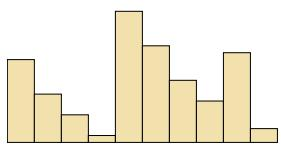  
(a) ??1(??)

[¶0623]
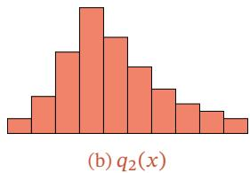

[¶0624]
$$
q _ { 1 }
$$

[¶0625]
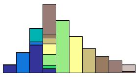  
图 E.1 Wasserstein 距离示例

[¶0626]
$$
q _ { 2 }
$$

[¶0627] Wasserstein距离相比KL散度和JS散度的优势在于：即使两个分布没有重叠或者重叠非常少，Wasserstein距离仍然能反映两个分布的远近

[¶0628] 对于ℝ?? 空间中的两个高斯分布 $p = \mathcal { N } ( \mu _ { 1 } , \Sigma _ { 1 } )$ 和 $q = \mathcal { N } ( \mu _ { 2 } , \Sigma _ { 2 } )$ ，它们的2nd-Wasserstein 距离为

[¶0629]
$$
W _ { 2 } ( p , q ) = | | { \mu } _ { 1 } - { \mu } _ { 2 } | | _ { 2 } ^ { 2 } + \mathrm { t r } \left( \Sigma _ { 1 } + \Sigma _ { 2 } - 2 \Big ( \Sigma _ { 2 } ^ { 1 / 2 } \Sigma _ { 1 } \Sigma _ { 2 } ^ { 1 / 2 } \Big ) ^ { 1 / 2 } \right) .\tag{E.21}
$$

[¶0630] 当两个分布的方差为0时， $2 ^ { \mathrm { n d } }$ -Wasserstein 距离等价于欧氏距离

## E.4 总结和深入阅读

[¶0631] 本章比较简略地介绍了本书所需要的数学基础知识．若要深入了解这些知识，可以参考这些数学分支的专门书籍

[¶0632] 关于线性代数的知识可以参考《Introduction to Linear Algebra》[Strang, 2016]、《Differential Equations and Linear Algebra》[Strang, 2014] 或《Introduction to Applied Linear Algebra: Vectors, Matrices, and Least Squares》[Boyd et al., 2018]

[¶0633] 关于微积分的知识，可以参考《Calculus》[Stewart, 2011] 或《Thomas’ Cal-culus》[Thomas et al., 2005]

[¶0634] 关于数学优化的知识，可以参考《Numerical Optimization》[Nocedal et al.,2006] 和《Convex Optimization》[Boyd et al., 2014]

[¶0635] 关于概率论的知识，可以参考《数理统计学教程》[陈希孺, 2009b]或《概率 论与数理统计》[陈希孺,2009a]

[¶0636] 关于信息论的知识，可以参考《Information Theory, Inference, and Learn-ing Algorithms》[MacKay, 2003] 或《Elements of Information Theory》[Coveret al., 2006]

## 参考文献

[¶0637] 陈希孺, 2009. 概率论与数理统计[M]. 中国科学技术大学出版社.

[¶0638] 陈希孺, 2009. 数理统计学教程[M]. 中国科学技术大学出版社.

[¶0639] Boyd S, Vandenberghe L, 2018. Introduction to applied linear algebra: vectors, matrices, and least squares[M/OL]. Cambridge university press. http://vmls-book.stanford.edu/.

[¶0640] Boyd S P, Vandenberghe L, 2014. Convex optimization[M/OL]. Cambridge University Press. https: //web.stanford.edu/%7Eboyd/cvxbook/.

[¶0641] Cover T M, Thomas J A, 2006. Elements of information theory[M/OL]. 2nd edition. Wiley. http: //www.elementsofinformationtheory.com/.

[¶0642] MacKay D J C, 2003. Information theory, inference, and learning algorithms[M]. Cambridge University Press.

[¶0643] Nocedal J, Wright S J, 2006. Numerical optimization[M]. 2nd edition. Springer.

[¶0644] Rasmussen C E, 2003. Gaussian processes in machine learning[C/OL]//Bousquet O, von Luxburg U, Rätsch G. Lecture Notes in Computer Science: volume 3176 Advanced Lectures on Machine Learning, ML Summer Schools 2003, Canberra, Australia, February 2-14, 2003, Tübingen, Germany, August 4-16, 2003, Revised Lectures. Springer: 63-71. https://doi.org/10.1007/978-3-540- 28650-9\_4.

[¶0645] Stewart J, 2011. Calculus[M]. Cengage Learning.

[¶0646] Strang G, 2014. Differential equations and linear algebra[M/OL]. Wellesley-Cambridge Press. http: //math.mit.edu/dela.

[¶0647] Strang G, 2016. Introduction to linear algebra[M/OL]. 5th edition. Wellesley-Cambridge Press. http://math.mit.edu/linearalgebra.

[¶0648] Thomas G B, Weir M D, Hass J, et al., 2005. Thomas’ calculus[M]. Addison-Wesley.
